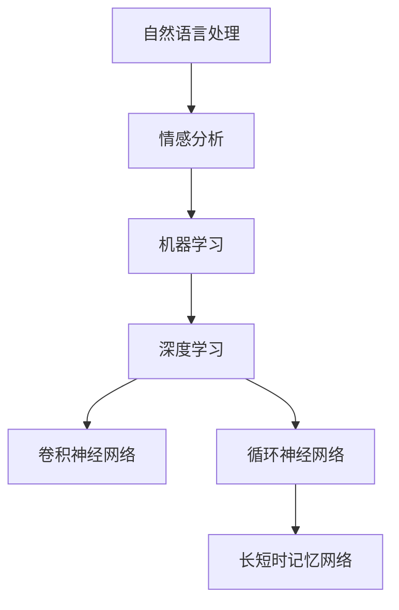

                 

# 联系用户：建立情感纽带

在数字化时代，企业与用户之间的情感联系成为竞争的核心。通过人工智能技术的加持，可以更有效地理解用户需求，提升用户体验，增强用户粘性。本文将探讨如何通过人工智能技术，特别是基于自然语言处理(NLP)和情感分析技术，建立用户与品牌之间的情感纽带。

## 1. 背景介绍

### 1.1 问题由来

随着互联网的普及，企业越来越多地依赖在线渠道与用户互动。在纷繁复杂的互联网环境中，用户对品牌的认知和忠诚度受到多方面的影响，包括产品质量、价格、服务态度等。传统的人工调查和数据分析方法难以实时、全面地获取用户情感信息。因此，企业需要更加智能化的工具，深入理解用户情感变化，从而提供更精准的服务。

### 1.2 问题核心关键点

情感分析作为NLP技术的重要分支，旨在识别和提取文本中的情感信息，判断文本的情感倾向。其核心问题包括：

- 如何准确识别文本情感
- 如何评估文本情感强度
- 如何综合多源数据构建情感认知模型
- 如何基于用户情感实时调整策略

### 1.3 问题研究意义

情感分析不仅帮助企业洞察用户情感，提升客户服务质量，还能在市场调研、品牌管理、危机应对等方面提供有力支持。通过情感分析，企业能够更细致地了解用户需求，及时响应市场变化，增强用户信任感，提升品牌价值。

## 2. 核心概念与联系

### 2.1 核心概念概述

本节将介绍几个关键概念及其联系：

- **自然语言处理(Natural Language Processing, NLP)**：研究如何使计算机理解、解释和生成人类语言的技术。NLP是实现情感分析的基础。
- **情感分析(Affective Analysis)**：通过分析文本，识别其中的情感倾向（如积极、消极、中性），并量化情感强度。
- **机器学习(Machine Learning)**：利用数据训练模型，使其能够自动识别文本情感，并对新数据进行预测。
- **深度学习(Deep Learning)**：一种基于神经网络的机器学习范式，特别适用于处理复杂、高维度的数据。
- **卷积神经网络(Convolutional Neural Networks, CNN)**：一种常用于图像处理的深度学习模型，可以用于文本情感分类。
- **循环神经网络(Recurrent Neural Networks, RNN)**：一种能够处理序列数据的深度学习模型，适用于情感分析中的序列情感标注。
- **长短时记忆网络(Long Short-Term Memory Networks, LSTM)**：一种RNN的变体，能够捕捉长序列依赖，适合于处理长文本情感分析。

这些概念之间的联系通过以下Mermaid流程图展示：



这个流程图展示了从自然语言处理到情感分析的基本流程。自然语言处理技术帮助将文本转换为机器可以理解的形式，情感分析则基于机器学习算法，利用深度学习模型对文本情感进行识别和分类。

## 3. 核心算法原理 & 具体操作步骤
### 3.1 算法原理概述

情感分析的算法原理主要基于机器学习模型，特别是深度学习模型。其核心目标是构建一个情感分类器，能够对文本数据进行情感标注。

### 3.2 算法步骤详解

情感分析的主要步骤如下：

1. **数据预处理**：清洗文本数据，去除停用词、标点符号等噪声，并进行分词、词性标注。
2. **特征提取**：将文本转化为数值特征向量，常用的方法有词袋模型、TF-IDF、词向量等。
3. **模型训练**：使用标注数据训练情感分类器，常用的模型有朴素贝叶斯、支持向量机、逻辑回归等。对于深度学习模型，则使用卷积神经网络、循环神经网络或长短时记忆网络进行训练。
4. **模型评估**：在测试集上评估模型性能，常用的评估指标有准确率、召回率、F1-score等。
5. **情感强度评估**：通过模型预测情感极性后，进一步评估情感强度，常用的方法有情感词典、情感极性强度回归等。

### 3.3 算法优缺点

情感分析的主要优点包括：

- **自动化**：通过训练模型，能够自动进行情感分析，降低人工成本。
- **实时性**：模型可以在线实时处理新数据，快速获取用户情感。
- **普适性**：适用于不同领域和不同语言的文本情感分析。

主要缺点包括：

- **数据依赖**：模型的性能高度依赖于训练数据的质量和数量。
- **上下文理解**：模型难以理解文本中的隐含语义和上下文信息。
- **情感词典局限**：情感词典的覆盖率和准确性可能影响情感分析结果。

### 3.4 算法应用领域

情感分析在多个领域有广泛应用，例如：

- **客户服务**：实时监测用户反馈，及时调整服务策略，提升用户体验。
- **市场调研**：分析消费者对产品或品牌的情感倾向，指导市场策略。
- **品牌管理**：监控品牌在社交媒体上的情感表现，评估品牌形象。
- **危机应对**：监测负面情感信息，及时采取应对措施，减少品牌损失。

## 4. 数学模型和公式 & 详细讲解

### 4.1 数学模型构建

情感分析的数学模型主要基于情感分类任务。假设训练集为 $D=\{(x_i,y_i)\}_{i=1}^N$，其中 $x_i$ 为文本，$y_i$ 为情感标签。

定义情感分类器的目标函数为：

$$
\min_{\theta} \sum_{i=1}^N \ell(y_i,f_\theta(x_i))
$$

其中 $\ell$ 为损失函数，$f_\theta(x)$ 为模型的预测函数。

### 4.2 公式推导过程

以朴素贝叶斯分类器为例，其目标函数可以表示为：

$$
\min_{\theta} \sum_{i=1}^N \log \frac{p(y_i|x_i)}{p(y_i)}
$$

其中 $p(y_i)$ 为情感类别 $y_i$ 的先验概率，$p(y_i|x_i)$ 为条件概率，即模型在给定文本 $x_i$ 下预测情感类别 $y_i$ 的概率。

对于深度学习模型，如卷积神经网络（CNN），其预测函数可以表示为：

$$
f_\theta(x) = \sigma(\sum_{k=1}^K \sum_{i=1}^n w_k^{(i)}x_i + b_k)
$$

其中 $\sigma$ 为激活函数，$w_k^{(i)}$ 和 $b_k$ 为卷积核参数和偏置项。

### 4.3 案例分析与讲解

以下以情感分类为例，介绍情感分析的实际应用。

假设有一个电子商务网站，需要分析用户对产品的评价。首先，从评论数据中提取特征，例如评价中的关键词、情感词汇等。然后，使用卷积神经网络对这些特征进行训练，预测评论的情感极性。最后，根据情感极性评估情感强度，如积极情感的程度。

## 5. 项目实践：代码实例和详细解释说明

### 5.1 开发环境搭建

开发环境需要安装Python、Pandas、NumPy、Scikit-Learn等库。安装方法可以参考Python官方文档。

### 5.2 源代码详细实现

以下是一个简单的情感分析代码示例：

```python
import pandas as pd
from sklearn.feature_extraction.text import TfidfVectorizer
from sklearn.model_selection import train_test_split
from sklearn.linear_model import LogisticRegression
from sklearn.metrics import accuracy_score

# 读取数据集
df = pd.read_csv('reviews.csv')

# 数据预处理
df = df.dropna()
df = df.drop_duplicates()
df = df.reset_index(drop=True)

# 特征提取
vectorizer = TfidfVectorizer(stop_words='english', max_features=2000)
X = vectorizer.fit_transform(df['review_text'])
y = df['label']

# 划分训练集和测试集
X_train, X_test, y_train, y_test = train_test_split(X, y, test_size=0.2, random_state=42)

# 模型训练
model = LogisticRegression()
model.fit(X_train, y_train)

# 模型评估
y_pred = model.predict(X_test)
print(accuracy_score(y_test, y_pred))
```

### 5.3 代码解读与分析

该示例使用了朴素贝叶斯分类器对产品评论进行情感分类。首先，使用TfidfVectorizer对评论进行特征提取，使用朴素贝叶斯模型进行训练和预测，最后评估模型的准确率。

## 6. 实际应用场景

### 6.1 智能客服

智能客服系统可以通过情感分析技术，实时监测用户情感，及时调整服务策略。例如，在客户表达不满时，自动转接至人工客服，提供更专业的解决方案。

### 6.2 市场调研

在市场调研中，情感分析可以帮助企业了解消费者对产品的情感倾向，指导产品开发和市场推广。例如，通过分析社交媒体上的情感信息，评估新产品的市场接受度。

### 6.3 品牌管理

品牌管理中，情感分析可以监控品牌在社交媒体上的情感表现，评估品牌形象。例如，通过情感分析，及时发现负面评论，采取应对措施，提升品牌声誉。

### 6.4 危机应对

在危机事件中，情感分析可以帮助企业快速响应负面情感信息，采取有效措施，减少品牌损失。例如，通过分析社交媒体上的情感信息，及时调整应对策略。

## 7. 工具和资源推荐

### 7.1 学习资源推荐

- 《自然语言处理综论》：李军著，详细介绍了NLP技术的原理和应用。
- 《Python机器学习》：Sebastian Raschka著，介绍了Python在机器学习中的应用。
- 《深度学习》：Ian Goodfellow著，详细介绍了深度学习的基本原理和应用。
- Kaggle：提供丰富的情感分析竞赛和数据集，适合实战练习。
- Coursera：提供多个NLP相关的在线课程，适合系统学习。

### 7.2 开发工具推荐

- Python：常用的NLP编程语言，易于学习，拥有丰富的第三方库。
- Pandas：数据处理和分析工具，适合处理大规模文本数据。
- NumPy：数值计算库，适合进行特征提取和模型训练。
- Scikit-Learn：机器学习库，包含多种分类器、回归器等。
- TensorFlow：深度学习框架，支持卷积神经网络、循环神经网络等。
- PyTorch：深度学习框架，支持动态计算图，易于调试和部署。

### 7.3 相关论文推荐

- Sentiment Analysis with Deep Learning：Thomas Mikolov等，提出了基于深度学习的情感分析方法。
- Emotion Analysis in Customer Service：Oliver von Eitzen等，研究了情感分析在客户服务中的应用。
- A Survey of Sentiment Analysis Techniques and Applications：Jian F. Deng等，综述了情感分析的多种技术和应用。

## 8. 总结：未来发展趋势与挑战

### 8.1 研究成果总结

情感分析技术经过多年的发展，已经成为NLP领域的重要分支。其应用范围广泛，技术水平不断提升。未来，情感分析将结合更多先进的算法和数据源，提升模型的准确率和鲁棒性。

### 8.2 未来发展趋势

1. **多模态情感分析**：结合图像、视频等多模态数据，提升情感分析的准确性。
2. **上下文理解**：利用语言模型、预训练模型等技术，增强模型对上下文的理解能力。
3. **实时性**：利用流式处理和分布式计算技术，实现实时情感分析。
4. **情感强度评估**：引入更先进的情感强度评估方法，提升情感分析的粒度。
5. **跨语言情感分析**：开发跨语言情感分析模型，提升情感分析的普适性。

### 8.3 面临的挑战

1. **数据质量**：高质量标注数据难以获取，影响模型的训练效果。
2. **上下文理解**：模型难以理解文本中的隐含语义和上下文信息。
3. **跨领域适应**：不同领域的文本具有不同的情感表达方式，模型难以通用。
4. **情感词典局限**：情感词典的覆盖率和准确性可能影响情感分析结果。
5. **实时性要求**：需要高效的算法和计算资源，实现实时情感分析。

### 8.4 研究展望

未来的情感分析研究将结合更多先进技术，如语言模型、预训练模型、多模态学习等，提升模型的准确性和鲁棒性。同时，将更多地关注模型的可解释性和实用性，提高情感分析在实际应用中的效果。

## 9. 附录：常见问题与解答

**Q1：情感分析如何避免情感词典局限？**

A: 可以通过结合语料库训练情感分类器，避免对情感词典的过度依赖。例如，使用情感分类器对大量文本进行训练，提取其中的情感词汇和表达方式，作为模型的一部分。

**Q2：情感分析的实时性如何提升？**

A: 可以利用流式处理和分布式计算技术，实现实时情感分析。例如，使用Apache Kafka和Apache Flink等流式处理框架，将文本数据实时输入模型，进行情感分析。

**Q3：情感分析的上下文理解如何增强？**

A: 可以通过结合语言模型和预训练模型，增强模型的上下文理解能力。例如，使用BERT、GPT等预训练模型，对文本进行语义表示，提高模型的上下文理解能力。

**Q4：情感分析的多模态应用如何实现？**

A: 可以利用深度学习模型，结合图像、视频等多模态数据，提升情感分析的准确性。例如，使用卷积神经网络对图像进行情感分类，结合文本情感分析，实现多模态情感分析。

**Q5：情感分析的情感强度评估如何改进？**

A: 可以通过引入更先进的情感强度评估方法，提升情感分析的粒度。例如，结合情感极性强度回归，对情感强度进行预测，提高情感分析的精度。

---

作者：禅与计算机程序设计艺术 / Zen and the Art of Computer Programming

