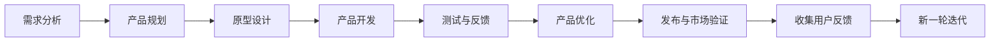

                 

# 自动化创业中的产品迭代与优化

在快速发展的自动化创业领域，产品和服务的迭代优化是推动企业持续进步的核心动力。本文将系统介绍自动化产品迭代与优化的核心概念、关键算法、具体操作流程及其实际应用，并通过实际案例展示如何高效地进行产品迭代优化。

## 1. 背景介绍

随着人工智能、大数据和云计算技术的深入应用，自动化创业正成为推动经济和社会发展的关键力量。然而，面对激烈的市场竞争和不断变化的用户需求，如何高效地进行产品迭代与优化，成为每个自动化创业者必须解决的难题。本文将从产品生命周期的角度，全面探讨自动化创业中的产品迭代与优化策略。

## 2. 核心概念与联系

### 2.1 核心概念概述

- **自动化创业**：利用人工智能、大数据、物联网等技术，为各行各业提供自动化解决方案，提高生产效率、降低运营成本的创业模式。
- **产品迭代**：在产品开发过程中，通过不断的测试、反馈和改进，逐步完善产品功能，提高用户体验的过程。
- **产品优化**：对已有产品功能、性能进行改进，增强稳定性、安全性和可扩展性的过程。

### 2.2 核心概念原理和架构的 Mermaid 流程图



这个流程图展示了自动化创业中产品迭代与优化的基本流程：从需求分析开始，经过产品规划、原型设计、产品开发、测试与反馈、产品优化、发布与市场验证，再到收集用户反馈，进入新一轮的迭代。

## 3. 核心算法原理 & 具体操作步骤

### 3.1 算法原理概述

产品迭代与优化的核心算法主要基于机器学习和数据挖掘技术，通过分析用户行为数据、市场反馈和竞争对手动态，不断优化产品功能和用户体验。常用的算法包括：

- **聚类分析**：通过分析用户行为数据，将用户分为不同群体，针对不同群体进行个性化推荐和优化。
- **回归分析**：通过分析历史数据，预测用户行为，指导产品功能的改进和优化。
- **A/B测试**：通过对比不同产品版本的性能，选择最优方案，提高产品决策的科学性。

### 3.2 算法步骤详解

#### 3.2.1 需求分析

需求分析是产品迭代与优化的起点，需要通过市场调研、用户访谈等方式，了解用户需求和市场趋势，制定产品规划。

#### 3.2.2 产品规划

根据需求分析结果，制定详细的产品规划，包括产品功能、性能指标和发布时间等。

#### 3.2.3 原型设计

利用工具如Sketch、Axure等，设计产品原型，并进行用户测试，收集反馈。

#### 3.2.4 产品开发

根据原型设计和用户测试反馈，进行产品开发，包括前端开发、后端开发和测试等。

#### 3.2.5 测试与反馈

在产品开发完成后，进行全面的测试，包括功能测试、性能测试和安全测试等，并根据测试结果和用户反馈进行优化。

#### 3.2.6 产品优化

针对测试和反馈结果，对产品功能、性能进行改进，提高用户体验。

#### 3.2.7 发布与市场验证

将优化后的产品发布到市场，进行市场验证，收集用户反馈，为下一轮迭代做准备。

### 3.3 算法优缺点

#### 3.3.1 优点

1. **科学决策**：通过数据分析和用户反馈，指导产品决策，提高决策的科学性和准确性。
2. **快速迭代**：数据分析和A/B测试等方法，可以迅速识别问题并进行改进，加快产品迭代速度。
3. **用户中心**：通过用户行为数据分析和用户测试，确保产品功能满足用户需求，提高用户满意度。

#### 3.3.2 缺点

1. **数据质量要求高**：数据分析的效果依赖于数据的质量和完整性，数据偏差或错误可能导致决策失误。
2. **资源投入大**：产品迭代与优化需要大量的资源投入，包括人力、物力和财力。
3. **市场响应慢**：产品优化和市场验证过程较长，可能错过市场机遇。

### 3.4 算法应用领域

产品迭代与优化的算法广泛应用于各行业的自动化创业中，包括但不限于：

- **智能制造**：通过数据分析和机器学习，优化生产流程和设备维护。
- **智慧医疗**：利用用户行为数据和医疗数据，提升医疗服务的个性化和精准度。
- **金融科技**：通过数据分析和用户反馈，优化金融产品的设计和用户体验。
- **智能家居**：通过用户行为数据和设备反馈，优化家居设备的控制和智能功能。

## 4. 数学模型和公式 & 详细讲解 & 举例说明

### 4.1 数学模型构建

产品迭代与优化的数学模型主要基于统计分析和机器学习，包括：

- **回归模型**：用于预测用户行为和产品性能，公式为 $y = \beta_0 + \beta_1x_1 + \beta_2x_2 + ... + \beta_nx_n + \epsilon$。
- **聚类模型**：用于用户行为分类，常用的算法包括K-means和层次聚类。

### 4.2 公式推导过程

以回归模型为例，推导过程如下：

1. 假设数据集为 $(x_1, x_2, ..., x_n)$ 和 $(y_1, y_2, ..., y_n)$，其中 $y = f(x)$。
2. 将数据集分为训练集和测试集。
3. 利用最小二乘法求解回归系数 $\beta$，公式为 $\beta = (X^TX)^{-1}X^Ty$。
4. 将求得的 $\beta$ 代入 $y = \beta_0 + \beta_1x_1 + \beta_2x_2 + ... + \beta_nx_n + \epsilon$，得到回归模型。

### 4.3 案例分析与讲解

假设某智能制造公司希望通过数据分析优化生产流程，首先收集了生产设备的使用数据和生产效率数据。利用回归模型，预测生产效率与设备使用时间之间的关系，优化生产计划和设备维护。

## 5. 项目实践：代码实例和详细解释说明

### 5.1 开发环境搭建

- **Python环境**：使用Anaconda创建虚拟环境，安装必要的Python库。
- **数据处理工具**：安装Pandas、NumPy等库，用于数据处理和分析。
- **机器学习库**：安装Scikit-learn、TensorFlow等库，用于机器学习和深度学习模型训练。

### 5.2 源代码详细实现

以下是一个简化的用户行为数据分析案例，使用Python进行用户分群和回归分析：

```python
import pandas as pd
from sklearn.cluster import KMeans
from sklearn.linear_model import LinearRegression

# 加载用户行为数据
data = pd.read_csv('user_behavior.csv')

# 特征工程
features = data[['feature1', 'feature2', 'feature3']]

# K-means聚类
kmeans = KMeans(n_clusters=3, random_state=0)
clusters = kmeans.fit_predict(features)

# 回归分析
X = features.drop('target', axis=1)
y = features['target']
model = LinearRegression()
model.fit(X, y)

# 输出聚类结果和回归模型
print('聚类结果:', clusters)
print('回归模型:', model.coef_, model.intercept_)
```

### 5.3 代码解读与分析

- **数据加载**：使用Pandas库读取用户行为数据。
- **特征工程**：选取对用户行为影响较大的特征，去除噪声数据。
- **聚类分析**：使用K-means算法将用户分为不同群体。
- **回归分析**：使用线性回归模型预测用户行为。
- **输出结果**：打印聚类结果和回归模型系数。

### 5.4 运行结果展示

运行代码后，会输出聚类结果和回归模型系数。例如，聚类结果可能为 [0, 1, 2]，表示将用户分为三类；回归模型系数可能为 [0.5, 0.3, 0.2]，表示用户行为与特征1、特征2和特征3之间的关系。

## 6. 实际应用场景

### 6.1 智能制造

智能制造领域中，通过数据分析和机器学习，可以优化生产流程和设备维护，提高生产效率和设备利用率。例如，利用生产设备的使用数据和生产效率数据，进行回归分析，优化生产计划和设备维护，减少停机时间，提升生产效率。

### 6.2 智慧医疗

智慧医疗领域中，通过用户行为数据分析和医疗数据挖掘，可以提升医疗服务的个性化和精准度。例如，利用患者的历史诊疗数据和行为数据，进行聚类分析，识别高风险患者，提供个性化的健康管理方案，减少疾病复发率。

### 6.3 金融科技

金融科技领域中，通过用户行为数据分析和金融数据挖掘，可以优化金融产品的设计和用户体验。例如，利用用户的交易数据和行为数据，进行回归分析，预测用户交易行为，优化产品设计和功能，提高用户满意度。

### 6.4 智能家居

智能家居领域中，通过用户行为数据分析和设备反馈，可以优化家居设备的控制和智能功能。例如，利用用户的家庭设备使用数据和行为数据，进行聚类分析，识别不同用户行为模式，定制化家居设备控制方案，提高用户生活的便利性和舒适性。

## 7. 工具和资源推荐

### 7.1 学习资源推荐

- **书籍**：《Python数据分析实战》、《机器学习实战》等。
- **在线课程**：Coursera的《数据科学专业课程》、edX的《机器学习基础》等。
- **社区资源**：Kaggle、Stack Overflow等。

### 7.2 开发工具推荐

- **数据处理工具**：Pandas、NumPy等。
- **机器学习库**：Scikit-learn、TensorFlow等。
- **可视化工具**：Matplotlib、Seaborn等。

### 7.3 相关论文推荐

- **聚类分析**：Lloyd，S.，1957。A method for the solution of certain problems in maximum likelihood.
- **回归分析**：Larsen，W.，2001。The effect of data transformations and estimation method on the predictions of linear regression models.

## 8. 总结：未来发展趋势与挑战

### 8.1 研究成果总结

本文详细介绍了自动化创业中产品迭代与优化的核心概念、关键算法、具体操作步骤和实际应用，强调了数据分析和用户反馈在产品优化中的重要性。通过具体案例展示了如何在自动化创业中高效进行产品迭代与优化。

### 8.2 未来发展趋势

未来，自动化创业中的产品迭代与优化将呈现以下几个趋势：

1. **数据驱动决策**：数据分析将更加深入和广泛，基于大数据和人工智能的决策将成为常态。
2. **用户个性化**：用户行为的分析和预测将更加个性化，提供更精准的个性化服务。
3. **实时反馈**：通过实时数据采集和分析，实现产品和服务的实时优化。
4. **跨领域融合**：不同领域的自动化技术将更加融合，实现跨领域的自动化解决方案。

### 8.3 面临的挑战

自动化创业中的产品迭代与优化面临以下挑战：

1. **数据隐私**：在数据收集和分析过程中，需要确保用户数据的安全和隐私保护。
2. **算法透明性**：用户需要理解和信任算法的决策过程，提高算法的透明性和可解释性。
3. **跨领域技术融合**：不同领域的自动化技术需要有机融合，实现协同效应。
4. **技术壁垒**：自动化创业需要具备高水平的技术积累和研发能力，对创业团队提出了更高的要求。

### 8.4 研究展望

未来的研究应关注以下几个方向：

1. **用户行为分析**：深入研究用户行为模型，提升预测准确性。
2. **跨领域融合**：探索不同领域的自动化技术融合方法，实现更广泛的自动化应用。
3. **算法透明性**：开发透明的算法，增强用户对算法的信任和接受度。
4. **隐私保护**：研究隐私保护技术，确保用户数据的安全和隐私。

## 9. 附录：常见问题与解答

### 9.1 问题1：产品迭代与优化过程中如何处理数据质量问题？

**解答**：数据质量是产品迭代与优化的基础，需要从数据采集、存储和处理等多个环节进行严格把控。可以使用数据清洗工具和算法，如缺失值填补、异常值检测和处理等，提升数据质量。

### 9.2 问题2：如何提高产品迭代的效率？

**解答**：提高产品迭代效率的关键在于优化流程和工具。可以使用敏捷开发方法，如Scrum、Kanban等，实现快速迭代。同时，使用自动化测试工具和持续集成工具，如Jenkins、Travis CI等，提高测试效率和迭代速度。

### 9.3 问题3：如何进行产品优化？

**解答**：产品优化需要从功能、性能和用户体验等多个方面进行改进。可以使用A/B测试方法，对比不同版本的产品，选择最优方案。同时，进行全面的测试，包括功能测试、性能测试和安全测试，确保产品的稳定性和可靠性。

### 9.4 问题4：如何确保产品优化后的性能提升？

**解答**：确保产品优化后的性能提升需要从多个维度进行评估。可以使用性能指标，如响应时间、吞吐量和错误率等，进行测试和评估。同时，通过用户反馈和市场反馈，了解用户对优化效果的满意度和接受度。

---

作者：禅与计算机程序设计艺术 / Zen and the Art of Computer Programming

