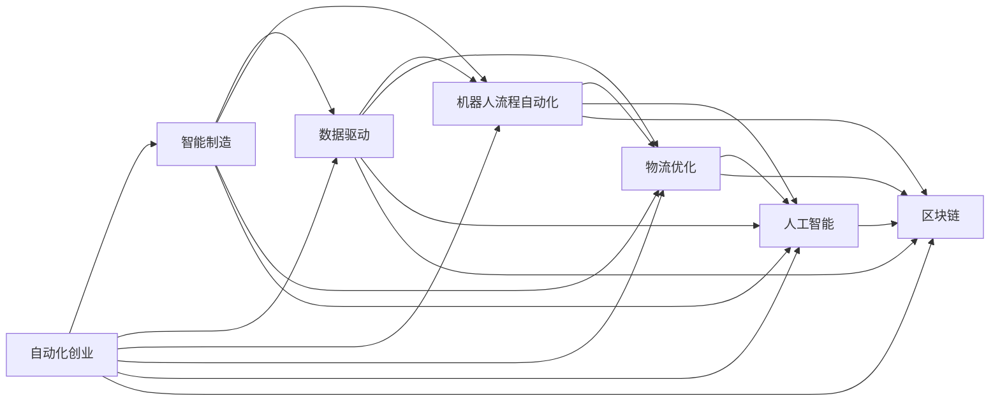

                 

# 自动化创业中的供应链管理

> 关键词：自动化创业, 供应链管理, 智能制造, 数据驱动, 机器人流程自动化, 物流优化, 人工智能, 区块链

## 1. 背景介绍

在当前数字化时代，创业环境日益激烈，如何在竞争中脱颖而出成为了众多创业者的关键。在这个背景下，传统的管理模式逐渐显现出其局限性，尤其是对于供应链管理这一环节。供应链管理的自动化、智能化，不仅可以提高企业的运营效率，还能提升企业的竞争力，因此成为了自动化创业中至关重要的一环。

### 1.1 传统供应链管理的问题

传统的供应链管理通常依赖于人工操作，这导致了许多问题：

1. **效率低下**：人工操作效率低，出错率高，延误交货的情况时有发生。
2. **库存管理不当**：库存水平过高或过低都会对企业的运营成本造成不利影响。
3. **信息孤岛**：不同部门之间信息共享不充分，导致数据分散，难以形成有效的决策支持。
4. **成本控制困难**：人工操作难以准确控制成本，容易出现浪费。

这些问题直接影响了企业的运营效率和盈利能力。因此，引入自动化和智能化技术，进行供应链管理的创新，是企业竞争力的重要保障。

### 1.2 供应链管理的现状与趋势

当前，全球供应链管理正处于数字化转型阶段，智能制造、工业互联网、大数据、人工智能、区块链等新技术的引入，正在改变传统的供应链管理模式。自动化和智能化成为供应链管理的发展趋势，这不仅提升了管理效率，还降低了成本，增加了供应链的透明度。

新技术的引入，使得企业能够更好地应对市场变化，提高供应链的灵活性和响应速度。在自动化创业的背景下，如何利用这些新技术进行供应链管理，成为了一个重要的研究方向。

## 2. 核心概念与联系

### 2.1 核心概念概述

为了更好地理解自动化创业中的供应链管理，我们首先介绍几个核心概念：

- **自动化创业**：利用自动化和智能化技术，结合互联网和人工智能等先进技术，实现创业过程的自动化，提高效率和降低成本。
- **供应链管理**：涉及物料采购、库存管理、生产制造、物流配送等环节的管理，确保企业能够高效、低成本地完成产品从原料到交付的整个过程。
- **智能制造**：通过工业互联网、物联网等技术，将传统制造流程进行智能化改造，实现生产过程的自动化和智能化。
- **数据驱动**：利用大数据和人工智能等技术，对供应链中的海量数据进行分析和挖掘，实现决策的精准化和自动化。
- **机器人流程自动化**（RPA）：通过机器人自动化软件，模拟人工操作，实现重复性高的任务自动化。
- **物流优化**：利用算法和模型，对物流路线、仓储、运输等进行优化，降低物流成本，提高配送效率。
- **人工智能**：包括机器学习、深度学习、自然语言处理等技术，实现供应链中的预测、优化、决策等任务。
- **区块链**：利用区块链技术，提高供应链的透明度和安全性，实现供应链的追溯和透明。

这些概念之间相互联系，构成了供应链管理的自动化和智能化体系。

### 2.2 核心概念原理和架构的 Mermaid 流程图



这个流程图展示了自动化创业与供应链管理的核心概念及其相互联系。各个概念之间相互协同，共同构成了供应链管理的自动化和智能化体系。

## 3. 核心算法原理 & 具体操作步骤

### 3.1 算法原理概述

基于自动化创业的供应链管理，主要涉及以下几个核心算法：

1. **需求预测算法**：利用历史销售数据，结合时序分析、机器学习等技术，对未来的需求进行预测，以指导库存管理和生产计划。
2. **库存优化算法**：通过需求预测结果，结合库存成本模型，对库存水平进行优化，确保库存成本最低。
3. **生产调度算法**：根据需求预测结果和生产能力，结合时序分析和优化算法，确定生产计划，确保生产过程的高效进行。
4. **物流优化算法**：利用路径规划、车辆调度等算法，对物流路线和配送进行优化，降低物流成本，提高配送效率。
5. **区块链追溯算法**：通过区块链技术，实现供应链各环节的信息追溯，确保供应链的透明和可追溯性。

这些算法在供应链管理中扮演着重要角色，能够显著提升供应链管理的效率和精度。

### 3.2 算法步骤详解

下面以需求预测算法为例，详细介绍其操作步骤：

1. **数据收集**：收集历史销售数据、市场趋势、季节性因素等，构建数据集。
2. **数据预处理**：对数据进行清洗、归一化等预处理操作，确保数据质量。
3. **特征工程**：提取数据中的关键特征，如销售趋势、季节性变化、节假日影响等。
4. **模型选择**：选择适合的数据预测模型，如ARIMA、LSTM等，进行模型训练。
5. **模型训练**：利用历史数据对模型进行训练，优化模型参数。
6. **模型评估**：使用交叉验证等方法，对模型进行评估，选择最优模型。
7. **预测应用**：利用训练好的模型，对未来的需求进行预测，指导库存管理和生产计划。

### 3.3 算法优缺点

自动化创业中的供应链管理算法，具有以下优点：

- **高效率**：自动化算法能够高效处理海量数据，提供快速准确的预测结果。
- **高精度**：利用机器学习等技术，提高了预测的精度，减少了人为误差。
- **低成本**：通过自动化算法，减少了人工干预，降低了人力成本。

但同时，这些算法也存在一些缺点：

- **依赖数据质量**：算法的预测结果依赖于数据的质量和完整性，数据偏差会影响预测效果。
- **模型复杂度**：复杂的模型可能需要进行较长的训练和优化，增加了计算成本。
- **算法可解释性不足**：某些算法（如深度学习）可能难以解释其内部工作机制，增加了模型的可解释性问题。

### 3.4 算法应用领域

这些算法广泛应用于各个领域，包括：

- **制造业**：利用需求预测算法和生产调度算法，实现智能制造。
- **零售业**：利用库存优化算法和物流优化算法，提高库存管理和配送效率。
- **电商行业**：利用供应链追溯算法，确保产品的安全性和透明性。
- **物流行业**：利用路径规划和车辆调度算法，提高物流配送效率。
- **农业**：利用需求预测和生产调度算法，优化农产品的供应链管理。

## 4. 数学模型和公式 & 详细讲解 & 举例说明

### 4.1 数学模型构建

供应链管理的自动化算法，通常基于数学模型进行构建。下面以需求预测算法为例，详细讲解其数学模型构建过程：

假设需求 $D_t$ 在时间 $t$ 的概率密度函数为 $p(D_t)$，预测目标为未来的需求 $D_{t+1}$，利用历史数据 $D_{t-1}, D_{t-2}, ..., D_1$ 构建预测模型。

定义模型参数为 $\theta$，则预测模型可以表示为：

$$
D_{t+1} = f(D_t, \theta)
$$

其中 $f$ 为预测函数，$D_{t+1}$ 为预测结果，$\theta$ 为模型参数。

### 4.2 公式推导过程

以ARIMA模型为例，进行需求预测的公式推导：

**自回归模型 (AR)**：

$$
D_t = \phi_1 D_{t-1} + \phi_2 D_{t-2} + ... + \phi_p D_{t-p} + \epsilon_t
$$

**差分模型 (I)**：

$$
\Delta D_t = D_t - D_{t-1}
$$

**移动平均模型 (MA)**：

$$
\epsilon_t = \theta_1 \epsilon_{t-1} + \theta_2 \epsilon_{t-2} + ... + \theta_q \epsilon_{t-q}
$$

将上述模型结合起来，得到ARIMA模型：

$$
D_t = \phi_1 D_{t-1} + \phi_2 D_{t-2} + ... + \phi_p D_{t-p} + \epsilon_t
$$

$$
\epsilon_t = \theta_1 \epsilon_{t-1} + \theta_2 \epsilon_{t-2} + ... + \theta_q \epsilon_{t-q}
$$

$$
\Delta D_t = D_t - D_{t-1}
$$

其中 $\epsilon_t$ 为随机误差项，$D_t$ 为时间 $t$ 的需求，$p$ 和 $q$ 分别为自回归和移动平均的阶数。

### 4.3 案例分析与讲解

以某电商平台的订单需求预测为例，分析其需求预测算法的实现过程：

1. **数据收集**：收集历史订单数据，包括订单时间、订单金额、订单类型等。
2. **数据预处理**：对订单数据进行清洗、归一化等预处理操作。
3. **特征工程**：提取订单数据中的关键特征，如订单金额、订单类型、季节性变化等。
4. **模型训练**：利用历史订单数据，训练ARIMA模型，优化模型参数。
5. **模型评估**：使用交叉验证等方法，评估模型性能，选择最优模型。
6. **预测应用**：利用训练好的ARIMA模型，对未来的订单需求进行预测，指导库存管理和配送计划。

## 5. 项目实践：代码实例和详细解释说明

### 5.1 开发环境搭建

在进行供应链管理的自动化项目开发时，需要搭建合适的开发环境。以下是使用Python进行项目开发的环境配置流程：

1. 安装Anaconda：从官网下载并安装Anaconda，用于创建独立的Python环境。
2. 创建并激活虚拟环境：
```bash
conda create -n supply-chain python=3.8 
conda activate supply-chain
```
3. 安装Python开发环境：
```bash
conda install anaconda-client
```
4. 安装数据处理和分析库：
```bash
conda install pandas numpy matplotlib
```
5. 安装机器学习库：
```bash
conda install scikit-learn xgboost
```
6. 安装Web应用框架：
```bash
conda install flask
```
完成上述步骤后，即可在`supply-chain`环境中开始项目开发。

### 5.2 源代码详细实现

下面以一个简单的需求预测模型实现为例，给出使用Python进行需求预测的代码实现：

```python
import pandas as pd
from sklearn.metrics import mean_squared_error
from sklearn.linear_model import ARIMA
from sklearn.model_selection import train_test_split

# 数据读取
data = pd.read_csv('sales_data.csv')

# 数据处理
data['date'] = pd.to_datetime(data['date'])
data = data.set_index('date')

# 特征工程
features = ['date', 'sales']
X = data[features]

# 数据分割
train, test = train_test_split(X, test_size=0.2, random_state=42)

# 模型训练
model = ARIMA(train['sales'], order=(1, 1, 1))
model.fit(train)

# 模型预测
y_pred = model.forecast(steps=10)

# 模型评估
mse = mean_squared_error(test['sales'], y_pred)
print(f'MSE: {mse}')

# 输出预测结果
print(y_pred)
```

### 5.3 代码解读与分析

让我们再详细解读一下关键代码的实现细节：

**数据读取**：使用Pandas库读取CSV文件，构建数据集。

**数据处理**：将日期时间列转换为Pandas的DatetimeIndex，方便后续的日期时间处理。

**特征工程**：选择日期和销售额作为预测特征。

**数据分割**：将数据集分为训练集和测试集，用于模型训练和评估。

**模型训练**：使用ARIMA模型对训练集进行训练，优化模型参数。

**模型预测**：使用训练好的模型对未来10天的销售额进行预测。

**模型评估**：使用均方误差（MSE）评估模型预测结果，输出评估结果。

**输出预测结果**：输出模型预测的销售额，用于指导库存管理和配送计划。

## 6. 实际应用场景

### 6.1 制造业

在制造业中，供应链管理尤为重要。自动化创业可以利用智能制造技术，提高生产效率，降低成本。例如，利用工业互联网技术，实现生产设备的远程监控和维护，避免设备停机时间过长。同时，利用机器人流程自动化，进行自动化生产线管理，提高生产效率。

### 6.2 零售业

在零售业中，库存管理和配送是关键环节。利用需求预测算法，可以准确预测未来的销售需求，从而优化库存水平，降低库存成本。同时，利用物流优化算法，优化配送路线和运输方式，提高配送效率。

### 6.3 电商行业

在电商行业，供应链追溯和透明度尤为重要。利用区块链技术，可以构建供应链的追溯体系，确保产品的安全性和透明性。同时，利用人工智能技术，进行客户行为分析，推荐个性化产品，提高客户满意度。

### 6.4 未来应用展望

未来，自动化创业中的供应链管理将呈现以下几个发展趋势：

1. **人工智能与物联网的融合**：利用人工智能和大数据技术，对物联网设备采集的数据进行分析和挖掘，实现智能化的供应链管理。
2. **区块链与供应链的融合**：利用区块链技术，提高供应链的透明度和安全性，确保供应链的可追溯性。
3. **供应链的预测与优化**：利用机器学习和预测模型，对供应链进行预测和优化，提高供应链的灵活性和响应速度。
4. **供应链的数字化转型**：利用工业互联网、云计算等技术，实现供应链的数字化和智能化。
5. **供应链的智能化决策支持**：利用人工智能技术，实现供应链的智能化决策支持，提高供应链管理效率。

## 7. 工具和资源推荐

### 7.1 学习资源推荐

为了帮助开发者系统掌握供应链管理的自动化方法，这里推荐一些优质的学习资源：

1. 《供应链管理与自动化》系列博文：由供应链管理专家撰写，深入浅出地介绍了供应链管理的自动化技术，包括智能制造、机器学习、RPA等。
2. Coursera《供应链管理》课程：由斯坦福大学开设的供应链管理课程，系统介绍了供应链管理的各个环节和自动化技术。
3. 《供应链智能化管理》书籍：全面介绍了供应链管理的智能化技术，包括机器学习、区块链、物联网等。
4. GitHub供应链管理项目：提供了丰富的供应链管理项目和代码实现，可以参考和借鉴。
5. CSDN供应链管理技术论坛：专业的供应链管理技术社区，提供大量的技术文章和讨论。

通过对这些资源的学习实践，相信你一定能够快速掌握供应链管理的自动化方法，并用于解决实际的供应链管理问题。

### 7.2 开发工具推荐

高效的开发离不开优秀的工具支持。以下是几款用于供应链管理自动化开发的常用工具：

1. Python：用于数据处理和机器学习的脚本语言，具有丰富的科学计算和数据处理库。
2. Jupyter Notebook：用于数据处理和机器学习的交互式开发环境，支持代码编写和结果展示。
3. Anaconda：用于科学计算的Python发行版，提供了大量的科学计算和数据处理库。
4. Flask：用于Web应用开发的Python框架，方便构建供应链管理的数据可视化系统。
5. Tableau：用于数据可视化的工具，方便对供应链数据进行分析和展示。
6. TensorFlow：用于深度学习和人工智能开发的Python框架，方便构建智能化的供应链管理模型。

合理利用这些工具，可以显著提升供应链管理的自动化开发效率，加快创新迭代的步伐。

### 7.3 相关论文推荐

供应链管理的自动化技术发展迅速，以下是几篇奠基性的相关论文，推荐阅读：

1. "The Internet of Things: Principles and Paradigms"（物联网：原理与范式）：介绍了物联网技术在供应链管理中的应用，探讨了物联网的未来发展趋势。
2. "Artificial Intelligence for Supply Chain Management"（人工智能在供应链管理中的应用）：探讨了人工智能技术在供应链管理中的各种应用，包括需求预测、库存管理、物流优化等。
3. "Blockchain for Supply Chain Management: A Survey"（区块链在供应链管理中的应用：综述）：总结了区块链技术在供应链管理中的应用现状和未来发展趋势。
4. "Supply Chain Optimization with Machine Learning: A Review"（基于机器学习的供应链优化：综述）：总结了机器学习在供应链优化中的应用，探讨了各种优化算法和技术。
5. "Robotic Process Automation in Supply Chain Management"（供应链管理中的机器人流程自动化）：探讨了RPA在供应链管理中的应用，包括订单处理、库存管理等。

这些论文代表了供应链管理自动化技术的研究前沿，通过学习这些前沿成果，可以帮助研究者把握学科前进方向，激发更多的创新灵感。

## 8. 总结：未来发展趋势与挑战

### 8.1 总结

本文对自动化创业中的供应链管理进行了全面系统的介绍。首先阐述了自动化创业在当前环境下的重要性，明确了供应链管理在这一背景下的核心地位。其次，从原理到实践，详细讲解了供应链管理的自动化方法，包括智能制造、数据驱动、机器人流程自动化、物流优化、人工智能、区块链等。最后，通过案例分析与讲解，展示了这些方法在实际应用中的效果和潜力。

通过本文的系统梳理，可以看到，供应链管理的自动化方法正在成为自动化创业的重要支撑，极大地提升了企业的运营效率和竞争力。未来，伴随自动化和智能化技术的不断演进，供应链管理将进一步提升其智能化水平，为企业的数字化转型提供坚实保障。

### 8.2 未来发展趋势

展望未来，自动化创业中的供应链管理将呈现以下几个发展趋势：

1. **智能化与数字化的融合**：利用智能化技术和数字化工具，实现供应链管理的全面智能化，提高供应链的响应速度和灵活性。
2. **大数据与人工智能的融合**：利用大数据和人工智能技术，对供应链数据进行深度挖掘和分析，实现供应链管理的精准化和高效化。
3. **区块链与供应链的融合**：利用区块链技术，提高供应链的透明性和安全性，确保供应链的可追溯性。
4. **供应链的预测与优化**：利用机器学习和预测模型，对供应链进行预测和优化，提高供应链的灵活性和响应速度。
5. **供应链的数字化转型**：利用工业互联网、云计算等技术，实现供应链的数字化和智能化。

### 8.3 面临的挑战

尽管供应链管理的自动化技术已经取得了一定的进展，但在迈向更加智能化和数字化发展的过程中，仍然面临着诸多挑战：

1. **数据质量问题**：供应链管理的数据质量直接影响算法的预测和优化效果，数据偏差会导致预测结果不准确。
2. **技术成本高昂**：自动化技术需要高昂的技术投入，对于中小企业来说，初期投资成本较高。
3. **技术复杂度高**：供应链管理的自动化技术涉及多种技术手段，技术门槛较高，需要专业的技术团队支持。
4. **人员素质要求高**：自动化技术的应用需要高素质的技术团队和运营人员，对企业的组织和管理提出了新的要求。
5. **市场变化快**：市场环境的变化对供应链管理提出了新的要求，需要企业具备快速响应市场变化的能力。

### 8.4 研究展望

面对供应链管理自动化技术所面临的挑战，未来的研究需要在以下几个方面寻求新的突破：

1. **数据质量提升**：探索新的数据采集和处理技术，提高供应链数据的准确性和完整性。
2. **技术成本降低**：开发成本低廉、易于部署的自动化技术，降低企业的技术门槛和投资成本。
3. **技术普适性增强**：开发简单易用、易于推广的自动化技术，让更多企业能够快速应用。
4. **人员素质提升**：加强技术培训和人才引入，提升企业的技术和管理水平。
5. **市场响应速度加快**：提高供应链管理的灵活性和快速响应能力，更好地应对市场变化。

这些研究方向的探索，将引领供应链管理自动化技术的进一步发展，为企业的数字化转型提供更坚实的保障。相信在未来的研究中，将有更多创新性技术出现，推动供应链管理的自动化水平不断提升，为企业的智能化发展带来更多机遇。

## 9. 附录：常见问题与解答

**Q1：自动化创业中的供应链管理是否适用于所有企业？**

A: 自动化创业中的供应链管理主要适用于中大型企业，尤其是那些具备一定技术基础和管理能力的企业。中小企业在初期阶段，可能需要更多的技术支持和资源投入。

**Q2：如何选择合适的供应链管理自动化工具？**

A: 选择合适的供应链管理自动化工具需要考虑以下几个因素：
1. 工具的功能：根据企业的实际需求，选择功能齐全的工具，如需求预测、库存管理、物流优化等。
2. 技术的先进性：选择技术先进、易于部署的工具，减少技术门槛。
3. 成本效益：选择成本低廉、性价比高的工具，降低初期投入。
4. 易于使用：选择用户界面友好、操作简单的工具，提高使用效率。
5. 可扩展性：选择可扩展性强的工具，方便未来的技术升级和功能扩展。

**Q3：供应链管理自动化中的数据质量问题如何解决？**

A: 解决供应链管理自动化中的数据质量问题，需要从以下几个方面入手：
1. 数据清洗：对数据进行清洗、去重、归一化等预处理操作，确保数据质量。
2. 数据校验：引入数据校验机制，及时发现和纠正数据错误。
3. 数据标准化：统一数据格式和标准，提高数据的可比性和可分析性。
4. 数据采集：采用多种数据采集方法，确保数据的全面性和准确性。
5. 数据监控：实时监控数据质量，及时发现和解决数据问题。

**Q4：供应链管理自动化中的技术成本问题如何解决？**

A: 解决供应链管理自动化中的技术成本问题，需要从以下几个方面入手：
1. 选择合适的技术方案：选择成本低廉、易于部署的技术方案，降低初期投入。
2. 优化技术应用：对技术应用进行优化，减少资源消耗和维护成本。
3. 引入开源技术：使用开源技术，降低技术成本。
4. 采用云计算：利用云计算平台，降低技术投入和运维成本。
5. 分阶段实施：采用分阶段实施的方式，逐步引入自动化技术，减少一次性投入。

**Q5：供应链管理自动化中的技术复杂度问题如何解决？**

A: 解决供应链管理自动化中的技术复杂度问题，需要从以下几个方面入手：
1. 培训和技术支持：提供专业的技术培训和技术支持，提高团队的开发和运维能力。
2. 采用简单易用的工具：选择用户界面友好、操作简单的工具，降低技术门槛。
3. 分阶段实施：采用分阶段实施的方式，逐步引入自动化技术，减少一次性投入。
4. 引入自动化技术：采用自动化技术，减少人工干预，提高工作效率。
5. 优化技术方案：优化技术方案，提高技术应用的效率和可靠性。

通过这些措施，可以有效解决供应链管理自动化中的技术复杂度问题，推动自动化技术的全面应用。

**Q6：供应链管理自动化中的市场变化问题如何解决？**

A: 解决供应链管理自动化中的市场变化问题，需要从以下几个方面入手：
1. 数据驱动决策：利用数据驱动决策，及时发现和应对市场变化。
2. 灵活调整策略：根据市场变化，灵活调整供应链策略，确保供应链的灵活性和响应速度。
3. 快速响应机制：建立快速响应机制，确保供应链能够快速响应市场变化。
4. 持续改进：持续改进供应链管理方法，提高供应链的适应能力。
5. 技术创新：引入新的技术手段，提升供应链管理的智能化水平。

通过这些措施，可以有效解决供应链管理自动化中的市场变化问题，提高供应链的竞争力和市场适应能力。

---

作者：禅与计算机程序设计艺术 / Zen and the Art of Computer Programming

