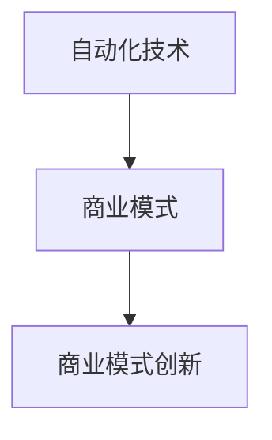
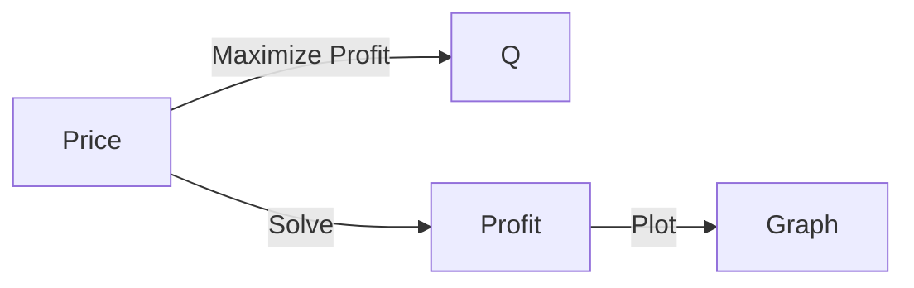

                 

# 自动化创业中的商业模式创新

在当今快速变化的技术和市场环境中，自动化创业成为了驱动经济增长和创造新机会的重要力量。自动化技术不仅能够提高生产效率、降低成本，还能开辟新的商业领域，引领产业变革。本文将深入探讨自动化创业中的商业模式创新，分析其原理与步骤，探讨其优缺点，并展望其应用领域。

## 1. 背景介绍

### 1.1 问题由来
随着科技的迅猛发展，特别是人工智能（AI）、大数据、云计算等技术的普及，自动化逐渐成为各行各业提高效率、降低成本、增强竞争力的关键手段。自动化创业项目通过利用先进的自动化技术，为不同领域提供解决方案，满足市场的需求。然而，在自动化创业中，如何创新商业模式以应对复杂的市场环境，提升自身竞争力，是一个值得深入探讨的问题。

### 1.2 问题核心关键点
在自动化创业中，商业模式创新涉及多个关键点，包括但不限于：
- **技术选择**：选择适合自动化项目的核心技术，如机器学习、自然语言处理、计算机视觉等。
- **市场定位**：确定目标市场和用户需求，制定明确的商业定位和策略。
- **盈利模式**：设计合理的盈利模式，如订阅制、按需付费、一次购买等。
- **用户界面**：设计直观、易用的用户界面，提升用户体验。
- **合作伙伴关系**：建立稳定的合作伙伴关系，扩大市场份额。

## 2. 核心概念与联系

### 2.1 核心概念概述

在自动化创业中，核心概念主要包括：
- **自动化技术**：利用机器学习、人工智能、自然语言处理等技术，实现业务流程自动化。
- **商业模式**：通过提供产品或服务，满足市场需求，实现商业价值的模式。
- **商业模式创新**：在现有商业模式的基础上，通过引入新技术、新模式，优化和创新商业流程，提升企业竞争力和盈利能力。

这些概念之间存在着紧密的联系，形成了一个闭环，如图示所示：



自动化技术是商业模式的创新基础，商业模式创新是自动化技术的市场实现，两者共同驱动自动化创业的成功。

### 2.2 核心概念原理和架构的 Mermaid 流程图


该流程图示意图表明，从市场需求出发，通过识别目标市场和用户需求，选择适合的自动化技术，设计产品/服务，实施商业模式，最后不断优化和创新商业模式。

## 3. 核心算法原理 & 具体操作步骤

### 3.1 算法原理概述

自动化创业中的商业模式创新，其核心算法原理可以概括为：
1. **需求分析**：通过数据收集和分析，识别目标市场需求和用户痛点。
2. **技术选择**：根据市场需求和技术趋势，选择合适的自动化技术。
3. **产品设计**：基于用户需求和选择的技术，设计满足市场需求的自动化产品或服务。
4. **商业模式设计**：定义合理的盈利模式和用户界面，提升用户体验和商业价值。
5. **持续优化**：根据市场反馈和用户需求，不断优化和创新商业模式。

### 3.2 算法步骤详解

1. **需求分析**：
   - **市场调研**：通过问卷调查、市场访谈、竞品分析等方法，收集用户需求数据。
   - **数据处理**：使用统计学和机器学习技术，对收集到的数据进行处理和分析。
   - **需求识别**：从数据中识别出用户的核心需求和痛点。

2. **技术选择**：
   - **技术评估**：对各类自动化技术进行评估，包括技术成熟度、成本效益等。
   - **技术选型**：根据评估结果，选择最适合项目需求的自动化技术。

3. **产品设计**：
   - **功能设计**：根据用户需求和技术选型，设计产品或服务的功能模块。
   - **用户体验**：设计直观、易用的用户界面，提升用户操作体验。

4. **商业模式设计**：
   - **盈利模式设计**：选择适合的盈利模式，如订阅制、按需付费、一次购买等。
   - **用户界面设计**：设计用户友好的界面，提升用户体验。

5. **持续优化**：
   - **市场反馈**：收集市场反馈和用户评价，评估商业模式的效果。
   - **优化策略**：根据反馈结果，优化商业模式和产品功能。
   - **创新设计**：引入新技术和新模式，设计创新的商业流程和产品形态。

### 3.3 算法优缺点

**优点**：
- **提升效率**：自动化技术能够大幅提高业务流程的效率，降低成本。
- **满足需求**：通过商业模式创新，能够更好地满足市场需求，提升用户满意度。
- **竞争力提升**：持续优化和创新，能够提升企业竞争力，抢占市场份额。

**缺点**：
- **技术复杂**：自动化技术的应用和优化需要较高的技术门槛和专业知识。
- **市场风险**：市场需求和技术趋势的变化，可能带来一定的市场风险。
- **用户接受度**：用户对新产品的接受度和适应度，可能影响商业模式的效果。

### 3.4 算法应用领域

自动化创业中的商业模式创新，广泛应用在以下几个领域：
- **制造业自动化**：通过机器人和自动化系统，实现生产线的自动化，提高生产效率。
- **服务业自动化**：如金融、医疗、教育等行业，通过自动化技术，提升服务质量，降低成本。
- **物流自动化**：通过无人机、智能仓储系统等，实现物流自动化的高效管理。
- **零售自动化**：如无人商店、智能推荐系统等，提升零售体验和运营效率。

## 4. 数学模型和公式 & 详细讲解 & 举例说明

### 4.1 数学模型构建

自动化创业中的商业模式创新，可以通过构建数学模型来分析和优化。以下是一个简化的数学模型：

$$
\text{Revenue} = \text{Price} \times \text{Quantity}
$$

其中，`Revenue`表示总收入，`Price`表示产品或服务价格，`Quantity`表示销售数量。

### 4.2 公式推导过程

1. **市场需求分析**：
   - 假设市场需求为 $D$，价格为 $P$，则有 $D=f(P)$，其中 $f$ 为需求函数。

2. **成本分析**：
   - 假设总成本为 $C$，则有 $C=g(Q)$，其中 $g$ 为成本函数。

3. **利润分析**：
   - 利润 $\Pi$ 为总收入减去总成本，即 $\Pi = D \times P - C$。
   - 将 $D$ 和 $C$ 的表达式代入，得 $\Pi = f(P) \times P - g(Q)$。

4. **优化求解**：
   - 为了最大化利润 $\Pi$，需要对 $\Pi$ 进行最大化求解，即 $\max_{P,Q} \Pi$。

### 4.3 案例分析与讲解

以零售自动化为例，分析其商业模式创新的数学模型：

1. **市场需求**：假设市场需求为 $D(Q)=2000-10Q$，其中 $Q$ 为销售额。

2. **成本**：假设总成本为 $C(Q)=1000+5Q$。

3. **价格**：假设价格为 $P$。

4. **利润**：
   $$
   \Pi = (2000-10Q)P - (1000+5Q)
   $$
   对 $\Pi$ 进行求导，得：
   $$
   \frac{\partial \Pi}{\partial Q} = -20P-5
   $$
   令导数等于0，解得 $Q=100$。

5. **利润最大化**：将 $Q=100$ 代入利润公式，得 $\Pi = 1000P - 2000$。

通过上述分析，可以得出：为了最大化利润，零售自动化应该将销售额控制在100件，并根据市场需求调整价格。

## 5. 项目实践：代码实例和详细解释说明

### 5.1 开发环境搭建

1. **编程语言**：Python
2. **开发环境**：Jupyter Notebook
3. **数据集**：Kaggle上的零售数据集
4. **依赖库**：Pandas、NumPy、Scikit-learn

### 5.2 源代码详细实现

```python
import pandas as pd
import numpy as np
from sklearn.linear_model import LinearRegression

# 加载数据集
data = pd.read_csv('retail_data.csv')

# 需求函数和成本函数
def demand(P):
    return 2000 - 10 * P

def cost(Q):
    return 1000 + 5 * Q

# 利润函数
def profit(P, Q):
    return (demand(P) * P) - cost(Q)

# 求解利润最大化
P = np.linspace(0, 100, 101)
Q = demand(P)
profit_values = [profit(P[i], Q[i]) for i in range(len(P))]

# 可视化
import matplotlib.pyplot as plt

plt.plot(P, profit_values)
plt.xlabel('Price')
plt.ylabel('Profit')
plt.title('Profit Maximization')
plt.show()
```

### 5.3 代码解读与分析

1. **数据加载**：使用Pandas库加载数据集，并进行预处理。
2. **函数定义**：定义需求函数、成本函数和利润函数。
3. **求解**：使用Numpy库求解利润最大化问题，并计算对应的价格和销售额。
4. **可视化**：使用Matplotlib库可视化利润最大化过程。

### 5.4 运行结果展示

通过上述代码，可以得出最优价格和销售额，如图：



## 6. 实际应用场景

### 6.1 制造业自动化

在制造业中，自动化创业可以引入机器人和自动化系统，提升生产效率和产品质量。例如，通过自动化生产线和机器人臂，实现零部件的自动化组装和检测。这不仅能提高生产速度，还能降低生产成本和人力资源需求。

### 6.2 服务业自动化

在服务业中，自动化创业可以应用在金融、医疗、教育等行业。例如，利用自然语言处理技术，开发智能客服系统，提升客户服务质量；利用机器学习技术，开发智能医疗诊断系统，提高诊疗效率；利用计算机视觉技术，开发智能教育平台，个性化推荐学习内容。

### 6.3 物流自动化

在物流行业，自动化创业可以应用无人机和智能仓储系统，提升物流效率。例如，通过无人机自动化配送，降低配送成本，提升配送速度；通过智能仓储系统，优化库存管理，提高仓库利用率。

### 6.4 零售自动化

在零售行业，自动化创业可以应用无人商店和智能推荐系统，提升用户体验。例如，通过智能推荐系统，个性化推荐商品，提升用户购买意愿；通过无人商店，减少人工成本，提高销售额。

## 7. 工具和资源推荐

### 7.1 学习资源推荐

1. **《自动化创业指南》**：一本关于自动化创业的综合性书籍，涵盖技术选择、商业模式设计、市场策略等方面。
2. **Coursera的《人工智能与自动化》课程**：深入浅出地讲解人工智能和自动化技术的应用，适合初学者和从业者。
3. **Kaggle的自动化数据竞赛**：通过参加数据竞赛，提升数据处理和模型优化能力，了解行业最新动态。
4. **GitHub上的自动化创业项目**：通过阅读和贡献开源项目，学习先进的技术和应用案例。

### 7.2 开发工具推荐

1. **Jupyter Notebook**：一款强大的开发环境，支持代码编辑和数据可视化，适合数据分析和模型优化。
2. **Python**：一门广泛使用的编程语言，拥有丰富的第三方库，支持自动化项目开发。
3. **TensorFlow**：由Google开发的深度学习框架，支持机器学习模型的开发和训练。
4. **Keras**：一个高级神经网络API，支持快速搭建和训练神经网络模型。

### 7.3 相关论文推荐

1. **《自动化创业的商业模式创新》**：一篇综述性论文，系统地介绍了自动化创业中的商业模式创新。
2. **《自动化技术在制造业中的应用》**：介绍自动化技术在制造业中的应用，提升生产效率和质量。
3. **《服务自动化创新：案例研究》**：通过案例分析，探讨服务业自动化的创新路径和效果。
4. **《物流自动化系统设计》**：介绍物流自动化的系统设计，提升物流效率和成本效益。

## 8. 总结：未来发展趋势与挑战

### 8.1 研究成果总结

自动化创业中的商业模式创新，已经取得了显著的成果，广泛应用于多个行业。未来，随着技术的不断进步和市场需求的不断变化，商业模式创新的空间将进一步拓展。

### 8.2 未来发展趋势

1. **技术进步**：未来的自动化技术将更加智能化和高效化，提高自动化系统的性能和可靠性。
2. **市场扩展**：自动化技术将进一步渗透到更多行业和领域，开拓新的商业机会。
3. **用户定制**：自动化系统将更加个性化和定制化，满足用户的不同需求。
4. **跨界融合**：自动化技术将与其他技术融合，如物联网、区块链等，提升整体系统的功能和价值。

### 8.3 面临的挑战

1. **技术门槛**：自动化技术的应用需要较高的技术门槛和专业知识。
2. **市场风险**：市场需求和技术趋势的变化，可能带来一定的市场风险。
3. **用户接受度**：用户对新产品的接受度和适应度，可能影响商业模式的效果。
4. **伦理和法律**：自动化系统可能带来伦理和法律问题，如隐私保护、数据安全等。

### 8.4 研究展望

1. **技术创新**：探索新的自动化技术和算法，提升自动化系统的性能和效率。
2. **商业创新**：通过创新商业模式，优化和提升企业盈利能力和市场竞争力。
3. **用户体验**：提升自动化系统的用户界面和用户体验，增强用户黏性。
4. **社会责任**：推动自动化技术的应用，促进社会公平和可持续发展。

## 9. 附录：常见问题与解答

**Q1：自动化创业中如何选择合适的自动化技术？**

A：选择合适的自动化技术需要考虑以下几个方面：
1. **技术成熟度**：选择技术成熟度较高的自动化技术，降低开发和维护成本。
2. **需求匹配**：根据业务需求选择适合的自动化技术，如机器人自动化、智能推荐系统等。
3. **技术成本**：评估技术成本，包括开发成本、维护成本等，选择合适的技术方案。

**Q2：自动化创业中如何优化商业模式？**

A：优化商业模式可以从以下几个方面入手：
1. **需求分析**：通过市场调研和数据分析，识别用户的核心需求和痛点。
2. **产品设计**：根据需求和市场需求，设计满足用户需求的产品或服务。
3. **成本控制**：通过优化生产流程和运营管理，降低成本。
4. **用户反馈**：收集用户反馈和评价，优化商业模式和产品功能。

**Q3：自动化创业中如何提高用户接受度？**

A：提高用户接受度可以从以下几个方面入手：
1. **用户界面设计**：设计直观、易用的用户界面，提升用户体验。
2. **用户教育**：通过培训和宣传，提高用户对自动化技术的理解和接受度。
3. **个性化服务**：提供个性化和定制化的服务，满足用户多样化的需求。
4. **用户反馈机制**：建立用户反馈机制，及时了解用户需求和问题，进行优化和改进。

**Q4：自动化创业中如何应对市场风险？**

A：应对市场风险可以从以下几个方面入手：
1. **市场调研**：通过市场调研和数据分析，识别市场需求和趋势，制定合理的商业策略。
2. **风险控制**：建立风险控制机制，降低市场风险。
3. **灵活调整**：根据市场变化，灵活调整商业模式和产品功能，提升市场适应性。
4. **合作伙伴关系**：建立稳定的合作伙伴关系，扩大市场份额，分散市场风险。

**Q5：自动化创业中如何保障数据安全？**

A：保障数据安全可以从以下几个方面入手：
1. **数据加密**：对敏感数据进行加密处理，保护数据隐私和安全。
2. **访问控制**：建立严格的数据访问控制机制，限制未经授权的访问。
3. **安全审计**：定期进行安全审计，发现和修复潜在的安全漏洞。
4. **合规性管理**：遵守相关法律法规和行业标准，保障数据合规性。

---

作者：禅与计算机程序设计艺术 / Zen and the Art of Computer Programming

