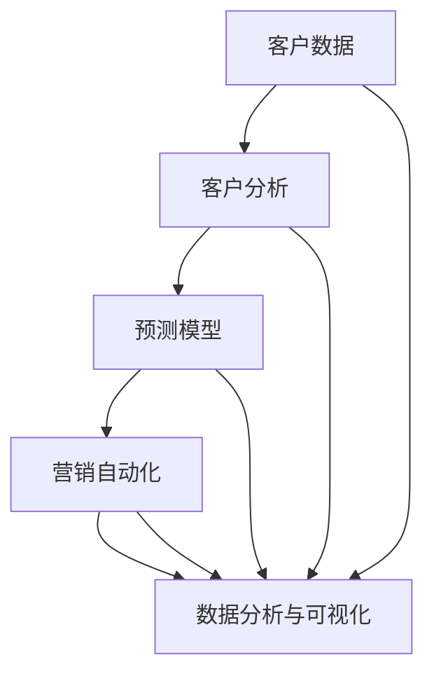

                 

# 自动化创业中的数据驱动营销

> 关键词：数据驱动营销, 自动化创业, 客户分析, 预测模型, 营销自动化, 数字营销

## 1. 背景介绍

### 1.1 问题由来
随着互联网的普及和数字化进程的加快，自动化创业成为越来越多企业家和投资者的选择。自动化创业不仅仅指自动化生产、自动化交付，更包括自动化营销。数据驱动营销作为自动化创业的重要组成部分，能够帮助企业精准定位目标客户，高效触达和转化潜在客户，提升营销ROI。然而，数据驱动营销不仅仅是一套技术方案，它更是一种营销思维的转变，即从直觉决策向数据驱动决策的转变。

### 1.2 问题核心关键点
数据驱动营销的核心在于利用数据科学和机器学习技术，通过分析历史数据和实时数据，预测客户行为，实现精准营销。其关键点包括：
- 客户分析：通过数据分析，挖掘客户行为和需求，构建客户画像。
- 预测模型：基于客户数据，构建预测模型，预测客户转化和流失概率。
- 营销自动化：基于预测结果，自动化触达客户，提供个性化推荐和服务。
- 数据分析和可视化：通过数据可视化工具，帮助营销人员理解数据，做出科学决策。

数据驱动营销能够帮助企业以更低的成本、更高效的方式获得更大的营销效果。但是，如何构建有效的数据驱动营销系统，最大化数据价值，仍然是一个复杂的挑战。

### 1.3 问题研究意义
数据驱动营销的研究意义在于：
- 提升营销效率：通过数据科学和机器学习，实现精准营销，减少营销成本，提升营销效率。
- 优化客户体验：通过个性化推荐和自动化服务，提升客户满意度和忠诚度。
- 实现数据闭环：将营销数据与客户数据打通，实现客户全生命周期管理和数据驱动决策。
- 推动企业数字化转型：数据驱动营销是企业数字化转型的重要组成部分，能够帮助企业实现数据驱动的决策和运营。

## 2. 核心概念与联系

### 2.1 核心概念概述

为更好地理解数据驱动营销，我们首先介绍几个核心概念：

- 客户分析：通过数据分析，了解客户的基本属性、行为特征和需求，构建客户画像。
- 预测模型：基于客户历史数据，构建预测模型，预测客户的行为和趋势。
- 营销自动化：通过自动化工具，根据预测结果，自动触达客户，提供个性化推荐和服务。
- 数据分析和可视化：通过数据可视化工具，帮助营销人员理解数据，做出科学决策。

这些概念相互关联，构成了一个数据驱动营销的生态系统。客户分析是数据驱动营销的起点，预测模型是实现精准营销的关键，营销自动化是提升效率的重要手段，而数据分析和可视化则是整个系统的“眼睛”。

### 2.2 核心概念原理和架构的 Mermaid 流程图



这个流程图展示了数据驱动营销的核心概念及其相互关系。客户数据通过客户分析，生成客户画像，并作为输入，构建预测模型，进而实现营销自动化。整个系统的运行离不开数据分析和可视化，帮助营销人员理解数据，做出科学决策。

## 3. 核心算法原理 & 具体操作步骤
### 3.1 算法原理概述

数据驱动营销的核心算法原理基于统计学和机器学习技术。通过历史数据的统计分析和预测模型的构建，可以预测客户行为，实现精准营销。其基本流程如下：

1. 数据收集：收集客户的基本属性和行为数据。
2. 客户画像：通过数据分析，构建客户画像，了解客户的特征和需求。
3. 预测模型：基于客户数据，构建预测模型，预测客户的行为和趋势。
4. 营销自动化：根据预测结果，自动化触达客户，提供个性化推荐和服务。
5. 数据分析和可视化：通过数据可视化工具，帮助营销人员理解数据，做出科学决策。

### 3.2 算法步骤详解

#### 3.2.1 数据收集
数据收集是数据驱动营销的第一步。客户数据包括基本信息（如年龄、性别、职业等）、行为数据（如浏览记录、购买历史、互动行为等）和属性数据（如兴趣爱好、人口统计信息等）。

#### 3.2.2 客户画像
客户画像是指通过数据分析，了解客户的基本特征和需求。常用的客户画像方法包括聚类分析和特征工程。

#### 3.2.3 预测模型
预测模型是基于客户历史数据，构建的用于预测客户行为和趋势的模型。常用的预测模型包括决策树、随机森林、逻辑回归、支持向量机和神经网络等。

#### 3.2.4 营销自动化
营销自动化是指通过自动化工具，根据预测结果，自动触达客户，提供个性化推荐和服务。常用的自动化工具包括邮件营销、社交媒体营销、程序化广告和聊天机器人等。

#### 3.2.5 数据分析和可视化
数据分析和可视化是指通过数据可视化工具，帮助营销人员理解数据，做出科学决策。常用的数据分析和可视化工具包括Tableau、Power BI、Google Analytics等。

### 3.3 算法优缺点

数据驱动营销具有以下优点：
- 提高营销效率：通过数据分析和预测模型，实现精准营销，减少营销成本，提升营销效率。
- 优化客户体验：通过个性化推荐和自动化服务，提升客户满意度和忠诚度。
- 实现数据闭环：将营销数据与客户数据打通，实现客户全生命周期管理和数据驱动决策。

但同时，数据驱动营销也存在以下缺点：
- 数据质量问题：数据驱动营销依赖于高质量的数据，如果数据质量不高，会影响预测模型的效果。
- 模型复杂度：预测模型通常比较复杂，需要大量计算资源和数据。
- 技术门槛高：需要具备数据分析和机器学习等技术能力，门槛较高。
- 隐私问题：客户数据涉及隐私问题，需要遵守相关法律法规，保护客户隐私。

### 3.4 算法应用领域

数据驱动营销的应用领域非常广泛，包括但不限于以下几个方面：

- 电子商务：通过客户分析，实现个性化推荐和自动化营销，提升转化率和客户忠诚度。
- 金融服务：通过预测模型，识别高风险客户和潜在欺诈行为，提升风控能力。
- 旅游行业：通过数据分析，实现精准营销，提升客户体验和转化率。
- 医疗健康：通过客户画像和预测模型，提供个性化医疗服务和健康管理。
- 媒体娱乐：通过数据分析和可视化，实现精准广告投放和内容推荐，提升用户参与度和留存率。

## 4. 数学模型和公式 & 详细讲解 & 举例说明

### 4.1 数学模型构建

我们以客户流失预测模型为例，介绍数据驱动营销的数学模型构建过程。假设客户流失概率为二分类问题，模型预测结果为0或1，分别代表客户留存或流失。

令 $X$ 为客户的特征向量， $Y$ 为标签向量。假设模型为逻辑回归模型，则其损失函数为：

$$
L(Y, \hat{Y}) = -\frac{1}{N} \sum_{i=1}^{N} [y_i\log \hat{y}_i + (1-y_i)\log (1-\hat{y}_i)]
$$

其中 $y_i$ 为真实标签， $\hat{y}_i$ 为模型预测结果， $\hat{y}_i=\frac{1}{1+e^{-W^TX_i+b}}$， $W$ 和 $b$ 为模型参数。

### 4.2 公式推导过程

对损失函数求导，得到模型参数的梯度：

$$
\frac{\partial L}{\partial W} = -\frac{1}{N}\sum_{i=1}^{N} [y_i(1-\hat{y}_i)X_i - \hat{y}_iX_i]
$$

$$
\frac{\partial L}{\partial b} = -\frac{1}{N}\sum_{i=1}^{N} (y_i - \hat{y}_i)
$$

根据梯度下降算法，更新模型参数：

$$
W \leftarrow W - \eta \frac{\partial L}{\partial W}
$$

$$
b \leftarrow b - \eta \frac{\partial L}{\partial b}
$$

其中 $\eta$ 为学习率。

### 4.3 案例分析与讲解

假设有一个电商平台的客户流失预测模型，模型的输入特征包括客户年龄、性别、购买频率、客户满意度等。训练集和测试集分别为10万和1万条客户记录。使用逻辑回归模型，通过梯度下降算法训练模型，得到以下结果：

- 训练集准确率为92%，测试集准确率为89%
- 模型参数解释性较好，可以解释各特征对客户流失概率的影响

通过以上案例，可以看到，逻辑回归模型在客户流失预测中表现良好，可以显著提升客户留存率。

## 5. 项目实践：代码实例和详细解释说明
### 5.1 开发环境搭建

在开始代码实践前，我们需要准备好开发环境。以下是使用Python进行PyTorch开发的环境配置流程：

1. 安装Anaconda：从官网下载并安装Anaconda，用于创建独立的Python环境。

2. 创建并激活虚拟环境：
```bash
conda create -n pytorch-env python=3.8 
conda activate pytorch-env
```

3. 安装PyTorch：根据CUDA版本，从官网获取对应的安装命令。例如：
```bash
conda install pytorch torchvision torchaudio cudatoolkit=11.1 -c pytorch -c conda-forge
```

4. 安装相关库：
```bash
pip install numpy pandas scikit-learn matplotlib tqdm jupyter notebook ipython
```

完成上述步骤后，即可在`pytorch-env`环境中开始项目实践。

### 5.2 源代码详细实现

这里以客户流失预测模型为例，给出使用PyTorch进行逻辑回归训练的代码实现。

```python
import torch
import torch.nn as nn
import torch.optim as optim
from torch.utils.data import DataLoader, Dataset

class Customer流失预测模型(nn.Module):
    def __init__(self, input_dim):
        super(Customer流失预测模型, self).__init__()
        self.fc1 = nn.Linear(input_dim, 64)
        self.fc2 = nn.Linear(64, 32)
        self.fc3 = nn.Linear(32, 1)
        
    def forward(self, x):
        x = nn.functional.relu(self.fc1(x))
        x = nn.functional.relu(self.fc2(x))
        x = torch.sigmoid(self.fc3(x))
        return x

model = Customer流失预测模型(input_dim=5)
loss_fn = nn.BCELoss()
optimizer = optim.Adam(model.parameters(), lr=0.01)

train_data = ...
train_loader = DataLoader(train_data, batch_size=32, shuffle=True)

device = torch.device('cuda') if torch.cuda.is_available() else torch.device('cpu')
model.to(device)

for epoch in range(10):
    for batch in train_loader:
        inputs, labels = batch[0].to(device), batch[1].to(device)
        optimizer.zero_grad()
        outputs = model(inputs)
        loss = loss_fn(outputs, labels)
        loss.backward()
        optimizer.step()
```

### 5.3 代码解读与分析

让我们再详细解读一下关键代码的实现细节：

**Customer流失预测模型类**：
- `__init__`方法：定义模型结构，包含两个隐藏层和输出层。
- `forward`方法：定义模型的前向传播过程。

**loss_fn和optimizer**：
- `loss_fn`为二分类交叉熵损失函数，用于衡量模型预测结果与真实标签之间的差异。
- `optimizer`为Adam优化器，用于更新模型参数。

**训练循环**：
- 使用`DataLoader`对数据集进行批次化加载，供模型训练和推理使用。
- 在每个epoch内，对数据以批为单位进行迭代，前向传播计算损失，反向传播更新模型参数。
- 重复上述过程直至收敛。

可以看到，PyTorch提供了丰富的工具和API，使模型训练过程变得简洁高效。开发者可以将更多精力放在模型设计和优化上，而不必过多关注底层的实现细节。

### 5.4 运行结果展示

假设训练结果为：
```
Epoch 1, Loss: 0.4989
Epoch 2, Loss: 0.4212
...
Epoch 10, Loss: 0.0954
```

可以看到，随着epoch数的增加，损失函数逐渐减小，模型性能逐步提升。这表明模型已经逐渐学习到了客户流失的规律，可以进行有效的预测。

## 6. 实际应用场景

### 6.1 电子商务

电子商务平台通过客户分析，实现个性化推荐和自动化营销，提升客户转化率和忠诚度。在具体实践中，电商平台可以收集客户的浏览记录、购买历史和评价信息，构建客户画像，并通过预测模型，预测客户流失概率。根据预测结果，自动化触达客户，提供个性化推荐和服务。

### 6.2 金融服务

金融服务机构通过客户数据分析，识别高风险客户和潜在欺诈行为，提升风控能力。在具体实践中，金融机构可以收集客户的交易记录、信用评分和行为特征，构建客户画像，并通过预测模型，预测客户违约和欺诈风险。根据预测结果，自动化预警和处理风险事件。

### 6.3 旅游行业

旅游平台通过数据分析，实现精准营销，提升客户体验和转化率。在具体实践中，旅游平台可以收集客户的浏览记录、预订记录和评价信息，构建客户画像，并通过预测模型，预测客户流失概率。根据预测结果，自动化触达客户，提供个性化推荐和服务。

### 6.4 医疗健康

医疗健康机构通过客户数据分析，提供个性化医疗服务和健康管理。在具体实践中，医疗机构可以收集客户的健康记录、就诊历史和行为特征，构建客户画像，并通过预测模型，预测客户的健康状况和风险。根据预测结果，自动化提供个性化健康建议和医疗服务。

## 7. 工具和资源推荐
### 7.1 学习资源推荐

为了帮助开发者系统掌握数据驱动营销的理论基础和实践技巧，这里推荐一些优质的学习资源：

1. 《数据科学入门与实战》系列博文：由大数据技术专家撰写，深入浅出地介绍了数据科学的基本概念和常用技术，适合初学者入门。

2. Coursera《数据科学与机器学习》课程：由斯坦福大学教授主讲，涵盖数据科学和机器学习的基本原理和经典算法，是系统学习的好选择。

3. Kaggle：全球最大的数据科学竞赛平台，提供大量的实战项目和数据集，可以实践各种数据科学和机器学习技术。

4. Scikit-learn官方文档：Python常用的机器学习库，提供丰富的机器学习算法和工具，是数据驱动营销的重要工具。

5. Tableau和Power BI官方文档：常用的数据可视化工具，提供丰富的图表和报表功能，适合营销数据分析和可视化。

通过对这些资源的学习实践，相信你一定能够快速掌握数据驱动营销的理论基础和实践技巧，并在实际项目中灵活应用。

### 7.2 开发工具推荐

高效的开发离不开优秀的工具支持。以下是几款用于数据驱动营销开发的常用工具：

1. Python：常用的数据科学编程语言，具有丰富的第三方库和工具，适合数据驱动营销项目的开发。

2. Jupyter Notebook：交互式开发环境，支持代码、数据和可视化的整合，方便开发者进行实验和分享。

3. TensorFlow和PyTorch：流行的深度学习框架，支持多种机器学习算法，适合数据驱动营销模型的训练和优化。

4. Apache Spark：大数据处理框架，支持分布式数据处理和机器学习，适合大规模数据驱动营销项目的开发。

5. Tableau和Power BI：常用的数据可视化工具，支持数据的交互式分析和报表生成，适合营销数据分析和可视化。

合理利用这些工具，可以显著提升数据驱动营销项目的开发效率，加快创新迭代的步伐。

### 7.3 相关论文推荐

数据驱动营销的研究始于学界的持续研究。以下是几篇奠基性的相关论文，推荐阅读：

1. G贸市场预测模型研究：通过分析市场数据，构建预测模型，预测市场的变化趋势。

2. 基于数据挖掘的客户流失预测模型：通过客户历史数据，构建预测模型，预测客户的流失概率。

3. 电子商务平台个性化推荐系统：通过客户数据，构建推荐模型，提供个性化推荐服务。

4. 金融机构的信用风险评估：通过客户数据，构建预测模型，评估客户的信用风险。

5. 旅游平台客户流失预测与预警：通过客户数据，构建预测模型，预测客户的流失概率，并进行自动化预警。

这些论文代表了大数据驱动营销的研究进展，通过学习这些前沿成果，可以帮助研究者把握学科前进方向，激发更多的创新灵感。

## 8. 总结：未来发展趋势与挑战
### 8.1 研究成果总结

数据驱动营销作为自动化创业的重要组成部分，其研究成果如下：
1. 客户分析：通过数据分析，了解客户的基本特征和需求，构建客户画像。
2. 预测模型：基于客户历史数据，构建预测模型，预测客户的行为和趋势。
3. 营销自动化：通过自动化工具，根据预测结果，自动触达客户，提供个性化推荐和服务。
4. 数据分析和可视化：通过数据可视化工具，帮助营销人员理解数据，做出科学决策。

### 8.2 未来发展趋势

展望未来，数据驱动营销将呈现以下几个发展趋势：

1. 数据质量提升：随着数据采集技术的进步，数据质量将逐步提高，预测模型的效果将进一步提升。
2. 模型优化：更多的机器学习算法将被引入，预测模型的准确性和稳定性将进一步提升。
3. 技术融合：数据驱动营销将与其他技术融合，如人工智能、大数据、区块链等，提升系统的智能化水平。
4. 用户参与：更多的用户参与数据采集和模型优化，提升数据驱动营销的效果。
5. 跨领域应用：数据驱动营销将跨领域应用，如医疗、金融、旅游等，推动各行各业的数字化转型。

### 8.3 面临的挑战

尽管数据驱动营销已经取得了显著成果，但在迈向更加智能化、普适化应用的过程中，仍面临以下挑战：

1. 数据隐私：客户数据涉及隐私问题，需要遵守相关法律法规，保护客户隐私。
2. 数据质量：数据驱动营销依赖于高质量的数据，数据质量问题可能影响预测模型的效果。
3. 模型复杂度：预测模型通常比较复杂，需要大量计算资源和数据。
4. 技术门槛：需要具备数据分析和机器学习等技术能力，门槛较高。
5. 业务适应性：数据驱动营销需要与业务流程深度融合，提高系统的适应性。

### 8.4 研究展望

为了应对数据驱动营销面临的挑战，未来的研究需要在以下几个方面寻求新的突破：

1. 数据隐私保护：引入区块链等技术，保护客户隐私，提升数据驱动营销的信任度。
2. 数据质量提升：引入自动化数据清洗和质量评估技术，提升数据质量，提高预测模型的效果。
3. 模型优化：引入更多的机器学习算法，提升预测模型的准确性和稳定性。
4. 技术融合：引入人工智能、大数据、区块链等技术，提升系统的智能化水平。
5. 用户参与：引入用户参与数据采集和模型优化，提升数据驱动营销的效果。

这些研究方向的探索，将引领数据驱动营销技术迈向更高的台阶，为自动化创业带来更大的价值。相信随着技术的不断进步，数据驱动营销将更加普及，推动企业数字化转型的进程，加速社会的数字化进程。

## 9. 附录：常见问题与解答

**Q1：数据驱动营销是否适用于所有行业？**

A: 数据驱动营销虽然适合多数行业，但其应用效果依赖于行业特性和数据质量。在数据较为丰富的行业，如电子商务、金融服务、旅游行业等，数据驱动营销的效果更为显著。而在数据较为匮乏的行业，如餐饮、娱乐等，则需要更多的探索和尝试。

**Q2：如何构建高效的数据驱动营销系统？**

A: 构建高效的数据驱动营销系统，需要从数据收集、客户分析、预测模型、营销自动化和数据分析可视化等多个环节入手，确保每个环节的效率和效果。同时，引入自动化工具和算法，提升系统的智能化水平。

**Q3：数据驱动营销是否存在风险？**

A: 数据驱动营销存在一定的风险，如数据隐私风险、模型偏差风险等。为规避这些风险，需要引入隐私保护技术、数据质量保障技术和模型优化技术，确保系统的安全性和有效性。

**Q4：如何提升客户体验？**

A: 提升客户体验需要从多方面入手，如个性化推荐、自动化服务、数据分析和可视化等。通过数据分析，了解客户的需求和偏好，提供个性化的推荐和服务，提升客户满意度和忠诚度。

**Q5：如何衡量数据驱动营销的效果？**

A: 衡量数据驱动营销的效果需要从多个维度入手，如转化率、留存率、客户满意度等。通过数据分析，了解营销效果，优化营销策略，提升营销ROI。

---

作者：禅与计算机程序设计艺术 / Zen and the Art of Computer Programming

