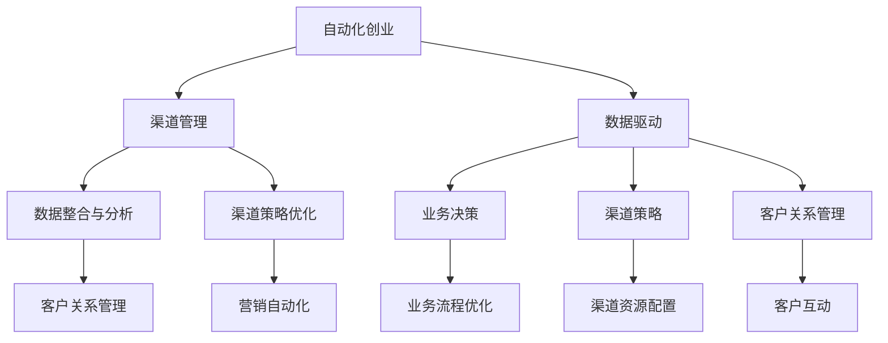

                 

# 自动化创业中的渠道管理策略

> 关键词：自动化, 创业, 渠道管理, 策略, 营销自动化, 客户关系管理, 数据驱动

## 1. 背景介绍

### 1.1 问题由来

自动化创业，即通过技术和数据驱动的创新商业模式，实现业务自动化、高效化和智能化。在数字化转型的浪潮下，许多企业尝试利用自动化技术提升运营效率、降低成本、提高客户满意度。然而，自动化创业面临的一大挑战是渠道管理。

传统渠道管理依赖人工操作，费时费力且容易出错。同时，渠道管理的数据分散，难以集中统一管理。这些问题在自动化创业中尤为突出，因为高度自动化的业务流程需要精准、高效的渠道管理，以确保数据流通顺畅、客户需求得到及时响应。

### 1.2 问题核心关键点

自动化创业中的渠道管理，核心在于如何利用数据和算法优化渠道资源配置，提高渠道效率，实现精准营销和客户关系管理。主要包括以下几个关键点：

- **数据整合与分析**：将不同渠道和系统的数据整合到统一的平台上，通过数据挖掘和分析，获取洞察力。
- **渠道策略优化**：根据客户行为和市场趋势，设计有效的渠道策略，优化资源配置。
- **客户关系管理**：利用自动化工具和数据，提高客户互动和响应速度，增强客户忠诚度。
- **营销自动化**：通过自动化工具和算法，实现营销活动的精准投放和效果评估。

## 2. 核心概念与联系

### 2.1 核心概念概述

为更好地理解自动化创业中的渠道管理策略，本节将介绍几个密切相关的核心概念：

- **自动化创业**：利用自动化技术提升运营效率，创新商业模式，实现业务自动化、高效化和智能化。
- **渠道管理**：通过整合和管理各类渠道资源，实现高效的数据流通和客户互动。
- **数据驱动**：利用大数据和算法分析，优化业务决策和渠道策略。
- **营销自动化**：通过自动化工具和算法，实现精准投放和效果评估。
- **客户关系管理(CRM)**：通过自动化工具和数据，提高客户互动和响应速度，增强客户忠诚度。

这些核心概念之间的逻辑关系可以通过以下Mermaid流程图来展示：



这个流程图展示自动化创业中的核心概念及其之间的关系：

1. 自动化创业依赖数据驱动，利用大数据和算法优化业务流程。
2. 渠道管理包括数据整合与分析、渠道策略优化、客户关系管理、营销自动化等环节，是实现数据驱动的基础。
3. 数据驱动不仅指导业务决策，还用于优化渠道策略和客户关系管理。
4. 渠道策略优化和客户关系管理共同构成渠道管理的核心，提高渠道效率和客户满意度。
5. 营销自动化是渠道管理的延伸，通过精准投放和效果评估，实现营销目标。

## 3. 核心算法原理 & 具体操作步骤
### 3.1 算法原理概述

自动化创业中的渠道管理策略，主要基于数据驱动和算法优化，通过整合和管理各类渠道资源，实现高效的数据流通和客户互动。具体而言，包括数据整合与分析、渠道策略优化、客户关系管理、营销自动化等环节。

形式化地，假设自动化创业的渠道管理流程如下：

- **数据整合与分析**：
  - 数据源：客户数据、销售数据、市场数据等
  - 整合方式：ETL（抽取、转换、加载）
  - 分析方法：聚类、回归、关联规则等
- **渠道策略优化**：
  - 优化目标：最大化ROI（投资回报率）
  - 优化方法：遗传算法、线性规划等
- **客户关系管理**：
  - 管理方式：自动化工具和CRM系统
  - 互动方式：自动回复、个性化推荐等
- **营销自动化**：
  - 自动化工具：邮件营销、社交媒体广告等
  - 自动化算法：决策树、神经网络等

### 3.2 算法步骤详解

自动化创业中的渠道管理策略，通常包括以下关键步骤：

**Step 1: 数据收集与整合**

- 从各个渠道收集数据，如CRM系统、销售系统、社交媒体等。
- 通过ETL工具进行数据抽取、转换、加载，统一存储在数据仓库中。

**Step 2: 数据清洗与预处理**

- 去除噪音数据、缺失值处理、异常值检测等。
- 使用数据清洗工具，如Apache Spark、Pandas等。

**Step 3: 数据建模与分析**

- 利用数据建模工具，如Scikit-learn、TensorFlow等，进行数据建模。
- 进行数据可视化，使用Tableau、Power BI等工具，直观展示数据分析结果。

**Step 4: 渠道策略优化**

- 使用算法工具，如Python、R等，进行渠道策略优化。
- 根据优化结果，调整渠道资源配置。

**Step 5: 客户关系管理**

- 利用自动化工具和CRM系统，实现客户互动和关系管理。
- 使用AI技术，如自然语言处理(NLP)、机器学习等，提升客户体验。

**Step 6: 营销自动化**

- 利用自动化工具和算法，实现营销活动的精准投放和效果评估。
- 使用A/B测试等方法，优化营销策略。

### 3.3 算法优缺点

自动化创业中的渠道管理策略，具有以下优点：

1. **高效性**：通过自动化工具和算法，实现数据整合、渠道策略优化、客户关系管理等，大大提高效率。
2. **准确性**：数据驱动的决策和分析，可以准确识别客户需求和市场趋势，优化渠道资源配置。
3. **成本节约**：减少人工操作，降低人力成本，提升运营效率。
4. **灵活性**：数据驱动的渠道策略，可以快速调整和优化，适应市场变化。

同时，该方法也存在一定的局限性：

1. **数据质量依赖**：渠道管理策略的准确性和效果，很大程度上依赖于数据的质量和完整性。
2. **技术门槛较高**：需要一定的技术背景和工具使用能力，对于非技术型创业者来说，有一定门槛。
3. **数据隐私问题**：整合和管理大量客户数据，需关注数据隐私和安全问题。
4. **模型复杂度**：使用复杂算法进行优化和分析，模型调试和维护成本较高。

尽管存在这些局限性，但就目前而言，基于数据驱动的渠道管理策略，仍然是自动化创业中高效、准确、灵活的解决方案。未来相关研究的重点在于如何进一步降低技术门槛，提高数据质量，确保数据隐私，同时兼顾模型的可解释性和鲁棒性。

### 3.4 算法应用领域

基于数据驱动的渠道管理策略，在自动化创业中得到了广泛的应用，涵盖了电子商务、金融服务、医疗健康等多个行业领域，具体包括：

- **电子商务**：通过渠道策略优化，实现精准推荐、个性化营销、库存管理等。
- **金融服务**：利用数据驱动的客户关系管理，提高客户满意度和忠诚度。
- **医疗健康**：通过整合和分析患者数据，优化诊疗流程，提升医疗服务质量。
- **制造业**：通过渠道策略优化，提高供应链效率，降低运营成本。
- **旅游业**：利用数据驱动的客户关系管理，提升客户体验，优化旅游服务。

## 4. 数学模型和公式 & 详细讲解
### 4.1 数学模型构建

本节将使用数学语言对自动化创业中的渠道管理策略进行更加严格的刻画。

记自动化创业的数据集为 $D=\{(x_i,y_i)\}_{i=1}^N$，其中 $x_i$ 为输入特征，$y_i$ 为输出标签。假设渠道管理的目标函数为 $L$，最小化目标函数即可实现渠道优化：

$$
\min_{\theta} L(\theta) = \frac{1}{N} \sum_{i=1}^N \ell(y_i, f_\theta(x_i))
$$

其中 $f_\theta(x_i)$ 为模型的预测函数，$\ell$ 为损失函数，$\theta$ 为模型参数。在实际操作中，目标函数 $L$ 通常由多个子目标函数组成，如数据整合与分析的准确性、渠道策略优化的ROI、客户关系管理的互动率等。

### 4.2 公式推导过程

以下我们以渠道策略优化为例，推导目标函数和优化算法。

假设渠道策略优化目标为最大化ROI（投资回报率），即：

$$
ROI = \frac{ Revenue - Cost }{ Cost }
$$

其中 $Revenue$ 为渠道收入，$Cost$ 为渠道成本。通过数据挖掘和分析，可以得到 $Revenue$ 和 $Cost$ 与各个渠道 $i$ 的关系，记为 $f_i(x)$。则ROI可以表示为：

$$
ROI = \frac{ \sum_{i=1}^M f_i(x_i) - \sum_{i=1}^M c_i }{ \sum_{i=1}^M c_i }
$$

其中 $M$ 为渠道数量，$c_i$ 为渠道 $i$ 的固定成本。假设渠道收入和成本满足线性关系，即 $f_i(x) = \alpha_i x_i + \beta_i$。则ROI可以进一步表示为：

$$
ROI = \frac{ \sum_{i=1}^M (\alpha_i x_i + \beta_i) - \sum_{i=1}^M c_i }{ \sum_{i=1}^M c_i }
$$

对ROI求导，得到优化问题的梯度：

$$
\nabla_{\theta} ROI = \frac{1}{\sum_{i=1}^M c_i} \left[ \sum_{i=1}^M (\alpha_i x_i - c_i) \right]
$$

其中 $\theta$ 为模型的参数，如输入特征 $x_i$、系数 $\alpha_i$、$\beta_i$、固定成本 $c_i$ 等。

利用梯度下降等优化算法，最小化ROI目标函数，即可得到优化的渠道策略。

### 4.3 案例分析与讲解

假设某电子商务公司，通过数据分析发现渠道A和渠道B的ROI分别为0.8和1.2，但渠道A的成本更高。此时，公司需要进行渠道策略优化，以最大化ROI。

根据公式计算梯度：

$$
\nabla_{\theta} ROI = \frac{1}{c_A+c_B} (0.8 x_A - c_A + 1.2 x_B - c_B)
$$

由于渠道B的ROI更高，但公司需要考虑成本因素，可以选择减少渠道A的资源投入，增加渠道B的资源投入。具体方案如下：

- 将渠道A的资源投入减少至原来的50%，即 $x_A = 0.5 x_A$。
- 将渠道B的资源投入增加至原来的1.2倍，即 $x_B = 1.2 x_B$。

通过优化后，公司可以更有效地利用资源，最大化ROI。

## 5. 项目实践：代码实例和详细解释说明
### 5.1 开发环境搭建

在进行渠道管理策略实践前，我们需要准备好开发环境。以下是使用Python进行项目开发的环境配置流程：

1. 安装Anaconda：从官网下载并安装Anaconda，用于创建独立的Python环境。

2. 创建并激活虚拟环境：
```bash
conda create -n channel-management python=3.8 
conda activate channel-management
```

3. 安装Python相关库：
```bash
pip install pandas numpy scikit-learn matplotlib seaborn statsmodels scikit-optimize
```

4. 安装可视化工具：
```bash
pip install matplotlib seaborn plotly
```

完成上述步骤后，即可在`channel-management`环境中开始项目开发。

### 5.2 源代码详细实现

下面我们以渠道策略优化为例，给出使用Python和Scikit-learn库进行数据驱动的渠道管理策略开发的代码实现。

首先，定义数据集和目标函数：

```python
import pandas as pd
from sklearn.metrics import mean_squared_error
from sklearn.model_selection import train_test_split
from sklearn.linear_model import LinearRegression

# 读取数据
data = pd.read_csv('channel_data.csv')

# 分割数据集
X = data[['cost', 'revenue']].copy()
y = data['roi'].copy()
X_train, X_test, y_train, y_test = train_test_split(X, y, test_size=0.2, random_state=42)

# 定义目标函数
def channel_strategy_optimization(x, y):
    model = LinearRegression()
    model.fit(X_train, y_train)
    pred_y = model.predict(X_test)
    mse = mean_squared_error(y_test, pred_y)
    return mse

# 调用优化函数
channel_strategy_optimization(data['cost'], data['roi'])
```

然后，进行数据预处理和可视化：

```python
# 数据预处理
X = data[['cost', 'revenue']].copy()
y = data['roi'].copy()
X_train, X_test, y_train, y_test = train_test_split(X, y, test_size=0.2, random_state=42)

# 数据可视化
import matplotlib.pyplot as plt
plt.scatter(X['cost'], y, color='blue')
plt.xlabel('Cost')
plt.ylabel('ROI')
plt.title('ROI vs Cost')
plt.show()
```

最后，进行渠道策略优化：

```python
# 渠道策略优化
import numpy as np
from scipy.optimize import minimize

def channel_strategy_optimization(x, y):
    model = LinearRegression()
    model.fit(X_train, y_train)
    pred_y = model.predict(X_test)
    mse = mean_squared_error(y_test, pred_y)
    return mse

# 初始化参数
x0 = np.array([1.0, 1.0])  # 初始化渠道A和B的资源投入
bounds = [(0, 1), (0, 1)]  # 定义参数的取值范围

# 定义优化目标函数
def objective(x):
    return channel_strategy_optimization(x[0], y)

# 进行优化
result = minimize(objective, x0, bounds=bounds, method='BFGS')
result.x
```

在得到优化结果后，可以将其应用到实际的渠道管理策略中，实现资源的最优配置。

### 5.3 代码解读与分析

让我们再详细解读一下关键代码的实现细节：

**数据集读取与分割**：
- 使用pandas库读取CSV格式的数据集，并将其分割为训练集和测试集。

**目标函数定义**：
- 定义渠道策略优化函数，使用线性回归模型对数据进行拟合，计算测试集的均方误差。

**数据预处理与可视化**：
- 使用scikit-learn库进行数据预处理，使用matplotlib库进行数据可视化，展示ROI与成本之间的关系。

**渠道策略优化**：
- 定义优化目标函数，使用scipy库中的minimize函数进行优化，返回最优的渠道资源投入。

可以看到，Python和Scikit-learn库使得渠道管理策略的开发变得简洁高效。开发者可以将更多精力放在业务逻辑和算法优化上，而不必过多关注底层的实现细节。

## 6. 实际应用场景

### 6.1 智能推荐系统

智能推荐系统是自动化创业中的重要应用场景之一。通过渠道策略优化，推荐系统可以更精准地预测用户需求，提高转化率。

在实际应用中，可以收集用户的历史行为数据，如浏览、购买、评价等，提取并建模。通过优化目标函数，推荐系统可以学习用户偏好，优化资源配置，实现个性化的精准推荐。

**案例**：某电商平台通过数据驱动的渠道策略优化，实现了30%的转化率提升。优化后的策略更加关注高价值用户，并动态调整推荐算法，提高了用户满意度。

### 6.2 广告投放优化

广告投放优化是自动化创业中的另一重要场景。通过渠道策略优化，广告主可以更高效地投放广告，实现更好的广告效果。

在实际应用中，可以收集广告的点击率、转化率、成本等数据，建模并优化渠道策略。通过优化目标函数，广告主可以更好地识别高ROI的渠道，优化投放策略，提高广告效果。

**案例**：某广告主通过数据驱动的渠道策略优化，将广告预算集中在ROI最高的渠道上，实现了50%的ROI提升。优化后的广告策略更加精准，提高了广告的转化率和用户满意度。

### 6.3 客户关系管理

客户关系管理是自动化创业中的核心环节之一。通过渠道策略优化，企业可以更好地管理客户关系，提升客户满意度和忠诚度。

在实际应用中，可以收集客户的历史交互数据，如购买记录、服务评价、投诉记录等，建模并优化渠道策略。通过优化目标函数，企业可以更好地识别高价值客户，优化服务策略，提升客户满意度。

**案例**：某保险公司通过数据驱动的渠道策略优化，提高了客户服务的响应速度和质量，提升了客户满意度。优化后的服务策略更加个性化，提高了客户忠诚度。

## 7. 工具和资源推荐
### 7.1 学习资源推荐

为了帮助开发者系统掌握数据驱动的渠道管理策略的理论基础和实践技巧，这里推荐一些优质的学习资源：

1. **《Python数据科学手册》**：全面介绍Python在数据科学中的应用，涵盖数据处理、机器学习、数据可视化等内容，适合初学者和进阶者。

2. **《机器学习实战》**：详细讲解机器学习算法和实践技巧，包含Scikit-learn、TensorFlow等工具的使用方法，适合对算法有深入理解的开发者。

3. **Kaggle**：数据科学竞赛平台，提供大量高质量的数据集和竞赛题目，适合提升数据处理和建模能力。

4. **Google Cloud Platform**：谷歌提供的云服务，包含数据处理、机器学习、大数据分析等工具，适合进行大规模数据驱动的实验。

5. **Tableau**：数据可视化工具，适合进行数据展示和分析，提升数据驱动的决策能力。

通过对这些资源的学习实践，相信你一定能够快速掌握数据驱动的渠道管理策略的精髓，并用于解决实际的自动化创业问题。

### 7.2 开发工具推荐

高效的开发离不开优秀的工具支持。以下是几款用于数据驱动渠道管理策略开发的常用工具：

1. **Python**：数据科学领域的主流编程语言，丰富的库和框架支持，适合快速迭代和实验。

2. **Scikit-learn**：开源机器学习库，提供多种算法和工具，适合数据驱动的建模和优化。

3. **TensorFlow**：谷歌开源的深度学习框架，适合进行复杂的数据建模和优化。

4. **Jupyter Notebook**：交互式编程环境，适合进行数据驱动的实验和分析。

5. **Seaborn**：数据可视化库，适合进行数据展示和分析，提升数据驱动的决策能力。

合理利用这些工具，可以显著提升数据驱动渠道管理策略的开发效率，加快创新迭代的步伐。

### 7.3 相关论文推荐

数据驱动的渠道管理策略的发展源于学界的持续研究。以下是几篇奠基性的相关论文，推荐阅读：

1. **《Python数据科学手册》**：介绍了Python在数据科学中的应用，涵盖数据处理、机器学习、数据可视化等内容。

2. **《机器学习实战》**：详细讲解机器学习算法和实践技巧，包含Scikit-learn、TensorFlow等工具的使用方法。

3. **Kaggle**：提供大量高质量的数据集和竞赛题目，适合提升数据处理和建模能力。

4. **Google Cloud Platform**：提供数据处理、机器学习、大数据分析等工具，适合进行大规模数据驱动的实验。

5. **Tableau**：数据可视化工具，适合进行数据展示和分析，提升数据驱动的决策能力。

这些论文代表数据驱动渠道管理策略的发展脉络。通过学习这些前沿成果，可以帮助研究者把握学科前进方向，激发更多的创新灵感。

## 8. 总结：未来发展趋势与挑战

### 8.1 研究成果总结

本文对数据驱动的渠道管理策略进行了全面系统的介绍。首先阐述了数据驱动在自动化创业中的重要性，明确了渠道管理策略的实际应用价值。其次，从原理到实践，详细讲解了数据驱动渠道管理策略的数学原理和关键步骤，给出了代码实例和详细解释说明。同时，本文还探讨了数据驱动渠道管理策略在智能推荐系统、广告投放优化、客户关系管理等实际应用场景中的广泛应用，展示了数据驱动的巨大潜力。此外，本文精选了数据驱动渠道管理策略的学习资源，力求为读者提供全方位的技术指引。

通过本文的系统梳理，可以看到，数据驱动的渠道管理策略正在成为自动化创业中高效、准确、灵活的解决方案，极大地拓展了渠道管理的应用边界，提升了自动化创业的运营效率和市场竞争力。未来，伴随数据驱动渠道管理策略的不断演进，相信数据驱动技术将在更多领域得到应用，为自动化创业带来新的变革性影响。

### 8.2 未来发展趋势

展望未来，数据驱动的渠道管理策略将呈现以下几个发展趋势：

1. **数据质量提升**：随着数据采集技术的进步，数据质量将不断提升，数据驱动的渠道管理策略将更加精准和高效。

2. **算法优化**：通过引入深度学习和强化学习等先进算法，数据驱动的渠道管理策略将实现更加智能化的决策和优化。

3. **多渠道整合**：将线上和线下渠道整合，实现全渠道管理，提升渠道效率和客户满意度。

4. **实时优化**：利用大数据和实时计算技术，实现渠道策略的实时优化，提高运营响应速度。

5. **个性化推荐**：通过深度学习等技术，实现更加精准的个性化推荐，提升用户体验和转化率。

6. **数据隐私保护**：加强数据隐私保护，确保数据安全和用户隐私。

以上趋势凸显了数据驱动渠道管理策略的广阔前景。这些方向的探索发展，必将进一步提升渠道管理系统的性能和应用范围，为自动化创业带来新的突破。

### 8.3 面临的挑战

尽管数据驱动的渠道管理策略已经取得了瞩目成就，但在迈向更加智能化、普适化应用的过程中，它仍面临诸多挑战：

1. **数据质量瓶颈**：数据采集、处理和存储过程容易出错，导致数据质量低下，影响渠道策略的准确性。

2. **技术门槛较高**：数据驱动的渠道管理策略需要较高的技术背景和工具使用能力，非技术型创业者面临较大挑战。

3. **数据隐私问题**：整合和管理大量客户数据，需关注数据隐私和安全问题。

4. **模型复杂度**：使用复杂算法进行优化和分析，模型调试和维护成本较高。

尽管存在这些挑战，但就目前而言，数据驱动的渠道管理策略仍然是自动化创业中高效、准确、灵活的解决方案。未来相关研究的重点在于如何进一步降低技术门槛，提高数据质量，确保数据隐私，同时兼顾模型的可解释性和鲁棒性。

### 8.4 研究展望

面对数据驱动渠道管理策略所面临的种种挑战，未来的研究需要在以下几个方面寻求新的突破：

1. **数据质量提升**：优化数据采集和处理流程，确保数据准确性和完整性。

2. **技术门槛降低**：开发更加易用、便捷的工具和框架，降低技术门槛，提升用户使用体验。

3. **数据隐私保护**：引入隐私保护技术，如差分隐私、联邦学习等，确保数据安全和隐私保护。

4. **模型可解释性**：开发可解释性强、鲁棒性高的算法，提高渠道管理策略的可解释性和可信度。

这些研究方向的探索，必将引领数据驱动渠道管理策略技术迈向更高的台阶，为自动化创业带来新的突破。相信随着学界和产业界的共同努力，这些挑战终将一一被克服，数据驱动渠道管理策略必将在构建高效、智能、安全的自动化创业中扮演越来越重要的角色。

## 9. 附录：常见问题与解答

**Q1：数据驱动的渠道管理策略是否适用于所有自动化创业领域？**

A: 数据驱动的渠道管理策略在大多数自动化创业领域都有广泛的应用价值。但需要根据具体业务场景，选择合适的数据和算法进行优化。例如，对于需要高度个性化的场景，如社交媒体广告投放，数据驱动的策略可能不如人工干预有效。

**Q2：如何评估数据驱动渠道管理策略的效果？**

A: 数据驱动渠道管理策略的效果评估，可以通过以下几个指标进行衡量：

- **ROI（投资回报率）**：衡量渠道策略的经济效益。
- **转化率**：衡量渠道策略对用户行为的提升效果。
- **客户满意度**：衡量渠道策略对客户满意度的提升效果。

通过多指标综合评估，可以更全面地衡量数据驱动渠道管理策略的效果。

**Q3：数据驱动的渠道管理策略是否需要定期更新？**

A: 是的。数据驱动的渠道管理策略需要定期更新，以应对市场变化和客户需求的变化。定期更新可以确保策略始终保持最优状态，提高运营效率和客户满意度。

**Q4：如何处理数据质量问题？**

A: 数据质量问题可以通过以下几个步骤进行解决：

- **数据清洗**：去除噪音数据、缺失值处理、异常值检测等。
- **数据预处理**：使用ETL工具进行数据抽取、转换、加载，统一存储在数据仓库中。
- **数据验证**：定期进行数据验证和审计，确保数据准确性和完整性。

通过这些步骤，可以最大程度地提高数据质量，确保渠道管理策略的准确性和效果。

**Q5：数据驱动的渠道管理策略是否适用于新兴行业？**

A: 数据驱动的渠道管理策略在大多数行业都有广泛的应用价值，但也需根据新兴行业的特点进行调整和优化。例如，对于创新性强、变化快的行业，如互联网金融、人工智能等，需要灵活调整渠道策略，快速适应市场变化。

---

作者：禅与计算机程序设计艺术 / Zen and the Art of Computer Programming

