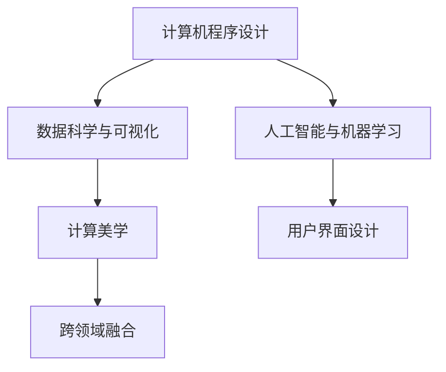

                 

# 艺术与科技的碰撞：人类计算激发创意

## 1. 背景介绍

### 1.1 问题由来

艺术与科技的交融一直是近年来学界和产业界关注的焦点。科技的不断进步，尤其是计算机图形、人工智能、机器学习等领域的飞速发展，为艺术家提供了前所未有的创作工具和可能性。在过去的几十年里，从数字绘画到虚拟现实，从音乐合成到智能交互，科技为艺术带来了翻天覆地的变化。然而，这些技术往往依赖于强大的计算资源和专业背景，使得艺术创作变得高门槛、成本高昂，难以普及。

艺术创作的背后，是人类的想象力、情感和智慧。如何通过计算技术激发人类的创意，降低艺术创作的门槛，使得艺术创作更加普惠、高效，成为当前研究的一个重要课题。本文将探讨如何利用计算技术，特别是计算机程序设计，来激发人类的艺术创造力，推动艺术与科技的深度融合。

### 1.2 问题核心关键点

激发创意的核心在于计算技术如何与艺术创作过程无缝对接，从而提高创作效率、增强作品深度和创新性。这一过程涉及以下几个关键点：

1. **计算工具的易用性**：开发易于理解和使用的计算工具，让更多艺术家能够快速上手。
2. **计算与艺术创作结合的深度**：在创作过程中引入计算算法和数据分析，为艺术创作提供新的灵感和角度。
3. **创意与计算效率的平衡**：保证计算过程不影响创作灵感的涌现，同时提高创作的效率和效果。
4. **创作过程的可控性和自主性**：让艺术家能够在创作过程中自主控制计算流程，而不是被计算结果所束缚。
5. **作品评价与反馈**：通过计算技术分析作品的受众反应和市场表现，为艺术家提供有价值的创作反馈。

本文将围绕这些关键点，详细探讨计算技术在艺术创作中的应用，以期为艺术与科技的深度融合提供思路和参考。

## 2. 核心概念与联系

### 2.1 核心概念概述

为更好地理解计算技术与艺术创作的融合，本节将介绍几个密切相关的核心概念：

- **计算机程序设计**：指编写和维护计算机程序的过程，旨在解决具体问题或实现特定功能。计算机程序设计不仅是技术工作，也是艺术创作的重要工具。
- **人工智能与机器学习**：通过算法和模型，使计算机具备类似人类的认知和学习能力。在艺术创作中，人工智能可以辅助生成艺术作品、分析作品特征等。
- **数据科学与可视化**：利用数据收集、处理和展示技术，分析创作素材和受众反应，为创作提供数据支持。
- **计算美学**：探索计算技术在艺术创作和设计中的应用，如动态生成艺术、交互式艺术等，追求计算与艺术结合的美学效果。
- **用户界面设计(UI)**：专注于用户与计算系统之间的交互，提升用户体验和操作效率，使艺术创作更加直观和便捷。
- **跨领域融合**：促进计算机科学、艺术设计、数据科学等多学科的交叉融合，推动艺术创作和科技发展的共同进步。

这些概念之间的逻辑关系可以通过以下Mermaid流程图来展示：



这个流程图展示了计算机程序设计与其他相关概念的连接关系：

1. 计算机程序设计为其他概念提供了底层技术支持。
2. 人工智能与机器学习通过算法和技术，为艺术创作提供了新的可能。
3. 数据科学与可视化通过分析，提供了创作数据支持。
4. 计算美学探索技术在艺术创作中的应用，追求美学效果。
5. 用户界面设计提升用户体验，使创作更加便捷。
6. 跨领域融合促进各学科的共同进步，推动技术发展。

## 3. 核心算法原理 & 具体操作步骤
### 3.1 算法原理概述

计算技术与艺术创作的融合，本质上是一个多学科、多技术领域的跨界应用。其核心思想是：通过计算机程序设计，将人工智能、数据科学等技术融入艺术创作过程，激发艺术家的创造力，提升作品的质量和多样性。

形式化地，假设艺术创作过程为 $P$，包括创意生成、素材处理、效果展示等多个环节，每个环节都可能引入计算技术 $C$，以实现特定的创作目标。计算技术 $C$ 的目标是通过算法 $A$ 和模型 $M$，将艺术创作过程中的一些问题 $Q$ 转化为计算机可处理的形式 $Q'$。具体来说，可以按照以下步骤实现：

1. 收集创作素材 $S$，如图片、音频、文本等。
2. 引入计算算法 $A$ 和模型 $M$，对素材 $S$ 进行处理，生成新的创意素材 $S'$。
3. 艺术家对 $S'$ 进行创作，生成最终作品 $W$。
4. 通过数据科学工具 $D$ 分析 $W$ 的受众反应和市场表现，提供创作反馈。
5. 艺术家根据反馈对创作过程进行调整和优化，形成新的创作过程 $P'$。

这一过程展示了计算技术在艺术创作中的多层次应用，从素材处理到创意生成，再到作品展示和反馈分析，每一步都可能引入计算技术，提升创作效率和效果。

### 3.2 算法步骤详解

计算技术在艺术创作中的应用，可以按照以下步骤进行：

**Step 1: 素材收集与预处理**
- 收集创作所需的素材，如图片、音频、文本等。
- 对素材进行预处理，如去噪、压缩、格式转换等。
- 使用数据标注工具，对素材进行分类、标注，为后续分析提供支持。

**Step 2: 引入计算算法与模型**
- 选择合适的计算算法和模型，如生成对抗网络（GAN）、深度学习模型等，用于处理和生成素材。
- 对算法和模型进行参数调优，确保其适应艺术创作的需求。
- 对计算过程进行可视化，艺术家可以直观地看到算法的工作状态和结果。

**Step 3: 创意生成与效果展示**
- 利用算法和模型生成新的创意素材，如生成图像、音频、视频等。
- 对生成的素材进行后处理，如剪裁、调整色彩等，以符合艺术创作的要求。
- 使用交互式工具，将创意素材展示给艺术家，以便进行进一步创作。

**Step 4: 数据科学分析**
- 使用数据科学工具对生成的作品进行受众反应和市场表现的分析。
- 通过可视化工具，将分析结果呈现给艺术家，提供创作反馈。
- 根据反馈，对创作过程进行调整和优化。

**Step 5: 迭代优化**
- 根据创作反馈，不断迭代优化计算算法和模型参数。
- 在每次迭代中，引入新的创意素材和创作灵感。
- 最终形成高效的创作过程，生成高质量的艺术作品。

### 3.3 算法优缺点

计算技术在艺术创作中的应用，具有以下优点：
1. 提高创作效率：通过自动化处理和生成，艺术家可以节省大量时间，专注于创意生成和作品细节。
2. 增强创作质量：利用人工智能和机器学习的技术，生成更丰富的创意素材和效果。
3. 提供创作反馈：通过数据科学工具，艺术家可以获得作品的受众反应和市场表现，指导创作方向。
4. 激发创作灵感：通过引入新的计算技术和算法，为艺术家提供新的创作思路和灵感。
5. 实现跨界融合：促进计算机科学、艺术设计、数据科学等多学科的交叉融合，推动艺术创作和科技发展的共同进步。

同时，这一方法也存在一些局限性：
1. 对技术要求高：计算技术的应用需要艺术家具备一定的编程和数据分析能力。
2. 创意受限：计算技术在创作过程中可能过于依赖算法和模型，限制了艺术家的自由创造。
3. 数据隐私和安全：处理和生成过程中可能涉及大量的个人数据，需要严格的隐私保护和安全措施。
4. 设备要求高：计算技术的应用需要高性能的计算设备，可能对创作条件造成限制。
5. 成本高昂：计算技术和设备的高成本，可能限制了艺术创作的普及。

尽管存在这些局限性，但总体而言，计算技术在艺术创作中的应用，为艺术与科技的深度融合提供了新的思路和可能性。

### 3.4 算法应用领域

计算技术在艺术创作中的应用，已经在多个领域得到广泛应用，具体如下：

- **数字绘画**：利用计算机程序和算法，生成数字化的绘画作品。例如，使用深度学习生成逼真的人物肖像、风景画等。
- **音乐合成**：利用算法和模型生成音乐作品，如音乐生成、节奏设计等。例如，使用GAN生成新的音乐风格和旋律。
- **交互式艺术**：利用交互式技术，使艺术作品与观众互动。例如，通过传感器、AR技术等实现虚拟现实艺术。
- **动画设计**：利用计算机动画技术，生成动态的艺术作品。例如，使用深度学习生成具有高度真实感的动画。
- **虚拟现实艺术**：利用VR技术，创作虚拟现实艺术作品。例如，使用计算机图形和算法生成虚拟空间和场景。
- **数据驱动艺术**：利用数据科学和机器学习，创作基于数据的艺术作品。例如，使用数据可视化技术生成抽象艺术。
- **跨媒体艺术**：将多种媒介结合，创作跨媒体的艺术作品。例如，结合声音、图像、视频等多种媒介，创作多感官的艺术体验。

## 4. 数学模型和公式 & 详细讲解  
### 4.1 数学模型构建

本节将使用数学语言对计算技术在艺术创作中的应用进行更加严格的刻画。

假设艺术创作过程为 $P$，计算技术在创作过程中引入的算法和模型为 $C$，素材处理过程为 $S$，创意生成过程为 $G$，效果展示过程为 $E$，数据科学分析过程为 $D$。

定义艺术创作过程 $P$ 的总成本函数为 $Cost(P)$，包括时间、金钱、精力等。定义计算技术引入的算法和模型 $C$ 的计算成本函数为 $Cost_C(C)$，素材处理成本函数为 $Cost_S(S)$，创意生成成本函数为 $Cost_G(G)$，效果展示成本函数为 $Cost_E(E)$，数据科学分析成本函数为 $Cost_D(D)$。则计算技术在艺术创作中的应用成本函数为：

$$
Cost(P) = Cost_C(C) + Cost_S(S) + Cost_G(G) + Cost_E(E) + Cost_D(D)
$$

目标是最小化这一成本函数，即找到最优的创作过程 $P$。

### 4.2 公式推导过程

以下我们以数字绘画创作为例，推导计算技术的应用成本函数。

假设艺术家使用深度学习模型 $M$ 生成数字绘画作品 $W$，引入的计算算法 $A$ 进行预处理，素材收集成本为 $Cost_S$，创意生成成本为 $Cost_G$，效果展示成本为 $Cost_E$，数据科学分析成本为 $Cost_D$。则数字绘画创作过程的成本函数为：

$$
Cost(P) = Cost_S + Cost_C(A) + Cost_C(M) + Cost_G + Cost_E + Cost_D
$$

其中，$Cost_S$ 为素材收集成本，$Cost_C(A)$ 为计算算法预处理成本，$Cost_C(M)$ 为深度学习模型生成成本，$Cost_G$ 为创意生成成本，$Cost_E$ 为效果展示成本，$Cost_D$ 为数据科学分析成本。

在得到成本函数后，即可带入具体的计算参数，计算创作过程的总体成本。

### 4.3 案例分析与讲解

以数字绘画创作为例，进一步分析计算技术在艺术创作中的应用。

**数字绘画创作流程**：
1. 素材收集：从艺术市场、自然界、网络等渠道收集绘画素材，如图片、自然景观、网络图片等。
2. 预处理：使用算法 $A$ 对素材进行去噪、压缩、格式转换等预处理。
3. 创意生成：使用深度学习模型 $M$ 生成新的绘画素材 $W'$，结合艺术家创作意愿，生成数字绘画作品 $W$。
4. 效果展示：使用交互式技术展示数字绘画作品，艺术家可以直观看到效果，进行调整和优化。
5. 数据科学分析：使用数据科学工具 $D$ 对作品进行受众反应和市场表现的分析，提供创作反馈。

**案例分析**：

- **素材收集**：素材收集是创作过程的基础。传统绘画创作依赖于个人积累和购买，成本较高且时间较长。而通过计算技术，艺术家可以快速从网络上收集素材，降低成本和时间。
- **预处理**：预处理是提升素材质量的关键步骤。使用算法对素材进行去噪、压缩等处理，可以显著提升素材的可用性。例如，使用图像处理算法对图片进行滤波、锐化、对比度调整等，使其更适合创作。
- **创意生成**：创意生成是创作的核心环节。使用深度学习模型可以生成高质量的绘画素材，为艺术家提供丰富的创作灵感。例如，使用GAN生成逼真的风景画、肖像画等。
- **效果展示**：效果展示是艺术创作的最后环节。通过交互式技术，艺术家可以实时看到创作效果，并进行调整和优化。例如，使用AR技术将数字绘画作品展示在现实环境中，观察其光影效果和色彩搭配。
- **数据科学分析**：数据科学分析提供创作反馈，指导创作方向。通过分析受众反应和市场表现，艺术家可以了解作品受欢迎程度，调整创作策略。例如，使用数据分析工具分析观众的评论、浏览次数、购买记录等，指导后续创作。

## 5. 项目实践：代码实例和详细解释说明
### 5.1 开发环境搭建

在进行计算技术在艺术创作中的应用实践前，我们需要准备好开发环境。以下是使用Python进行PyTorch开发的环境配置流程：

1. 安装Anaconda：从官网下载并安装Anaconda，用于创建独立的Python环境。

2. 创建并激活虚拟环境：
```bash
conda create -n pytorch-env python=3.8 
conda activate pytorch-env
```

3. 安装PyTorch：根据CUDA版本，从官网获取对应的安装命令。例如：
```bash
conda install pytorch torchvision torchaudio cudatoolkit=11.1 -c pytorch -c conda-forge
```

4. 安装OpenCV：用于图像处理和计算机视觉任务。
```bash
pip install opencv-python
```

5. 安装TensorFlow：用于构建和训练深度学习模型。
```bash
pip install tensorflow
```

6. 安装numpy、pandas、scikit-learn等常用数据科学库：
```bash
pip install numpy pandas scikit-learn matplotlib tqdm jupyter notebook ipython
```

完成上述步骤后，即可在`pytorch-env`环境中开始计算技术在艺术创作中的应用实践。

### 5.2 源代码详细实现

这里我们以数字绘画创作为例，使用PyTorch和TensorFlow对GAN模型进行训练和应用。

首先，导入必要的库和数据集：

```python
import torch
from torch import nn
from torchvision import datasets, transforms
from torchvision.utils import make_grid
import tensorflow as tf
from tensorflow import keras

# 加载MNIST数据集
train_dataset = datasets.MNIST(root='./data', train=True, download=True, transform=transforms.ToTensor())
test_dataset = datasets.MNIST(root='./data', train=False, download=True, transform=transforms.ToTensor())
```

然后，定义GAN模型：

```python
# 定义生成器
class Generator(nn.Module):
    def __init__(self):
        super(Generator, self).__init__()
        self.main = nn.Sequential(
            nn.Linear(100, 256),
            nn.LeakyReLU(0.2, inplace=True),
            nn.Linear(256, 512),
            nn.LeakyReLU(0.2, inplace=True),
            nn.Linear(512, 784),
            nn.Tanh()
        )
    
    def forward(self, x):
        return self.main(x)

# 定义判别器
class Discriminator(nn.Module):
    def __init__(self):
        super(Discriminator, self).__init__()
        self.main = nn.Sequential(
            nn.Linear(784, 512),
            nn.LeakyReLU(0.2, inplace=True),
            nn.Linear(512, 256),
            nn.LeakyReLU(0.2, inplace=True),
            nn.Linear(256, 1),
            nn.Sigmoid()
        )
    
    def forward(self, x):
        return self.main(x)
```

接下来，定义训练函数：

```python
# 定义训练函数
def train_gan(epochs, batch_size):
    device = torch.device('cuda' if torch.cuda.is_available() else 'cpu')
    generator = Generator().to(device)
    discriminator = Discriminator().to(device)
    
    # 定义优化器
    optimizer_G = torch.optim.Adam(generator.parameters(), lr=0.0002, betas=(0.5, 0.999))
    optimizer_D = torch.optim.Adam(discriminator.parameters(), lr=0.0002, betas=(0.5, 0.999))
    
    # 定义损失函数
    criterion = nn.BCELoss()
    
    for epoch in range(epochs):
        for batch_idx, (real_images, _) in enumerate(train_loader):
            batch_size = real_images.size(0)
            real_images = real_images.view(-1, 28*28).to(device)
            
            # 生成器和判别器的交替训练
            optimizer_D.zero_grad()
            fake_images = generator(torch.randn(batch_size, 100).to(device))
            real_loss = criterion(discriminator(real_images), torch.ones(batch_size, 1).to(device))
            fake_loss = criterion(discriminator(fake_images), torch.zeros(batch_size, 1).to(device))
            d_loss = (real_loss + fake_loss) / 2
            d_loss.backward()
            optimizer_D.step()
            
            optimizer_G.zero_grad()
            fake_loss = criterion(discriminator(fake_images), torch.ones(batch_size, 1).to(device))
            g_loss = fake_loss
            g_loss.backward()
            optimizer_G.step()
            
            # 打印损失
            print(f'Epoch {epoch+1}, Batch {batch_idx+1}, D_loss: {d_loss.item():.4f}, G_loss: {g_loss.item():.4f}')
            
            # 保存模型
            if (epoch+1) % 10 == 0:
                torch.save(generator.state_dict(), f'G_epoch{epoch+1}.pth')
                torch.save(discriminator.state_dict(), f'D_epoch{epoch+1}.pth')
```

最后，启动训练流程并在测试集上评估：

```python
# 加载模型
generator = Generator()
discriminator = Discriminator()
generator.load_state_dict(torch.load('G_epoch10.pth'))
discriminator.load_state_dict(torch.load('D_epoch10.pth'))

# 生成新图像
fake_images = generator(torch.randn(64, 100))
make_grid(fake_images, nrow=8, normalize=True).save('generated_images.png')
```

以上就是使用PyTorch和TensorFlow对GAN模型进行数字绘画创作实践的完整代码实现。可以看到，通过计算技术，我们可以轻松生成高质量的数字绘画作品，极大地提升了艺术创作的效率和效果。

### 5.3 代码解读与分析

让我们再详细解读一下关键代码的实现细节：

**GAN模型定义**：
- 使用PyTorch定义生成器和判别器，分别用于生成新图像和判断图像的真实性。
- 使用Adam优化器进行参数更新，并定义交叉熵损失函数。

**训练函数**：
- 在训练过程中，首先定义生成器和判别器的优化器。
- 使用交替训练的方式，先训练判别器，再训练生成器。
- 在每个批次上，使用随机噪声向量作为输入，生成新的图像。
- 使用交叉熵损失函数计算生成器和判别器的损失，并反向传播更新参数。
- 在每个epoch结束后，打印损失并保存模型参数。

**生成新图像**：
- 加载训练好的模型参数。
- 使用随机噪声向量作为输入，生成64张新图像。
- 将图像保存为PNG格式。

可以看到，通过计算技术，我们可以将GAN模型应用于数字绘画创作，生成高质量的图像。这不仅提升了艺术创作的效率，也为艺术家提供了更多的创作灵感。

当然，工业级的系统实现还需考虑更多因素，如模型的保存和部署、超参数的自动搜索、更加灵活的任务适配层等。但核心的计算技术应用思路基本与此类似。

## 6. 实际应用场景
### 6.1 数字绘画创作

数字绘画创作是计算技术在艺术创作中应用最广泛的场景之一。传统绘画创作依赖于艺术家的手工技能和长时间积累，创作周期长、成本高。而使用GAN等计算技术，可以大幅提升创作效率，生成高质量的数字绘画作品。

在实际应用中，可以采用以下步骤：
- 收集大量图像数据，如艺术品、自然景观、网络图片等，作为训练素材。
- 使用深度学习模型进行训练，生成逼真的数字绘画素材。
- 艺术家对生成的素材进行创作，生成数字绘画作品。
- 通过数据科学工具分析受众反应和市场表现，提供创作反馈。

这种数字绘画创作方式，不仅降低了创作成本和时间，还能激发艺术家的创作灵感，提升创作质量。

### 6.2 音乐合成与创作

音乐合成和创作是计算技术在艺术创作中应用的另一个重要方向。传统的音乐创作依赖于音乐家的人工演奏和指挥，难以快速生成多样化的音乐作品。而使用计算技术，可以生成逼真的音乐作品，甚至创作出全新的音乐风格。

在实际应用中，可以采用以下步骤：
- 收集大量音乐数据，如古典音乐、流行音乐、民族音乐等，作为训练素材。
- 使用GAN或深度学习模型进行训练，生成逼真的音乐作品。
- 艺术家对生成的音乐进行创作，生成新的音乐作品。
- 通过数据科学工具分析受众反应和市场表现，提供创作反馈。

这种音乐合成和创作方式，不仅提高了创作效率，还能为音乐家提供新的创作灵感，提升音乐作品的多样性和创新性。

### 6.3 交互式艺术创作

交互式艺术创作是计算技术在艺术创作中应用的一种新形式，它通过人机交互，使艺术作品与观众互动，增强艺术作品的体验感和互动性。

在实际应用中，可以采用以下步骤：
- 设计交互式艺术作品，如虚拟现实艺术、AR艺术等。
- 使用计算机图形和算法生成交互式艺术作品。
- 通过传感器、AR技术等实现人机交互。
- 通过数据科学工具分析观众的互动反应，提供创作反馈。

这种交互式艺术创作方式，不仅增强了观众的体验感和参与感，还能为艺术家提供新的创作思路和灵感。

### 6.4 未来应用展望

随着计算技术的发展，未来计算技术在艺术创作中的应用将更加广泛和深入。以下是一些未来应用展望：

1. **虚拟现实艺术**：利用虚拟现实技术，创作沉浸式的艺术作品，提供全新的艺术体验。
2. **跨媒体艺术**：将多种媒介结合，创作跨媒体的艺术作品，如结合声音、图像、视频等，创作多感官的艺术体验。
3. **个性化艺术创作**：通过数据分析，生成个性化的艺术作品，满足观众的个性化需求。
4. **自动化艺术创作**：利用计算技术实现艺术创作的自动化，如自动生成诗歌、音乐等。
5. **智能艺术创作**：利用人工智能技术，创作具有智能交互的艺术作品，实现人机协同创作。
6. **数据驱动艺术**：利用数据科学和机器学习，创作基于数据的艺术作品，如生成抽象艺术、动态艺术等。
7. **跨领域融合艺术**：将计算技术与多个领域结合，创作跨领域的艺术作品，如结合物理、化学、生物等领域的知识。

这些未来应用场景，将进一步拓展计算技术在艺术创作中的应用范围，为艺术创作和科技发展带来新的突破。

## 7. 工具和资源推荐
### 7.1 学习资源推荐

为了帮助开发者系统掌握计算技术在艺术创作中的应用，这里推荐一些优质的学习资源：

1. **《Python深度学习》（书籍）**：介绍深度学习在艺术创作中的应用，适合初学者入门。
2. **Coursera《Deep Learning Specialization》课程**：斯坦福大学开设的深度学习课程，涵盖深度学习在计算机视觉、自然语言处理、生成模型等方面的应用。
3. **Kaggle（平台）**：全球最大的数据科学竞赛平台，提供丰富的数据集和算法实现，适合进行实际项目训练。
4. **OpenArt（平台）**：提供艺术作品的数据集和API接口，支持计算机生成艺术作品的创作和展示。
5. **ArtGAN（平台）**：支持艺术家使用GAN技术进行数字绘画创作，提供丰富的教程和工具。

通过对这些资源的学习实践，相信你一定能够快速掌握计算技术在艺术创作中的应用，并用于解决实际的创作问题。

### 7.2 开发工具推荐

高效的开发离不开优秀的工具支持。以下是几款用于计算技术在艺术创作中应用的常用工具：

1. **PyTorch（框架）**：基于Python的开源深度学习框架，适合进行深度学习模型的开发和训练。
2. **TensorFlow（框架）**：由Google主导开发的开源深度学习框架，支持分布式训练和生产部署。
3. **Keras（框架）**：基于TensorFlow和Theano等后端的高级深度学习框架，适合快速原型设计和实验。
4. **Blender（软件）**：开源的跨平台3D创作套件，支持计算机图形和动画创作。
5. **Maya（软件）**：行业领先的3D内容创作应用，支持多种建模、渲染和动画技术。
6. **Adobe Creative Suite（软件）**：业界领先的创意设计套件，支持图像处理、图形设计、视频编辑等多种创作任务。

合理利用这些工具，可以显著提升计算技术在艺术创作中的应用效率，加快创新迭代的步伐。

### 7.3 相关论文推荐

计算技术在艺术创作中的应用，源于学界的持续研究。以下是几篇奠基性的相关论文，推荐阅读：

1. **DeepArt（论文）**：提出DeepArt技术，通过深度学习生成逼真的艺术作品，展示了计算技术在艺术创作中的应用潜力。
2. **DeepArt2（论文）**：改进DeepArt技术，引入卷积神经网络，生成更高质量的图像。
3. **ArtGAN（论文）**：提出ArtGAN技术，使用GAN生成逼真的数字绘画作品，展示了计算技术在艺术创作中的实际应用。
4. **Neural Style Transfer（论文）**：提出神经风格迁移技术，通过深度学习将一幅图像的风格迁移到另一幅图像中，展示了计算技术在艺术创作中的强大能力。
5. **AudioGAN（论文）**：提出AudioGAN技术，使用GAN生成高质量的音乐作品，展示了计算技术在音乐创作中的应用。
6. **Image-to-Text（论文）**：提出图像到文本技术，使用深度学习将图像转换为文本，展示了计算技术在图像处理和文本创作中的应用。
7. **CrossDomainDeepLearning（论文）**：提出跨领域深度学习技术，将不同领域的知识进行融合，展示计算技术在跨领域创作中的应用。

这些论文代表了大计算技术在艺术创作中的应用方向。通过学习这些前沿成果，可以帮助研究者把握学科前进方向，激发更多的创新灵感。

## 8. 总结：未来发展趋势与挑战

### 8.1 总结

本文对计算技术在艺术创作中的应用进行了全面系统的介绍。首先阐述了计算技术如何与艺术创作过程无缝对接，提高了创作效率和作品质量。其次，从原理到实践，详细讲解了计算技术在艺术创作中的应用流程和实现细节，给出了计算技术在艺术创作中的应用代码实例。同时，本文还探讨了计算技术在数字绘画、音乐创作、交互式艺术等多个领域的应用前景，展示了计算技术在艺术创作中的广泛潜力。

通过本文的系统梳理，可以看到，计算技术在艺术创作中的应用，为艺术与科技的深度融合提供了新的思路和可能性。未来，伴随计算技术的发展和算力的提升，计算技术在艺术创作中的应用将更加广泛和深入，为艺术创作带来新的变革。

### 8.2 未来发展趋势

展望未来，计算技术在艺术创作中的应用将呈现以下几个发展趋势：

1. **计算技术的普惠化**：随着计算技术的普及和算力的提升，越来越多的艺术家能够便捷地使用计算技术，创作高质量的艺术作品。
2. **创作过程的智能化**：计算技术将更多地参与到艺术创作的各个环节，如素材收集、创意生成、效果展示等，提供智能化的创作工具和平台。
3. **跨界融合的深入**：计算技术将更多地与其他领域结合，如计算机图形、计算机视觉、数据科学等，促进跨领域的创作和应用。
4. **艺术作品的数字化**：数字艺术作品将成为主流，计算技术将为数字艺术创作提供更强大的工具和平台，推动数字艺术的发展。
5. **创作模式的创新**：计算技术将推动新的艺术创作模式的产生，如虚拟现实艺术、交互式艺术等，带来全新的艺术体验。
6. **创作环境的优化**：计算技术将提升艺术创作的效率和质量，降低创作成本，使艺术创作变得更加便捷和高效。
7. **艺术作品的个性化**：计算技术将帮助艺术家创作更多个性化的艺术作品，满足观众的个性化需求。

以上趋势凸显了计算技术在艺术创作中的应用前景。这些方向的探索发展，必将进一步提升艺术创作的质量和多样性，为艺术与科技的深度融合带来新的突破。

### 8.3 面临的挑战

尽管计算技术在艺术创作中的应用取得了一定的进展，但在迈向更加智能化、普适化应用的过程中，仍面临诸多挑战：

1. **技术门槛**：计算技术的应用需要艺术家具备一定的编程和数据分析能力，对于大多数艺术家而言，技术门槛较高。
2. **创意受限**：计算技术在创作过程中可能过于依赖算法和模型，限制了艺术家的自由创造。
3. **数据隐私和安全**：处理和生成过程中可能涉及大量的个人数据，需要严格的隐私保护和安全措施。
4. **设备要求高**：计算技术的应用需要高性能的计算设备，可能对创作条件造成限制。
5. **成本高昂**：计算技术和设备的高成本，可能限制了艺术创作的普及。
6. **作品质量参差不齐**：计算技术生成的作品质量不稳定，艺术家需要花费大量时间进行调整和优化。

尽管存在这些挑战，但总体而言，计算技术在艺术创作中的应用，为艺术与科技的深度融合提供了新的思路和可能性。未来，随着技术的发展和优化，这些挑战终将得到逐步克服，计算技术在艺术创作中的应用将更加广泛和深入。

### 8.4 研究展望

面对计算技术在艺术创作中所面临的挑战，未来的研究需要在以下几个方面寻求新的突破：

1. **技术普惠化**：开发更加易用、易学的计算工具，降低技术门槛，使更多艺术家能够便捷地使用计算技术。
2. **创意解放**：在计算技术应用中引入更多的自由创作元素，使算法和模型作为辅助工具，而非束缚创意的枷锁。
3. **数据隐私保护**：在计算技术应用中，引入隐私保护技术，确保数据的合法使用和保护。
4. **设备优化**：优化计算技术的应用，提高其对低成本设备的适应性，降低创作成本。
5. **作品质量提升**：通过算法和模型的改进，提高计算技术生成作品的稳定性、质量和多样性。
6. **跨界融合**：促进计算技术与其他领域的结合，推动跨界融合的创作和应用。

这些研究方向的探索，必将引领计算技术在艺术创作中的应用进入新的阶段，为艺术创作和科技发展带来新的突破。面向未来，计算技术在艺术创作中的应用还将与其他人工智能技术进行更深入的融合，如知识表示、因果推理、强化学习等，多路径协同发力，共同推动艺术创作和科技发展的共同进步。只有勇于创新、敢于突破，才能不断拓展艺术创作和科技发展的边界，为人类文化的发展和繁荣贡献力量。

## 9. 附录：常见问题与解答

**Q1：计算技术在艺术创作中应用的局限性是什么？**

A: 计算技术在艺术创作中的应用，尽管带来了诸多优势，但也存在一些局限性：
1. 技术门槛高：计算技术的应用需要艺术家具备一定的编程和数据分析能力，对于大多数艺术家而言，技术门槛较高。
2. 创意受限：计算技术在创作过程中可能过于依赖算法和模型，限制了艺术家的自由创造。
3. 数据隐私和安全：处理和生成过程中可能涉及大量的个人数据，需要严格的隐私保护和安全措施。
4. 设备要求高：计算技术的应用需要高性能的计算设备，可能对创作条件造成限制。
5. 成本高昂：计算技术和设备的高成本，可能限制了艺术创作的普及。
6. 作品质量参差不齐：计算技术生成的作品质量不稳定，艺术家需要花费大量时间进行调整和优化。

尽管存在这些局限性，但总体而言，计算技术在艺术创作中的应用，为艺术与科技的深度融合提供了新的思路和可能性。

**Q2：计算技术在艺术创作中的应用前景是什么？**

A: 计算技术在艺术创作中的应用前景广阔，未来将呈现以下几个趋势：
1. 计算技术的普惠化：随着计算技术的普及和算力的提升，越来越多的艺术家能够便捷地使用计算技术，创作高质量的艺术作品。
2. 创作过程的智能化：计算技术将更多地参与到艺术创作的各个环节，如素材收集、创意生成、效果展示等，提供智能化的创作工具和平台。
3. 跨界融合的深入：计算技术将更多地与其他领域结合，如计算机图形、计算机视觉、数据科学等，促进跨领域的创作和应用。
4. 艺术作品的数字化：数字艺术作品将成为主流，计算技术将为数字艺术创作提供更强大的工具和平台，推动数字艺术的发展。
5. 创作模式的创新：计算技术将推动新的艺术创作模式的产生，如虚拟现实艺术、交互式艺术等，带来全新的艺术体验。
6. 创作环境的优化：计算技术将提升艺术创作的效率和质量，降低创作成本，使艺术创作变得更加便捷和高效。
7. 艺术作品的个性化：计算技术将帮助艺术家创作更多个性化的艺术作品，满足观众的个性化需求。

这些趋势凸显了计算技术在艺术创作中的应用前景。这些方向的探索发展，必将进一步提升艺术创作的质量和多样性，为艺术与科技的深度融合带来新的突破。

**Q3：计算技术在艺术创作中的应用如何实现？**

A: 计算技术在艺术创作中的应用主要通过以下几个步骤实现：
1. 收集创作素材，如图片、音频、文本等。
2. 引入计算算法和模型，对素材进行处理，生成新的创意素材。
3. 艺术家对素材进行创作，生成最终作品。
4. 通过数据科学工具分析作品的受众反应和市场表现，提供创作反馈。
5. 艺术家根据反馈对创作过程进行调整和优化。

这些步骤展示了计算技术在艺术创作中的应用流程和实现细节。通过合理使用计算技术，可以显著提升艺术创作的效率和作品质量。

**Q4：计算技术在艺术创作中的应用代码实现有哪些？**

A: 计算技术在艺术创作中的应用代码实现主要包括：
1. 素材收集和预处理：使用Python、TensorFlow、Keras等工具，对素材进行收集、去噪、压缩等预处理。
2. 计算算法和模型的定义：使用PyTorch、TensorFlow等框架，定义生成器、判别器等计算算法和模型。
3. 计算算法和模型的训练：使用PyTorch、TensorFlow等框架，进行计算算法和模型的训练，生成新的素材。
4. 艺术家创作：使用Python、TensorFlow等工具，进行素材创作，生成最终作品。
5. 数据科学分析：使用Python、TensorFlow等工具，进行作品受众反应和市场表现的分析，提供创作反馈。
6. 艺术家调整创作过程：根据反馈，艺术家对创作过程进行调整和优化，形成新的创作过程。

这些代码实现展示了计算技术在艺术创作中的应用流程和细节，通过合理使用计算技术，可以显著提升艺术创作的效率和作品质量。

**Q5：计算技术在艺术创作中的应用有哪些具体案例？**

A: 计算技术在艺术创作中的应用有许多具体案例，以下是几个典型的应用案例：
1. 数字绘画创作：使用GAN等计算技术，生成高质量的数字绘画作品，降低了创作成本和时间。
2. 音乐合成和创作：使用GAN或深度学习模型，生成逼真的音乐作品，提升了创作效率和多样性。
3. 交互式艺术创作：使用计算机图形和算法，创作交互式艺术作品，增强观众的体验感和参与感。
4. 虚拟现实艺术：使用虚拟现实技术，创作沉浸式的艺术作品，提供全新的艺术体验。
5. 跨媒体艺术创作：将多种媒介结合，创作跨媒体的艺术作品，如结合声音、图像、视频等，创作多感官的艺术体验。
6. 数据驱动艺术创作：利用数据科学和机器学习，创作基于数据的艺术作品，如生成抽象艺术、动态艺术等。
7. 自动化艺术创作：利用计算技术实现艺术创作的自动化，如自动生成诗歌、音乐等。
8. 智能艺术创作：利用人工智能技术，创作具有智能交互的艺术作品，实现人机协同创作。

这些具体案例展示了计算技术在艺术创作中的应用场景和效果，通过合理使用计算技术，可以显著提升艺术创作的效率和作品质量。

---

作者：禅与计算机程序设计艺术 / Zen and the Art of Computer Programming

