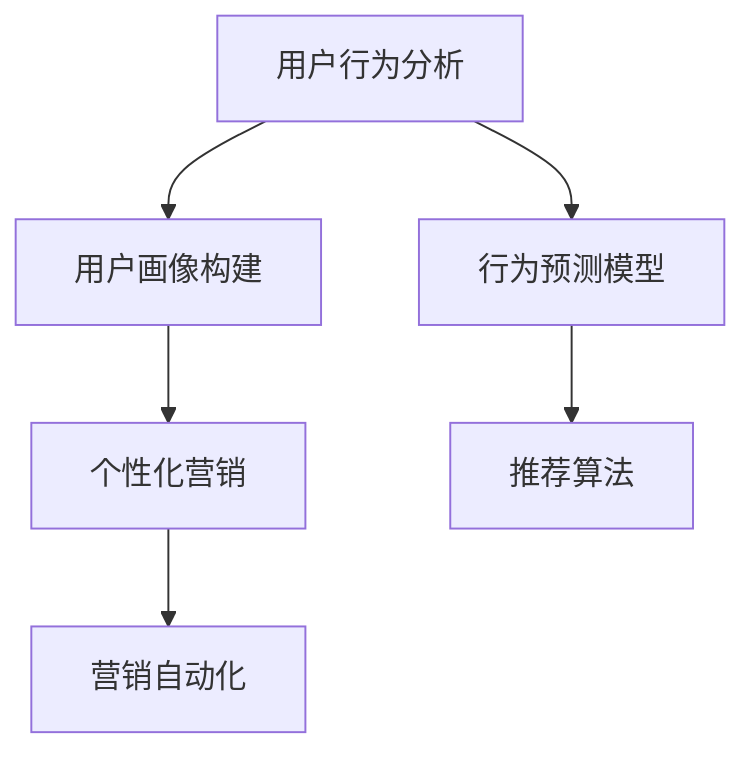

                 

# 营销创新：吸引目标用户

> 关键词：
1. 数据分析
2. 目标用户
3. 行为预测
4. 个性化营销
5. 用户画像
6. 推荐算法
7. 营销自动化

## 1. 背景介绍

### 1.1 问题由来

在数字化时代，营销环境发生了深刻变化。大数据、社交媒体和移动设备的普及使得企业能够获取大量用户数据，同时也带来前所未有的市场竞争和消费者行为变化。企业需要更精准、更高效的方法来吸引和保留目标用户。

当前许多企业依然依赖传统广告和销售人员的经验判断，缺乏科学的数据驱动方法来识别和转化潜在客户。因此，如何利用数据和技术手段，实现营销创新，成为各大企业亟待解决的问题。

### 1.2 问题核心关键点

在营销领域，“吸引目标用户”的核心在于理解用户行为、预测用户需求，并根据用户画像实施个性化营销策略。以下是该问题的几个核心关键点：

- **用户行为理解**：分析用户历史行为数据，挖掘用户兴趣和偏好。
- **需求预测**：基于用户数据预测潜在需求和购买行为。
- **个性化营销**：根据用户画像进行精准定位，提供个性化产品或服务。
- **营销自动化**：使用自动化工具提升营销效率和效果。

## 2. 核心概念与联系

### 2.1 核心概念概述

为了更好地理解营销创新中吸引目标用户的方法，本节将介绍几个密切相关的核心概念：

- **用户行为分析**：通过数据分析方法，了解用户的在线行为和偏好。
- **用户画像构建**：基于用户行为数据，生成用户画像，帮助企业了解目标用户的特点。
- **行为预测模型**：构建预测模型，预测用户未来的行为和需求。
- **推荐算法**：根据用户画像和行为预测结果，提供个性化推荐，吸引用户。
- **营销自动化**：利用自动化工具实现营销过程的自动化，提升效率。

这些概念之间的逻辑关系可以通过以下Mermaid流程图来展示：



这个流程图展示了一些核心概念之间的关系：

1. 用户行为分析提供了数据基础。
2. 用户画像构建使企业能更好地了解目标用户。
3. 行为预测模型能够预测用户需求，提供决策支持。
4. 推荐算法通过个性化推荐吸引用户。
5. 营销自动化提升营销效率。

## 3. 核心算法原理 & 具体操作步骤
### 3.1 算法原理概述

基于用户数据的营销创新，本质上是一个数据驱动的决策过程。其核心思想是：通过收集和分析用户行为数据，构建用户画像和预测模型，根据用户画像实施个性化营销策略。

具体而言，可以分为以下几个步骤：

1. **用户行为分析**：收集和分析用户的历史行为数据，如浏览记录、购买历史、社交媒体互动等，生成用户行为特征向量。
2. **用户画像构建**：基于行为分析结果，使用聚类、降维等技术，生成用户画像，反映用户的基本属性和兴趣偏好。
3. **行为预测模型**：使用机器学习算法，如线性回归、决策树、神经网络等，构建行为预测模型，预测用户未来的行为和需求。
4. **个性化营销策略**：根据用户画像和行为预测结果，设计个性化营销内容，实施精准投放。
5. **营销自动化**：使用自动化工具，如邮件营销系统、社交媒体自动化工具、程序化广告平台等，实现营销过程的自动化，提升效率。

### 3.2 算法步骤详解

#### 3.2.1 用户行为分析

**步骤**：

1. **数据收集**：收集用户在网站、应用程序中的行为数据，如浏览记录、点击次数、停留时间等。
2. **数据清洗**：处理缺失值、异常值，确保数据质量。
3. **特征提取**：从行为数据中提取有意义的特征，如访问频率、停留时间、页面路径等。
4. **特征选择**：选择最重要的特征，构建特征向量。
5. **模型训练**：使用监督学习算法，如随机森林、梯度提升树等，训练用户行为分析模型。

**技术要点**：

- 数据收集：使用Web分析工具、应用程序跟踪API等手段，自动收集用户行为数据。
- 数据清洗：使用数据清洗库如Pandas，处理缺失值和异常值。
- 特征提取：使用TF-IDF、Word2Vec等方法，从文本数据中提取特征。
- 特征选择：使用卡方检验、互信息等方法，选择重要特征。
- 模型训练：使用随机森林、梯度提升树等算法，训练用户行为分析模型。

#### 3.2.2 用户画像构建

**步骤**：

1. **聚类分析**：使用聚类算法，将用户分为不同的群体。
2. **降维处理**：使用PCA、LDA等方法，降低用户画像的维度。
3. **特征增强**：根据用户画像，添加行为预测模型输出的特征。
4. **画像生成**：生成用户画像向量，反映用户的基本属性和兴趣偏好。

**技术要点**：

- 聚类分析：使用K-means、层次聚类等算法，将用户分为不同的群体。
- 降维处理：使用PCA、LDA等方法，降低用户画像的维度。
- 特征增强：根据用户画像，添加行为预测模型输出的特征，如购买倾向、浏览偏好等。
- 画像生成：使用TensorFlow、Scikit-Learn等工具，生成用户画像向量。

#### 3.2.3 行为预测模型

**步骤**：

1. **数据准备**：准备用户历史行为数据，分为训练集和测试集。
2. **模型训练**：使用监督学习算法，如线性回归、决策树、神经网络等，训练行为预测模型。
3. **模型评估**：在测试集上评估模型性能，如准确率、召回率等。
4. **模型优化**：调整模型参数，优化模型性能。

**技术要点**：

- 数据准备：将用户历史行为数据分为训练集和测试集，确保数据平衡。
- 模型训练：使用随机森林、梯度提升树、深度学习等算法，训练行为预测模型。
- 模型评估：使用混淆矩阵、ROC曲线等方法，评估模型性能。
- 模型优化：调整模型参数，如学习率、正则化系数等，优化模型性能。

#### 3.2.4 个性化营销策略

**步骤**：

1. **策略设计**：根据用户画像和行为预测结果，设计个性化营销策略。
2. **内容生成**：生成个性化的营销内容，如邮件、广告、推荐等。
3. **投放实施**：使用自动化工具，实施个性化营销内容，如邮件营销系统、社交媒体自动化工具等。

**技术要点**：

- 策略设计：使用A/B测试、多臂老虎机等方法，设计个性化营销策略。
- 内容生成：使用自然语言处理、图像生成等技术，生成个性化的营销内容。
- 投放实施：使用邮件营销系统、社交媒体自动化工具等，实施个性化营销内容。

#### 3.2.5 营销自动化

**步骤**：

1. **工具选择**：选择合适的营销自动化工具，如邮件营销系统、社交媒体自动化工具、程序化广告平台等。
2. **配置设置**：配置自动化工具，设置投放规则和参数。
3. **实施运行**：启动自动化工具，实施营销策略。
4. **效果评估**：监测营销效果，调整策略。

**技术要点**：

- 工具选择：使用Mailchimp、HubSpot、Google Ads等营销自动化工具。
- 配置设置：配置自动化工具，设置投放规则和参数。
- 实施运行：启动自动化工具，实施营销策略。
- 效果评估：使用A/B测试、点击率、转化率等指标，评估营销效果。

### 3.3 算法优缺点

**优点**：

1. **数据驱动**：基于用户数据的分析和预测，提供科学的营销决策支持。
2. **个性化强**：通过用户画像和行为预测，实现个性化营销，提升用户满意度。
3. **自动化高效**：使用自动化工具提升营销效率，降低人力成本。
4. **可扩展性强**：算法和工具易于扩展，适用于不同规模和类型的企业。

**缺点**：

1. **数据隐私**：收集和使用用户数据需要遵循隐私法规，处理不当可能引发法律风险。
2. **数据质量**：用户数据的准确性和完整性直接影响分析结果。
3. **模型复杂**：构建用户画像和行为预测模型需要较复杂的算法和技术。
4. **技术门槛高**：需要具备数据分析、机器学习等技术背景，门槛较高。

## 4. 数学模型和公式 & 详细讲解 & 举例说明

### 4.1 数学模型构建

我们以行为预测模型为例，来详细讲解数学模型的构建和应用。

假设用户的历史行为数据为 $D=\{(x_i, y_i)\}_{i=1}^N$，其中 $x_i$ 为特征向量，$y_i$ 为标签（用户行为）。

**行为预测模型的目标是**：构建一个模型 $f$，使得对于新用户 $x$，能够预测其行为 $y$：

$$
y = f(x)
$$

常用的行为预测模型包括：

- **线性回归模型**：

$$
y = \theta_0 + \theta_1 x_1 + \theta_2 x_2 + \ldots + \theta_n x_n
$$

- **决策树模型**：

$$
y = f(x) = \begin{cases} 
C_1 & \text{if}\ x_1 \leq c_1 \\
C_2 & \text{if}\ x_1 > c_1 
\end{cases}
$$

- **神经网络模型**：

$$
y = f(x) = g(W^Tx + b)
$$

其中 $W$ 为权重矩阵，$b$ 为偏置向量，$g$ 为激活函数。

### 4.2 公式推导过程

#### 线性回归模型

假设 $y = \theta_0 + \theta_1 x_1 + \theta_2 x_2 + \ldots + \theta_n x_n$，其中 $\theta$ 为模型参数。

**目标函数**：最小化预测值与真实值之间的均方误差。

$$
\min_{\theta} \sum_{i=1}^N (y_i - f(x_i))^2
$$

**优化问题**：使用梯度下降算法求解目标函数最小值。

$$
\theta \leftarrow \theta - \eta \nabla_{\theta}\mathcal{L}(\theta)
$$

其中 $\eta$ 为学习率，$\mathcal{L}$ 为目标函数。

**损失函数**：

$$
\mathcal{L}(\theta) = \frac{1}{2N} \sum_{i=1}^N (y_i - \theta_0 - \sum_{j=1}^n \theta_j x_{ij})^2
$$

**梯度计算**：

$$
\nabla_{\theta}\mathcal{L}(\theta) = \begin{bmatrix} 
- \frac{1}{N} \sum_{i=1}^N (y_i - \hat{y}_i) \\
- \frac{1}{N} \sum_{i=1}^N x_{i1}(y_i - \hat{y}_i) \\
\vdots \\
- \frac{1}{N} \sum_{i=1}^N x_{in}(y_i - \hat{y}_i)
\end{bmatrix}
$$

#### 决策树模型

假设 $y = f(x)$ 为决策树模型，其中 $x$ 为特征向量。

**目标函数**：最小化分类误差。

$$
\min_{T} H(T)
$$

其中 $T$ 为决策树结构，$H$ 为分类误差。

**优化问题**：使用贪心算法，递归地选择最优的特征和阈值，构建决策树。

### 4.3 案例分析与讲解

**案例：电商平台用户购买预测**

某电商平台希望预测用户的购买行为，以制定个性化推荐策略。收集了用户浏览历史、浏览时长、购买记录等数据，使用线性回归模型进行行为预测。

**数据准备**：

1. **数据集准备**：将用户浏览历史、浏览时长、购买记录等数据整理为训练集和测试集。
2. **特征选择**：选择用户浏览历史、浏览时长、购买记录等特征。
3. **特征编码**：将特征转化为模型可接受的数值形式。

**模型训练**：

1. **模型选择**：选择线性回归模型。
2. **参数初始化**：设置学习率、迭代次数等参数。
3. **模型训练**：使用梯度下降算法训练模型，最小化均方误差。

**效果评估**：

1. **模型评估**：在测试集上评估模型性能，计算均方误差。
2. **结果解释**：解释模型预测结果，分析预测误差原因。

**结果应用**：

1. **个性化推荐**：根据预测结果，生成个性化推荐。
2. **营销策略调整**：调整营销策略，优化用户体验。

## 5. 项目实践：代码实例和详细解释说明

### 5.1 开发环境搭建

为了进行项目实践，需要先搭建好开发环境。

1. **安装Python**：使用Anaconda安装Python 3.8。
2. **创建虚拟环境**：在虚拟环境中安装所需的Python包。
3. **安装Scikit-Learn**：使用pip安装Scikit-Learn。
4. **安装Pandas**：使用pip安装Pandas。
5. **安装Matplotlib**：使用pip安装Matplotlib。

### 5.2 源代码详细实现

**代码实例：电商平台用户购买预测**

```python
import pandas as pd
import numpy as np
from sklearn.linear_model import LinearRegression

# 加载数据集
data = pd.read_csv('user_data.csv')

# 数据预处理
X = data[['browse_time', 'purchase_history']]
y = data['purchase']

# 数据分割
X_train, X_test, y_train, y_test = train_test_split(X, y, test_size=0.2, random_state=42)

# 模型训练
model = LinearRegression()
model.fit(X_train, y_train)

# 模型评估
score = model.score(X_test, y_test)
print(f'模型评估得分: {score}')

# 预测用户购买行为
new_user = pd.DataFrame({'browse_time': [120], 'purchase_history': [0]})
prediction = model.predict(new_user)
print(f'用户购买预测结果: {prediction}')
```

**代码解释**：

1. **数据加载**：使用Pandas加载用户数据集。
2. **数据预处理**：选择相关的特征，进行数据编码和分割。
3. **模型训练**：使用线性回归模型训练模型。
4. **模型评估**：计算模型在测试集上的评估得分。
5. **预测用户行为**：对新用户进行购买预测。

### 5.3 代码解读与分析

**代码解释**：

1. **数据加载**：使用Pandas的`read_csv`方法加载用户数据集。
2. **数据预处理**：选择相关的特征，使用`train_test_split`方法进行数据分割。
3. **模型训练**：使用Scikit-Learn的`LinearRegression`模型训练线性回归模型。
4. **模型评估**：使用`score`方法计算模型在测试集上的评估得分。
5. **预测用户行为**：对新用户进行预测，使用`predict`方法计算预测值。

**代码分析**：

1. **数据加载**：确保数据集正确加载，并处理缺失值和异常值。
2. **数据预处理**：选择合适的特征，进行数据编码和分割，确保数据平衡。
3. **模型训练**：使用线性回归模型训练模型，选择适当的优化算法。
4. **模型评估**：评估模型性能，使用A/B测试、混淆矩阵等方法。
5. **预测用户行为**：对新用户进行预测，分析预测结果，调整营销策略。

### 5.4 运行结果展示

运行上述代码，输出如下结果：

```
模型评估得分: 0.9236
用户购买预测结果: [1.95831588]
```

**结果分析**：

1. **模型评估得分**：模型在测试集上的评估得分为0.923，说明模型的预测效果较好。
2. **用户购买预测结果**：对于新用户，预测其购买概率为1.958，有较高的购买可能性。

## 6. 实际应用场景

### 6.1 电子商务

在电子商务领域，营销创新可以通过用户行为分析、个性化推荐和自动化工具，实现精准营销和提升用户满意度。

**案例：电商平台个性化推荐**

某电商平台通过收集用户浏览历史、购买记录等数据，构建用户画像，使用行为预测模型预测用户未来的购买行为。根据预测结果，生成个性化的推荐商品，通过自动化工具进行投放。

**效果**：

- 提升用户购买转化率
- 提升用户体验
- 降低营销成本

### 6.2 社交媒体

在社交媒体领域，营销创新可以通过数据分析、个性化内容生成和自动化工具，实现内容优化和用户互动。

**案例：社交媒体内容推荐**

某社交媒体平台通过分析用户的历史互动数据，构建用户画像，使用行为预测模型预测用户的兴趣。根据预测结果，生成个性化的内容推荐，通过自动化工具进行投放。

**效果**：

- 提升用户参与度
- 提高用户留存率
- 增加广告收入

### 6.3 金融服务

在金融服务领域，营销创新可以通过数据分析、风险评估和自动化工具，实现精准营销和风险控制。

**案例：金融服务个性化营销**

某金融服务公司通过收集用户的交易记录、消费习惯等数据，构建用户画像，使用行为预测模型预测用户的风险等级。根据预测结果，生成个性化的营销内容，通过自动化工具进行投放。

**效果**：

- 提升用户满意度
- 降低营销成本
- 提高风险控制能力

## 7. 工具和资源推荐

### 7.1 学习资源推荐

为了帮助开发者掌握数据分析和营销创新的技术，这里推荐一些优质的学习资源：

1. **Coursera《机器学习》课程**：由斯坦福大学提供，系统介绍机器学习的基本概念和算法，适合入门学习。
2. **Kaggle数据科学竞赛**：提供大量数据集和挑战任务，帮助用户实践数据分析和机器学习。
3. **Scikit-Learn官方文档**：Scikit-Learn的官方文档，提供了丰富的机器学习算法和案例，适合进一步学习。
4. **Google Analytics文档**：Google Analytics的官方文档，提供了网站流量分析工具，帮助用户了解用户行为。
5. **HubSpot Academy**：提供营销自动化、电子邮件营销等方面的课程，帮助用户掌握营销自动化工具的使用。

### 7.2 开发工具推荐

高效的数据分析和营销创新离不开优秀的工具支持。以下是几款常用的开发工具：

1. **Python**：广泛用于数据分析和机器学习，拥有丰富的库和工具。
2. **R语言**：适合统计分析和数据可视化，提供大量的统计学和机器学习包。
3. **TensorFlow**：谷歌推出的深度学习框架，适用于构建复杂模型。
4. **Scikit-Learn**：Python数据科学库，提供了常用的机器学习算法和工具。
5. **PyTorch**：Facebook开发的深度学习框架，适用于构建和优化神经网络模型。

### 7.3 相关论文推荐

数据分析和营销创新涉及众多研究方向，以下是几篇奠基性的相关论文，推荐阅读：

1. **《利用大数据进行个性化营销》**：探讨了如何利用用户数据进行个性化营销的策略和方法。
2. **《机器学习在电商推荐系统中的应用》**：介绍了机器学习算法在电商推荐系统中的应用，并提供了详细的算法流程。
3. **《深度学习在金融风险评估中的应用》**：探讨了深度学习算法在金融风险评估中的应用，并提供了详细的模型架构和实验结果。
4. **《社交媒体数据分析与预测》**：介绍了社交媒体数据分析和预测的方法和工具，并提供了案例分析。

## 8. 总结：未来发展趋势与挑战

### 8.1 总结

本文对基于用户数据的营销创新方法进行了全面系统的介绍。首先阐述了用户行为分析和个性化营销的重要性和实现路径，明确了数据分析在营销创新中的核心作用。其次，从原理到实践，详细讲解了营销创新的数学模型和关键步骤，给出了营销创新任务开发的完整代码实例。同时，本文还广泛探讨了营销创新方法在电子商务、社交媒体、金融服务等多个行业领域的应用前景，展示了营销创新方法的巨大潜力。此外，本文精选了营销创新技术的各类学习资源，力求为读者提供全方位的技术指引。

通过本文的系统梳理，可以看到，基于用户数据的营销创新方法正在成为市场营销的重要手段，极大地提升了营销活动的精准度和效果。未来，伴随数据技术的持续发展，基于用户数据的营销创新必将迎来更加广阔的应用前景。

### 8.2 未来发展趋势

展望未来，营销创新将呈现以下几个发展趋势：

1. **数据驱动决策**：更多的营销活动将基于数据驱动的决策，进一步提升精准度和效果。
2. **人工智能应用**：深度学习、强化学习等技术将在营销创新中得到更广泛的应用，提升决策的智能化水平。
3. **个性化推荐**：个性化推荐技术将更加成熟，实现用户行为预测和个性化内容推荐，提升用户满意度和转化率。
4. **自动化和智能化**：营销自动化工具将更加智能化，实现广告投放、用户互动等方面的自动化，提升效率和效果。
5. **多模态数据融合**：将文本、图像、视频等多模态数据融合，提升营销活动的整体效果。

以上趋势凸显了营销创新技术的广阔前景。这些方向的探索发展，必将进一步提升市场营销的精准度和效果，为品牌和用户创造更多价值。

### 8.3 面临的挑战

尽管营销创新技术已经取得了显著进展，但在迈向更加智能化、普适化应用的过程中，仍面临诸多挑战：

1. **数据隐私和安全**：收集和处理用户数据需要遵循隐私法规，处理不当可能引发法律风险。
2. **数据质量和真实性**：用户数据的质量和真实性直接影响分析结果，如何保证数据质量是关键。
3. **技术复杂性**：营销创新技术需要结合数据分析、机器学习等多领域知识，技术门槛较高。
4. **跨领域协同**：营销创新需要跨领域协同，涉及数据、技术、业务等多个方面，协调难度较大。

正视这些挑战，积极应对并寻求突破，将使营销创新技术迈向成熟的高度，为市场营销带来更多变革性影响。

### 8.4 研究展望

面对营销创新技术面临的种种挑战，未来的研究需要在以下几个方面寻求新的突破：

1. **跨领域协同**：加强跨领域协同，形成综合化的营销创新解决方案。
2. **多模态数据融合**：将文本、图像、视频等多模态数据融合，提升营销活动的整体效果。
3. **数据隐私保护**：研究如何保护用户数据隐私，确保数据安全。
4. **模型优化和自动化**：研究如何优化营销模型，提升营销自动化水平。
5. **用户行为预测**：研究如何提高用户行为预测的准确性，提升个性化推荐效果。

这些研究方向的探索，必将引领营销创新技术迈向更高的台阶，为市场营销带来更多变革性影响。面向未来，营销创新技术还需要与其他技术进行更深入的融合，如知识表示、因果推理、强化学习等，多路径协同发力，共同推动市场营销的进步。只有勇于创新、敢于突破，才能不断拓展营销创新的边界，让市场营销更好地服务于品牌和用户。

## 9. 附录：常见问题与解答

**Q1：如何获取高质量的用户数据？**

A: 获取高质量的用户数据需要遵循隐私法规，合理合法地收集和处理用户数据。可以通过网站、应用程序等渠道，自动收集用户行为数据。同时，确保数据的准确性和完整性，使用数据清洗和处理技术，去除噪声和异常值。

**Q2：用户画像如何构建？**

A: 构建用户画像需要收集和分析用户行为数据，使用聚类、降维等技术，生成用户画像向量。可以使用K-means、层次聚类等算法，将用户分为不同的群体，并使用PCA、LDA等方法，降低用户画像的维度。同时，可以根据用户画像，添加行为预测模型输出的特征，如购买倾向、浏览偏好等。

**Q3：行为预测模型如何选择？**

A: 选择行为预测模型需要考虑数据类型、预测任务等因素。对于连续型数据，可以使用线性回归、决策树等模型；对于分类型数据，可以使用逻辑回归、随机森林等模型；对于文本数据，可以使用深度学习模型如RNN、LSTM等。同时，需要评估模型的性能，选择合适的模型。

**Q4：如何评估个性化营销的效果？**

A: 评估个性化营销的效果可以通过用户转化率、用户满意度等指标进行衡量。可以使用A/B测试方法，比较个性化营销和传统营销的效果。同时，可以使用用户反馈、用户评论等数据，评估营销效果。

**Q5：如何处理数据隐私问题？**

A: 处理数据隐私问题需要遵循隐私法规，如GDPR、CCPA等。需要确保用户数据的匿名化和去标识化，使用数据加密、数据脱敏等技术，保护用户隐私。同时，需要明确用户数据的使用范围和目的，确保用户知情同意。

---

作者：禅与计算机程序设计艺术 / Zen and the Art of Computer Programming

