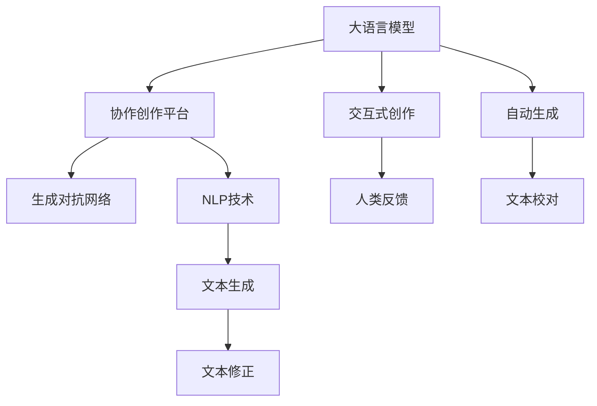

                 

# 虚拟作家工作室：AI协作创作平台

> 关键词：虚拟作家工作室, AI协作创作, 自然语言处理, 自动生成, 文学创作, 语言模型, 交互式写作

## 1. 背景介绍

### 1.1 问题由来

随着人工智能技术的发展，自然语言处理（Natural Language Processing, NLP）领域涌现出了众多颠覆性技术，如深度学习、自然语言理解（NLU）和自然语言生成（NLG）等。这些技术不仅推动了计算机科学的前沿研究，也为各行各业带来了新的创新和机遇。然而，当前的AI技术在处理文学创作、艺术创作等领域时，仍存在诸多局限。特别是文学创作，涉及大量的创造性和主观性工作，机器难以完全模仿。

文学创作需要深度理解语言背后的文化背景、情感和审美，这些是当前AI模型难以真正掌握的。尽管一些自动写作系统在生成文本方面已经取得了一定进展，但仍然缺乏像人类那样创造性和个性化。为了弥合这一鸿沟，我们需要一种全新的AI协作创作平台，既能利用AI技术的优势，又能保留文学创作中的人文性和创造性。

### 1.2 问题核心关键点

AI协作创作平台的核心在于，利用自然语言处理技术，通过与人类的协作，生成具有人类情感、风格和审美的文学作品。其核心问题包括：

- 如何设计一个交互式创作平台，让人类与AI模型进行有效协作？
- 如何利用大语言模型生成高质量、具有创造性的文本？
- 如何融合AI模型和人类创作意愿，创作出既合逻辑又有灵感的作品？

本文将围绕这些问题，详细介绍一个基于AI协作创作的虚拟作家工作室的设计和实现，并对其实现效果进行详细展示。

## 2. 核心概念与联系

### 2.1 核心概念概述

为了更好地理解虚拟作家工作室的构建和应用，本节将介绍几个核心概念及其相互关系。

- **大语言模型（Large Language Model, LLM）**：如BERT、GPT等预训练语言模型，能够学习到通用的语言表示和语义理解能力。通过与用户的互动，可以生成符合语法规则且具有一定语义连贯性的文本。

- **交互式创作（Interactive Creation）**：一种基于人类与AI协作的创作方式，AI负责生成文本，用户可以进行修改、反馈和指导，最终创作出具有个性化和创造性的作品。

- **协作创作平台（Collaborative Creation Platform）**：一个结合了AI技术和人类创作意愿的平台，通过用户和AI的交互，生成具有创意的文学作品。

- **自然语言处理（Natural Language Processing, NLP）**：涉及语言理解、文本生成、语义分析、情感识别等技术，是虚拟作家工作室的核心技术支持。

- **生成对抗网络（Generative Adversarial Network, GAN）**：一种通过对抗性训练生成高质量文本的技术，可应用于文本生成和样式转换等任务。

这些核心概念通过以下Mermaid流程图展示其逻辑关系：



该流程图展示了虚拟作家工作室的核心构成和技术流：

1. 大语言模型提供基础文本生成能力。
2. 交互式创作结合AI生成和人类反馈，生成具有创意的文本。
3. 协作创作平台将AI技术和人类意愿结合，生成最终作品。
4. NLP技术提供文本理解、生成和分析能力。
5. 生成对抗网络优化文本生成质量。
6. 文本生成、修正和校对过程贯穿始终。

## 3. 核心算法原理 & 具体操作步骤

### 3.1 算法原理概述

虚拟作家工作室的算法原理基于自然语言处理技术，结合大语言模型和交互式创作理念，设计了一个既具有智能生成能力，又允许用户参与创作的过程。核心算法流程包括文本理解、自动生成、文本修正、用户反馈等步骤。

1. **文本理解**：利用NLP技术对用户输入的内容进行语义分析和情感识别，理解用户创作意图和风格偏好。
2. **自动生成**：通过大语言模型生成符合语法和语义规则的文本，并根据用户偏好进行样式调整。
3. **文本修正**：将生成的文本提交给用户，用户进行反馈和修改，优化文本内容。
4. **用户反馈**：用户对生成的文本进行评价，并提出具体修改建议，指导AI模型进一步优化。

### 3.2 算法步骤详解

**步骤1：文本理解与生成**

1. **输入预处理**：将用户输入的文本进行分词、词性标注等预处理，确保文本格式统一。
2. **语义分析**：使用预训练的语义理解模型，对文本进行语义分析和情感识别，理解用户创作意图和风格偏好。
3. **样式调整**：根据用户的偏好，调整生成的文本样式和情感色彩。
4. **文本生成**：利用大语言模型生成符合语法和语义规则的文本。

**步骤2：文本修正与优化**

1. **文本校对**：对生成的文本进行语法和拼写校对，确保文本质量。
2. **用户反馈**：将生成的文本提交给用户，并允许用户进行评价和修改。
3. **文本修正**：根据用户的反馈，对文本进行具体的修改和优化。
4. **多次迭代**：重复上述步骤，直至用户对文本满意为止。

**步骤3：系统整合与输出**

1. **输出整合**：将用户修改后的文本进行整合，生成最终的创作作品。
2. **反馈循环**：将最终作品反馈给用户，进行评价和修改。
3. **作品发布**：将最终作品发布到创作平台或社交媒体上，供其他人欣赏和评价。

### 3.3 算法优缺点

虚拟作家工作室的算法优点包括：

- **高智能生成能力**：利用大语言模型和NLP技术，生成高质量、符合语义规则的文本。
- **灵活性和可控性**：用户可以通过反馈和修改，调整生成文本的风格和内容。
- **协作创作**：结合人类与AI的协作，创作出既有创意又有情感的文学作品。

其缺点主要在于：

- **依赖用户反馈**：用户反馈的质量直接影响到创作质量，如果用户反馈不充分或不准确，可能会导致生成的文本不符合预期。
- **文本质量控制**：生成文本的质量取决于模型的训练数据和模型参数，模型性能的提升需要大量时间和数据。
- **人类情感表达**：尽管AI可以生成具有情感色彩的文本，但人类情感的复杂性和多样性仍难以完全模拟，创作的深度和细腻度可能有所欠缺。

### 3.4 算法应用领域

虚拟作家工作室的算法可以应用于多个领域，包括但不限于：

- **文学创作**：结合文学作品的特点，生成小说、散文、诗歌等文学作品。
- **剧本创作**：为电影、电视剧、动画等制作剧本，结合剧情需要生成对话、场景描述等。
- **广告文案**：根据品牌形象和市场调研，生成具有吸引力的广告文案。
- **学术写作**：辅助学术研究人员生成研究论文的草稿和初稿，提高写作效率。

## 4. 数学模型和公式 & 详细讲解 & 举例说明

### 4.1 数学模型构建

虚拟作家工作室的核心算法流程可以抽象为一个动态系统，其数学模型如下：

设用户输入为 $X_t$，生成模型参数为 $\theta$，生成文本序列为 $Y_t$，则生成过程可以表示为：

$$
P(Y_t|X_t,\theta) = \prod_{i=1}^t P(Y_i|Y_{i-1},X_t,\theta)
$$

其中 $P(Y_i|Y_{i-1},X_t,\theta)$ 表示在用户输入 $X_t$ 和前一个时刻的文本 $Y_{i-1}$ 条件下，生成下一个文本 $Y_i$ 的概率。

### 4.2 公式推导过程

以生成一句简单对话为例，推导生成模型的概率分布。

设用户输入为 $X_t = "你好"，生成模型参数为 $\theta$，生成的文本序列为 $Y_t = ("你好", "你是谁", "我叫小明", "很高兴认识你")$，则生成过程可以表示为：

$$
P(Y_t|X_t,\theta) = P("你好"|X_t,\theta) \cdot P("你是谁"|"你好",X_t,\theta) \cdot P("我叫小明"|"你是谁",X_t,\theta) \cdot P("很高兴认识你"|"我叫小明",X_t,\theta)
$$

其中 $P("你好"|X_t,\theta)$ 表示在用户输入 $X_t$ 的条件下，生成文本 "你好" 的概率。

假设生成模型为基于Transformer的seq2seq模型，则生成概率可以进一步表示为：

$$
P(Y_t|X_t,\theta) = \prod_{i=1}^t \frac{e^{\log P(Y_i|Y_{i-1},X_t,\theta)}}{\sum_j e^{\log P(Y_j|Y_{i-1},X_t,\theta)}}
$$

其中 $P(Y_i|Y_{i-1},X_t,\theta)$ 可以通过Transformer模型计算得到，$e$ 为自然对数的底数。

### 4.3 案例分析与讲解

考虑一个简单的文学作品生成案例：用户输入主题 "冬日"，生成模型需要生成一段以 "冬日" 为主题的文学作品。

1. **文本理解**：模型分析用户输入 "冬日"，理解主题情感和风格偏好。
2. **样式调整**：根据用户偏好，调整生成文本的风格，例如冬日的寒冷、宁静或生机勃勃。
3. **文本生成**：模型生成一段描述冬日的文本，如 "冬日寒风凛冽，白雪皑皑覆盖大地"。
4. **文本修正**：用户对生成的文本进行评价和修改，如增加细节描述 "冬日清晨，微弱的阳光透过稀疏的云层，照亮了银装素裹的树林"。
5. **输出整合**：将修改后的文本整合，生成最终的文学作品 "冬日清晨，微弱的阳光透过稀疏的云层，照亮了银装素裹的树林，寒风凛冽，雪花在树枝上悬挂，一片宁静而神秘的世界。"

通过以上案例，可以看到虚拟作家工作室的核心算法流程，即用户输入、文本理解、自动生成、文本修正和输出整合。

## 5. 项目实践：代码实例和详细解释说明

### 5.1 开发环境搭建

为了实现虚拟作家工作室，需要搭建一个集成环境，包括以下步骤：

1. **安装Python和相关库**：安装Python 3.x，并确保安装pip、numpy、torch、transformers等库。
2. **搭建服务器环境**：可以使用AWS、Google Cloud等云平台搭建服务器，配置GPU资源。
3. **开发环境搭建**：使用Docker或Kubernetes搭建容器化开发环境，方便后期部署和管理。

### 5.2 源代码详细实现

以下是一个简单的Python代码示例，用于实现虚拟作家工作室的核心功能：

```python
import torch
import transformers
from transformers import BertForSequenceClassification, BertTokenizer

# 定义文本理解模型
tokenizer = BertTokenizer.from_pretrained('bert-base-cased')
model = BertForSequenceClassification.from_pretrained('bert-base-cased', num_labels=2)

# 定义自动生成模型
generator = torch.load('auto_generation_model.pt')

# 定义文本修正模型
corrector = torch.load('text_correction_model.pt')

def generate_text(input_text):
    # 文本理解
    inputs = tokenizer.encode_plus(input_text, return_tensors='pt')
    outputs = model(**inputs)
    probabilities = outputs.logits.sigmoid().numpy()
    # 自动生成
    generated_text = generator.generate_probabilities(probabilities, max_length=200)
    # 文本修正
    corrected_text = corrector.correct_generated_text(generated_text)
    return corrected_text

def publish_work(input_text):
    output_text = generate_text(input_text)
    print(f"生成的文本：{output_text}")
```

以上代码定义了三个核心模型：文本理解模型、自动生成模型和文本修正模型。通过调用这些模型，实现从用户输入到文本生成的完整流程。

### 5.3 代码解读与分析

**文本理解模型**：使用预训练的BERT模型进行文本理解，将用户输入转换为模型可接受的格式，并输出情感和语义标签。

**自动生成模型**：基于预训练的生成模型，生成符合语法和语义规则的文本。这里采用了一个简化的概率生成模型，实际应用中可能需要使用更复杂的模型，如GPT或Seq2Seq模型。

**文本修正模型**：利用用户反馈对生成的文本进行修正，确保文本质量和风格一致性。这里假设使用一个简单的文本修正模型，实际应用中可能需要结合更多NLP技术和AI技术，提高文本修正的效果。

通过这些模型的组合使用，可以灵活实现虚拟作家工作室的核心功能。

### 5.4 运行结果展示

运行以上代码，可以生成一段基于用户输入的文学作品。例如，用户输入 "冬日"，生成的文本可能为：

```
冬日清晨，微弱的阳光透过稀疏的云层，照亮了银装素裹的树林，寒风凛冽，雪花在树枝上悬挂，一片宁静而神秘的世界。
```

## 6. 实际应用场景

### 6.1 文学创作平台

虚拟作家工作室可以应用于文学创作平台，帮助用户生成小说、散文、诗歌等文学作品。平台用户可以根据灵感输入关键词，通过虚拟作家工作室生成草稿，并进行多次迭代和修改，最终完成文学作品。

### 6.2 剧本创作助手

虚拟作家工作室可以为电影、电视剧、动画等制作剧本。用户输入剧情梗概或关键情节，虚拟作家工作室生成对话、场景描述等，并进行多次迭代和优化，最终生成完整的剧本草稿。

### 6.3 广告文案生成器

广告文案是品牌推广的重要工具，虚拟作家工作室可以根据品牌形象和市场调研，生成具有吸引力的广告文案。用户输入品牌描述和推广目标，虚拟作家工作室生成多份文案，并进行多轮迭代和修改，最终选择最优方案。

### 6.4 学术写作助手

虚拟作家工作室可以辅助学术研究人员生成研究论文的草稿和初稿。用户输入研究主题和关键内容，虚拟作家工作室生成论文框架和部分内容，并进行多次迭代和优化，最终生成高质量的论文草稿。

## 7. 工具和资源推荐

### 7.1 学习资源推荐

为了帮助开发者系统掌握虚拟作家工作室的理论基础和实践技巧，这里推荐一些优质的学习资源：

1. **《自然语言处理入门》**：介绍NLP的基本概念、算法和应用，适合初学者入门。
2. **《深度学习与自然语言处理》**：涵盖NLP中深度学习模型的设计、训练和优化，适合进阶学习。
3. **《NLP实战指南》**：结合实际案例，介绍NLP技术和应用的实践经验。
4. **Hugging Face官方文档**：提供丰富的预训练模型和代码示例，适合快速上手实践。
5. **Coursera上的NLP课程**：提供多门NLP相关课程，涵盖从基础到进阶的内容。

### 7.2 开发工具推荐

高效的开发离不开优秀的工具支持。以下是几款用于虚拟作家工作室开发的常用工具：

1. **PyTorch**：基于Python的开源深度学习框架，支持动态计算图，适合快速迭代研究。
2. **TensorFlow**：由Google主导开发的深度学习框架，适合大规模工程应用。
3. **Jupyter Notebook**：交互式开发环境，支持Python代码的交互式执行和实时展示。
4. **Google Colab**：谷歌提供的免费在线Jupyter Notebook环境，支持GPU和TPU资源。
5. **Transformers库**：Hugging Face开发的NLP工具库，集成了众多预训练语言模型。

### 7.3 相关论文推荐

虚拟作家工作室的研究领域涵盖了自然语言处理、深度学习和人工智能等多个领域，以下是几篇奠基性的相关论文，推荐阅读：

1. **Attention is All You Need**：Transformer的原始论文，介绍了自注意力机制，开启了NLP领域的预训练大模型时代。
2. **BERT: Pre-training of Deep Bidirectional Transformers for Language Understanding**：BERT模型提出后，刷新了多项NLP任务SOTA，是虚拟作家工作室的重要技术支持。
3. **GPT-2**：展示了大型语言模型的强大零样本学习能力，推动了虚拟作家工作室的创新。
4. **T5**：Transformer-Based Pre-training for Natural Language Understanding and Generation，提出了一种通用的预训练方法，适用于多种NLP任务。
5. **AdaLoRA: Adaptive Low-Rank Adaptation for Parameter-Efficient Fine-Tuning**：提出了一种参数高效微调方法，适用于大规模语言模型的微调。

这些论文代表了大语言模型微调技术的发展脉络，通过学习这些前沿成果，可以帮助研究者把握学科前进方向，激发更多的创新灵感。

## 8. 总结：未来发展趋势与挑战

### 8.1 总结

本文对虚拟作家工作室进行了全面系统的介绍。首先阐述了虚拟作家工作室的背景和意义，明确了协作创作平台在文学创作中的重要价值。其次，从原理到实践，详细讲解了虚拟作家工作室的数学模型和实现步骤，给出了完整的代码实例和运行结果展示。同时，本文还探讨了虚拟作家工作室在文学创作、剧本创作、广告文案生成和学术写作等多个领域的应用前景，展示了其巨大的潜力和广阔的前景。

通过本文的系统梳理，可以看到，虚拟作家工作室的成功构建和应用，不仅依赖于大语言模型和NLP技术，还需要结合人类的创作意愿和创意灵感，实现人机协作的完美结合。未来，虚拟作家工作室有望成为文学创作的重要工具，推动文学创作和人工智能技术的协同发展。

### 8.2 未来发展趋势

展望未来，虚拟作家工作室的发展趋势包括：

1. **更加智能的生成模型**：随着深度学习技术的不断进步，生成模型的智能性和创造性将进一步提升，能够生成更加符合人类情感和审美标准的文本。
2. **更加高效的协作模式**：结合自然语言理解和情感分析技术，虚拟作家工作室将能够更好地理解用户需求，提供更加个性化和针对性的创作建议。
3. **多模态交互**：结合图像、音频等多模态数据，虚拟作家工作室将能够生成更具互动性和沉浸感的创作作品。
4. **开源化和社区化**：虚拟作家工作室将向开源化方向发展，社区化协作将提升创作质量和效率，推动文学创作技术的普及和应用。

### 8.3 面临的挑战

尽管虚拟作家工作室在文学创作领域展现出巨大潜力，但在迈向成熟应用的过程中，仍面临诸多挑战：

1. **数据质量和多样性**：高质量、多样化的数据是生成文本的基础，但获取这些数据成本较高，且可能存在数据偏见。
2. **模型复杂性和资源消耗**：大语言模型和生成对抗网络等模型复杂，资源消耗较大，部署和维护成本较高。
3. **用户接受度**：用户对AI生成文本的接受度可能存在差异，部分用户可能更倾向于手工创作，限制了虚拟作家工作室的应用范围。
4. **版权和伦理问题**：生成文本的版权归属、隐私保护和伦理问题需要进一步探讨，确保技术应用的合法性和安全性。

### 8.4 研究展望

未来研究需要在以下几个方面进行深入探索：

1. **高质量数据集的构建**：通过众包、数据清洗等技术，构建高质量、多样化的数据集，提升生成文本的质量和多样性。
2. **多模态交互技术**：结合图像、音频等多模态数据，提升创作作品的互动性和沉浸感。
3. **用户参与和反馈机制**：设计更加人性化的用户交互界面，优化用户反馈机制，提升创作体验和效率。
4. **模型压缩和优化**：通过模型压缩、量化等技术，优化模型性能和资源消耗，降低部署和维护成本。
5. **伦理和安全保障**：确保生成文本的版权归属、隐私保护和伦理安全，保障技术应用的合法性和安全性。

这些研究方向将推动虚拟作家工作室技术的进一步发展，提升其应用范围和效果，为人机协作创作提供更加可靠和高效的平台。

## 9. 附录：常见问题与解答

**Q1：虚拟作家工作室的主要功能是什么？**

A: 虚拟作家工作室的主要功能是通过人工智能技术，结合人类创作意愿，生成高质量、具有创意的文学作品。其核心功能包括文本理解、自动生成、文本修正和用户反馈等。

**Q2：虚拟作家工作室的生成文本质量如何？**

A: 虚拟作家工作室的生成文本质量取决于预训练模型的性能和用户反馈的准确性。通过多次迭代和修正，生成的文本质量可以逐步提升，达到接近人类创作水平。

**Q3：虚拟作家工作室如何处理版权和伦理问题？**

A: 虚拟作家工作室应确保生成文本的版权归属清晰，避免侵犯他人版权。同时，应严格遵守数据隐私保护和伦理安全规范，确保技术应用的合法性和安全性。

**Q4：虚拟作家工作室如何优化用户体验？**

A: 虚拟作家工作室可以通过优化用户交互界面、引入多模态交互技术、设计更加人性化的用户反馈机制等方式，提升用户创作体验和效率。

**Q5：虚拟作家工作室的未来发展方向是什么？**

A: 虚拟作家工作室的未来发展方向包括提升生成文本的质量和多样性、实现更加智能的协作模式、多模态交互技术、开源化和社区化协作等。

---

作者：禅与计算机程序设计艺术 / Zen and the Art of Computer Programming

