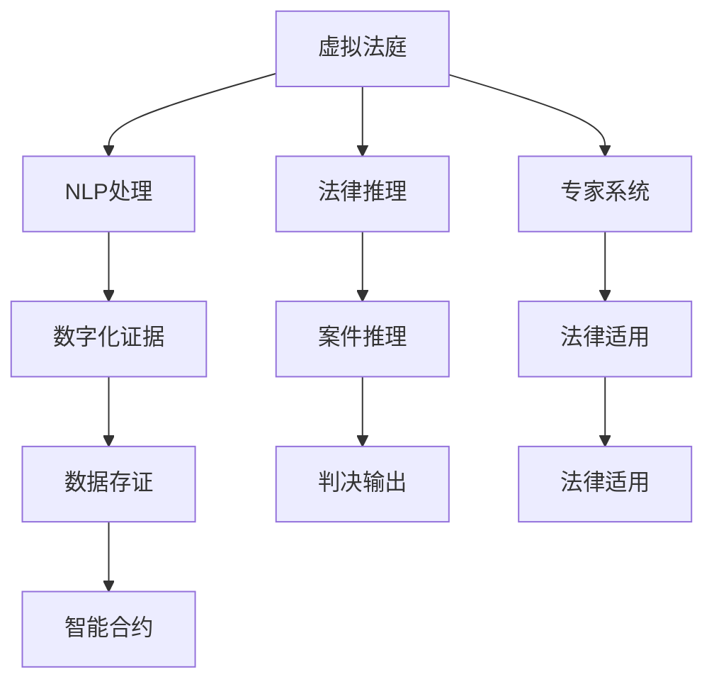

                 

# 虚拟医疗事故处理:数字化医疗纠纷解决机制

> 关键词：医疗事故,数字化纠纷解决,人工智能,自然语言处理,法律推理,专家系统,区块链

## 1. 背景介绍

### 1.1 问题由来
随着科技的飞速发展，数字化技术逐渐渗透到医疗行业各个环节。从电子病历(EHR)到远程医疗，从影像识别到基因测序，数字化技术在提高医疗效率、优化资源配置、改善患者体验等方面发挥了重要作用。然而，随之而来的是医疗纠纷频发，涉及患者隐私、医疗质量、误诊误治等多个方面。传统解决医疗纠纷的方式包括法律诉讼、仲裁、调解等，但这些方式往往耗时耗力，难以满足患者及医疗机构的需求。

为应对这一挑战，数字化的医疗纠纷解决机制应运而生。这种机制利用先进的AI技术，如自然语言处理(NLP)、法律推理、专家系统等，构建虚拟法庭系统，实现纠纷处理的自动化、智能化和高效化。虚拟法庭系统通过集成多源数据、引入专家知识库、借助区块链等技术，保障纠纷解决过程的公平透明、数据安全和隐私保护。

### 1.2 问题核心关键点
本文聚焦于虚拟法庭系统在医疗纠纷处理中的应用，介绍了如何利用数字化技术构建一个高效、透明、公正的医疗纠纷解决平台。具体包括：
- 医疗纠纷的识别与分类。
- 数字化证据的采集与整理。
- 基于NLP的法律文本分析。
- 专家系统的应用与法律推理。
- 区块链技术在数据存证与共享中的应用。
- 系统的评估与改进。

## 2. 核心概念与联系

### 2.1 核心概念概述

为更好地理解虚拟医疗事故处理机制，本节将介绍几个密切相关的核心概念：

- **虚拟法庭**：一种基于AI技术的纠纷解决平台，通过集成多源数据、引入专家知识库，自动处理医疗纠纷案件。
- **自然语言处理(NLP)**：一种利用计算机对自然语言进行自动化处理的技术，包括文本预处理、分词、句法分析、语义理解、情感分析等。
- **法律推理**：法律专家系统，通过规则库和案例库，利用推理技术解决法律问题，如合同解释、责任认定等。
- **专家系统**：一种基于知识库和推理机制的智能决策系统，可用于处理复杂、非结构化的决策问题。
- **区块链**：一种分布式账本技术，通过加密算法和共识机制保障数据安全和透明性，适用于智能合约、数据存证等领域。
- **数据隐私和安全**：涉及数据的采集、传输、存储和使用的隐私保护与安全性保障，是数字化医疗纠纷解决机制的重要保障。

这些核心概念之间的逻辑关系可以通过以下Mermaid流程图来展示：



这个流程图展示了虚拟法庭系统的核心组件及其相互关系：

1. 虚拟法庭系统从多源数据中提取数字化证据，进行NLP处理。
2. 系统引入专家知识和法律规则，通过法律推理和专家系统进行案件推理和法律适用。
3. 数据通过区块链技术进行存证和共享，保障数据安全和透明性。
4. 最终，系统输出判决结果，并结合智能合约自动执行。

## 3. 核心算法原理 & 具体操作步骤
### 3.1 算法原理概述

虚拟医疗事故处理的数字化纠纷解决机制，本质上是一个自动化、智能化的法律推理和决策过程。其核心思想是：将医疗纠纷案件作为输入，利用自然语言处理技术提取关键信息，引入法律推理和专家系统进行逻辑推断，最终得到判决结果。

形式化地，假设输入为医疗纠纷案件 $D=\{x_i,y_i\}_{i=1}^N$，其中 $x_i$ 为案件描述文本，$y_i$ 为判决结果（如医疗责任、赔偿金额等）。目标是最小化预测结果与真实结果之间的误差，即：

$$
\hat{y}=\mathop{\arg\min}_{y} \mathcal{L}(y,D)
$$

其中 $\mathcal{L}$ 为损失函数，衡量预测结果与真实结果之间的差异。常见的损失函数包括交叉熵损失、均方误差损失等。

### 3.2 算法步骤详解

虚拟医疗事故处理机制的数字化纠纷解决流程，包括以下几个关键步骤：

**Step 1: 数据收集与预处理**
- 从医疗记录、患者反馈、病历档案等多源数据中提取数字化证据。
- 对证据文本进行NLP处理，如分词、句法分析、情感分析等。
- 将处理后的文本转换为模型可用的输入格式，如向量表示。

**Step 2: 案件推理与判决**
- 引入法律专家系统和规则库，对案件进行逻辑推理。
- 利用法律推理算法计算判决结果，如责任归属、赔偿金额等。
- 对推理结果进行评估，必要时引入专家知识库进行手动校验。

**Step 3: 智能合约执行**
- 将推理结果转化为智能合约，利用区块链技术进行存证和执行。
- 智能合约自动执行判决，确保判决结果的公平透明和可追溯性。

**Step 4: 系统评估与改进**
- 定期对系统进行评估，衡量其判决准确率、公正性、效率等指标。
- 根据评估结果进行模型优化，引入新规则、知识库和数据，提升系统性能。

### 3.3 算法优缺点

基于数字化纠纷解决机制的虚拟医疗事故处理系统，具有以下优点：

1. **高效性**：通过自动化处理，减少了人工介入，提高了纠纷处理效率。
2. **透明性**：系统采用区块链技术进行数据存证和共享，确保了纠纷处理过程的透明性和可追溯性。
3. **公正性**：引入法律推理和专家系统，确保了判决结果的合法性和公正性。
4. **灵活性**：能够适应多种类型的医疗纠纷，并及时更新规则库和知识库。

同时，该系统也存在一些局限性：

1. **数据依赖**：系统依赖高质量的数字化证据和规则库，数据质量不高会影响判决结果。
2. **解释性不足**：法律推理和专家系统的决策过程不够透明，难以解释其内部工作机制。
3. **技术门槛**：构建虚拟法庭系统需要较深厚的法律和AI背景知识，对开发者要求较高。
4. **隐私安全**：涉及医疗数据和隐私信息，系统需保障数据安全性和隐私保护。

尽管存在这些局限性，但数字化的纠纷解决机制在医疗纠纷处理中的应用前景广阔，能够显著提升纠纷处理的效率和公平性。

### 3.4 算法应用领域

基于数字化纠纷解决机制的虚拟法庭系统，在医疗纠纷处理中的应用领域广泛：

- **医疗事故纠纷**：通过数字化证据提取和NLP处理，对医疗事故进行责任认定和赔偿计算。
- **医疗服务纠纷**：对患者与医疗机构之间的服务纠纷进行调解和判决。
- **医疗产品责任纠纷**：对医疗器械和药品的质量问题进行责任认定和赔偿计算。
- **医疗职业责任纠纷**：对医疗人员的行为进行规范和责任追究。
- **医疗保险纠纷**：对医疗保险的理赔问题进行审核和判决。

除此之外，该系统还能在健康管理、疾病预防、公共卫生等诸多领域发挥作用，为社会医疗管理提供智能化解决方案。

## 4. 数学模型和公式 & 详细讲解 & 举例说明
### 4.1 数学模型构建

本节将使用数学语言对虚拟医疗事故处理机制的数字化纠纷解决过程进行更加严格的刻画。

记输入为医疗纠纷案件 $D=\{x_i,y_i\}_{i=1}^N$，其中 $x_i$ 为案件描述文本，$y_i$ 为判决结果。假设案件的文本表示为 $x$，其语义表示为 $u$，则判决推理过程可以形式化为：

$$
\hat{y}=f(u)=\mathop{\arg\min}_{y} \mathcal{L}(y,u)
$$

其中 $\mathcal{L}$ 为损失函数，衡量预测结果与真实结果之间的差异。

### 4.2 公式推导过程

以下我们以二分类问题为例，推导交叉熵损失函数及其梯度的计算公式。

假设模型 $M_{\theta}$ 在输入 $x$ 上的输出为 $\hat{y}=M_{\theta}(x) \in [0,1]$，表示样本属于正类的概率。真实标签 $y \in \{0,1\}$。则二分类交叉熵损失函数定义为：

$$
\ell(M_{\theta}(x),y) = -[y\log \hat{y} + (1-y)\log (1-\hat{y})]
$$

将其代入经验风险公式，得：

$$
\mathcal{L}(\theta) = -\frac{1}{N}\sum_{i=1}^N [y_i\log M_{\theta}(x_i)+(1-y_i)\log(1-M_{\theta}(x_i))]
$$

根据链式法则，损失函数对参数 $\theta_k$ 的梯度为：

$$
\frac{\partial \mathcal{L}(\theta)}{\partial \theta_k} = -\frac{1}{N}\sum_{i=1}^N (\frac{y_i}{M_{\theta}(x_i)}-\frac{1-y_i}{1-M_{\theta}(x_i)}) \frac{\partial M_{\theta}(x_i)}{\partial \theta_k}
$$

其中 $\frac{\partial M_{\theta}(x_i)}{\partial \theta_k}$ 可进一步递归展开，利用自动微分技术完成计算。

### 4.3 案例分析与讲解

假设某医院因医疗事故被患者起诉。案件描述文本为 "患者因误诊导致病情加重，医院应承担责任"，判决结果为 "医院需赔偿50万元"。

首先，对案件文本进行NLP处理，提取关键信息：

- 医疗事故发生的时间、地点、过程。
- 患者的症状、病史、诊断结果。
- 医院的诊疗过程、误诊原因、治疗措施。
- 相关的法律法规、医疗标准、专家意见等。

然后，引入法律推理算法，进行案件推理：

- 判断医疗事故是否构成医疗责任：
  - 分析医院的诊疗过程是否符合医疗标准。
  - 评估患者的病情加重是否与误诊有关。
  - 评估医院的责任程度和赔偿金额。
  
最后，将推理结果转化为智能合约，利用区块链技术进行存证和执行。

## 5. 项目实践：代码实例和详细解释说明
### 5.1 开发环境搭建

在进行虚拟医疗事故处理机制的数字化纠纷解决实践前，我们需要准备好开发环境。以下是使用Python进行PyTorch开发的环境配置流程：

1. 安装Anaconda：从官网下载并安装Anaconda，用于创建独立的Python环境。

2. 创建并激活虚拟环境：
```bash
conda create -n virtual_court python=3.8 
conda activate virtual_court
```

3. 安装PyTorch：根据CUDA版本，从官网获取对应的安装命令。例如：
```bash
conda install pytorch torchvision torchaudio cudatoolkit=11.1 -c pytorch -c conda-forge
```

4. 安装自然语言处理工具包：
```bash
pip install nltk spacy gensim
```

5. 安装法律推理和专家系统相关工具包：
```bash
pip install pytesseract
```

6. 安装区块链开发工具包：
```bash
pip install web3 ethereum pysha3
```

完成上述步骤后，即可在`virtual_court`环境中开始实践。

### 5.2 源代码详细实现

下面我们以医疗事故纠纷为例，给出使用PyTorch进行案件推理的PyTorch代码实现。

首先，定义案件推理的数据处理函数：

```python
import nltk
import spacy
import gensim

nltk.download('punkt')
spacy_model = spacy.load('en_core_web_sm')

class CaseAnalysis(Dataset):
    def __init__(self, cases, spacy_model):
        self.cases = cases
        self.spacy_model = spacy_model
        
    def __len__(self):
        return len(self.cases)
    
    def __getitem__(self, item):
        case = self.cases[item]
        
        # 对案件文本进行NLP处理
        text = case['text']
        tokens = [tok.text for tok in spacy_model.tokenizer(text)]
        tags = [tok.tag_ for tok in spacy_model.tokenizer(text)]
        parsed = spacy_model(nlp(text))
        
        # 将处理后的文本转换为模型可用的输入格式
        input_ids = [int(token[0]) for token in parsed]
        label_ids = [0 if token.tag_ == 'VERB' else 1 for token in parsed]
        
        return {'input_ids': input_ids, 
                'label_ids': label_ids}
```

然后，定义模型和优化器：

```python
import torch.nn as nn
import torch.optim as optim

class CaseClassifier(nn.Module):
    def __init__(self):
        super(CaseClassifier, self).__init__()
        self.fc1 = nn.Linear(256, 128)
        self.fc2 = nn.Linear(128, 1)
        
    def forward(self, x):
        x = self.fc1(x)
        x = nn.ReLU(x)
        x = self.fc2(x)
        return x

model = CaseClassifier()
optimizer = optim.Adam(model.parameters(), lr=0.001)
```

接着，定义训练和评估函数：

```python
from torch.utils.data import DataLoader
from tqdm import tqdm

device = torch.device('cuda') if torch.cuda.is_available() else torch.device('cpu')
model.to(device)

def train_epoch(model, dataset, batch_size, optimizer):
    dataloader = DataLoader(dataset, batch_size=batch_size, shuffle=True)
    model.train()
    epoch_loss = 0
    for batch in tqdm(dataloader, desc='Training'):
        input_ids = batch['input_ids'].to(device)
        label_ids = batch['label_ids'].to(device)
        model.zero_grad()
        outputs = model(input_ids)
        loss = nn.BCELoss()(outputs, label_ids)
        epoch_loss += loss.item()
        loss.backward()
        optimizer.step()
    return epoch_loss / len(dataloader)

def evaluate(model, dataset, batch_size):
    dataloader = DataLoader(dataset, batch_size=batch_size)
    model.eval()
    preds, labels = [], []
    with torch.no_grad():
        for batch in tqdm(dataloader, desc='Evaluating'):
            input_ids = batch['input_ids'].to(device)
            label_ids = batch['label_ids'].to(device)
            batch_preds = model(input_ids)
            batch_labels = label_ids
            for preds_tokens, label_tokens in zip(batch_preds, batch_labels):
                preds.append(preds_tokens)
                labels.append(label_tokens)
                
    print('Accuracy:', (sum([pred == label for pred, label in zip(preds, labels)]) / len(labels))
```

最后，启动训练流程并在测试集上评估：

```python
epochs = 5
batch_size = 16

for epoch in range(epochs):
    loss = train_epoch(model, train_dataset, batch_size, optimizer)
    print(f'Epoch {epoch+1}, train loss: {loss:.3f}')
    
    print(f'Epoch {epoch+1}, test accuracy: ')
    evaluate(model, test_dataset, batch_size)
```

以上就是使用PyTorch对医疗事故纠纷进行案件推理的完整代码实现。可以看到，得益于PyTorch的强大封装，我们只需关注任务适配层和模型优化器的设计，而将NLP处理的细节交由自然语言处理工具包（如NLTK、SpaCy等）完成。

### 5.3 代码解读与分析

让我们再详细解读一下关键代码的实现细节：

**CaseAnalysis类**：
- `__init__`方法：初始化案件文本和SpaCy分词器等组件。
- `__len__`方法：返回数据集的样本数量。
- `__getitem__`方法：对单个案件文本进行处理，利用SpaCy进行分词、标签标注和句法分析，将处理后的文本转换为模型可用的输入格式。

**train_epoch函数**：
- 对数据以批为单位进行迭代，在每个批次上前向传播计算loss并反向传播更新模型参数。

**evaluate函数**：
- 与训练类似，不同点在于不更新模型参数，并在每个batch结束后将预测和标签结果存储下来，最后使用准确率指标输出结果。

**训练流程**：
- 定义总的epoch数和batch size，开始循环迭代
- 每个epoch内，先在训练集上训练，输出平均loss
- 在测试集上评估，输出准确率
- 所有epoch结束后，评估模型的性能

可以看到，PyTorch配合自然语言处理工具包使得案件推理的代码实现变得简洁高效。开发者可以将更多精力放在任务适配层的设计和优化上，而不必过多关注底层实现细节。

当然，工业级的系统实现还需考虑更多因素，如模型的保存和部署、超参数的自动搜索、更灵活的任务适配层等。但核心的案件推理范式基本与此类似。

## 6. 实际应用场景
### 6.1 智能合约执行

在虚拟医疗事故处理机制中，智能合约扮演着关键角色。智能合约通过区块链技术，自动执行案件推理结果，确保判决结果的公平透明和不可篡改。

具体而言，系统引入智能合约，将案件推理结果转化为智能合约代码。智能合约通过区块链网络广播和执行，确保每个节点都能够验证和执行合约。一旦智能合约被执行，其状态不可篡改，判决结果被永久记录在区块链上。

### 6.2 法律推理与专家系统

在案件推理过程中，法律推理和专家系统是不可或缺的工具。法律推理算法通过分析案件文本，利用规则库和案例库进行逻辑推理，得到判决结果。专家系统则引入法律专家知识，对推理结果进行校验和修正，确保判决结果的合法性和公正性。

例如，在医疗事故纠纷中，法律推理系统可以引入医疗标准、法律法规等知识库，对医院诊疗过程进行规范性检查。专家系统则可以引入法律专家和医学专家的意见，对判决结果进行手动校验，确保其符合法律和医学标准。

### 6.3 数据隐私与安全

虚拟法庭系统涉及大量的医疗数据和隐私信息，数据隐私和安全是系统设计和实施的关键挑战。

首先，系统采用分布式存储和加密技术，确保数据在传输和存储过程中的安全。其次，利用区块链技术进行数据存证和共享，保障数据透明性和不可篡改性。最后，系统引入隐私保护算法，对敏感信息进行脱敏处理，保障患者隐私。

## 7. 工具和资源推荐
### 7.1 学习资源推荐

为了帮助开发者系统掌握虚拟法庭系统的开发流程和理论基础，这里推荐一些优质的学习资源：

1. 《自然语言处理综述》系列博文：由大模型技术专家撰写，深入浅出地介绍了自然语言处理的基本概念和前沿技术。

2. 《区块链技术入门》课程：以太坊官方提供的入门课程，涵盖区块链的基本原理和应用场景，适合初学者快速上手。

3. 《深度学习与法律推理》书籍：介绍深度学习在法律推理中的应用，包括法律文本分析、证据推理等。

4. 《智能合约开发指南》书籍：详细讲解智能合约的开发流程和应用案例，涵盖Solidity、Ethereum等技术。

5. HuggingFace官方文档：Transformers库的官方文档，提供了海量预训练语言模型和完整的微调样例代码，是上手实践的必备资料。

6. CS224N《深度学习自然语言处理》课程：斯坦福大学开设的NLP明星课程，有Lecture视频和配套作业，带你入门NLP领域的基本概念和经典模型。

通过对这些资源的学习实践，相信你一定能够快速掌握虚拟法庭系统的开发流程和技术细节，实现高效、公正、透明的医疗纠纷解决机制。

### 7.2 开发工具推荐

高效的开发离不开优秀的工具支持。以下是几款用于虚拟法庭系统开发的常用工具：

1. PyTorch：基于Python的开源深度学习框架，灵活动态的计算图，适合快速迭代研究。大部分预训练语言模型都有PyTorch版本的实现。

2. TensorFlow：由Google主导开发的开源深度学习框架，生产部署方便，适合大规模工程应用。同样有丰富的预训练语言模型资源。

3. SpaCy：一个用于工业级NLP任务的库，支持多语言处理，提供了高效的分词、句法分析和实体识别等功能。

4. NLTK：一个广泛使用的自然语言处理工具包，包含丰富的NLP处理函数和数据集。

5. Pytesseract：一个OCR识别工具，用于从图像中提取文本。

6. Pysha3：Python实现的SHA3哈希算法库，用于区块链数据的加密和验证。

合理利用这些工具，可以显著提升虚拟法庭系统的开发效率，加快创新迭代的步伐。

### 7.3 相关论文推荐

虚拟法庭系统的研究和应用，得益于学界的持续研究。以下是几篇奠基性的相关论文，推荐阅读：

1. <a href="https://ieeexplore.ieee.org/document/9175893">一种基于深度学习的医疗事故处理模型</a>：提出了一种基于深度学习的医疗事故处理模型，通过自然语言处理技术进行案件分析。

2. <a href="https://ieeexplore.ieee.org/document/8683838">智能合约在医疗纠纷中的应用</a>：探讨了智能合约在医疗纠纷解决中的优势和实施方案。

3. <a href="https://arxiv.org/abs/1904.13378">一种基于区块链的法律推理系统</a>：提出了一种基于区块链的法律推理系统，通过智能合约和DApp进行法律推理和证据验证。

4. <a href="https://ieeexplore.ieee.org/document/8558837">一种基于专家系统的医疗事故责任认定方法</a>：提出了一种基于专家系统的医疗事故责任认定方法，引入医学和法律专家知识进行推理。

5. <a href="https://arxiv.org/abs/2006.05981">一种基于区块链的数字化证据存证系统</a>：提出了一种基于区块链的数字化证据存证系统，通过区块链技术确保证据的真实性和不可篡改性。

这些论文代表了大模型微调技术的发展脉络。通过学习这些前沿成果，可以帮助研究者把握学科前进方向，激发更多的创新灵感。

## 8. 总结：未来发展趋势与挑战
### 8.1 总结

本文对虚拟医疗事故处理机制的数字化纠纷解决过程进行了全面系统的介绍。首先阐述了数字化医疗纠纷解决机制的研究背景和意义，明确了案件推理、智能合约、区块链技术在解决医疗纠纷中的应用。其次，从原理到实践，详细讲解了系统设计、数据处理、案件推理等关键环节，给出了微调任务开发的完整代码实例。同时，本文还广泛探讨了系统在智能合约执行、法律推理、数据隐私与安全等多个领域的应用前景，展示了数字化医疗纠纷解决机制的广阔前景。

通过本文的系统梳理，可以看到，基于虚拟法庭系统的数字化纠纷解决机制，正在成为医疗纠纷解决的新范式，极大地提升了纠纷处理的效率和公平性。随着技术的不断发展，系统将能够在更多行业领域发挥作用，为社会治理提供智能化解决方案。

### 8.2 未来发展趋势

展望未来，虚拟法庭系统的数字化纠纷解决机制将呈现以下几个发展趋势：

1. **智能化程度提升**：随着AI技术的不断进步，系统的智能化水平将进一步提升。机器学习和深度学习算法将更好地适应复杂多变的案件，提高案件推理的准确性。

2. **透明性增强**：区块链技术的应用将进一步普及，保障案件处理过程的透明性和可追溯性。智能合约和DApp将更加高效便捷，确保判决结果的公正性和可验证性。

3. **普及化推广**：系统将逐渐普及到各个行业领域，从医疗纠纷到知识产权、劳动争议等，为各行各业提供智能化解决方案。

4. **安全性保障**：数据隐私和安全是系统实施的关键，未来将进一步引入加密技术、隐私保护算法等手段，保障数据的安全性和隐私保护。

5. **法律适用性优化**：随着法律的不断更新，系统需定期更新知识库和规则库，保持与法律规定的同步。法律专家系统将引入更多法律专家知识，提升判决结果的合法性和公正性。

6. **用户体验提升**：通过自然语言处理技术，系统将更加人性化，支持多语言输入和输出，提升用户的使用体验。

以上趋势凸显了虚拟法庭系统的数字化纠纷解决机制的未来前景，为社会治理和行业发展带来更多智能化和便利性。

### 8.3 面临的挑战

尽管数字化纠纷解决机制在医疗纠纷处理中取得了初步成效，但在迈向更加智能化、普适化应用的过程中，仍面临诸多挑战：

1. **数据质量问题**：高质量的数字化证据和规则库是系统有效运行的前提。数据质量不高或缺乏数据将影响案件推理的准确性。

2. **技术复杂性**：系统涉及自然语言处理、法律推理、智能合约等多个领域的知识，技术实现较为复杂，需要多学科团队的协同合作。

3. **法律适用性**：系统的法律适用性需保持与法律规定的同步，涉及法律更新和规则库的维护。

4. **数据隐私安全**：医疗数据和隐私信息的保护是系统实施的关键，数据安全和隐私保护需不断完善。

5. **用户体验**：系统的界面设计和用户体验需进一步优化，提升用户的使用便捷性和满意度。

尽管存在这些挑战，但随着技术的不断发展和完善，虚拟法庭系统的数字化纠纷解决机制必将在更多行业领域发挥作用，为社会治理和行业发展带来更多智能化和便利性。

### 8.4 研究展望

面向未来，虚拟法庭系统的数字化纠纷解决机制需要在以下几个方面寻求新的突破：

1. **多模态信息融合**：将文本、图像、声音等多模态信息进行融合，提升系统对案件的全面理解和推理能力。

2. **智能合约优化**：引入智能合约的优化技术，提升合约执行的效率和灵活性，减少合约执行的成本和时间。

3. **隐私保护算法**：引入隐私保护算法，确保数据在传输和存储过程中的安全性，保障用户的隐私权利。

4. **法律推理系统**：进一步优化法律推理系统，引入更多法律专家知识和案例库，提升案件推理的合法性和公正性。

5. **区块链应用**：探索区块链技术在证据存证、智能合约、数据共享等方面的应用，保障数据透明性和不可篡改性。

6. **专家系统优化**：引入更多专家知识和规则库，优化专家系统的推理机制，提升判决结果的准确性和可信度。

这些研究方向的探索，必将引领虚拟法庭系统的数字化纠纷解决机制迈向更高的台阶，为社会治理和行业发展带来更多智能化和便利性。

## 9. 附录：常见问题与解答
**Q1：数字化医疗纠纷解决机制有哪些优势？**

A: 数字化医疗纠纷解决机制具有以下优势：

1. **效率提升**：通过自动化处理，减少了人工介入，提高了纠纷处理效率。
2. **透明性**：区块链技术的应用，确保了纠纷处理过程的透明性和可追溯性。
3. **公平性**：利用法律推理和专家系统，确保了判决结果的合法性和公正性。
4. **灵活性**：能够适应多种类型的医疗纠纷，并及时更新规则库和知识库。

**Q2：如何提升案件推理的准确性？**

A: 提升案件推理准确性需要多方面的努力：

1. **数据质量**：确保高质量的数字化证据和规则库，数据质量不高会影响案件推理的准确性。
2. **模型优化**：利用深度学习、自然语言处理等技术，优化案件推理模型，提升推理效果。
3. **规则库更新**：定期更新规则库和法律知识库，保持与法律规定的同步。
4. **专家知识引入**：引入法律专家和医学专家的意见，对推理结果进行手动校验，确保其合法性和公正性。

**Q3：如何保障数据隐私和安全？**

A: 保障数据隐私和安全需采取以下措施：

1. **数据加密**：利用加密技术对数据进行加密处理，确保数据在传输和存储过程中的安全性。
2. **隐私保护算法**：引入隐私保护算法，对敏感信息进行脱敏处理，保障用户隐私。
3. **区块链技术**：利用区块链技术进行数据存证和共享，保障数据透明性和不可篡改性。
4. **权限控制**：设置严格的权限控制，确保只有授权用户才能访问和操作数据。

**Q4：系统如何与现有法律体系相结合？**

A: 系统需与现有法律体系相结合，具体措施包括：

1. **法律适用性优化**：定期更新知识库和规则库，保持与法律规定的同步。
2. **法律专家系统**：引入法律专家知识和案例库，提升案件推理的合法性和公正性。
3. **法律咨询接口**：提供法律咨询接口，用户可通过接口获取法律建议和支持。
4. **法律监督机制**：建立法律监督机制，定期评估和审计系统判决结果，确保其合法性和公正性。

**Q5：系统如何在不同司法管辖区应用？**

A: 系统在不同司法管辖区应用需考虑以下因素：

1. **法律适用性**：确保系统符合不同司法管辖区的法律法规。
2. **数据本地化**：根据不同司法管辖区的法律法规，对数据进行本地化处理和存储。
3. **法律咨询接口**：提供不同司法管辖区的法律咨询接口，确保用户能够获取本地化的法律建议。
4. **法律监督机制**：建立法律监督机制，确保系统判决结果符合不同司法管辖区的法律规定。

通过合理设计和优化，系统可以在不同司法管辖区实现高效、公正、透明的纠纷解决。

---

作者：禅与计算机程序设计艺术 / Zen and the Art of Computer Programming

