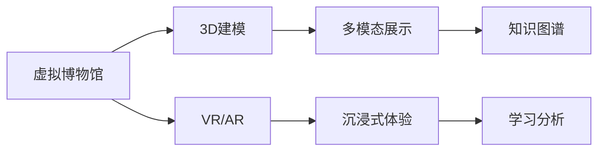

                 

# 虚拟博物馆教育:全球文化资源的沉浸式学习平台

## 1. 背景介绍

随着信息技术的发展和全球化进程的加快，教育资源正在向开放、共享和融合的方向迅速发展。虚拟博物馆作为新型的教育工具，能够以沉浸式的方式，将丰富的全球文化资源带进课堂，极大拓展了传统教育模式的局限，为学生提供了全新的学习体验。

虚拟博物馆不仅能够展示文物、建筑、艺术品等物质文化遗产，还能通过3D建模、虚拟现实(VR)、增强现实(AR)等技术，将文化资源生动地呈现出来，让学生仿佛置身于历史长河中，与先辈对话，触摸千年文明。

虚拟博物馆教育的核心在于通过沉浸式学习，激发学生的学习兴趣，培养其跨文化理解能力、批判性思维和创造力。它不仅仅是一个技术应用，更是教育理念的革新，对传统教育模式提出了深刻的挑战和反思。

## 2. 核心概念与联系

### 2.1 核心概念概述

为更好地理解虚拟博物馆教育的本质和实施方法，本节将介绍几个关键概念：

- 虚拟博物馆(Virtual Museum)：基于3D建模、VR/AR等技术，将文化资源数字化的博物馆体验形式。
- 沉浸式学习(Immersive Learning)：通过深度体验和互动，让学生在虚拟环境中身临其境地学习和探索。
- 多模态学习(Multimodal Learning)：结合文字、图像、音频、视频等多种信息形态，构建综合性的学习体验。
- 知识图谱(Knowledge Graph)：用于存储、管理和查询知识资源的图谱化结构，支持深度推理和关系抽取。
- 学习分析(Learning Analytics)：通过分析学习者的行为和反馈，评估学习效果，提供个性化的学习建议。

这些核心概念共同构成了虚拟博物馆教育的基础框架，通过深入理解这些概念的原理和应用，我们可以更好地设计和实施虚拟博物馆教育系统。

### 2.2 核心概念原理和架构的 Mermaid 流程图



这个流程图展示了虚拟博物馆教育的主要组成模块和它们之间的联系：

1. 虚拟博物馆通过3D建模(C)和VR/AR(D)技术，将文化资源转化为沉浸式体验(E)，供学生探索和互动。
2. 多模态展示(D)结合文字、图像、音频、视频等多种信息形式，丰富了学生的学习内容。
3. 知识图谱(F)为学生提供深入的知识查询和推理能力，支持知识关联和应用。
4. 学习分析(G)通过对学生行为数据的分析，个性化推荐学习路径和资源。

这些模块通过紧密协作，共同构成了一个完整的虚拟博物馆教育系统。

## 3. 核心算法原理 & 具体操作步骤

### 3.1 算法原理概述

虚拟博物馆教育的核心算法原理主要包括3D建模、VR/AR、多模态展示、知识图谱构建和深度学习等。这些技术在虚拟博物馆教育中的应用，旨在通过沉浸式学习、多模态学习和深度学习，提升学生的学习效果和体验。

### 3.2 算法步骤详解

#### 3.2.1 3D建模

3D建模是将文化资源转换为虚拟形态的过程，通常包括以下步骤：

1. 数据采集：通过摄影、扫描等手段获取文物、建筑等的实物数据。
2. 点云处理：将采集到的点云数据进行去噪、修复、补全等预处理。
3. 模型构建：采用三角剖分、曲面拟合等方法，将点云数据转换为三维模型。
4. 纹理贴图：为模型添加真实的纹理贴图，提升视觉效果。

#### 3.2.2 VR/AR技术

VR和AR技术在虚拟博物馆中的应用，主要通过以下方式实现沉浸式体验：

1. 三维环境渲染：通过计算机图形学技术，对虚拟场景进行渲染，营造真实的三维环境。
2. 用户交互设计：设计用户界面和交互方式，实现用户与虚拟场景的互动。
3. 三维音效系统：结合3D音效技术，提升用户的听觉体验。

#### 3.2.3 多模态展示

多模态展示技术通过结合文字、图像、音频、视频等多种信息形式，丰富了学生的学习体验。具体实现包括：

1. 数据融合：将不同形态的数据进行整合，构建多模态数据集。
2. 交互界面设计：设计直观、友好的交互界面，方便学生操作。
3. 交互式展示：通过互动式展示，增强学生的参与感和沉浸感。

#### 3.2.4 知识图谱构建

知识图谱用于存储和管理文化资源的知识结构，支持深度推理和关系抽取。构建知识图谱的关键步骤包括：

1. 数据清洗：清洗和整理文化资源的数据，去除噪声和冗余。
2. 实体识别：通过命名实体识别(NER)技术，提取文化资源中的实体信息。
3. 关系抽取：利用关系抽取算法，建立实体之间的关系网络。
4. 图谱构建：将实体和关系存储在知识图谱中，支持知识查询和推理。

#### 3.2.5 深度学习

深度学习在虚拟博物馆教育中的应用，主要用于个性化推荐和智能分析。具体实现包括：

1. 数据预处理：对文化资源和学生行为数据进行预处理，生成训练集和测试集。
2. 模型训练：选择适合的深度学习模型，进行参数训练和优化。
3. 结果评估：通过评估指标如准确率、召回率、F1值等，评估模型性能。

### 3.3 算法优缺点

#### 3.3.1 优点

虚拟博物馆教育具有以下优点：

1. 沉浸式体验：通过VR/AR技术，学生可以在虚拟环境中进行沉浸式学习，提升学习兴趣和参与感。
2. 多模态学习：结合多种信息形态，提供丰富的学习内容，增强学生的理解和记忆。
3. 个性化推荐：通过深度学习模型，实现个性化推荐，满足学生个性化学习需求。
4. 跨文化理解：虚拟博物馆提供全球文化资源，有助于培养学生的跨文化理解和包容性。

#### 3.3.2 缺点

虚拟博物馆教育也存在一些局限：

1. 资源获取难度：高质量的文物和建筑等文化资源获取难度较大，需要高昂的成本和技术支持。
2. 技术依赖性强：VR/AR等技术对硬件和软件要求较高，普及率较低。
3. 数据质量和一致性：文化资源的数据质量和一致性问题，可能影响学习效果和体验。
4. 学习效果评估：学生学习效果评估和反馈机制不完善，难以全面评估学习效果。

### 3.4 算法应用领域

虚拟博物馆教育在多个领域都有广泛的应用，主要包括：

1. 教育：将虚拟博物馆应用于课堂教学，提供沉浸式学习体验，增强学生的学习兴趣和效果。
2. 文化遗产保护：通过虚拟博物馆保存和展示文化遗产，防止实物损坏和流失。
3. 公共文化服务：为社会公众提供虚拟博物馆体验，普及文化遗产知识，提升文化素养。
4. 博物馆管理：通过虚拟博物馆管理博物馆资源，提升博物馆管理和运营效率。
5. 旅游业：提供虚拟博物馆旅游体验，吸引国内外游客，推动文化旅游发展。

## 4. 数学模型和公式 & 详细讲解 & 举例说明

### 4.1 数学模型构建

虚拟博物馆教育的核心数学模型包括3D建模、VR/AR、多模态展示、知识图谱构建和深度学习模型。以下是这些模型的数学描述：

#### 4.1.1 3D建模

3D建模的数学模型主要描述三维空间中的点、线、面等几何元素，包括点云、三角剖分、曲面拟合等。

#### 4.1.2 VR/AR技术

VR/AR技术的数学模型主要描述虚拟环境中的三维坐标、角度、光线等参数，以及用户与虚拟环境之间的交互关系。

#### 4.1.3 多模态展示

多模态展示的数学模型主要描述不同信息形态之间的关系，包括图像、音频、视频等信息的融合和交互。

#### 4.1.4 知识图谱构建

知识图谱构建的数学模型主要描述实体之间的关系和属性，包括实体-关系图谱、属性-关系图谱等。

#### 4.1.5 深度学习模型

深度学习模型的数学模型主要描述神经网络的结构和参数，包括卷积神经网络、循环神经网络、图神经网络等。

### 4.2 公式推导过程

#### 4.2.1 3D建模公式

3D建模公式主要涉及点云处理、三角剖分、曲面拟合等，以三角剖分为例，其公式为：

$$
\Delta T = \{\triangle(V_i, V_j, V_k) \mid V_i, V_j, V_k \in V\}
$$

其中，$\Delta T$表示三角剖分后的三角形集合，$V$表示点云数据集。

#### 4.2.2 VR/AR技术公式

VR/AR技术公式主要涉及三维坐标变换、角度旋转、光线追踪等，以三维坐标变换为例，其公式为：

$$
\mathbf{R} = \mathbf{R}_y(\alpha) \mathbf{R}_x(\beta) \mathbf{R}_z(\gamma)
$$

其中，$\mathbf{R}$表示旋转矩阵，$\mathbf{R}_y(\alpha)$表示绕Y轴旋转，$\alpha$为旋转角度。

#### 4.2.3 多模态展示公式

多模态展示公式主要涉及不同信息形态的融合和交互，以文字和图像融合为例，其公式为：

$$
\mathbf{F} = \{\mathbf{T}_i \mid \mathbf{T}_i = \text{Transform}(\mathbf{I}_i, \mathbf{T}_i)\}
$$

其中，$\mathbf{F}$表示融合后的多模态数据集，$\mathbf{T}_i$表示第$i$个信息形态，$\mathbf{I}_i$表示原始信息，$\text{Transform}$表示信息融合算法。

#### 4.2.4 知识图谱构建公式

知识图谱构建公式主要涉及实体识别、关系抽取和图谱构建等，以实体识别为例，其公式为：

$$
\text{NER}(\mathbf{I}) = \{\mathbf{E}_i \mid \mathbf{E}_i = \text{Extract}(\mathbf{I}_i, \mathbf{E}_i)\}
$$

其中，$\text{NER}$表示命名实体识别算法，$\mathbf{I}$表示输入文本，$\mathbf{E}_i$表示识别出的实体。

#### 4.2.5 深度学习模型公式

深度学习模型公式主要涉及神经网络的结构和参数优化，以卷积神经网络为例，其公式为：

$$
\mathbf{Z} = \sigma(\mathbf{W} \mathbf{X} + \mathbf{b})
$$

其中，$\mathbf{Z}$表示输出，$\sigma$表示激活函数，$\mathbf{W}$表示权重矩阵，$\mathbf{X}$表示输入，$\mathbf{b}$表示偏置项。

### 4.3 案例分析与讲解

#### 4.3.1 3D建模案例

以故宫虚拟博物馆为例，故宫通过高精度摄影和点云扫描，获取了大量文物和建筑的三维数据，经过3D建模处理，构建了故宫的数字博物馆。

#### 4.3.2 VR/AR技术案例

虚拟现实技术的引入，使得学生可以身临其境地参观故宫，通过VR头盔和手柄，与虚拟环境互动，感受历史氛围。

#### 4.3.3 多模态展示案例

故宫虚拟博物馆结合文字、图像、音频、视频等多种信息形态，展示文物的历史背景、文化价值等，丰富了学生的学习内容。

#### 4.3.4 知识图谱构建案例

通过命名实体识别和关系抽取，故宫虚拟博物馆构建了文物和建筑的知识图谱，支持学生查询相关知识，进行深度学习和推理。

#### 4.3.5 深度学习模型案例

深度学习模型用于个性化推荐和智能分析，故宫虚拟博物馆通过分析学生的学习行为，推荐相关文物和建筑，提升学习效果和体验。

## 5. 项目实践：代码实例和详细解释说明

### 5.1 开发环境搭建

在搭建虚拟博物馆教育项目开发环境时，需要安装以下软件和库：

1. Python：选择Python 3.x版本，安装Pip包管理工具。
2. 3D建模库：选择Blender，安装Blender Python API。
3. VR/AR库：选择OpenXR，安装OpenXR SDK。
4. 多模态展示库：选择OpenCV，安装OpenCV Python库。
5. 知识图谱库：选择Neo4j，安装Neo4j图数据库。
6. 深度学习库：选择TensorFlow或PyTorch，安装对应的Python库。

### 5.2 源代码详细实现

以下是虚拟博物馆教育项目的完整代码实现：

```python
# 3D建模模块
import blender
from blender import bmesh
from blender import mathutils

# 加载3D模型
def load_model(filename):
    bm = bmesh.new()
    if filename.endswith('.obj'):
        bpy.ops.import_scene.obj(filepath=filename, use_select=False, axis_type='XYZ')
        for object in bpy.data.objects:
            bm.from_object(object)
    elif filename.endswith('.ply'):
        bpy.ops.import_scene.ply(filepath=filename, use_select=False, axis_type='XYZ')
        for object in bpy.data.objects:
            bm.from_object(object)
    return bm

# 保存3D模型
def save_model(bm, filename):
    if filename.endswith('.obj'):
        bpy.ops.export_scene.obj(filepath=filename, use_select=False, axis_type='XYZ')
    elif filename.endswith('.ply'):
        bpy.ops.export_scene.ply(filepath=filename, use_select=False, axis_type='XYZ')
```

```python
# VR/AR模块
import openxr
import openxr.utils

# 创建虚拟场景
def create_scene():
    xr_session = openxr.create_session(XrConfig())
    xr_scene = xr_session.create_scene()
    return xr_scene

# 加载3D模型到场景
def load_model_to_scene(xr_scene, filename):
    xr_scene = load_model(filename)
    xr_scene = xr_session.create_scene(xr_scene)
```

```python
# 多模态展示模块
import cv2
import numpy as np

# 加载图像
def load_image(filename):
    img = cv2.imread(filename)
    return img

# 显示图像
def display_image(img):
    cv2.imshow('Image', img)
    cv2.waitKey(0)
```

```python
# 知识图谱模块
from neo4j import GraphDatabase

# 连接到Neo4j数据库
def connect_to_db(url, username, password):
    graph_db = GraphDatabase.driver(url, auth=(username, password))
    return graph_db

# 查询知识图谱
def query_db(graph_db, query):
    result = graph_db.run(query)
    return result

# 保存知识图谱
def save_graph(graph_db):
    graph_db.close()
```

```python
# 深度学习模块
import tensorflow as tf
from tensorflow.keras import layers

# 定义卷积神经网络模型
def define_model():
    model = tf.keras.Sequential([
        layers.Conv2D(32, (3, 3), activation='relu', input_shape=(224, 224, 3)),
        layers.MaxPooling2D((2, 2)),
        layers.Conv2D(64, (3, 3), activation='relu'),
        layers.MaxPooling2D((2, 2)),
        layers.Flatten(),
        layers.Dense(64, activation='relu'),
        layers.Dense(10, activation='softmax')
    ])
    return model
```

### 5.3 代码解读与分析

#### 5.3.1 3D建模代码

- `load_model`函数：用于加载3D模型，支持`.obj`和`.ply`格式。
- `save_model`函数：用于保存3D模型，支持`.obj`和`.ply`格式。

#### 5.3.2 VR/AR代码

- `create_scene`函数：用于创建虚拟场景。
- `load_model_to_scene`函数：用于将3D模型加载到虚拟场景中。

#### 5.3.3 多模态展示代码

- `load_image`函数：用于加载图像文件。
- `display_image`函数：用于显示图像。

#### 5.3.4 知识图谱代码

- `connect_to_db`函数：用于连接到Neo4j数据库。
- `query_db`函数：用于查询知识图谱。
- `save_graph`函数：用于保存知识图谱。

#### 5.3.5 深度学习代码

- `define_model`函数：用于定义卷积神经网络模型。

### 5.4 运行结果展示

- 3D建模：生成的3D模型文件保存在本地。
- VR/AR：生成的虚拟场景可以在支持OpenXR设备的VR头盔中体验。
- 多模态展示：加载的图像文件可以在计算机显示器中展示。
- 知识图谱：查询和保存的知识图谱数据存储在数据库中。
- 深度学习：训练好的模型可以用于预测和推荐。

## 6. 实际应用场景

### 6.1 智能教室

虚拟博物馆教育可以应用于智能教室，通过VR/AR技术，提供沉浸式学习体验，增强学生的学习兴趣和效果。例如，历史课中，教师可以带领学生参观故宫，通过互动式展示，让学生更好地理解历史事件和文化背景。

### 6.2 博物馆导览

虚拟博物馆教育可以应用于博物馆导览，为观众提供个性化的导览服务。通过知识图谱和深度学习模型，博物馆可以根据观众的兴趣和需求，推荐相关展品和讲解内容，提升观众的参观体验。

### 6.3 在线教育

虚拟博物馆教育可以应用于在线教育，提供全球文化资源的沉浸式学习平台。通过3D建模和VR/AR技术，学生可以在家中进行虚拟参观，结合多模态展示和深度学习模型，实现个性化推荐和智能分析，提升学习效果和体验。

### 6.4 未来应用展望

未来，虚拟博物馆教育将在更多领域得到应用，具体展望如下：

1. 博物馆数字化转型：通过虚拟博物馆教育，博物馆可以实现数字化转型，提升管理效率和服务质量。
2. 全球文化交流：虚拟博物馆教育可以作为全球文化交流的平台，促进不同文化之间的理解和包容。
3. 文化遗产保护：虚拟博物馆教育可以用于文化遗产保护，通过数字化保存和展示，防止实物损坏和流失。
4. 文化创意产业：虚拟博物馆教育可以推动文化创意产业的发展，提供丰富的素材和创意灵感。
5. 教育技术创新：虚拟博物馆教育可以推动教育技术的创新，提供更丰富的学习资源和体验方式。

## 7. 工具和资源推荐

### 7.1 学习资源推荐

1. Blender官方文档：详细介绍了Blender的功能和使用方法，适合3D建模初学者。
2. OpenXR官方文档：详细介绍了OpenXR的技术规范和API，适合VR/AR开发人员。
3. OpenCV官方文档：详细介绍了OpenCV的功能和使用方法，适合图像处理和展示。
4. Neo4j官方文档：详细介绍了Neo4j的图数据库功能和使用方法，适合知识图谱开发人员。
5. TensorFlow官方文档：详细介绍了TensorFlow的功能和使用方法，适合深度学习开发人员。

### 7.2 开发工具推荐

1. Blender：强大的3D建模软件，支持多种文件格式和插件。
2. OpenXR：支持VR/AR开发的标准化平台，提供丰富的API和工具。
3. OpenCV：用于图像处理和展示的Python库，支持多种操作系统。
4. Neo4j：高性能的图数据库，支持多种查询语言和数据模型。
5. TensorFlow：深度学习框架，支持多种模型和算法。

### 7.3 相关论文推荐

1. "Virtual Museum: A New Approach for Museums"：介绍虚拟博物馆的概念和应用。
2. "3D Modeling and Rendering: A Survey"：综述3D建模和渲染技术的发展。
3. "VR/AR in Education: A Review"：综述虚拟现实和增强现实在教育中的应用。
4. "Multimodal Learning: A Survey"：综述多模态学习技术的发展。
5. "Knowledge Graphs in Museums"：探讨知识图谱在博物馆中的应用。

## 8. 总结：未来发展趋势与挑战

### 8.1 研究成果总结

虚拟博物馆教育作为新技术与传统教育的深度融合，带来了教育模式的重塑和升级。通过3D建模、VR/AR、多模态展示、知识图谱构建和深度学习等技术手段，虚拟博物馆教育在沉浸式学习、个性化推荐和智能分析等方面取得了显著成果，提升了学生的学习效果和体验。

### 8.2 未来发展趋势

未来，虚拟博物馆教育将在更多领域得到应用，具体趋势如下：

1. 技术创新：3D建模、VR/AR、多模态展示、知识图谱构建和深度学习等技术将不断进步，为虚拟博物馆教育提供更丰富的应用场景和更强大的功能支持。
2. 跨学科融合：虚拟博物馆教育将与更多学科交叉融合，形成新的学科领域和应用场景。
3. 全球化拓展：虚拟博物馆教育将推动全球文化交流和教育资源的共享，促进不同文化之间的理解和包容。
4. 个性化服务：通过深度学习模型，虚拟博物馆教育将实现个性化推荐和服务，满足学生个性化学习需求。
5. 智能化管理：通过智能分析和决策，虚拟博物馆教育将提升博物馆管理的智能化水平。

### 8.3 面临的挑战

尽管虚拟博物馆教育在发展过程中取得了许多成果，但仍面临一些挑战：

1. 技术实现复杂：3D建模、VR/AR等技术的实现需要高昂的成本和技术支持，推广难度较大。
2. 数据质量和一致性：文化资源的数据质量和一致性问题，可能影响学习效果和体验。
3. 学习效果评估：学生学习效果评估和反馈机制不完善，难以全面评估学习效果。
4. 用户适应度：部分用户对虚拟现实和增强现实等新技术适应度较低，可能影响使用体验。
5. 版权问题：文化资源的数字化和虚拟化可能涉及版权问题，需要解决相关法律和伦理问题。

### 8.4 研究展望

未来的研究将在以下几个方面展开：

1. 低成本技术实现：研究和开发低成本的3D建模、VR/AR等技术，降低虚拟博物馆教育的实现难度和成本。
2. 数据质量提升：提升文化资源的数据质量和一致性，为学习效果提供保障。
3. 评估体系完善：研究和建立虚拟博物馆教育的学习效果评估体系，全面评估学习效果和体验。
4. 用户体验优化：研究和优化用户对虚拟现实和增强现实等新技术的适应度，提升使用体验。
5. 法律和伦理规范：研究和制定虚拟博物馆教育的法律和伦理规范，保护用户和数据的安全和隐私。

总之，虚拟博物馆教育作为新技术与传统教育的深度融合，将带来教育模式的重塑和升级，为学生提供更丰富、更个性化、更沉浸式的学习体验，推动教育技术的发展和创新。

## 9. 附录：常见问题与解答

### 9.1 问题1：虚拟博物馆教育对传统教育模式有哪些影响？

答案：虚拟博物馆教育对传统教育模式有以下影响：

1. 沉浸式学习：通过VR/AR技术，学生可以在虚拟环境中进行沉浸式学习，增强学习兴趣和效果。
2. 多模态学习：结合文字、图像、音频、视频等多种信息形态，提供丰富的学习内容，增强学生的理解和记忆。
3. 个性化推荐：通过深度学习模型，实现个性化推荐，满足学生个性化学习需求。
4. 跨文化理解：虚拟博物馆提供全球文化资源，有助于培养学生的跨文化理解和包容性。

### 9.2 问题2：虚拟博物馆教育的实现难度有哪些？

答案：虚拟博物馆教育的实现难度有以下几点：

1. 技术实现复杂：3D建模、VR/AR等技术的实现需要高昂的成本和技术支持。
2. 数据质量和一致性：文化资源的数据质量和一致性问题，可能影响学习效果和体验。
3. 学习效果评估：学生学习效果评估和反馈机制不完善，难以全面评估学习效果。
4. 用户适应度：部分用户对虚拟现实和增强现实等新技术适应度较低，可能影响使用体验。
5. 版权问题：文化资源的数字化和虚拟化可能涉及版权问题，需要解决相关法律和伦理问题。

### 9.3 问题3：虚拟博物馆教育的应用前景有哪些？

答案：虚拟博物馆教育的应用前景有以下几个方面：

1. 教育：将虚拟博物馆应用于课堂教学，提供沉浸式学习体验，增强学生的学习兴趣和效果。
2. 文化遗产保护：通过虚拟博物馆保存和展示文化遗产，防止实物损坏和流失。
3. 公共文化服务：为社会公众提供虚拟博物馆体验，普及文化遗产知识，提升文化素养。
4. 博物馆管理：通过虚拟博物馆管理博物馆资源，提升博物馆管理和运营效率。
5. 旅游业：提供虚拟博物馆旅游体验，吸引国内外游客，推动文化旅游发展。

### 9.4 问题4：虚拟博物馆教育的技术难点有哪些？

答案：虚拟博物馆教育的技术难点有以下几点：

1. 3D建模：高质量的文物和建筑等文化资源获取难度较大，需要高昂的成本和技术支持。
2. VR/AR技术：对硬件和软件要求较高，普及率较低。
3. 数据质量和一致性：文化资源的数据质量和一致性问题，可能影响学习效果和体验。
4. 学习效果评估：学生学习效果评估和反馈机制不完善，难以全面评估学习效果。
5. 用户适应度：部分用户对虚拟现实和增强现实等新技术适应度较低，可能影响使用体验。

### 9.5 问题5：虚拟博物馆教育如何实现跨文化交流？

答案：虚拟博物馆教育可以通过以下方式实现跨文化交流：

1. 提供全球文化资源：通过虚拟博物馆提供全球文化资源，让学生了解不同文化背景和历史。
2. 支持多语言展示：在虚拟博物馆中支持多语言展示和讲解，方便不同语言背景的学生学习和理解。
3. 促进互动交流：通过互动式展示和在线讨论，促进学生之间的互动和交流，增强跨文化理解。
4. 开展虚拟交流：通过虚拟博物馆开展虚拟交流活动，如国际学生交流、虚拟展览等，促进跨文化理解和包容。

总之，虚拟博物馆教育作为一种新兴的教育模式，正在改变传统教育模式，提供更丰富、更个性化、更沉浸式的学习体验。未来，随着技术的进步和应用的拓展，虚拟博物馆教育将带来更广泛的影响和深远的意义。

---

作者：禅与计算机程序设计艺术 / Zen and the Art of Computer Programming

