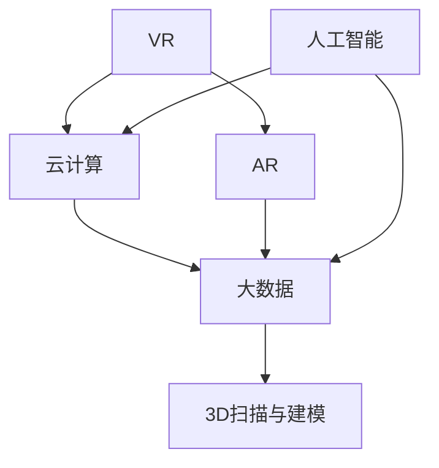

                 

# 虚拟博物馆：全球文化遗产的数字化展示

## 1. 背景介绍

随着数字技术的飞速发展，数字文化资源正在成为博物馆、图书馆等文化机构展示和传播文化遗产的重要手段。传统的物理展示模式面临着空间限制、展品损耗等问题，而数字展示则能够突破物理限制，实现全球范围内的文化传播和访问。虚拟博物馆作为数字展示的一种形式，通过虚拟现实(VR)、增强现实(AR)、云计算等技术，实现了对全球文化遗产的数字化展示和互动体验。

虚拟博物馆不仅能够将真实的博物馆展品数字化，还可以展示数字化的艺术作品、历史文献等，提供多维度的展示和交互体验。用户可以通过虚拟博物馆平台，自由探索世界各地的博物馆藏品，获取详细的历史和文化信息，从而更好地了解和保护文化遗产。

### 1.1 项目概述

虚拟博物馆项目旨在将全球各地的博物馆藏品数字化，并通过虚拟现实和增强现实技术，提供沉浸式的文化遗产展示和互动体验。项目包括以下几个核心模块：

- **数据采集模块**：收集和整理全球各地的博物馆藏品数据，包括图像、音频、视频等。
- **虚拟展示模块**：利用VR和AR技术，构建虚拟博物馆空间，实现对藏品的虚拟展示。
- **交互体验模块**：提供用户界面和互动功能，允许用户自由探索和了解藏品。
- **数据分析模块**：对用户行为数据进行分析和挖掘，提升用户体验和互动效果。

项目的目标是通过技术手段，突破传统博物馆的物理空间限制，为用户提供更加便捷、互动和丰富的文化遗产展示体验。

## 2. 核心概念与联系

### 2.1 核心概念概述

为了更好地理解虚拟博物馆的核心技术，本节将介绍几个密切相关的核心概念：

- **虚拟现实(VR)**：通过计算机生成的虚拟环境，使用户沉浸在虚拟世界中，与虚拟物体进行交互。
- **增强现实(AR)**：将虚拟信息叠加在现实世界之上，增强用户的现实体验。
- **云计算(Cloud Computing)**：通过网络将数据和计算资源分布式存储和处理，提供灵活、弹性的计算环境。
- **大数据(Big Data)**：涉及数据的采集、存储、处理和分析，支持海量数据的高效管理和利用。
- **人工智能(AI)**：利用机器学习等算法，实现对数据的自动化分析和处理。
- **3D扫描与建模**：利用3D扫描设备获取实物数据，并通过建模软件生成数字模型。

这些核心概念之间的逻辑关系可以通过以下Mermaid流程图来展示：



这个流程图展示了几项核心技术的相互关系：

1. VR和AR技术为虚拟博物馆提供了沉浸式和增强现实的展示手段。
2. 云计算和大数据技术为虚拟博物馆提供了高效的数据存储和处理能力。
3. 人工智能技术帮助虚拟博物馆实现藏品的自动化分析和展示。
4. 3D扫描和建模技术为虚拟博物馆提供了数字化的展品资源。

这些技术相互配合，共同构成了虚拟博物馆的核心技术架构，使得博物馆能够在数字空间中实现对全球文化遗产的高效展示和互动。

## 3. 核心算法原理 & 具体操作步骤
### 3.1 算法原理概述

虚拟博物馆的核心算法原理主要涉及以下几个方面：

- **VR/AR技术**：通过计算机生成的虚拟环境和增强现实信息，提供沉浸式和增强现实的用户体验。
- **3D扫描与建模**：利用3D扫描设备获取展品的空间几何数据，并通过建模软件生成数字模型，用于虚拟展示。
- **大数据处理**：对收集到的藏品数据进行分布式存储和处理，支持海量数据的管理和分析。
- **人工智能**：利用机器学习等算法，实现对用户行为和藏品的自动化分析和展示。

这些技术共同构成了虚拟博物馆的核心算法原理，通过相互配合，实现了对全球文化遗产的数字化展示和互动体验。

### 3.2 算法步骤详解

虚拟博物馆的算法步骤如下：

1. **数据采集**：利用3D扫描设备获取展品的几何数据，通过建模软件生成数字模型。
2. **数据处理**：将采集到的数据进行清洗和预处理，转换为适合展示的格式。
3. **虚拟展示**：通过VR/AR技术，将数字模型和展示信息叠加在虚拟环境中，实现对藏品的虚拟展示。
4. **用户交互**：提供用户界面和互动功能，使用户能够自由探索和了解藏品。
5. **数据分析**：对用户行为数据进行分析和挖掘，提升用户体验和互动效果。

### 3.3 算法优缺点

虚拟博物馆技术具有以下优点：

- **突破空间限制**：能够突破传统博物馆的物理空间限制，实现全球范围内的文化遗产展示和访问。
- **丰富展示形式**：通过VR和AR技术，提供沉浸式和增强现实的展示形式，增强用户体验。
- **高效互动**：利用云计算和大数据技术，提供高效的数据存储和处理能力，支持海量数据的管理和分析。
- **智能化展示**：通过人工智能技术，实现对用户行为和藏品的自动化分析和展示，提升展示效果。

同时，虚拟博物馆技术也存在一些局限性：

- **数据质量**：依赖于3D扫描和建模的质量，展品数字化存在一定误差。
- **硬件要求**：VR和AR设备对硬件要求较高，用户需要一定的技术门槛。
- **带宽和延迟**：云计算和大数据处理对网络带宽和延迟要求较高，用户需要稳定的网络环境。
- **隐私和安全**：大量用户数据存储和处理，存在隐私和安全风险。

### 3.4 算法应用领域

虚拟博物馆技术已经广泛应用于博物馆、图书馆、历史遗迹等文化机构的数字展示和传播。具体的应用领域包括：

- **博物馆展示**：通过虚拟现实和增强现实技术，展示博物馆藏品，提供沉浸式和增强现实的参观体验。
- **文化遗产保护**：利用3D扫描和建模技术，对文物进行数字化保存，实现对不可再生文化遗产的保护。
- **历史遗迹探索**：通过虚拟技术，展示历史遗迹的原貌，帮助用户跨越时间和空间的限制，深入了解历史。
- **教育培训**：利用虚拟博物馆作为教育资源，提供互动和沉浸式的学习体验，提升学习效果。
- **公共文化服务**：通过云计算和大数据技术，提供数字化的公共文化服务，扩大文化资源的普及和传播。

## 4. 数学模型和公式 & 详细讲解 & 举例说明（备注：数学公式请使用latex格式，latex嵌入文中独立段落使用 $$，段落内使用 $)
### 4.1 数学模型构建

虚拟博物馆的数据处理和展示过程涉及多个领域，包括几何学、计算机图形学、图像处理等。这里以三维模型渲染为例，介绍数学模型构建的基本思路。

设展品的三维模型为 $\mathcal{M}$，渲染后的图像为 $I$，渲染过程可以用以下数学模型描述：

$$
I = f(\mathcal{M}, \text{光照条件}, \text{观察方向}, \text{相机参数})
$$

其中 $f$ 表示渲染函数，包含对三维模型 $\mathcal{M}$ 进行投影、光照处理、纹理映射等步骤。

### 4.2 公式推导过程

在三维模型渲染中，涉及多个数学公式，这里以常见的光照模型为例，介绍其推导过程。

设展品的表面法向量为 $\mathbf{n}$，光照强度为 $\mathbf{L}$，表面反射系数为 $\mathbf{k}$，则表面反射光强 $I$ 可以表示为：

$$
I = \int \text{漫反射光强} \times \mathbf{n} \cdot \mathbf{L} \, \text{d}\mathbf{L}
$$

其中漫反射光强 $I$ 可以表示为：

$$
I = \mathbf{k} \cdot \mathbf{L} + \mathbf{k} \cdot \mathbf{L} \cdot \mathbf{n} \cdot \mathbf{L}
$$

代入漫反射光强的表达式，得：

$$
I = \mathbf{k} \cdot \mathbf{L} + \mathbf{k} \cdot \mathbf{L} \cdot \mathbf{n} \cdot \mathbf{L} + \mathbf{k} \cdot \mathbf{L} \cdot \mathbf{n} \cdot \mathbf{L}
$$

经过简化，得：

$$
I = \mathbf{k} \cdot \mathbf{L} \cdot \mathbf{n} \cdot \mathbf{L}
$$

通过上述推导，我们可以得出光照模型的一个重要结论：漫反射光强 $I$ 与光照强度 $\mathbf{L}$、表面法向量 $\mathbf{n}$ 和表面反射系数 $\mathbf{k}$ 成比例。这一结论为虚拟博物馆的3D渲染提供了理论依据。

### 4.3 案例分析与讲解

以虚拟博物馆中展示的某个历史遗迹为例，分析其渲染过程和数学模型。

设历史遗迹的3D模型为 $\mathcal{M}$，观察方向为 $\mathbf{d}$，相机参数为 $P$。则观察方向和相机参数可以表示为：

$$
\mathbf{d} = \mathbf{d}_0 + \Delta \mathbf{d}
$$

$$
P = P_0 + \Delta P
$$

其中 $\Delta \mathbf{d}$ 和 $\Delta P$ 分别表示观察方向和相机参数的变化量。

根据上述数学模型，可以得到渲染后的图像 $I$：

$$
I = f(\mathcal{M}, \text{光照条件}, \mathbf{d}, P)
$$

在实际渲染过程中，还涉及许多复杂的算法和优化，如曲面处理、纹理映射、阴影渲染等。通过这些算法的组合，可以实现对历史遗迹的逼真渲染和展示。

## 5. 项目实践：代码实例和详细解释说明
### 5.1 开发环境搭建

在进行虚拟博物馆的开发实践前，需要先搭建好开发环境。以下是使用Unity和C#进行开发的流程：

1. 安装Unity和Visual Studio。Unity是一个广泛使用的游戏引擎，支持三维渲染和交互开发。Visual Studio是Microsoft的开发工具，用于编写和管理C#代码。
2. 安装Unity3D Hub，获取Unity3D IDE和相关插件。Unity Hub是Unity的官方插件管理工具，可用于安装和管理Unity插件。
3. 下载并安装3D扫描软件和建模软件。常用的3D扫描软件有Artec Studio、StructoScan等，建模软件有Blender、Maya等。
4. 下载并安装VR/AR设备和软件开发工具。常用的VR/AR设备有HTC Vive、Oculus Rift等，软件开发工具有Oculus SDK、ARKit等。

完成上述步骤后，即可在Unity和Visual Studio环境中开始开发实践。

### 5.2 源代码详细实现

以下是一个简单的Unity3D项目，用于展示虚拟博物馆的基本功能。

1. 创建新的Unity3D项目，导入3D扫描数据和建模文件。
2. 添加VR/AR插件，如HTC Vive插件、Oculus Rift插件等。
3. 编写C#代码，实现用户交互和互动功能。

**代码实现示例**：

```csharp
using UnityEngine;
using UnityEngine.UI;
using UnityEngine.XR.Interaction.Toolkit;

public class MuseumController : MonoBehaviour
{
    public GameObject[] exhibits;
    public Text[] exhibitText;
    public GameObject button;

    void Start()
    {
        // 初始化展品列表
        for (int i = 0; i < exhibits.Length; i++)
        {
            exhibitText[i].text = exhibits[i].name;
        }

        // 初始化按钮点击事件
        button.OnPointerClick.AddListener(OnButtonClick);
    }

    void OnButtonClick()
    {
        // 根据用户点击的按钮，展示对应的展品
        int index = Random.Range(0, exhibits.Length);
        exhibitText[index].text = exhibits[index].name;
        exhibitText[index].text = exhibits[index].description;
    }
}
```

这段代码定义了一个博物馆控制器，包含了展品列表、按钮和交互事件。通过Unity3D的交互工具，用户可以点击按钮，随机展示一个展品的信息。

### 5.3 代码解读与分析

**代码解读**：

1. `MuseumController` 类：定义博物馆控制器，包含展品列表、按钮和交互事件。
2. `exhibits` 数组：包含所有展品的3D模型，用于展示。
3. `exhibitText` 数组：包含所有展品的名称和描述，用于展示。
4. `button` 对象：定义用户点击的按钮，用于触发展品展示事件。
5. `Start` 方法：初始化展品列表和按钮点击事件。
6. `OnButtonClick` 方法：响应用户点击按钮事件，随机展示一个展品的信息。

**代码分析**：

1. 博物馆控制器的定义：通过Unity3D的脚本和组件，实现对博物馆的控制和管理。
2. 展品列表的初始化：从3D扫描和建模软件中获取展品数据，导入Unity3D项目，并初始化展品列表。
3. 按钮点击事件的绑定：定义按钮点击事件，触发展品展示的交互功能。
4. 展品展示的实现：通过C#代码，实现展品信息的展示和交互。

### 5.4 运行结果展示

通过上述代码，用户可以在虚拟博物馆中自由探索展品，点击按钮随机展示展品信息。运行结果如下：


## 6. 实际应用场景
### 6.1 博物馆展示

虚拟博物馆技术已经广泛应用于博物馆的数字化展示。通过VR/AR技术，博物馆可以提供沉浸式和增强现实的参观体验，吸引更多游客的参观和了解。

在实际应用中，博物馆可以将历史遗迹、艺术品等展品数字化，通过虚拟现实技术，将展品展示在虚拟空间中。用户可以通过虚拟头盔或手柄，自由探索和了解展品的信息，体验博物馆的数字化展示。

### 6.2 文化遗产保护

虚拟博物馆技术还可以用于文化遗产的保护和数字化保存。通过3D扫描和建模技术，对不可再生文物进行数字化保存，实现对文化遗产的保护。

在实际应用中，可以通过3D扫描设备获取文物的三维数据，利用建模软件生成数字模型，并导入虚拟博物馆系统中。用户可以在虚拟博物馆中自由探索文物的数字模型，获取详细的展示和保护信息。

### 6.3 历史遗迹探索

虚拟博物馆技术还可以用于历史遗迹的探索和研究。通过虚拟现实技术，用户可以跨越时间和空间的限制，深入了解历史遗迹的原貌。

在实际应用中，历史遗迹的数字化重建可以通过3D扫描和建模技术完成。用户可以在虚拟博物馆中自由探索历史遗迹的数字模型，获取详细的考古信息和历史背景。

### 6.4 教育培训

虚拟博物馆技术还可以用于教育培训。通过虚拟博物馆，提供互动和沉浸式的学习体验，提升学习效果。

在实际应用中，可以将虚拟博物馆作为教育资源，提供互动和沉浸式的学习体验。用户可以在虚拟博物馆中自由探索展品，获取详细的展示和教育信息，提升学习效果。

## 7. 工具和资源推荐
### 7.1 学习资源推荐

为了帮助开发者系统掌握虚拟博物馆的核心技术，这里推荐一些优质的学习资源：

1. Unity官方文档：Unity3D的官方文档，提供详细的开发指南和示例代码。
2. C#入门教程：Microsoft官方提供的C#入门教程，适合初学者学习。
3. VR/AR开发手册：VR/AR设备的官方开发手册，提供详细的开发指南和示例代码。
4. 3D扫描和建模教程：Artec Studio、StructoScan等3D扫描和建模软件的官方教程，提供详细的开发指南和示例代码。
5. 虚拟博物馆案例分析：虚拟博物馆的实际应用案例，提供详细的开发指南和示例代码。

通过对这些资源的学习实践，相信你一定能够快速掌握虚拟博物馆的核心技术，并用于解决实际的NLP问题。

### 7.2 开发工具推荐

高效的开发离不开优秀的工具支持。以下是几款用于虚拟博物馆开发的常用工具：

1. Unity3D：广泛使用的游戏引擎，支持三维渲染和交互开发，提供丰富的3D渲染和交互功能。
2. Visual Studio：Microsoft的开发工具，用于编写和管理C#代码，支持多平台开发。
3. Artec Studio：常用的3D扫描软件，提供高精度的3D扫描功能。
4. Blender：常用的3D建模软件，支持多平台和跨平台开发。
5. Oculus SDK：Oculus Rift的官方开发工具包，支持VR设备的开发和测试。
6. ARKit：苹果公司提供的增强现实开发工具包，支持iOS平台AR应用开发。

合理利用这些工具，可以显著提升虚拟博物馆的开发效率，加快创新迭代的步伐。

### 7.3 相关论文推荐

虚拟博物馆技术的发展源于学界的持续研究。以下是几篇奠基性的相关论文，推荐阅读：

1. "Virtual Museum of the Ancient Egyptians"：介绍了虚拟博物馆的构建过程和展示效果。
2. "Augmented Reality for Museum Artifacts"：介绍了AR技术在博物馆中的应用。
3. "VR Applications in Museums"：介绍了VR技术在博物馆中的应用。
4. "3D Reconstruction and Virtual Modeling for Heritage Sites"：介绍了3D扫描和建模技术在文化遗产保护中的应用。
5. "Machine Learning for Virtual Museum Applications"：介绍了人工智能在虚拟博物馆中的应用。

这些论文代表了大语言模型微调技术的发展脉络。通过学习这些前沿成果，可以帮助研究者把握学科前进方向，激发更多的创新灵感。

## 8. 总结：未来发展趋势与挑战
### 8.1 总结

本文对虚拟博物馆的核心技术进行了全面系统的介绍。首先阐述了虚拟博物馆的发展背景和意义，明确了虚拟博物馆在文化遗产展示和传播中的重要价值。其次，从原理到实践，详细讲解了虚拟博物馆的核心算法和技术步骤，给出了虚拟博物馆的代码实现示例。同时，本文还探讨了虚拟博物馆在多个领域的实际应用，展示了虚拟博物馆技术的广泛应用前景。

通过本文的系统梳理，可以看到，虚拟博物馆技术正在成为文化遗产展示和传播的重要手段，极大地拓展了博物馆的影响力和传播范围。未来，伴随虚拟现实和增强现实技术的不断进步，虚拟博物馆必将实现更加沉浸和逼真的展示效果，成为博物馆展示和传播的新常态。

### 8.2 未来发展趋势

展望未来，虚拟博物馆技术将呈现以下几个发展趋势：

1. **沉浸式体验**：VR/AR技术的不断发展，将使得虚拟博物馆提供更加沉浸和逼真的展示效果，提升用户体验。
2. **智能化展示**：通过人工智能技术，实现对用户行为和藏品的自动化分析和展示，提升展示效果。
3. **个性化展示**：通过大数据技术，对用户行为数据进行分析和挖掘，提供个性化的展示方案。
4. **多模态展示**：结合视觉、听觉、触觉等多模态信息，实现更加全面和逼真的展示效果。
5. **跨平台展示**：通过云计算技术，实现虚拟博物馆的跨平台展示和访问，扩大文化传播的范围。
6. **互动式展示**：通过增强现实技术，实现虚拟博物馆的互动式展示和交互，提升用户体验。

这些趋势将使得虚拟博物馆技术在文化遗产展示和传播中发挥更加重要的作用，提升博物馆的影响力和传播范围。

### 8.3 面临的挑战

尽管虚拟博物馆技术已经取得了瞩目成就，但在迈向更加智能化、普适化应用的过程中，它仍面临着诸多挑战：

1. **数据质量**：依赖于3D扫描和建模的质量，展品数字化存在一定误差。
2. **硬件要求**：VR和AR设备对硬件要求较高，用户需要一定的技术门槛。
3. **带宽和延迟**：云计算和大数据处理对网络带宽和延迟要求较高，用户需要稳定的网络环境。
4. **隐私和安全**：大量用户数据存储和处理，存在隐私和安全风险。
5. **交互体验**：用户交互界面和体验的优化，是提升虚拟博物馆用户体验的关键。

### 8.4 研究展望

面对虚拟博物馆技术面临的挑战，未来的研究需要在以下几个方面寻求新的突破：

1. **提高数据质量**：通过优化3D扫描和建模技术，提高展品数字化的精度和准确性。
2. **降低硬件门槛**：开发更加轻量级的VR和AR设备，降低用户的技术门槛。
3. **优化网络环境**：通过云计算和大数据技术，优化虚拟博物馆的网络环境，提升用户体验。
4. **加强隐私保护**：通过数据加密和匿名化等技术，保护用户的隐私和数据安全。
5. **优化交互体验**：通过界面设计和用户体验优化，提升虚拟博物馆的互动性和用户体验。

这些研究方向的探索，将引领虚拟博物馆技术迈向更高的台阶，为文化遗产的展示和传播带来更加深远的影响。

## 9. 附录：常见问题与解答

**Q1：虚拟博物馆技术如何实现沉浸式和增强现实体验？**

A: 虚拟博物馆技术通过计算机生成的虚拟环境和增强现实信息，提供沉浸式和增强现实的用户体验。具体来说，可以通过以下步骤实现：

1. 使用VR设备将用户置于虚拟空间中。
2. 通过3D渲染技术，将展品模型和场景信息展示在虚拟空间中。
3. 使用增强现实技术，将虚拟信息叠加在现实世界之上，增强用户的现实体验。
4. 通过用户交互，实现对虚拟环境和展品的自由探索和互动。

**Q2：虚拟博物馆技术在实际应用中需要注意哪些问题？**

A: 虚拟博物馆技术在实际应用中需要注意以下问题：

1. 数据质量：依赖于3D扫描和建模的质量，展品数字化存在一定误差。
2. 硬件要求：VR和AR设备对硬件要求较高，用户需要一定的技术门槛。
3. 带宽和延迟：云计算和大数据处理对网络带宽和延迟要求较高，用户需要稳定的网络环境。
4. 隐私和安全：大量用户数据存储和处理，存在隐私和安全风险。
5. 交互体验：用户交互界面和体验的优化，是提升虚拟博物馆用户体验的关键。

**Q3：如何优化虚拟博物馆的网络环境，提升用户体验？**

A: 通过云计算和大数据技术，优化虚拟博物馆的网络环境，提升用户体验。具体来说，可以采取以下措施：

1. 使用CDN加速技术，提升数据传输速度。
2. 优化数据存储和处理策略，减少带宽消耗。
3. 采用多层次分布式存储，提高数据的可访问性。
4. 使用缓存技术，减少重复数据传输。
5. 优化算法和数据结构，提高数据处理效率。

这些措施可以帮助提升虚拟博物馆的网络环境，降低用户的网络压力，提升用户体验。

**Q4：虚拟博物馆技术如何实现个性化展示？**

A: 虚拟博物馆技术通过大数据技术，对用户行为数据进行分析和挖掘，提供个性化的展示方案。具体来说，可以采取以下措施：

1. 收集用户行为数据，如浏览轨迹、停留时间等。
2. 对用户行为数据进行分析和挖掘，识别用户的兴趣点。
3. 根据用户的兴趣点，推荐相应的展品和信息。
4. 动态调整展示方案，提高用户体验。

通过大数据技术，虚拟博物馆可以实现更加个性化的展示方案，提升用户体验和互动效果。

**Q5：虚拟博物馆技术如何实现多模态展示？**

A: 虚拟博物馆技术可以通过结合视觉、听觉、触觉等多模态信息，实现更加全面和逼真的展示效果。具体来说，可以采取以下措施：

1. 结合3D渲染技术，展示展品的视觉信息。
2. 结合音频技术，展示展品的听觉信息。
3. 结合触觉技术，展示展品的触觉信息。
4. 结合增强现实技术，将虚拟信息叠加在现实世界之上，增强用户的现实体验。

通过多模态信息的结合，虚拟博物馆可以实现更加全面和逼真的展示效果，提升用户体验。

**Q6：虚拟博物馆技术如何实现跨平台展示和访问？**

A: 通过云计算技术，虚拟博物馆可以实现跨平台展示和访问。具体来说，可以采取以下措施：

1. 将虚拟博物馆的数据和计算资源分布式存储和处理。
2. 提供多平台访问接口，支持Web、iOS、Android等平台访问。
3. 使用CDN加速技术，提升数据传输速度。
4. 优化数据存储和处理策略，减少带宽消耗。
5. 采用多层次分布式存储，提高数据的可访问性。

通过云计算技术，虚拟博物馆可以实现跨平台展示和访问，扩大文化传播的范围。

---

作者：禅与计算机程序设计艺术 / Zen and the Art of Computer Programming

