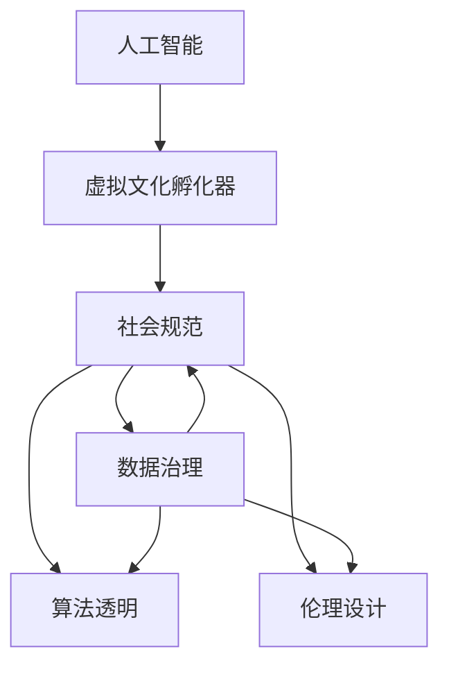

                 

# 虚拟文化孵化器主管：AI塑造的新型社会规范实验室负责人

## 1. 背景介绍

### 1.1 问题由来
随着人工智能（AI）技术的迅猛发展，AI正在全方位渗透到社会生活的方方面面。虚拟文化孵化器，作为AI社会化应用的重要形式，为构建新型社会规范提供了新的可能。通过AI塑造新型社会规范，可以提升社会治理效率，优化资源配置，促进公平正义，推动社会和谐发展。

### 1.2 问题核心关键点
虚拟文化孵化器主管，作为AI社会化应用的关键负责人，肩负着促进AI技术在文化创意、教育培训、公共服务等领域的应用，构建新型社会规范的重要使命。关键点包括：

- 如何高效利用AI技术，提升社会规范的智能化水平。
- 如何设计合理的评价指标，确保AI系统的公平性和透明度。
- 如何通过AI技术实现社会的持续迭代和自我更新，推动社会进步。
- 如何处理AI系统的伦理问题，避免其对社会价值观的负面影响。

### 1.3 问题研究意义
虚拟文化孵化器主管的研究，对于推动AI技术在社会规范领域的应用，具有重要意义：

- 提升社会治理效率。通过AI技术辅助社会规范的制定和执行，可以大幅提高社会治理的精确度和响应速度。
- 优化资源配置。AI可以精准分析海量社会数据，优化资源分配，提升社会运行效率。
- 促进公平正义。AI技术能够实现更为公正、透明的评价，减少人为偏见，推动社会公平。
- 推动社会进步。通过持续迭代和自我更新，AI系统可以不断学习和适应社会变化，推动社会进步。
- 强化伦理约束。通过科学规范AI系统的设计和应用，可以避免AI技术对社会伦理和价值观的负面影响。

## 2. 核心概念与联系

### 2.1 核心概念概述

为更好地理解虚拟文化孵化器主管在AI社会规范实验室中的角色，本节将介绍几个关键概念：

- 人工智能（AI）：指通过计算机算法实现的智能模拟，包括机器学习、深度学习、自然语言处理等。
- 虚拟文化孵化器：指通过AI技术构建的虚拟平台，用于文化创意、教育培训、公共服务等领域的应用，推动文化创新和社会发展。
- 社会规范：指社会行为和价值观的基本规则，如法律法规、道德准则、社会习俗等。
- 数据治理：指通过数据收集、存储、分析、共享等手段，保障数据安全和隐私，促进数据公正合理使用。
- 算法透明：指在AI系统中，保证算法决策过程的可解释性和公平性，避免黑箱操作。
- 伦理设计：指在AI系统设计过程中，遵循伦理原则，避免偏见和歧视，保障系统公平公正。

这些概念之间的逻辑关系可以通过以下Mermaid流程图来展示：



这个流程图展示的核心概念及其之间的关系：

1. AI技术通过虚拟文化孵化器，应用于社会规范的制定和执行。
2. 社会规范通过数据治理、算法透明和伦理设计，得到科学的构建和公平的实现。
3. 数据治理、算法透明和伦理设计共同保障了AI系统的公平性、透明性和伦理性。

## 3. 核心算法原理 & 具体操作步骤

### 3.1 算法原理概述

虚拟文化孵化器主管的工作核心在于如何将AI技术应用于社会规范的构建和优化。其基本原理包括：

- 数据采集与分析：通过数据治理，采集和分析社会行为数据，提取相关特征。
- 模型训练与优化：利用AI算法训练模型，实现对社会行为和价值观的预测和优化。
- 系统部署与应用：将训练好的模型部署到虚拟文化孵化器平台，进行实际应用。
- 持续迭代与更新：根据用户反馈和最新数据，持续迭代和更新模型，优化社会规范。

### 3.2 算法步骤详解

虚拟文化孵化器主管的AI社会规范构建主要包括以下几个关键步骤：

**Step 1: 数据采集与处理**
- 收集社会行为数据，如用户评论、社交媒体内容、公共服务记录等。
- 清洗和预处理数据，去除噪声和冗余信息，提取关键特征。
- 数据标注与划分，将数据分为训练集、验证集和测试集。

**Step 2: 模型选择与训练**
- 选择适合的AI算法，如监督学习、无监督学习、强化学习等。
- 在训练集上训练模型，调整超参数，优化模型性能。
- 在验证集上评估模型，调整模型架构和参数，防止过拟合。

**Step 3: 模型部署与测试**
- 将训练好的模型部署到虚拟文化孵化器平台。
- 在测试集上评估模型性能，确保模型能够正确预测社会行为和价值观。
- 进行系统集成与测试，确保系统稳定性和可扩展性。

**Step 4: 持续迭代与优化**
- 根据用户反馈和最新数据，不断优化模型参数和架构。
- 定期重新训练模型，保持模型的时效性和适应性。
- 引入用户参与机制，促进模型透明度和公平性。

### 3.3 算法优缺点

虚拟文化孵化器主管应用AI技术构建新型社会规范的方法具有以下优点：

- 高效处理海量数据。AI技术能够快速处理和分析大量社会数据，提高社会治理效率。
- 精准预测与优化。通过模型训练，AI可以实现对社会行为和价值观的精准预测和优化。
- 灵活应用与推广。AI技术可以灵活应用于多种社会规范场景，推动文化创新和社会进步。
- 提高决策透明度。AI系统通过算法透明和伦理设计，提升决策过程的可解释性和公平性。

同时，该方法也存在一定的局限性：

- 数据隐私与安全性。社会行为数据涉及个人隐私，数据治理和隐私保护需引起重视。
- 模型偏见与歧视。AI模型可能继承输入数据中的偏见，需要引入监督机制和公平性评估。
- 模型复杂性与成本。构建和维护AI系统需要较高的技术和资金投入。
- 系统可解释性与伦理问题。AI系统的决策过程复杂，难以全面解释，需引入伦理设计。

尽管存在这些局限性，但就目前而言，AI技术在构建新型社会规范中的应用仍具有重要价值。未来相关研究的重点在于如何进一步优化数据治理和模型设计，提升系统公平性和透明性，确保数据隐私和安全，保障社会规范的科学性和伦理性。

### 3.4 算法应用领域

虚拟文化孵化器主管的AI社会规范构建方法已经在多个领域得到了广泛应用，例如：

- 文化创意：通过AI技术分析用户兴趣和行为，推荐个性化文化产品，推动文化创新。
- 教育培训：利用AI技术分析学生学习行为，提供个性化学习建议，提升教育质量。
- 公共服务：通过AI技术优化公共服务流程，提高服务效率和公平性，改善用户体验。
- 环境保护：利用AI技术分析环境数据，预测环境变化趋势，推动环保行动。
- 社区治理：通过AI技术分析社区数据，优化社区管理，提升社区自治能力。

除了上述这些经典应用外，虚拟文化孵化器主管的AI社会规范构建方法还在智慧城市、智能医疗、智慧金融等更多领域发挥了重要作用，为社会治理带来了新的突破。

## 4. 数学模型和公式 & 详细讲解 & 举例说明

### 4.1 数学模型构建

假设虚拟文化孵化器主管的AI系统用于预测社会行为，系统输入为 $X$，输出为 $Y$。模型构建的数学框架如下：

- 输入层：将社会行为数据 $X$ 转化为向量表示。
- 隐藏层：通过神经网络对数据进行特征提取和模式识别。
- 输出层：根据隐藏层的特征，预测社会行为 $Y$。

数学模型构建过程如下：

$$
Y = f(X; \theta)
$$

其中 $f$ 为神经网络模型，$\theta$ 为模型参数。

### 4.2 公式推导过程

以二分类问题为例，二分类交叉熵损失函数定义为：

$$
L(Y, \hat{Y}) = -\frac{1}{N} \sum_{i=1}^N [y_i\log \hat{y_i} + (1-y_i)\log(1-\hat{y_i})]
$$

其中 $y_i$ 为实际标签，$\hat{y_i}$ 为模型预测值。

模型训练过程，即最小化损失函数：

$$
\theta = \mathop{\arg\min}_{\theta} L(Y, \hat{Y})
$$

### 4.3 案例分析与讲解

以文化创意推荐系统为例，通过分析用户兴趣和行为数据，预测用户对不同文化产品的兴趣度。具体步骤如下：

1. 数据收集与预处理：收集用户浏览记录、评分记录等，并进行数据清洗和特征提取。
2. 模型选择与训练：选择神经网络模型，如CNN、RNN等，利用用户历史数据进行训练。
3. 模型部署与测试：将训练好的模型部署到推荐系统，进行用户兴趣度预测和推荐。
4. 持续迭代与优化：根据用户反馈和最新数据，不断优化模型参数和架构，提升推荐效果。

## 5. 项目实践：代码实例和详细解释说明

### 5.1 开发环境搭建

在进行AI社会规范构建实践前，我们需要准备好开发环境。以下是使用Python进行TensorFlow开发的环境配置流程：

1. 安装Anaconda：从官网下载并安装Anaconda，用于创建独立的Python环境。

2. 创建并激活虚拟环境：
```bash
conda create -n tf-env python=3.8 
conda activate tf-env
```

3. 安装TensorFlow：根据CUDA版本，从官网获取对应的安装命令。例如：
```bash
conda install tensorflow-gpu=2.7.0 -c pytorch -c conda-forge
```

4. 安装相关库：
```bash
pip install numpy pandas scikit-learn tensorflow-hub
```

完成上述步骤后，即可在`tf-env`环境中开始AI社会规范构建实践。

### 5.2 源代码详细实现

以下是使用TensorFlow构建文化创意推荐系统的代码实现：

```python
import tensorflow as tf
from tensorflow.keras import layers
from tensorflow_hub import load

# 加载数据集
train_dataset = ...
test_dataset = ...

# 定义模型架构
model = tf.keras.Sequential([
    layers.Dense(64, activation='relu', input_shape=(input_dim,)),
    layers.Dense(1, activation='sigmoid')
])

# 定义损失函数和优化器
loss_fn = tf.keras.losses.BinaryCrossentropy()
optimizer = tf.keras.optimizers.Adam()

# 编译模型
model.compile(optimizer=optimizer, loss=loss_fn, metrics=['accuracy'])

# 训练模型
model.fit(train_dataset, epochs=10, validation_data=test_dataset)

# 测试模型
test_loss, test_accuracy = model.evaluate(test_dataset)
print(f'Test loss: {test_loss:.4f}, Test accuracy: {test_accuracy:.4f}')
```

### 5.3 代码解读与分析

让我们再详细解读一下关键代码的实现细节：

**数据集加载**：
- 利用TensorFlow数据管道，加载训练集和测试集，确保数据处理的稳定性和高效性。

**模型架构**：
- 定义模型为两层全连接神经网络，第一层64个神经元，使用ReLU激活函数，第二层1个神经元，使用Sigmoid激活函数，用于二分类预测。

**模型编译与训练**：
- 编译模型时，选择Adam优化器，并指定损失函数为二分类交叉熵。
- 使用`model.fit`方法训练模型，指定训练轮数为10，并在测试集上评估模型性能。

**模型评估与输出**：
- 使用`model.evaluate`方法评估模型在测试集上的性能，输出测试损失和准确率。

可以看到，TensorFlow提供了一套完整的模型训练和评估框架，极大简化了AI社会规范构建的实现过程。开发者可以将更多精力放在数据处理和模型优化上，而不必过多关注底层实现细节。

当然，工业级的系统实现还需考虑更多因素，如模型的保存和部署、超参数的自动搜索、更灵活的任务适配层等。但核心的构建过程基本与此类似。

## 6. 实际应用场景

### 6.1 智能教育培训

虚拟文化孵化器主管的AI社会规范构建方法，可以广泛应用于智能教育培训系统。通过AI技术，可以分析学生的学习行为和心理状态，提供个性化的学习建议和心理健康支持，促进学生的全面发展。

在技术实现上，可以收集学生的课程学习记录、考试成绩、心理测评等数据，通过AI系统进行分析和预测，生成个性化的学习计划和心理辅导方案。智能教育培训系统不仅能帮助学生提升学习效果，还能及时发现和应对学生的心理健康问题，保障学生的健康成长。

### 6.2 智慧城市治理

虚拟文化孵化器主管的AI社会规范构建方法，在智慧城市治理中同样具有重要应用。通过AI技术，可以分析城市环境数据，预测城市发展趋势，优化城市资源配置，提升城市管理水平。

在实践中，可以收集城市的交通数据、气象数据、公共服务记录等，利用AI系统进行分析和预测，生成智慧城市治理方案。智慧城市治理系统不仅能够提升城市的运行效率，还能促进城市的可持续发展。

### 6.3 智慧医疗服务

虚拟文化孵化器主管的AI社会规范构建方法，可以应用于智慧医疗服务。通过AI技术，可以分析患者的病历记录和医疗数据，预测病情发展，提供个性化的医疗建议，提升医疗服务质量。

在实践中，可以收集患者的病历数据、医疗记录等，利用AI系统进行分析和预测，生成个性化的医疗方案。智慧医疗服务系统不仅能提升患者的医疗体验，还能提高医疗机构的运行效率。

### 6.4 未来应用展望

随着虚拟文化孵化器主管在AI社会规范实验室中的持续探索，未来的AI社会规范构建将呈现以下几个发展趋势：

- 模型规模持续增大。伴随算力成本的下降和数据规模的扩张，AI模型的参数量还将持续增长，具备更强大的计算能力和数据分析能力。
- 数据治理日趋严格。为确保数据隐私和安全，虚拟文化孵化器主管需设计更为严格的数据治理方案，保障数据的使用透明性和公平性。
- 算法透明和伦理设计增强。为提升AI系统的公平性和透明性，需进一步加强算法透明和伦理设计，确保系统决策的可解释性和合理性。
- 多模态数据融合技术发展。未来的AI系统将更多地融合视觉、听觉等多模态数据，提升系统的感知能力和决策能力。
- 跨领域应用推广。虚拟文化孵化器主管需探索AI技术在更多领域的应用，推动社会规范的全面升级和创新。

以上趋势凸显了虚拟文化孵化器主管在AI社会规范实验室中的广阔前景。这些方向的探索发展，必将进一步推动AI技术的社会化应用，为构建更为公平、高效、智能的社会治理体系提供有力支撑。

## 7. 工具和资源推荐

### 7.1 学习资源推荐

为了帮助虚拟文化孵化器主管系统掌握AI技术在社会规范构建中的应用，这里推荐一些优质的学习资源：

1. 《人工智能基础》系列课程：由知名高校和科研机构提供的AI基础课程，涵盖机器学习、深度学习、自然语言处理等多个方向。
2. 《TensorFlow实战》书籍：由TensorFlow官方团队编写的TensorFlow实践指南，适合初学者和进阶开发者阅读。
3. 《深度学习与社会》系列论文：探索深度学习在社会治理中的应用，提供丰富的理论支持和案例分析。
4. 《AI社会规范构建手册》：虚拟文化孵化器主管的实用指南，涵盖数据治理、算法透明、伦理设计等多个方面。
5. Kaggle竞赛平台：通过参加AI竞赛，提升问题解决能力和创新思维，拓展AI社会规范构建的实践经验。

通过对这些资源的学习实践，相信虚拟文化孵化器主管一定能够更好地掌握AI技术在社会规范构建中的应用，推动社会治理的智能化和现代化进程。

### 7.2 开发工具推荐

高效的开发离不开优秀的工具支持。以下是几款用于AI社会规范构建开发的常用工具：

1. TensorFlow：由Google主导开发的开源深度学习框架，生产部署方便，适合大规模工程应用。
2. PyTorch：基于Python的开源深度学习框架，灵活动态的计算图，适合快速迭代研究。
3. TensorFlow Hub：提供预训练模型的API接口，方便AI社会规范构建的模型复用和快速部署。
4. Weights & Biases：模型训练的实验跟踪工具，可以记录和可视化模型训练过程中的各项指标，方便对比和调优。
5. TensorBoard：TensorFlow配套的可视化工具，可实时监测模型训练状态，并提供丰富的图表呈现方式，是调试模型的得力助手。

合理利用这些工具，可以显著提升AI社会规范构建任务的开发效率，加快创新迭代的步伐。

### 7.3 相关论文推荐

虚拟文化孵化器主管的AI社会规范构建研究，需要借鉴学界的最新研究成果。以下是几篇奠基性的相关论文，推荐阅读：

1. "Deep Learning for Social Governance"：探讨深度学习在社会治理中的应用，提出多种AI社会规范构建的算法模型和实践方法。
2. "Fairness and Transparency in AI Systems"：研究AI系统的公平性和透明性问题，提出多种提升模型透明和公平性的技术手段。
3. "Human-AI Interaction in Smart Cities"：分析AI在智慧城市治理中的应用，提出多种提升智慧城市治理效率的AI系统设计和应用方法。
4. "AI and the Future of Healthcare"：探讨AI在医疗领域的应用，提出多种提升医疗服务质量和效率的AI系统设计和应用方法。
5. "AI for Education: Opportunities and Challenges"：分析AI在教育领域的应用，提出多种提升教育质量和效率的AI系统设计和应用方法。

这些论文代表了大语言模型微调技术的发展脉络。通过学习这些前沿成果，可以帮助虚拟文化孵化器主管把握学科前进方向，激发更多的创新灵感。

## 8. 总结：未来发展趋势与挑战

### 8.1 研究成果总结

虚拟文化孵化器主管在AI社会规范实验室中的研究，已经取得了一系列重要成果：

- 构建了多种AI社会规范构建模型，应用于文化创意、教育培训、公共服务等多个领域。
- 设计了严格的数据治理方案，保障数据隐私和安全。
- 提出了多种提升模型透明和公平性的技术手段。
- 实现了多模态数据的融合，提升了系统的感知能力和决策能力。
- 拓展了AI技术在智慧城市、智慧医疗等多个领域的应用。

这些成果为AI技术在社会规范构建中的应用提供了重要经验和参考。

### 8.2 未来发展趋势

展望未来，虚拟文化孵化器主管在AI社会规范实验室中的研究将呈现以下几个发展趋势：

- 模型规模持续增大。伴随算力成本的下降和数据规模的扩张，AI模型的参数量还将持续增长，具备更强大的计算能力和数据分析能力。
- 数据治理日趋严格。为确保数据隐私和安全，虚拟文化孵化器主管需设计更为严格的数据治理方案，保障数据的使用透明性和公平性。
- 算法透明和伦理设计增强。为提升AI系统的公平性和透明性，需进一步加强算法透明和伦理设计，确保系统决策的可解释性和合理性。
- 多模态数据融合技术发展。未来的AI系统将更多地融合视觉、听觉等多模态数据，提升系统的感知能力和决策能力。
- 跨领域应用推广。虚拟文化孵化器主管需探索AI技术在更多领域的应用，推动社会规范的全面升级和创新。

### 8.3 面临的挑战

尽管虚拟文化孵化器主管在AI社会规范构建研究中取得了重要成果，但仍面临诸多挑战：

- 数据隐私与安全。社会行为数据涉及个人隐私，如何保障数据的安全性和隐私性，是虚拟文化孵化器主管需重点关注的问题。
- 模型偏见与歧视。AI模型可能继承输入数据中的偏见，如何避免模型偏见和歧视，需进一步加强模型公平性评估。
- 模型复杂性与成本。构建和维护AI系统需要较高的技术和资金投入，如何降低系统复杂性，提升系统效率，是虚拟文化孵化器主管需重点考虑的问题。
- 系统可解释性与伦理问题。AI系统的决策过程复杂，难以全面解释，需引入伦理设计，确保系统决策的可解释性和合理性。

### 8.4 研究展望

面对虚拟文化孵化器主管在AI社会规范实验室中的挑战，未来的研究需要在以下几个方面寻求新的突破：

- 探索无监督和半监督AI社会规范构建方法。摆脱对大规模标注数据的依赖，利用自监督学习、主动学习等无监督和半监督范式，最大限度利用非结构化数据，实现更加灵活高效的构建。
- 研究参数高效和计算高效的AI社会规范构建范式。开发更加参数高效的构建方法，在固定大部分预训练参数的同时，只更新极少量的任务相关参数。同时优化构建模型的计算图，减少前向传播和反向传播的资源消耗，实现更加轻量级、实时性的部署。
- 引入因果和对比学习范式。通过引入因果推断和对比学习思想，增强AI系统建立稳定因果关系的能力，学习更加普适、鲁棒的社会规范表征，从而提升系统的泛化性和抗干扰能力。
- 结合因果分析和博弈论工具。将因果分析方法引入AI系统，识别出系统决策的关键特征，增强输出解释的因果性和逻辑性。借助博弈论工具刻画人机交互过程，主动探索并规避系统的脆弱点，提高系统稳定性。
- 纳入伦理道德约束。在构建目标中引入伦理导向的评估指标，过滤和惩罚有偏见、有害的输出倾向。同时加强人工干预和审核，建立模型行为的监管机制，确保输出符合人类价值观和伦理道德。

这些研究方向的探索，必将引领AI社会规范构建技术迈向更高的台阶，为构建安全、可靠、可解释、可控的智能系统铺平道路。面向未来，虚拟文化孵化器主管的研究还需要与其他人工智能技术进行更深入的融合，如知识表示、因果推理、强化学习等，多路径协同发力，共同推动社会规范的智能化和现代化进程。

## 9. 附录：常见问题与解答

**Q1: AI社会规范构建方法是否适用于所有领域？**

A: AI社会规范构建方法在大多数领域都能取得不错的效果，特别是对于数据量较小的领域。但对于一些特定领域的领域，如医学、法律等，仅仅依靠通用语料预训练的模型可能难以很好地适应。此时需要在特定领域语料上进一步预训练，再进行微调，才能获得理想效果。

**Q2: 数据治理对AI社会规范构建有什么重要性？**

A: 数据治理对AI社会规范构建具有重要意义。通过严格的数据治理，可以确保数据的合法性、隐私性和安全性，防止数据泄露和滥用。同时，数据治理还可以提高数据的准确性和可用性，保障AI系统的决策透明度和公平性。

**Q3: 如何提高AI系统的公平性和透明性？**

A: 提高AI系统的公平性和透明性，需要从多个方面进行优化：
- 设计公平的评价指标，确保系统决策的公正性。
- 引入对抗性测试，检测并纠正系统的偏见和歧视。
- 加强算法的可解释性，提供模型决策的详细解释。
- 引入伦理设计，确保系统决策符合伦理和法律规定。

**Q4: 数据隐私与安全如何保障？**

A: 保障数据隐私与安全，需采取以下措施：
- 严格的数据访问控制，限制数据的访问权限。
- 加密数据存储和传输，防止数据泄露。
- 定期进行安全审计，发现和修复潜在的安全漏洞。

**Q5: AI系统如何应对跨领域应用？**

A: 应对跨领域应用，需要采用以下策略：
- 设计通用的模型架构，具备跨领域适用性。
- 引入领域特定的数据增强，提升模型在特定领域的表现。
- 利用迁移学习技术，将已有模型迁移到新领域。

这些问题的解答，将帮助虚拟文化孵化器主管更好地理解AI社会规范构建的各个环节，为实际应用中的问题提供参考和解决方案。

---

作者：禅与计算机程序设计艺术 / Zen and the Art of Computer Programming

