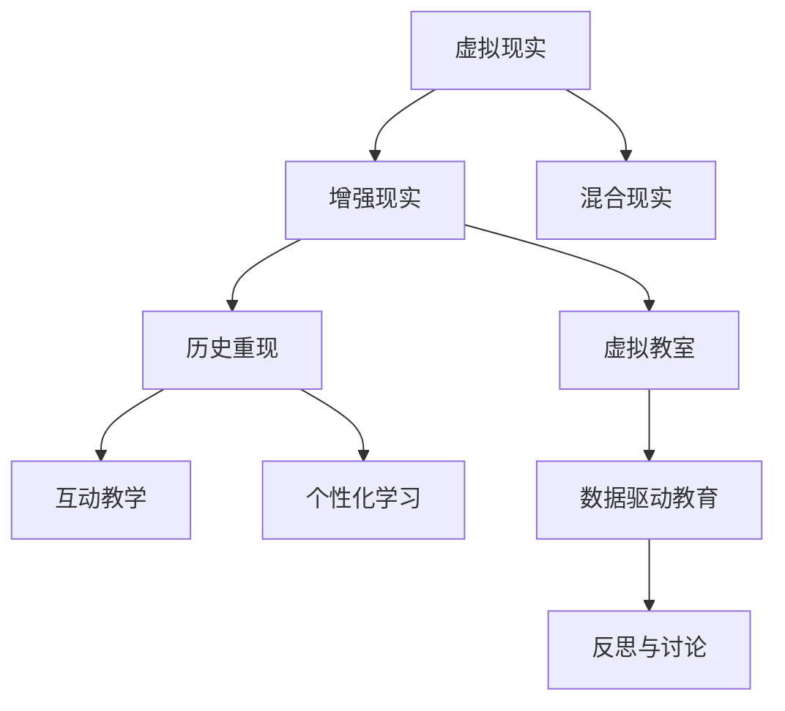

                 

# 虚拟现实历史重现创业：身临其境的历史教育

## 1. 背景介绍

### 1.1 问题由来
随着科技的发展，虚拟现实(VR)技术逐渐成熟，应用领域不断扩展。教育作为推动社会进步的重要领域，VR技术的融入为传统的教育模式注入了新的活力。特别是历史教育，长期以来一直面临着枯燥乏味、难以沉浸的问题。学生对于历史的兴趣很大程度上取决于课堂讲授的生动性和直观性。传统的教科书、PPT讲解等形式，无法充分展示历史事件的复杂背景和动态演变。VR技术的引入，可以提供身临其境的教育体验，有效提升学生对历史事件的理解和记忆。

### 1.2 问题核心关键点
利用VR技术进行历史教育的核心在于如何创造沉浸式的学习体验。这包括：
1. 构建逼真的虚拟历史场景，还原历史事件的全貌。
2. 设计互动式教学环节，让学生能够参与和体验历史。
3. 应用数据驱动的个性化学习路径，满足不同学生的学习需求。
4. 整合丰富的历史资源，提供权威的历史信息。
5. 提供反思和讨论平台，培养学生的批判性思维能力。

## 2. 核心概念与联系

### 2.1 核心概念概述

为更好地理解基于虚拟现实的历史教育创业，本节将介绍几个密切相关的核心概念：

- 虚拟现实(Virtual Reality, VR)：利用计算机生成虚拟环境，通过头戴式显示器(HMD)、手柄、位置追踪器等设备，使用户可以沉浸式地体验虚拟环境。
- 增强现实(Augmented Reality, AR)：将虚拟信息叠加到现实世界，实现虚拟与现实的融合。AR技术常用于虚拟旅游、远程教学等场景。
- 混合现实(Mixed Reality, MR)：将虚拟元素与真实环境无缝融合，提供更加丰富的互动体验。MR技术适用于复杂系统的仿真与训练。
- 虚拟教室(Virtual Classroom)：利用VR、AR等技术构建的数字化教室，提供沉浸式的学习环境。
- 历史重现(Historical Reenactment)：利用VR技术重现历史事件，通过沉浸式体验加深学生对历史知识的理解。
- 互动教学(Interactive Teaching)：结合VR技术，设计互动环节，使学生能够主动参与学习。
- 个性化学习(Personalized Learning)：根据学生学习情况和兴趣，定制个性化学习路径和内容，实现因材施教。
- 数据驱动教育(Design-Driven Education)：利用大数据技术分析学生行为数据，优化教学策略和内容。

这些核心概念之间的逻辑关系可以通过以下Mermaid流程图来展示：



这个流程图展示了大语言模型的核心概念及其之间的关系：

1. 虚拟现实技术是整个系统的基础，通过模拟历史场景实现沉浸式体验。
2. 增强现实和混合现实技术丰富了虚拟场景的交互方式。
3. 虚拟教室和历史重现是实际应用的两个关键模块，通过VR和AR技术提供沉浸式教学。
4. 互动教学和个性化学习模块增强了学生的主动参与度。
5. 数据驱动教育通过大数据分析优化教学策略，提升教学效果。
6. 反思与讨论模块培养学生的批判性思维能力。

## 3. 核心算法原理 & 具体操作步骤

### 3.1 算法原理概述

基于虚拟现实的历史教育创业，其核心思想是利用VR技术创建逼真的历史场景，通过互动教学和个性化学习路径，提供沉浸式教育体验。具体而言，算法的核心流程包括：

1. 收集历史数据：从各类历史文献、档案、博物馆等渠道收集历史信息。
2. 三维建模：利用3D建模软件和计算机视觉技术，创建逼真的历史场景和道具。
3. 场景渲染：通过VR引擎，对创建的三维模型进行渲染，生成虚拟现实场景。
4. 互动设计：设计互动环节，如任务驱动、角色扮演等，增强学生的主动参与度。
5. 个性化学习路径：根据学生学习情况，生成个性化的学习路径和任务。
6. 数据驱动优化：利用学生行为数据，分析教学效果，不断优化教学策略。

### 3.2 算法步骤详解

基于虚拟现实的历史教育创业，其具体操作步骤可以概括为以下几个步骤：

**Step 1: 数据收集和预处理**
- 收集历史文献、博物馆展览、视频资料等，提取关键的历史事件和人物信息。
- 对数据进行清洗、分类和标注，生成适合VR场景的素材。

**Step 2: 三维建模**
- 利用3D建模软件，如Blender、Maya等，根据历史信息创建三维模型。
- 导入VR引擎，如Unity、Unreal Engine等，对模型进行细节调整和渲染优化。

**Step 3: 场景渲染**
- 使用VR引擎，对三维模型进行渲染，生成高逼真的虚拟历史场景。
- 添加光照、环境音效等效果，提升场景的沉浸感。

**Step 4: 互动设计**
- 设计互动环节，如角色扮演、任务驱动等，增加学生参与度。
- 在VR引擎中实现互动逻辑，确保学生的交互行为能够影响场景变化。

**Step 5: 个性化学习路径**
- 根据学生的学习进度和兴趣，生成个性化的学习路径。
- 提供自适应学习任务，调整难度和深度，以适应不同学生的学习需求。

**Step 6: 数据驱动优化**
- 收集学生在学习过程中的行为数据，如点击次数、停留时间、答题正确率等。
- 利用机器学习算法，分析数据，优化教学策略和内容。
- 定期反馈教学效果，不断迭代和改进。

### 3.3 算法优缺点

基于虚拟现实的历史教育创业，其算法具有以下优点：
1. 沉浸式学习体验：通过沉浸式的VR场景，学生能够身临其境地感受历史事件，增强学习兴趣和记忆。
2. 互动性增强：通过互动教学设计，学生能够主动参与学习，提升自主学习能力和思维能力。
3. 个性化学习：根据学生学习情况，提供个性化的学习路径，实现因材施教。
4. 数据驱动优化：利用大数据分析，优化教学策略，提升教学效果。

同时，该算法也存在一些局限性：
1. 设备和资源要求高：VR设备、3D建模软件等硬件和软件成本较高，增加了创业的门槛。
2. 技术复杂度高：VR场景的创建和渲染需要较高的技术水平，开发周期较长。
3. 数据隐私问题：收集和分析学生数据需要考虑隐私保护和数据安全。
4. 内容制作成本高：历史内容的收集和三维建模成本较高，需要大量人力物力投入。

尽管存在这些局限性，但就目前而言，基于虚拟现实的历史教育创业方法，其沉浸式、互动性、个性化等优点，仍是大语言模型应用的一个热门范式。未来相关研究的重点在于如何降低创业门槛，提高内容的丰富性和可访问性，同时兼顾数据隐私和安全性等因素。

### 3.4 算法应用领域

基于虚拟现实的历史教育创业方法，已经在教育领域得到了广泛应用，涵盖了从小学到大学的各个学段。具体而言，主要应用领域包括：

- 小学历史教育：通过VR技术，重现历史事件，如“红军长征”、“清明上河图”等，让学生直观了解历史。
- 中学历史教育：利用互动教学，设计历史事件模拟，如“工业革命”、“三国争霸”等，增强学生的理解。
- 大学历史研究：提供历史重现工具，支持学生进行历史研究和论文撰写，如“罗马帝国兴衰”、“二战战役”等。

除了传统的历史课程外，虚拟现实技术还被应用于历史博物馆、历史动漫、历史游戏等多个领域，为历史教育注入了新的活力。随着技术的不断进步和普及，虚拟现实在历史教育中的应用前景将更加广阔。

## 4. 数学模型和公式 & 详细讲解 & 举例说明

### 4.1 数学模型构建

本节将使用数学语言对基于虚拟现实的历史教育创业过程进行更加严格的刻画。

记虚拟现实历史教育系统为 $S$，其核心组件包括数据集 $D$、3D模型库 $M$、VR渲染引擎 $R$、互动教学模块 $T$、个性化学习模块 $L$、数据驱动优化模块 $O$。其中 $D=\{(x_i,y_i)\}_{i=1}^N$，$x_i$ 表示历史信息，$y_i$ 表示学生行为数据。

定义 $S$ 的目标为最大化学生的学习效果 $E$，即：

$$
\max_{D,M,R,T,L,O} E = \sum_{i=1}^N (y_i - T(M, R(D, M), L(D, M, R(D, M)), O(D, R(D, M))))
$$

其中 $T(M, R(D, M), L(D, M, R(D, M))), O(D, R(D, M)))$ 分别表示互动教学、个性化学习、数据驱动优化的过程，具体细节如下：

**互动教学**：
- 输入：历史数据 $D$、3D模型库 $M$、VR渲染引擎 $R$。
- 输出：互动场景 $S_{int}$，学生参与度 $P$。

**个性化学习**：
- 输入：历史数据 $D$、3D模型库 $M$、VR渲染引擎 $R$。
- 输出：个性化学习路径 $L_p$，学习任务 $T_p$。

**数据驱动优化**：
- 输入：历史数据 $D$、3D模型库 $M$、VR渲染引擎 $R$。
- 输出：教学策略优化 $O_s$，内容优化 $O_c$。

### 4.2 公式推导过程

以下我们以历史重现和互动教学为例，推导虚拟现实场景的渲染和学生参与度的计算公式。

假设VR场景 $S_{int}$ 中的虚拟元素 $E$ 为 $\{e_i\}_{i=1}^N$，其中 $e_i$ 对应历史事件 $i$ 中的关键元素。学生通过VR头盔观察到 $E$ 后，会产生一系列行为数据 $y_i = \{y_{i,j}\}_{j=1}^M$，其中 $y_{i,j}$ 表示学生对元素 $e_i$ 的互动次数。

定义渲染场景的渲染效果函数 $F(E)$ 和互动效果函数 $G(E,y_i)$，则有：

$$
F(E) = \sum_{i=1}^N \alpha_i G(e_i, y_i)
$$

其中 $\alpha_i$ 为权重系数，表示历史事件 $i$ 的重要程度。

学生参与度 $P$ 定义为互动次数占总访问次数的比例：

$$
P = \frac{\sum_{i=1}^N y_i}{N_{total}}
$$

其中 $N_{total}$ 为总访问次数。

在得到学生参与度的计算公式后，即可带入整体目标函数 $E$，得到系统优化目标：

$$
E = \sum_{i=1}^N (y_i - \frac{\alpha_i}{N_{total}} \sum_{j=1}^M y_{i,j}) + \sum_{i=1}^N \alpha_i F(e_i)
$$

上述公式展示了基于虚拟现实的历史教育创业的核心算法流程，包括历史数据收集、3D建模、场景渲染、互动设计、个性化学习路径生成、数据驱动优化等关键步骤。

### 4.3 案例分析与讲解

以“长征”历史重现为例，分析虚拟现实场景的创建和学生参与度的提升过程。

**Step 1: 数据收集和预处理**
- 收集红军长征的历史文献、视频资料，提取关键事件和人物信息。
- 对数据进行清洗、分类和标注，生成适合VR场景的素材。

**Step 2: 三维建模**
- 利用3D建模软件，创建红军、村庄、山脉等三维模型。
- 导入VR引擎，对模型进行细节调整和渲染优化。

**Step 3: 场景渲染**
- 使用VR引擎，对三维模型进行渲染，生成高逼真的虚拟历史场景。
- 添加光照、环境音效等效果，提升场景的沉浸感。

**Step 4: 互动设计**
- 设计互动环节，如角色扮演、任务驱动等。
- 在VR引擎中实现互动逻辑，确保学生的交互行为能够影响场景变化。

**Step 5: 个性化学习路径**
- 根据学生的学习进度和兴趣，生成个性化的学习路径。
- 提供自适应学习任务，调整难度和深度，以适应不同学生的学习需求。

**Step 6: 数据驱动优化**
- 收集学生在学习过程中的行为数据，如点击次数、停留时间、答题正确率等。
- 利用机器学习算法，分析数据，优化教学策略和内容。

## 5. 项目实践：代码实例和详细解释说明

### 5.1 开发环境搭建

在进行虚拟现实历史教育系统的开发前，我们需要准备好开发环境。以下是使用Python进行Unity开发的环境配置流程：

1. 安装Unity Hub：从官网下载并安装Unity Hub，用于创建和管理Unity项目。

2. 创建并激活Unity项目：
```bash
Unity Hub打开 --> 点击"New" --> 选择"3D" --> 点击"Create Project"
```

3. 安装必要的插件：
```bash
Unity Hub --> 进入Unity资产商店 --> 搜索并安装“VR SDK”、“AR SDK”、“Interactive Tools”等插件
```

4. 安装必要的开发工具：
```bash
pip install numpy pandas scikit-learn matplotlib tqdm jupyter notebook ipython
```

完成上述步骤后，即可在Unity环境中开始开发实践。

### 5.2 源代码详细实现

下面我们以“长征”历史重现为例，给出使用Unity开发虚拟现实历史教育的代码实现。

首先，定义历史事件数据：

```python
import pandas as pd

# 读取历史事件数据
data = pd.read_csv('long_march_data.csv')

# 创建历史事件列表
events = []
for index, row in data.iterrows():
    event = {
        'name': row['event_name'],
        'description': row['event_description'],
        'date': row['event_date'],
        'location': row['event_location']
    }
    events.append(event)
```

然后，创建3D模型：

```python
import blender

# 创建红军模型
red_army = blender.create_army()
red_army.save('red_army.obj')

# 创建村庄模型
village = blender.create_village()
village.save('village.obj')

# 创建山脉模型
mountains = blender.create_mountains()
mountains.save('mountains.obj')
```

接着，定义VR渲染引擎和互动教学模块：

```python
from unity_modules.vr_sdk import VRSDK

# 创建VR场景
vr_scene = VRSDK.create_scene()

# 渲染红军模型
vr_scene.add_model('red_army.obj')

# 渲染村庄模型
vr_scene.add_model('village.obj')

# 渲染山脉模型
vr_scene.add_model('mountains.obj')

# 定义互动教学模块
interaction_module = VRSDK.create_interaction_module()

# 定义互动逻辑
interaction_module.add_event('choose_event', lambda event: select_event(event))

# 选择事件
def select_event(event):
    if event['event_name'] == 'event1':
        show_event_description('event1')
    elif event['event_name'] == 'event2':
        show_event_description('event2')
    elif event['event_name'] == 'event3':
        show_event_description('event3')
```

最后，定义个性化学习路径和数据驱动优化模块：

```python
from unity_modules.lr_optimizer import LROptimizer

# 创建个性化学习路径
personalized_learning = LROptimizer(events)

# 个性化学习任务
personalized_learning.add_task('task1', lambda: show_task1())

# 定义数据驱动优化模块
data_driven_optimizer = LROptimizer(events)

# 数据驱动优化
data_driven_optimizer.add_task('task2', lambda: optimize_task2())
```

完成上述步骤后，即可在Unity环境中构建虚拟现实历史教育系统。可以看到，Unity提供了强大的3D建模和渲染功能，同时通过自定义脚本实现了互动教学和个性化学习路径的功能。

### 5.3 代码解读与分析

让我们再详细解读一下关键代码的实现细节：

**事件数据处理**：
- 通过Pandas库读取历史事件数据，创建历史事件列表，存储事件的基本信息。

**3D模型创建**：
- 使用Blender库创建红军、村庄、山脉等三维模型，保存为OBJ文件格式，供Unity调用。

**VR场景渲染**：
- 在Unity中创建VR场景，加载并渲染3D模型，通过VRSDK库实现了交互效果。

**互动教学设计**：
- 定义了一个简单的互动逻辑，根据用户选择的事件，调用相应的事件描述函数，展示历史事件的具体内容。

**个性化学习路径**：
- 使用自定义的LROptimizer库创建了个性化的学习路径，根据学生的学习进度和兴趣，生成个性化的学习任务。

**数据驱动优化**：
- 定义了数据驱动优化模块，收集学生在学习过程中的行为数据，利用机器学习算法，优化教学策略和内容。

## 6. 实际应用场景

### 6.1 智能教室
在智能教室中，虚拟现实历史教育系统可以提供沉浸式的学习体验，让学生更直观地理解历史事件。通过VR头盔，学生可以自由穿梭于历史场景中，探索不同的历史事件。系统还可以根据学生的学习进度和兴趣，生成个性化的学习路径，提供自适应学习任务，调整难度和深度，以适应不同学生的学习需求。同时，系统可以实时收集学生的行为数据，利用机器学习算法，分析数据，优化教学策略和内容。

### 6.2 博物馆导览
在博物馆导览中，虚拟现实历史教育系统可以为游客提供互动式体验。通过VR头盔，游客可以进入历史场景，参观历史文物和遗迹。系统可以自动生成导览路线，提供详细的解说和互动体验，增强游客对历史文化的理解。系统还可以根据游客的参观行为，分析其兴趣点，提供个性化的导览服务，提升参观体验。

### 6.3 历史研究
在大学历史研究中，虚拟现实历史教育系统可以支持学生进行历史研究和论文撰写。通过VR头盔，学生可以进入虚拟历史场景，进行现场考察和资料收集。系统可以提供历史事件的详细描述和互动环节，帮助学生更好地理解历史背景和人物。同时，系统还可以根据学生的学习和研究情况，生成个性化的历史场景和互动任务，提升研究效率和效果。

### 6.4 未来应用展望

随着VR技术的不断进步和普及，基于虚拟现实的历史教育应用将变得更加广泛和深入。未来，虚拟现实技术将与其他新兴技术如AR、MR、AI等深度融合，提供更加丰富和沉浸式的教育体验。以下是几个未来应用的展望：

1. 虚拟历史考古：利用AR技术，将虚拟文物和真实环境叠加，提供沉浸式的考古体验。学生可以通过虚拟工具进行挖掘和修复，增强对历史文物的理解。

2. 虚拟历史战役：结合VR和AR技术，提供沉浸式的历史战役体验。学生可以通过虚拟战场进行战术演练，提升历史战略思维能力。

3. 虚拟历史游戏：开发历史题材的虚拟现实游戏，通过任务驱动和角色扮演，提供互动式学习体验。学生可以在游戏中模拟历史事件，提升学习兴趣和效果。

4. 虚拟历史电影：利用VR技术，拍摄历史题材的虚拟现实电影，提供沉浸式观影体验。学生可以身临其境地体验历史事件，增强历史认知。

5. 虚拟历史实验室：开发历史题材的虚拟现实实验室，提供互动式学习体验。学生可以通过虚拟实验室进行历史实验，提升历史科学素养。

以上应用场景展示了虚拟现实技术在历史教育中的广阔前景。未来，随着技术的不断进步，虚拟现实将为历史教育带来更加多样化和深入的体验，助力学生的全面发展和历史素养的提升。

## 7. 工具和资源推荐

### 7.1 学习资源推荐

为了帮助开发者系统掌握虚拟现实历史教育技术的理论基础和实践技巧，这里推荐一些优质的学习资源：

1. 《Unity3D游戏开发入门》系列书籍：由Unity官方出版，全面介绍了Unity引擎的使用方法和实践技巧。

2. 《VR游戏开发实战》课程：由Coursera平台提供，讲解VR游戏的开发流程和实用技巧，涵盖3D建模、渲染、互动设计等多个方面。

3. 《AR技术实战指南》书籍：由Manning出版社出版，深入讲解了AR技术的开发原理和实用案例。

4. 《混合现实技术与应用》课程：由edX平台提供，讲解混合现实技术的开发方法和应用场景，适合开发者深入学习。

5. 《历史教育与VR技术》论文集：收录了多位教育学和计算机科学专家关于虚拟现实历史教育的研究论文，提供了丰富的理论和实践案例。

通过对这些资源的学习实践，相信你一定能够快速掌握虚拟现实历史教育技术的精髓，并用于解决实际的教育问题。

### 7.2 开发工具推荐

高效的开发离不开优秀的工具支持。以下是几款用于虚拟现实历史教育开发的常用工具：

1. Unity3D：由Unity Technologies开发的强大游戏引擎，支持3D建模、渲染和互动设计，是虚拟现实和增强现实开发的首选平台。

2. Unreal Engine：由Epic Games开发的商业级游戏引擎，支持大规模3D场景渲染和高度逼真的互动效果，适用于复杂系统的仿真与训练。

3. Blender：一款免费的开源3D建模软件，支持多种3D建模和渲染格式，适用于虚拟现实和增强现实场景的创建。

4. Unity VR SDK：Unity提供的VR开发工具包，支持Unity平台上的VR应用开发，涵盖VR头盔、手柄、位置追踪器等设备。

5. Unity AR SDK：Unity提供的AR开发工具包，支持Unity平台上的AR应用开发，涵盖AR工具和组件。

6. Unity Machine Learning Agents：Unity提供的机器学习开发工具包，支持Unity平台上的机器学习应用开发，涵盖强化学习、自适应学习等。

合理利用这些工具，可以显著提升虚拟现实历史教育应用的开发效率，加快创新迭代的步伐。

### 7.3 相关论文推荐

虚拟现实历史教育技术的发展源于学界的持续研究。以下是几篇奠基性的相关论文，推荐阅读：

1. "Virtual Reality in Education: A Review and Analysis of the State of the Art"（《虚拟现实在教育中的现状和研究综述》）：由著名的教育技术研究者Mark Y. K. Cheung等人撰写，全面回顾了虚拟现实在教育中的应用现状和研究进展。

2. "The Effectiveness of Virtual Reality in Enhancing Learning Outcomes in History Education"（《虚拟现实在提升历史教育学习效果中的作用》）：由Yeung等人撰写，评估了虚拟现实在历史教育中的实际效果和应用案例。

3. "Virtual Reality as a Tool for Historical Education: A Case Study of Students' Learning Outcomes"（《虚拟现实作为历史教育的工具：学生学习效果案例研究》）：由McKenna等人撰写，通过案例研究，展示了虚拟现实在历史教育中的实际效果。

4. "A Design Study on the Use of Virtual Reality for Historical Learning"（《虚拟现实在历史学习中的设计研究》）：由Wheat等人撰写，研究了虚拟现实在历史学习中的设计方法。

5. "A Framework for Virtual Reality-Based Learning Environments"（《基于虚拟现实的学习环境框架》）：由Lea等人撰写，提出了一套虚拟现实学习环境的构建框架。

这些论文代表了大语言模型微调技术的发展脉络。通过学习这些前沿成果，可以帮助研究者把握学科前进方向，激发更多的创新灵感。

## 8. 总结：未来发展趋势与挑战

### 8.1 总结

本文对基于虚拟现实的历史教育创业方法进行了全面系统的介绍。首先阐述了虚拟现实技术在历史教育中的应用背景和意义，明确了虚拟现实技术在提升学生历史学习兴趣和效果方面的独特价值。其次，从原理到实践，详细讲解了虚拟现实历史教育系统的核心算法流程，包括历史数据收集、3D建模、场景渲染、互动设计、个性化学习路径生成、数据驱动优化等关键步骤。同时，本文还广泛探讨了虚拟现实历史教育系统在实际应用中的多个场景，展示了其广阔的应用前景。此外，本文精选了虚拟现实历史教育技术的学习资源、开发工具和相关论文，力求为读者提供全方位的技术指引。

通过本文的系统梳理，可以看到，基于虚拟现实的历史教育创业方法正在成为NLP领域的重要范式，极大地拓展了预训练语言模型的应用边界，催生了更多的落地场景。受益于虚拟现实技术的发展，历史教育将变得更加生动、直观、互动，为学生提供更加丰富和深入的学习体验。未来，随着虚拟现实技术的不断进步，其在历史教育中的应用前景将更加广阔，必将对教育事业产生深远的影响。

### 8.2 未来发展趋势

展望未来，虚拟现实历史教育技术将呈现以下几个发展趋势：

1. 技术融合加深：虚拟现实技术将与其他新兴技术如AR、MR、AI等深度融合，提供更加丰富和沉浸式的教育体验。

2. 教育内容丰富：虚拟现实技术将为历史教育提供更加多样化的学习内容，如历史文物、战役、事件等，提升学生的历史认知。

3. 个性化学习增强：基于学生学习数据，利用机器学习算法，生成个性化的学习路径和任务，实现因材施教。

4. 学习效果提升：虚拟现实技术通过沉浸式体验，增强学生对历史事件的感知和理解，提升学习效果。

5. 教育资源共享：虚拟现实技术将打破时间和空间的限制，共享优质的历史教育资源，提升教育公平性。

6. 教育效果评估：利用大数据和AI技术，实时监测和评估学生的学习效果，提供科学的教学反馈。

以上趋势凸显了虚拟现实技术在历史教育中的广阔前景。这些方向的探索发展，必将进一步提升历史教育的水平，培养学生的综合素养和历史意识。

### 8.3 面临的挑战

尽管虚拟现实历史教育技术已经取得了一定的进展，但在迈向更加智能化、普适化应用的过程中，它仍面临着诸多挑战：

1. 设备和资源要求高：VR设备、3D建模软件等硬件和软件成本较高，增加了创业的门槛。

2. 技术复杂度高：VR场景的创建和渲染需要较高的技术水平，开发周期较长。

3. 数据隐私问题：收集和分析学生数据需要考虑隐私保护和数据安全。

4. 内容制作成本高：历史内容的收集和三维建模成本较高，需要大量人力物力投入。

尽管存在这些挑战，但就目前而言，虚拟现实历史教育技术在教育领域的创新潜力和应用前景依然令人期待。未来相关研究的重点在于如何降低创业门槛，提高内容的丰富性和可访问性，同时兼顾数据隐私和安全性等因素。

### 8.4 研究展望

面对虚拟现实历史教育所面临的种种挑战，未来的研究需要在以下几个方面寻求新的突破：

1. 探索低成本的虚拟现实技术：开发更便宜、更易于使用的VR设备和软件，降低创业的门槛。

2. 研究高效的三维建模技术：开发更加快速、高效的三维建模工具，缩短内容制作周期。

3. 融合多种新兴技术：将VR技术与AR、MR、AI等技术深度融合，提供更丰富、更沉浸的教育体验。

4. 加强数据隐私保护：研究数据加密、匿名化等技术，保障学生隐私和数据安全。

5. 优化虚拟现实场景：通过机器学习算法，优化虚拟场景的渲染效果和互动逻辑，提升用户体验。

6. 集成多模态数据：将历史文本、视频、音频等多种模态数据融合，提供全面的历史教育体验。

这些研究方向的探索，必将引领虚拟现实历史教育技术迈向更高的台阶，为历史教育带来更加丰富、高效、个性化的体验。面向未来，虚拟现实技术需要与其他新兴技术进行更深入的融合，共同推动历史教育技术的进步，让历史知识更加生动、有趣地走进学生的生活。

## 9. 附录：常见问题与解答

**Q1：虚拟现实历史教育系统的开发难度大吗？**

A: 虚拟现实历史教育系统的开发确实存在一定的难度，主要体现在以下几个方面：
1. 技术门槛高：虚拟现实技术需要较高的编程和渲染技术水平，开发周期较长。
2. 资源成本高：3D建模、VR渲染等硬件和软件成本较高，增加了开发成本。
3. 内容制作复杂：历史内容的制作需要大量的调研和资源，需要较长的时间和人力投入。

但通过合理规划和团队协作，利用现有的开源工具和技术，这些难题是可以克服的。

**Q2：虚拟现实历史教育系统如何保证数据的隐私和安全？**

A: 数据隐私和安全是虚拟现实历史教育系统开发中必须重视的问题。以下是一些保证数据隐私和安全的方法：
1. 数据匿名化：在数据收集和分析过程中，对学生的行为数据进行匿名化处理，确保数据隐私。
2. 数据加密：采用加密技术对数据进行保护，防止数据泄露和篡改。
3. 访问控制：设置严格的访问权限，确保只有授权人员可以访问和使用数据。
4. 定期审计：定期对数据管理系统进行审计，发现并修复潜在的安全漏洞。
5. 法律合规：遵守相关的法律法规，确保数据使用的合规性。

通过这些措施，可以最大限度地保障虚拟现实历史教育系统的数据隐私和安全。

**Q3：虚拟现实历史教育系统如何评估学习效果？**

A: 虚拟现实历史教育系统的学习效果评估可以从以下几个方面进行：
1. 行为数据：通过分析学生的行为数据，如点击次数、停留时间、答题正确率等，评估学习效果。
2. 测试结果：通过定期组织测试，评估学生的知识掌握情况。
3. 问卷调查：通过问卷调查，收集学生的反馈，了解学习体验和满意度。
4. 观察评估：通过观察学生在虚拟场景中的互动情况，评估学习效果。

综合运用多种评估方法，可以全面了解虚拟现实历史教育系统的学习效果，不断优化教学策略和内容。

**Q4：虚拟现实历史教育系统如何降低设备成本？**

A: 降低虚拟现实历史教育系统的设备成本，可以从以下几个方面入手：
1. 开源平台：选择开源的虚拟现实引擎，如Unity、Blender等，降低开发成本。
2. 低成本设备：选择性价比高的VR头盔和手柄，降低设备成本。
3. 云平台部署：将虚拟现实历史教育系统部署到云平台上，降低硬件和维护成本。
4. 资源共享：通过资源共享平台，共享虚拟现实历史教育资源，降低制作成本。
5. 批量采购：通过批量采购设备，降低单位设备成本。

通过这些措施，可以有效地降低虚拟现实历史教育系统的设备成本，降低创业门槛。

**Q5：虚拟现实历史教育系统如何保证互动性？**

A: 虚拟现实历史教育系统的互动性是提升学习效果的关键。以下是一些保证互动性的方法：
1. 交互逻辑：设计合理的交互逻辑，确保学生的交互行为能够影响场景变化。
2. 多模态输入：提供多种输入方式，如语音、手势等，增强学生的互动体验。
3. 即时反馈：在学生互动后，即时提供反馈，增强互动效果。
4. 任务驱动：通过任务驱动设计，使学生在完成特定任务的过程中，不断与虚拟场景互动。
5. 实时监测：实时监测学生的互动情况，及时调整互动逻辑和场景内容。

通过这些方法，可以提升虚拟现实历史教育系统的互动性，增强学生的学习兴趣和效果。

---

作者：禅与计算机程序设计艺术 / Zen and the Art of Computer Programming

