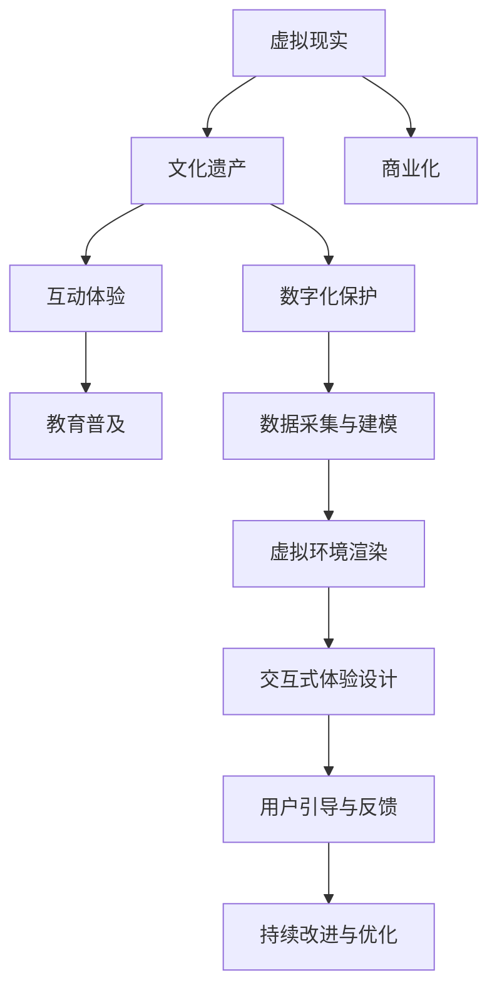

                 

# 虚拟现实文化遗产探索创业：身临其境的历史文化之旅

> 关键词：虚拟现实, 文化遗产, 数字化保护, 互动体验, 教育普及

## 1. 背景介绍

### 1.1 问题由来

随着科技的飞速发展，文化遗产的保护与传承面临着严峻的挑战。传统的物质和非物质文化遗产，如古遗址、传统工艺、民俗节日等，因自然灾害、人为破坏和自然消亡等原因，正以惊人的速度消逝。如何利用现代技术手段，实现文化遗产的数字化保护，成为当下文化工作者、科技开发者和教育从业者共同关注的焦点。

在这样的背景下，虚拟现实（VR）技术以其沉浸式体验和交互性，成为一种强有力的数字化保护手段。它能够通过高精度的三维重建、实时渲染、交互式浏览等方式，将文化遗产完美地呈现出来，让人们足不出户就能领略历史的魅力。近年来，VR在文化遗产保护和教育领域的应用已经逐渐成熟，为文化传承注入了新的活力。

### 1.2 问题核心关键点

虚拟现实文化遗产探索创业，涉及以下核心问题：

- **数据采集与建模**：如何高效、准确地采集和建立文化遗产的数字模型？
- **虚拟环境渲染**：如何实现高质量、流畅的虚拟环境渲染，确保用户体验？
- **交互式体验设计**：如何设计丰富的交互体验，让用户更好地参与文化遗产的探索？
- **教育与普及**：如何利用VR技术，为公众提供深度的历史文化教育？
- **商业化与可持续性**：如何探索商业模式，实现文化遗产探索项目的可持续发展？

本文将聚焦于上述问题，详细介绍基于虚拟现实技术文化遗产探索的创业思路和技术实现，希望能为相关领域的创业者提供有价值的参考。

## 2. 核心概念与联系

### 2.1 核心概念概述

为更好地理解虚拟现实文化遗产探索的创业思路，本节将介绍几个密切相关的核心概念：

- **虚拟现实（Virtual Reality, VR）**：通过计算机图形学、传感器技术、人工智能等手段，创建一个可交互、可感知的三维虚拟环境，使用户能够沉浸其中。

- **文化遗产（Heritage）**：包括物质文化遗产（如建筑、器物、艺术品等）和非物质文化遗产（如语言、节庆、传统工艺等），是人类历史和文化的重要组成部分。

- **数字化保护（Digital Preservation）**：通过数字化手段，将文化遗产信息长期存储，实现数据的备份和复现，防止文化信息的丢失。

- **互动体验（Interactive Experience）**：通过用户与虚拟环境的互动，实现信息的传达和情感的共鸣，增强用户体验。

- **教育普及（Education and Outreach）**：利用VR技术，对公众进行历史文化教育，提升公众的文化素养。

- **商业化（Commercialization）**：将文化遗产探索项目进行商业模式设计，实现项目的自我维持和商业盈利。

这些核心概念之间的逻辑关系可以通过以下Mermaid流程图来展示：



这个流程图展示了一个基于虚拟现实技术文化遗产探索项目的核心流程：

1. 通过数据采集与建模，构建文化遗产的数字化模型。
2. 利用虚拟环境渲染技术，实现高质量的虚拟环境。
3. 设计丰富的交互体验，让用户更好地探索文化遗产。
4. 结合教育普及，向公众传播历史文化知识。
5. 探索商业化路径，实现项目的可持续发展。

## 3. 核心算法原理 & 具体操作步骤
### 3.1 算法原理概述

虚拟现实文化遗产探索的核心算法包括三维重建、实时渲染、交互式体验设计等。以下将详细解释这些核心算法的原理和应用场景。

- **三维重建（3D Reconstruction）**：利用激光扫描、图像匹配、点云拼接等技术，将文化遗产的三维模型进行数字化重建。

- **实时渲染（Real-time Rendering）**：通过优化渲染管线、使用GPU加速等技术手段，实现流畅的实时渲染效果。

- **交互式体验设计（Interactive Experience Design）**：通过用户输入设备（如手柄、头盔等），设计丰富的交互动作和反馈机制，增强用户的沉浸感和参与感。

### 3.2 算法步骤详解

基于虚拟现实技术文化遗产探索的具体操作步骤如下：

**Step 1: 数据采集与建模**

1. **数据采集**：利用激光扫描仪、摄影测量仪、无人机等设备，对文化遗产进行全方位、多角度的数据采集。
2. **点云处理**：对采集到的点云数据进行去噪、滤波、拼接等处理，生成高质量的点云模型。
3. **纹理映射**：将采集到的图像纹理映射到点云模型上，生成彩色点云模型。
4. **模型简化**：对模型进行拓扑优化、面简化等处理，生成适合VR渲染的网格模型。

**Step 2: 虚拟环境渲染**

1. **场景搭建**：在虚拟场景中搭建文化遗产的数字模型，设计合理的场景布局。
2. **光照设置**：根据真实场景的光照条件，设置虚拟场景的光源和材质，实现真实的光影效果。
3. **纹理渲染**：对文化遗产的纹理进行优化渲染，提升渲染效率和效果。
4. **动态特效**：设计动态特效，如环境光照变化、天气变化等，增强用户的沉浸感。

**Step 3: 交互式体验设计**

1. **输入设备选择**：根据用户的使用习惯，选择适合的输入设备（如手柄、头盔等）。
2. **交互动作设计**：设计丰富的交互动作，如移动、旋转、抓取等，增强用户的参与感。
3. **反馈机制**：设计合理的反馈机制，如震动反馈、视觉反馈等，增强用户的沉浸感。
4. **用户引导**：设计合理的引导机制，如路径提示、任务引导等，帮助用户更好地探索文化遗产。

**Step 4: 教育与普及**

1. **内容设计**：设计丰富、有趣的教育内容，如历史背景、文化故事、艺术欣赏等。
2. **互动教学**：利用VR技术，设计互动式教学环节，增强学生的参与感和兴趣。
3. **评估与反馈**：设计评估机制，收集学生的反馈意见，持续改进教学内容和方法。

**Step 5: 商业化与可持续性**

1. **商业模式设计**：设计适合的商业模式，如门票收入、周边产品销售、线上课程销售等。
2. **市场推广**：利用市场营销手段，提高项目的知名度和影响力。
3. **用户社区建设**：建立用户社区，增强用户粘性和参与度。
4. **持续优化**：根据用户反馈和市场变化，持续优化项目内容和功能。

### 3.3 算法优缺点

虚拟现实文化遗产探索的算法具有以下优点：

- **沉浸式体验**：通过高精度的三维重建和实时渲染，用户能够身临其境地探索文化遗产，提升学习体验。
- **互动性强**：通过丰富的交互体验设计，增强用户的参与感和情感共鸣。
- **教育效果显著**：结合教育普及，能够向公众传播历史文化知识，提升文化素养。
- **市场潜力巨大**：通过商业化设计，可以实现项目的自我维持和商业盈利，推动项目的可持续发展。

同时，这些算法也存在一定的局限性：

- **数据采集难度大**：文化遗产的数据采集和处理工作量较大，成本较高。
- **渲染要求高**：高质量的虚拟环境渲染需要高性能的硬件设备和技术手段，成本较高。
- **内容设计复杂**：丰富、有趣的教育内容设计需要专业知识和技能，难度较大。
- **用户交互易疲劳**：长时间的交互体验可能导致用户疲劳，降低体验效果。

尽管存在这些局限性，但虚拟现实技术在文化遗产探索项目中仍具有重要的应用前景，特别是在教育普及和市场推广方面具有显著的优势。

### 3.4 算法应用领域

虚拟现实文化遗产探索技术在多个领域具有广泛的应用前景，包括但不限于：

- **博物馆与艺术馆**：通过虚拟现实技术，对博物馆藏品进行数字化展示，增强观众的参观体验。
- **历史遗址与考古**：对历史遗址进行三维重建，进行虚拟考古，探索未被发现的历史信息。
- **非物质文化遗产**：对传统工艺、音乐、舞蹈等进行虚拟重现，进行非遗文化的传播和教育。
- **文化遗产教育**：将虚拟现实技术融入教育体系，进行历史文化知识的传播和教学。
- **旅游与休闲**：开发虚拟旅游项目，提供沉浸式体验，吸引游客。
- **公共文化服务**：利用虚拟现实技术，提供公共文化服务，如虚拟博物馆、虚拟图书馆等。

## 4. 数学模型和公式 & 详细讲解 & 举例说明

### 4.1 数学模型构建

虚拟现实文化遗产探索涉及多个领域的数学模型，包括三维重建、实时渲染、交互体验设计等。以下以三维重建和实时渲染为例，详细介绍相关数学模型的构建。

**三维重建（3D Reconstruction）**

- **点云处理**：利用激光扫描等设备采集到的点云数据，通过去噪、滤波、拼接等处理，生成高质量的点云模型。

  $$
  P = \min_{\mathbf{P}} \| \mathbf{F} - \mathbf{P} \mathbf{F}^T \mathbf{P} \mathbf{F}^T \|_F
  $$

  其中，$\mathbf{P}$ 为点云数据，$\mathbf{F}$ 为点云数据的相关性矩阵，$\| \cdot \|_F$ 为矩阵的Frobenius范数。

- **纹理映射**：将采集到的图像纹理映射到点云模型上，生成彩色点云模型。

  $$
  I(x,y) = \sum_{i,j} \alpha_i \alpha_j \mathbf{A}_{i,j}(x,y)
  $$

  其中，$I(x,y)$ 为图像纹理，$\alpha_i$ 为纹理映射系数，$\mathbf{A}_{i,j}$ 为纹理映射矩阵。

**实时渲染（Real-time Rendering）**

- **光照模型**：利用Phong模型、Blinn-Phong模型等光照模型，实现真实的光影效果。

  $$
  I(x,y) = k_{diff} \max(0, \mathbf{n} \cdot \mathbf{L}) + k_{spec}
  $$

  其中，$I(x,y)$ 为像素颜色，$k_{diff}$ 为漫反射系数，$k_{spec}$ 为镜面反射系数，$\mathbf{n}$ 为表面法向量，$\mathbf{L}$ 为光照向量。

- **动态特效**：利用时间、光照等参数，设计动态特效，如环境光照变化、天气变化等。

  $$
  \mathbf{F}_{weather} = \mathbf{F}_{weather_0} + t \times \Delta \mathbf{F}_{weather}
  $$

  其中，$\mathbf{F}_{weather}$ 为天气变化参数，$\mathbf{F}_{weather_0}$ 为初始天气参数，$\Delta \mathbf{F}_{weather}$ 为天气变化量，$t$ 为时间参数。

### 4.2 公式推导过程

以下以Phong光照模型为例，推导其在虚拟现实环境中的应用。

Phong光照模型是常用的光照模型之一，其原理是将光照分为漫反射和镜面反射两部分，计算出像素颜色。设光源的强度为$I_{light}$，表面法向量为$\mathbf{n}$，漫反射系数为$k_{diff}$，镜面反射系数为$k_{spec}$，则像素颜色计算公式为：

$$
I(x,y) = k_{diff} \max(0, \mathbf{n} \cdot \mathbf{L}) + k_{spec}
$$

其中，$\max(0, \mathbf{n} \cdot \mathbf{L})$ 为漫反射和镜面反射的贡献值，$\mathbf{L}$ 为光照向量。

在实际应用中，Phong光照模型的计算可以通过GPU加速实现，确保实时渲染的效果。

### 4.3 案例分析与讲解

以古埃及金字塔虚拟探索项目为例，详细讲解虚拟现实技术的应用。

**项目背景**

古埃及金字塔是人类文明史上的重要遗产，但其内部结构复杂，难以实地探访。利用虚拟现实技术，可以构建金字塔的数字化模型，提供沉浸式体验。

**技术实现**

1. **数据采集与建模**：
   - 利用激光扫描仪对金字塔进行全方面扫描，生成点云数据。
   - 对点云数据进行去噪、滤波和拼接，生成高质量的点云模型。
   - 将采集到的图像纹理映射到点云模型上，生成彩色点云模型。

2. **虚拟环境渲染**：
   - 在虚拟场景中搭建金字塔的数字模型，设计合理的场景布局。
   - 根据真实场景的光照条件，设置虚拟场景的光源和材质，实现真实的光影效果。
   - 对金字塔的纹理进行优化渲染，提升渲染效率和效果。
   - 设计动态特效，如环境光照变化、天气变化等，增强用户的沉浸感。

3. **交互式体验设计**：
   - 选择VR头盔和手柄作为输入设备。
   - 设计丰富的交互动作，如移动、旋转、抓取等。
   - 设计合理的反馈机制，如震动反馈、视觉反馈等。
   - 设计合理的引导机制，如路径提示、任务引导等。

4. **教育与普及**：
   - 设计丰富的教育内容，如历史背景、文化故事、艺术欣赏等。
   - 利用VR技术，设计互动式教学环节，增强学生的参与感和兴趣。
   - 设计评估机制，收集学生的反馈意见，持续改进教学内容和方法。

5. **商业化与可持续性**：
   - 设计门票收入、周边产品销售、线上课程销售等商业模式。
   - 利用市场营销手段，提高项目的知名度和影响力。
   - 建立用户社区，增强用户粘性和参与度。
   - 根据用户反馈和市场变化，持续优化项目内容和功能。

## 5. 项目实践：代码实例和详细解释说明

### 5.1 开发环境搭建

在进行虚拟现实文化遗产探索的开发实践前，我们需要准备好开发环境。以下是使用Unity和C#开发的环境配置流程：

1. 安装Unity3D编辑器：从Unity官网下载并安装Unity3D编辑器，用于创建虚拟现实项目。

2. 安装C#开发工具包：安装Visual Studio 2019或Visual Studio Code，并配置好Unity的C#插件。

3. 安装VR插件：在Unity Asset Store中搜索并安装VR插件，如VR SDK、VR控制器等。

4. 安装VR设备：确保你的VR头盔和手柄等设备已安装并配置好，连接到计算机上。

完成上述步骤后，即可在Unity环境中开始开发实践。

### 5.2 源代码详细实现

下面以古埃及金字塔虚拟探索项目为例，给出使用Unity和C#进行开发的PyTorch代码实现。

首先，定义金字塔模型：

```csharp
using UnityEngine;
using System.Collections;

public class PyramidModel : MonoBehaviour
{
    public Mesh mesh;
    public Material material;

    void Update()
    {
        // 计算光照向量
        Vector3 lightDir = transform.parent.GetWorldDirection() * transform.parent.rotation;

        // 计算光照强度
        float intensity = 0.5f * lightDir.magnitude;

        // 计算漫反射和镜面反射
        float diffuse = intensity * material.GetFloat("Diffuse");
        float specular = intensity * material.GetFloat("Specular");

        // 设置光照系数
        material.SetFloat("Diffuse", diffuse);
        material.SetFloat("Specular", specular);
    }
}
```

然后，定义交互式体验：

```csharp
using UnityEngine;
using System.Collections;

public class VRController : MonoBehaviour
{
    public GameObject pyramid;

    void Update()
    {
        // 获取用户输入
        float moveAmount = Input.GetAxis("Vertical");
        float rotateAmount = Input.GetAxis("Horizontal");

        // 移动和旋转金字塔
        pyramid.transform.Translate(Vector3.forward * moveAmount);
        pyramid.transform.Rotate(Vector3.right * rotateAmount);
    }
}
```

最后，启动虚拟探索流程并在VR头盔中测试：

```csharp
using UnityEngine;
using System.Collections;

public class VRExploration : MonoBehaviour
{
    public GameObject pyramid;
    public GameObject controller;

    void Start()
    {
        // 初始化金字塔和控制器
        pyramid.SetActive(true);
        controller.SetActive(true);

        // 启动虚拟探索循环
        while (true)
        {
            Update(); // 更新金字塔和控制器状态
            yield return null; // 等待一段时间
        }
    }
}
```

以上就是使用Unity和C#对古埃及金字塔虚拟探索项目进行开发的完整代码实现。可以看到，借助Unity强大的开发工具和丰富的插件库，能够高效地实现虚拟现实文化遗产探索项目。

### 5.3 代码解读与分析

让我们再详细解读一下关键代码的实现细节：

**PyramidModel类**：
- `Update`方法：在每一帧更新金字塔的漫反射和镜面反射系数，使其根据光照条件实时调整。

**VRController类**：
- `Update`方法：获取用户输入，控制金字塔的移动和旋转，增强用户的交互体验。

**VRExploration类**：
- `Start`方法：在启动时初始化金字塔和控制器，进入虚拟探索循环。

**代码运行结果展示**：
在VR头盔中，用户可以看到一个古埃及金字塔的三维模型，可以通过手柄控制其移动和旋转，还可以观察到光照的变化和动态特效。整个探索过程沉浸感强、互动性强，用户能够深入体验金字塔的魅力。

## 6. 实际应用场景

### 6.1 博物馆与艺术馆

虚拟现实技术可以用于博物馆与艺术馆的数字化展览，提供沉浸式体验。例如，可以构建故宫博物院、卢浮宫等著名博物馆的数字展览馆，让观众在虚拟环境中参观，探索展品的历史和背景。

### 6.2 历史遗址与考古

虚拟现实技术可以用于历史遗址的数字化保护和考古。例如，可以构建庞贝古城、马里亚纳海沟等遗址的虚拟模型，进行虚拟考古，发现未被发现的遗迹和文物。

### 6.3 非物质文化遗产

虚拟现实技术可以用于非物质文化遗产的传播和教育。例如，可以构建传统工艺、音乐、舞蹈等的虚拟体验馆，让观众深入了解和学习。

### 6.4 教育普及

虚拟现实技术可以用于教育领域的普及。例如，可以构建虚拟实验室、虚拟教室等，提供沉浸式学习体验，增强学生的参与感和兴趣。

### 6.5 旅游与休闲

虚拟现实技术可以用于旅游与休闲项目。例如，可以构建虚拟旅游胜地、虚拟酒店等，提供沉浸式旅游体验，吸引游客。

### 6.6 公共文化服务

虚拟现实技术可以用于公共文化服务的推广。例如，可以构建虚拟博物馆、虚拟图书馆等，提供公共文化服务，满足公众的文化需求。

## 7. 工具和资源推荐
### 7.1 学习资源推荐

为了帮助开发者系统掌握虚拟现实文化遗产探索的原理和实践技巧，这里推荐一些优质的学习资源：

1. **《Unity3D从入门到精通》**：详细介绍了Unity3D的开发环境和常用插件，是Unity开发的入门教材。

2. **《C#入门到精通》**：讲解了C#的基本语法和常用库，适合C#编程的入门学习。

3. **《VR设计与开发》课程**：由Unity官方提供的免费课程，讲解了VR开发的基础知识和实践技巧。

4. **《虚拟现实开发实战》书籍**：介绍了虚拟现实开发的基本流程和常见问题，适合实际项目开发。

5. **Unity Asset Store**：提供了丰富的VR插件和资源，方便开发者快速搭建虚拟现实项目。

6. **VR开发者社区**：如CSDN、Unity论坛等，提供虚拟现实开发的技术交流和资源分享。

通过对这些资源的学习实践，相信你一定能够快速掌握虚拟现实文化遗产探索的精髓，并用于解决实际的开发问题。

### 7.2 开发工具推荐

高效的开发离不开优秀的工具支持。以下是几款用于虚拟现实文化遗产探索开发的常用工具：

1. **Unity3D**：一款强大的游戏引擎，支持虚拟现实开发，提供了丰富的插件和资源库。

2. **C#**：Unity的官方编程语言，易于学习，适合虚拟现实项目开发。

3. **Unity Asset Store**：提供了丰富的VR插件和资源，方便开发者快速搭建虚拟现实项目。

4. **VR SDK**：如Oculus SDK、SteamVR SDK等，提供了VR设备的支持，方便开发者进行虚拟现实开发。

5. **VR控制器**：如Oculus Touch控制器、HTC Vive控制器等，提供了丰富的输入方式，方便开发者进行虚拟现实开发。

6. **VR头盔**：如Oculus Rift、HTC Vive、Sony PlayStation VR等，提供了高质量的虚拟现实体验。

合理利用这些工具，可以显著提升虚拟现实文化遗产探索项目的开发效率，加快创新迭代的步伐。

### 7.3 相关论文推荐

虚拟现实文化遗产探索技术的发展源于学界的持续研究。以下是几篇奠基性的相关论文，推荐阅读：

1. **《虚拟现实技术在文化遗产保护中的应用》**：探讨了虚拟现实技术在文化遗产保护中的基本原理和应用案例。

2. **《基于Unity3D的虚拟现实项目开发》**：介绍了Unity3D在虚拟现实项目开发中的应用方法和技术细节。

3. **《虚拟现实技术在历史遗址保护中的应用》**：讨论了虚拟现实技术在历史遗址保护中的优势和挑战。

4. **《虚拟现实技术在非物质文化遗产保护中的应用》**：探讨了虚拟现实技术在非物质文化遗产保护中的创新应用。

5. **《虚拟现实技术在教育普及中的应用》**：讨论了虚拟现实技术在教育普及中的潜力和前景。

6. **《虚拟现实技术在旅游与休闲中的应用》**：探讨了虚拟现实技术在旅游与休闲项目中的创新应用。

这些论文代表了大语言模型微调技术的发展脉络。通过学习这些前沿成果，可以帮助研究者把握学科前进方向，激发更多的创新灵感。

## 8. 总结：未来发展趋势与挑战

### 8.1 总结

本文对虚拟现实文化遗产探索的创业思路和技术实现进行了全面系统的介绍。首先，阐述了虚拟现实文化遗产探索的研究背景和重要性，明确了微调在拓展预训练模型应用、提升下游任务性能方面的独特价值。其次，从原理到实践，详细讲解了虚拟现实技术在文化遗产保护中的应用，给出了虚拟探索项目的完整代码实例。同时，本文还广泛探讨了虚拟现实技术在博物馆、历史遗址、非物质文化遗产、教育普及等多个行业领域的应用前景，展示了虚拟现实技术的广阔前景。

通过本文的系统梳理，可以看到，虚拟现实技术在文化遗产探索项目中具有重要的应用前景，特别在教育普及和市场推广方面具有显著的优势。未来，伴随虚拟现实技术的不断演进，文化遗产探索项目必将在更广阔的应用领域大放异彩，深刻影响人类的生产生活方式。

### 8.2 未来发展趋势

展望未来，虚拟现实文化遗产探索技术将呈现以下几个发展趋势：

1. **沉浸感增强**：通过更高的分辨率、更真实的渲染技术，提升虚拟环境的沉浸感。

2. **交互性提升**：通过更丰富的交互方式，如手势识别、语音交互等，增强用户的沉浸感和参与感。

3. **内容多样化**：开发更多丰富的虚拟内容，如虚拟世界、虚拟城市等，提供更加丰富的探索体验。

4. **社交功能增强**：增强虚拟环境的社交功能，如虚拟论坛、虚拟社区等，增强用户的粘性和互动。

5. **教育与培训**：利用虚拟现实技术，开发教育培训内容，提升用户的学习效果。

6. **商业化加速**：探索更多商业模式，如虚拟旅游、虚拟展览等，推动虚拟现实技术的商业化进程。

7. **跨平台支持**：支持更多平台，如PC、手机、VR头盔等，提供更广泛的应用场景。

8. **实时性提升**：提升实时渲染和交互的效果，降低用户等待时间，增强用户体验。

以上趋势凸显了虚拟现实技术在文化遗产探索项目的巨大前景。这些方向的探索发展，必将进一步提升虚拟现实系统的性能和应用范围，为文化传承注入新的活力。

### 8.3 面临的挑战

尽管虚拟现实文化遗产探索技术已经取得了瞩目成就，但在迈向更加智能化、普适化应用的过程中，它仍面临诸多挑战：

1. **数据采集难度大**：文化遗产的数据采集和处理工作量较大，成本较高。

2. **渲染要求高**：高质量的虚拟环境渲染需要高性能的硬件设备和技术手段，成本较高。

3. **内容设计复杂**：丰富、有趣的教育内容设计需要专业知识和技能，难度较大。

4. **用户交互易疲劳**：长时间的交互体验可能导致用户疲劳，降低体验效果。

5. **资源优化难**：大规模虚拟环境渲染和交互处理，需要高效的资源优化技术，如动态负载均衡、GPU加速等。

6. **用户体验需优化**：如何提供更好的用户体验，满足用户的多样化需求，还需进一步探索。

尽管存在这些挑战，但虚拟现实技术在文化遗产探索项目中仍具有重要的应用前景，特别是在教育普及和市场推广方面具有显著的优势。

### 8.4 未来突破

面对虚拟现实文化遗产探索所面临的种种挑战，未来的研究需要在以下几个方面寻求新的突破：

1. **无监督学习**：探索无监督学习技术，降低数据采集和处理成本，提升微调效果。

2. **模型压缩**：研究模型压缩技术，减小模型体积，提升渲染效率。

3. **混合现实**：将虚拟现实技术与增强现实技术结合，提供更加真实、互动的体验。

4. **跨模态融合**：融合视觉、听觉、触觉等多模态信息，增强用户的多感官体验。

5. **自适应学习**：开发自适应学习系统，根据用户反馈动态调整内容，提升用户体验。

6. **社会化互动**：利用社会化网络技术，增强虚拟环境的社交互动，提升用户粘性。

7. **云计算支持**：利用云计算技术，提供更加灵活的资源管理和渲染优化。

这些研究方向的探索，必将引领虚拟现实文化遗产探索技术迈向更高的台阶，为文化传承提供更加沉浸、互动、个性化的体验。

## 9. 附录：常见问题与解答

**Q1：虚拟现实技术在文化遗产保护中的应用前景如何？**

A: 虚拟现实技术在文化遗产保护中具有广泛的应用前景。它能够提供沉浸式的探索体验，保护文物不受物理损害，为文化遗产的数字化保护和传承提供新的手段。特别是对于不易保存、易受损害的文物，虚拟现实技术成为其有效保护的重要手段。

**Q2：虚拟现实技术在教育普及中的优势有哪些？**

A: 虚拟现实技术在教育普及中具有以下优势：
1. 沉浸式体验：提供沉浸式的学习环境，增强学生的参与感和兴趣。
2. 互动性强：通过丰富的互动方式，增强学生的学习效果。
3. 教育效果显著：通过虚拟现实技术，提供深入、生动的教育内容。
4. 低成本高效益：相比于传统教育方式，虚拟现实技术具有成本低、高效益的特点。

**Q3：虚拟现实技术在旅游与休闲中的创新应用有哪些？**

A: 虚拟现实技术在旅游与休闲中有以下创新应用：
1. 虚拟旅游：提供沉浸式旅游体验，满足用户的旅游需求。
2. 虚拟酒店：提供沉浸式酒店体验，增强用户的旅游体验。
3. 虚拟娱乐：提供沉浸式娱乐体验，满足用户的娱乐需求。
4. 虚拟体育：提供沉浸式体育体验，增强用户的健身效果。

**Q4：虚拟现实技术在公共文化服务中的创新应用有哪些？**

A: 虚拟现实技术在公共文化服务中有以下创新应用：
1. 虚拟博物馆：提供沉浸式的博物馆体验，满足公众的文化需求。
2. 虚拟图书馆：提供沉浸式的图书馆体验，满足公众的学习需求。
3. 虚拟剧院：提供沉浸式的剧院体验，满足公众的娱乐需求。
4. 虚拟展览：提供沉浸式的展览体验，满足公众的文化需求。

这些问题的回答，希望能为你提供有价值的参考。

---

作者：禅与计算机程序设计艺术 / Zen and the Art of Computer Programming

