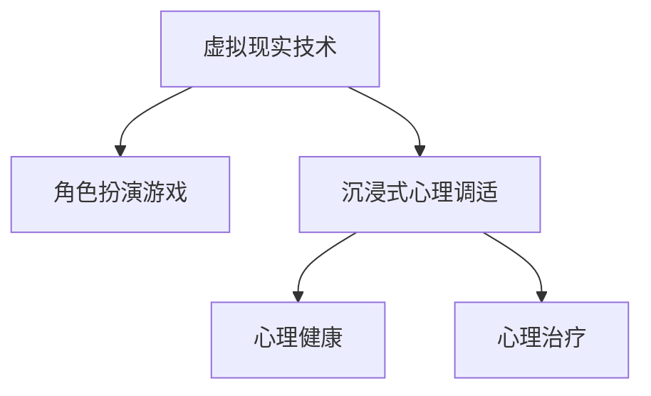

                 

# 虚拟现实角色扮演治疗创业：沉浸式心理调适

> 关键词：虚拟现实,角色扮演治疗,沉浸式心理调适,心理健康,心理治疗,技术应用

## 1. 背景介绍

### 1.1 问题由来

随着现代生活节奏的加快和竞争压力的加剧，心理健康问题已经成为了全球性的社会问题。据世界卫生组织报告，全球范围内有超过4亿人患有抑郁症和焦虑症，而且心理健康问题在各个年龄段和地区都呈现上升趋势。然而，传统心理治疗的覆盖率非常低，只有一部分患者能够获得有效的帮助。

针对这一问题，虚拟现实技术（VR）提供了新的解决方案。通过沉浸式虚拟环境，用户能够在虚拟世界中扮演不同的角色，体验各种情境，从而实现心理调适和康复。VR角色扮演治疗（VR RPG Therapy）作为一种新兴的心理治疗手段，已经被广泛应用于心理健康干预和康复训练中。

### 1.2 问题核心关键点

VR角色扮演治疗的核心在于通过沉浸式虚拟环境，帮助患者面对现实中的心理问题。具体而言，该技术的核心关键点包括：

1. **沉浸式体验**：利用VR技术创造高度逼真的虚拟环境，让用户感觉如同置身现实之中。这种沉浸式体验能够激发用户的情感反应，促进心理康复。

2. **角色扮演**：用户可以在虚拟环境中扮演各种角色，体验不同的情境。这种角色的切换和情感的沉浸有助于缓解用户的心理压力和情绪困扰。

3. **情景模拟**：通过模拟现实中的情境，帮助用户提前适应和应对各种心理挑战。例如，模拟公共演讲、社交互动等场景，帮助用户克服恐惧和焦虑。

4. **互动反馈**：在虚拟环境中，用户可以与虚拟角色进行互动，通过反馈机制调整行为和心理状态。这种互动反馈机制能够增强用户的自我控制和自信。

5. **自我反思**：在虚拟环境中，用户可以更加客观地反思和分析自己的行为和心理状态，从而实现自我成长和心理调适。

这些核心关键点共同构成了VR角色扮演治疗的技术框架，使其能够有效解决用户的心理健康问题。

## 2. 核心概念与联系

### 2.1 核心概念概述

为更好地理解VR角色扮演治疗的核心概念，本节将介绍几个密切相关的核心概念：

- **虚拟现实技术（VR）**：利用计算机生成的三维图像和音频，模拟用户可以沉浸的虚拟环境。VR技术包括头显设备、手柄、脚踏板等硬件设备和虚拟环境渲染软件。

- **角色扮演游戏（RPG）**：一种通过扮演虚构角色和参与游戏故事线，进行互动和决策的电子游戏类型。RPG游戏通常包含复杂的剧情和角色系统，提供丰富的互动体验。

- **沉浸式心理调适**：通过创造沉浸式虚拟环境，使用户能够在虚拟世界中面对和克服心理问题，实现情感调适和心理健康康复。

- **心理健康**：指个体在心理上保持良好状态，能够适应环境、发展自身潜能、有效应对压力和挑战的心理过程。

- **心理治疗**：通过专业的心理干预手段，帮助患者缓解心理问题，恢复心理健康。心理治疗包括各种技术和方法，如认知行为疗法、精神分析疗法等。

这些核心概念之间的逻辑关系可以通过以下Mermaid流程图来展示：



这个流程图展示了大语言模型的核心概念及其之间的关系：

1. 虚拟现实技术提供了沉浸式环境的基础设施。
2. 角色扮演游戏赋予用户多样化的角色和情境，增强沉浸式体验。
3. 沉浸式心理调适利用VR和RPG的结合，实现心理调适和治疗效果。
4. 心理健康和心理治疗是VR角色扮演治疗的目标和评价标准。

这些概念共同构成了VR角色扮演治疗的技术框架，使其能够有效解决用户的心理健康问题。

## 3. 核心算法原理 & 具体操作步骤
### 3.1 算法原理概述

VR角色扮演治疗的算法原理基于虚拟现实技术和角色扮演游戏的融合。其核心思想是：利用虚拟现实技术创建沉浸式环境，用户通过扮演不同的角色和参与虚拟情境，实现心理调适和康复。具体而言，该过程包括以下几个步骤：

1. **虚拟环境设计**：根据治疗目标和用户需求，设计虚拟环境，包括地形、建筑、角色、物品等。
2. **角色设计**：设计虚拟角色，包括外貌、性格、技能等，用户可以通过扮演不同角色来体验不同的情境。
3. **情境模拟**：模拟现实中的各种情境，如公共演讲、社交互动等，用户可以在虚拟环境中进行角色扮演和互动。
4. **互动反馈**：根据用户的言行和心理状态，动态调整虚拟环境中的角色行为和反馈，增强用户的沉浸感和互动性。
5. **心理评估**：在治疗过程中，通过心理量表和行为观察等方式，评估用户的心理状态和康复效果。

### 3.2 算法步骤详解

VR角色扮演治疗的算法步骤如下：

**Step 1: 准备虚拟环境和角色**
- 根据治疗目标，设计虚拟环境，包括地形、建筑、角色、物品等。
- 设计虚拟角色，设定其外貌、性格、技能等特征。

**Step 2: 构建虚拟情境**
- 利用虚拟现实引擎（如Unity、Unreal Engine等），创建模拟现实中的各种情境。
- 设计角色在虚拟情境中的互动方式，包括对话、动作等。

**Step 3: 实施角色扮演和互动反馈**
- 用户通过头显设备进入虚拟环境，选择角色进行扮演。
- 根据用户的言行和心理状态，动态调整虚拟环境中的角色行为和反馈，增强用户的沉浸感和互动性。
- 在角色扮演过程中，通过心理量表和行为观察等方式，评估用户的心理状态和康复效果。

**Step 4: 评估和调整治疗方案**
- 根据评估结果，调整虚拟环境、角色设计和情境模拟，优化治疗方案。
- 记录用户的治疗过程和效果，为后续治疗提供参考。

### 3.3 算法优缺点

VR角色扮演治疗的算法具有以下优点：

1. **沉浸式体验**：通过高度逼真的虚拟环境，提供沉浸式体验，激发用户的情感反应，促进心理康复。
2. **多样化角色和情境**：用户可以在虚拟环境中扮演不同的角色，体验多种情境，增强治疗效果。
3. **互动反馈**：通过虚拟环境中的互动反馈机制，增强用户的自我控制和自信。
4. **灵活性高**：可以根据用户的心理特点和需求，灵活调整治疗方案，提高治疗效果。

同时，该算法也存在以下局限性：

1. **技术成本高**：虚拟现实技术和角色扮演游戏需要较高的硬件设备和软件支持，技术成本较高。
2. **用户适应性差**：部分用户可能对虚拟环境有抵触情绪，难以适应和沉浸其中。
3. **隐私和安全性问题**：虚拟环境中用户的言行和数据可能存在隐私和安全性问题，需要严格保护。
4. **治疗效果受限**：对于某些严重的心理问题，虚拟环境可能无法提供足够的治疗效果，需要结合其他治疗手段。

### 3.4 算法应用领域

VR角色扮演治疗的应用领域非常广泛，可以用于以下场景：

- **焦虑症治疗**：通过模拟公共演讲、社交互动等情境，帮助用户克服恐惧和焦虑。
- **抑郁症治疗**：通过沉浸式虚拟环境，帮助用户面对和克服抑郁情绪，增强自我控制和自信。
- **创伤后应激障碍（PTSD）治疗**：通过虚拟环境模拟创伤场景，帮助用户逐步适应和克服创伤反应。
- **社交障碍治疗**：通过虚拟环境中的社交互动，帮助用户逐步克服社交恐惧和障碍，增强社交技能。
- **职业训练**：通过虚拟环境中的职业模拟训练，帮助用户提升职业技能和自信心。

除了以上场景，VR角色扮演治疗还可以用于教育、游戏、培训等领域，提供沉浸式学习体验和互动反馈。

## 4. 数学模型和公式 & 详细讲解 & 举例说明（备注：数学公式请使用latex格式，latex嵌入文中独立段落使用 $$，段落内使用 $)
### 4.1 数学模型构建

本节将使用数学语言对VR角色扮演治疗的算法过程进行更加严格的刻画。

假设虚拟环境中的角色为 $R$，情境为 $S$，用户的心理状态为 $P$。定义角色在情境 $S_i$ 中的表现 $R_i(S_i)$ 和用户在该情境下的心理状态 $P_i(S_i)$ 的关系为：

$$
P_i(S_i) = f(R_i(S_i), \alpha)
$$

其中 $f$ 为心理评估函数，$\alpha$ 为其他因素（如用户性格、经验等）的影响系数。

在治疗过程中，用户的心理状态 $P_i$ 通过与虚拟角色的互动 $R_i$ 和情境 $S_i$ 不断变化。设虚拟环境中的角色行为 $R$ 和情境 $S$ 的映射为 $g(S_i, R_i)$，则用户的心理状态变化可以表示为：

$$
P_{i+1} = g(S_i, R_i) \cdot P_i
$$

在每个治疗阶段，根据用户的心理状态变化和互动反馈，调整虚拟环境中的角色行为和情境模拟，优化治疗方案。最终目标是通过多次互动和调整，实现用户心理状态的调适和康复。

### 4.2 公式推导过程

以下我们以焦虑症治疗为例，推导心理调适的数学模型。

假设用户在虚拟环境中的焦虑水平为 $A_i$，通过角色扮演和情境模拟，用户的焦虑水平 $A_{i+1}$ 和角色行为 $R_i$ 的关系为：

$$
A_{i+1} = R_i \cdot A_i + \beta
$$

其中 $\beta$ 为其他因素（如用户性格、经验等）对焦虑的影响系数。

在治疗过程中，用户的焦虑水平 $A_i$ 通过与虚拟角色的互动 $R_i$ 不断变化。设虚拟环境中的角色行为 $R_i$ 和情境 $S_i$ 的映射为 $g(S_i, R_i)$，则用户的焦虑水平变化可以表示为：

$$
A_{i+1} = g(S_i, R_i) \cdot A_i + \beta
$$

在每个治疗阶段，根据用户的焦虑水平变化和互动反馈，调整虚拟环境中的角色行为和情境模拟，优化治疗方案。最终目标是通过多次互动和调整，实现用户焦虑水平的调适和康复。

### 4.3 案例分析与讲解

假设用户小明正在进行焦虑症治疗。虚拟环境中，小明可以选择扮演不同的角色，如教师、医生、运动员等，体验不同的情境，如公共演讲、手术场景、比赛场景等。

在虚拟演讲场景中，小明扮演教师，面对一群学生进行授课。通过互动反馈机制，根据小明的言行和心理状态，虚拟教师角色会不断调整授课方式和节奏，增强小明的自信心和控制感。在互动过程中，通过心理量表评估小明的焦虑水平和自信心，记录治疗效果。

在虚拟手术场景中，小明扮演医生，面对虚拟病人进行手术操作。通过互动反馈机制，根据小明的言行和心理状态，虚拟病人角色会不断调整病情和手术难度，增强小明的应对能力和自信心。在互动过程中，通过心理量表评估小明的焦虑水平和应对能力，记录治疗效果。

在虚拟比赛场景中，小明扮演运动员，面对虚拟观众进行比赛。通过互动反馈机制，根据小明的言行和心理状态，虚拟观众角色会不断调整比赛难度和氛围，增强小明的心理韧性和应对能力。在互动过程中，通过心理量表评估小明的焦虑水平和心理韧性，记录治疗效果。

通过上述多种情境的模拟和互动，小明逐渐克服了公共演讲、手术操作和比赛比赛中的焦虑感，增强了自信心和应对能力，最终实现了心理健康康复。

## 5. 项目实践：代码实例和详细解释说明
### 5.1 开发环境搭建

在进行VR角色扮演治疗的开发之前，我们需要准备好开发环境。以下是使用Unity引擎进行开发的配置流程：

1. 安装Unity编辑器：从Unity官网下载并安装Unity编辑器，进行配置和调试。
2. 安装VR插件：从Unity Asset Store中下载并安装VR插件，如XRCXRKit、Oculus SDK等，用于虚拟现实环境的渲染和交互。
3. 创建虚拟环境：使用Unity的3D编辑器，设计虚拟环境和角色，添加光照、材质、纹理等元素。
4. 编写角色行为脚本：使用Unity的C#脚本语言，编写角色行为逻辑，实现角色的互动和反馈机制。
5. 部署和测试：将项目导出为可执行文件，部署到VR头显设备上，进行测试和优化。

完成上述步骤后，即可在Unity环境中进行VR角色扮演治疗的开发。

### 5.2 源代码详细实现

下面我们以焦虑症治疗为例，给出使用Unity引擎对VR角色扮演治疗的实现代码。

首先，定义用户的心理状态和焦虑水平的变量：

```csharp
public class Player : MonoBehaviour
{
    public float anxietyLevel = 1.0f;
    public float anxietyThreshold = 0.5f;
    
    // 更新焦虑水平
    void Update()
    {
        if (anxietyLevel > anxietyThreshold)
        {
            // 焦虑水平超过阈值，触发反馈机制
            // ...
        }
    }
}
```

然后，定义虚拟环境中的角色和情境：

```csharp
public class VirtualEnvironment : MonoBehaviour
{
    public Transform playerTransform;
    public Transform virtualEnvironmentTransform;
    
    // 更新角色位置和行为
    void Update()
    {
        // 根据用户的言行和心理状态，动态调整角色行为和反馈
        // ...
    }
}
```

接着，定义心理评估函数和互动反馈机制：

```csharp
public class PsychologyEvaluation : MonoBehaviour
{
    public float anxietyEvaluationFactor = 0.8f;
    public float confidenceEvaluationFactor = 0.2f;
    
    // 评估用户的心理状态
    void Evaluate()
    {
        // 计算用户的心理状态
        float anxiety = playerAnxietyLevel;
        float confidence = playerConfidenceLevel;
        
        // 输出评估结果
        Debug.Log("Anxiety: " + anxiety + ", Confidence: " + confidence);
    }
}
```

最后，定义心理治疗场景：

```csharp
public class TherapyScene : MonoBehaviour
{
    public GameObject speechScenario;
    public GameObject surgeryScenario;
    public GameObject sportsScenario;
    
    // 切换治疗场景
    void SwitchScene(string sceneName)
    {
        // 根据场景名加载对应的虚拟环境和角色
        // ...
    }
    
    // 启动治疗过程
    void StartTherapy()
    {
        // 启动治疗场景
        // ...
    }
}
```

启动治疗流程后，用户可以在虚拟环境中进行角色扮演和互动反馈，通过心理评估函数和互动反馈机制，逐步实现心理调适和康复。

### 5.3 代码解读与分析

让我们再详细解读一下关键代码的实现细节：

**Player类**：
- `anxietyLevel` 和 `anxietyThreshold`：定义用户的焦虑水平和阈值。
- `Update` 方法：根据用户的言行和心理状态，动态调整角色行为和反馈，增强用户的沉浸感和互动性。

**VirtualEnvironment类**：
- `playerTransform` 和 `virtualEnvironmentTransform`：定义玩家和虚拟环境的Transform组件。
- `Update` 方法：根据用户的言行和心理状态，动态调整角色行为和反馈，增强用户的沉浸感和互动性。

**PsychologyEvaluation类**：
- `anxietyEvaluationFactor` 和 `confidenceEvaluationFactor`：定义心理评估函数中的系数。
- `Evaluate` 方法：计算用户的心理状态，并输出评估结果，帮助优化治疗方案。

**TherapyScene类**：
- `speechScenario`、`surgeryScenario`、`sportsScenario`：定义不同的治疗场景。
- `SwitchScene` 方法：根据场景名加载对应的虚拟环境和角色。
- `StartTherapy` 方法：启动治疗过程，用户可以在虚拟环境中进行角色扮演和互动反馈。

通过上述代码实现，用户可以在虚拟环境中进行角色扮演和互动反馈，通过心理评估函数和互动反馈机制，逐步实现心理调适和康复。

## 6. 实际应用场景

### 6.1 智能客服系统

虚拟现实角色扮演治疗在智能客服系统中也有广泛的应用。传统的客服系统往往依赖于自动化脚本和人工干预，难以处理复杂的客户需求。通过虚拟现实角色扮演治疗，客服人员可以在虚拟环境中进行情境模拟和角色扮演，提高应对复杂情境的能力。

在客服场景中，客服人员可以选择不同的角色和情境，模拟客户咨询、投诉等场景。通过互动反馈机制，根据客服人员的言行和心理状态，虚拟客户角色会不断调整情境和情绪，增强客服人员的自我控制和自信。在互动过程中，通过心理量表评估客服人员的心理状态和应对能力，记录客服效果。

通过上述虚拟环境中的模拟和互动，客服人员逐渐克服了复杂情境中的焦虑感和压力，增强了自信心和应对能力，最终实现了心理健康和客服效率的双重提升。

### 6.2 医疗康复训练

虚拟现实角色扮演治疗在医疗康复训练中也有广泛的应用。传统的康复训练往往依赖于物理设备和人工干预，难以模拟复杂的心理和生理状态。通过虚拟现实角色扮演治疗，康复患者可以在虚拟环境中进行情境模拟和角色扮演，提高康复效果。

在康复训练场景中，康复患者可以选择不同的角色和情境，模拟手术操作、康复训练等场景。通过互动反馈机制，根据康复患者的言行和心理状态，虚拟角色会不断调整情境和情绪，增强康复患者的自我控制和自信。在互动过程中，通过心理量表评估康复患者的心理状态和康复效果，记录训练效果。

通过上述虚拟环境中的模拟和互动，康复患者逐渐克服了康复训练中的恐惧和焦虑，增强了自信心和康复能力，最终实现了心理和生理的全面康复。

### 6.3 职业训练

虚拟现实角色扮演治疗在职业训练中也有广泛的应用。传统的职业训练往往依赖于实际设备和模拟软件，难以提供沉浸式和互动式的学习体验。通过虚拟现实角色扮演治疗，职业培训人员可以在虚拟环境中进行情境模拟和角色扮演，提高职业技能和自信心。

在职业培训场景中，职业培训人员可以选择不同的角色和情境，模拟工作场景、客户沟通等场景。通过互动反馈机制，根据职业培训人员的言行和心理状态，虚拟角色会不断调整情境和情绪，增强职业培训人员的自我控制和自信。在互动过程中，通过心理量表评估职业培训人员的心理状态和职业技能，记录培训效果。

通过上述虚拟环境中的模拟和互动，职业培训人员逐渐克服了职业培训中的压力和困难，增强了自信心和职业技能，最终实现了职业能力的全面提升。

## 7. 工具和资源推荐

### 7.1 学习资源推荐

为了帮助开发者系统掌握VR角色扮演治疗的技术基础和实践技巧，这里推荐一些优质的学习资源：

1. Unity官方文档：Unity官方提供的详细文档，包括VR插件的安装和使用、Unity的3D编辑器和C#脚本语言的使用。
2. VR开发教程：如Udacity、Coursera等平台提供的VR开发课程，涵盖从基础到高级的VR开发知识。
3. 虚拟现实心理学：学习虚拟现实在心理治疗中的应用，了解虚拟环境对用户心理的影响和评估方法。
4. VR角色扮演游戏开发：学习VR角色扮演游戏的开发流程和实现技巧，了解角色设计和情境模拟的方法。
5. 心理治疗理论：学习心理治疗的基础理论和实践方法，了解VR角色扮演治疗的理论基础。

通过对这些资源的学习实践，相信你一定能够快速掌握VR角色扮演治疗的精髓，并用于解决实际的心理健康问题。

### 7.2 开发工具推荐

高效的开发离不开优秀的工具支持。以下是几款用于VR角色扮演治疗开发的常用工具：

1. Unity编辑器：用于创建和管理虚拟环境和角色，提供丰富的3D编辑器和脚本语言支持。
2. XRCXRKit插件：用于Unity中的虚拟现实开发，提供VR设备的渲染和交互支持。
3. Oculus SDK：用于Unity中的VR开发，提供Oculus头显设备的支持。
4. Google Cardboard：用于Unity中的VR开发，提供移动设备上的VR体验。
5. VRTK插件：用于Unity中的VR开发，提供丰富的VR交互和反馈机制。

合理利用这些工具，可以显著提升VR角色扮演治疗的开发效率，加快创新迭代的步伐。

### 7.3 相关论文推荐

VR角色扮演治疗的研究源于学界的持续研究。以下是几篇奠基性的相关论文，推荐阅读：

1. Psychological Treatment of Anxiety with Virtual Reality: A Systematic Review（虚拟现实治疗焦虑症：系统综述）：总结了虚拟现实在焦虑症治疗中的应用效果和理论依据。
2. Virtual Reality Therapy for PTSD: A Meta-Analysis of Treatment Efficacy（虚拟现实治疗PTSD：治疗效果的元分析）：总结了虚拟现实在PTSD治疗中的应用效果和机制。
3. Virtual Reality Therapy in Depression: A Meta-Analysis of Treatment Efficacy（虚拟现实治疗抑郁症：治疗效果的元分析）：总结了虚拟现实在抑郁症治疗中的应用效果和机制。
4. Virtual Reality Therapy for Social Anxiety Disorder: A Systematic Review（虚拟现实治疗社交障碍：系统综述）：总结了虚拟现实在社交障碍治疗中的应用效果和理论依据。
5. Virtual Reality Therapy in Educational Settings: A Review of Research and Future Directions（虚拟现实在教育中的应用：综述与未来方向）：总结了虚拟现实在教育中的应用效果和前景。

这些论文代表了大语言模型微调技术的发展脉络。通过学习这些前沿成果，可以帮助研究者把握学科前进方向，激发更多的创新灵感。

## 8. 总结：未来发展趋势与挑战

### 8.1 总结

本文对VR角色扮演治疗进行了全面系统的介绍。首先阐述了VR角色扮演治疗的研究背景和意义，明确了虚拟现实和角色扮演游戏在心理健康干预中的作用。其次，从原理到实践，详细讲解了VR角色扮演治疗的算法过程和操作步骤，给出了具体的代码实现。同时，本文还广泛探讨了VR角色扮演治疗在智能客服、医疗康复、职业培训等场景中的应用前景，展示了其在多领域中的广泛应用潜力。

通过本文的系统梳理，可以看到，VR角色扮演治疗以其沉浸式体验和多样化的角色和情境设计，提供了全新的心理健康干预手段，有望在未来的应用中发挥更大的作用。

### 8.2 未来发展趋势

展望未来，VR角色扮演治疗技术将呈现以下几个发展趋势：

1. **多模态互动**：未来VR角色扮演治疗将结合语音、手势、表情等多种模态，提供更全面和自然的互动体验。
2. **实时反馈和调整**：通过实时感知用户的心理状态和行为，动态调整虚拟环境中的角色行为和反馈，提高治疗效果。
3. **个性化治疗**：根据用户的心理特点和需求，动态调整虚拟环境和角色设计，提供个性化的治疗方案。
4. **大数据和AI融合**：结合大数据分析和AI技术，实时分析和评估用户的心理状态和康复效果，优化治疗方案。
5. **跨领域应用**：将VR角色扮演治疗应用于更多领域，如教育、娱乐、职业培训等，提供沉浸式和互动式的学习体验。

以上趋势凸显了VR角色扮演治疗技术的广阔前景。这些方向的探索发展，必将进一步提升VR角色扮演治疗的效果和应用范围，为心理健康干预带来新的突破。

### 8.3 面临的挑战

尽管VR角色扮演治疗技术已经取得了一定的成果，但在迈向更加智能化、普适化应用的过程中，它仍面临着诸多挑战：

1. **技术成本高**：VR角色扮演治疗需要较高的硬件设备和软件支持，技术成本较高，可能限制其在一些资源有限的地区或个人的使用。
2. **用户适应性差**：部分用户可能对虚拟环境有抵触情绪，难以适应和沉浸其中，影响治疗效果。
3. **隐私和安全性问题**：虚拟环境中用户的言行和数据可能存在隐私和安全性问题，需要严格保护。
4. **治疗效果有限**：对于某些严重的心理问题，虚拟环境可能无法提供足够的治疗效果，需要结合其他治疗手段。

### 8.4 未来突破

面对VR角色扮演治疗所面临的挑战，未来的研究需要在以下几个方面寻求新的突破：

1. **降低技术成本**：开发更便宜、更轻便的VR设备和交互工具，提高技术的普及性和可访问性。
2. **提高用户适应性**：设计更加友好和沉浸式的虚拟环境，增强用户的适应能力和沉浸感。
3. **保障隐私和安全性**：采用加密和安全技术，保护用户的隐私和数据安全。
4. **优化治疗效果**：结合其他心理治疗手段，提高VR角色扮演治疗的效果和适用范围。
5. **引入AI技术**：结合AI技术和数据分析，提高VR角色扮演治疗的智能化水平和个性化程度。

这些研究方向的探索，必将引领VR角色扮演治疗技术迈向更高的台阶，为心理健康干预带来新的突破。

## 9. 附录：常见问题与解答

**Q1：虚拟现实角色扮演治疗是否适用于所有心理健康问题？**

A: 虚拟现实角色扮演治疗适用于大部分心理健康问题，尤其是那些通过沉浸式体验和互动反馈可以缓解的心理问题。但对于某些严重的心理疾病，如精神分裂症、重度抑郁症等，可能无法提供有效的治疗效果，需要结合其他治疗手段。

**Q2：如何选择适合的虚拟环境和角色？**

A: 选择适合的虚拟环境和角色需要根据治疗目标和用户需求，结合用户的心理特点和情境模拟要求进行设计。一般来说，需要考虑以下因素：
1. 用户的基本情况：年龄、性别、文化背景等。
2. 治疗目标：焦虑、抑郁、社交障碍等。
3. 情境模拟：公共演讲、手术操作、比赛场景等。
4. 角色设计：教师、医生、运动员等。

**Q3：虚拟环境如何实现互动反馈机制？**

A: 虚拟环境中的互动反馈机制可以通过角色行为脚本、物理模拟和传感器技术实现。具体而言，需要：
1. 设计虚拟角色的行为逻辑和反馈机制。
2. 通过物理模拟技术，实现角色的行为和互动。
3. 结合传感器技术，实时感知用户的言行和心理状态。

**Q4：如何评估虚拟环境的治疗效果？**

A: 评估虚拟环境的治疗效果可以通过心理量表、行为观察、生理指标等方法进行。具体而言，需要：
1. 设计心理量表，评估用户的心理状态和康复效果。
2. 观察用户的言行和行为，记录治疗过程中的变化。
3. 结合生理指标，如心率、血压等，评估用户的生理状态。

**Q5：虚拟环境如何提高用户的自我控制和自信？**

A: 虚拟环境可以通过互动反馈机制、角色行为调整和情景模拟，增强用户的自我控制和自信。具体而言，需要：
1. 设计互动反馈机制，及时调整虚拟环境中的角色行为和反馈。
2. 通过角色行为调整，增强用户的控制感和自信心。
3. 通过情景模拟，增强用户的应对能力和心理韧性。

这些问题的回答，能够帮助读者更好地理解VR角色扮演治疗的技术细节和应用实践，为开发和应用提供参考。

---

作者：禅与计算机程序设计艺术 / Zen and the Art of Computer Programming

