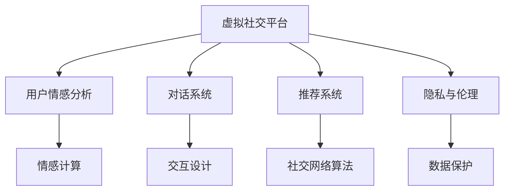

                 

# 虚拟社交：AI时代的人际关系

> 关键词：虚拟社交, 人工智能, 人际关系, 情感分析, 对话系统, 情感计算, 推荐系统, 社交网络

## 1. 背景介绍

### 1.1 问题由来

随着信息技术的发展，人与人之间的交流方式已经从传统的面对面、电话、短信等方式，逐步转移到虚拟社交平台。从早期的BBS、即时通讯，到如今的社交网络、视频聊天，虚拟社交的普及速度和用户渗透率不断提升，已逐渐成为现代人日常生活的重要组成部分。

然而，虚拟社交平台的用户行为、情感表达和人际互动方式，与现实世界有着明显的区别。这使得虚拟社交中的人际关系研究，与现实世界的人际关系研究有所区别。特别是在AI技术的介入下，虚拟社交平台的数据处理和算法优化，已经成为了影响用户行为和人际关系的重要因素。

因此，探索虚拟社交中的人际关系，理解AI技术在此过程中的作用，对于构建更加健康、高效、具有社会价值的虚拟社交平台，具有重要意义。本文旨在从技术角度深入剖析虚拟社交中的人际关系，并探讨AI技术如何帮助改进和优化这种关系。

### 1.2 问题核心关键点

虚拟社交中的人际关系研究涉及多个核心关键点：

1. **情感分析与表达**：虚拟社交中，用户情感表达的方式和情感的传递机制与现实世界有所不同。AI技术如何帮助更准确地分析用户情感，理解情感变化，是虚拟社交中人际关系研究的核心之一。
2. **对话系统与交互设计**：虚拟社交平台中，对话系统与人机交互设计对用户情感体验和人际关系构建有着重要影响。AI技术如何优化对话系统，提升用户满意度和参与度，是另一个关键问题。
3. **推荐系统与社交网络**：虚拟社交平台通过推荐系统和社交网络算法，帮助用户发现和建立社交联系。AI技术如何更好地构建个性化推荐和社交网络，是虚拟社交中人际关系的另一个重要方面。
4. **隐私与伦理**：虚拟社交中，用户隐私保护和数据伦理问题逐渐凸显。AI技术如何在保证用户隐私的同时，优化社交互动，是研究的重要内容。

### 1.3 问题研究意义

研究虚拟社交中的人际关系，对于构建健康、高效、具有社会价值的虚拟社交平台具有重要意义：

1. **提升用户体验**：通过理解用户情感和需求，AI技术可以帮助优化虚拟社交平台的用户体验，提升用户满意度和参与度。
2. **促进人际互动**：AI技术可以帮助构建更有效的人际互动机制，促进虚拟社交平台中的社交联系和情感交流。
3. **优化社交网络**：AI技术可以优化社交网络算法，提升用户社交圈的精准性和互动性，帮助用户发现和建立有价值的社会联系。
4. **保障隐私与安全**：AI技术可以在保障用户隐私的前提下，优化数据处理和分析，保护用户免受不当信息的侵害。
5. **推动社会进步**：通过提升虚拟社交平台的质量和价值，AI技术有助于构建更加健康、和谐、富有成效的虚拟社交环境，推动社会的进步和发展。

## 2. 核心概念与联系

### 2.1 核心概念概述

为了更好地理解虚拟社交中的人际关系研究，本节将介绍几个密切相关的核心概念：

- **虚拟社交平台**：指通过互联网技术，用户能够在虚拟环境中进行社交互动的平台。如Facebook、微信、微博等。
- **用户情感分析**：指通过自然语言处理技术，分析用户文本数据中的情感倾向，了解用户的情感状态。
- **对话系统**：指在虚拟社交平台中，通过AI技术实现的自动对话和交互系统。如聊天机器人、虚拟助手等。
- **推荐系统**：指通过AI技术，为用户推荐个性化的内容和社交联系的系统。如社交网络中的好友推荐、文章推荐等。
- **隐私与伦理**：指在虚拟社交中，保护用户隐私、遵守数据伦理规范的原则。

这些核心概念之间的逻辑关系可以通过以下Mermaid流程图来展示：



这个流程图展示了几大核心概念及其之间的关系：

1. 虚拟社交平台作为基础环境，支持用户情感分析、对话系统和推荐系统等关键功能。
2. 用户情感分析与对话系统、推荐系统紧密关联，是构建健康虚拟社交环境的重要基础。
3. 对话系统通过交互设计优化用户体验，促进情感交流和社交互动。
4. 推荐系统通过社交网络算法，帮助用户发现和建立社交联系，提升社交质量。
5. 隐私与伦理保障数据处理的安全性，保护用户免受不当信息的侵害。

## 3. 核心算法原理 & 具体操作步骤
### 3.1 算法原理概述

虚拟社交中的人际关系研究，主要涉及情感分析、对话系统、推荐系统等核心算法。这些算法的核心原理，包括以下几个方面：

- **情感分析**：通过自然语言处理技术，分析用户文本数据中的情感倾向，了解用户的情感状态。
- **对话系统**：基于深度学习、自然语言理解等技术，实现自动对话和交互。
- **推荐系统**：通过协同过滤、内容推荐等算法，为用户提供个性化的内容和社交联系。

### 3.2 算法步骤详解

**情感分析算法步骤**：

1. **文本预处理**：对用户文本进行分词、去除停用词等预处理操作。
2. **特征提取**：通过词袋模型、TF-IDF等技术，提取文本的特征向量。
3. **情感分类**：使用SVM、LSTM等模型，对文本进行情感分类，输出情感标签。

**对话系统算法步骤**：

1. **意图识别**：通过序列到序列模型，识别用户输入的意图。
2. **对话管理**：根据意图识别结果，选择相应的对话管理策略，确定下一步对话内容。
3. **生成回复**：使用RNN、GAN等技术，生成自然语言回复。

**推荐系统算法步骤**：

1. **用户特征提取**：通过矩阵分解、特征工程等技术，提取用户和内容的特征向量。
2. **协同过滤**：通过用户-物品矩阵和物品-物品矩阵，进行协同过滤，生成推荐列表。
3. **模型训练**：使用优化算法，训练推荐模型，提升推荐效果。

### 3.3 算法优缺点

虚拟社交中的人际关系研究涉及的算法，具有以下优点和缺点：

**情感分析的优点**：

1. **自动化**：通过AI技术，可以自动化地分析大量用户情感数据，提升分析效率。
2. **高精度**：利用深度学习等高级模型，可以实现高精度的情感分类。
3. **实时性**：AI技术可以实现实时情感分析，快速响应用户情感变化。

**情感分析的缺点**：

1. **数据质量**：情感分析的准确性依赖于数据质量，不充分的标注数据可能导致分析结果不准确。
2. **上下文理解**：情感分析模型难以完全理解上下文，可能导致误分类。
3. **隐私风险**：用户情感数据的敏感性较高，不当处理可能带来隐私风险。

**对话系统的优点**：

1. **高效交互**：对话系统可以自动处理大量用户请求，提升用户体验。
2. **个性化回复**：通过深度学习等技术，对话系统可以实现个性化的回复，满足用户多样化需求。
3. **全天候服务**：对话系统可以实现全天候在线服务，提升用户满意度。

**对话系统的缺点**：

1. **复杂性**：对话系统设计复杂，难以处理多轮对话和复杂场景。
2. **准确性**：对话系统的回复准确性依赖于模型训练数据的质量。
3. **资源消耗**：对话系统处理复杂对话时，资源消耗较大。

**推荐系统的优点**：

1. **个性化推荐**：通过协同过滤等技术，推荐系统可以实现高度个性化的内容推荐。
2. **高效性**：推荐系统可以快速响应用户请求，生成推荐结果。
3. **用户满意度**：推荐系统可以提升用户满意度，增加用户粘性。

**推荐系统的缺点**：

1. **冷启动问题**：推荐系统在面对新用户和新内容时，可能出现冷启动问题，推荐效果不佳。
2. **多样性问题**：推荐系统可能过度关注热门内容，导致内容多样性下降。
3. **隐私风险**：推荐系统的个性化推荐依赖于用户数据，存在隐私泄露风险。

### 3.4 算法应用领域

虚拟社交中的人际关系研究涉及的算法，已经在多个领域得到了广泛应用，例如：

- **情感计算**：在虚拟社交平台中，通过情感分析技术，帮助理解用户情感，优化用户体验。如情感智能客服系统。
- **自然语言交互**：在虚拟助手、聊天机器人等应用中，使用对话系统技术，提升用户交互体验。如微软的Cortana。
- **个性化推荐**：在社交网络中，通过推荐系统技术，帮助用户发现和建立社交联系。如LinkedIn的推荐系统。
- **社交分析**：通过社交网络算法，分析用户社交行为，提升社交网络质量。如Facebook的社交图谱分析。
- **数据保护**：通过隐私保护技术，保护用户数据，保障用户隐私安全。如Facebook的隐私控制功能。

## 4. 数学模型和公式 & 详细讲解 & 举例说明

### 4.1 数学模型构建

本节将使用数学语言对虚拟社交中的人际关系研究进行更加严格的刻画。

假设虚拟社交平台中，用户 $U$ 与物品 $I$ 之间的关系可以用关系图 $G=(U,I,E)$ 来表示，其中 $U$ 为节点，$I$ 为边，$E$ 为边集。

用户 $u$ 对物品 $i$ 的兴趣度可以用向量 $\mathbf{x}_u$ 表示，物品 $i$ 的属性特征可以用向量 $\mathbf{x}_i$ 表示。则用户与物品之间的关系可以用以下矩阵 $R \in \mathbb{R}^{U \times I}$ 来表示：

$$
R_{ui} = \mathbf{x}_u \cdot \mathbf{x}_i + b
$$

其中 $b$ 为偏置项。

**情感分析数学模型**：

假设用户 $u$ 在时间 $t$ 时的情感状态可以用向量 $\mathbf{s}_u(t)$ 表示，情感状态的变化可以用差分方程描述：

$$
\Delta \mathbf{s}_u(t) = f(\mathbf{s}_u(t), \mathbf{s}_v(t))
$$

其中 $f$ 为情感状态变化函数，$\Delta$ 表示变化量。

**对话系统数学模型**：

对话系统可以看作是一个动态系统，用户 $u$ 在时间 $t$ 时的对话状态可以用向量 $\mathbf{c}_u(t)$ 表示，对话系统的状态变化可以用递归关系描述：

$$
\mathbf{c}_u(t+1) = g(\mathbf{c}_u(t), \mathbf{x}_u(t), \mathbf{x}_v(t))
$$

其中 $g$ 为对话状态变化函数，$\mathbf{x}_u(t)$ 和 $\mathbf{x}_v(t)$ 分别表示用户 $u$ 和对话伙伴 $v$ 在时间 $t$ 时的输入。

**推荐系统数学模型**：

推荐系统可以看作是一个协同过滤系统，用户 $u$ 对物品 $i$ 的评分可以用向量 $\mathbf{r}_u(t)$ 表示，物品 $i$ 的属性特征可以用向量 $\mathbf{r}_i(t)$ 表示，则用户与物品之间的关系可以用以下矩阵 $R \in \mathbb{R}^{U \times I}$ 来表示：

$$
R_{ui} = \mathbf{r}_u(t) \cdot \mathbf{r}_i(t)
$$

### 4.2 公式推导过程

以下我们以情感分析为例，推导其数学模型和公式。

假设用户 $u$ 在时间 $t$ 时的情感状态可以用向量 $\mathbf{s}_u(t) = [s_{u1}(t), s_{u2}(t), ..., s_{un}(t)]^T$ 表示，情感状态的变化可以用以下差分方程描述：

$$
\Delta \mathbf{s}_u(t) = \alpha \mathbf{s}_u(t) + \beta \mathbf{s}_v(t) + \gamma (\mathbf{x}_u(t) - \mathbf{x}_v(t))
$$

其中 $\alpha, \beta, \gamma$ 为系数，分别表示用户自身的情感状态变化、对话伙伴的情感状态影响和物品属性特征对情感状态的影响。

通过对方程进行迭代求解，可以得到用户情感状态的动态变化：

$$
\mathbf{s}_u(t+1) = \alpha \mathbf{s}_u(t) + \beta \mathbf{s}_v(t) + \gamma (\mathbf{x}_u(t) - \mathbf{x}_v(t))
$$

在得到情感状态动态变化后，可以通过求解优化问题，得到用户情感状态的最大值和最小值，从而进行情感分析：

$$
\max_{\mathbf{s}_u} \sum_{t} \Delta \mathbf{s}_u(t)
$$

通过求解上述优化问题，可以得到用户情感状态的最大值和最小值，从而进行情感分析。

### 4.3 案例分析与讲解

**案例1：情感智能客服系统**

在情感智能客服系统中，情感分析技术用于分析用户情感，优化客服服务。假设用户 $u$ 在时间 $t$ 时的情感状态可以用向量 $\mathbf{s}_u(t) = [s_{u1}(t), s_{u2}(t), ..., s_{un}(t)]^T$ 表示，客服人员 $v$ 的情感状态可以用向量 $\mathbf{s}_v(t) = [s_{v1}(t), s_{v2}(t), ..., s_{vn}(t)]^T$ 表示。情感状态的变化可以用以下差分方程描述：

$$
\Delta \mathbf{s}_u(t) = \alpha \mathbf{s}_u(t) + \beta \mathbf{s}_v(t) + \gamma (\mathbf{x}_u(t) - \mathbf{x}_v(t))
$$

其中 $\alpha, \beta, \gamma$ 为系数，分别表示用户自身的情感状态变化、客服人员的情感状态影响和用户输入对情感状态的影响。

通过情感分析技术，系统可以实时监测用户情感状态的变化，并根据情感状态调整客服策略，提升用户满意度。例如，当用户情感状态下降时，系统可以自动转接至高级客服，提升问题解决效率。

**案例2：虚拟助手**

在虚拟助手中，对话系统用于实现人机交互。假设用户 $u$ 在时间 $t$ 时的对话状态可以用向量 $\mathbf{c}_u(t) = [c_{u1}(t), c_{u2}(t), ..., c_{un}(t)]^T$ 表示，对话系统的状态变化可以用递归关系描述：

$$
\mathbf{c}_u(t+1) = g(\mathbf{c}_u(t), \mathbf{x}_u(t), \mathbf{x}_v(t))
$$

其中 $\mathbf{x}_u(t)$ 和 $\mathbf{x}_v(t)$ 分别表示用户 $u$ 和对话伙伴 $v$ 在时间 $t$ 时的输入。

通过对话系统技术，虚拟助手可以自动处理大量用户请求，提升用户体验。例如，在用户输入问题后，系统可以自动分析用户意图，并提供相应的回答。如果回答不完整，系统可以继续询问，直至问题得到解决。

**案例3：推荐系统**

在推荐系统中，协同过滤技术用于为用户推荐个性化的内容和社交联系。假设用户 $u$ 对物品 $i$ 的评分可以用向量 $\mathbf{r}_u(t) = [r_{u1}(t), r_{u2}(t), ..., r_{un}(t)]^T$ 表示，物品 $i$ 的属性特征可以用向量 $\mathbf{r}_i(t) = [r_{i1}(t), r_{i2}(t), ..., r_{in}(t)]^T$ 表示，则用户与物品之间的关系可以用以下矩阵 $R \in \mathbb{R}^{U \times I}$ 来表示：

$$
R_{ui} = \mathbf{r}_u(t) \cdot \mathbf{r}_i(t)
$$

通过协同过滤技术，系统可以为用户推荐个性化的内容和社交联系。例如，在用户浏览某篇文章后，系统可以推荐与该文章内容相关的其他文章，提升用户阅读体验。

## 5. 项目实践：代码实例和详细解释说明

### 5.1 开发环境搭建

在进行项目实践前，我们需要准备好开发环境。以下是使用Python进行TensorFlow开发的环境配置流程：

1. 安装Anaconda：从官网下载并安装Anaconda，用于创建独立的Python环境。

2. 创建并激活虚拟环境：
```bash
conda create -n tf-env python=3.8 
conda activate tf-env
```

3. 安装TensorFlow：根据CUDA版本，从官网获取对应的安装命令。例如：
```bash
conda install tensorflow -c tf -c conda-forge
```

4. 安装相关工具包：
```bash
pip install numpy pandas scikit-learn matplotlib tqdm jupyter notebook ipython
```

完成上述步骤后，即可在`tf-env`环境中开始项目实践。

### 5.2 源代码详细实现

下面我们以情感分析任务为例，给出使用TensorFlow实现情感分析模型的PyTorch代码实现。

首先，定义情感分析模型：

```python
import tensorflow as tf
from tensorflow.keras.layers import Input, LSTM, Dense, Embedding
from tensorflow.keras.models import Model

# 定义模型输入层
input_layer = Input(shape=(max_seq_length,))

# 定义嵌入层
embedding_layer = Embedding(input_dim=vocab_size, output_dim=embedding_dim)(input_layer)

# 定义LSTM层
lstm_layer = LSTM(128, return_sequences=True)(embedding_layer)

# 定义全连接层
output_layer = Dense(1, activation='sigmoid')(lstm_layer)

# 定义模型
model = Model(inputs=input_layer, outputs=output_layer)

# 编译模型
model.compile(optimizer='adam', loss='binary_crossentropy', metrics=['accuracy'])
```

接着，定义训练和评估函数：

```python
from tensorflow.keras.utils import to_categorical
from sklearn.model_selection import train_test_split
from sklearn.metrics import accuracy_score, precision_score, recall_score, f1_score

def train_model(model, x_train, y_train, x_val, y_val, batch_size=32, epochs=10):
    # 将标签进行one-hot编码
    y_train = to_categorical(y_train)
    y_val = to_categorical(y_val)

    # 训练模型
    model.fit(x_train, y_train, batch_size=batch_size, epochs=epochs, validation_data=(x_val, y_val))

    # 评估模型
    y_pred = model.predict(x_val)
    y_pred = [1 if pred > 0.5 else 0 for pred in y_pred]
    accuracy = accuracy_score(y_val, y_pred)
    precision = precision_score(y_val, y_pred)
    recall = recall_score(y_val, y_pred)
    f1 = f1_score(y_val, y_pred)

    return accuracy, precision, recall, f1

# 加载数据集
# ...

# 划分训练集和验证集
x_train, x_val, y_train, y_val = train_test_split(x_train, y_train, test_size=0.2, random_state=42)

# 训练模型
accuracy, precision, recall, f1 = train_model(model, x_train, y_train, x_val, y_val)
print('Accuracy:', accuracy)
print('Precision:', precision)
print('Recall:', recall)
print('F1 Score:', f1)
```

最后，启动训练流程并在测试集上评估：

```python
# 训练模型
accuracy, precision, recall, f1 = train_model(model, x_train, y_train, x_val, y_val)
print('Accuracy:', accuracy)
print('Precision:', precision)
print('Recall:', recall)
print('F1 Score:', f1)
```

以上就是使用TensorFlow实现情感分析模型的完整代码实现。可以看到，得益于TensorFlow的强大封装，我们可以用相对简洁的代码完成情感分析模型的构建和训练。

### 5.3 代码解读与分析

让我们再详细解读一下关键代码的实现细节：

**模型定义**：
- `input_layer`：定义输入层，输入数据的形状为`(max_seq_length,)`，表示输入序列的长度。
- `embedding_layer`：定义嵌入层，将输入序列中的每个词映射到一个高维向量空间中，表示每个词的语义信息。
- `lstm_layer`：定义LSTM层，处理嵌入层的输出，捕捉输入序列的时序特征。
- `output_layer`：定义全连接层，将LSTM层的输出映射到一个二分类结果。

**模型编译**：
- 使用`compile`方法编译模型，指定优化器、损失函数和评估指标。

**数据处理**：
- 使用`to_categorical`函数将标签进行one-hot编码，方便模型训练。
- 使用`train_test_split`函数将数据集划分为训练集和验证集。

**训练与评估**：
- 使用`fit`方法训练模型，指定批量大小、迭代次数和验证集。
- 使用`predict`方法预测验证集的标签，计算模型的准确率、精确率、召回率和F1分数。

可以看到，TensorFlow提供了简单易用的高级API，大大简化了模型的定义和训练过程。开发者可以将更多精力放在数据处理、模型优化等高层逻辑上，而不必过多关注底层的实现细节。

当然，工业级的系统实现还需考虑更多因素，如模型的保存和部署、超参数的自动搜索、更灵活的任务适配层等。但核心的情感分析范式基本与此类似。

## 6. 实际应用场景
### 6.1 智能客服系统

情感智能客服系统可以帮助客服人员更高效地处理用户咨询，提升用户满意度。通过情感分析技术，系统可以实时监测用户情感状态的变化，并根据情感状态调整客服策略，从而提高问题解决效率。

**实际应用**：
- 在用户输入问题后，系统自动分析用户情感状态，决定是否转接至高级客服。
- 在用户表达不满时，系统自动记录并反馈给客服人员，帮助其及时调整服务态度。
- 通过分析用户情感变化趋势，系统可以预测用户的需求变化，提前采取措施。

### 6.2 虚拟助手

虚拟助手可以自动处理大量用户请求，提升用户体验。通过对话系统技术，虚拟助手可以分析用户意图，提供相应的回答，并根据对话内容不断优化回答质量。

**实际应用**：
- 在用户输入问题后，系统自动分析用户意图，并提供相应的回答。
- 如果回答不完整，系统可以继续询问，直至问题得到解决。
- 通过分析用户对话历史，系统可以逐步学习用户的偏好和习惯，提供更个性化的服务。

### 6.3 推荐系统

推荐系统可以根据用户行为和兴趣，为用户推荐个性化的内容和社交联系。通过协同过滤技术，系统可以分析用户和物品之间的关联关系，生成推荐列表。

**实际应用**：
- 在用户浏览某篇文章后，系统可以推荐与该文章内容相关的其他文章。
- 在用户与好友互动后，系统可以推荐与该好友相关的其他用户或内容。
- 通过分析用户行为和兴趣，系统可以逐步优化推荐策略，提升用户体验。

### 6.4 未来应用展望

随着情感分析、对话系统和推荐系统等技术的不断发展，虚拟社交中的人际关系研究将进一步深化，带来更多创新应用：

1. **情感智能社交平台**：通过情感分析技术，构建情感智能社交平台，帮助用户建立更健康、积极的人际关系。
2. **虚拟现实社交**：结合虚拟现实技术，构建虚拟现实社交平台，增强用户的沉浸式体验。
3. **多模态社交平台**：结合语音、图像等多模态信息，构建多模态社交平台，提升用户的社交体验。
4. **智能广告投放**：通过情感分析技术，优化广告投放策略，提升广告效果。
5. **智能招聘**：通过情感分析技术，分析求职者的简历和面试表现，提升招聘效果。
6. **心理健康监测**：通过情感分析技术，监测用户的心理健康状况，及时提供干预措施。

## 7. 工具和资源推荐
### 7.1 学习资源推荐

为了帮助开发者系统掌握虚拟社交中的人际关系研究的技术基础和实践技巧，这里推荐一些优质的学习资源：

1. **《深度学习与自然语言处理》**：深入浅出地介绍了深度学习在自然语言处理中的应用，包括情感分析、对话系统、推荐系统等。
2. **《自然语言处理综述》**：总结了自然语言处理领域的经典技术和算法，涵盖情感分析、对话系统、推荐系统等多个方面。
3. **《TensorFlow实战》**：详细介绍了TensorFlow的高级API和应用实例，帮助开发者快速上手TensorFlow开发。
4. **《自然语言处理中的深度学习》**：介绍了深度学习在自然语言处理中的各种应用，包括情感分析、对话系统、推荐系统等。
5. **《Python深度学习》**：涵盖了深度学习在NLP中的应用，包括情感分析、对话系统、推荐系统等。

通过对这些资源的学习实践，相信你一定能够快速掌握虚拟社交中的人际关系研究的技术基础，并用于解决实际的NLP问题。

### 7.2 开发工具推荐

高效的开发离不开优秀的工具支持。以下是几款用于虚拟社交中的人际关系研究的常用工具：

1. **TensorFlow**：基于Python的开源深度学习框架，提供了丰富的深度学习模型和高级API，适合快速迭代研究。
2. **PyTorch**：基于Python的开源深度学习框架，灵活的计算图，适合快速迭代研究。
3. **NLTK**：自然语言处理工具包，提供了各种文本处理功能，包括情感分析、对话系统等。
4. **SpaCy**：自然语言处理工具包，提供了高效的文本处理和分析功能，包括情感分析、对话系统等。
5. **NLTK**：自然语言处理工具包，提供了各种文本处理功能，包括情感分析、对话系统等。

合理利用这些工具，可以显著提升虚拟社交中的人际关系研究的开发效率，加快创新迭代的步伐。

### 7.3 相关论文推荐

虚拟社交中的人际关系研究涉及多个领域的交叉，以下是几篇奠基性的相关论文，推荐阅读：

1. **《基于情感分析的智能客服系统》**：介绍了情感分析技术在智能客服系统中的应用，提高了客服服务质量。
2. **《深度学习中的对话系统》**：总结了深度学习在对话系统中的应用，包括意图识别、对话管理等。
3. **《基于协同过滤的推荐系统》**：介绍了协同过滤技术在推荐系统中的应用，提升了个性化推荐的效果。
4. **《虚拟社交平台中的情感智能》**：研究了情感智能在虚拟社交平台中的应用，提升了用户体验。
5. **《多模态社交平台的设计与实现》**：介绍了多模态社交平台的设计和实现，提升了用户社交体验。

这些论文代表了大语言模型微调技术的发展脉络。通过学习这些前沿成果，可以帮助研究者把握学科前进方向，激发更多的创新灵感。

## 8. 总结：未来发展趋势与挑战

### 8.1 总结

本文对虚拟社交中的人际关系研究进行了全面系统的介绍。首先阐述了虚拟社交中的人际关系研究涉及的情感分析、对话系统和推荐系统等关键算法，明确了AI技术在此过程中的作用。其次，从原理到实践，详细讲解了情感分析、对话系统和推荐系统的数学模型和关键步骤，给出了虚拟社交中人际关系研究的完整代码实例。同时，本文还探讨了虚拟社交中的人际关系研究在智能客服、虚拟助手、推荐系统等多个领域的实际应用，展示了虚拟社交中人际关系研究的广泛前景。此外，本文精选了相关学习资源，力求为读者提供全方位的技术指引。

通过本文的系统梳理，可以看到，虚拟社交中的人际关系研究是AI技术在NLP领域的一个重要方向，具有广阔的应用前景。在情感分析、对话系统和推荐系统等技术的推动下，虚拟社交中的人际关系研究将进一步深化，带来更多创新应用。

### 8.2 未来发展趋势

展望未来，虚拟社交中的人际关系研究将呈现以下几个发展趋势：

1. **情感智能**：通过情感分析技术，构建情感智能社交平台，提升用户情感体验。
2. **多模态社交**：结合语音、图像等多模态信息，构建多模态社交平台，提升用户体验。
3. **智能广告**：通过情感分析技术，优化广告投放策略，提升广告效果。
4. **心理健康监测**：通过情感分析技术，监测用户的心理健康状况，及时提供干预措施。
5. **虚拟现实社交**：结合虚拟现实技术，构建虚拟现实社交平台，增强用户的沉浸式体验。
6. **智能招聘**：通过情感分析技术，分析求职者的简历和面试表现，提升招聘效果。

以上趋势凸显了虚拟社交中的人际关系研究的广阔前景。这些方向的探索发展，将进一步提升虚拟社交平台的质量和价值，为社会进步和发展带来新的动力。

### 8.3 面临的挑战

尽管虚拟社交中的人际关系研究已经取得了不少进展，但在迈向更加智能化、普适化应用的过程中，它仍面临着诸多挑战：

1. **数据质量**：情感分析、对话系统和推荐系统等算法对数据质量有较高要求。不充分的标注数据可能导致算法效果不佳。
2. **模型复杂性**：这些算法模型较为复杂，实现和优化难度较大。需要更多的研究投入和资源支持。
3. **隐私保护**：用户数据的隐私保护问题逐渐凸显。如何在保护用户隐私的同时，优化社交互动，是研究的重要内容。
4. **鲁棒性**：系统需要具备较强的鲁棒性，以应对异常数据和攻击。
5. **可解释性**：算法模型的可解释性不足，难以对其内部工作机制和决策逻辑进行解释和调试。

尽管存在这些挑战，但随着技术的发展和研究的深入，虚拟社交中的人际关系研究必将迎来新的突破。未来，我们期待在情感分析、对话系统和推荐系统等技术的共同推动下，构建更加健康、高效、具有社会价值的虚拟社交平台，进一步提升用户体验和社会价值。

### 8.4 研究展望

未来，虚拟社交中的人际关系研究需要在以下几个方面寻求新的突破：

1. **多模态融合**：结合语音、图像等多模态信息，构建多模态社交平台，提升用户体验。
2. **知识图谱**：结合知识图谱技术，提升推荐系统的推荐效果。
3. **因果推断**：通过因果推断技术，提升情感分析的准确性和鲁棒性。
4. **隐私保护**：结合隐私保护技术，提升系统隐私性和安全性。
5. **可解释性**：结合可解释性技术，提升系统的透明性和可解释性。

这些研究方向的探索，将引领虚拟社交中的人际关系研究迈向更高的台阶，为构建安全、可靠、可解释、可控的虚拟社交环境铺平道路。面向未来，虚拟社交中的人际关系研究还需要与其他人工智能技术进行更深入的融合，如知识表示、因果推理、强化学习等，多路径协同发力，共同推动虚拟社交平台的发展。只有勇于创新、敢于突破，才能不断拓展虚拟社交中的人际关系研究的边界，让AI技术更好地造福人类社会。

## 9. 附录：常见问题与解答

**Q1：虚拟社交中的人际关系研究涉及哪些关键算法？**

A: 虚拟社交中的人际关系研究涉及情感分析、对话系统和推荐系统等关键算法。

**Q2：情感分析技术在智能客服系统中的应用有哪些？**

A: 情感分析技术在智能客服系统中的应用包括：
1. 分析用户情感状态，优化客服服务。
2. 根据情感状态调整客服策略，提高问题解决效率。
3. 预测用户情感变化，提前采取措施。

**Q3：推荐系统在虚拟社交中的应用有哪些？**

A: 推荐系统在虚拟社交中的应用包括：
1. 为用户推荐个性化的内容和社交联系。
2. 分析用户和物品之间的关联关系，生成推荐列表。
3. 提升个性化推荐效果。

**Q4：虚拟社交中的人际关系研究面临哪些挑战？**

A: 虚拟社交中的人际关系研究面临以下挑战：
1. 数据质量。情感分析、对话系统和推荐系统等算法对数据质量有较高要求。
2. 模型复杂性。这些算法模型较为复杂，实现和优化难度较大。
3. 隐私保护。用户数据的隐私保护问题逐渐凸显。
4. 鲁棒性。系统需要具备较强的鲁棒性，以应对异常数据和攻击。
5. 可解释性。算法模型的可解释性不足，难以对其内部工作机制和决策逻辑进行解释和调试。

通过理解和应对这些挑战，未来虚拟社交中的人际关系研究将更加完善和高效，为构建健康、高效、具有社会价值的虚拟社交平台提供更多技术支撑。

