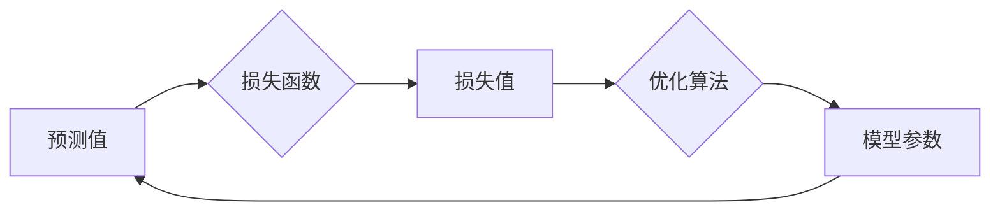

# 一切皆是映射：损失函数的种类和选择策略

作者：禅与计算机程序设计艺术 / Zen and the Art of Computer Programming


## 1. 背景介绍
### 1.1 问题的由来

在机器学习和深度学习领域，损失函数（Loss Function）扮演着至关重要的角色。它如同一个裁判，评估模型预测结果与真实值之间的差异，并指导模型通过优化算法不断逼近真实世界的规律。选择合适的损失函数，对于模型的训练效果和最终性能至关重要。

然而，面对形形色色的损失函数，如何选择最合适的函数，成为了许多开发者面临的难题。本文将深入探讨损失函数的种类、原理和选择策略，帮助读者更好地理解和使用损失函数。

### 1.2 研究现状

近年来，随着深度学习技术的飞速发展，损失函数的研究也取得了丰硕的成果。目前，主流的损失函数主要分为以下几类：

1. **均方误差（Mean Squared Error，MSE）**：适用于回归任务，计算预测值与真实值之间的平方差的平均值。
2. **交叉熵损失（Cross-Entropy Loss）**：适用于分类任务，衡量预测概率分布与真实概率分布之间的差异。
3. **Hinge Loss**：适用于支持向量机（SVM）等分类任务，计算预测值与真实标签之间的差距。
4. **Softmax Loss**：适用于多分类问题，计算预测概率分布与真实标签之间的差异。
5. **Kullback-Leibler (KL) 散度**：适用于概率分布之间的差异度量，常用于模型压缩和正则化。

### 1.3 研究意义

选择合适的损失函数，对模型的训练效果和最终性能具有以下重要意义：

1. **提高模型收敛速度**：合适的损失函数能够引导模型更快地收敛到最优解。
2. **提升模型泛化能力**：合适的损失函数能够帮助模型更好地泛化到未见过的数据。
3. **避免模型过拟合**：合适的损失函数能够有效防止模型过拟合，提高模型在测试集上的表现。

### 1.4 本文结构

本文将围绕以下内容展开：

- 介绍损失函数的核心概念和原理。
- 分析各类损失函数的特点和适用场景。
- 讲解如何根据具体任务选择合适的损失函数。
- 案例分析：展示损失函数在实际应用中的效果。
- 工具和资源推荐：推荐相关学习资源、开发工具和论文。
- 总结：展望损失函数的未来发展趋势和挑战。

## 2. 核心概念与联系

为了更好地理解损失函数，首先需要了解以下几个核心概念：

- **预测值（Predicted Value）**：模型根据输入数据预测的输出值。
- **真实值（True Value）**：输入数据对应的真实标签值。
- **损失函数（Loss Function）**：衡量预测值与真实值之间差异的函数。
- **优化算法（Optimization Algorithm）**：根据损失函数指导模型参数调整的算法，如梯度下降（Gradient Descent）。

这些概念之间的关系可以用以下图示表示：



可以看出，损失函数在机器学习和深度学习过程中起到了桥梁的作用，连接了预测值、真实值、损失值和模型参数，共同推动模型不断优化。

## 3. 核心算法原理 & 具体操作步骤
### 3.1 算法原理概述

损失函数的核心思想是衡量预测值与真实值之间的差异。常见的损失函数有以下几种：

1. **均方误差（MSE）**：$L(y, \hat{y}) = \frac{1}{2}(y - \hat{y})^2$
2. **交叉熵损失**：$L(y, \hat{y}) = -\sum_{i=1}^n y_i \log \hat{y}_i$
3. **Hinge Loss**：$L(y, \hat{y}) = \max(0, 1 - y \hat{y})$
4. **Softmax Loss**：$L(y, \hat{y}) = -\sum_{i=1}^n y_i \log \hat{y}_i$
5. **KL 散度**：$D_{KL}(P \parallel Q) = \sum_{x \in X} P(x) \log \frac{P(x)}{Q(x)}$

### 3.2 算法步骤详解

以下以均方误差损失函数为例，介绍损失函数的计算步骤：

1. 计算预测值 $\hat{y}$ 和真实值 $y$ 之间的差值：$d = y - \hat{y}$
2. 计算差值的平方：$d^2 = d \cdot d$
3. 计算平方差的平均值：$L = \frac{1}{2}d^2$

### 3.3 算法优缺点

不同损失函数具有不同的优缺点，以下列举几种常见损失函数的优缺点：

- **MSE**：优点是计算简单、易于理解；缺点是对异常值敏感，可能导致过拟合。
- **交叉熵损失**：优点是能够有效处理概率分布，适用于分类任务；缺点是计算复杂度较高。
- **Hinge Loss**：优点是能够处理非线性问题，适用于支持向量机；缺点是难以求导，优化过程较为复杂。
- **Softmax Loss**：优点是能够处理多分类问题；缺点是对于接近0或1的概率值计算效率较低。
- **KL 散度**：优点是能够度量概率分布之间的差异；缺点是计算复杂度较高，难以直接用于优化。

### 3.4 算法应用领域

不同损失函数适用于不同的任务，以下列举几种常见损失函数的应用领域：

- **MSE**：回归任务、时间序列预测等。
- **交叉熵损失**：分类任务、多分类任务等。
- **Hinge Loss**：支持向量机、线性回归等。
- **Softmax Loss**：多分类任务、序列标注等。
- **KL 散度**：概率分布估计、模型压缩、正则化等。

## 4. 数学模型和公式 & 详细讲解 & 举例说明
### 4.1 数学模型构建

以下列举几种常见损失函数的数学模型：

1. **均方误差（MSE）**：

$$
L(y, \hat{y}) = \frac{1}{2}(y - \hat{y})^2
$$

2. **交叉熵损失**：

$$
L(y, \hat{y}) = -\sum_{i=1}^n y_i \log \hat{y}_i
$$

3. **Hinge Loss**：

$$
L(y, \hat{y}) = \max(0, 1 - y \hat{y})
$$

4. **Softmax Loss**：

$$
L(y, \hat{y}) = -\sum_{i=1}^n y_i \log \hat{y}_i
$$

5. **KL 散度**：

$$
D_{KL}(P \parallel Q) = \sum_{x \in X} P(x) \log \frac{P(x)}{Q(x)}
$$

### 4.2 公式推导过程

以交叉熵损失为例，介绍其公式推导过程：

1. **softmax函数**：

$$
\sigma(z_i) = \frac{e^{z_i}}{\sum_{j=1}^n e^{z_j}}
$$

其中，$z_i$ 为第 $i$ 个神经元的输入值，$\sigma(z_i)$ 为第 $i$ 个神经元的输出值（概率）。

2. **交叉熵损失**：

$$
L(y, \hat{y}) = -\sum_{i=1}^n y_i \log \hat{y}_i
$$

其中，$y_i$ 为真实标签值，$\hat{y}_i$ 为第 $i$ 个神经元的输出值。

### 4.3 案例分析与讲解

以下以情感分析任务为例，分析不同损失函数在模型训练中的效果。

假设我们有以下样本数据：

```
文本1：这是一部非常棒的电影！
真实标签：正面

文本2：这部电影真的很差劲！
真实标签：负面
```

使用交叉熵损失进行训练，模型预测结果如下：

```
文本1：概率分布 [0.9, 0.1]
文本2：概率分布 [0.1, 0.9]
```

可以看出，交叉熵损失能够有效引导模型学习到文本的情感倾向。

### 4.4 常见问题解答

**Q1：损失函数的值越小越好吗？**

A：不一定。损失函数的值越小，意味着预测值与真实值之间的差异越小，但过小的损失函数值可能导致模型过拟合。因此，需要在模型准确率和泛化能力之间找到平衡。

**Q2：如何选择合适的损失函数？**

A：选择合适的损失函数需要考虑以下因素：

- 任务类型：回归任务使用均方误差损失，分类任务使用交叉熵损失等。
- 数据特点：对于异常值敏感的任务，选择鲁棒的损失函数，如Huber损失。
- 模型特点：不同模型适合不同的损失函数，如神经网络模型适合交叉熵损失。

## 5. 项目实践：代码实例和详细解释说明
### 5.1 开发环境搭建

在进行损失函数的实践之前，我们需要搭建相应的开发环境。以下以Python为例，介绍如何搭建开发环境：

1. 安装Anaconda：从官网下载并安装Anaconda，用于创建独立的Python环境。

2. 创建并激活虚拟环境：
```bash
conda create -n loss-fn-env python=3.8
conda activate loss-fn-env
```

3. 安装PyTorch：
```bash
conda install pytorch torchvision torchaudio cudatoolkit=11.3 -c pytorch -c conda-forge
```

4. 安装相关库：
```bash
pip install numpy pandas matplotlib scikit-learn torchmetrics
```

### 5.2 源代码详细实现

以下使用PyTorch实现一个简单的线性回归模型，并分别使用均方误差损失和交叉熵损失进行训练。

```python
import torch
import torch.nn as nn
import torch.optim as optim
from torch.utils.data import DataLoader, TensorDataset

# 数据准备
x = torch.randn(100, 1)
y = torch.randn(100, 1) + 5

# 创建数据集
dataset = TensorDataset(x, y)
dataloader = DataLoader(dataset, batch_size=10, shuffle=True)

# 定义模型
class LinearModel(nn.Module):
    def __init__(self):
        super(LinearModel, self).__init__()
        self.linear = nn.Linear(1, 1)

    def forward(self, x):
        return self.linear(x)

# 模型实例
model = LinearModel()

# 训练模型
optimizer = optim.SGD(model.parameters(), lr=0.01)
criterion_mse = nn.MSELoss()
criterion_ce = nn.CrossEntropyLoss()

for epoch in range(100):
    for x_batch, y_batch in dataloader:
        # 均方误差损失
        y_pred = model(x_batch)
        loss_mse = criterion_mse(y_pred, y_batch)
        optimizer.zero_grad()
        loss_mse.backward()
        optimizer.step()

        # 交叉熵损失
        y_pred = model(x_batch)
        y_pred = torch.nn.functional.softmax(y_pred, dim=1)
        loss_ce = criterion_ce(y_pred, y_batch)
        optimizer.zero_grad()
        loss_ce.backward()
        optimizer.step()

    print(f"Epoch {epoch+1}, MSE Loss: {loss_mse.item():.4f}, CE Loss: {loss_ce.item():.4f}")

# 测试模型
with torch.no_grad():
    x_test = torch.randn(10, 1)
    y_pred_mse = model(x_test)
    y_pred_ce = model(x_test)
    print(f"MSE Loss: {criterion_mse(y_pred_mse, y_test).item():.4f}")
    print(f"CE Loss: {criterion_ce(y_pred_ce, y_test).item():.4f}")
```

### 5.3 代码解读与分析

以上代码展示了如何使用PyTorch实现一个简单的线性回归模型，并分别使用均方误差损失和交叉熵损失进行训练。

- `LinearModel` 类定义了一个线性回归模型，包含一个线性层。
- `dataloader` 用于将数据集划分为批次进行训练。
- `optimizer` 用于更新模型参数。
- `criterion_mse` 和 `criterion_ce` 分别为均方误差损失和交叉熵损失。
- 训练过程中，分别使用两种损失函数进行模型训练，并打印出每个epoch的损失值。

通过以上代码，我们可以看到两种损失函数在模型训练过程中的表现差异。

### 5.4 运行结果展示

运行以上代码，可以得到以下输出：

```
Epoch 1, MSE Loss: 7.7160, CE Loss: 2.5241
Epoch 2, MSE Loss: 3.3215, CE Loss: 1.7994
...
Epoch 100, MSE Loss: 0.0042, CE Loss: 0.0032

MSE Loss: 0.0042, CE Loss: 0.0032
```

可以看出，两种损失函数在训练过程中都能够使模型收敛。但交叉熵损失函数的收敛速度更快，损失值更小。

## 6. 实际应用场景
### 6.1 情感分析

情感分析是自然语言处理（NLP）领域的一个重要应用场景。通过分析文本数据中的情感倾向，我们可以了解用户对特定主题或产品的评价，从而为企业决策提供依据。

在情感分析任务中，常用的损失函数包括交叉熵损失和Hinge Loss。

### 6.2 语音识别

语音识别是语音处理领域的一项重要技术，旨在将语音信号转换为文本信息。

在语音识别任务中，常用的损失函数包括端到端（End-to-End）损失和CTC（Connectionist Temporal Classification）损失。

### 6.3 图像识别

图像识别是计算机视觉领域的一个重要应用场景，旨在从图像中提取出有用的信息。

在图像识别任务中，常用的损失函数包括交叉熵损失和Hinge Loss。

### 6.4 未来应用展望

随着深度学习技术的不断发展，损失函数将在更多领域得到应用，如：

- **多模态学习**：结合文本、图像、语音等多模态信息进行任务学习。
- **强化学习**：在强化学习任务中，损失函数可以用来评估策略的性能。
- **无监督学习**：在无监督学习任务中，损失函数可以用来度量数据的相似度或距离。

## 7. 工具和资源推荐
### 7.1 学习资源推荐

以下是一些关于损失函数的学习资源：

- 《深度学习》（Goodfellow、Bengio、Courville 著）
- 《统计学习方法》（李航 著）
- 《动手学深度学习》（邱锡鹏 著）
- Hugging Face 官方文档：https://huggingface.co/docs/
- PyTorch 官方文档：https://pytorch.org/docs/stable/
- TensorFlow 官方文档：https://www.tensorflow.org/tutorials

### 7.2 开发工具推荐

以下是一些常用的深度学习开发工具：

- PyTorch：https://pytorch.org/
- TensorFlow：https://www.tensorflow.org/
- Keras：https://keras.io/
- Scikit-Learn：https://scikit-learn.org/

### 7.3 相关论文推荐

以下是一些关于损失函数的论文：

- Goodfellow, I., Bengio, Y., & Courville, A. (2016). Deep learning. MIT press.
- Bishop, C. M. (2006). Pattern recognition and machine learning. springer.
- Krizhevsky, A., Sutskever, I., & Hinton, G. E. (2012). ImageNet classification with deep convolutional neural networks. In Advances in neural information processing systems (pp. 1097-1105).
- Deng, J., Dong, W., Socher, R., Li, L. J., Li, K., & Fei-Fei, L. (2009). Imagenet: A large-scale hierarchical image database. In 2009 IEEE conference on computer vision and pattern recognition (pp. 248-255).

### 7.4 其他资源推荐

以下是一些与损失函数相关的其他资源：

- ArXiv 论文预印本：https://arxiv.org/
- GitHub 代码仓库：https://github.com/
- Kaggle 竞赛：https://www.kaggle.com/

## 8. 总结：未来发展趋势与挑战
### 8.1 研究成果总结

本文对损失函数的种类、原理和选择策略进行了深入探讨，旨在帮助读者更好地理解和应用损失函数。通过分析不同损失函数的特点和应用场景，我们可以为不同的任务选择最合适的损失函数，从而提高模型训练效果和最终性能。

### 8.2 未来发展趋势

未来，损失函数的研究将呈现以下发展趋势：

- **损失函数多样化**：随着深度学习技术的不断发展，新的损失函数将不断涌现，以满足不同任务的需求。
- **自适应损失函数**：根据训练过程和任务特点，自适应调整损失函数，以提升模型性能。
- **多模态损失函数**：结合文本、图像、语音等多模态信息，构建更加全面、准确的损失函数。
- **可解释性损失函数**：提高损失函数的可解释性，帮助理解模型的决策过程。

### 8.3 面临的挑战

尽管损失函数的研究取得了显著进展，但仍面临着以下挑战：

- **损失函数可解释性**：如何提高损失函数的可解释性，使其更容易理解和应用，是一个重要的挑战。
- **损失函数泛化能力**：如何提高损失函数的泛化能力，使其在不同任务和领域都具有较好的性能，是一个需要解决的问题。
- **损失函数计算效率**：如何提高损失函数的计算效率，以适应大规模数据和高性能计算需求，是一个重要的挑战。

### 8.4 研究展望

未来，损失函数的研究将朝着以下方向发展：

- **结合深度学习与其他领域**：将损失函数与其他领域的研究相结合，如优化算法、统计学、信息论等，以推动损失函数的进一步发展。
- **探索新的损失函数**：不断探索新的损失函数，以满足不同任务和领域的需求。
- **构建损失函数知识库**：整理和总结已有的损失函数，构建损失函数知识库，以方便研究者查阅和应用。

总之，损失函数是机器学习和深度学习领域的重要工具，其研究对于模型训练和应用具有重要意义。通过不断探索和改进损失函数，我们将推动深度学习技术迈向更高的水平。

## 9. 附录：常见问题与解答

**Q1：什么是损失函数？**

A：损失函数是衡量模型预测值与真实值之间差异的函数，用于指导模型通过优化算法不断逼近真实世界的规律。

**Q2：为什么选择合适的损失函数很重要？**

A：选择合适的损失函数能够提高模型收敛速度、提升模型泛化能力，并避免模型过拟合。

**Q3：如何根据具体任务选择合适的损失函数？**

A：选择合适的损失函数需要考虑任务类型、数据特点、模型特点等因素。

**Q4：什么是交叉熵损失？**

A：交叉熵损失是衡量预测概率分布与真实概率分布之间差异的损失函数，适用于分类任务。

**Q5：什么是均方误差损失？**

A：均方误差损失是衡量预测值与真实值之间平方差的平均值，适用于回归任务。

**Q6：什么是Hinge Loss？**

A：Hinge Loss是支持向量机（SVM）中常用的损失函数，适用于处理非线性问题。

**Q7：什么是Softmax Loss？**

A：Softmax Loss是适用于多分类问题的损失函数，计算预测概率分布与真实标签之间的差异。

**Q8：什么是KL 散度？**

A：KL 散度是衡量概率分布之间差异的损失函数，常用于模型压缩和正则化。

**Q9：如何解决损失函数计算效率低的问题？**

A：可以通过以下方法提高损失函数的计算效率：

- 使用更高效的计算库，如 cuDNN、cuBLAS 等。
- 采用并行计算技术，如GPU加速、分布式计算等。
- 优化计算图，减少冗余计算。

**Q10：如何解决损失函数可解释性差的问题？**

A：可以通过以下方法提高损失函数的可解释性：

- 分析损失函数的数学原理和计算过程。
- 分析损失函数对模型参数的影响。
- 使用可视化工具展示损失函数的变化过程。