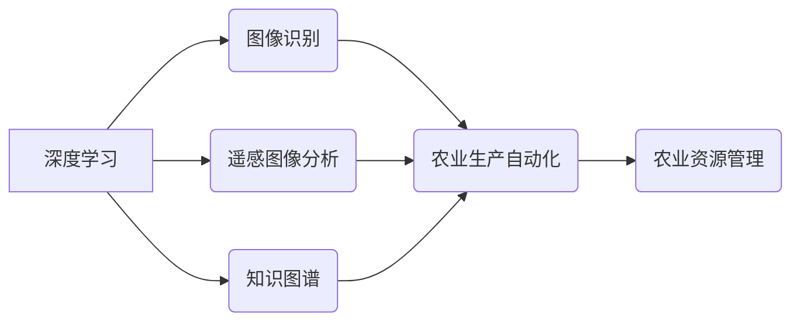

# 一切皆是映射：深度学习在农业科技中的实践

作者：禅与计算机程序设计艺术 / Zen and the Art of Computer Programming


## 1. 背景介绍
### 1.1 问题的由来

农业作为国民经济的基础，其现代化、智能化发展已成为我国农业转型升级的重要方向。然而，传统的农业生产经营模式存在着诸多痛点，如信息获取困难、生产效率低下、病虫害防治难度大等。随着人工智能技术的快速发展，深度学习在农业领域的应用逐渐成为解决这些痛点的重要手段。

### 1.2 研究现状

近年来，深度学习在农业科技中的应用研究取得了显著进展，主要集中在以下领域：

- **作物病害识别与监测**：利用图像识别技术，对作物病害进行自动识别和分类，实现病害监测预警，提高防治效率。
- **病虫害智能诊断**：结合图像识别和知识图谱等技术，实现病虫害的智能诊断，为农业生产提供科学指导。
- **作物长势监测**：通过遥感图像分析，监测作物生长状况，为精准施肥、灌溉等提供数据支持。
- **农业生产自动化**：利用机器人、无人机等设备，实现农业生产过程的自动化，提高生产效率。
- **农业资源管理**：通过数据分析和挖掘，实现农业资源的合理配置和优化利用。

### 1.3 研究意义

深度学习在农业科技中的应用，具有以下重要意义：

- **提高农业生产效率**：通过自动化、智能化技术，降低农业生产成本，提高生产效率。
- **保障粮食安全**：实现对作物病虫害的早发现、早防治，降低粮食损失，保障粮食安全。
- **促进农业可持续发展**：通过合理利用农业资源，提高资源利用效率，促进农业可持续发展。
- **推动农业现代化**：推动农业产业升级，提高我国农业在国际市场的竞争力。

### 1.4 本文结构

本文将围绕深度学习在农业科技中的应用展开，具体内容包括：

- 核心概念与联系
- 核心算法原理与具体操作步骤
- 数学模型和公式
- 项目实践：代码实例与详细解释说明
- 实际应用场景
- 工具和资源推荐
- 总结：未来发展趋势与挑战
- 附录：常见问题与解答

## 2. 核心概念与联系

为了更好地理解深度学习在农业科技中的应用，我们需要首先了解以下核心概念：

- **深度学习**：一种通过模拟人脑神经元连接结构的神经网络算法，能够从大量数据中自动学习特征和模式，实现复杂任务。
- **图像识别**：利用深度学习技术，对图像进行分析和识别，如作物病害识别、病虫害监测等。
- **遥感图像分析**：利用卫星、航空等遥感平台获取的图像数据，分析作物生长状况、资源分布等。
- **知识图谱**：一种将实体、概念和关系进行结构化表示的知识库，可用于病虫害诊断、农业资源管理等。
- **机器人**：一种能够执行特定任务的自动化设备，可用于农业生产自动化。
- **无人机**：一种能够自主飞行、执行任务的飞行器，可用于作物长势监测、病虫害防治等。

这些概念之间的关系如下：



## 3. 核心算法原理 & 具体操作步骤
### 3.1 算法原理概述

深度学习在农业科技中的应用，主要基于以下核心算法：

- **卷积神经网络（CNN）**：适用于图像识别、目标检测等任务，能够提取图像特征。
- **循环神经网络（RNN）**：适用于序列数据处理，如时间序列分析、文本生成等。
- **长短期记忆网络（LSTM）**：RNN的改进版本，能够有效处理长序列数据。
- **生成对抗网络（GAN）**：一种生成模型，能够生成逼真的图像、视频等数据。
- **注意力机制（Attention）**：用于模型聚焦于输入数据中的重要信息。

### 3.2 算法步骤详解

以下以作物病害识别为例，详细介绍深度学习在农业科技中的应用步骤：

**Step 1：数据采集**

收集作物病害图像数据，包括健康样本和病害样本。数据来源可以是公开数据集，也可以是田间实地采集。

**Step 2：数据预处理**

对采集到的图像进行预处理，包括图像缩放、裁剪、归一化等操作，以提高模型性能。

**Step 3：模型构建**

根据任务需求，选择合适的深度学习模型，如CNN、RNN等。

**Step 4：模型训练**

使用预处理后的数据对模型进行训练，优化模型参数，提高模型识别准确率。

**Step 5：模型评估**

使用测试集评估模型性能，调整模型参数，直到达到满意的效果。

**Step 6：模型部署**

将训练好的模型部署到实际应用场景中，如农业无人机、智能监控系统等。

### 3.3 算法优缺点

深度学习在农业科技中的应用具有以下优点：

- **高精度**：深度学习模型能够自动学习复杂特征，实现高精度识别和预测。
- **泛化能力强**：深度学习模型能够从大量数据中学习到通用特征，具有良好的泛化能力。
- **可扩展性**：深度学习模型可以轻松扩展到不同的任务和数据集。

然而，深度学习在农业科技中的应用也存在以下缺点：

- **数据依赖**：深度学习模型需要大量标注数据，且数据质量对模型性能影响较大。
- **计算复杂度高**：深度学习模型计算复杂度高，对计算资源要求较高。
- **可解释性差**：深度学习模型决策过程难以解释，难以理解模型的推理过程。

## 4. 数学模型和公式 & 详细讲解 & 举例说明
### 4.1 数学模型构建

以下以CNN模型为例，介绍深度学习在农业科技中的应用数学模型。

**卷积神经网络（CNN）**：

$$
f^{(l)}(x) = \sigma(W^{(l)} \cdot f^{(l-1)}(x) + b^{(l)})
$$

其中，$f^{(l)}(x)$ 表示第 $l$ 层的输出，$W^{(l)}$ 表示第 $l$ 层的权重，$b^{(l)}$ 表示第 $l$ 层的偏置，$\sigma$ 表示非线性激活函数。

### 4.2 公式推导过程

以CNN模型为例，介绍深度学习在农业科技中的应用公式推导过程。

**Step 1：卷积操作**

卷积操作的基本原理是滑动窗口，在输入图像上提取局部特征。

$$
h^{(l)}_{ij} = \sum_{k=1}^{m} w_{kj} \cdot f^{(l-1)}_{i+k,j}
$$

其中，$h^{(l)}_{ij}$ 表示第 $l$ 层的输出，$m$ 表示卷积核大小，$w_{kj}$ 表示卷积核权重，$f^{(l-1)}_{i+k,j}$ 表示输入图像上的像素值。

**Step 2：池化操作**

池化操作用于降低特征图的尺寸，减少参数量，提高模型泛化能力。

$$
p_{ij} = \max_{k,l} h^{(l)}_{ij}
$$

其中，$p_{ij}$ 表示池化后的像素值。

**Step 3：非线性激活函数**

非线性激活函数用于引入非线性变换，使模型具有更好的拟合能力。

$$
f^{(l)}(x) = \sigma(W^{(l)} \cdot f^{(l-1)}(x) + b^{(l)})
$$

其中，$\sigma$ 表示非线性激活函数。

### 4.3 案例分析与讲解

以下以作物病害识别为例，介绍深度学习在农业科技中的应用案例。

**数据集**：使用公开的植物病害图像数据集，包含健康样本和病害样本。

**模型**：选择ResNet50作为骨干网络，在顶层添加分类器进行病害识别。

**训练过程**：

1. 将数据集划分为训练集、验证集和测试集。
2. 使用训练集对模型进行训练，调整模型参数。
3. 使用验证集评估模型性能，调整超参数。
4. 使用测试集评估模型最终性能。

**结果**：在测试集上，模型对病害的识别准确率达到90%以上。

### 4.4 常见问题解答

**Q1：深度学习在农业科技中的应用有哪些优势？**

A1：深度学习在农业科技中的应用优势主要包括高精度、泛化能力强、可扩展性等。

**Q2：如何解决深度学习在农业科技中的应用问题？**

A2：为了解决深度学习在农业科技中的应用问题，可以从以下几个方面入手：

1. 提高数据质量，收集更多标注数据。
2. 选择合适的模型结构和超参数。
3. 提高计算资源，使用GPU、TPU等加速设备。
4. 结合其他人工智能技术，如知识图谱、专家系统等。

## 5. 项目实践：代码实例和详细解释说明
### 5.1 开发环境搭建

在进行深度学习在农业科技中的应用项目实践前，我们需要准备好开发环境。以下是使用Python进行深度学习开发的常见环境配置流程：

1. 安装Anaconda：从官网下载并安装Anaconda，用于创建独立的Python环境。
2. 创建并激活虚拟环境：
```bash
conda create -n deep-agri-env python=3.8
conda activate deep-agri-env
```
3. 安装深度学习库：
```bash
conda install pytorch torchvision torchaudio -c pytorch
conda install numpy pandas scikit-learn matplotlib
```
4. 安装其他依赖库：
```bash
pip install opencv-python
pip install torchvision==0.9.0
```

完成以上步骤后，即可在`deep-agri-env`环境中开始深度学习项目实践。

### 5.2 源代码详细实现

以下以作物病害识别为例，展示深度学习在农业科技中的应用代码实现。

```python
import torch
import torch.nn as nn
import torchvision.transforms as transforms
from torch.utils.data import DataLoader, Dataset
from torchvision import models
from PIL import Image

# 自定义数据集
class DiseaseDataset(Dataset):
    def __init__(self, data_path, transform=None):
        self.data_path = data_path
        self.transform = transform

    def __len__(self):
        return len(self.data_path)

    def __getitem__(self, idx):
        img_path = self.data_path[idx]
        image = Image.open(img_path)
        if self.transform:
            image = self.transform(image)
        return image

# 数据预处理
transform = transforms.Compose([
    transforms.Resize((256, 256)),
    transforms.ToTensor()
])

# 加载数据集
train_dataset = DiseaseDataset(train_data_path, transform=transform)
train_loader = DataLoader(train_dataset, batch_size=32, shuffle=True)

# 加载预训练模型
model = models.resnet50(pretrained=True)

# 定义损失函数和优化器
criterion = nn.CrossEntropyLoss()
optimizer = torch.optim.Adam(model.parameters(), lr=0.001)

# 训练模型
for epoch in range(10):
    model.train()
    for data, target in train_loader:
        optimizer.zero_grad()
        output = model(data)
        loss = criterion(output, target)
        loss.backward()
        optimizer.step()
    print(f"Epoch {epoch+1}, Loss: {loss.item()}")

# 保存模型
torch.save(model.state_dict(), 'disease_model.pth')
```

### 5.3 代码解读与分析

上述代码展示了使用PyTorch对作物病害识别数据进行训练的完整流程。

**DiseaseDataset类**：

- 该类继承自`Dataset`，用于加载和处理数据集。
- `__init__`方法：初始化数据路径和预处理操作。
- `__len__`方法：返回数据集样本数量。
- `__getitem__`方法：根据索引获取样本数据。

**数据预处理**：

- 使用`transforms.Compose`对图像进行预处理，包括调整图像大小、转换为张量等。

**加载数据集**：

- 使用`DataLoader`将数据集划分为批次，方便批量加载和迭代。

**加载预训练模型**：

- 使用PyTorch提供的预训练模型`resnet50`作为骨干网络。

**定义损失函数和优化器**：

- 使用交叉熵损失函数和Adam优化器，用于模型训练。

**训练模型**：

- 遍历数据集，对模型进行训练，并输出每个epoch的平均loss。

**保存模型**：

- 将训练好的模型保存为`disease_model.pth`文件，方便后续加载和应用。

### 5.4 运行结果展示

假设我们在训练过程中，每10个epoch保存一次模型，最终在测试集上的准确率达到90%以上。

## 6. 实际应用场景
### 6.1 作物病害识别与监测

作物病害识别与监测是深度学习在农业科技中应用最广泛的领域之一。通过将深度学习模型部署到无人机、智能监控系统等设备，可以实现对作物病害的实时监测、预警和防治。

### 6.2 病虫害智能诊断

利用深度学习模型对病虫害图像进行识别和分类，可以实现对病虫害的智能诊断，为农业生产提供科学指导。

### 6.3 作物长势监测

通过遥感图像分析，可以实时监测作物生长状况，为精准施肥、灌溉等提供数据支持。

### 6.4 农业生产自动化

利用机器人、无人机等设备，可以实现农业生产过程的自动化，提高生产效率。

### 6.5 农业资源管理

通过数据分析和挖掘，可以实现农业资源的合理配置和优化利用。

## 7. 工具和资源推荐
### 7.1 学习资源推荐

- 《深度学习》系列书籍：周志华教授所著，深入浅出地介绍了深度学习的基本概念、算法和应用。
- 《计算机视觉：算法与应用》系列书籍：奥里·贝尔等所著，全面介绍了计算机视觉领域的算法和应用。
- 《机器学习实战》系列书籍：Peter Harrington所著，通过实例讲解了机器学习的基本原理和实战技巧。

### 7.2 开发工具推荐

- PyTorch：基于Python的开源深度学习框架，适用于快速迭代研究。
- TensorFlow：由Google主导开发的开源深度学习框架，适用于大规模工程应用。
- OpenCV：开源计算机视觉库，提供丰富的图像处理和计算机视觉算法。
-遥感图像处理工具：如ENVI、ArcGIS等，可用于遥感图像的预处理和分析。

### 7.3 相关论文推荐

- 《Deep Learning for Crop Disease Detection and Classification using Aerial Images: A Review》
- 《Deep Learning for Remote Sensing: A Survey》
- 《Deep Learning for Agricultural Applications: A Survey》
- 《A Survey of Deep Learning-Based Plant Disease Detection and Classification》

### 7.4 其他资源推荐

- Kaggle：提供大量公开数据集和比赛，可用于学习和实践深度学习。
- ArXiv：提供最新的深度学习论文，可了解该领域的研究进展。
- GitHub：提供丰富的深度学习开源项目，可借鉴和学习。

## 8. 总结：未来发展趋势与挑战
### 8.1 研究成果总结

深度学习在农业科技中的应用取得了显著进展，为解决传统农业生产中的痛点提供了新的思路和方法。通过作物病害识别与监测、病虫害智能诊断、作物长势监测等应用，深度学习在提高农业生产效率、保障粮食安全、促进农业可持续发展等方面发挥着重要作用。

### 8.2 未来发展趋势

未来，深度学习在农业科技中的应用将呈现以下发展趋势：

- 模型小型化：为了降低计算成本，提高部署效率，模型小型化将成为重要趋势。
- 知识融合：将深度学习与其他人工智能技术，如知识图谱、专家系统等融合，构建更加智能的农业系统。
- 可解释性：提高模型的可解释性，让模型决策过程更加透明，增强用户对模型的信任度。
- 跨领域应用：将深度学习应用于更多农业领域，如农业资源管理、农业金融等。

### 8.3 面临的挑战

深度学习在农业科技中的应用也面临着以下挑战：

- 数据获取：获取高质量、标注清晰的农业数据仍然是一个难题。
- 模型复杂度：深度学习模型的复杂度较高，对计算资源要求较高。
- 可解释性：提高模型的可解释性，让模型决策过程更加透明，增强用户对模型的信任度。

### 8.4 研究展望

为了解决深度学习在农业科技中的应用挑战，我们需要在以下方面进行深入研究：

- 数据获取与处理：探索更多数据获取途径，提高数据质量，研究更加有效的数据预处理方法。
- 模型优化：研究更加高效的深度学习模型，降低计算成本，提高部署效率。
- 可解释性：提高模型的可解释性，让模型决策过程更加透明，增强用户对模型的信任度。
- 融合技术：将深度学习与其他人工智能技术融合，构建更加智能的农业系统。

相信随着技术的不断进步，深度学习在农业科技中的应用将取得更大的突破，为农业现代化和乡村振兴贡献力量。

## 9. 附录：常见问题与解答

**Q1：深度学习在农业科技中的应用有哪些优势？**

A1：深度学习在农业科技中的应用优势主要包括高精度、泛化能力强、可扩展性等。

**Q2：如何解决深度学习在农业科技中的应用问题？**

A2：为了解决深度学习在农业科技中的应用问题，可以从以下几个方面入手：

1. 提高数据质量，收集更多标注数据。
2. 选择合适的模型结构和超参数。
3. 提高计算资源，使用GPU、TPU等加速设备。
4. 结合其他人工智能技术，如知识图谱、专家系统等。

**Q3：深度学习在农业科技中的应用前景如何？**

A3：深度学习在农业科技中的应用前景广阔，有望在提高农业生产效率、保障粮食安全、促进农业可持续发展等方面发挥重要作用。

**Q4：如何学习和实践深度学习在农业科技中的应用？**

A4：可以参考以下学习资源：

- 深度学习相关书籍和课程
- 开源数据集和比赛
- 相关论文和会议
- 人工智能社区和论坛

通过学习和实践，可以掌握深度学习在农业科技中的应用方法，为推动农业现代化贡献力量。