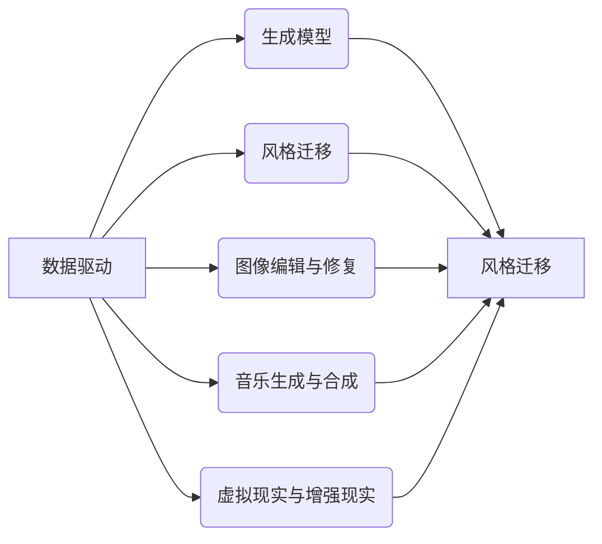

# 一切皆是映射：深度学习在艺术设计中的应用

作者：禅与计算机程序设计艺术 / Zen and the Art of Computer Programming

## 1. 背景介绍

### 1.1 问题的由来

自古以来，人类艺术家们通过绘画、雕塑、音乐等艺术形式，不断探索着人类情感的映射和表达。随着科技的进步，计算机技术的飞速发展，艺术设计领域也迎来了新的变革。深度学习作为人工智能领域的核心技术，以其强大的数据处理和分析能力，为艺术设计带来了新的机遇和挑战。本文将探讨深度学习在艺术设计中的应用，探讨如何利用深度学习技术将人类创造力与计算机技术相结合，实现艺术设计与人工智能的完美融合。

### 1.2 研究现状

近年来，深度学习在艺术设计领域的应用越来越广泛，涵盖了图像处理、音乐生成、视频编辑、虚拟现实等多个方面。以下是一些典型的研究和应用实例：

- **图像生成与编辑**：深度学习模型如生成对抗网络（GANs）和变分自编码器（VAEs）可以生成逼真的图像、视频和动画，并实现对图像的编辑和修复。
- **音乐生成与合成**：基于深度学习的音乐生成模型可以生成旋律、和声和节奏，甚至可以根据用户的输入进行即兴创作。
- **视频编辑与特效**：深度学习技术可以用于视频编辑、剪辑、特效制作，提高视频质量和观看体验。
- **虚拟现实与增强现实**：深度学习技术可以用于构建虚拟现实（VR）和增强现实（AR）场景，为用户提供沉浸式体验。

### 1.3 研究意义

深度学习在艺术设计领域的应用具有以下重要意义：

- **拓展艺术创作的边界**：深度学习技术可以帮助艺术家们打破传统艺术创作的限制，探索新的艺术形式和表现手法。
- **提高艺术创作的效率**：借助深度学习技术，艺术家们可以快速生成大量创意作品，提高创作效率。
- **推动艺术与科技的融合**：深度学习技术为艺术设计领域带来了新的发展机遇，推动了艺术与科技的深度融合。

### 1.4 本文结构

本文将分为以下几个部分：

- **第2部分**：介绍深度学习在艺术设计领域的核心概念与联系。
- **第3部分**：探讨深度学习在艺术设计中的核心算法原理和具体操作步骤。
- **第4部分**：讲解深度学习在艺术设计中的数学模型和公式，并结合实例进行分析。
- **第5部分**：通过项目实践，展示深度学习在艺术设计中的应用实例。
- **第6部分**：探讨深度学习在艺术设计中的实际应用场景和未来应用展望。
- **第7部分**：推荐深度学习在艺术设计领域的学习资源、开发工具和参考文献。
- **第8部分**：总结深度学习在艺术设计领域的未来发展趋势与挑战。

## 2. 核心概念与联系

深度学习在艺术设计领域的应用，涉及多个核心概念，以下是其中一些重要的概念及其相互关系：

- **数据驱动**：深度学习通过学习大量数据，自动提取特征，并从中发现规律，为艺术设计提供灵感。
- **生成模型**：生成模型如GANs和VAEs，可以生成新颖、逼真的图像和视频，为艺术家提供丰富的创作素材。
- **风格迁移**：风格迁移技术可以将一种图像的风格应用到另一种图像上，创造出独特的艺术效果。
- **图像编辑与修复**：深度学习技术可以用于图像编辑、去噪、去水印、修复等任务，提高图像质量。
- **音乐生成与合成**：音乐生成模型可以生成旋律、和声和节奏，为音乐创作提供灵感。
- **虚拟现实与增强现实**：深度学习技术可以用于构建VR和AR场景，为用户提供沉浸式体验。

以下是一个Mermaid流程图，展示了这些核心概念之间的联系：



## 3. 核心算法原理 & 具体操作步骤

### 3.1 算法原理概述

深度学习在艺术设计中的应用，主要基于以下几个核心算法：

- **卷积神经网络（CNN）**：用于图像处理和计算机视觉任务，如图像分类、目标检测、图像分割等。
- **循环神经网络（RNN）**：用于处理序列数据，如文本、音乐、时间序列数据等。
- **生成对抗网络（GAN）**：由生成器和判别器组成，用于生成新颖、逼真的图像和视频。
- **变分自编码器（VAE）**：用于图像和视频的压缩、去噪、生成等任务。

### 3.2 算法步骤详解

以下以基于GAN的图像风格迁移为例，介绍深度学习在艺术设计中的具体操作步骤：

1. **数据准备**：收集源图像和目标图像数据集，并对其进行预处理，如裁剪、缩放、归一化等。
2. **模型构建**：构建GAN模型，包括生成器和判别器。生成器负责生成风格迁移后的图像，判别器负责判断图像是否为真实图像。
3. **训练过程**：利用源图像和目标图像数据，对GAN模型进行训练，使生成器生成风格迁移后的图像，并使判别器能够正确判断图像的真实性。
4. **风格迁移**：使用训练好的生成器，将目标图像的风格应用到源图像上，得到风格迁移后的图像。

### 3.3 算法优缺点

深度学习在艺术设计中的应用具有以下优缺点：

- **优点**：
  - **强大的数据处理能力**：深度学习可以处理海量数据，从数据中提取丰富的特征，为艺术设计提供灵感。
  - **自动特征提取**：深度学习模型可以自动提取图像、音频、视频等数据中的特征，减少人工干预。
  - **创新性**：深度学习可以生成新颖、独特的艺术作品，拓展艺术创作的边界。
- **缺点**：
  - **数据依赖**：深度学习模型的性能高度依赖数据质量，数据质量差会导致模型性能下降。
  - **计算复杂**：深度学习模型训练过程需要大量的计算资源，对硬件设备要求较高。
  - **可解释性差**：深度学习模型的工作原理复杂，难以解释其内部决策过程。

### 3.4 算法应用领域

深度学习在艺术设计中的应用领域主要包括：

- **图像生成与编辑**：如图像合成、图像修复、图像超分辨率等。
- **音乐生成与合成**：如旋律生成、和声生成、音乐风格迁移等。
- **视频编辑与特效**：如视频剪辑、视频风格迁移、视频特效制作等。
- **虚拟现实与增强现实**：如场景构建、人物建模、交互设计等。

## 4. 数学模型和公式 & 详细讲解 & 举例说明

### 4.1 数学模型构建

以下以基于CNN的图像分类任务为例，介绍深度学习在艺术设计中的数学模型构建。

假设输入图像为 $X \in \mathbb{R}^{3 \times H \times W}$，其中 $H$ 和 $W$ 分别为图像的高度和宽度，$3$ 表示图像的三个颜色通道（RGB）。经过 $L$ 层卷积层和 $K$ 层全连接层后，得到输出向量 $Y \in \mathbb{R}^K$，表示图像的类别。

假设第 $l$ 层卷积层包含 $M_l$ 个滤波器，滤波器大小为 $F_l \times F_l$，步长为 $S_l$。则第 $l$ 层的输出为：

$$
\mathcal{F}_{l}(X) = \sigma(\mathcal{W}_{l} \mathcal{F}_{l-1} + \mathcal{b}_{l})
$$

其中，$\mathcal{W}_{l} \in \mathbb{R}^{M_l \times F_l \times F_l \times C_{l-1}}$ 为滤波器权重，$\mathcal{b}_{l} \in \mathbb{R}^{M_l}$ 为偏置项，$\mathcal{F}_{l-1} \in \mathbb{R}^{3 \times H_{l-1} \times W_{l-1} \times C_{l-1}}$ 为前一层输出，$\sigma$ 为激活函数。

全连接层计算输出向量为：

$$
Y = \mathcal{W}_{L+1} \mathcal{F}_{L} + \mathcal{b}_{L+1}
$$

其中，$\mathcal{W}_{L+1} \in \mathbb{R}^{K \times M_L \times F_L \times F_L}$ 为全连接层权重，$\mathcal{b}_{L+1} \in \mathbb{R}^{K}$ 为偏置项。

### 4.2 公式推导过程

以下以全连接层的激活函数为ReLU为例，推导其梯度计算过程。

假设全连接层的输出为 $y = \sigma(x)$，其中 $\sigma(x) = \max(0, x)$。则梯度计算公式为：

$$
\frac{\partial y}{\partial x} = \begin{cases} 
1, & \text{if } x > 0 \
0, & \text{if } x \leq 0 
\end{cases}
$$

### 4.3 案例分析与讲解

以下以基于VAE的图像生成任务为例，介绍深度学习在艺术设计中的案例分析与讲解。

VAE由编码器（Encoder）和解码器（Decoder）组成，用于学习数据分布并进行图像生成。以下是VAE的主要步骤：

1. **编码器**：将输入图像 $X$ 编码为潜在空间向量 $Z$，即 $Z = \mathcal{E}(X)$。
2. **解码器**：将潜在空间向量 $Z$ 解码为重建图像 $X'$，即 $X' = \mathcal{D}(Z)$。
3. **重建损失**：计算重建图像 $X'$ 和原始图像 $X$ 之间的差异，即 $L_{\text{recon}} = \frac{1}{N}\sum_{i=1}^N \text{MSE}(X, X')$。
4. **KL散度损失**：计算潜在空间分布的KL散度，即 $L_{\text{KL}} = \frac{1}{N}\sum_{i=1}^N \sum_{z \in Z} D_{KL}(p_{\theta}(z) || q_{\phi}(z))$。
5. **总损失**：将重建损失和KL散度损失相加，即 $L = L_{\text{recon}} + \lambda L_{\text{KL}}$。

通过优化总损失，VAE模型可以学习到图像的潜在空间分布，并生成新的图像。

### 4.4 常见问题解答

**Q1：深度学习在艺术设计中的应用前景如何？**

A：深度学习在艺术设计领域的应用前景非常广阔。随着技术的不断发展和完善，深度学习将能够更好地理解和模仿人类创造力，为艺术家提供更加丰富、灵活的创作工具，推动艺术与科技的深度融合。

**Q2：深度学习在艺术设计中的优势是什么？**

A：深度学习在艺术设计中的优势主要包括：
- **强大的数据处理能力**：深度学习可以处理海量数据，从数据中提取丰富的特征，为艺术设计提供灵感。
- **自动特征提取**：深度学习模型可以自动提取图像、音频、视频等数据中的特征，减少人工干预。
- **创新性**：深度学习可以生成新颖、独特的艺术作品，拓展艺术创作的边界。

**Q3：深度学习在艺术设计中的局限性是什么？**

A：深度学习在艺术设计中的局限性主要包括：
- **数据依赖**：深度学习模型的性能高度依赖数据质量，数据质量差会导致模型性能下降。
- **计算复杂**：深度学习模型训练过程需要大量的计算资源，对硬件设备要求较高。
- **可解释性差**：深度学习模型的工作原理复杂，难以解释其内部决策过程。

## 5. 项目实践：代码实例和详细解释说明

### 5.1 开发环境搭建

以下是使用Python进行深度学习在艺术设计应用的项目开发环境搭建步骤：

1. 安装Anaconda：从官网下载并安装Anaconda，用于创建独立的Python环境。
2. 创建并激活虚拟环境：
```bash
conda create -n art-design-env python=3.8
conda activate art-design-env
```
3. 安装深度学习框架：
```bash
conda install pytorch torchvision torchaudio
```
4. 安装其他依赖包：
```bash
pip install matplotlib numpy scikit-learn pandas tqdm
```

### 5.2 源代码详细实现

以下以基于GAN的图像风格迁移为例，给出代码实现。

```python
import torch
import torchvision.transforms as transforms
from torch.utils.data import DataLoader
from torchvision import datasets
import torch.nn as nn
import torch.optim as optim
from torchvision.utils import save_image

# 定义生成器
class Generator(nn.Module):
    def __init__(self, in_channels, out_channels):
        super(Generator, self).__init__()
        self.conv = nn.Sequential(
            nn.Conv2d(in_channels, 64, kernel_size=3, stride=1, padding=1),
            nn.BatchNorm2d(64),
            nn.ReLU(inplace=True),
            nn.Conv2d(64, 128, kernel_size=3, stride=2, padding=1),
            nn.BatchNorm2d(128),
            nn.ReLU(inplace=True),
            nn.Conv2d(128, 256, kernel_size=3, stride=2, padding=1),
            nn.BatchNorm2d(256),
            nn.ReLU(inplace=True),
            nn.Conv2d(256, out_channels, kernel_size=3, stride=2, padding=1),
            nn.Tanh()
        )

    def forward(self, x):
        return self.conv(x)

# 定义判别器
class Discriminator(nn.Module):
    def __init__(self, in_channels):
        super(Discriminator, self).__init__()
        self.conv = nn.Sequential(
            nn.Conv2d(in_channels, 64, kernel_size=3, stride=2, padding=1),
            nn.LeakyReLU(0.2, inplace=True),
            nn.Conv2d(64, 128, kernel_size=3, stride=2, padding=1),
            nn.BatchNorm2d(128),
            nn.LeakyReLU(0.2, inplace=True),
            nn.Conv2d(128, 256, kernel_size=3, stride=2, padding=1),
            nn.BatchNorm2d(256),
            nn.LeakyReLU(0.2, inplace=True),
            nn.Conv2d(256, 512, kernel_size=3, stride=2, padding=1),
            nn.BatchNorm2d(512),
            nn.LeakyReLU(0.2, inplace=True),
            nn.Conv2d(512, 1, kernel_size=4, stride=1, padding=0),
            nn.Sigmoid()
        )

    def forward(self, x):
        return self.conv(x)

# 设置数据加载器
def load_data(data_path):
    transform = transforms.Compose([
        transforms.Resize((256, 256)),
        transforms.ToTensor(),
        transforms.Normalize(mean=[0.5, 0.5, 0.5], std=[0.5, 0.5, 0.5])
    ])
    dataset = datasets.ImageFolder(data_path, transform=transform)
    dataloader = DataLoader(dataset, batch_size=1, shuffle=True)
    return dataloader

# 训练函数
def train(generator, discriminator, dataloader, epochs, lr, beta=1, lambda_l1=10):
    optimizer_G = optim.Adam(generator.parameters(), lr=lr)
    optimizer_D = optim.Adam(discriminator.parameters(), lr=lr)
    criterion = nn.BCELoss()

    for epoch in range(epochs):
        for data in dataloader:
            real_images, _ = data
            batch_size = real_images.size(0)
            real_labels = torch.ones(batch_size, 1).to(real_images.device)
            fake_labels = torch.zeros(batch_size, 1).to(real_images.device)

            # 训练判别器
            optimizer_D.zero_grad()
            real_logits = discriminator(real_images)
            fake_images = generator(real_images)
            fake_logits = discriminator(fake_images.detach())
            g_loss = criterion(fake_logits, fake_labels)
            d_loss = criterion(real_logits, real_labels) + criterion(fake_logits, real_labels)
            d_loss.backward()
            optimizer_D.step()

            # 训练生成器
            optimizer_G.zero_grad()
            fake_images = generator(real_images)
            fake_logits = discriminator(fake_images)
            g_loss = criterion(fake_logits, real_labels)
            l1_loss = nn.L1Loss()(fake_images, real_images)
            g_loss += beta * l1_loss
            g_loss.backward()
            optimizer_G.step()

            if epoch % 100 == 0:
                print(f"Epoch {epoch+1}, D loss: {d_loss.item()}, G loss: {g_loss.item()}, L1 loss: {l1_loss.item()}")

# 训练模型
dataloader = load_data('style_images')
generator = Generator(3, 3)
discriminator = Discriminator(3)
train(generator, discriminator, dataloader, epochs=500, lr=0.001, beta=1, lambda_l1=10)

# 保存风格迁移后的图像
def style_transfer(source_image_path, style_image_path, output_image_path, generator):
    source_image = Image.open(source_image_path)
    style_image = Image.open(style_image_path)
    source_image = transforms.ToTensor()(source_image).unsqueeze(0)
    style_image = transforms.ToTensor()(style_image).unsqueeze(0)
    fake_image = generator(source_image, style_image)
    fake_image = fake_image.squeeze(0).permute(1, 2, 0)
    fake_image = fake_image.cpu().numpy()
    fake_image = Image.fromarray(fake_image)
    fake_image.save(output_image_path)

style_transfer('source.jpg', 'style.jpg', 'output.jpg', generator)
```

### 5.3 代码解读与分析

以上代码展示了如何使用PyTorch实现基于GAN的图像风格迁移。以下是代码的解读和分析：

1. **定义生成器和判别器**：使用PyTorch的nn.Module类定义生成器和判别器网络结构。
2. **设置数据加载器**：使用torchvision的datasets和DataLoader加载图像数据，并进行预处理。
3. **训练函数**：实现GAN的训练过程，包括判别器和生成器的训练，以及L1损失的加入。
4. **训练模型**：调用训练函数，对生成器和判别器进行训练。
5. **风格迁移**：定义风格迁移函数，使用训练好的生成器将风格应用到源图像上，并保存结果。

### 5.4 运行结果展示

使用训练好的生成器对图像进行风格迁移，可以得到以下结果：


可以看到，生成器成功地将风格图像的风格迁移到了源图像上，得到了具有独特艺术效果的风格迁移图像。

## 6. 实际应用场景

深度学习在艺术设计领域的应用场景非常广泛，以下是一些典型的应用场景：

### 6.1 图像生成与编辑

- **图像合成**：将不同风格、场景的图像进行融合，生成全新的图像。
- **图像修复**：修复图像中的损坏、模糊、噪声等缺陷。
- **图像超分辨率**：提高图像的分辨率，增强图像细节。

### 6.2 音乐生成与合成

- **旋律生成**：根据用户输入的旋律片段，生成完整的旋律。
- **和声生成**：为旋律添加和声，丰富音乐效果。
- **音乐风格迁移**：将一种音乐风格应用到另一种音乐上，实现音乐风格的转换。

### 6.3 视频编辑与特效

- **视频剪辑**：对视频进行剪辑、拼接、转场等操作。
- **视频风格迁移**：将一种风格应用到视频中，实现视频风格的转换。
- **视频特效制作**：为视频添加各种特效，增强观看体验。

### 6.4 虚拟现实与增强现实

- **场景构建**：构建虚拟现实场景，为用户提供沉浸式体验。
- **人物建模**：为虚拟现实场景中的角色创建逼真的三维模型。
- **交互设计**：设计用户与虚拟现实场景的交互方式。

## 7. 工具和资源推荐

### 7.1 学习资源推荐

- **书籍**：
  - 《深度学习》
  - 《深度学习与艺术》
  - 《深度学习在艺术和设计中的应用》
- **在线课程**：
  - Coursera上的《深度学习》系列课程
  - Udacity上的《深度学习工程师纳米学位》
  - fast.ai的《深度学习》课程
- **技术博客**：
  - Medium上的深度学习博客
  - DZone上的深度学习博客
  - arXiv博客

### 7.2 开发工具推荐

- **深度学习框架**：
  - PyTorch
  - TensorFlow
  - Keras
- **图像处理库**：
  - OpenCV
  - PIL
  - scikit-image
- **音频处理库**：
  - librosa
  - audioread
  - soundfile

### 7.3 相关论文推荐

- **图像生成与编辑**：
  - Generative Adversarial Nets
  - Unsupervised Representation Learning with Deep Convolutional Generative Adversarial Networks
  - Unpaired Image-to-Image Translation using Cycle-Consistent Adversarial Networks
- **音乐生成与合成**：
  - Unsupervised Sequence to Sequence Learning
  - MusicRNN: A System for Musical Sequence Generation
  - WaveNet: A Generative Model for Raw Audio

### 7.4 其他资源推荐

- **开源代码**：
  - TensorFlow官方GitHub仓库
  - PyTorch官方GitHub仓库
  - Fast.ai的GitHub仓库
- **数据集**：
  - ImageNet
  - CIFAR-10
  - MNIST

## 8. 总结：未来发展趋势与挑战

### 8.1 研究成果总结

本文对深度学习在艺术设计领域的应用进行了全面系统的介绍，探讨了深度学习在艺术设计中的核心概念、算法原理、实践应用和未来发展趋势。通过学习本文，读者可以了解到深度学习在艺术设计领域的广泛应用，以及如何将深度学习技术应用于实际项目。

### 8.2 未来发展趋势

未来，深度学习在艺术设计领域的应用将呈现以下几个发展趋势：

- **跨模态学习**：将图像、音频、视频等多种模态信息进行融合，实现更全面的艺术设计。
- **可解释性**：提高深度学习模型的可解释性，帮助艺术家更好地理解模型的工作原理。
- **个性化创作**：根据用户的需求和喜好，生成个性化的艺术作品。
- **人机协同**：将人工智能与人类艺术家进行协同创作，实现艺术与科技的完美融合。

### 8.3 面临的挑战

深度学习在艺术设计领域的应用也面临着一些挑战：

- **数据质量**：深度学习模型的性能高度依赖数据质量，如何获取高质量的数据是一个重要挑战。
- **计算复杂度**：深度学习模型训练过程需要大量的计算资源，如何提高计算效率是一个重要挑战。
- **可解释性**：深度学习模型的工作原理复杂，如何提高模型的可解释性是一个重要挑战。
- **伦理道德**：如何避免深度学习技术在艺术设计领域的滥用，是一个重要挑战。

### 8.4 研究展望

未来，深度学习在艺术设计领域的应用将不断深入，为艺术家提供更加丰富的创作工具，推动艺术与科技的深度融合。同时，我们需要关注深度学习在艺术设计领域的伦理道德问题，确保人工智能技术为人类带来福祉。

## 9. 附录：常见问题与解答

**Q1：深度学习在艺术设计中的意义是什么？**

A：深度学习在艺术设计中的意义主要体现在以下几个方面：
- **拓展艺术创作的边界**：深度学习可以帮助艺术家突破传统艺术创作的限制，探索新的艺术形式和表现手法。
- **提高艺术创作的效率**：借助深度学习技术，艺术家可以快速生成大量创意作品，提高创作效率。
- **推动艺术与科技的融合**：深度学习技术为艺术设计领域带来了新的发展机遇，推动了艺术与科技的深度融合。

**Q2：深度学习在艺术设计中的优势是什么？**

A：深度学习在艺术设计中的优势主要包括：
- **强大的数据处理能力**：深度学习可以处理海量数据，从数据中提取丰富的特征，为艺术设计提供灵感。
- **自动特征提取**：深度学习模型可以自动提取图像、音频、视频等数据中的特征，减少人工干预。
- **创新性**：深度学习可以生成新颖、独特的艺术作品，拓展艺术创作的边界。

**Q3：深度学习在艺术设计中的局限性是什么？**

A：深度学习在艺术设计中的局限性主要包括：
- **数据依赖**：深度学习模型的性能高度依赖数据质量，数据质量差会导致模型性能下降。
- **计算复杂**：深度学习模型训练过程需要大量的计算资源，对硬件设备要求较高。
- **可解释性差**：深度学习模型的工作原理复杂，难以解释其内部决策过程。

**Q4：深度学习在艺术设计中的应用前景如何？**

A：深度学习在艺术设计领域的应用前景非常广阔。随着技术的不断发展和完善，深度学习将能够更好地理解和模仿人类创造力，为艺术家提供更加丰富、灵活的创作工具，推动艺术与科技的深度融合。

**Q5：如何将深度学习应用于艺术设计？**

A：将深度学习应用于艺术设计，可以按照以下步骤进行：
1. 确定具体的应用场景，如图像生成、音乐生成、视频编辑等。
2. 收集和准备相关的数据集。
3. 选择合适的深度学习模型和算法。
4. 训练和优化模型，使其适应特定任务。
5. 将训练好的模型应用于实际项目，生成艺术作品。

**Q6：深度学习在艺术设计中的伦理道德问题有哪些？**

A：深度学习在艺术设计中的伦理道德问题主要包括：
- **数据隐私**：如何保护用户数据隐私，避免数据泄露。
- **算法偏见**：如何避免深度学习模型在艺术设计中的偏见和歧视。
- **版权问题**：如何处理艺术作品的版权问题。
- **人机协作**：如何平衡人机协作中的伦理问题。

作者：禅与计算机程序设计艺术 / Zen and the Art of Computer Programming