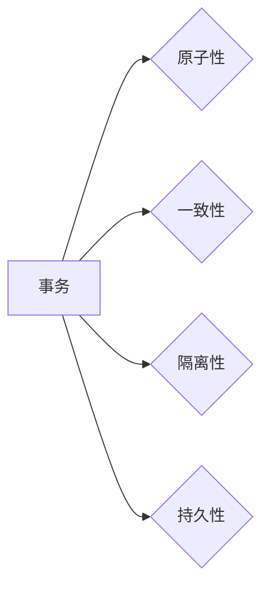

# 事务 原理与代码实例讲解

作者：禅与计算机程序设计艺术 / Zen and the Art of Computer Programming

## 1. 背景介绍

### 1.1 问题的由来

在分布式系统、数据库等领域，数据一致性是一个至关重要的概念。事务是保证数据一致性的重要机制，它确保一系列操作要么全部完成，要么全部不做。本文将深入讲解事务的原理与代码实例，帮助读者理解事务的工作机制和实现方法。

### 1.2 研究现状

事务理论已经发展多年，目前已经成为数据库和分布式系统的基础概念。在数据库领域，ACID（原子性、一致性、隔离性、持久性）是事务的四个基本特性。在分布式系统中，两阶段提交（2PC）和三阶段提交（3PC）是保证数据一致性的常见协议。

### 1.3 研究意义

理解事务的原理对于设计高性能、高可靠性的系统至关重要。本文将帮助读者深入理解事务的机制，从而在实际项目中更好地应用事务，构建稳定可靠的应用系统。

### 1.4 本文结构

本文将按照以下结构进行讲解：

- 第2章介绍事务的核心概念与联系。
- 第3章详细阐述事务的原理和具体操作步骤。
- 第4章介绍事务的数学模型和公式，并结合实例进行讲解。
- 第5章给出事务的代码实例，并对关键代码进行解读和分析。
- 第6章探讨事务在实际应用场景中的应用。
- 第7章推荐事务相关的学习资源、开发工具和参考文献。
- 第8章总结全文，展望事务技术的未来发展趋势与挑战。

## 2. 核心概念与联系

为了更好地理解事务，首先需要了解以下核心概念：

- 事务（Transaction）：一系列操作序列，这些操作要么全部执行成功，要么全部不执行。
- 原子性（Atomicity）：事务中的所有操作要么全部完成，要么全部不做，不存在中间状态。
- 一致性（Consistency）：事务执行后，数据库的状态从一个一致性状态转移到另一个一致性状态。
- 隔离性（Isolation）：并发执行的事务之间相互隔离，一个事务的执行结果不受其他事务的影响。
- 持久性（Durability）：一旦事务提交，其对数据库的改变就永久保存。

这些概念之间的关系可以用以下Mermaid流程图表示：



## 3. 核心算法原理 & 具体操作步骤

### 3.1 算法原理概述

事务的核心原理是保证操作的一致性。在数据库领域，这通常通过ACID特性来实现。在分布式系统领域，则可能需要借助两阶段提交或三阶段提交等协议。

### 3.2 算法步骤详解

以下是一个简化的数据库事务流程：

1. 开启事务：开始执行事务。
2. 执行操作：执行一系列操作，如插入、删除、更新等。
3. 提交事务：如果所有操作都成功，则提交事务，将更改永久保存到数据库。
4. 回滚事务：如果发生错误，则回滚事务，撤销所有操作。

### 3.3 算法优缺点

事务的优点在于保证数据一致性，避免出现数据不一致的情况。但其缺点是可能导致性能下降，因为事务可能需要锁定数据库中的资源。

### 3.4 算法应用领域

事务在以下领域有广泛的应用：

- 数据库：保证数据一致性。
- 分布式系统：保证分布式系统中数据的一致性。
- 并发控制：控制并发执行的事务之间的冲突。

## 4. 数学模型和公式 & 详细讲解 & 举例说明

### 4.1 数学模型构建

事务的数学模型可以表示为以下形式：

$$
T = \{O_1, O_2, \ldots, O_n\}
$$

其中，$T$ 表示事务，$O_i$ 表示事务中的第 $i$ 个操作。

### 4.2 公式推导过程

以下是一个事务的一致性保证公式：

$$
Consistency(T) = \
eg (Consistency(T \setminus \{O_i\}) \wedge Consistency(T \cup \{O_i\}))
$$

其中，$Consistency(T)$ 表示事务 $T$ 的一致性，$T \setminus \{O_i\}$ 表示删除操作 $O_i$ 后的事务，$T \cup \{O_i\}$ 表示添加操作 $O_i$ 后的事务。

### 4.3 案例分析与讲解

假设有一个银行转账事务，包括以下操作：

- A账户金额减去100元。
- B账户金额加上100元。

为了保证转账事务的一致性，需要确保以下条件成立：

- 转账事务执行前，A账户余额大于100元。
- 转账事务执行后，A账户余额减去100元，B账户余额增加100元。

如果其中一个条件不成立，则需要回滚转账事务。

### 4.4 常见问题解答

**Q1：事务与锁的关系是什么？**

A：事务通常需要使用锁来保证隔离性。锁可以防止其他事务同时修改同一数据，从而避免数据不一致的情况。

**Q2：如何选择合适的隔离级别？**

A：隔离级别取决于具体的应用场景。一般来说，较低的隔离级别（如读已提交）可以提高性能，但可能引入幻读、脏读等问题。较高的隔离级别（如串行化）可以保证数据一致性，但会降低并发性能。

## 5. 项目实践：代码实例和详细解释说明

### 5.1 开发环境搭建

为了演示事务，我们可以使用Java语言和H2数据库。首先，需要安装Java开发环境和H2数据库。

### 5.2 源代码详细实现

以下是一个简单的Java代码示例，演示了如何使用H2数据库和事务：

```java
import java.sql.Connection;
import java.sql.DriverManager;
import java.sql.PreparedStatement;
import java.sql.SQLException;

public class TransactionExample {
    public static void main(String[] args) {
        try (Connection conn = DriverManager.getConnection("jdbc:h2:mem:./testdb")) {
            conn.setAutoCommit(false);

            // 插入数据
            String insertSql = "INSERT INTO account (id, balance) VALUES (?, ?)";
            try (PreparedStatement pstmt = conn.prepareStatement(insertSql)) {
                pstmt.setInt(1, 1);
                pstmt.setDouble(2, 1000);
                pstmt.executeUpdate();
            }

            // 更新数据
            String updateSql = "UPDATE account SET balance = balance + ? WHERE id = ?";
            try (PreparedStatement pstmt = conn.prepareStatement(updateSql)) {
                pstmt.setDouble(1, 100);
                pstmt.setInt(2, 1);
                pstmt.executeUpdate();
            }

            // 提交事务
            conn.commit();
        } catch (SQLException e) {
            e.printStackTrace();
        }
    }
}
```

### 5.3 代码解读与分析

以上代码演示了如何使用H2数据库和事务进行数据插入和更新。首先，通过 `DriverManager.getConnection()` 获取数据库连接，并设置自动提交为关闭。然后，执行插入和更新操作，最后提交事务。

### 5.4 运行结果展示

运行上述代码后，可以在H2数据库中查看数据：

```
> SELECT * FROM account;
ID | BALANCE
---+---------
1  | 1100.0
```

可以看到，事务成功执行了插入和更新操作，A账户余额为1100元。

## 6. 实际应用场景

### 6.1 数据库事务

数据库事务是事务最典型的应用场景。通过事务，可以保证数据库操作的一致性，避免出现数据错误。

### 6.2 分布式系统

在分布式系统中，事务可以保证跨多个节点的数据一致性。例如，在分布式数据库、分布式缓存等场景中，事务可以确保数据在不同节点上的状态一致。

### 6.3 并发控制

事务可以用于并发控制，防止并发执行的事务之间产生冲突。例如，在多线程环境下，事务可以保证线程安全，避免数据竞争和死锁等问题。

## 7. 工具和资源推荐

### 7.1 学习资源推荐

- 《数据库系统概念》
- 《分布式系统原理与范型》
- 《并发编程实战》

### 7.2 开发工具推荐

- H2数据库
- MySQL
- PostgreSQL

### 7.3 相关论文推荐

- 《Transaction Processing: Concepts and Techniques》
- 《The Phoenix Plus Project: A Transaction Monitor for Distributed Databases》
- 《Two-Phase Commit Protocol》

### 7.4 其他资源推荐

- Apache Kafka
- Apache ZooKeeper
- Google Spanner

## 8. 总结：未来发展趋势与挑战

### 8.1 研究成果总结

本文深入讲解了事务的原理与代码实例，帮助读者理解事务的工作机制和实现方法。通过分析实际应用场景，展示了事务在数据库、分布式系统和并发控制等领域的应用价值。

### 8.2 未来发展趋势

随着分布式系统、云计算等技术的发展，事务在以下方面有望取得新的进展：

- 分布式事务管理：在分布式系统中实现跨节点的事务管理。
- 事务优化：通过优化事务的执行流程，提高事务的执行效率。
- 事务与容错：在故障发生时，保证事务的完整性和一致性。

### 8.3 面临的挑战

事务在以下方面面临着挑战：

- 性能优化：如何在保证数据一致性的同时，提高事务的执行效率。
- 分布式事务管理：如何在分布式系统中实现跨节点的事务管理，保证数据一致性。
- 容错性：在故障发生时，如何保证事务的完整性和一致性。

### 8.4 研究展望

未来，事务技术需要不断发展和完善，以满足日益增长的系统需求。以下是一些研究展望：

- 开发更加高效的事务管理机制。
- 研究跨链事务管理技术。
- 探索事务与区块链等新技术的结合。
- 优化事务的容错性。

通过不断的研究和创新，事务技术将为构建高性能、高可靠性的系统提供强有力的支持。

## 9. 附录：常见问题与解答

**Q1：事务与锁的关系是什么？**

A：事务通常需要使用锁来保证隔离性。锁可以防止其他事务同时修改同一数据，从而避免数据不一致的情况。

**Q2：如何选择合适的隔离级别？**

A：隔离级别取决于具体的应用场景。一般来说，较低的隔离级别（如读已提交）可以提高性能，但可能引入幻读、脏读等问题。较高的隔离级别（如串行化）可以保证数据一致性，但会降低并发性能。

**Q3：事务在分布式系统中的挑战是什么？**

A：在分布式系统中，事务面临着以下挑战：

- 网络延迟和故障：网络延迟和故障可能导致事务执行失败或数据不一致。
- 时间同步：分布式系统中的时钟可能存在偏差，导致事务执行时间无法准确判断。

**Q4：如何解决事务在分布式系统中的挑战？**

A：以下是一些解决事务在分布式系统中的挑战的方法：

- 使用分布式事务协议，如两阶段提交（2PC）和三阶段提交（3PC）。
- 使用分布式锁来保证数据一致性。
- 使用分布式存储系统，如分布式数据库、分布式缓存等。

通过以上方法，可以在分布式系统中实现事务的一致性，保证数据可靠性。