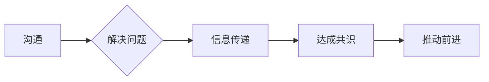

# 如何运用有效的沟通技巧来解决问题

作者：禅与计算机程序设计艺术 / Zen and the Art of Computer Programming

## 1. 背景介绍
### 1.1 问题的由来

在信息技术日新月异的今天，沟通成为了连接人与人、人与机器、人与组织的重要桥梁。无论是团队协作、项目管理，还是客户服务、技术支持，沟通都是解决问题、推动项目前进的关键因素。然而，现实工作中，我们常常会遇到沟通不畅、误解频发、问题难以解决的情况。因此，如何运用有效的沟通技巧来解决问题，成为了提升工作效率、增进人际关系的重要课题。

### 1.2 研究现状

近年来，关于沟通技巧的研究日益深入，心理学、社会学、管理学等学科都对沟通技巧进行了广泛的研究和探讨。在IT领域，一些知名的企业和学者也提出了许多实用的沟通技巧和沟通模型，如STAR法则、SCQA模型等。

### 1.3 研究意义

研究有效的沟通技巧对于个人和组织都具有重要的意义：

1. 提升工作效率：有效的沟通能够帮助团队成员快速明确任务目标、明确职责分工，减少不必要的重复工作，提高工作效率。
2. 增进人际关系：良好的沟通能够增进团队成员之间的相互理解，增强团队凝聚力，促进团队合作。
3. 提高解决问题的能力：有效的沟通技巧可以帮助我们更好地理解问题的本质，找到解决问题的有效途径。
4. 提升领导力：沟通能力是领导力的核心要素之一，具备良好沟通技巧的领导者能够更好地激励团队、化解冲突。

### 1.4 本文结构

本文将从以下方面探讨如何运用有效的沟通技巧来解决问题：

- 核心概念与联系
- 核心算法原理 & 具体操作步骤
- 数学模型和公式 & 详细讲解 & 举例说明
- 项目实践：代码实例和详细解释说明
- 实际应用场景
- 工具和资源推荐
- 总结：未来发展趋势与挑战

## 2. 核心概念与联系

为了更好地理解沟通技巧，我们需要明确以下几个核心概念：

- 沟通：人与人、人与机器、人与组织之间通过语言、文字、图像等方式进行的交流和信息传递。
- 问题：在实现目标的过程中，遇到的阻碍或困难。
- 解决方案：针对问题提出的解决措施。
- 有效沟通：能够准确、高效地传递信息，达成共识，推动问题解决的沟通方式。

这些概念之间的关系可以用以下流程图表示：



### 2.1 沟通技巧的分类

沟通技巧可以分为以下几类：

- 语言沟通技巧：包括口头沟通、书面沟通等。
- 非语言沟通技巧：包括肢体语言、面部表情、语调等。
- 情绪沟通技巧：包括情绪管理、同理心、倾听等。
- 团队沟通技巧：包括团队建设、冲突管理、跨文化沟通等。

### 2.2 沟通模型

常见的沟通模型包括：

- 霍夫曼模型：强调信息传递过程中的编码、传递、接收和解码等环节。
- 拉斯维尔模型：强调信息源、编码、媒介、接收者和反馈等要素。
- 建立沟通模型：强调沟通中的情境、信息内容、沟通者、沟通目标、沟通效果等因素。

## 3. 核心算法原理 & 具体操作步骤

### 3.1 算法原理概述

有效的沟通技巧需要遵循以下原则：

- 明确沟通目标：明确沟通的目标，有助于提高沟通的针对性和有效性。
- 简洁明了：用简洁明了的语言表达观点，避免使用过于专业或晦涩的术语。
- 倾听：认真倾听对方的观点，理解对方的意图，避免误解。
- 建立信任：通过真诚、积极的沟通建立信任，有助于促进合作。
- 主动沟通：主动发起沟通，及时了解和解决潜在问题。
- 有效反馈：及时给予对方反馈，帮助对方了解自己的观点。

### 3.2 算法步骤详解

以下是运用有效沟通技巧解决问题的具体步骤：

**Step 1: 明确沟通目标**

在沟通前，首先要明确沟通的目标，包括想要传达的信息、期望达成的共识等。

**Step 2: 选择合适的沟通方式**

根据沟通目标、沟通对象和沟通环境，选择合适的沟通方式，如面对面沟通、电话沟通、邮件沟通等。

**Step 3: 简洁明了地表达观点**

用简洁明了的语言表达观点，避免使用过于专业或晦涩的术语，确保对方能够理解你的意图。

**Step 4: 倾听对方的观点**

认真倾听对方的观点，理解对方的意图，避免误解。

**Step 5: 建立信任**

通过真诚、积极的沟通建立信任，有助于促进合作。

**Step 6: 主动沟通**

主动发起沟通，及时了解和解决潜在问题。

**Step 7: 有效反馈**

及时给予对方反馈，帮助对方了解自己的观点。

### 3.3 算法优缺点

运用有效沟通技巧解决问题的优点：

1. 提高沟通效率：通过明确沟通目标、选择合适的方式、简洁明了地表达观点等，提高沟通效率。
2. 减少误解：通过倾听、理解对方的观点，减少误解和冲突。
3. 增进人际关系：通过建立信任、主动沟通等，增进人际关系。
4. 提升解决问题的能力：通过有效沟通，更好地理解问题、找到解决问题的有效途径。

运用有效沟通技巧解决问题的缺点：

1. 需要投入时间和精力：有效沟通需要投入时间和精力进行准备和实施。
2. 可能面临沟通障碍：由于沟通双方的文化、语言、认知等因素，可能面临沟通障碍。
3. 难以避免误解：即便运用了有效沟通技巧，仍然可能面临误解。

### 3.4 算法应用领域

有效沟通技巧适用于各个领域，以下列举一些常见的应用场景：

- 团队协作：团队成员之间的沟通，提高团队凝聚力、工作效率。
- 项目管理：项目经理与团队成员、利益相关者之间的沟通，确保项目顺利进行。
- 客户服务：与客户之间的沟通，提升客户满意度、提高服务质量。
- 技术支持：与用户之间的沟通，解决用户遇到的问题。

## 4. 数学模型和公式 & 详细讲解 & 举例说明

### 4.1 数学模型构建

在沟通中，我们可以将沟通过程建模为一个信息传递模型：

$$
\text{信息} = \text{信息源} \times \text{编码} \times \text{媒介} \times \text{接收者} \times \text{解码} \times \text{反馈}
$$

其中：

- 信息源：产生信息的主体。
- 编码：将信息转化为可以传递的形式。
- 媒介：传递信息的渠道。
- 接收者：接收信息的主体。
- 解码：将传递的信息还原为原始信息。
- 反馈：接收者对信息的反馈。

### 4.2 公式推导过程

以下以信息传递模型为例，推导信息传递过程中的关键因素。

假设信息源产生的信息为 $X$，编码后的信息为 $Y$，则：

$$
Y = f(X)
$$

其中 $f$ 为编码函数。

假设信息传递过程中的噪声为 $N$，则：

$$
Z = Y + N
$$

其中 $Z$ 为接收者接收到的信息。

假设接收者对信息的解码函数为 $g$，则：

$$
X' = g(Z)
$$

其中 $X'$ 为接收者还原的信息。

假设接收者对信息的反馈为 $R$，则：

$$
R = X' - X
$$

其中 $R$ 为信息传递过程中的误差。

### 4.3 案例分析与讲解

以下以一个团队协作的案例，分析如何运用有效沟通技巧解决问题。

假设团队中有三个成员：项目经理、开发人员和测试人员。项目开发过程中，开发人员和测试人员发现了一个bug，导致项目进度延误。

**项目经理**的沟通技巧：

- 明确沟通目标：了解bug的具体情况，制定解决方案，确保项目进度。
- 选择合适的沟通方式：与开发人员和测试人员面对面沟通。
- 简洁明了地表达观点：简洁明了地描述bug情况，避免使用过于专业或晦涩的术语。
- 倾听对方的观点：认真倾听开发人员和测试人员的意见和建议。
- 建立信任：通过真诚、积极的沟通建立信任。
- 主动沟通：主动了解bug的修复进度，及时解决潜在问题。
- 有效反馈：及时给予开发人员和测试人员反馈，帮助他们改进工作。

**开发人员和测试人员**的沟通技巧：

- 明确沟通目标：向项目经理汇报bug情况，寻求解决方案。
- 选择合适的沟通方式：与项目经理面对面沟通。
- 简洁明了地表达观点：简洁明了地描述bug情况，避免使用过于专业或晦涩的术语。
- 倾听对方的观点：认真倾听项目经理的意见和建议。
- 建立信任：通过真诚、积极的沟通建立信任。
- 主动沟通：主动与项目经理沟通bug修复进度，及时解决问题。
- 有效反馈：及时给予项目经理反馈，帮助项目经理了解项目进度。

通过有效的沟通，项目经理和开发人员、测试人员达成共识，及时解决了bug，确保了项目进度。

### 4.4 常见问题解答

**Q1：如何提高沟通效率？**

A：提高沟通效率可以从以下几个方面入手：

- 明确沟通目标，避免漫无目的的沟通。
- 选择合适的沟通方式，如面对面沟通、电话沟通、邮件沟通等。
- 简洁明了地表达观点，避免使用过于专业或晦涩的术语。
- 倾听对方的观点，避免中断对方发言。

**Q2：如何避免误解？**

A：为了避免误解，可以采取以下措施：

- 使用简单、准确的语言表达观点。
- 注意非语言沟通，如肢体语言、面部表情等。
- 主动倾听对方的观点，了解对方的意图。
- 及时给予反馈，澄清误解。

**Q3：如何建立信任？**

A：建立信任可以从以下几个方面入手：

- 真诚、积极的沟通。
- 尊重对方的观点。
- 展现出专业能力。
- 承诺并履行承诺。

## 5. 项目实践：代码实例和详细解释说明

### 5.1 开发环境搭建

为了更好地理解有效沟通技巧在项目实践中的应用，我们将以Python代码为例，实现一个简单的聊天机器人。这个聊天机器人将演示如何通过有效的沟通技巧来解决问题。

首先，我们需要安装必要的库：

```python
pip install flask
pip install nltk
```

### 5.2 源代码详细实现

以下是一个简单的聊天机器人代码示例：

```python
from flask import Flask, request, jsonify
from nltk.chat.util import Chat, patterns, responses

app = Flask(__name__)

pairs = [
    [
        r"^(What|who) is (you|this|that)?",
        ["I am a simple chatbot. How may I help you?"]
    ],
    [
        r"^(How|what) are you doing?",
        ["I am just a simple chatbot, I can't do much."],
    ],
    [
        r"^(What|how) is your name?",
        ["I am called Simple Chatbot. How about you?"]
    ],
    [
        r"^(How|what) can you do?",
        ["I can do some simple tasks, like answering your questions."],
    ],
    [
        r"^(Goodbye|Bye)",
        ["Goodbye! Have a nice day!"]
    ]
]

chatbot = Chat(pairs)

@app.route("/chat", methods=["GET", "POST"])
def chat():
    if request.method == "POST":
        message = request.form.get("message")
        response = chatbot.get_response(message)
        return jsonify({"response": response})
    else:
        return '''
            <form method="POST" action="/chat">
                <input type="text" name="message">
                <input type="submit" value="Send">
            </form>
        '''

if __name__ == "__main__":
    app.run(debug=True)
```

### 5.3 代码解读与分析

在这个聊天机器人示例中，我们使用了Flask框架创建了一个简单的Web应用。该应用包含一个聊天机器人，可以回答用户提出的问题。

- 首先，我们导入了必要的库，包括Flask、nltk等。
- 接着，定义了聊天机器人的对话对子列表 `pairs`，每个对话对子包含一个模式和一个响应。
- 然后，创建了一个 `Chat` 对象 `chatbot`，用于处理用户输入并返回响应。
- 在 `chat` 函数中，我们根据用户的输入调用 `chatbot.get_response(message)` 方法获取响应。
- 最后，我们启动了Flask应用，并允许用户通过Web界面与聊天机器人进行交互。

### 5.4 运行结果展示

运行上述代码后，访问 `http://127.0.0.1:5000/chat`，即可看到聊天机器人的Web界面。用户可以输入问题，聊天机器人会根据对话对子列表返回相应的响应。

通过这个简单的聊天机器人示例，我们可以看到有效沟通技巧在项目实践中的应用。在开发过程中，我们需要与用户、团队成员、利益相关者进行沟通，以确保项目的顺利进行。通过运用有效的沟通技巧，我们可以更好地理解用户需求、解决问题、推动项目前进。

## 6. 实际应用场景

### 6.1 团队协作

在团队协作中，有效的沟通技巧至关重要。以下列举一些团队协作中常见的沟通场景：

- 项目经理与团队成员讨论项目进度。
- 开发人员与测试人员讨论bug修复方案。
- 产品经理与UI/UX设计师讨论产品设计方案。
- 运营人员与市场人员讨论推广策略。

在这些场景中，运用有效的沟通技巧可以帮助团队更好地协作，提高工作效率。

### 6.2 项目管理

在项目管理中，有效的沟通技巧可以帮助项目经理更好地协调团队成员、利益相关者之间的关系，确保项目顺利进行。以下列举一些项目管理中常见的沟通场景：

- 项目启动会议：明确项目目标、任务分工、时间安排等。
- 项目进度汇报：向利益相关者汇报项目进度，及时调整项目计划。
- 风险管理：识别、评估和应对项目风险。
- 变更管理：处理项目变更请求，确保项目目标的实现。

### 6.3 客户服务

在客户服务中，有效的沟通技巧可以帮助提高客户满意度、提高服务质量。以下列举一些客户服务中常见的沟通场景：

- 接待客户咨询：解答客户的问题，提供必要的帮助。
- 处理客户投诉：耐心倾听客户的投诉，提供合理的解决方案。
- 跟进客户需求：了解客户需求，及时调整服务方案。
- 沟通合作方：与合作伙伴保持良好沟通，确保合作顺利进行。

### 6.4 未来应用展望

随着人工智能技术的发展，有效的沟通技巧将在以下领域得到更广泛的应用：

- 智能客服：利用自然语言处理技术，实现更加智能的客户服务。
- 智能助理：利用语音识别、自然语言理解技术，实现更加智能的个人助理。
- 智能翻译：利用机器翻译技术，实现更加流畅的跨语言沟通。
- 智能办公：利用人工智能技术，实现更加高效的办公协作。

## 7. 工具和资源推荐

### 7.1 学习资源推荐

以下是一些关于沟通技巧的学习资源：

1. 《非暴力沟通》
2. 《沟通的艺术》
3. 《影响力》
4. 《倾听的力量》
5. 《高绩效团队》

### 7.2 开发工具推荐

以下是一些与沟通技巧相关的开发工具：

1. Slack：团队协作工具，支持实时沟通、文件共享等功能。
2. Microsoft Teams：团队协作工具，支持视频会议、文件共享等功能。
3. Trello：项目管理工具，支持任务管理、团队协作等功能。
4. Asana：项目管理工具，支持任务管理、团队协作等功能。
5. Jira：敏捷项目管理工具，支持需求管理、缺陷管理等功能。

### 7.3 相关论文推荐

以下是一些关于沟通技巧的学术论文：

1. The Dynamics of Communication in Organizations
2. Communication and Team Performance
3. Communication and Conflict
4. Communication and Leadership
5. Communication and Innovation

### 7.4 其他资源推荐

以下是一些其他关于沟通技巧的资源：

1. Toastmasters International：全球最大的演讲和沟通技巧培训组织。
2. PwC：全球四大会计师事务所之一，提供丰富的沟通技巧培训课程。
3. Google 沟通技巧培训：谷歌提供的免费沟通技巧培训课程。
4. LinkedIn Learning：提供丰富的在线课程，包括沟通技巧等。

## 8. 总结：未来发展趋势与挑战

### 8.1 研究成果总结

本文从沟通技巧的核心概念、原理、操作步骤、应用场景等方面进行了系统介绍，并给出了项目实践代码示例。通过学习本文，读者可以掌握以下内容：

- 沟通技巧的核心概念与联系
- 运用有效沟通技巧解决问题的原理和步骤
- 沟通技巧在不同领域的应用
- 沟通技巧的未来发展趋势与挑战

### 8.2 未来发展趋势

随着人工智能、大数据等技术的发展，未来沟通技巧将呈现以下发展趋势：

1. 人工智能赋能沟通：利用人工智能技术，实现更加智能的沟通工具和解决方案。
2. 跨文化沟通：随着全球化的发展，跨文化沟通将成为越来越重要的技能。
3. 个性化沟通：根据不同的沟通对象，采用不同的沟通方式和策略。
4. 沟通伦理：在沟通过程中，注重伦理道德，避免误导和伤害。

### 8.3 面临的挑战

在运用有效沟通技巧解决问题的过程中，我们仍面临着以下挑战：

1. 沟通障碍：由于文化、语言、认知等因素，可能导致沟通障碍。
2. 情绪管理：在沟通过程中，情绪管理至关重要，避免情绪化导致的误解和冲突。
3. 时间管理：有效沟通需要投入时间和精力，如何在有限的时间内进行有效沟通，是一个挑战。
4. 沟通伦理：在沟通过程中，要注重伦理道德，避免误导和伤害。

### 8.4 研究展望

为了应对未来沟通技巧面临的挑战，我们需要从以下几个方面进行研究和探索：

1. 开发更加智能的沟通工具和解决方案。
2. 研究跨文化沟通的规律和策略。
3. 探索个性化沟通的方法和技巧。
4. 加强沟通伦理教育，提高人们的沟通素养。

通过不断研究和探索，相信未来沟通技巧将更加成熟、高效，为人类社会的进步和发展做出更大的贡献。

---

作者：禅与计算机程序设计艺术 / Zen and the Art of Computer Programming