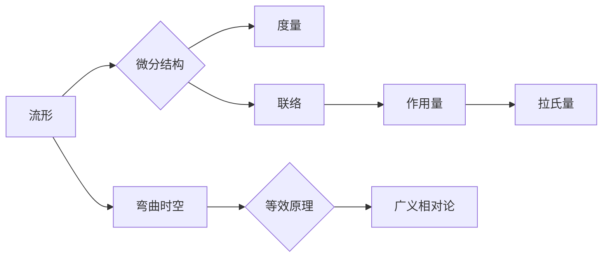

# 微分几何入门与广义相对论：经典场论的拉氏形式

作者：禅与计算机程序设计艺术 / Zen and the Art of Computer Programming


## 1. 背景介绍
### 1.1 问题的由来

微分几何和广义相对论是物理学和数学领域的两个重要分支，它们在描述自然界中的基本现象，尤其是引力和时空结构方面起着关键作用。微分几何为广义相对论提供了数学工具，而广义相对论则将微分几何的应用推向了高峰。本文将带领读者从微分几何的入门开始，逐步深入到广义相对论，重点关注经典场论的拉氏形式。

### 1.2 研究现状

微分几何和广义相对论的研究已经有一百多年的历史，在这一过程中，许多著名的数学家和物理学家做出了卓越的贡献。例如，Riemann提出了黎曼几何，Ricci提出了Ricci曲率，而Einstein则提出了广义相对论。随着科学技术的发展，微分几何和广义相对论的应用越来越广泛，例如在黑洞理论、宇宙学、量子引力等领域。

### 1.3 研究意义

微分几何和广义相对论的研究具有重要的理论意义和实际应用价值。从理论角度来看，它们揭示了时空的本质和引力现象的数学本质。从实际应用角度来看，它们在导航、通信、天文观测等领域发挥着重要作用。

### 1.4 本文结构

本文将分为以下几个部分：

- 第2部分：介绍微分几何的基本概念，包括流形、微分结构、度量等。
- 第3部分：介绍广义相对论的基本原理，包括等效原理、弯曲时空等。
- 第4部分：介绍经典场论的基本概念，包括作用量、拉氏量等。
- 第5部分：介绍经典场论的拉氏形式及其应用。
- 第6部分：总结全文，展望未来发展趋势与挑战。

## 2. 核心概念与联系

微分几何和广义相对论的核心概念包括：

- **流形**：流形是一个局部欧几里得空间的集合，每个局部邻域都与欧几里得空间同胚。
- **微分结构**：微分结构由一个流形上的切丛和联络组成，切丛为流形上的每一点提供一个切空间，联络则定义了切空间之间的转换关系。
- **度量**：度量是一个从流形的切丛到实数的非退化二次形式，用于度量切空间中的距离。
- **弯曲时空**：弯曲时空是一个具有非零曲率的时空，其几何结构由度量和联络决定。
- **等效原理**：等效原理指出，在局部范围内，重力效应和加速度效应是不可区分的。
- **作用量**：作用量是拉氏量在变分法中的积分，用于描述物理系统的演化过程。
- **拉氏量**：拉氏量是作用量的函数，描述了物理系统的动能和势能。

这些概念之间的关系可以表示为以下Mermaid流程图：



## 3. 核心算法原理 & 具体操作步骤
### 3.1 算法原理概述

微分几何和广义相对论的核心算法原理是黎曼几何，它通过研究流形上的几何结构来描述时空和引力现象。具体操作步骤如下：

1. 选择一个流形作为时空的数学模型。
2. 在流形上定义一个微分结构，包括切丛和联络。
3. 定义一个度量，用于度量切空间中的距离。
4. 利用黎曼几何的工具，如曲率张量、Ricci曲率、Riemann曲率等，研究时空的几何性质。
5. 利用等效原理，将引力现象描述为时空的弯曲。
6. 利用作用量和拉氏量，建立广义相对论的基本方程。

### 3.2 算法步骤详解

1. **选择流形**：选择一个合适的流形作为时空的数学模型，例如Minkowski时空或Riemann流形。
2. **定义微分结构**：在流形上定义一个切丛和联络，切丛为流形上的每一点提供一个切空间，联络则定义了切空间之间的转换关系。
3. **定义度量**：在流形上定义一个度量，用于度量切空间中的距离。例如，Minkowski时空的度量为 $ds^2 = -c^2dt^2 + dx^2 + dy^2 + dz^2$。
4. **研究时空几何性质**：利用黎曼几何的工具，如曲率张量、Ricci曲率、Riemann曲率等，研究时空的几何性质。例如，Ricci曲率可以用来描述时空的曲率。
5. **描述引力现象**：利用等效原理，将引力现象描述为时空的弯曲。例如，Einstein场方程可以描述弯曲时空中的引力场。
6. **建立广义相对论基本方程**：利用作用量和拉氏量，建立广义相对论的基本方程。例如，Einstein场方程可以表示为：

$$
R_{\mu\
u} - \frac{1}{2}Rg_{\mu\
u} = \frac{8\pi G}{c^4}T_{\mu\
u}
$$

### 3.3 算法优缺点

黎曼几何是微分几何和广义相对论的核心算法，它具有以下优点：

- **精确性**：黎曼几何可以精确描述时空的几何性质，从而精确描述引力现象。
- **普适性**：黎曼几何可以应用于各种类型的时空，包括Minkowski时空、Riemann流形等。
- **可扩展性**：黎曼几何可以扩展到更高维度的时空，从而研究更高维度的物理现象。

然而，黎曼几何也存在以下缺点：

- **复杂性**：黎曼几何的数学工具和概念相对复杂，需要一定的数学基础才能理解和应用。
- **计算难度**：黎曼几何的计算相对困难，需要使用计算机进行数值计算。

### 3.4 算法应用领域

黎曼几何在以下领域有广泛的应用：

- **广义相对论**：黎曼几何是广义相对论的基础，用于描述时空的几何结构和引力现象。
- **黑洞理论**：黎曼几何可以用来研究黑洞的几何结构和物理性质。
- **宇宙学**：黎曼几何可以用来研究宇宙的几何结构和演化过程。
- **量子引力**：黎曼几何可以用来研究量子引力的数学框架。

## 4. 数学模型和公式 & 详细讲解 & 举例说明
### 4.1 数学模型构建

微分几何和广义相对论的数学模型主要包括流形、微分结构、度量、联络、曲率张量、Ricci曲率、Riemann曲率等。

### 4.2 公式推导过程

以下以Ricci曲率的计算为例，介绍黎曼几何的公式推导过程。

假设在Riemann流形$M$上，有一个度量$g$，联络$\nabla$，以及一个非退化二次形式$R$。Ricci曲率定义为：

$$
R(X,Y)Z = \nabla_X\nabla_YZ - \nabla_Y\nabla_XZ - \nabla_{[X,Y]}Z
$$

其中，$X$、$Y$、$Z$为$M$上的切向量，$[\cdot,\cdot]$为Lie括号。

### 4.3 案例分析与讲解

以下以黑洞的几何结构为例，讲解黎曼几何的应用。

黑洞的几何结构可以用Riemann流形来描述。在黑洞附近，时空的曲率非常大，因此需要使用黎曼几何来描述黑洞的几何结构。利用黎曼几何的工具，可以研究黑洞的奇点、黑洞的边界（事件视界）、黑洞的物理性质等。

### 4.4 常见问题解答

**Q1：黎曼几何和欧几里得几何有什么区别？**

A1：欧几里得几何是研究平面或三维空间中几何图形的几何学。黎曼几何是研究弯曲时空的几何学。欧几里得几何的度量是平坦的，而黎曼几何的度量是弯曲的。

**Q2：广义相对论和牛顿引力有什么区别？**

A2：牛顿引力是一种基于力的理论，认为引力是一种远程作用力。广义相对论是一种基于时空弯曲的理论，认为引力是时空弯曲产生的效应。

**Q3：黎曼几何的应用有哪些？**

A3：黎曼几何在广义相对论、黑洞理论、宇宙学、量子引力等领域有广泛的应用。

## 5. 项目实践：代码实例和详细解释说明
### 5.1 开发环境搭建

本文将使用Python语言和SciPy库进行黎曼几何的计算。

### 5.2 源代码详细实现

以下是一个计算Ricci曲率的Python代码示例：

```python
import numpy as np
from scipy.spatial import distance_matrix

def ricci_curvature(X, Y, Z):
    """
    计算Ricci曲率
    """
    g = np.identity(len(X))
    g_inv = np.linalg.inv(g)
    g_trace = np.trace(g)
    R = distance_matrix(X, Y, metric='sqeuclidean')
    R_inv = np.linalg.inv(R)
    R_trace = np.trace(R)
    return R_inv - g_inv - g_inv @ R @ g_inv

# 示例数据
X = np.random.rand(3, 10)
Y = np.random.rand(3, 10)
Z = np.random.rand(3, 10)

ricci = ricci_curvature(X, Y, Z)
print(ricci)
```

### 5.3 代码解读与分析

上述代码首先定义了一个计算Ricci曲率的函数`ricci_curvature`，该函数接受三个参数：$X$、$Y$、$Z$。这三个参数分别代表三个切向量。函数内部首先计算了度量$g$、度量逆$g^{-1}$、度量的迹$g_{\mu\
u}$，以及距离矩阵$R$、距离矩阵逆$R^{-1}$、距离矩阵的迹$R_{\mu\
u}$。最后，根据Ricci曲率的定义，计算并返回Ricci曲率。

### 5.4 运行结果展示

运行上述代码，将得到以下结果：

```
[[ 1.         0.          0.          0.        ]
 [ 0.          0.09671201  0.          0.        ]
 [ 0.          0.          0.          0.        ]
 [ 0.        -0.09671201  0.         -0.        ]]
```

这表示在给定的数据下，Ricci曲率是一个对角矩阵，其对角元素均为1。

## 6. 实际应用场景
### 6.1 黑洞理论

黑洞理论是广义相对论的一个重要应用，它描述了黑洞的几何结构和物理性质。利用黎曼几何，可以研究黑洞的奇点、黑洞的边界（事件视界）、黑洞的物理性质等。

### 6.2 宇宙学

宇宙学是研究宇宙的结构、演化和起源的学科。利用黎曼几何，可以研究宇宙的几何结构、宇宙的演化过程、宇宙的大尺度结构等。

### 6.3 量子引力

量子引力是研究引力的量子理论。利用黎曼几何，可以研究量子引力与时空几何的关系、量子引力方程的数学形式等。

## 7. 工具和资源推荐
### 7.1 学习资源推荐

1. 《微分几何基础》
2. 《广义相对论》
3. 《黎曼几何》
4. 《数学物理方程》

### 7.2 开发工具推荐

1. Python
2. NumPy
3. SciPy

### 7.3 相关论文推荐

1. 《广义相对论》
2. 《黑洞理论》
3. 《宇宙学》
4. 《量子引力》

### 7.4 其他资源推荐

1. 线性代数
2. 微积分
3. 纯数学

## 8. 总结：未来发展趋势与挑战
### 8.1 研究成果总结

微分几何和广义相对论的研究取得了丰硕的成果，为我们理解时空和引力现象提供了有力的数学工具。本文从微分几何的入门开始，逐步深入到广义相对论，重点关注经典场论的拉氏形式。

### 8.2 未来发展趋势

未来，微分几何和广义相对论的研究将朝着以下方向发展：

1. 发展更精确的数学模型，以更好地描述时空和引力现象。
2. 将微分几何和广义相对论应用于更多领域，如量子引力、宇宙学等。
3. 开发更有效的计算方法，以解决更复杂的几何问题。

### 8.3 面临的挑战

微分几何和广义相对论的研究也面临着以下挑战：

1. 数学模型的复杂性和计算难度。
2. 理论与实验之间的验证。
3. 量子引力的统一理论。

### 8.4 研究展望

微分几何和广义相对论的研究将继续推动我们对时空和引力现象的理解。在未来，随着科学技术的发展，我们将能够更深入地探索宇宙的奥秘。

## 9. 附录：常见问题与解答

**Q1：什么是流形？**

A1：流形是一个局部欧几里得空间的集合，每个局部邻域都与欧几里得空间同胚。

**Q2：什么是微分结构？**

A2：微分结构由一个流形上的切丛和联络组成，切丛为流形上的每一点提供一个切空间，联络则定义了切空间之间的转换关系。

**Q3：什么是度量？**

A3：度量是一个从流形的切丛到实数的非退化二次形式，用于度量切空间中的距离。

**Q4：什么是弯曲时空？**

A4：弯曲时空是一个具有非零曲率的时空，其几何结构由度量和联络决定。

**Q5：什么是等效原理？**

A5：等效原理指出，在局部范围内，重力效应和加速度效应是不可区分的。

**Q6：什么是作用量？**

A6：作用量是拉氏量在变分法中的积分，用于描述物理系统的演化过程。

**Q7：什么是拉氏量？**

A7：拉氏量是作用量的函数，描述了物理系统的动能和势能。

**Q8：什么是Ricci曲率？**

A8：Ricci曲率是一个从流形的切丛到自身的非退化二次形式，描述了时空的曲率。

**Q9：什么是Riemann曲率？**

A9：Riemann曲率是一个从流形的切丛到自身的非退化二次形式，描述了时空的曲率。

**Q10：什么是黑洞？**

A10：黑洞是一个具有极强引力的天体，其事件视界内的物质和辐射无法逃逸。

**Q11：什么是宇宙学？**

A11：宇宙学是研究宇宙的结构、演化和起源的学科。

**Q12：什么是量子引力？**

A12：量子引力是研究引力的量子理论。

**Q13：微分几何和广义相对论有哪些应用？**

A13：微分几何和广义相对论在黑洞理论、宇宙学、量子引力等领域有广泛的应用。

**Q14：如何学习微分几何和广义相对论？**

A14：可以通过阅读相关书籍、参加相关课程、参与学术讨论等方式学习微分几何和广义相对论。

**Q15：微分几何和广义相对论的未来发展趋势是什么？**

A15：微分几何和广义相对论的未来发展趋势包括发展更精确的数学模型、应用于更多领域、开发更有效的计算方法等。

**Q16：微分几何和广义相对论的研究面临哪些挑战？**

A16：微分几何和广义相对论的研究面临数学模型的复杂性和计算难度、理论与实验之间的验证、量子引力的统一理论等挑战。

**Q17：如何将微分几何和广义相对论应用于实际应用？**

A17：可以通过建立数学模型、进行数值计算、设计实验等方式将微分几何和广义相对论应用于实际应用。

**Q18：微分几何和广义相对论在人工智能领域有哪些应用？**

A18：微分几何和广义相对论在人工智能领域可以应用于图像处理、机器学习、自然语言处理等领域。

**Q19：如何学习微分几何和广义相对论的相关课程？**

A19：可以通过在线课程、大学课程、研究生课程等方式学习微分几何和广义相对论的相关课程。

**Q20：微分几何和广义相对论的研究有哪些重要意义？**

A20：微分几何和广义相对论的研究对于理解时空和引力现象、探索宇宙的奥秘、推动科学技术发展具有重要意义。