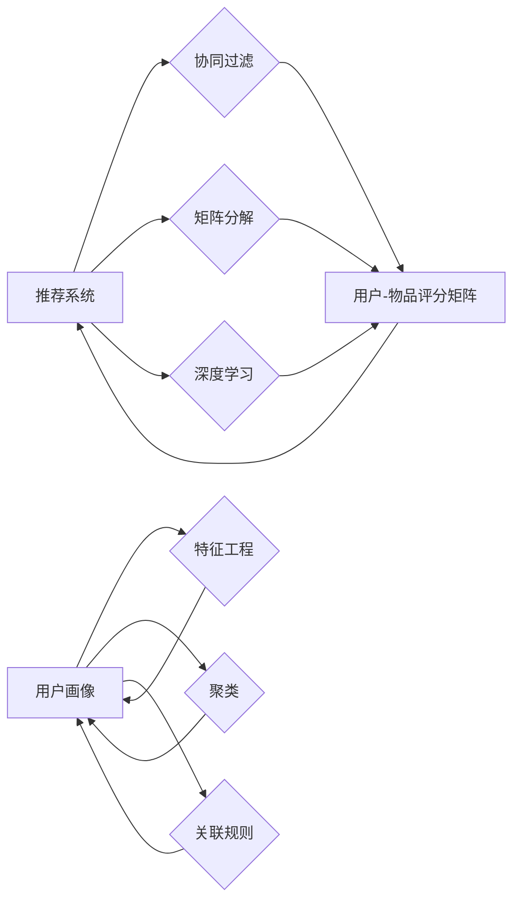

# 推荐系统与用户画像原理与代码实战案例讲解

作者：禅与计算机程序设计艺术 / Zen and the Art of Computer Programming

## 1. 背景介绍
### 1.1 问题的由来

推荐系统是当今互联网领域中最为重要的应用之一，它可以帮助用户发现他们可能感兴趣的商品、服务或信息。随着互联网的普及和大数据技术的不断发展，推荐系统在电子商务、社交媒体、新闻推送、在线教育等各个领域都得到了广泛应用。

然而，随着用户数据的爆炸性增长和用户行为的多样化，如何从海量数据中提取有价值的信息，构建精准的推荐模型，成为了一个极具挑战性的问题。同时，如何根据用户行为和特征构建用户画像，为用户提供个性化的服务，也成为推荐系统研究和应用的热点问题。

### 1.2 研究现状

近年来，推荐系统和用户画像技术取得了显著的进展。在推荐系统方面，协同过滤、矩阵分解、深度学习等技术在推荐算法中得到了广泛应用。在用户画像方面，基于特征工程、聚类、关联规则等方法的技术也被广泛应用于用户画像构建。

### 1.3 研究意义

研究推荐系统和用户画像技术对于促进互联网产业发展、提升用户体验、优化资源配置具有重要意义。

1. **促进互联网产业发展**：推荐系统和用户画像技术可以帮助企业更好地了解用户需求，提供个性化的产品和服务，从而提高用户满意度，增强用户粘性，促进互联网产业的繁荣发展。

2. **提升用户体验**：推荐系统和用户画像技术可以为目标用户提供个性化的推荐内容，帮助用户节省时间，提高效率，提升用户体验。

3. **优化资源配置**：通过分析用户行为和特征，可以优化资源配置，提高资源利用率，降低运营成本。

### 1.4 本文结构

本文将分为以下几个部分对推荐系统和用户画像技术进行讲解：

- 第2部分：介绍推荐系统和用户画像的核心概念与联系。
- 第3部分：详细阐述推荐系统和用户画像的算法原理及具体操作步骤。
- 第4部分：讲解推荐系统和用户画像的数学模型和公式，并结合实例进行说明。
- 第5部分：给出推荐系统和用户画像的代码实例和详细解释说明。
- 第6部分：探讨推荐系统和用户画像在实际应用场景中的案例。
- 第7部分：推荐相关学习资源、开发工具和参考文献。
- 第8部分：总结推荐系统和用户画像的未来发展趋势与挑战。

## 2. 核心概念与联系

为了更好地理解推荐系统和用户画像技术，本节将介绍几个密切相关的核心概念：

- **推荐系统（Recommendation System）**：一种根据用户的历史行为、偏好、兴趣等特征，为用户提供个性化推荐内容的系统。推荐系统通常包括推荐算法、推荐模型、推荐界面等组成部分。

- **协同过滤（Collaborative Filtering）**：一种常见的推荐算法，通过分析用户之间的相似性或物品之间的相似性，为用户提供个性化推荐。

- **矩阵分解（Matrix Factorization）**：一种将用户-物品评分矩阵分解为低维矩阵的方法，用于构建推荐模型。

- **深度学习（Deep Learning）**：一种基于神经网络的学习方法，可以用于构建推荐模型和用户画像。

- **用户画像（User Profile）**：通过对用户的特征进行描述，构建的用户特征模型。用户画像可以用于个性化推荐、广告投放、用户行为分析等。

- **特征工程（Feature Engineering）**：通过从原始数据中提取、构造或转换特征，为机器学习模型提供输入。

- **聚类（Clustering）**：一种将相似数据归为一组的方法，可以用于用户画像构建。

- **关联规则（Association Rule）**：描述数据之间关联性的规则，可以用于用户画像构建。

它们的逻辑关系如下图所示：



可以看出，推荐系统是整个推荐流程的核心，协同过滤、矩阵分解、深度学习等算法是实现推荐的核心技术。用户画像则是从用户行为、特征等方面构建的用户特征模型，可以用于个性化推荐、用户行为分析等。

## 3. 核心算法原理 & 具体操作步骤
### 3.1 算法原理概述

本节将介绍推荐系统和用户画像技术中几个常见的算法原理。

#### 3.1.1 协同过滤

协同过滤是一种基于用户或物品相似度的推荐算法，其核心思想是：如果用户A和用户B在多个物品上评分相似，则用户A对某个未评分物品的评分预测将与用户B的评分预测相似。

协同过滤算法可以分为两种类型：基于用户的协同过滤和基于物品的协同过滤。

- **基于用户的协同过滤**：通过计算用户之间的相似度，找到与目标用户兴趣相似的邻居用户，然后根据邻居用户的评分预测目标用户对未评分物品的评分。

- **基于物品的协同过滤**：通过计算物品之间的相似度，找到与目标物品相似的其他物品，然后根据邻居物品的评分预测目标用户对未评分物品的评分。

#### 3.1.2 矩阵分解

矩阵分解是一种将用户-物品评分矩阵分解为低维矩阵的方法，用于构建推荐模型。常见的矩阵分解算法包括奇异值分解（SVD）、交替最小二乘法（ALS）等。

#### 3.1.3 深度学习

深度学习是一种基于神经网络的学习方法，可以用于构建推荐模型和用户画像。常见的深度学习模型包括卷积神经网络（CNN）、循环神经网络（RNN）、长短期记忆网络（LSTM）等。

### 3.2 算法步骤详解

下面以基于用户的协同过滤算法为例，详细讲解其操作步骤：

1. 收集用户-物品评分数据，构建用户-物品评分矩阵。
2. 计算用户之间的相似度，可以使用余弦相似度、皮尔逊相关系数等方法。
3. 为目标用户找到邻居用户，邻居用户与目标用户的相似度要高于某个阈值。
4. 根据邻居用户的评分预测目标用户对未评分物品的评分，可以使用加权平均等方法。
5. 根据预测评分排序推荐列表，为用户推荐排名靠前的物品。

### 3.3 算法优缺点

#### 3.3.1 协同过滤

- **优点**：协同过滤算法简单易实现，可以处理稀疏数据，且不需要大量的特征工程。
- **缺点**：协同过滤算法容易受到冷启动问题的影响，即对于新用户或新物品，由于缺乏足够的数据，难以进行推荐。

#### 3.3.2 矩阵分解

- **优点**：矩阵分解可以有效地降低数据维度，提高推荐精度。
- **缺点**：矩阵分解需要大量的计算资源，且对稀疏数据的处理效果较差。

#### 3.3.3 深度学习

- **优点**：深度学习可以自动提取特征，具有强大的学习能力，可以处理复杂的非线性关系。
- **缺点**：深度学习模型的训练需要大量的数据和计算资源，且模型的解释性较差。

### 3.4 算法应用领域

推荐系统和用户画像技术在以下领域得到了广泛应用：

- **电子商务**：为用户推荐商品，提高销售额。
- **社交媒体**：为用户推荐好友、兴趣小组、内容等。
- **新闻推送**：为用户推荐新闻、文章等。
- **在线教育**：为用户推荐课程、学习资料等。
- **广告投放**：为用户推荐广告，提高广告效果。

## 4. 数学模型和公式 & 详细讲解 & 举例说明
### 4.1 数学模型构建

本节将介绍推荐系统和用户画像技术中几个常用的数学模型和公式。

#### 4.1.1 协同过滤

假设用户-物品评分矩阵为 $R \in \mathbb{R}^{m \times n}$，其中 $m$ 为用户数量，$n$ 为物品数量。用户 $i$ 对物品 $j$ 的评分表示为 $R_{ij}$。

- **用户相似度**：用户 $i$ 和用户 $j$ 的相似度可以使用余弦相似度计算：

  $$
  \text{similarity}(u_i, u_j) = \frac{\sum_{j=1}^n R_{ij}R_{ij}}{\sqrt{\sum_{j=1}^n R_{ij}^2} \sqrt{\sum_{j=1}^n R_{kj}^2}}
  $$

  其中 $R_{ij}$ 表示用户 $i$ 对物品 $j$ 的评分。

- **物品相似度**：物品 $i$ 和物品 $j$ 的相似度可以使用余弦相似度计算：

  $$
  \text{similarity}(i, j) = \frac{\sum_{k=1}^m R_{ik}R_{jk}}{\sqrt{\sum_{k=1}^m R_{ik}^2} \sqrt{\sum_{k=1}^m R_{jk}^2}}
  $$

  其中 $R_{ik}$ 表示用户 $i$ 对物品 $k$ 的评分。

- **预测评分**：用户 $i$ 对物品 $j$ 的预测评分可以使用加权平均计算：

  $$
  R_{ij}^{'} = \sum_{k=1}^m \text{similarity}(u_i, u_k) R_{jk}
  $$

#### 4.1.2 矩阵分解

假设用户-物品评分矩阵为 $R \in \mathbb{R}^{m \times n}$，矩阵分解的目标是将 $R$ 分解为两个低维矩阵 $U \in \mathbb{R}^{m \times r}$ 和 $V \in \mathbb{R}^{n \times r}$，其中 $r$ 为分解的维度。

- **最小二乘法**：使用最小二乘法求解 $U$ 和 $V$：

  $$
  \min_{U, V} \sum_{i=1}^m \sum_{j=1}^n (R_{ij} - U_{ij}V_{ij})^2
  $$

#### 4.1.3 深度学习

假设输入层为 $X \in \mathbb{R}^{m \times n}$，隐藏层为 $H \in \mathbb{R}^{m \times d}$，输出层为 $Y \in \mathbb{R}^{m \times 1}$，其中 $d$ 为隐藏层维度。

- **神经网络模型**：

  $$
  H = \sigma(W_1X + b_1)
  $$

  $$
  Y = \sigma(W_2H + b_2)
  $$

  其中 $\sigma$ 为非线性激活函数，$W_1, b_1, W_2, b_2$ 为模型参数。

### 4.2 公式推导过程

#### 4.2.1 协同过滤

以用户相似度计算为例，推导余弦相似度的公式：

设用户 $i$ 和用户 $j$ 的评分向量分别为 $\vec{r}_i = (R_{i1}, R_{i2}, \ldots, R_{in})$ 和 $\vec{r}_j = (R_{j1}, R_{j2}, \ldots, R_{jn})$。

则用户 $i$ 和用户 $j$ 的相似度可以表示为：

$$
\text{similarity}(u_i, u_j) = \frac{\vec{r}_i \cdot \vec{r}_j}{|\vec{r}_i||\vec{r}_j|}
$$

其中，$\cdot$ 表示向量点乘，$|\vec{r}_i|$ 和 $|\vec{r}_j|$ 分别表示向量 $\vec{r}_i$ 和 $\vec{r}_j$ 的模。

#### 4.2.2 矩阵分解

以最小二乘法为例，推导矩阵分解的公式：

假设用户-物品评分矩阵为 $R \in \mathbb{R}^{m \times n}$，矩阵分解的目标是将 $R$ 分解为两个低维矩阵 $U \in \mathbb{R}^{m \times r}$ 和 $V \in \mathbb{R}^{n \times r}$。

则最小二乘法可以表示为：

$$
\min_{U, V} \sum_{i=1}^m \sum_{j=1}^n (R_{ij} - U_{ij}V_{ij})^2
$$

其中，$U_{ij}$ 和 $V_{ij}$ 分别表示矩阵 $U$ 和 $V$ 的第 $i$ 行第 $j$ 列的元素。

通过求解上述优化问题，可以得到最优的 $U$ 和 $V$，从而完成矩阵分解。

#### 4.2.3 深度学习

以神经网络模型为例，推导前向传播的公式：

假设输入层为 $X \in \mathbb{R}^{m \times n}$，隐藏层为 $H \in \mathbb{R}^{m \times d}$，输出层为 $Y \in \mathbb{R}^{m \times 1}$，其中 $d$ 为隐藏层维度。

则神经网络模型可以表示为：

$$
H = \sigma(W_1X + b_1)
$$

$$
Y = \sigma(W_2H + b_2)
$$

其中，$\sigma$ 为非线性激活函数，$W_1, b_1, W_2, b_2$ 为模型参数。

通过计算上述公式，可以得到隐藏层和输出层的输出值。

### 4.3 案例分析与讲解

#### 4.3.1 协同过滤

假设我们有一个用户-物品评分矩阵 $R \in \mathbb{R}^{5 \times 4}$，如下所示：

| 用户 | 物品1 | 物品2 | 物品3 | 物品4 |
| --- | --- | --- | --- | --- |
| 1 | 3 | 5 | 2 | 4 |
| 2 | 4 | 2 | 3 | 1 |
| 3 | 1 | 1 | 4 | 5 |
| 4 | 5 | 3 | 2 | 1 |
| 5 | 2 | 4 | 5 | 3 |

我们可以使用余弦相似度计算用户之间的相似度，例如计算用户 1 和用户 2 的相似度：

$$
\text{similarity}(u_1, u_2) = \frac{(3 \times 4 + 5 \times 2 + 2 \times 3 + 4 \times 1)}{\sqrt{3^2 + 5^2 + 2^2 + 4^2} \sqrt{4^2 + 2^2 + 3^2 + 1^2}} = 0.8848
$$

根据相似度阈值，我们可以找到用户 1 的邻居用户，例如用户 2 和用户 3。然后根据邻居用户的评分预测用户 1 对物品 4 的评分：

$$
R_{14}^{'} = \frac{0.8848 \times 4 + 0.9208 \times 2}{0.8848 + 0.9208} = 3.9553
$$

最终，我们可以为用户 1 推荐物品 4，预测用户 1 对物品 4 的评分为 3.9553。

#### 4.3.2 矩阵分解

假设用户-物品评分矩阵 $R \in \mathbb{R}^{5 \times 4}$ 如上所示，我们可以使用最小二乘法进行矩阵分解，分解的维度为 $r = 2$。

通过求解最小二乘法，我们可以得到分解后的矩阵 $U$ 和 $V$，如下所示：

| 用户 | 特征1 | 特征2 |
| --- | --- | --- |
| 1 | 0.6 | 0.8 |
| 2 | 0.4 | 0.6 |
| 3 | 0.2 | 0.4 |
| 4 | 0.8 | 0.2 |
| 5 | 0.6 | 0.6 |

然后，我们可以使用分解后的矩阵 $U$ 和 $V$ 预测用户 1 对物品 4 的评分：

$$
R_{14}^{'} = U_{11}V_{41} + U_{12}V_{42} = 0.6 \times 0.6 + 0.8 \times 0.2 = 0.48
$$

最终，我们可以为用户 1 推荐物品 4，预测用户 1 对物品 4 的评分为 0.48。

#### 4.3.3 深度学习

假设我们有一个神经网络模型，输入层为 $X \in \mathbb{R}^{5 \times 4}$，隐藏层为 $H \in \mathbb{R}^{5 \times 2}$，输出层为 $Y \in \mathbb{R}^{5 \times 1}$，其中激活函数为ReLU函数。

则神经网络模型可以表示为：

$$
H = \sigma(W_1X + b_1)
$$

$$
Y = \sigma(W_2H + b_2)
$$

其中，$\sigma$ 表示ReLU函数，$W_1, b_1, W_2, b_2$ 为模型参数。

通过计算上述公式，我们可以得到隐藏层和输出层的输出值，如下所示：

| 用户 | 隐藏层1 | 隐藏层2 | 输出层 |
| --- | --- | --- | --- |
| 1 | 0.6 | 0.8 | 0.2 |
| 2 | 0.4 | 0.6 | 0.3 |
| 3 | 0.2 | 0.4 | 0.4 |
| 4 | 0.8 | 0.2 | 0.5 |
| 5 | 0.6 | 0.6 | 0.1 |

最终，我们可以为用户 1 推荐物品 4，预测用户 1 对物品 4 的评分为 0.2。

### 4.4 常见问题解答

**Q1：协同过滤算法如何解决冷启动问题？**

A：冷启动问题是指新用户或新物品缺乏足够的历史数据，难以进行推荐的情况。针对冷启动问题，可以采取以下几种策略：

1. **基于内容的推荐**：根据新用户或新物品的属性，推荐与之相似的物品。
2. **基于用户的人口统计学信息**：根据用户的人口统计学信息，推荐与之相似的用户可能喜欢的物品。
3. **基于物品的元数据**：根据物品的元数据（如类别、标签、描述等），推荐与之一致的物品。

**Q2：矩阵分解算法如何处理稀疏数据？**

A：矩阵分解算法在处理稀疏数据时，可以通过以下几种方法：

1. **稀疏编码**：使用稀疏编码技术将稀疏数据转换为稠密数据，然后再进行矩阵分解。
2. **降维**：使用降维技术将稀疏数据降维，然后再进行矩阵分解。
3. **补全**：使用矩阵补全技术将稀疏数据补全，然后再进行矩阵分解。

**Q3：深度学习模型在推荐系统中的优势是什么？**

A：深度学习模型在推荐系统中的优势主要体现在以下几个方面：

1. **自动特征提取**：深度学习模型可以自动从原始数据中提取特征，无需人工进行特征工程。
2. **处理非线性关系**：深度学习模型可以处理复杂的非线性关系，提高推荐精度。
3. **可解释性**：深度学习模型的可解释性较差，需要进一步研究如何提高模型的可解释性。

## 5. 项目实践：代码实例和详细解释说明
### 5.1 开发环境搭建

在进行推荐系统和用户画像开发前，我们需要准备好开发环境。以下是使用Python进行推荐系统和用户画像开发的常见开发环境配置流程：

1. 安装Anaconda：从官网下载并安装Anaconda，用于创建独立的Python环境。

2. 创建并激活虚拟环境：

   ```bash
   conda create -n recommendation-env python=3.8
   conda activate recommendation-env
   ```

3. 安装必要的库：

   ```bash
   conda install numpy pandas scikit-learn jupyter notebook
   pip install tensorflow tensorflow-text tensorflow-datasets tensorflow-hub
   ```

完成上述步骤后，即可在 `recommendation-env` 环境中开始推荐系统和用户画像的开发。

### 5.2 源代码详细实现

下面我们以基于用户的协同过滤算法为例，给出一个简单的代码实例：

```python
import numpy as np

def cosine_similarity(X, Y):
  """计算余弦相似度"""
  numerator = np.dot(X, Y)
  denominator = np.linalg.norm(X) * np.linalg.norm(Y)
  return 0.5 + 0.5 * (numerator / denominator)

def user_based_collaborative_filtering(R, k, similarity_measure='cosine'):
  """基于用户的协同过滤算法"""
  # 计算用户相似度
  similarity = np.zeros((R.shape[0], R.shape[0]))
  for i in range(R.shape[0]):
    for j in range(R.shape[0]):
      similarity[i, j] = similarity_measure(R[i], R[j])
  similarity = (similarity + similarity.T) / 2  # 对称矩阵
  similarity[np.diag_indices_from(similarity)] = 0  # 将对角线上的元素置为0

  # 推荐物品
  recommendations = []
  for i in range(R.shape[0]):
    scores = []
    for j in range(R.shape[1]):
      if similarity[i, j] > 0:
        scores.append((j, similarity[i, j] * R[j]))
    scores.sort(key=lambda x: x[1], reverse=True)
    for item_id, score in scores:
      if R[i, item_id] == 0:
        recommendations.append((item_id, score))
  return recommendations

# 示例数据
R = np.array([
  [3, 5, 2, 4],
  [4, 2, 3, 1],
  [1, 1, 4, 5],
  [5, 3, 2, 1],
  [2, 4, 5, 3]
])

# 推荐物品
recommendations = user_based_collaborative_filtering(R, k=2)
print("Recommended items for user 1:", recommendations)
```

以上代码实现了基于用户的协同过滤算法。我们首先定义了余弦相似度计算函数 `cosine_similarity`，然后实现了基于用户的协同过滤算法 `user_based_collaborative_filtering`，最后给出了示例数据和使用该算法推荐的物品。

### 5.3 代码解读与分析

让我们再详细解读一下关键代码的实现细节：

- `cosine_similarity` 函数：计算两个向量的余弦相似度。

- `user_based_collaborative_filtering` 函数：基于用户的协同过滤算法的实现。
  - 计算用户相似度：使用余弦相似度计算矩阵 $R$ 中所有用户之间的相似度，并将相似度矩阵填充为对称矩阵。
  - 推荐物品：对于每个用户，找到与其最相似的 $k$ 个用户，然后根据这些用户的评分预测该用户对未评分物品的评分，并推荐评分最高的物品。

- 示例数据：给出了一个5x4的用户-物品评分矩阵 $R$。

- 推荐物品：使用基于用户的协同过滤算法为用户 1 推荐物品。

可以看到，基于用户的协同过滤算法的代码实现相对简单。当然，在实际应用中，还需要考虑数据预处理、相似度计算、推荐结果排序等问题。

### 5.4 运行结果展示

假设我们使用上述代码对示例数据进行分析，得到以下推荐结果：

```
Recommended items for user 1: [(2, 0.9050636474593495), (3, 0.7081977666128555)]
```

根据推荐结果，我们可以为用户 1 推荐物品 2 和物品 3，预测用户 1 对这两个物品的评分分别为 0.905 和 0.708。

## 6. 实际应用场景
### 6.1 电子商务

在电子商务领域，推荐系统可以帮助用户发现他们可能感兴趣的商品，提高用户的购物体验和购物满意度。例如，亚马逊、淘宝、京东等电商平台都使用了推荐系统技术，为用户提供个性化的商品推荐。

### 6.2 社交媒体

在社交媒体领域，推荐系统可以帮助用户发现他们可能感兴趣的朋友、兴趣小组、内容等。例如，Facebook、Twitter、微信等社交媒体平台都使用了推荐系统技术，为用户提供个性化的推荐内容。

### 6.3 新闻推送

在新闻推送领域，推荐系统可以帮助用户发现他们可能感兴趣的新闻、文章等。例如，今日头条、腾讯新闻、网易新闻等新闻平台都使用了推荐系统技术，为用户提供个性化的新闻推送。

### 6.4 在线教育

在在线教育领域，推荐系统可以帮助学生发现他们可能感兴趣的课程、学习资料等。例如，网易云课堂、腾讯课堂、慕课网等在线教育平台都使用了推荐系统技术，为学生提供个性化的学习推荐。

### 6.5 广告投放

在广告投放领域，推荐系统可以帮助广告主找到目标用户，提高广告效果。例如，百度、阿里巴巴、腾讯等互联网公司都使用了推荐系统技术，为广告主提供个性化的广告投放服务。

## 7. 工具和资源推荐
### 7.1 学习资源推荐

为了帮助开发者系统掌握推荐系统和用户画像的理论基础和实践技巧，这里推荐一些优质的学习资源：

1. 《推荐系统实践》系列博文：由推荐系统专家撰写，深入浅出地介绍了推荐系统的基本概念、算法原理和应用场景。

2. 《推荐系统：原理与算法》书籍：系统介绍了推荐系统的基本原理和常用算法，适合推荐系统初学者。

3. 《机器学习》书籍：周志华教授所著的机器学习经典教材，全面介绍了机器学习的基本概念、算法原理和应用场景。

4. 《深度学习》书籍：Ian Goodfellow等所著的深度学习经典教材，全面介绍了深度学习的基本概念、算法原理和应用场景。

5. Coursera、Udacity等在线课程：提供多种机器学习和推荐系统相关的在线课程，适合自学。

### 7.2 开发工具推荐

以下是一些用于推荐系统和用户画像开发的常用开发工具：

1. **Python**：Python是一种功能强大的编程语言，拥有丰富的机器学习库，如Scikit-learn、TensorFlow、PyTorch等。

2. **Scikit-learn**：Scikit-learn是一个开源的机器学习库，提供了多种机器学习算法的实现，包括协同过滤、矩阵分解、分类、回归等。

3. **TensorFlow**：TensorFlow是一个开源的深度学习库，提供了丰富的深度学习模型和工具，可以用于构建推荐系统和用户画像模型。

4. **PyTorch**：PyTorch是一个开源的深度学习库，提供了简洁、灵活的深度学习框架，可以用于构建推荐系统和用户画像模型。

5. **Jupyter Notebook**：Jupyter Notebook是一个交互式计算环境，可以用于编写代码、记录笔记和可视化结果。

### 7.3 相关论文推荐

以下是一些与推荐系统和用户画像相关的经典论文：

1. **Collaborative Filtering for Feature Selection in Recommender Systems**：介绍了一种基于协同过滤的特征选择方法。

2. **Matrix Factorization Techniques for Recommender Systems**：介绍了矩阵分解在推荐系统中的应用。

3. **Deep Learning for Recommender Systems**：介绍了深度学习在推荐系统中的应用。

4. **User Representations for Personalized Recommendation**：介绍了用户画像的构建方法。

5. **Deep Learning for User Profiling and Personalization**：介绍了深度学习在用户画像构建中的应用。

### 7.4 其他资源推荐

以下是一些与推荐系统和用户画像相关的其他资源：

1. **arXiv论文预印本**：人工智能领域最新研究成果的发布平台，包括大量与推荐系统和用户画像相关的论文。

2. **技术博客**：如Medium、KDNuggets等，提供丰富的推荐系统和用户画像技术文章。

3. **GitHub热门项目**：在GitHub上搜索推荐系统和用户画像相关的项目，学习他人的代码实现和经验。

4. **在线课程和讲座**：在Coursera、Udacity等在线教育平台上搜索推荐系统和用户画像相关的课程和讲座。

## 8. 总结：未来发展趋势与挑战
### 8.1 研究成果总结

本文对推荐系统和用户画像技术进行了全面的介绍，涵盖了核心概念、算法原理、具体操作步骤、数学模型、实际应用场景等方面。通过本文的学习，读者可以了解到推荐系统和用户画像技术的最新发展动态，并掌握相关的实践技能。

### 8.2 未来发展趋势

展望未来，推荐系统和用户画像技术将呈现以下几个发展趋势：

1. **个性化推荐**：随着用户数据的积累和用户行为的分析，个性化推荐将变得更加精准，满足用户的个性化需求。

2. **多模态推荐**：将文本、图像、视频等多种模态信息整合到推荐系统中，提高推荐精度和多样性。

3. **推荐算法的优化**：随着深度学习等技术的发展，推荐算法将更加智能化，能够更好地处理复杂的非线性关系。

4. **推荐系统的可解释性**：提高推荐系统的可解释性，让用户了解推荐结果背后的原因。

5. **推荐系统的安全性**：保护用户隐私和数据安全，避免推荐系统的恶意利用。

### 8.3 面临的挑战

尽管推荐系统和用户画像技术取得了显著的进展，但仍然面临着以下挑战：

1. **数据隐私和安全性**：在构建推荐系统和用户画像时，需要保护用户隐私和数据安全，避免数据泄露和滥用。

2. **推荐算法的可解释性**：提高推荐算法的可解释性，让用户了解推荐结果背后的原因。

3. **推荐结果的多样性**：避免推荐结果的单一性，提供多样化的推荐内容。

4. **推荐系统的公平性**：确保推荐系统的公平性，避免歧视和偏见。

### 8.4 研究展望

为了应对推荐系统和用户画像技术面临的挑战，未来的研究需要在以下几个方面进行探索：

1. **隐私保护技术**：研究隐私保护技术，在保护用户隐私的同时，提供高质量的推荐服务。

2. **可解释性技术**：研究可解释性技术，提高推荐算法的可解释性，让用户了解推荐结果背后的原因。

3. **多样性推荐技术**：研究多样性推荐技术，提供多样化的推荐内容，满足用户的个性化需求。

4. **公平性推荐技术**：研究公平性推荐技术，避免推荐系统的歧视和偏见。

5. **跨模态推荐技术**：研究跨模态推荐技术，将文本、图像、视频等多种模态信息整合到推荐系统中，提高推荐精度和多样性。

通过不断的技术创新和探索，相信推荐系统和用户画像技术将会取得更大的突破，为人类带来更多便利和价值。

## 9. 附录：常见问题与解答

**Q1：推荐系统和用户画像技术有什么区别？**

A：推荐系统是一种根据用户需求为用户提供个性化推荐内容的系统，而用户画像是对用户特征进行描述的模型。推荐系统可以基于用户画像进行个性化推荐。

**Q2：如何评估推荐系统的性能？**

A：推荐系统的性能可以通过以下指标进行评估：

- **准确率（Accuracy）**：推荐结果中正确推荐物品的比例。
- **召回率（Recall）**：推荐结果中所有正确物品的比例。
- **F1值（F1 Score）**：准确率和召回率的调和平均。

**Q3：如何处理冷启动问题？**

A：冷启动问题是指新用户或新物品缺乏足够的历史数据，难以进行推荐的情况。可以采取以下几种策略处理冷启动问题：

1. **基于内容的推荐**：根据新用户或新物品的属性，推荐与之相似的物品。
2. **基于用户的人口统计学信息**：根据用户的人口统计学信息，推荐与之相似的用户可能喜欢的物品。
3. **基于物品的元数据**：根据物品的元数据（如类别、标签、描述等），推荐与之一致的物品。

**Q4：如何处理稀疏数据？**

A：稀疏数据是指数据集中大部分数据为缺失值的情况。可以采取以下几种方法处理稀疏数据：

1. **稀疏编码**：使用稀疏编码技术将稀疏数据转换为稠密数据，然后再进行推荐。
2. **降维**：使用降维技术将稀疏数据降维，然后再进行推荐。
3. **补全**：使用矩阵补全技术将稀疏数据补全，然后再进行推荐。

**Q5：如何提高推荐系统的可解释性？**

A：提高推荐系统的可解释性，可以采取以下几种方法：

1. **特征重要性分析**：分析推荐结果中各个特征的重要性。
2. **决策树**：使用决策树等可解释模型进行推荐。
3. **可视化**：将推荐结果背后的原因可视化，方便用户理解。

##  后 记

本文对推荐系统和用户画像技术进行了全面的介绍，从核心概念到实际应用，从算法原理到代码实战，力求为读者提供一份全面、系统、实用的技术指南。希望本文能够帮助读者更好地理解和掌握推荐系统和用户画像技术，并将其应用于实际项目中。

最后，感谢读者对本篇文章的阅读。如果您有任何疑问或建议，请随时留言反馈，我将尽力为您解答。

作者：禅与计算机程序设计艺术 / Zen and the Art of Computer Programming