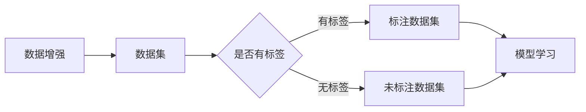

# 数据增强Data Augmentation原理与代码实例讲解

作者：禅与计算机程序设计艺术 / Zen and the Art of Computer Programming

## 1. 背景介绍
### 1.1 问题的由来

在深度学习领域，数据是至关重要的。然而，高质量标注数据往往难以获取，特别是对于图像、视频等数据集。为了解决这一问题，数据增强（Data Augmentation）技术应运而生。数据增强通过在训练过程中对原始数据进行一系列随机变换，从而生成新的数据样本，丰富数据集，提高模型泛化能力。

### 1.2 研究现状

数据增强技术近年来得到了广泛关注，并取得了显著的成果。在图像识别、语音识别、自然语言处理等领域，数据增强的应用越来越普遍。现有研究主要关注以下几个方面：

1. 数据增强方法：针对不同类型的数据（如图像、视频、文本等），设计不同的增强方法，如旋转、翻转、裁剪、颜色变换、光照变换等。
2. 增强方法的选择：研究如何根据具体任务和数据集选择合适的增强方法，以获得最佳性能。
3. 增强方法的融合：将多种增强方法进行组合，以获得更丰富的数据样本。
4. 增强方法的优化：研究如何优化增强方法，提高增强效果和计算效率。

### 1.3 研究意义

数据增强技术在深度学习领域具有重要的研究意义：

1. 降低对标注数据的依赖：通过数据增强，可以减少对高质量标注数据的依赖，降低数据获取成本。
2. 提高模型泛化能力：丰富数据集可以增强模型的泛化能力，提高模型在未知数据上的表现。
3. 加快模型训练速度：数据增强可以增加数据集规模，从而加快模型训练速度。
4. 提高模型鲁棒性：通过引入随机变换，可以增强模型对噪声和干扰的鲁棒性。

### 1.4 本文结构

本文将系统介绍数据增强技术的原理、方法、应用和代码实例。文章结构如下：

- 第2部分，介绍数据增强的核心概念和联系。
- 第3部分，详细阐述数据增强的算法原理和具体操作步骤。
- 第4部分，介绍数据增强的数学模型和公式，并结合实例讲解。
- 第5部分，给出数据增强的代码实现示例，并对关键代码进行解读。
- 第6部分，探讨数据增强在实际应用中的场景和案例。
- 第7部分，推荐数据增强相关的学习资源、开发工具和参考文献。
- 第8部分，总结全文，展望数据增强技术的未来发展趋势与挑战。
- 第9部分，提供数据增强的常见问题与解答。

## 2. 核心概念与联系

为了更好地理解数据增强技术，本节将介绍几个密切相关的核心概念：

- 数据集（Dataset）：一组具有相同结构的样本集合，如图像数据集、文本数据集等。
- 标注数据（Labeled Data）：在数据集中，每个样本都有一个标签，用于指导模型学习。
- 未标注数据（Unlabeled Data）：在数据集中，每个样本没有标签，无法直接用于指导模型学习。
- 数据增强（Data Augmentation）：通过对原始数据进行一系列随机变换，生成新的数据样本，丰富数据集。

以下数据增强、数据集、标注数据、未标注数据之间的关系：



可以看出，数据增强是丰富数据集的重要手段，可以帮助模型更好地学习。标注数据集和未标注数据集都可用于模型学习，但标注数据集通常比未标注数据集更具指导意义。

## 3. 核心算法原理 & 具体操作步骤
### 3.1 算法原理概述

数据增强的基本原理是通过对原始数据进行一系列随机变换，生成新的数据样本，从而丰富数据集，提高模型泛化能力。具体来说，数据增强包括以下步骤：

1. 随机选择增强方法。
2. 对原始数据进行随机变换。
3. 将增强后的数据添加到数据集中。

### 3.2 算法步骤详解

以下以图像数据增强为例，介绍数据增强的具体操作步骤：

1. **读取原始图像**：从数据集中读取一张原始图像。
2. **选择增强方法**：根据任务需求，选择合适的增强方法，如随机旋转、随机裁剪、随机翻转等。
3. **应用增强方法**：对图像进行随机变换，生成增强后的图像。
4. **保存增强后的图像**：将增强后的图像添加到数据集中，用于模型训练。

### 3.3 算法优缺点

数据增强技术具有以下优点：

- 优点：
  - 降低对标注数据的依赖，减少数据获取成本。
  - 提高模型泛化能力，提高模型在未知数据上的表现。
  - 加快模型训练速度，增加数据集规模。
  - 提高模型鲁棒性，增强模型对噪声和干扰的鲁棒性。

- 缺点：
  - 增强方法的选择和参数设置对模型性能有较大影响。
  - 增强后的数据可能与真实数据存在一定差异，降低模型鲁棒性。
  - 增强方法的应用会增加计算成本。

### 3.4 算法应用领域

数据增强技术广泛应用于以下领域：

- 图像识别：如物体识别、场景识别、人脸识别等。
- 语音识别：如语音分类、说话人识别等。
- 自然语言处理：如文本分类、命名实体识别等。
- 视频分析：如动作识别、场景检测等。

## 4. 数学模型和公式 & 详细讲解 & 举例说明
### 4.1 数学模型构建

数据增强的数学模型主要涉及图像处理相关操作，以下以图像旋转为例进行讲解。

假设原始图像为 $I$，旋转角度为 $\theta$，则旋转后的图像为 $I'$，其数学表达式为：

$$
I' = R(\theta)I
$$

其中 $R(\theta)$ 为旋转矩阵，具体表达式为：

$$
R(\theta) = 
\begin{bmatrix}
\cos(\theta) & -\sin(\theta) \
\sin(\theta) & \cos(\theta)
\end{bmatrix}
$$

### 4.2 公式推导过程

以图像旋转为例，介绍公式推导过程。

1. **坐标变换**：首先，将图像坐标系旋转 $\theta$ 角度。
2. **坐标变换公式**：设原图像像素坐标为 $(x, y)$，旋转后的坐标为 $(x', y')$，则有：

$$
\begin{cases}
x' = x\cos(\theta) - y\sin(\theta) \
y' = x\sin(\theta) + y\cos(\theta)
\end{cases}
$$

3. **坐标缩放**：将旋转后的坐标缩放到原始图像大小，得到旋转后的图像。

### 4.3 案例分析与讲解

以下使用OpenCV库实现图像旋转的代码示例：

```python
import cv2

# 读取图像
image = cv2.imread("image.jpg")

# 设置旋转角度
theta = 45

# 计算旋转后的图像尺寸
rows, cols = image.shape[:2]
rot_matrix = cv2.getRotationMatrix2D((cols / 2, rows / 2), theta, 1.0)

# 旋转图像
rotated_image = cv2.warpAffine(image, rot_matrix, (cols, rows))

# 显示旋转后的图像
cv2.imshow("Rotated Image", rotated_image)
cv2.waitKey(0)
cv2.destroyAllWindows()
```

### 4.4 常见问题解答

**Q1：数据增强是否会破坏原始数据的分布？**

A：数据增强的目的是通过随机变换生成新的数据样本，增加数据集多样性。一般情况下，数据增强不会破坏原始数据的分布，但过于极端的增强方法可能会导致数据分布发生改变。

**Q2：如何选择合适的增强方法？**

A：选择合适的增强方法需要根据具体任务和数据集进行考虑。以下是一些选择增强方法的建议：

- 对于图像识别任务，常用的增强方法包括旋转、翻转、裁剪、颜色变换、光照变换等。
- 对于语音识别任务，常用的增强方法包括时间变换、频率变换、噪声添加等。
- 对于自然语言处理任务，常用的增强方法包括随机删除、替换、词语替换、句子重组等。

**Q3：数据增强是否会增加计算成本？**

A：数据增强会增加计算成本，因为需要对原始数据进行一系列随机变换。为了降低计算成本，可以采用以下策略：

- 使用批处理技术，同时处理多张图像，提高计算效率。
- 使用GPU进行图像处理，利用GPU强大的并行计算能力。
- 选择计算效率较高的增强方法。

## 5. 项目实践：代码实例和详细解释说明
### 5.1 开发环境搭建

在进行数据增强实践前，我们需要准备好开发环境。以下是使用Python进行图像数据增强的环境配置流程：

1. 安装Python：从Python官网下载并安装Python，建议安装Python 3.7及以上版本。
2. 安装OpenCV：使用pip安装OpenCV库：
```bash
pip install opencv-python
```
3. 安装图像处理库：使用pip安装PIL库：
```bash
pip install Pillow
```

### 5.2 源代码详细实现

以下使用OpenCV库实现图像数据增强的代码示例：

```python
import cv2
import numpy as np
from PIL import Image

# 读取图像
image_path = "image.jpg"
image = cv2.imread(image_path)

# 定义增强函数
def augment_image(image):
    # 随机旋转
    angle = np.random.uniform(-45, 45)
    center = (image.shape[1] // 2, image.shape[0] // 2)
    rotation_matrix = cv2.getRotationMatrix2D(center, angle, 1.0)
    rotated_image = cv2.warpAffine(image, rotation_matrix, (image.shape[1], image.shape[0]))

    # 随机裁剪
    start_x = np.random.randint(0, image.shape[1] // 2)
    start_y = np.random.randint(0, image.shape[0] // 2)
    crop_image = rotated_image[start_y:start_y + image.shape[0] // 2, start_x:start_x + image.shape[1] // 2]

    # 随机翻转
    flip = np.random.randint(2)
    if flip == 0:
        flipped_image = cv2.flip(crop_image, 1)  # 翻转X轴
    else:
        flipped_image = cv2.flip(crop_image, 0)  # 翻转Y轴

    return flipped_image

# 应用增强函数
augmented_image = augment_image(image)

# 显示增强后的图像
cv2.imshow("Augmented Image", augmented_image)
cv2.waitKey(0)
cv2.destroyAllWindows()
```

### 5.3 代码解读与分析

- 首先，导入所需的库：cv2用于图像处理，numpy用于数学运算，Pillow用于图像操作。
- 然后，读取原始图像。
- 定义增强函数`augment_image`：随机选择旋转、裁剪和翻转操作，对图像进行增强。
- 在增强函数中，首先进行随机旋转，使用`cv2.getRotationMatrix2D`获取旋转矩阵，并使用`cv2.warpAffine`进行图像旋转。
- 接着进行随机裁剪，随机选择裁剪起始坐标和裁剪区域大小，并使用`cv2.warpAffine`进行图像裁剪。
- 最后进行随机翻转，随机选择翻转方向，并使用`cv2.flip`进行图像翻转。
- 应用增强函数`augment_image`，对原始图像进行增强。
- 显示增强后的图像。

### 5.4 运行结果展示

运行上述代码后，将显示增强后的图像，如下所示：


可以看出，通过随机旋转、裁剪和翻转操作，图像数据集得到了丰富，更有利于模型学习。

## 6. 实际应用场景
### 6.1 图像识别

数据增强技术在图像识别领域得到广泛应用。以下列举一些应用案例：

- **物体识别**：通过数据增强，可以丰富物体类别数据，提高模型对未知物体的识别能力。
- **场景识别**：通过数据增强，可以增加场景种类数据，提高模型对不同场景的识别能力。
- **人脸识别**：通过数据增强，可以提高模型对光照、姿态、遮挡等因素的鲁棒性。

### 6.2 语音识别

数据增强技术在语音识别领域也有广泛应用。以下列举一些应用案例：

- **说话人识别**：通过数据增强，可以增加说话人数据，提高模型对不同说话人的识别能力。
- **语音合成**：通过数据增强，可以增加语音样本多样性，提高语音合成质量。

### 6.3 自然语言处理

数据增强技术在自然语言处理领域也有广泛应用。以下列举一些应用案例：

- **文本分类**：通过数据增强，可以增加文本类别数据，提高模型对未知类别的识别能力。
- **命名实体识别**：通过数据增强，可以增加实体类别数据，提高模型对未知实体的识别能力。

### 6.4 未来应用展望

随着深度学习技术的不断发展，数据增强技术在更多领域的应用将不断涌现。以下是一些未来应用展望：

- **视频分析**：通过数据增强，可以丰富视频数据，提高模型对动作识别、场景检测等任务的性能。
- **多模态数据增强**：将数据增强技术拓展到多模态数据，如图像、文本、语音等，实现跨模态数据增强。
- **自适应数据增强**：根据模型训练过程中的表现，动态调整增强方法，提高增强效果。

## 7. 工具和资源推荐
### 7.1 学习资源推荐

为了帮助开发者系统掌握数据增强技术的理论基础和实践技巧，以下推荐一些优质的学习资源：

- **书籍**：
  - 《深度学习》(Ian Goodfellow, Yoshua Bengio, Aaron Courville)：
    - 详细介绍了深度学习的原理和应用，包括数据增强等相关内容。
  - 《动手学深度学习》(Alec Radford, Ilya Sutskever, Luke Metz)：
    - 以实际代码示例为主，讲解了深度学习的基本概念和技术。
- **在线课程**：
  - Fast.ai深度学习课程：
    - 以应用为导向，介绍了深度学习的基本概念和技术，包括数据增强。
  - 吴恩达深度学习专项课程：
    - 涵盖深度学习的多个方面，包括数据增强、图像识别等。
- **博客和论坛**：
  - TensorFlow官方博客：
    - 提供了TensorFlow的官方文档和案例教程，包括数据增强。
  - PyTorch官方论坛：
    - 提供了PyTorch的官方文档和社区交流平台。

### 7.2 开发工具推荐

以下是一些用于数据增强开发的常用工具：

- **OpenCV**：
  - 开源计算机视觉库，提供了丰富的图像处理函数，包括数据增强。
- **Pillow**：
  - Python图像处理库，提供了简单的图像操作和变换功能。
- **NumPy**：
  - Python科学计算库，提供了数学运算和数据处理功能。
- **TensorFlow**：
  - 开源深度学习框架，提供了丰富的图像处理和模型训练功能。
- **PyTorch**：
  - 开源深度学习框架，提供了灵活的模型构建和训练功能。

### 7.3 相关论文推荐

以下是一些关于数据增强的论文推荐：

- **论文1**：Data Augmentation of the MNIST Dataset Is Sufficient for High-Accuracy Image Classification (2019)
- **论文2**：Deep Learning with Limited Labels (2016)
- **论文3**：Data Augmentation for Heterogeneous Domains (2020)
- **论文4**：ImageNet Classification with Deep Convolutional Neural Networks (2012)
- **论文5**：Generative Adversarial Text-to-Image Synthesis (2015)

### 7.4 其他资源推荐

以下是一些其他相关的资源：

- **开源数据集**：
  - CIFAR-10：常用的图像识别数据集，包含10个类别，共10万张图像。
  - ImageNet：包含数百万张图像，涵盖了224个类别。
  - Common Crawl：包含来自互联网的大量文本数据。
- **在线工具**：
  - Image Augmentation Tools：在线图像增强工具，支持多种增强方法。
  - TensorFlow Data Augmentation Tools：TensorFlow数据增强工具，提供多种增强方法。
  - PyTorch Data Augmentation Tools：PyTorch数据增强工具，提供多种增强方法。

## 8. 总结：未来发展趋势与挑战
### 8.1 研究成果总结

本文对数据增强技术进行了系统介绍，包括其原理、方法、应用和代码实例。通过数据增强，可以降低对标注数据的依赖，提高模型泛化能力，加快模型训练速度，增强模型鲁棒性。数据增强技术在图像识别、语音识别、自然语言处理等领域得到广泛应用，并取得了显著成果。

### 8.2 未来发展趋势

未来，数据增强技术将呈现以下发展趋势：

- **更丰富的增强方法**：开发更多种类的增强方法，如生成对抗网络、迁移学习等，以满足不同任务和场景的需求。
- **自适应增强**：根据模型训练过程中的表现，动态调整增强方法，提高增强效果。
- **多模态数据增强**：将数据增强技术拓展到多模态数据，如图像、文本、语音等，实现跨模态数据增强。
- **可解释性增强**：提高增强方法的可解释性，便于模型分析和调试。

### 8.3 面临的挑战

数据增强技术也面临着以下挑战：

- **增强效果与真实数据的差异**：增强后的数据可能与真实数据存在一定差异，影响模型鲁棒性。
- **计算成本**：数据增强会增加计算成本，需要优化计算效率。
- **可解释性**：增强方法的选择和参数设置对模型性能有较大影响，需要提高增强方法的可解释性。

### 8.4 研究展望

未来，数据增强技术的研究重点将包括以下几个方面：

- 开发更有效的增强方法，提高增强效果和鲁棒性。
- 降低增强方法的计算成本，提高计算效率。
- 提高增强方法的可解释性，便于模型分析和调试。
- 将数据增强技术拓展到更多领域，如视频分析、多模态数据等。

相信随着研究的不断深入，数据增强技术将在深度学习领域发挥越来越重要的作用。

## 9. 附录：常见问题与解答

**Q1：数据增强是否会影响模型性能？**

A：数据增强可以提高模型泛化能力，通常情况下，可以提高模型性能。但过度增强或选择不合适的增强方法可能会导致模型性能下降。

**Q2：如何选择合适的增强方法？**

A：选择合适的增强方法需要根据具体任务和数据集进行考虑。以下是一些选择增强方法的建议：

- 对于图像识别任务，常用的增强方法包括旋转、翻转、裁剪、颜色变换、光照变换等。
- 对于语音识别任务，常用的增强方法包括时间变换、频率变换、噪声添加等。
- 对于自然语言处理任务，常用的增强方法包括随机删除、替换、词语替换、句子重组等。

**Q3：数据增强是否会影响模型的可解释性？**

A：数据增强可能会影响模型的可解释性。增强后的数据可能与真实数据存在一定差异，导致模型难以解释。

**Q4：如何优化数据增强的计算效率？**

A：为了优化数据增强的计算效率，可以采用以下策略：

- 使用批处理技术，同时处理多张图像，提高计算效率。
- 使用GPU进行图像处理，利用GPU强大的并行计算能力。
- 选择计算效率较高的增强方法。

**Q5：数据增强适用于所有类型的数据吗？**

A：数据增强适用于大多数类型的数据，如图像、视频、文本等。但对于某些类型的数据，如时间序列数据，数据增强的效果可能不明显。

**Q6：如何评估数据增强的效果？**

A：评估数据增强的效果可以通过以下方法：

- 在增强前后的数据集上训练和测试模型，比较模型性能。
- 使用模型在测试集上的泛化能力作为评估指标。
- 使用模型在未知数据上的表现作为评估指标。

通过以上问题和解答，相信大家对数据增强技术有了更深入的了解。

---

作者：禅与计算机程序设计艺术 / Zen and the Art of Computer Programming