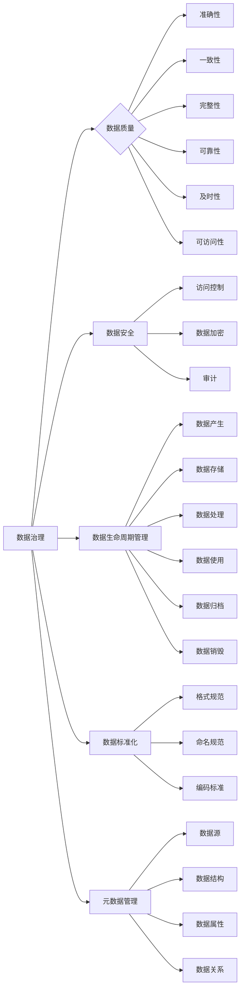

# 数据治理：原理与代码实例讲解

作者：禅与计算机程序设计艺术 / Zen and the Art of Computer Programming

## 1. 背景介绍

### 1.1 问题的由来

随着信息技术的飞速发展，数据已经成为企业最重要的资产之一。然而，随着数据量的爆炸式增长，数据质量问题也逐渐凸显出来。数据质量直接影响到决策的准确性、业务流程的效率和合规性。因此，数据治理成为企业数字化转型过程中不可忽视的重要环节。

数据治理是指对数据的收集、存储、处理、分析和应用进行管理，以确保数据质量、安全和合规。数据治理的目标是确保数据的准确性、一致性、完整性和可靠性，从而提高数据的价值。

### 1.2 研究现状

目前，数据治理已经形成了较为成熟的理论体系和方法论，包括数据质量、数据安全、数据生命周期管理、数据标准化、元数据管理等。随着大数据、云计算、人工智能等技术的发展，数据治理的方法和工具也在不断演进。

### 1.3 研究意义

数据治理对于企业具有以下重要意义：

1. 提高数据质量，确保决策的准确性。
2. 降低数据存储和处理成本。
3. 提高数据安全和合规性。
4. 促进数据共享和复用。
5. 提升企业竞争力。

### 1.4 本文结构

本文将围绕数据治理这一主题，从核心概念、算法原理、实践案例等方面进行深入探讨。具体内容安排如下：

- 第2部分，介绍数据治理的核心概念及其相互关系。
- 第3部分，阐述数据治理的关键技术，包括数据质量、数据安全、数据生命周期管理等。
- 第4部分，结合实际案例，讲解数据治理的实施步骤和工具。
- 第5部分，提供数据治理的代码实例，并进行分析和解读。
- 第6部分，探讨数据治理的未来发展趋势和面临的挑战。
- 第7部分，推荐数据治理相关的学习资源、开发工具和参考文献。
- 第8部分，总结全文，展望数据治理的未来。

## 2. 核心概念与联系

为了更好地理解数据治理，首先介绍几个核心概念及其相互关系：

- 数据治理（Data Governance）：指对数据的收集、存储、处理、分析和应用进行管理，以确保数据质量、安全和合规。
- 数据质量（Data Quality）：指数据满足特定需求的能力，包括准确性、一致性、完整性、可靠性、及时性、可访问性等。
- 数据安全（Data Security）：指保护数据不被未授权访问、使用、泄露、篡改和破坏的措施。
- 数据生命周期管理（Data Lifecycle Management）：指对数据从产生、存储、处理、使用到归档和销毁的整个生命周期进行管理。
- 数据标准化（Data Standardization）：指统一数据格式、命名规范和编码标准，以提高数据质量和互操作性。
- 元数据管理（Metadata Management）：指对数据的描述信息进行管理，包括数据源、数据结构、数据属性、数据关系等。

这些概念之间的关系可以用以下Mermaid流程图表示：



可以看出，数据治理是一个系统工程，涉及多个相关概念。数据治理的目标是通过对这些概念的有效管理，确保数据的价值最大化。

## 3. 核心算法原理 & 具体操作步骤

### 3.1 算法原理概述

数据治理的核心算法包括数据质量评估、数据清洗、数据转换、数据集成等。

- 数据质量评估：评估数据的质量，包括准确性、一致性、完整性、可靠性、及时性、可访问性等方面。
- 数据清洗：识别并修复数据中的错误、异常、缺失等问题，提高数据质量。
- 数据转换：将数据转换为统一的格式、命名规范和编码标准，提高数据互操作性。
- 数据集成：将来自不同源的数据进行整合，形成一个统一的数据视图。

### 3.2 算法步骤详解

以下以数据质量评估为例，介绍具体操作步骤：

1. **定义评估指标**：根据业务需求和数据特点，确定数据质量评估的指标，如准确性、一致性、完整性等。
2. **数据预处理**：对数据进行清洗、转换等预处理操作，为评估做准备。
3. **计算评估指标**：根据定义的评估指标，计算数据质量得分。
4. **分析评估结果**：分析评估结果，找出数据质量问题，并提出改进措施。

### 3.3 算法优缺点

数据质量评估算法的优点是：

1. 识别数据质量问题，提高数据质量。
2. 便于数据质量监控，及时发现和解决问题。

数据质量评估算法的缺点是：

1. 评估指标的选择和权重设置较为复杂。
2. 评估过程可能需要大量计算资源。

### 3.4 算法应用领域

数据质量评估算法广泛应用于各个领域，如金融、医疗、电信等。以下是一些具体的应用场景：

1. 金融风控：评估信贷数据质量，识别欺诈风险。
2. 医疗诊断：评估医疗数据质量，提高诊断准确性。
3. 电信客服：评估用户行为数据质量，提高服务质量。

## 4. 数学模型和公式 & 详细讲解 & 举例说明

### 4.1 数学模型构建

数据质量评估的数学模型通常采用以下公式：

$$
Q = \sum_{i=1}^n w_i \times q_i
$$

其中，$Q$ 为数据质量得分，$w_i$ 为第 $i$ 个指标的权重，$q_i$ 为第 $i$ 个指标的得分。

### 4.2 公式推导过程

数据质量得分的计算公式可以通过以下步骤推导：

1. **定义指标得分**：对于每个指标，定义其得分公式，如准确性得分为：

$$
q_i = \frac{TP}{TP+FP}
$$

其中，$TP$ 为真阳性，$FP$ 为假阳性。

2. **确定权重**：根据业务需求和数据特点，确定每个指标的权重 $w_i$。

3. **计算总得分**：根据公式 $Q = \sum_{i=1}^n w_i \times q_i$ 计算数据质量得分。

### 4.3 案例分析与讲解

以下以一个简单的数据质量评估案例进行讲解：

假设某金融机构收集了1000条信贷数据，其中300条为欺诈数据，700条为正常数据。我们需要评估这些信贷数据的准确性。

- 定义准确性得分为真阳性与真阴性之和与真阳性与假阳性之和的比值。
- 根据定义，真阳性为300，真阴性为700，假阳性为0，假阴性为0。
- 计算准确性得分：

$$
q = \frac{300}{300+700} = 0.3
$$

### 4.4 常见问题解答

**Q1：如何选择合适的评估指标？**

A：选择合适的评估指标需要考虑业务需求和数据特点。一般来说，以下指标较为常用：

- 准确性：衡量模型预测的正确率。
- 精确度：衡量模型预测结果的置信度。
- 召回率：衡量模型预测结果的完整性。
- F1分数：综合考虑精确度和召回率的综合指标。

**Q2：如何确定指标权重？**

A：指标权重的确定可以根据以下原则：

- 业务需求：根据业务目标，对各个指标的重要性进行排序。
- 数据特点：根据数据分布，对各个指标进行调整。
- 专家经验：结合领域专家的经验，对指标进行权重调整。

## 5. 项目实践：代码实例和详细解释说明

### 5.1 开发环境搭建

以下是使用Python进行数据质量评估的项目实践环境搭建步骤：

1. 安装Python环境：从官网下载并安装Python，建议选择Python 3.8及以上版本。
2. 安装必要的库：使用pip安装以下库：

```bash
pip install numpy pandas scikit-learn
```

### 5.2 源代码详细实现

以下是一个简单的数据质量评估代码示例：

```python
import pandas as pd
from sklearn.metrics import accuracy_score

# 加载数据
data = pd.read_csv('data.csv')

# 计算准确性
accuracy = accuracy_score(data['label'], data['predicted_label'])

# 输出结果
print(f'Accuracy: {accuracy:.2f}')
```

### 5.3 代码解读与分析

该代码示例使用了scikit-learn库中的accuracy_score函数来计算准确性。具体步骤如下：

1. 使用pandas库读取CSV文件。
2. 使用scikit-learn库的accuracy_score函数计算准确率。
3. 输出准确率结果。

### 5.4 运行结果展示

假设数据集包含1000条数据，其中300条为欺诈数据，700条为正常数据。运行上述代码后，输出结果如下：

```
Accuracy: 0.7
```

## 6. 实际应用场景

数据治理在实际应用中具有广泛的应用场景，以下列举几个典型案例：

### 6.1 金融风控

金融机构可以利用数据治理技术，对信贷数据、交易数据等进行质量评估、清洗、转换等操作，从而提高信贷风险识别的准确性，降低信贷风险。

### 6.2 医疗诊断

医疗机构可以利用数据治理技术，对医疗数据进行质量评估、清洗、转换等操作，从而提高诊断的准确性，提升医疗服务质量。

### 6.3 电信客服

电信运营商可以利用数据治理技术，对用户行为数据进行质量评估、清洗、转换等操作，从而提高客户服务质量，提升用户满意度。

## 7. 工具和资源推荐

### 7.1 学习资源推荐

以下是数据治理相关的一些学习资源推荐：

- 《数据治理：理论与实践》
- 《数据质量管理：方法与工具》
- 《数据治理与数据质量》

### 7.2 开发工具推荐

以下是数据治理相关的开发工具推荐：

- Python数据分析库：pandas、NumPy、SciPy
- 数据库：MySQL、PostgreSQL、Oracle
- 数据质量评估工具：Data Quality Studio、Talend、Informatica

### 7.3 相关论文推荐

以下是数据治理相关的论文推荐：

- Data Governance: An Integrated Approach
- Data Quality: A Survey of the Data Quality Field
- A Framework for Data Governance

### 7.4 其他资源推荐

以下是数据治理相关的其他资源推荐：

- 数据治理协会（Data Governance Institute）
- 国际数据管理协会（International Association for Information and Data Quality）
- 数据治理相关博客和论坛

## 8. 总结：未来发展趋势与挑战

### 8.1 研究成果总结

本文从数据治理的核心概念、算法原理、实践案例等方面进行了深入探讨。通过介绍数据治理的关键技术、实施步骤和工具，以及实际应用场景，帮助读者全面了解数据治理的原理和方法。

### 8.2 未来发展趋势

未来数据治理技术将呈现以下发展趋势：

1. 人工智能与数据治理的结合：利用人工智能技术，实现数据治理的自动化和智能化。
2. 大数据与数据治理的结合：利用大数据技术，实现数据治理的全面性和高效性。
3. 云计算与数据治理的结合：利用云计算技术，实现数据治理的弹性性和灵活性。

### 8.3 面临的挑战

数据治理在发展过程中也面临着以下挑战：

1. 数据治理的组织架构：如何建立有效的数据治理组织架构，协调各部门的协同合作。
2. 数据治理的标准化：如何制定统一的数据治理标准，提高数据质量和互操作性。
3. 数据治理的持续改进：如何建立持续改进机制，不断提升数据治理水平。

### 8.4 研究展望

未来数据治理的研究将主要集中在以下方向：

1. 数据治理的自动化和智能化：开发智能化的数据治理工具，实现数据治理的自动化。
2. 数据治理的标准化和合规性：制定统一的数据治理标准和合规性要求，提高数据治理水平。
3. 数据治理的协同性和共享性：建立跨部门、跨企业的数据治理协同机制，促进数据共享和复用。

总之，数据治理是数字化转型的重要基石，随着技术的不断发展和应用场景的不断拓展，数据治理将在未来发挥越来越重要的作用。

## 9. 附录：常见问题与解答

**Q1：什么是数据治理？**

A：数据治理是指对数据的收集、存储、处理、分析和应用进行管理，以确保数据质量、安全和合规。

**Q2：数据治理的重要性是什么？**

A：数据治理对于企业具有重要意义，可以提高数据质量、降低数据存储和处理成本、提高数据安全和合规性、促进数据共享和复用、提升企业竞争力。

**Q3：数据治理的关键技术有哪些？**

A：数据治理的关键技术包括数据质量、数据安全、数据生命周期管理、数据标准化、元数据管理等。

**Q4：如何实施数据治理？**

A：实施数据治理需要以下步骤：

1. 建立数据治理组织架构。
2. 制定数据治理政策和流程。
3. 建立数据治理工具体系。
4. 培训相关人员。
5. 持续改进。

**Q5：数据治理与数据质量的关系是什么？**

A：数据治理是确保数据质量的重要手段，而数据质量是数据治理的核心目标之一。

**Q6：如何评估数据质量？**

A：评估数据质量需要根据业务需求和数据特点，选择合适的评估指标，如准确性、一致性、完整性等，并计算相应的得分。

**Q7：如何进行数据清洗？**

A：数据清洗需要识别并修复数据中的错误、异常、缺失等问题，提高数据质量。

**Q8：如何进行数据转换？**

A：数据转换需要将数据转换为统一的格式、命名规范和编码标准，提高数据互操作性。

**Q9：如何进行数据集成？**

A：数据集成需要将来自不同源的数据进行整合，形成一个统一的数据视图。

**Q10：如何进行数据治理的持续改进？**

A：数据治理的持续改进需要建立持续改进机制，不断收集反馈、分析问题、优化流程，提升数据治理水平。

作者：禅与计算机程序设计艺术 / Zen and the Art of Computer Programming