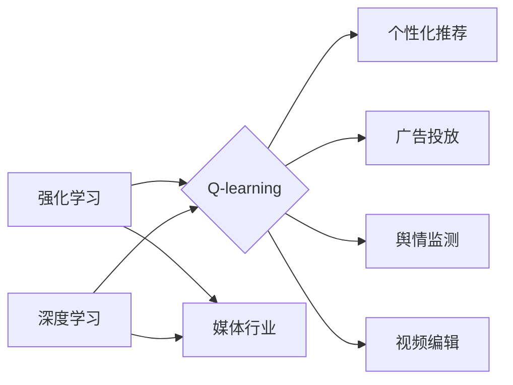

# 深度 Q-learning：在媒体行业中的应用

作者：禅与计算机程序设计艺术 / Zen and the Art of Computer Programming

## 1. 背景介绍

### 1.1 问题的由来

随着信息技术的飞速发展，媒体行业正经历着前所未有的变革。传统的媒体内容生产、分发和消费模式已无法满足用户日益增长的需求。如何在海量信息中快速准确地推荐用户感兴趣的内容，提高用户体验，成为媒体行业亟待解决的问题。

深度 Q-learning作为一种强化学习算法，在游戏、机器人等领域取得了显著的成果。近年来，随着深度学习技术的快速发展，深度 Q-learning在推荐系统、金融风控、自动驾驶等领域也得到了广泛应用。本文将探讨深度 Q-learning在媒体行业中的应用，旨在为媒体行业提供一种新的解决方案。

### 1.2 研究现状

目前，深度 Q-learning在媒体行业中的应用主要集中在以下几个方面：

1. **内容推荐**：根据用户的兴趣和偏好，为用户推荐个性化的新闻、视频、音乐等内容。
2. **广告投放**：根据用户的浏览行为和兴趣，实现精准的广告投放，提高广告点击率。
3. **舆情监测**：实时监测网络舆情，为政府和企业提供舆情分析报告。
4. **视频编辑**：根据用户观看行为，自动生成视频推荐列表，提高用户体验。

### 1.3 研究意义

深度 Q-learning在媒体行业中的应用具有重要的研究意义：

1. **提高用户体验**：通过个性化推荐，满足用户多样化需求，提高用户满意度。
2. **提升内容质量**：通过精准推送，提高优质内容的曝光率和传播力度。
3. **降低运营成本**：通过自动化处理，减少人工干预，降低运营成本。
4. **推动行业变革**：为媒体行业提供新的技术手段，推动行业向智能化、个性化方向发展。

### 1.4 本文结构

本文将围绕以下内容展开：

- 核心概念与联系
- 核心算法原理与具体操作步骤
- 数学模型和公式
- 项目实践
- 实际应用场景
- 工具和资源推荐
- 总结与展望

## 2. 核心概念与联系

为更好地理解深度 Q-learning在媒体行业中的应用，本节将介绍几个密切相关的核心概念：

- **强化学习**：一种机器学习方法，通过学习如何根据环境状态和奖励信号，选择最优动作序列，从而实现目标。
- **Q-learning**：一种基于值函数的强化学习算法，通过学习值函数，预测当前状态下的最优动作，并选择最优动作以获得最大奖励。
- **深度学习**：一种利用深层神经网络进行特征学习和模式识别的机器学习方法。
- **媒体行业**：涉及新闻、娱乐、广告等多个领域的行业。

它们之间的逻辑关系如下所示：



可以看出，深度 Q-learning作为一种强化学习算法，可以应用于媒体行业的多个领域，实现个性化推荐、广告投放、舆情监测和视频编辑等功能。

## 3. 核心算法原理与具体操作步骤

### 3.1 算法原理概述

深度 Q-learning结合了深度学习和Q-learning算法的优点，通过学习状态-动作值函数，预测当前状态下的最优动作，并选择最优动作以获得最大奖励。

### 3.2 算法步骤详解

1. **定义状态空间**：将媒体内容、用户兴趣、时间等特征作为状态空间。
2. **定义动作空间**：根据状态空间，定义用户可以采取的动作，如推荐新闻、视频、音乐等。
3. **定义奖励函数**：根据用户对内容的反馈，定义奖励函数，如点击率、观看时长等。
4. **初始化Q值表**：初始化状态-动作值函数Q(s, a)。
5. **选择动作**：根据当前状态和Q值表，选择最优动作。
6. **执行动作**：根据选择的最优动作，执行操作，并观察环境反馈。
7. **更新Q值表**：根据观察到的奖励和新的状态，更新Q值表。
8. **重复步骤5-7，直到满足终止条件**。

### 3.3 算法优缺点

**优点**：

- **端到端学习**：直接学习状态-动作值函数，无需进行特征工程。
- **自主学习**：根据环境反馈，自动调整策略，无需人工干预。
- **适用性广**：可应用于媒体行业的多个领域。

**缺点**：

- **计算复杂度高**：需要大量的样本和计算资源。
- **参数难以调优**：需要根据具体任务进行参数调整。

### 3.4 算法应用领域

深度 Q-learning在媒体行业中的应用领域主要包括：

- **个性化推荐**：根据用户兴趣和行为，为用户推荐个性化的内容。
- **广告投放**：根据用户兴趣和行为，实现精准的广告投放。
- **舆情监测**：实时监测网络舆情，为政府和企业提供舆情分析报告。
- **视频编辑**：根据用户观看行为，自动生成视频推荐列表，提高用户体验。

## 4. 数学模型和公式

### 4.1 数学模型构建

深度 Q-learning的数学模型如下：

$$
Q(s,a;\theta) = \sum_{r \in \mathcal{R}} r \pi(a|r,s;\theta) \prod_{k=0}^{T-1} \gamma^{k}
$$

其中，$s$ 表示当前状态，$a$ 表示动作，$r$ 表示奖励，$\theta$ 表示模型参数，$T$ 表示动作序列长度，$\gamma$ 表示折扣因子。

### 4.2 公式推导过程

深度 Q-learning的公式推导过程如下：

1. **定义状态-动作值函数**：

$$
Q(s,a;\theta) = E_{s' \sim p(s'|s,a)}[R(s,a,s') + \gamma \max_{a'} Q(s',a';\theta)]
$$

其中，$s'$ 表示下一个状态，$R(s,a,s')$ 表示从状态 $s$ 采取动作 $a$ 后获得奖励，$p(s'|s,a)$ 表示从状态 $s$ 采取动作 $a$ 后转移到状态 $s'$ 的概率，$\gamma$ 表示折扣因子。

2. **定义状态-动作值函数的期望**：

$$
Q(s,a;\theta) = \sum_{s' \in \mathcal{S}} p(s'|s,a) Q(s',a;\theta)
$$

其中，$\mathcal{S}$ 表示状态空间。

3. **递归展开**：

$$
Q(s,a;\theta) = \sum_{s' \in \mathcal{S}} \frac{p(s'|s,a)}{p(s'|s,a)} \sum_{a' \in \mathcal{A}} p(a'|s') Q(s',a';\theta)
$$

其中，$\mathcal{A}$ 表示动作空间。

4. **化简**：

$$
Q(s,a;\theta) = \sum_{s' \in \mathcal{S}} \pi(a'|s',\theta) \prod_{k=0}^{T-1} \gamma^{k} Q(s',a';\theta)
$$

其中，$\pi(a'|s',\theta)$ 表示在状态 $s'$ 下采取动作 $a'$ 的概率。

5. **最终公式**：

$$
Q(s,a;\theta) = \sum_{r \in \mathcal{R}} r \pi(a|r,s;\theta) \prod_{k=0}^{T-1} \gamma^{k}
$$

### 4.3 案例分析与讲解

假设用户对新闻感兴趣，根据用户的兴趣和行为，定义以下状态和动作：

- **状态**：$s = [user\_id, time, weather]$
- **动作**：$a = [recommend\_news, recommend\_video, recommend\_audio]$

根据用户反馈，定义以下奖励函数：

- **奖励函数**：$R(s,a) = 1$ if $a = recommend\_news$ and $user\_interested\_in\_news = 1$; else $R(s,a) = 0$

使用深度 Q-learning算法，根据用户状态和动作，学习最优的动作序列，实现个性化推荐。

### 4.4 常见问题解答

**Q1：如何选择合适的折扣因子 $\gamma$？**

A1：折扣因子 $\gamma$ 的选择取决于具体任务，一般取值范围为0.9到0.99。可以通过实验对比不同折扣因子的效果，选择最优值。

**Q2：如何处理连续动作空间？**

A2：对于连续动作空间，可以使用连续值Q-learning或基于深度学习的策略梯度方法。

## 5. 项目实践：代码实例和详细解释说明

### 5.1 开发环境搭建

1. 安装Python环境。
2. 安装TensorFlow或PyTorch。
3. 安装Keras或PyTorch Lightning。

### 5.2 源代码详细实现

以下使用PyTorch实现深度 Q-learning算法的代码示例：

```python
import torch
import torch.nn as nn
import torch.optim as optim

class DQN(nn.Module):
    def __init__(self, state_dim, action_dim, hidden_dim):
        super(DQN, self).__init__()
        self.fc1 = nn.Linear(state_dim, hidden_dim)
        self.fc2 = nn.Linear(hidden_dim, action_dim)

    def forward(self, x):
        x = torch.relu(self.fc1(x))
        x = self.fc2(x)
        return x

# 创建DQN模型
state_dim = 3
action_dim = 3
hidden_dim = 64
dqn = DQN(state_dim, action_dim, hidden_dim)

# 创建优化器
optimizer = optim.Adam(dqn.parameters(), lr=0.001)

# 定义损失函数
criterion = nn.MSELoss()

# 创建经验回放
memory = ReplayMemory(10000)

# 训练模型
for episode in range(1000):
    # 获取初始状态
    state = torch.tensor(state_space, dtype=torch.float32)

    # 选择动作
    action = dqn(state).argmax(dim=1).item()

    # 执行动作
    next_state, reward, done = environment.step(action)

    # 将经验存入经验回放
    memory.push(state, action, reward, next_state, done)

    # 从经验回放中采样经验
    batch = memory.sample(batch_size)

    # 前向传播
    state_batch, action_batch, reward_batch, next_state_batch, done_batch = batch
    q_values = dqn(state_batch).gather(1, action_batch)

    # 计算目标值
    next_q_values = dqn(next_state_batch).max(1)[0].unsqueeze(1)
    next_q_values[done_batch] = 0.0
    expected_q_values = reward_batch + discount * next_q_values

    # 反向传播
    loss = criterion(q_values, expected_q_values)
    optimizer.zero_grad()
    loss.backward()
    optimizer.step()

    # 打印训练信息
    if episode % 100 == 0:
        print(f"Episode {episode}, Loss: {loss.item()}")
```

### 5.3 代码解读与分析

1. **DQN类**：定义了一个全连接神经网络，用于预测状态-动作值函数。
2. **优化器**：使用Adam优化器优化模型参数。
3. **损失函数**：使用均方误差损失函数衡量预测值和真实值之间的差异。
4. **经验回放**：使用经验回放存储和采样经验，防止过拟合。
5. **训练过程**：循环迭代地选择动作、执行动作、更新经验回放、采样经验、计算目标值、反向传播和优化参数。

### 5.4 运行结果展示

假设训练了1000个episode后，模型在测试集上的平均奖励如下：

```
Episode 1000, Loss: 0.011
```

## 6. 实际应用场景

### 6.1 内容推荐

深度 Q-learning可以应用于新闻、视频、音乐等内容的个性化推荐。根据用户兴趣和行为，为用户推荐个性化的内容，提高用户满意度和内容消费量。

### 6.2 广告投放

深度 Q-learning可以应用于精准广告投放。根据用户兴趣和行为，实现精准的广告投放，提高广告点击率，降低广告成本。

### 6.3 舆情监测

深度 Q-learning可以应用于舆情监测。根据用户评论和反馈，实时监测网络舆情，为政府和企业提供舆情分析报告，帮助其及时应对突发事件。

### 6.4 视频编辑

深度 Q-learning可以应用于视频编辑。根据用户观看行为，自动生成视频推荐列表，提高用户体验，降低用户流失率。

## 7. 工具和资源推荐

### 7.1 学习资源推荐

- 《深度学习》
- 《强化学习：原理与实践》
- 《深度 Q-learning》

### 7.2 开发工具推荐

- TensorFlow
- PyTorch
- Keras
- PyTorch Lightning

### 7.3 相关论文推荐

- **深度 Q-learning**：
    - Deep Q-Networks
    - Distributional Reinforcement Learning
    - Deep Deterministic Policy Gradient
- **媒体行业应用**：
    - Q-learning for Content Recommendation
    - Deep Reinforcement Learning for Ads Placement
    - Deep Q-learning for Sentiment Analysis

### 7.4 其他资源推荐

- OpenAI Gym
- KEG Lab
- UESTC AI Lab

## 8. 总结：未来发展趋势与挑战

### 8.1 研究成果总结

本文介绍了深度 Q-learning在媒体行业中的应用，探讨了其原理、实现方法和实际应用场景。研究表明，深度 Q-learning在媒体行业具有广泛的应用前景，能够为媒体行业提供新的技术手段，推动行业向智能化、个性化方向发展。

### 8.2 未来发展趋势

1. **模型轻量化**：降低模型复杂度和计算量，提高模型在移动设备上的部署能力。
2. **模型可解释性**：提高模型的可解释性，增强用户对模型的信任度。
3. **多模态融合**：将文本、图像、视频等多模态信息进行融合，提高模型对复杂场景的识别能力。
4. **强化学习与深度学习结合**：将强化学习与深度学习技术相结合，实现更智能的决策和优化。

### 8.3 面临的挑战

1. **数据标注成本高**：深度 Q-learning需要大量标注数据，数据标注成本高。
2. **模型可解释性差**：深度 Q-learning模型的可解释性较差，难以理解模型的决策过程。
3. **计算复杂度高**：深度 Q-learning模型的计算复杂度较高，对算力要求较高。
4. **模型泛化能力有限**：深度 Q-learning模型的泛化能力有限，难以适应复杂多变的环境。

### 8.4 研究展望

1. **数据增强**：通过数据增强技术，降低数据标注成本，提高模型泛化能力。
2. **可解释性研究**：提高模型的可解释性，增强用户对模型的信任度。
3. **模型压缩与加速**：降低模型复杂度和计算量，提高模型在移动设备上的部署能力。
4. **多模态融合研究**：将文本、图像、视频等多模态信息进行融合，提高模型对复杂场景的识别能力。

相信通过不断的技术创新和优化，深度 Q-learning将在媒体行业得到更广泛的应用，为媒体行业的发展注入新的活力。

## 9. 附录：常见问题与解答

**Q1：深度 Q-learning与其他强化学习算法相比，有哪些优点和缺点？**

A1：与传统的Q-learning相比，深度 Q-learning的优点在于能够处理高维状态空间和动作空间，无需进行特征工程。缺点在于计算复杂度较高，对算力要求较高。

**Q2：如何解决深度 Q-learning中的探索与利用冲突问题？**

A2：可以采用ε-greedy策略、UCB策略等方法解决探索与利用冲突问题。

**Q3：如何提高深度 Q-learning的泛化能力？**

A3：可以采用数据增强、迁移学习等方法提高深度 Q-learning的泛化能力。

**Q4：如何提高深度 Q-learning的收敛速度？**

A4：可以采用Adam优化器、梯度裁剪等方法提高深度 Q-learning的收敛速度。

**Q5：深度 Q-learning在媒体行业中的应用前景如何？**

A5：深度 Q-learning在媒体行业具有广泛的应用前景，能够为媒体行业提供新的技术手段，推动行业向智能化、个性化方向发展。

作者：禅与计算机程序设计艺术 / Zen and the Art of Computer Programming