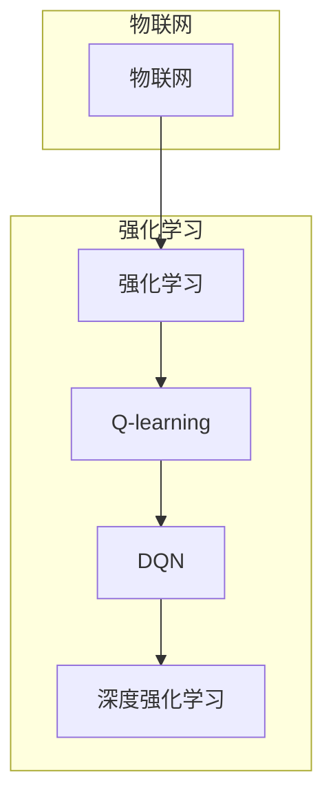

# 深度 Q-learning：在物联网系统中的应用

作者：禅与计算机程序设计艺术 / Zen and the Art of Computer Programming

## 1. 背景介绍

### 1.1 问题的由来

随着物联网（Internet of Things, IoT）技术的快速发展，各类智能设备层出不穷，它们为我们的生活和工作带来了极大的便利。然而，在物联网系统中，如何实现智能设备之间的协同工作，以及如何根据环境变化自适应地调整行为，成为亟待解决的问题。深度 Q-learning作为一种强大的强化学习算法，在解决这些问题方面展现出巨大潜力。

### 1.2 研究现状

近年来，深度 Q-learning在物联网领域得到了广泛关注和应用。研究者们针对不同的应用场景，提出了许多基于深度 Q-learning的物联网系统解决方案。例如，在智能家居、智慧城市、工业自动化等领域，深度 Q-learning被用于实现设备间的协同控制、路径规划、资源调度等功能。

### 1.3 研究意义

深度 Q-learning在物联网系统中的应用具有重要意义：

1. **提高系统智能化水平**：深度 Q-learning能够使物联网系统具备自适应调整自身行为的能力，从而提高系统的智能化水平。
2. **优化系统性能**：通过学习最优策略，深度 Q-learning可以帮助物联网系统在特定场景下实现性能优化，例如降低能耗、提高资源利用率等。
3. **降低开发成本**：基于深度 Q-learning的物联网系统可以借鉴现有算法框架，降低开发成本和周期。

### 1.4 本文结构

本文将围绕深度 Q-learning在物联网系统中的应用展开，内容安排如下：

- 第2部分，介绍深度 Q-learning的核心概念和联系。
- 第3部分，阐述深度 Q-learning的算法原理和具体操作步骤。
- 第4部分，讲解深度 Q-learning的数学模型和公式，并结合实例进行分析。
- 第5部分，给出深度 Q-learning在物联网系统中的实际应用案例。
- 第6部分，探讨深度 Q-learning在物联网系统中的未来应用前景。
- 第7部分，推荐相关学习资源、开发工具和参考文献。
- 第8部分，总结全文，展望深度 Q-learning在物联网系统中的发展趋势与挑战。
- 第9部分，提供常见问题与解答。

## 2. 核心概念与联系

为了更好地理解深度 Q-learning在物联网系统中的应用，本节将介绍几个核心概念：

- **物联网（Internet of Things, IoT）**：通过将物理设备与互联网连接，实现设备之间的信息交换和通信，从而实现智能化应用。
- **强化学习（Reinforcement Learning, RL）**：一种机器学习方法，通过智能体与环境交互，学习最优策略以实现目标。
- **Q-learning**：一种基于价值函数的强化学习算法，通过学习状态-动作价值函数，使智能体能够选择最优动作。
- **深度 Q-network（DQN）**：将深度神经网络与Q-learning相结合，用于解决高维空间中的强化学习问题。
- **深度强化学习（Deep Reinforcement Learning, DRL）**：将深度学习与强化学习相结合，利用深度神经网络学习状态-动作价值函数，实现更加复杂的强化学习任务。

这些概念之间的联系如下：



可以看出，物联网为强化学习提供了丰富的应用场景，而深度 Q-learning作为一种强大的强化学习算法，可以进一步推动物联网技术的进步。本文将重点介绍深度 Q-learning在物联网系统中的应用，并探讨其未来发展趋势。

## 3. 核心算法原理 & 具体操作步骤

### 3.1 算法原理概述

深度 Q-learning是一种基于深度神经网络的强化学习算法，通过学习状态-动作价值函数，使智能体能够选择最优动作以实现目标。其基本原理如下：

1. **状态-动作价值函数**：表示智能体在某个状态下采取某个动作所能获得的期望收益。
2. **Q-learning算法**：通过迭代更新状态-动作价值函数，使智能体逐渐学会选择最优动作。
3. **深度神经网络**：用于表示状态-动作价值函数，学习状态和动作之间的关系。

### 3.2 算法步骤详解

深度 Q-learning的具体操作步骤如下：

1. **初始化**：初始化智能体、环境、状态-动作价值函数、探索率等参数。
2. **选择动作**：根据当前状态和探索率，选择一个动作。
3. **执行动作**：将选定的动作发送给环境，获取新的状态和奖励。
4. **更新状态-动作价值函数**：利用Q-learning算法更新状态-动作价值函数。
5. **重复步骤2-4**，直到达到终止条件。

### 3.3 算法优缺点

深度 Q-learning具有以下优点：

1. **适用于高维空间**：深度神经网络可以处理高维空间中的状态和动作。
2. **自适应性强**：智能体可以根据环境变化自适应地调整策略。
3. **可扩展性好**：可以通过增加神经网络层数或神经元数量来提高模型性能。

深度 Q-learning的缺点如下：

1. **计算量大**：深度神经网络训练需要大量计算资源。
2. **收敛速度慢**：深度神经网络训练需要较长的训练时间。
3. **对参数敏感**：神经网络参数的初始化和超参数选择对训练结果有很大影响。

### 3.4 算法应用领域

深度 Q-learning在以下物联网应用领域具有广泛的应用前景：

- **路径规划**：例如，在智能机器人、无人机等移动设备中，深度 Q-learning可以用于规划最优路径。
- **资源调度**：例如，在云计算、物联网数据中心等场景中，深度 Q-learning可以用于优化资源分配。
- **设备控制**：例如，在智能家居、智能工厂等场景中，深度 Q-learning可以用于控制设备的行为。

## 4. 数学模型和公式 & 详细讲解 & 举例说明

### 4.1 数学模型构建

深度 Q-learning的数学模型主要包括以下几部分：

1. **状态空间 $S$**：表示智能体所处的环境状态。
2. **动作空间 $A$**：表示智能体可以采取的动作。
3. **动作-价值函数 $Q(s,a)$**：表示智能体在状态 $s$ 下采取动作 $a$ 所能获得的期望收益。
4. **奖励函数 $R(s,a)$**：表示智能体在状态 $s$ 下采取动作 $a$ 所获得的即时奖励。
5. **策略函数 $\pi(s)$**：表示智能体在状态 $s$ 下采取动作的概率分布。

### 4.2 公式推导过程

1. **状态-动作价值函数的更新公式**：

$$
Q(s,a) \leftarrow Q(s,a) + \alpha [R(s,a) + \gamma \max_{a'} Q(s',a') - Q(s,a)]
$$

其中，$\alpha$ 为学习率，$\gamma$ 为折扣因子。

2. **策略函数的更新公式**：

$$
\pi(s) \leftarrow \frac{1}{Z(s)} \sum_{a \in A} e^{\alpha Q(s,a)}
$$

其中，$Z(s) = \sum_{a \in A} e^{\alpha Q(s,a)}$。

### 4.3 案例分析与讲解

假设一个简单的网格世界场景，智能体在二维平面上移动，目标是到达终点。状态空间 $S$ 为所有可能的位置坐标，动作空间 $A$ 为上下左右四个方向。奖励函数 $R(s,a)$ 为到达终点时获得 1 分，其他情况获得 0 分。折扣因子 $\gamma = 0.9$。

1. **初始化**：随机初始化状态-动作价值函数 $Q(s,a)$ 和策略函数 $\pi(s)$。

2. **选择动作**：根据当前状态和策略函数，选择一个动作。

3. **执行动作**：将选定的动作发送给环境，获取新的状态和奖励。

4. **更新状态-动作价值函数**：根据公式（1）更新状态-动作价值函数。

5. **重复步骤2-4**，直到达到终止条件。

通过多次迭代，智能体将学会到达终点的最优路径。

### 4.4 常见问题解答

**Q1：深度 Q-learning的收敛速度慢的原因是什么？**

A：深度 Q-learning的收敛速度慢主要原因是深度神经网络的训练过程复杂，需要大量计算资源和时间。

**Q2：如何提高深度 Q-learning的收敛速度？**

A：可以通过以下方法提高深度 Q-learning的收敛速度：
1. 增加学习率。
2. 减小折扣因子。
3. 使用经验回放等技术。

**Q3：如何解决深度 Q-learning的过拟合问题？**

A：可以通过以下方法解决深度 Q-learning的过拟合问题：
1. 使用正则化技术。
2. 限制神经网络层数和神经元数量。
3. 使用早停法等。

## 5. 项目实践：代码实例和详细解释说明

### 5.1 开发环境搭建

在进行深度 Q-learning项目实践之前，我们需要搭建开发环境。以下是使用Python和TensorFlow开发环境搭建流程：

1. 安装Anaconda：从官网下载并安装Anaconda，用于创建独立的Python环境。
2. 创建并激活虚拟环境：
```bash
conda create -n deep_rl_env python=3.8
conda activate deep_rl_env
```
3. 安装TensorFlow：
```bash
conda install tensorflow
```
4. 安装其他依赖库：
```bash
pip install gym matplotlib numpy scipy
```

### 5.2 源代码详细实现

以下是一个使用TensorFlow和Gym库实现的简单深度 Q-learning示例：

```python
import gym
import tensorflow as tf
from tensorflow.keras.models import Sequential
from tensorflow.keras.layers import Dense
import numpy as np

# 创建环境
env = gym.make('CartPole-v1')

# 定义神经网络模型
model = Sequential()
model.add(Dense(24, input_dim=4, activation='relu'))
model.add(Dense(24, activation='relu'))
model.add(Dense(2, activation='linear'))

# 编译模型
model.compile(loss='mse', optimizer=tf.optimizers.Adam(lr=0.001))

# 定义经验回放
episodes = 2000
replay_memory = []

for i in range(episodes):
    state = env.reset()
    done = False
    total_reward = 0
    while not done:
        state = np.reshape(state, [1, 4])
        action = np.argmax(model.predict(state))
        next_state, reward, done, _ = env.step(action)
        replay_memory.append((state, action, reward, next_state, done))
        total_reward += reward

        if len(replay_memory) > 32:
            state, action, reward, next_state, done = replay_memory.pop(0)

        state = np.reshape(state, [1, 4])
        target = model.predict(state)
        target[0][action] = reward if done else reward + 0.99 * np.amax(model.predict(next_state))
        model.fit(state, target, epochs=1, verbose=0)

    print(f"Episode {i}, total reward: {total_reward}")

# 测试模型
for i in range(10):
    state = env.reset()
    done = False
    total_reward = 0
    while not done:
        state = np.reshape(state, [1, 4])
        action = np.argmax(model.predict(state))
        state, reward, done, _ = env.step(action)
        total_reward += reward
    print(f"Test episode {i}, total reward: {total_reward}")
```

### 5.3 代码解读与分析

上述代码首先创建了一个CartPole-v1环境，并定义了一个简单的神经网络模型。然后，使用经验回放机制收集经验，通过迭代更新模型参数。最后，使用测试集评估模型性能。

代码中的关键步骤如下：

1. **环境创建**：使用gym库创建CartPole-v1环境。
2. **神经网络模型定义**：使用TensorFlow构建一个包含两个隐藏层的神经网络模型。
3. **经验回放**：使用经验回放机制收集经验，提高训练效率。
4. **模型训练**：使用MSE损失函数和Adam优化器训练模型。
5. **测试模型**：使用测试集评估模型性能。

通过以上代码，我们可以看到深度 Q-learning的基本实现流程。在实际应用中，可以根据具体任务需求对模型结构、训练策略等进行调整优化。

### 5.4 运行结果展示

运行上述代码，可以看到在CartPole-v1环境上训练的深度 Q-learning模型能够学会稳定控制杆，完成任务目标。

## 6. 实际应用场景

深度 Q-learning在以下物联网应用场景具有广泛的应用前景：

### 6.1 智能机器人路径规划

在机器人路径规划领域，深度 Q-learning可以用于帮助机器人规划从起点到终点的最优路径。通过学习环境地图和障碍物信息，机器人可以避免碰撞，快速到达目标位置。

### 6.2 智能电网资源调度

在智能电网领域，深度 Q-learning可以用于优化电力资源的分配和调度。通过学习电网状态和负荷需求，智能电网调度系统可以降低能耗，提高供电质量。

### 6.3 智能交通系统

在智能交通系统领域，深度 Q-learning可以用于优化交通信号灯控制策略。通过学习交通流量和道路状况，智能交通系统可以缓解交通拥堵，提高道路通行效率。

### 6.4 智能家居控制

在智能家居领域，深度 Q-learning可以用于优化家电设备的使用行为。通过学习用户习惯和能耗情况，智能家居系统可以自动调节家电设备的工作状态，降低能耗，提高生活品质。

## 7. 工具和资源推荐

### 7.1 学习资源推荐

为了帮助开发者系统掌握深度 Q-learning的理论基础和实践技巧，这里推荐一些优质的学习资源：

1. **《深度学习与强化学习》**：介绍了深度学习和强化学习的基本概念、算法和原理，适合入门学习者。
2. **《深度Q学习从入门到精通》**：深入讲解了深度 Q-learning的原理、实现和应用，适合有一定基础的学习者。
3. **《深度学习实战》**：通过多个实例展示了深度学习在各个领域的应用，包括强化学习。
4. **《Python深度学习》**：介绍了Python在深度学习领域的应用，包括TensorFlow、PyTorch等框架。

### 7.2 开发工具推荐

以下是进行深度 Q-learning开发的常用工具：

1. **TensorFlow**：一个开源的深度学习框架，具有强大的社区支持和丰富的功能。
2. **PyTorch**：另一个开源的深度学习框架，以易用性和动态计算图著称。
3. **Gym**：一个开源的强化学习框架，提供了多种标准环境和工具。
4. **OpenAI Gym**：OpenAI提供的强化学习环境库，包含了大量预定义的环境和工具。

### 7.3 相关论文推荐

以下是几篇与深度 Q-learning相关的经典论文：

1. **"Playing Atari with Deep Reinforcement Learning"**: 提出了深度 Q-learning在Atari游戏中的应用，是强化学习的里程碑式论文。
2. **"Deep Q-Network"**: 提出了深度 Q-learning算法，是深度强化学习的基石。
3. **"Asynchronous Methods for Deep Reinforcement Learning"**: 提出了异步优势估计和深度 Q-learning算法，提高了训练效率。

### 7.4 其他资源推荐

以下是其他一些与深度 Q-learning相关的资源：

1. **GitHub**：许多优秀的深度 Q-learning项目开源代码和论文。
2. **Stack Overflow**：一个问答社区，可以找到大量与深度 Q-learning相关的问题和解答。
3. **arXiv**：一个预印本平台，可以找到最新的深度 Q-learning研究论文。

## 8. 总结：未来发展趋势与挑战

### 8.1 研究成果总结

本文对深度 Q-learning在物联网系统中的应用进行了详细介绍。首先，介绍了深度 Q-learning的核心概念和联系，阐述了其在物联网领域的应用价值。接着，讲解了深度 Q-learning的算法原理和具体操作步骤，并通过实例说明了其应用方法。最后，探讨了深度 Q-learning在物联网系统中的实际应用场景和未来发展趋势。

### 8.2 未来发展趋势

深度 Q-learning在物联网系统中的应用前景广阔，未来发展趋势主要包括以下几个方面：

1. **多智能体强化学习**：在多智能体系统中，多个智能体需要协同工作，共同完成复杂任务。未来，多智能体强化学习将成为深度 Q-learning在物联网系统中的主要研究方向之一。
2. **知识增强的强化学习**：将知识图谱、逻辑规则等知识引入强化学习，提高智能体对复杂环境的理解和推理能力。
3. **迁移学习**：通过迁移学习，将知识从源领域迁移到目标领域，提高模型的泛化能力和适应性。
4. **联邦学习**：在分布式设备上进行模型训练，保护用户隐私，实现大规模智能系统的构建。

### 8.3 面临的挑战

尽管深度 Q-learning在物联网系统中的应用前景广阔，但仍然面临着以下挑战：

1. **计算复杂度**：深度 Q-learning的模型训练和推理过程需要大量的计算资源，限制了其在资源受限设备上的应用。
2. **数据隐私**：在分布式设备上进行模型训练和推理，需要保护用户隐私。
3. **模型可解释性**：深度 Q-learning的模型输出缺乏可解释性，难以理解模型的决策过程。
4. **模型安全性**：深度 Q-learning的模型可能受到恶意攻击，需要提高模型的安全性。

### 8.4 研究展望

未来，深度 Q-learning在物联网系统中的应用将面临以下研究展望：

1. **开发更加高效的算法**：提高计算效率，降低计算复杂度，使深度 Q-learning在资源受限的设备上也能应用。
2. **保护用户隐私**：在分布式设备上进行模型训练和推理，保护用户隐私。
3. **提高模型可解释性和安全性**：提高模型的可解释性和安全性，使模型更加可靠和可信。

通过克服这些挑战，深度 Q-learning将在物联网系统中发挥更加重要的作用，推动物联网技术的进一步发展。

## 9. 附录：常见问题与解答

**Q1：深度 Q-learning在物联网系统中的应用有哪些优势？**

A：深度 Q-learning在物联网系统中的应用具有以下优势：
1. **适用于高维空间**：可以处理高维空间中的状态和动作。
2. **自适应性强**：可以自适应地调整策略，适应不同的环境变化。
3. **可扩展性好**：可以通过增加神经网络层数或神经元数量来提高模型性能。

**Q2：如何提高深度 Q-learning的收敛速度？**

A：可以通过以下方法提高深度 Q-learning的收敛速度：
1. 增加学习率。
2. 减小折扣因子。
3. 使用经验回放等技术。

**Q3：如何解决深度 Q-learning的过拟合问题？**

A：可以通过以下方法解决深度 Q-learning的过拟合问题：
1. 使用正则化技术。
2. 限制神经网络层数和神经元数量。
3. 使用早停法等。

**Q4：深度 Q-learning在物联网系统中的应用有哪些挑战？**

A：深度 Q-learning在物联网系统中的应用挑战包括：
1. 计算复杂度。
2. 数据隐私。
3. 模型可解释性。
4. 模型安全性。

**Q5：深度 Q-learning在物联网系统中的未来发展趋势是什么？**

A：深度 Q-learning在物联网系统中的未来发展趋势包括：
1. 多智能体强化学习。
2. 知识增强的强化学习。
3. 迁移学习。
4. 联邦学习。