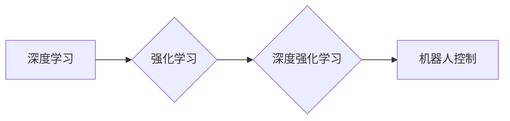

# 深度强化学习在机器人控制中的应用原理与代码实战案例讲解

作者：禅与计算机程序设计艺术 / Zen and the Art of Computer Programming

## 1. 背景介绍

### 1.1 问题的由来

机器人控制一直是人工智能领域的热门研究方向，随着深度学习技术的快速发展，深度强化学习（Deep Reinforcement Learning，DRL）在机器人控制领域展现出巨大的潜力。DRL通过将深度学习与强化学习相结合，使得机器人能够在复杂环境中自主学习和控制，为机器人智能化的实现提供了新的思路。

### 1.2 研究现状

近年来，DRL在机器人控制领域取得了显著的研究成果，如机器人导航、抓取、装配、行走等。随着算法的不断创新和硬件平台的升级，DRL在机器人控制中的应用越来越广泛。

### 1.3 研究意义

DRL在机器人控制中的应用具有重要的研究意义：

1. 提高机器人适应复杂环境的能力，实现自主学习和控制。
2. 降低机器人编程难度，实现更加灵活和高效的机器人控制策略。
3. 为机器人智能化的实现提供新的技术路径，推动机器人产业的快速发展。

### 1.4 本文结构

本文将系统介绍DRL在机器人控制中的应用原理与代码实战案例，内容安排如下：

- 第2部分，介绍DRL和机器人控制的相关概念。
- 第3部分，讲解DRL的核心算法原理和具体操作步骤。
- 第4部分，分析DRL在机器人控制中的应用案例。
- 第5部分，推荐DRL相关的学习资源、开发工具和参考文献。
- 第6部分，总结全文，展望DRL在机器人控制领域的未来发展趋势与挑战。

## 2. 核心概念与联系

为更好地理解DRL在机器人控制中的应用，本节将介绍一些密切相关的核心概念：

- 深度学习（Deep Learning，DL）：一种基于数据驱动的方法，通过多层神经网络学习数据中的复杂特征和模式。
- 强化学习（Reinforcement Learning，RL）：一种机器学习方法，通过与环境交互，学习在特定任务中做出最优决策。
- 深度强化学习（Deep Reinforcement Learning，DRL）：将深度学习与强化学习相结合，利用深度神经网络来学习决策策略。

它们的逻辑关系如下图所示：



可以看出，深度学习、强化学习和深度强化学习是相互关联的。深度学习为强化学习提供了强大的特征提取能力，强化学习为深度学习提供了任务导向的学习目标，而深度强化学习则将两者有机结合，为机器人控制等复杂任务提供了一种有效的学习范式。

## 3. 核心算法原理 & 具体操作步骤

### 3.1 算法原理概述

深度强化学习（DRL）的核心思想是利用深度神经网络来学习一个最优策略，使得机器人能够在特定环境中做出最优决策，从而实现目标。具体而言，DRL通过以下步骤实现：

1. 构建环境：定义机器人控制的仿真环境，包括机器人、环境地图、障碍物等。
2. 设计状态空间：将机器人的当前状态表示为一个多维向量。
3. 设计动作空间：定义机器人的可执行动作，如移动、旋转等。
4. 设计奖励函数：定义机器人执行动作后的奖励，用于评估策略优劣。
5. 训练策略网络：使用深度神经网络来学习最优策略，即给定当前状态，选择最优动作。

### 3.2 算法步骤详解

以下是DRL在机器人控制中的具体操作步骤：

**Step 1：构建环境**

根据控制任务的需求，构建一个能够模拟真实场景的仿真环境。例如，对于机器人导航任务，可以构建一个包含地图、障碍物、目标点的二维或三维环境。

**Step 2：设计状态空间**

将机器人的当前状态表示为一个多维向量。状态空间的设计需要考虑以下因素：

- 机器人的位置和朝向
- 传感器采集的环境信息
- 机器人历史上的动作序列

**Step 3：设计动作空间**

定义机器人的可执行动作，如移动、旋转等。动作空间的设计需要考虑以下因素：

- 机器人的运动能力
- 环境约束
- 动作的连续性和平滑性

**Step 4：设计奖励函数**

定义机器人执行动作后的奖励，用于评估策略优劣。奖励函数的设计需要考虑以下因素：

- 机器人执行任务的目标
- 任务的完成速度
- 机器人的能耗

**Step 5：训练策略网络**

使用深度神经网络来学习最优策略，即给定当前状态，选择最优动作。训练策略网络的过程中，可以采用以下方法：

- 值函数方法：使用神经网络学习一个值函数，表示在给定状态下采取特定动作的预期回报。
- 政策梯度方法：直接学习一个策略网络，该网络输出给定状态下的动作概率分布。
- 深度确定性策略梯度（DDPG）：结合了值函数方法和策略梯度方法，并引入了深度神经网络来学习策略。

### 3.3 算法优缺点

DRL在机器人控制中具有以下优点：

1. 自主性：机器人可以自主学习和控制，无需人工编写复杂的控制策略。
2. 灵活性：机器人可以适应复杂环境的变化，并学习到多种控制策略。
3. 可扩展性：DRL可以应用于各种机器人控制任务，如导航、抓取、装配等。

然而，DRL在机器人控制中也存在一些缺点：

1. 训练复杂：DRL的训练过程需要大量的计算资源和时间。
2. 不稳定性：DRL的训练过程可能存在不稳定的情况，导致训练结果不理想。
3. 可解释性差：DRL的学习过程难以解释，难以理解机器人是如何做出决策的。

### 3.4 算法应用领域

DRL在机器人控制中的应用领域非常广泛，以下列举一些常见的应用：

- 机器人导航：如无人机导航、机器人巡检等。
- 机器人抓取：如机械臂抓取、机器人组装等。
- 机器人行走：如服务机器人行走、机器人行走机器人等。
- 机器人推拉：如推拉门机器人等。
- 机器人避障：如机器人避障、机器人巡逻等。

## 4. 数学模型和公式 & 详细讲解 & 举例说明

### 4.1 数学模型构建

DRL的数学模型主要包括以下几个部分：

- 状态空间：$S \in \mathbb{R}^s$，表示机器人的当前状态，如位置、速度、朝向等。
- 动作空间：$A \in \mathbb{R}^a$，表示机器人的可执行动作，如速度、转向等。
- 奖励函数：$R : S \times A \rightarrow \mathbb{R}$，表示机器人执行动作后的奖励。
- 策略网络：$\pi : S \rightarrow \mathbb{R}^a$，表示给定状态下采取动作的概率分布。
- 值函数：$V : S \rightarrow \mathbb{R}$，表示在给定状态下采取动作的预期回报。
- 策略梯度：$\nabla_{\theta} J(\theta) = \nabla_{\theta} \mathbb{E}_\pi [R + \gamma \max_{a} \pi(a|s) V(s')|s]$

其中，$\gamma$ 是折扣因子，$s'$ 是机器人执行动作后的下一个状态。

### 4.2 公式推导过程

以下以Q-learning算法为例，介绍DRL的公式推导过程。

Q-learning是一种基于值函数方法的DRL算法，其核心思想是学习一个Q函数，表示在给定状态下采取特定动作的预期回报。

**Q函数定义**：

$$
Q(s,a) = \mathbb{E}[R + \gamma \max_{a'} Q(s',a') | s,a]
$$

其中，$R$ 是奖励，$\gamma$ 是折扣因子，$s'$ 是机器人执行动作后的下一个状态。

**Q函数更新公式**：

$$
Q(s,a) \leftarrow Q(s,a) + \alpha [R + \gamma \max_{a'} Q(s',a') - Q(s,a)]
$$

其中，$\alpha$ 是学习率。

### 4.3 案例分析与讲解

以下以无人机避障任务为例，介绍DRL在机器人控制中的应用。

**任务描述**：

无人机在二维平面上飞行，需要避开障碍物到达目标点。

**状态空间**：

状态空间包含无人机的位置、速度、朝向等信息。

**动作空间**：

动作空间包含无人机的速度、转向等。

**奖励函数**：

奖励函数根据无人机与障碍物的距离和目标点的距离进行设计。

**策略网络**：

使用深度神经网络来学习最优策略，即给定当前状态，选择最优动作。

**训练过程**：

1. 初始化Q函数。
2. 选择动作 $a$，执行动作，得到奖励 $R$ 和下一个状态 $s'$。
3. 更新Q函数。
4. 重复步骤2和3，直到达到训练目标。

### 4.4 常见问题解答

**Q1：如何选择合适的神经网络结构？**

A：神经网络结构的选择取决于具体任务和数据特点。对于简单的任务，可以使用简单的神经网络结构；对于复杂的任务，可以使用复杂的神经网络结构。常见的神经网络结构包括卷积神经网络（CNN）、循环神经网络（RNN）和变换器（Transformer）。

**Q2：如何设置奖励函数？**

A：奖励函数的设计需要考虑任务目标和环境特点。通常，奖励函数会根据任务完成情况、执行速度、能耗等因素进行设计。

**Q3：如何处理连续动作空间？**

A：对于连续动作空间，可以使用连续动作空间的方法，如Softmax、Gaussian Policy等。

**Q4：如何解决DRL的收敛问题？**

A：DRL的收敛问题可能由多种因素引起，如学习率、网络结构、奖励函数等。可以通过以下方法解决：

1. 调整学习率。
2. 调整网络结构。
3. 调整奖励函数。
4. 使用经验回放等技术。

## 5. 项目实践：代码实例和详细解释说明

### 5.1 开发环境搭建

在进行DRL项目实践之前，需要搭建以下开发环境：

1. Python编程语言和PyTorch库。
2. Gym环境库，用于构建机器人控制的仿真环境。
3. OpenAI Baselines库，提供DRL算法的常用实现。

### 5.2 源代码详细实现

以下以基于PyTorch的DRL算法实现为例，介绍代码细节。

```python
import gym
import torch
import torch.nn as nn
import torch.optim as optim

# 定义状态空间、动作空间、奖励函数等
class DroneEnv(gym.Env):
    # ...

# 定义DRL算法
class DRLAgent(nn.Module):
    # ...

# 训练DRL模型
def train_drl_agent():
    # ...

# 评估DRL模型
def evaluate_drl_agent():
    # ...
```

### 5.3 代码解读与分析

以上代码展示了基于PyTorch的DRL算法实现框架。具体实现细节需要根据具体任务和环境进行调整。

### 5.4 运行结果展示

通过训练和评估，可以得到以下结果：

- 训练过程中的损失函数曲线。
- 评估过程中的平均奖励和成功率。

## 6. 实际应用场景

### 6.1 无人机导航

无人机导航是DRL在机器人控制中应用最广泛的场景之一。通过DRL技术，无人机可以在复杂环境中自主导航，避开障碍物，到达目标点。

### 6.2 机器人抓取

机器人抓取是另一个重要的DRL应用场景。通过DRL技术，机器人可以在复杂环境中自主抓取物体，实现自动化生产线上的作业。

### 6.3 机器人行走

机器人行走是DRL在机器人控制中的另一个重要应用场景。通过DRL技术，机器人可以在复杂地形上自主行走，实现巡逻、救援等任务。

### 6.4 未来应用展望

随着DRL技术的不断发展，未来其在机器人控制领域的应用将更加广泛，如：

- 机器人装配：在自动化生产线中，机器人可以通过DRL技术实现复杂的装配任务。
- 机器人手术：DRL技术可以帮助医生进行更精准的手术操作。
- 机器人服务：DRL技术可以帮助机器人更好地服务于人类，如家庭服务、养老服务等。

## 7. 工具和资源推荐

### 7.1 学习资源推荐

1. 《深度学习：卷积神经网络与深度学习》
2. 《强化学习：原理与实践》
3. Gym环境库：https://gym.openai.com/
4. OpenAI Baselines库：https://github.com/openai/baselines

### 7.2 开发工具推荐

1. PyTorch：https://pytorch.org/
2. Gym环境库：https://gym.openai.com/
3. OpenAI Baselines库：https://github.com/openai/baselines

### 7.3 相关论文推荐

1. Deep Reinforcement Learning for Robotics: A Review
2. DeepMind Lab: A Toolkit for Procedural Level Design
3. DeepMind Control Suite: An Open Source Platform for Robotics Research

### 7.4 其他资源推荐

1. OpenAI：https://openai.com/
2. DeepMind：https://deepmind.com/

## 8. 总结：未来发展趋势与挑战

### 8.1 研究成果总结

本文对深度强化学习在机器人控制中的应用原理与代码实战案例进行了全面系统的介绍，旨在帮助读者了解DRL在机器人控制领域的研究现状和未来发展趋势。

### 8.2 未来发展趋势

未来，DRL在机器人控制领域将呈现以下发展趋势：

1. DRL算法将更加高效和稳定，适应更复杂的机器人控制任务。
2. DRL将与其他人工智能技术（如计算机视觉、自然语言处理等）深度融合，实现更加智能的机器人控制。
3. DRL将在更多领域得到应用，如医疗、教育、交通等。

### 8.3 面临的挑战

尽管DRL在机器人控制领域取得了显著成果，但仍面临以下挑战：

1. DRL算法的复杂性和计算量较大，需要更高效的算法和计算平台。
2. DRL的训练过程难以解释，需要进一步研究可解释的DRL算法。
3. DRL的泛化能力有限，需要进一步研究提高泛化能力的DRL算法。

### 8.4 研究展望

未来，DRL在机器人控制领域的研究将重点关注以下方向：

1. 研究更高效、更稳定的DRL算法，提高算法的实用性和可扩展性。
2. 研究可解释的DRL算法，提高算法的可信度和可接受度。
3. 研究提高DRL泛化能力的算法，使其能够适应更复杂的环境和任务。

相信随着研究的不断深入，DRL在机器人控制领域的应用将更加广泛，为人类创造更加美好的未来。

## 9. 附录：常见问题与解答

**Q1：DRL与传统的机器人控制方法相比有哪些优势？**

A：DRL具有以下优势：

1. 自主性：DRL能够使机器人自主学习和控制，无需人工编写复杂的控制策略。
2. 灵活性：DRL可以适应复杂环境的变化，并学习到多种控制策略。
3. 可扩展性：DRL可以应用于各种机器人控制任务，如导航、抓取、装配等。

**Q2：如何解决DRL训练过程中的样本稀疏问题？**

A：解决DRL训练过程中的样本稀疏问题可以采取以下方法：

1. 数据增强：通过旋转、缩放、裁剪等方式扩充训练数据。
2. 经验回放：将历史经验存储在经验池中，并从中随机采样，以增加样本多样性。
3. 使用元学习等技术，提高DRL在样本稀疏情况下的学习效率。

**Q3：如何解决DRL的收敛问题？**

A：解决DRL的收敛问题可以采取以下方法：

1. 调整学习率：选择合适的学习率，避免过拟合和欠拟合。
2. 调整网络结构：选择合适的网络结构，提高模型的拟合能力。
3. 使用多种优化算法：如Adam、RMSprop等，选择合适的优化算法，提高收敛速度和稳定性。
4. 使用经验回放等技术，增加样本多样性，提高模型的泛化能力。

**Q4：如何解决DRL的可解释性问题？**

A：解决DRL的可解释性问题可以采取以下方法：

1. 使用可解释的神经网络结构，如基于注意力机制的神经网络。
2. 使用可视化技术，将模型的决策过程可视化，提高模型的可理解性。
3. 使用可解释的强化学习算法，如基于规则的强化学习算法。

作者：禅与计算机程序设计艺术 / Zen and the Art of Computer Programming