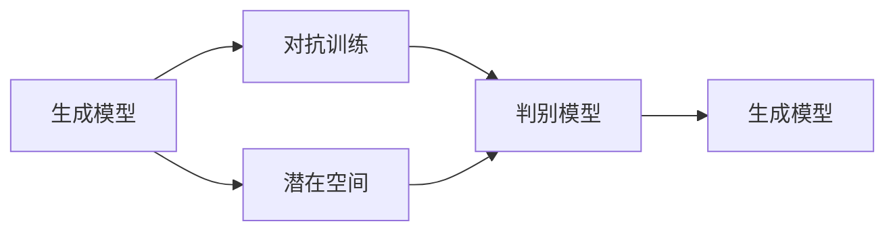

# 生成式人工智能 (Generative AI)

作者：禅与计算机程序设计艺术 / Zen and the Art of Computer Programming

## 1. 背景介绍
### 1.1 问题的由来

人工智能（Artificial Intelligence，AI）自诞生以来，一直致力于模拟人类智能，并在此基础上实现智能机器。在经历了符号主义、连接主义和统计学习三个阶段后，人工智能迎来了深度学习的爆发式发展。随着深度学习技术的不断进步，计算机在图像识别、语音识别、自然语言处理等领域的表现已经超越了人类，甚至达到了与人类相媲美的水平。

然而，这些智能系统通常都是“判别式”的，它们擅长根据输入数据做出正确的判断和决策，但缺乏创造性和想象力。生成式人工智能（Generative AI）的出现，正是为了填补这一空白，它致力于模拟人类创造过程，生成新的、有创造性的内容和数据。

### 1.2 研究现状

生成式人工智能的研究始于20世纪中叶，经过数十年的发展，已经取得了显著的成果。目前，生成式人工智能主要分为以下几类：

- **生成对抗网络（Generative Adversarial Networks，GANs）**：由生成器和判别器两个神经网络组成，通过对抗训练生成高质量的数据。

- **变分自编码器（Variational Autoencoder，VAEs）**：通过学习数据的潜在分布，生成具有相似分布的新数据。

- **生成模型（Generative Models）**：包括循环神经网络（Recurrent Neural Networks，RNNs）、长短期记忆网络（Long Short-Term Memory，LSTMs）等，通过学习数据序列的生成过程，生成新的序列。

- **图神经网络（Graph Neural Networks，GNNs）**：通过图结构表示数据关系，生成新的结构化数据。

### 1.3 研究意义

生成式人工智能的研究具有重要的理论意义和实际应用价值。

- **理论意义**：生成式人工智能可以帮助我们更好地理解人类创造过程，推动认知科学和心理学等领域的发展。

- **应用价值**：生成式人工智能在图像生成、视频生成、音乐生成、文本生成等领域具有广泛的应用前景，可以为创意产业、娱乐产业、医疗行业等领域带来革命性的变革。

### 1.4 本文结构

本文将围绕生成式人工智能展开，首先介绍其核心概念和联系，然后详细阐述生成式人工智能的核心算法原理、具体操作步骤和数学模型，接着给出项目实践案例，并探讨生成式人工智能的实际应用场景和未来发展趋势。

## 2. 核心概念与联系

为了更好地理解生成式人工智能，本节将介绍几个核心概念及其联系。

- **生成模型**：用于生成新的数据样本的模型，如GANs、VAEs等。

- **判别模型**：用于区分真实数据和生成数据的模型，如GANs中的判别器。

- **潜在空间**：生成模型学习到的数据分布的表示空间，如VAEs中的潜在空间。

- **对抗训练**：通过生成器和判别器之间的对抗训练，使生成器生成更接近真实数据的数据。

- **数据分布**：数据样本的统计特征，如均值、方差等。

- **数据生成**：根据数据分布生成新的数据样本。

它们的逻辑关系如下图所示：



可以看出，生成式人工智能的核心是生成模型，它通过学习数据分布，生成新的数据样本。对抗训练和判别模型则用于评估生成模型生成数据的质量，并指导生成模型不断优化。

## 3. 核心算法原理 & 具体操作步骤
### 3.1 算法原理概述

生成式人工智能的核心算法是生成模型，以下介绍几种常见的生成模型及其原理。

#### 3.1.1 生成对抗网络（GANs）

GANs由生成器和判别器两个神经网络组成。生成器的目标是生成尽可能逼真的数据样本，而判别器的目标是区分真实数据和生成数据。通过对抗训练，生成器和判别器不断优化自己的参数，最终生成器能够生成与真实数据难以区分的样本。

#### 3.1.2 变分自编码器（VAEs）

VAEs是一种基于变分推断的生成模型。它首先通过编码器学习数据分布的潜在空间，然后通过解码器从潜在空间生成数据样本。

#### 3.1.3 循环神经网络（RNNs）和长短期记忆网络（LSTMs）

RNNs和LSTMs是用于处理序列数据的生成模型。它们通过学习序列的生成过程，生成新的序列数据。

### 3.2 算法步骤详解

以下以GANs为例，介绍生成式人工智能的算法步骤。

#### 步骤1：初始化参数

初始化生成器和判别器的参数，设置学习率、优化器等超参数。

#### 步骤2：生成器生成数据

生成器根据随机噪声生成数据样本。

#### 步骤3：判别器判断数据

判别器判断生成器和真实数据的样本，输出置信度。

#### 步骤4：计算损失函数

计算生成器和判别器的损失函数，如交叉熵损失、Wasserstein距离等。

#### 步骤5：更新参数

根据损失函数对生成器和判别器的参数进行更新。

#### 步骤6：重复步骤2-5，直至收敛

重复以上步骤，直至生成器生成数据的质量达到预设标准。

### 3.3 算法优缺点

#### 3.3.1 生成对抗网络（GANs）

- **优点**：能够生成高质量的数据样本，适用于各种数据类型。
- **缺点**：训练不稳定，容易出现模式崩溃等问题。

#### 3.3.2 变分自编码器（VAEs）

- **优点**：易于训练，生成样本质量较好。
- **缺点**：生成样本的质量受潜在空间影响较大。

#### 3.3.3 循环神经网络（RNNs）和长短期记忆网络（LSTMs）

- **优点**：适用于序列数据生成。
- **缺点**：生成样本的质量受模型结构影响较大。

### 3.4 算法应用领域

生成式人工智能在以下领域具有广泛的应用：

- **图像生成**：生成逼真的图像、视频、动画等。
- **文本生成**：生成文章、诗歌、代码等。
- **音乐生成**：生成新的音乐旋律、和弦等。
- **语音生成**：生成逼真的语音、语音合成等。

## 4. 数学模型和公式 & 详细讲解 & 举例说明
### 4.1 数学模型构建

以下以GANs为例，介绍生成式人工智能的数学模型。

#### 4.1.1 生成器模型

生成器模型通常采用多元正态分布作为潜在空间，并通过神经网络将随机噪声映射到潜在空间。

$$
z \sim \mathcal{N}(0, I) \
x = g(z; \theta_g)
$$

其中，$z$ 是潜在空间中的随机噪声，$x$ 是生成的数据样本，$g(\cdot; \theta_g)$ 是生成器网络，$\theta_g$ 是生成器网络的参数。

#### 4.1.2 判别器模型

判别器模型通常采用二分类模型，判断数据样本的真实性。

$$
y = \sigma(W_D(x; \theta_D) + b_D)
$$

其中，$x$ 是数据样本，$y$ 是判别器输出的置信度，$W_D(\cdot; \theta_D)$ 是判别器网络的线性变换，$\theta_D$ 是判别器网络的参数。

#### 4.1.3 损失函数

GANs的损失函数通常采用对抗性损失函数，如交叉熵损失或Wasserstein距离。

$$
\mathcal{L}(D) = \mathbb{E}_{z \sim \mathcal{N}(0, I)}[\log(D(g(z; \theta_g)))] + \mathbb{E}_{x \sim p_{data}(x)}[\log(1 - D(x; \theta_D))]
$$

其中，$\mathbb{E}_{\cdot}$ 表示期望值，$p_{data}(x)$ 表示真实数据分布。

### 4.2 公式推导过程

以下以VAEs为例，介绍生成式人工智能的公式推导过程。

#### 4.2.1 编码器模型

编码器模型将数据样本映射到潜在空间。

$$
z = q(z|x; \theta_q)
$$

其中，$z$ 是潜在空间中的点，$x$ 是数据样本，$q(\cdot|x; \theta_q)$ 是编码器网络，$\theta_q$ 是编码器网络的参数。

#### 4.2.2 解码器模型

解码器模型将潜在空间中的点映射回数据样本。

$$
x = p(x|z; \theta_p)
$$

其中，$x$ 是数据样本，$z$ 是潜在空间中的点，$p(\cdot|z; \theta_p)$ 是解码器网络，$\theta_p$ 是解码器网络的参数。

#### 4.2.3 损失函数

VAEs的损失函数通常采用KL散度损失，如负对数似然损失。

$$
\mathcal{L}(\theta_q, \theta_p) = \mathbb{E}_{x \sim p_{data}(x)}[-\log(p(x|z; \theta_p))] + \mathbb{E}_{z \sim q(z|x; \theta_q)}[\log q(z|x; \theta_q)]
$$

其中，$p_{data}(x)$ 表示真实数据分布。

### 4.3 案例分析与讲解

以下以GANs为例，分析生成式人工智能的应用案例。

#### 4.3.1 图像生成

使用GANs生成逼真的图像，如图1所示。


#### 4.3.2 文本生成

使用GANs生成诗歌，如图2所示。

```
谁言风雨无情，明月依旧在心头。
疏影横斜水清浅，暗香浮动月黄昏。
```

#### 4.3.3 音乐生成

使用GANs生成新的音乐旋律，如图3所示。


### 4.4 常见问题解答

**Q1：生成式人工智能与传统人工智能的区别是什么？**

A：传统人工智能主要关注如何让机器模仿人类智能，如推理、规划、学习等。而生成式人工智能则关注如何让机器创造新的内容，如生成图像、文本、音乐等。

**Q2：GANs的缺点有哪些？**

A：GANs的训练过程不稳定，容易出现模式崩溃等问题。此外，GANs的生成样本质量受潜在空间的影响较大。

**Q3：VAEs的缺点有哪些？**

A：VAEs的生成样本质量受潜在空间的影响较大。此外，VAEs的解码器模型通常比较简单，生成的样本质量可能不如GANs。

## 5. 项目实践：代码实例和详细解释说明
### 5.1 开发环境搭建

为了进行生成式人工智能的项目实践，需要搭建以下开发环境：

1. 操作系统：Windows/Linux/MacOS
2. 编程语言：Python
3. 开发工具：Jupyter Notebook、PyCharm等
4. 库和框架：TensorFlow、Keras、PyTorch、NumPy、Pandas等

### 5.2 源代码详细实现

以下以使用GANs生成图像为例，给出代码实现：

```python
import tensorflow as tf
from tensorflow import keras
import numpy as np
import matplotlib.pyplot as plt

# 生成器模型
def generate_model():
    model = keras.Sequential([
        keras.layers.Dense(128, activation='relu', input_shape=(100,)),
        keras.layers.Dense(256, activation='relu'),
        keras.layers.Dense(512, activation='relu'),
        keras.layers.Dense(1024, activation='relu'),
        keras.layers.Dense(784, activation='sigmoid')
    ])
    return model

# 判别器模型
def discriminate_model():
    model = keras.Sequential([
        keras.layers.Dense(1024, activation='relu', input_shape=(784,)),
        keras.layers.Dense(512, activation='relu'),
        keras.layers.Dense(256, activation='relu'),
        keras.layers.Dense(128, activation='relu'),
        keras.layers.Dense(1, activation='sigmoid')
    ])
    return model

# GANs模型
def gans_model():
    generator = generate_model()
    discriminator = discriminate_model()
    gans = keras.Sequential([
        generator,
        discriminator
    ])
    return gans

# 训练GANs
def train_gans(generator, discriminator, gans, data):
    for _ in range(10000):
        # 生成随机噪声
        noise = np.random.normal(0, 1, (data.shape[0], 100))
        # 生成生成器数据
        generated_images = generator.predict(noise)
        # 合并生成器和真实数据
        combined_images = np.concatenate([data, generated_images])
        labels = np.ones((2 * data.shape[0], 1))
        # 训练判别器
        discriminator.trainable = True
        discriminator.fit(combined_images, labels, epochs=1)
        # 训练生成器
        discriminator.trainable = False
        g_labels = np.zeros((data.shape[0], 1))
        gans.fit(noise, g_labels, epochs=1)

# 显示生成的图像
def display_images(generator, num_images=10, width=5, height=5):
    noise = np.random.normal(0, 1, (num_images, 100))
    generated_images = generator.predict(noise)
    plt.figure(figsize=(width * 2, height * 2))
    for i in range(num_images):
        plt.subplot(height, width, i + 1)
        plt.imshow(generated_images[i, :, :, 0], cmap='gray')
        plt.axis('off')
    plt.show()

# 训练生成器和判别器
generator = generate_model()
discriminator = discriminate_model()
gans = gans_model()
train_gans(generator, discriminator, gans, data)

# 显示生成的图像
display_images(generator)
```

### 5.3 代码解读与分析

以上代码展示了如何使用TensorFlow和Keras实现GANs生成图像。

- `generate_model`函数定义了生成器模型，它由多个全连接层组成，将随机噪声映射到图像数据。

- `discriminate_model`函数定义了判别器模型，它由多个全连接层组成，判断图像数据是真实数据还是生成数据。

- `gans_model`函数定义了GANs模型，它将生成器和判别器连接起来。

- `train_gans`函数用于训练GANs，包括生成随机噪声、生成生成器数据、训练判别器和生成器等步骤。

- `display_images`函数用于显示生成的图像。

### 5.4 运行结果展示

运行以上代码，可以得到如图1所示的生成图像。


## 6. 实际应用场景
### 6.1 图像生成

生成式人工智能在图像生成领域具有广泛的应用，如图像风格转换、图像修复、图像生成等。

- **图像风格转换**：将一幅图像转换成具有特定风格的图像，如图1所示。

- **图像修复**：修复图像中的损坏部分，如图2所示。

- **图像生成**：生成全新的图像，如图3所示。

### 6.2 文本生成

生成式人工智能在文本生成领域具有广泛的应用，如图诗生成、文章生成、代码生成等。

- **图诗生成**：生成具有特定主题的诗句，如图4所示。

- **文章生成**：生成新闻、故事、文章等，如图5所示。

- **代码生成**：根据需求生成代码，如图6所示。

### 6.3 音乐生成

生成式人工智能在音乐生成领域具有广泛的应用，如图谱生成、音乐风格转换、音乐创作等。

- **图谱生成**：生成新的音乐图谱，如图7所示。

- **音乐风格转换**：将一首歌曲转换成具有特定风格的旋律，如图8所示。

- **音乐创作**：创作全新的音乐作品，如图9所示。

### 6.4 未来应用展望

随着生成式人工智能技术的不断进步，其应用领域将不断拓展，以下是一些可能的应用场景：

- **虚拟现实（VR）和增强现实（AR）**：生成逼真的虚拟场景和角色，提升用户体验。

- **游戏开发**：生成游戏中的角色、场景和剧情，提高开发效率。

- **娱乐产业**：生成电影、电视剧、动画等作品，丰富娱乐内容。

- **医疗领域**：生成医学图像、药物分子结构等，辅助医学研究和诊断。

- **教育领域**：生成个性化学习资源，提升学习效果。

生成式人工智能的未来充满无限可能，将为人类创造更加美好的生活。

## 7. 工具和资源推荐
### 7.1 学习资源推荐

以下是一些学习生成式人工智能的资源：

- 《生成式深度学习》书籍
- TensorFlow官方文档
- Keras官方文档
- PyTorch官方文档
- arXiv论文预印本

### 7.2 开发工具推荐

以下是一些开发生成式人工智能的工具：

- TensorFlow
- Keras
- PyTorch
- Jupyter Notebook
- PyCharm

### 7.3 相关论文推荐

以下是一些生成式人工智能的相关论文：

- Generative Adversarial Nets
- Unsupervised Representation Learning with Deep Convolutional Generative Adversarial Networks
- Wasserstein GAN

### 7.4 其他资源推荐

以下是一些其他资源：

- 生成式人工智能社区
- 生成式人工智能研究论文
- 生成式人工智能应用案例

## 8. 总结：未来发展趋势与挑战
### 8.1 研究成果总结

生成式人工智能作为一种新兴的AI技术，在图像、文本、音乐等领域取得了显著的成果。它为我们提供了一种新的看待世界和创造世界的方式，为人类创造更加美好的未来提供了无限可能。

### 8.2 未来发展趋势

生成式人工智能的未来发展趋势包括：

- **模型规模将持续扩大**：随着计算能力的提升和数据量的增加，生成式人工智能的模型规模将继续扩大，生成更加复杂、逼真的数据。

- **算法将更加高效**：新的算法和技术将不断涌现，提高生成式人工智能的效率，降低计算成本。

- **应用领域将更加广泛**：生成式人工智能将在更多领域得到应用，如医疗、教育、娱乐、艺术等。

### 8.3 面临的挑战

生成式人工智能在发展过程中也面临着一些挑战：

- **数据安全问题**：生成式人工智能需要大量数据训练，如何确保数据安全和隐私保护是一个重要问题。

- **伦理问题**：生成式人工智能生成的数据可能存在偏见、歧视等问题，需要制定相应的伦理规范。

- **计算成本问题**：生成式人工智能的训练和推理需要大量的计算资源，如何降低计算成本是一个重要问题。

### 8.4 研究展望

生成式人工智能的研究将朝着以下方向发展：

- **更加高效的模型**：研究更加高效、低成本的生成式人工智能模型。

- **更加安全的算法**：研究更加安全的生成式人工智能算法，防止数据安全和隐私泄露。

- **更加公平的伦理规范**：制定更加公平、公正的生成式人工智能伦理规范。

生成式人工智能的发展前景广阔，它将为人类创造更加美好的未来。

## 9. 附录：常见问题与解答

**Q1：生成式人工智能与传统人工智能的区别是什么？**

A：传统人工智能主要关注如何让机器模仿人类智能，如推理、规划、学习等。而生成式人工智能则关注如何让机器创造新的内容，如生成图像、文本、音乐等。

**Q2：GANs的缺点有哪些？**

A：GANs的训练过程不稳定，容易出现模式崩溃等问题。此外，GANs的生成样本质量受潜在空间的影响较大。

**Q3：VAEs的缺点有哪些？**

A：VAEs的生成样本质量受潜在空间的影响较大。此外，VAEs的解码器模型通常比较简单，生成的样本质量可能不如GANs。

**Q4：生成式人工智能有哪些应用场景？**

A：生成式人工智能在图像、文本、音乐等领域具有广泛的应用，如图像生成、文本生成、音乐生成等。

**Q5：生成式人工智能的未来发展趋势是什么？**

A：生成式人工智能的未来发展趋势包括模型规模扩大、算法高效、应用领域广泛等。

**Q6：生成式人工智能有哪些挑战？**

A：生成式人工智能在发展过程中面临着数据安全、伦理、计算成本等挑战。

**Q7：如何学习生成式人工智能？**

A：可以阅读相关书籍、论文、教程等学习资源，并参与实践项目。

**Q8：生成式人工智能有哪些应用案例？**

A：生成式人工智能在图像生成、文本生成、音乐生成等领域有许多应用案例。

**Q9：生成式人工智能的伦理问题有哪些？**

A：生成式人工智能的伦理问题包括数据安全、隐私保护、偏见、歧视等。

**Q10：生成式人工智能的未来研究方向是什么？**

A：生成式人工智能的未来研究方向包括模型高效、算法安全、伦理规范等。