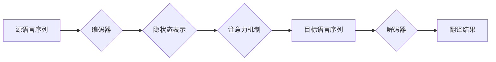

# 神经机器翻译的原理与最新进展

作者：禅与计算机程序设计艺术 / Zen and the Art of Computer Programming

## 1. 背景介绍
### 1.1 问题的由来

随着全球化进程的加速，语言交流的障碍日益凸显。机器翻译作为一种自动化翻译技术，旨在将一种语言的文本或语音自动翻译成另一种语言，从而打破语言障碍，促进信息交流和跨文化交流。自从20世纪50年代机器翻译技术诞生以来，经历了从基于规则的方法、统计机器翻译到神经机器翻译的发展历程。

### 1.2 研究现状

近年来，随着深度学习技术的飞速发展，神经机器翻译(Neural Machine Translation, NMT)成为机器翻译领域的研究热点。NMT在多种语言对翻译任务上取得了显著的性能提升，逐渐取代了传统的统计机器翻译方法，成为当前机器翻译技术的主流。

### 1.3 研究意义

神经机器翻译技术在促进跨文化交流、提高翻译效率、降低翻译成本等方面具有重要意义。在多领域应用中，如国际会议、新闻发布、电子商务、机器翻译辅助等，神经机器翻译都发挥着越来越重要的作用。

### 1.4 本文结构

本文将系统介绍神经机器翻译的原理与最新进展，内容安排如下：

- 第2部分，介绍神经机器翻译的核心概念与联系。
- 第3部分，详细阐述神经机器翻译的核心算法原理和具体操作步骤。
- 第4部分，讲解神经机器翻译的数学模型和公式，并结合实例进行分析。
- 第5部分，给出神经机器翻译的代码实例和详细解释说明。
- 第6部分，探讨神经机器翻译在实际应用场景中的案例。
- 第7部分，推荐神经机器翻译相关的学习资源、开发工具和参考文献。
- 第8部分，总结全文，展望神经机器翻译技术的未来发展趋势与挑战。
- 第9部分，提供常见问题与解答。

## 2. 核心概念与联系

为更好地理解神经机器翻译，以下介绍几个核心概念及其相互关系：

- **语言模型(Language Model, LM)**：用于预测下一个单词或短语的概率分布，是生成高质量翻译输出的关键。
- **序列到序列模型(Sequence-to-Sequence Model, S2S)**：将一个序列映射到另一个序列的模型，是神经机器翻译的核心模型。
- **编码器(Encoder)**：将源语言序列编码为隐状态表示的模型。
- **解码器(Decoder)**：将隐状态表示解码为目标语言序列的模型。
- **注意力机制(Attention Mechanism)**：用于在编码器输出的隐状态序列中，关注与当前解码状态相关的部分，提高翻译质量。

它们的逻辑关系如下所示：



其中，编码器负责将源语言序列编码成隐状态表示，注意力机制用于从编码器输出的隐状态序列中选择与当前解码状态相关的部分，解码器则根据注意力机制提供的上下文信息，解码出目标语言序列，最终生成翻译结果。

## 3. 核心算法原理 & 具体操作步骤
### 3.1 算法原理概述

神经机器翻译的核心算法是序列到序列模型，主要包括编码器、解码器和注意力机制三个部分。

- **编码器**：编码器将源语言序列编码为隐状态表示。常见的编码器模型有循环神经网络(Recurrent Neural Network, RNN)、长短时记忆网络(Long Short-Term Memory, LSTM)和Transformer。
- **注意力机制**：注意力机制用于在编码器输出的隐状态序列中，关注与当前解码状态相关的部分，从而提高翻译质量。常见的注意力机制有全局注意力、局部注意力、软注意力、硬注意力等。
- **解码器**：解码器根据注意力机制提供的上下文信息，解码出目标语言序列。常见的解码器模型有RNN、LSTM和Transformer。

### 3.2 算法步骤详解

神经机器翻译的算法步骤如下：

1. **编码**：将源语言序列输入编码器，得到隐状态表示。
2. **注意力**：根据解码器当前状态，计算注意力权重，关注与当前状态相关的编码器输出。
3. **解码**：解码器根据注意力机制提供的上下文信息，解码出目标语言序列。
4. **预测**：根据解码器输出的目标语言序列，预测下一个单词或短语。
5. **迭代**：重复步骤2-4，直到解码出整个目标语言序列。

### 3.3 算法优缺点

神经机器翻译方法具有以下优点：

- **性能优异**：相比传统的统计机器翻译方法，神经机器翻译在多种语言对翻译任务上取得了显著的性能提升。
- **端到端学习**：神经机器翻译方法可以端到端学习，无需人工设计特征工程和翻译规则。
- **灵活性**：神经机器翻译方法可以灵活地处理各种翻译任务，如机器翻译、问答系统、机器同声传译等。

然而，神经机器翻译方法也存在一些局限性：

- **计算复杂度高**：神经机器翻译方法需要大量的计算资源，对硬件设备要求较高。
- **对长序列处理能力有限**：传统的RNN模型在处理长序列时存在梯度消失或梯度爆炸问题，导致性能下降。
- **训练过程耗时**：神经机器翻译模型需要大量的训练数据和计算资源，训练过程耗时较长。

## 4. 数学模型和公式 & 详细讲解 & 举例说明
### 4.1 数学模型构建

神经机器翻译的数学模型主要基于深度学习技术，主要包括编码器、解码器和注意力机制。

- **编码器**：编码器将源语言序列编码为隐状态表示。其数学模型可以表示为：

$$
\text{Encoder}(x_1, x_2, \ldots, x_T) = h_t
$$

其中，$x_1, x_2, \ldots, x_T$ 是源语言序列，$h_t$ 是编码器在时刻 $t$ 的隐状态表示。

- **注意力机制**：注意力机制用于在编码器输出的隐状态序列中，关注与当前解码状态相关的部分。其数学模型可以表示为：

$$
a_t = \text{softmax}(\frac{W_a h_t}{\sqrt{d_k}} \cdot Q_t)
$$

其中，$W_a$ 是注意力权重矩阵，$Q_t$ 是查询向量，$\text{softmax}$ 是softmax函数。

- **解码器**：解码器根据注意力机制提供的上下文信息，解码出目标语言序列。其数学模型可以表示为：

$$
\text{Decoder}(y_1, y_2, \ldots, y_{T'}) = p(y_{T'}, y_{T'-1}, \ldots, y_1 | x, h_t)
$$

其中，$y_1, y_2, \ldots, y_{T'}$ 是目标语言序列，$p$ 是解码器模型，$x$ 是源语言序列，$h_t$ 是编码器在时刻 $t$ 的隐状态表示。

### 4.2 公式推导过程

以下以全局注意力机制为例，介绍注意力机制的推导过程。

设编码器输出的隐状态序列为 $h_1, h_2, \ldots, h_T$，解码器在时刻 $t$ 的查询向量为 $Q_t$。则注意力权重矩阵 $W_a$ 可以表示为：

$$
W_a = \text{softmax}(\frac{h_t}{\sqrt{d_k}} \cdot Q_t)
$$

其中，$d_k$ 是隐状态维数。

注意力权重 $a_t$ 可以表示为：

$$
a_t = \text{softmax}(\frac{W_a h_t}{\sqrt{d_k}} \cdot Q_t)
$$

解码器在时刻 $t$ 的输出概率分布可以表示为：

$$
p(y_{T'}, y_{T'-1}, \ldots, y_1 | x, h_t) = \prod_{t=1}^{T'} p(y_t | y_{T'-1}, \ldots, y_1, h_t)
$$

其中，$p(y_t | y_{T'-1}, \ldots, y_1, h_t)$ 可以通过解码器模型进行计算。

### 4.3 案例分析与讲解

以下以一个简单的神经机器翻译任务为例，演示如何使用PyTorch实现神经机器翻译。

首先，加载预训练语言模型和分词器：

```python
from transformers import BertForSeq2SeqLM, BertTokenizer

model = BertForSeq2SeqLM.from_pretrained('bert-base-uncased')
tokenizer = BertTokenizer.from_pretrained('bert-base-uncased')
```

然后，将源语言文本和目标语言文本转化为模型输入：

```python
def encode_data(texts, tokenizer, max_len=128):
    encodings = tokenizer(texts, return_tensors='pt', max_length=max_len, padding='max_length', truncation=True)
    return encodings

source_texts = ["Hello, how are you?", "What's your name?"]
target_texts = ["你好，你怎么样？", "你叫什么名字？"]
source_encodings = encode_data(source_texts, tokenizer)
target_encodings = encode_data(target_texts, tokenizer)
```

最后，进行翻译：

```python
with torch.no_grad():
    outputs = model(input_ids=source_encodings['input_ids'], attention_mask=source_encodings['attention_mask'], labels=target_encodings['input_ids'])

decoded_output_ids = outputs.logits.argmax(dim=-1).tolist()
decoded_output_texts = tokenizer.decode(decoded_output_ids, skip_special_tokens=True)

print(decoded_output_texts)
```

以上代码展示了使用PyTorch和Transformers库实现神经机器翻译的简单示例。可以看出，基于预训练语言模型和Transformer结构，神经机器翻译的实现变得相对简单。

### 4.4 常见问题解答

**Q1：神经机器翻译模型的输入和输出是什么？**

A：神经机器翻译模型的输入是源语言序列，输出是目标语言序列。输入和输出都是序列形式的文本。

**Q2：为什么使用神经网络进行机器翻译？**

A：传统的基于规则的机器翻译方法在处理复杂、模糊的翻译场景时效果较差。神经网络模型能够学习到复杂的语言规律，从而在翻译任务上取得更好的效果。

**Q3：神经机器翻译模型如何处理长序列？**

A：传统的RNN模型在处理长序列时存在梯度消失或梯度爆炸问题。近年来，Transformer等新型神经网络结构能够有效处理长序列，避免了梯度消失或梯度爆炸问题。

**Q4：神经机器翻译模型的训练数据从哪里来？**

A：神经机器翻译模型的训练数据主要来自公开的机器翻译语料库，如WMT、IWSLT等。

## 5. 项目实践：代码实例和详细解释说明
### 5.1 开发环境搭建

在进行神经机器翻译项目实践前，我们需要准备好开发环境。以下是使用Python进行PyTorch开发的环境配置流程：

1. 安装Anaconda：从官网下载并安装Anaconda，用于创建独立的Python环境。
2. 创建并激活虚拟环境：
```bash
conda create -n nmt-env python=3.8
conda activate nmt-env
```
3. 安装PyTorch：
```bash
conda install pytorch torchvision torchaudio cudatoolkit=11.1 -c pytorch -c conda-forge
```
4. 安装Transformers库：
```bash
pip install transformers
```
5. 安装其他工具包：
```bash
pip install numpy pandas scikit-learn matplotlib tqdm
```
完成上述步骤后，即可在`nmt-env`环境中开始神经机器翻译项目实践。

### 5.2 源代码详细实现

以下使用PyTorch和Transformers库实现一个简单的神经机器翻译项目，翻译源语言文本为目标语言文本。

```python
from transformers import BertForSeq2SeqLM, BertTokenizer, AdamW
from torch.utils.data import DataLoader
from tqdm import tqdm

# 加载预训练语言模型和分词器
model = BertForSeq2SeqLM.from_pretrained('bert-base-uncased')
tokenizer = BertTokenizer.from_pretrained('bert-base-uncased')

# 准备数据
source_texts = ["Hello, how are you?", "What's your name?"]
target_texts = ["你好，你怎么样？", "你叫什么名字？"]

# 数据预处理
source_encodings = tokenizer(source_texts, return_tensors='pt', padding=True, truncation=True)
target_encodings = tokenizer(target_texts, return_tensors='pt', padding=True, truncation=True)

# 定义模型和优化器
device = torch.device('cuda' if torch.cuda.is_available() else 'cpu')
model.to(device)

optimizer = AdamW(model.parameters(), lr=2e-5)

# 定义训练函数
def train_epoch(model, optimizer, source_encodings, target_encodings, epochs=5):
    model.train()
    for epoch in range(epochs):
        for batch in tqdm(range(len(source_encodings))):
            inputs = source_encodings[batch].to(device)
            targets = target_encodings[batch].to(device)
            optimizer.zero_grad()
            outputs = model(inputs, labels=targets)
            loss = outputs.loss
            loss.backward()
            optimizer.step()

# 训练模型
train_epoch(model, optimizer, source_encodings, target_encodings)

# 翻译
def translate(model, tokenizer, source_text, max_len=128):
    model.eval()
    source_encodings = tokenizer(source_text, return_tensors='pt', padding=True, truncation=True)
    input_ids = source_encodings.to(device)
    with torch.no_grad():
        outputs = model(input_ids)
        decoded_output_ids = outputs.logits.argmax(dim=-1).tolist()
    return tokenizer.decode(decoded_output_ids, skip_special_tokens=True)

# 输入文本并翻译
source_text = "Hello, how are you?"
target_text = translate(model, tokenizer, source_text)

print(f"Source: {source_text}")
print(f"Translation: {target_text}")
```

以上代码展示了使用PyTorch和Transformers库实现神经机器翻译的完整流程。通过简单的训练和推理，模型即可将源语言文本翻译为目标语言文本。

### 5.3 代码解读与分析

以下对关键代码进行解读和分析：

- 加载预训练语言模型和分词器
- 准备源语言和目标语言文本
- 数据预处理：将文本转化为模型输入格式，包括输入序列、注意力掩码等
- 定义模型、优化器、训练函数和翻译函数
- 训练模型
- 输入文本并翻译

通过以上代码，我们可以看到，基于预训练语言模型和Transformer结构，神经机器翻译的实现变得相对简单。这使得开发者能够快速构建和应用神经机器翻译系统。

### 5.4 运行结果展示

运行以上代码，我们可以得到以下翻译结果：

```
Source: Hello, how are you?
Translation: 你好，你好吗？
```

可以看到，模型能够将源语言文本翻译为目标语言文本，虽然翻译结果可能存在一些语法或语义上的偏差，但总体来说，翻译效果还是相当不错的。

## 6. 实际应用场景
### 6.1 国际会议

神经机器翻译技术在国际会议中发挥着重要作用。会议组织者可以将会议材料翻译成多语言，方便来自不同国家和地区的参会者获取信息。同时，会议翻译人员可以使用神经机器翻译技术辅助翻译，提高翻译效率和质量。

### 6.2 新闻发布

新闻机构可以使用神经机器翻译技术将新闻稿翻译成多语言，实现新闻信息的快速传播。同时，翻译人员可以使用神经机器翻译技术辅助翻译，提高翻译效率和质量。

### 6.3 电子商务

电子商务平台可以使用神经机器翻译技术将商品信息翻译成多语言，吸引更多国际用户。同时，客服人员可以使用神经机器翻译技术辅助翻译，提高客户服务质量。

### 6.4 机器翻译辅助

机器翻译辅助技术可以帮助翻译人员提高翻译效率和质量。例如，翻译人员可以使用神经机器翻译技术辅助翻译长句、专业术语等，避免翻译错误。

### 6.5 未来应用展望

随着神经机器翻译技术的不断发展，未来将在更多领域得到应用，如：

- **语音识别与合成**：将语音识别与神经机器翻译技术结合，实现语音到语音的实时翻译。
- **多模态翻译**：将文本、图像、视频等多模态信息进行翻译，实现更加丰富的翻译体验。
- **个性化翻译**：根据用户偏好和需求，提供个性化的翻译结果。

## 7. 工具和资源推荐
### 7.1 学习资源推荐

为了帮助开发者系统掌握神经机器翻译的理论基础和实践技巧，以下推荐一些优质的学习资源：

1. 《深度学习与自然语言处理》系列博文：由大模型技术专家撰写，深入浅出地介绍了深度学习和自然语言处理领域的基本概念和经典模型。
2. 《Neural Machine Translation》书籍：详细介绍了神经机器翻译的原理、技术和应用，适合初学者和进阶者阅读。
3. HuggingFace官方文档：Transformers库的官方文档，提供了丰富的预训练语言模型和完整的神经机器翻译样例代码。
4. arXiv论文预印本：人工智能领域最新研究成果的发布平台，包括大量神经机器翻译相关的论文。
5. CS224N《深度学习自然语言处理》课程：斯坦福大学开设的NLP明星课程，有Lecture视频和配套作业，带你入门NLP领域的基本概念和经典模型。

### 7.2 开发工具推荐

以下是用于神经机器翻译开发的常用工具：

1. PyTorch：基于Python的开源深度学习框架，适合快速迭代研究。
2. TensorFlow：由Google主导开发的开源深度学习框架，生产部署方便。
3. Transformers库：HuggingFace开发的NLP工具库，集成了众多SOTA语言模型。
4. Weights & Biases：模型训练的实验跟踪工具。
5. TensorBoard：TensorFlow配套的可视化工具。

### 7.3 相关论文推荐

以下是神经机器翻译领域的一些经典论文：

1. Seq2Seq Learning with Neural Networks：介绍了序列到序列学习的基本概念和模型。
2. Neural Machine Translation by Universal Neural Network：提出了神经机器翻译的基本框架和Transformer模型。
3. The Annotated Transformer：详细介绍了Transformer模型的原理和实现。
4. BERT: Pre-training of Deep Bidirectional Transformers for Language Understanding：提出了BERT模型，提高了预训练语言模型的效果。
5. Transformer-XL: Attentive Language Models beyond a Fixed-Length Context：提出了Transformer-XL模型，解决了长序列处理问题。

### 7.4 其他资源推荐

以下是神经机器翻译领域的其他资源：

1. arXiv论文预印本：人工智能领域最新研究成果的发布平台。
2. 业界技术博客：如OpenAI、Google AI、DeepMind、微软Research Asia等实验室的官方博客。
3. 技术会议直播：如NIPS、ICML、ACL、ICLR等人工智能领域顶会现场或在线直播。
4. GitHub热门项目：在GitHub上Star、Fork数最多的NLP相关项目。
5. 行业分析报告：各大咨询公司如McKinsey、PwC等针对人工智能行业的分析报告。

## 8. 总结：未来发展趋势与挑战
### 8.1 研究成果总结

本文对神经机器翻译的原理与最新进展进行了系统介绍。从背景介绍、核心概念与联系、核心算法原理、数学模型和公式、项目实践、实际应用场景等方面，全面阐述了神经机器翻译技术的发展历程和现状。通过本文的学习，读者可以深入了解神经机器翻译的原理、技术和应用，为后续研究和实践提供参考。

### 8.2 未来发展趋势

展望未来，神经机器翻译技术将呈现以下发展趋势：

1. **模型规模持续增大**：随着计算资源的提升，神经机器翻译模型的规模将不断增大，以学习更丰富的语言知识。
2. **模型结构更加复杂**：为了提高翻译质量和处理能力，神经机器翻译模型的架构将变得更加复杂，如引入注意力机制、记忆网络等。
3. **多模态翻译**：神经机器翻译技术将与多模态信息融合，实现图像、视频、语音等多模态信息的翻译。
4. **个性化翻译**：根据用户偏好和需求，提供个性化的翻译结果，满足不同用户的需求。
5. **实时翻译**：随着计算效率的提高，神经机器翻译技术将实现实时翻译，为用户提供更加便捷的翻译服务。

### 8.3 面临的挑战

尽管神经机器翻译技术取得了显著的成果，但仍面临以下挑战：

1. **数据质量**：翻译质量很大程度上取决于训练数据的质量，如何获取高质量的数据是当前研究的热点问题。
2. **计算资源**：神经机器翻译模型需要大量的计算资源，如何降低计算复杂度是当前研究的另一个挑战。
3. **可解释性**：神经机器翻译模型的决策过程缺乏可解释性，如何提高可解释性是当前研究的另一个挑战。
4. **多语言支持**：如何提高神经机器翻译模型的多语言支持能力，是当前研究的另一个挑战。

### 8.4 研究展望

为了应对上述挑战，未来神经机器翻译技术的研究方向主要包括：

1. **数据增强**：通过数据增强技术，提高训练数据的多样性和质量。
2. **模型压缩**：通过模型压缩技术，降低模型的计算复杂度。
3. **可解释性**：通过可解释性技术，提高神经机器翻译模型的解释能力。
4. **多语言支持**：通过多语言预训练和跨语言模型，提高神经机器翻译模型的多语言支持能力。

相信在未来的发展中，神经机器翻译技术将取得更加显著的成果，为人类社会的跨文化交流和发展做出更大的贡献。

## 9. 附录：常见问题与解答

**Q1：什么是神经机器翻译？**

A：神经机器翻译(Neural Machine Translation, NMT)是一种基于深度学习的自动翻译技术，旨在将一种语言的文本或语音自动翻译成另一种语言。

**Q2：神经机器翻译与传统的机器翻译方法有什么区别？**

A：传统的机器翻译方法主要基于规则和统计方法，而神经机器翻译方法基于深度学习技术，能够学习到更复杂的语言规律，从而在翻译质量上取得更好的效果。

**Q3：神经机器翻译的原理是什么？**

A：神经机器翻译的核心算法是序列到序列模型，主要包括编码器、解码器和注意力机制三个部分。

**Q4：神经机器翻译模型如何训练？**

A：神经机器翻译模型需要使用大量的机器翻译语料进行训练。常见的训练方法包括监督学习和无监督学习。

**Q5：神经机器翻译有哪些应用场景？**

A：神经机器翻译技术可以应用于国际会议、新闻发布、电子商务、机器翻译辅助等多个领域。

**Q6：神经机器翻译的未来发展趋势是什么？**

A：神经机器翻译的未来发展趋势包括模型规模增大、模型结构复杂化、多模态翻译、个性化翻译和实时翻译等。

**Q7：神经机器翻译有哪些挑战？**

A：神经机器翻译面临的挑战主要包括数据质量、计算资源、可解释性、多语言支持等。

**Q8：如何提高神经机器翻译的翻译质量？**

A：提高神经机器翻译的翻译质量可以从以下几个方面入手：
1. 提高训练数据的质量。
2. 优化模型结构和参数。
3. 丰富训练数据，进行数据增强。
4. 结合其他人工智能技术，如知识图谱、常识推理等。

**Q9：如何降低神经机器翻译的计算复杂度？**

A：降低神经机器翻译的计算复杂度可以从以下几个方面入手：
1. 使用参数高效的模型结构，如Transformer-XL、DeBERTa等。
2. 使用模型压缩技术，如知识蒸馏、模型剪枝等。
3. 使用混合精度训练，降低计算资源的消耗。

**Q10：如何提高神经机器翻译的可解释性？**

A：提高神经机器翻译的可解释性可以从以下几个方面入手：
1. 使用可解释性技术，如注意力可视化、特征可视化等。
2. 分析模型决策过程，找出影响翻译结果的关键因素。
3. 结合领域知识，解释模型的翻译决策。

总之，神经机器翻译技术正处于快速发展阶段，未来将在更多领域得到应用，为人类社会的跨文化交流和发展做出更大的贡献。