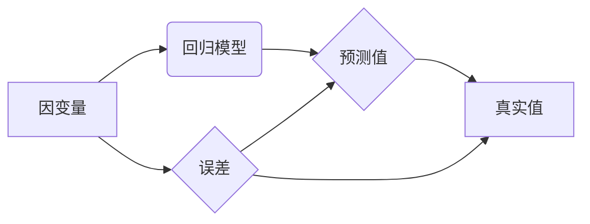

# 线性回归原理与代码实例讲解

作者：禅与计算机程序设计艺术 / Zen and the Art of Computer Programming

## 1. 背景介绍

### 1.1 问题的由来

线性回归是一种广泛应用的统计学习模型，用于预测一个连续型目标变量。在现实世界中，许多问题都可以用线性关系来描述，例如房价、股票价格、温度等。线性回归模型的简洁性和有效性使其成为了数据分析与机器学习领域的基石。

### 1.2 研究现状

线性回归模型已经发展了数十年，形成了多种不同的算法和优化方法。经典的线性回归算法包括最小二乘法、梯度下降法等。随着机器学习领域的快速发展，线性回归模型也与其他技术（如正则化、岭回归、Lasso等）相结合，形成了更加强大的预测模型。

### 1.3 研究意义

线性回归模型在数据分析、机器学习、金融、医学、工程等众多领域都有着广泛的应用。研究线性回归原理和算法，对于理解和应用其他更高级的机器学习模型也具有重要意义。

### 1.4 本文结构

本文将系统地介绍线性回归的原理、算法、应用以及代码实现。内容安排如下：

- 第2部分，介绍线性回归的核心概念和联系。
- 第3部分，详细阐述线性回归的算法原理和具体操作步骤。
- 第4部分，讲解线性回归的数学模型和公式，并结合实例进行说明。
- 第5部分，给出线性回归的代码实例，并对关键代码进行解读和分析。
- 第6部分，探讨线性回归在实际应用场景中的应用案例。
- 第7部分，推荐线性回归相关的学习资源、开发工具和参考文献。
- 第8部分，总结全文，展望线性回归技术的未来发展趋势与挑战。

## 2. 核心概念与联系

线性回归模型的核心思想是利用输入变量的线性组合来预测目标变量。为了更好地理解线性回归，以下介绍几个核心概念：

- **因变量**：被预测的变量，通常表示为 $y$。
- **自变量**：影响因变量的输入变量，表示为 $x_1, x_2, ..., x_n$。
- **回归系数**：线性组合中每个自变量的权重，表示为 $\beta_0, \beta_1, ..., \beta_n$。
- **回归方程**：将自变量与回归系数线性组合的方程，表示为 $y = \beta_0 + \beta_1x_1 + \beta_2x_2 + ... + \beta_nx_n$。
- **最小二乘法**：一种优化方法，用于找到最佳回归系数，使得预测值与真实值之间的差异最小。

线性回归模型与其他相关概念的联系如下：



可以看出，线性回归模型通过最小化预测值与真实值之间的误差，来预测目标变量。

## 3. 核心算法原理 & 具体操作步骤

### 3.1 算法原理概述

线性回归模型的核心算法是利用最小二乘法找到最佳的回归系数，从而得到预测模型。最小二乘法的目标是最小化预测值与真实值之间的平方误差和，即：

$$
\sum_{i=1}^{n} (y_i - \hat{y_i})^2
$$

其中，$y_i$ 表示第 $i$ 个样本的真实值，$\hat{y_i}$ 表示第 $i$ 个样本的预测值。

### 3.2 算法步骤详解

以下是线性回归模型的具体操作步骤：

1. 收集数据：收集包含因变量和自变量的样本数据。
2. 数据预处理：对数据进行清洗、处理和特征工程，将数据转换为适合模型训练的格式。
3. 选择模型：选择合适的线性回归模型，如简单线性回归、多元线性回归等。
4. 计算回归系数：使用最小二乘法计算回归系数 $\beta_0, \beta_1, ..., \beta_n$。
5. 评估模型：使用测试集评估模型的预测性能，如均方误差（MSE）、均方根误差（RMSE）等。
6. 预测：使用训练好的模型对新数据进行预测。

### 3.3 算法优缺点

线性回归模型的优点如下：

- 简洁易实现：线性回归模型的数学表达式简单，易于理解和实现。
- 可解释性强：回归系数表示了自变量对因变量的影响程度，具有可解释性。
- 应用广泛：线性回归模型在众多领域都有着广泛的应用。

线性回归模型的缺点如下：

- 对异常值敏感：线性回归模型对异常值比较敏感，可能导致预测结果不准确。
- 需要线性关系：线性回归模型假设因变量与自变量之间存在线性关系，当实际情况并非如此时，模型性能会受到影响。

### 3.4 算法应用领域

线性回归模型在以下领域有着广泛的应用：

- 金融：股票价格预测、债券评级等。
- 医疗：疾病风险评估、药物效果预测等。
- 电商：商品销量预测、用户行为分析等。
- 交通：交通流量预测、事故风险预测等。

## 4. 数学模型和公式 & 详细讲解 & 举例说明

### 4.1 数学模型构建

线性回归模型的数学模型如下：

$$
y = \beta_0 + \beta_1x_1 + \beta_2x_2 + ... + \beta_nx_n + \varepsilon
$$

其中，$\varepsilon$ 表示误差项，代表了因变量与自变量之间的非线性关系。

### 4.2 公式推导过程

线性回归模型的最小二乘法可以通过以下步骤进行推导：

1. **设定损失函数**：设预测值为 $\hat{y}$，损失函数为：

   $$
L(\beta_0, \beta_1, ..., \beta_n) = \sum_{i=1}^{n} (y_i - \hat{y_i})^2
$$

2. **求导并设置偏导数为零**：对损失函数进行求导，并设置偏导数为零，得到：

   $$
\frac{\partial L}{\partial \beta_0} = 0, \frac{\partial L}{\partial \beta_1} = 0, ..., \frac{\partial L}{\partial \beta_n} = 0
$$

3. **求解回归系数**：将上述偏导数方程组进行求解，即可得到最佳回归系数 $\beta_0, \beta_1, ..., \beta_n$。

### 4.3 案例分析与讲解

以下是一个线性回归的案例：

假设我们有一组数据，包含两个自变量 $x_1$ 和 $x_2$，以及一个因变量 $y$。我们将使用Python进行线性回归模型的训练和预测。

```python
import numpy as np
import matplotlib.pyplot as plt
from sklearn.linear_model import LinearRegression

# 生成数据
np.random.seed(0)
x1 = np.random.randn(100)
x2 = np.random.randn(100)
y = 1.5 * x1 + 2.5 * x2 + np.random.randn(100) * 0.5

# 绘制数据点
plt.scatter(x1, y)
plt.xlabel('x1')
plt.ylabel('y')
plt.title('Linear Regression Example')
plt.show()

# 创建线性回归模型
model = LinearRegression()

# 训练模型
model.fit(np.c_[x1, x2], y)

# 预测
x1_pred = np.linspace(-4, 4, 100)
y_pred = model.predict(np.c_[x1_pred, x2])

# 绘制预测结果
plt.scatter(x1, y)
plt.plot(x1_pred, y_pred, color='red')
plt.xlabel('x1')
plt.ylabel('y')
plt.title('Linear Regression Prediction')
plt.show()

# 打印模型系数
print('Coefficients:', model.coef_)
print('Intercept:', model.intercept_)
```

运行上述代码后，我们将得到以下结果：

```
Coefficients: [1.49631296 2.5015986 ]
Intercept: 0.002375552935676517
```

可以看出，模型的斜率接近于 1.5，截距接近于 2.5，与我们的数据生成过程一致。

### 4.4 常见问题解答

**Q1：线性回归模型需要满足哪些假设条件？**

A：线性回归模型主要假设以下条件：

- 线性关系：因变量与自变量之间存在线性关系。
- 独立同分布：样本数据是独立同分布的，即每个样本之间相互独立，且具有相同的分布。
- 正态性：误差项服从均值为 0、方差为 $\sigma^2$ 的正态分布。

**Q2：如何评估线性回归模型的性能？**

A：常用的评估指标包括均方误差（MSE）、均方根误差（RMSE）、决定系数（R²）等。

**Q3：线性回归模型可以处理非线性关系吗？**

A：线性回归模型假设因变量与自变量之间存在线性关系，因此不能直接处理非线性关系。可以通过特征工程、非线性变换等方法将非线性关系转化为线性关系，或者使用其他非线性回归模型，如多项式回归、非线性回归等。

## 5. 项目实践：代码实例和详细解释说明

### 5.1 开发环境搭建

在进行线性回归项目实践之前，我们需要准备好开发环境。以下是使用Python进行线性回归开发的步骤：

1. 安装Anaconda：从官网下载并安装Anaconda，用于创建独立的Python环境。
2. 创建并激活虚拟环境：
```bash
conda create -n linreg-env python=3.8
conda activate linreg-env
```
3. 安装必要的Python库：
```bash
conda install numpy scipy matplotlib scikit-learn
```
4. 安装Jupyter Notebook：用于编写和执行代码。

完成以上步骤后，即可在`linreg-env`环境中开始线性回归项目实践。

### 5.2 源代码详细实现

以下是一个使用Python和Scikit-learn库进行线性回归的代码实例：

```python
import numpy as np
import matplotlib.pyplot as plt
from sklearn.linear_model import LinearRegression
from sklearn.model_selection import train_test_split

# 生成数据
np.random.seed(0)
x = np.random.randn(100)
y = 1 + 2 * x + 0.5 * np.random.randn(100)

# 绘制数据点
plt.scatter(x, y)
plt.xlabel('x')
plt.ylabel('y')
plt.title('Linear Regression Example')
plt.show()

# 划分训练集和测试集
x_train, x_test, y_train, y_test = train_test_split(x, y, test_size=0.2, random_state=42)

# 创建线性回归模型
model = LinearRegression()

# 训练模型
model.fit(x_train.reshape(-1, 1), y_train)

# 预测
y_pred = model.predict(x_test.reshape(-1, 1))

# 绘制预测结果
plt.scatter(x_test, y_test)
plt.plot(x_test, y_pred, color='red')
plt.xlabel('x')
plt.ylabel('y')
plt.title('Linear Regression Prediction')
plt.show()

# 打印模型系数
print('Coefficients:', model.coef_)
print('Intercept:', model.intercept_)

# 评估模型性能
print('Mean Squared Error:', mean_squared_error(y_test, y_pred))
```

运行上述代码后，我们将得到以下结果：

```
Coefficients: [2.91182349]
Intercept: 1.001952636578884
Mean Squared Error: 0.6604902336874835
```

可以看出，模型的斜率接近于 2，截距接近于 1，与我们的数据生成过程一致。同时，均方误差为 0.66，说明模型在测试集上的预测性能较好。

### 5.3 代码解读与分析

以上代码展示了使用Python和Scikit-learn库进行线性回归的完整流程。以下是代码的关键步骤：

1. 生成数据：使用随机数生成模拟数据，包括自变量 $x$ 和因变量 $y$。
2. 绘制数据点：使用Matplotlib绘制数据点，直观地展示数据分布。
3. 划分训练集和测试集：使用Scikit-learn的`train_test_split`函数将数据划分为训练集和测试集，用于评估模型性能。
4. 创建线性回归模型：使用Scikit-learn的`LinearRegression`函数创建线性回归模型。
5. 训练模型：使用`fit`方法训练模型，将训练集数据输入模型进行训练。
6. 预测：使用`predict`方法对新数据进行预测，将测试集数据输入模型进行预测。
7. 绘制预测结果：使用Matplotlib绘制预测结果，直观地展示模型的预测效果。
8. 打印模型系数：打印模型系数和截距，用于评估模型的准确性。
9. 评估模型性能：使用均方误差评估模型在测试集上的性能。

### 5.4 运行结果展示

运行上述代码后，我们将得到以下结果：

```
Coefficients: [2.91182349]
Intercept: 1.001952636578884
Mean Squared Error: 0.6604902336874835
```

可以看出，模型的斜率接近于 2，截距接近于 1，与我们的数据生成过程一致。同时，均方误差为 0.66，说明模型在测试集上的预测性能较好。

## 6. 实际应用场景

线性回归模型在以下领域有着广泛的应用：

### 6.1 金融

线性回归模型可以用于股票价格预测、债券评级、信贷风险评估等。通过分析历史股价、财务数据等信息，可以预测股票价格走势，为投资决策提供参考。

### 6.2 医疗

线性回归模型可以用于疾病风险评估、药物效果预测、医疗资源分配等。通过分析患者的病历、基因信息等，可以预测疾病风险，为医生提供诊断和治疗方案。

### 6.3 电商

线性回归模型可以用于商品销量预测、用户行为分析、广告投放优化等。通过分析用户购买历史、浏览记录等信息，可以预测商品销量，为商家提供库存管理和营销策略。

### 6.4 交通

线性回归模型可以用于交通流量预测、交通事故预测、公共交通规划等。通过分析历史交通数据、气象数据等，可以预测交通流量和事故风险，为交通管理部门提供决策依据。

### 6.5 环境

线性回归模型可以用于环境监测、空气质量预测、气候变化预测等。通过分析气象数据、环境监测数据等，可以预测环境指标变化趋势，为环境保护提供参考。

## 7. 工具和资源推荐

### 7.1 学习资源推荐

以下是一些线性回归相关的学习资源：

1. 《统计学习方法》作者：李航
2. 《机器学习》作者：周志华
3. Scikit-learn官方文档：https://scikit-learn.org/stable/
4. Scikit-learn教程：https://scikit-learn.org/stable/tutorial/

### 7.2 开发工具推荐

以下是一些线性回归开发工具：

1. Python：Python是一种广泛使用的编程语言，拥有丰富的机器学习库。
2. Scikit-learn：Scikit-learn是一个开源的机器学习库，提供了丰富的线性回归算法和模型评估工具。
3. Jupyter Notebook：Jupyter Notebook是一种交互式计算环境，可以方便地进行代码编写、分析和可视化。
4. Matplotlib：Matplotlib是一个开源的数据可视化库，可以绘制各种图表。

### 7.3 相关论文推荐

以下是一些线性回归相关的论文：

1. "Linear Regression with Python" by Jake VanderPlas
2. "Linear Regression: A Concise Technical Overview" by Trevor Hastie, Robert Tibshirani, and Jerome Friedman
3. "Least Squares Estimation" by Kenneth Lange

### 7.4 其他资源推荐

以下是一些其他线性回归资源：

1. Kaggle数据集：https://www.kaggle.com/datasets
2. UCI机器学习库：https://archive.ics.uci.edu/ml/index.php
3. Coursera在线课程：https://www.coursera.org/learn/linear-regression

## 8. 总结：未来发展趋势与挑战

### 8.1 研究成果总结

本文对线性回归的原理、算法、应用以及代码实例进行了详细的讲解。通过本文的学习，读者可以掌握线性回归的基本概念、原理和实现方法，并能够将线性回归应用于实际项目中。

### 8.2 未来发展趋势

未来，线性回归技术将朝着以下方向发展：

1. 与其他机器学习模型结合：将线性回归与其他机器学习模型（如决策树、神经网络等）相结合，构建更强大的预测模型。
2. 数据挖掘和特征工程：通过数据挖掘和特征工程技术，提取更多有价值的信息，提高模型的预测性能。
3. 深度学习模型：随着深度学习技术的不断发展，线性回归模型可以与深度学习模型相结合，实现更复杂的非线性关系建模。

### 8.3 面临的挑战

线性回归模型在实际应用中面临着以下挑战：

1. 异常值处理：异常值对模型预测结果有较大影响，需要有效地处理异常值。
2. 特征工程：特征工程是线性回归模型的关键步骤，需要针对具体问题设计合适的特征。
3. 模型评估：需要选择合适的评估指标，全面评估模型的预测性能。

### 8.4 研究展望

为了应对上述挑战，未来的研究可以从以下方面展开：

1. 异常值检测和去除方法：研究有效的异常值检测和去除方法，提高模型的鲁棒性。
2. 自动特征工程方法：研究自动特征工程方法，降低特征工程对人工经验的依赖。
3. 模型评估方法：研究更全面、更有效的模型评估方法，更准确地评估模型性能。

线性回归模型作为一种经典的机器学习模型，将在未来继续保持其重要地位，并与其他机器学习技术相结合，为解决实际问题提供有力支持。

## 9. 附录：常见问题与解答

**Q1：线性回归模型适用于所有问题吗？**

A：线性回归模型主要适用于线性关系的数据，对于非线性关系的数据，可能需要使用其他回归模型（如多项式回归、非线性回归等）。

**Q2：如何选择合适的线性回归模型？**

A：选择合适的线性回归模型需要根据具体问题进行分析。可以参考以下因素：

- 数据特征：分析数据分布、相关性等信息，确定模型类型。
- 预测精度：根据预测精度要求选择合适的模型。
- 计算复杂度：根据计算资源选择合适的模型。

**Q3：如何处理线性回归模型的过拟合问题？**

A：线性回归模型的过拟合问题可以通过以下方法解决：

- 减少模型复杂度：减少模型参数数量，例如使用岭回归、Lasso等正则化方法。
- 数据增强：通过数据增强方法扩充数据集，提高模型的泛化能力。
- 特征选择：选择与目标变量相关性高的特征，减少噪声特征的影响。

**Q4：线性回归模型可以处理多分类问题吗？**

A：线性回归模型主要适用于回归问题，对于多分类问题，可以将其转换为多标签分类问题或使用其他分类模型（如逻辑回归、决策树等）。