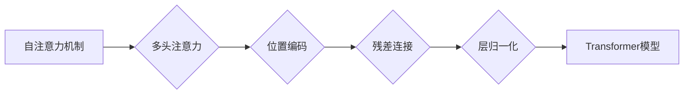

# 训练Transformer模型

作者：禅与计算机程序设计艺术 / Zen and the Art of Computer Programming

## 1. 背景介绍
### 1.1 问题的由来

自2017年Transformer模型横空出世以来，其在自然语言处理（NLP）领域的应用取得了革命性的突破。Transformer模型摒弃了传统的循环神经网络（RNN）和长短时记忆网络（LSTM），采用自注意力机制（Self-Attention）实现了全局信息的捕捉和高效并行计算，从而在诸多NLP任务上取得了当时最先进的性能。随着预训练语言模型（Pre-trained Language Models，PLMs）的兴起，Transformer模型也成为了PLMs的核心组件。因此，训练高效的Transformer模型成为了当前NLP领域的热点问题。

### 1.2 研究现状

近年来，关于Transformer模型的研究主要集中在以下几个方面：

1. **模型结构优化**：通过引入多头注意力、位置编码、残差连接等技术，进一步提升模型的性能和泛化能力。
2. **预训练方法研究**：提出各种预训练任务和策略，以学习更丰富的语言知识，提升模型的表达能力。
3. **下游任务微调**：将预训练模型应用于各种下游任务，如文本分类、机器翻译、问答系统等，实现端到端的模型训练。
4. **模型压缩与加速**：研究如何减小模型尺寸、降低计算复杂度，以便在移动端和边缘设备上部署。

### 1.3 研究意义

训练高效的Transformer模型对于以下方面具有重要意义：

1. **提升NLP任务性能**：通过优化模型结构、预训练方法和下游任务微调策略，提高NLP任务在各个领域的性能。
2. **推动NLP技术发展**：为NLP领域的研究和开发提供新的思路和工具，推动NLP技术的进步。
3. **促进产业应用**：将高效的Transformer模型应用于实际场景，为各个行业带来技术创新和产业升级。

### 1.4 本文结构

本文将系统介绍训练Transformer模型的方法，包括以下几个方面：

- **核心概念与联系**：介绍Transformer模型的基本原理和相关概念。
- **核心算法原理与具体操作步骤**：阐述Transformer模型的具体操作步骤和训练流程。
- **数学模型与公式**：从数学角度分析Transformer模型，并给出相关公式。
- **项目实践**：提供Transformer模型的代码实现，并进行详细解释和分析。
- **实际应用场景**：探讨Transformer模型在各个领域的应用案例。
- **工具和资源推荐**：推荐与Transformer模型相关的学习资源、开发工具和论文。
- **总结**：总结Transformer模型的研究成果、未来发展趋势和挑战。

## 2. 核心概念与联系

### 2.1 Transformer模型概述

Transformer模型是一种基于自注意力机制（Self-Attention）的深度神经网络模型，由Vaswani等人于2017年提出。与传统的循环神经网络（RNN）和长短时记忆网络（LSTM）相比，Transformer模型具有以下优势：

1. **并行计算**：自注意力机制允许模型在全局范围内捕捉信息，实现并行计算，从而提高计算效率。
2. **全局信息捕捉**：自注意力机制能够捕捉到输入序列中任意位置的信息，避免RNN和LSTM的长期依赖问题。
3. **易于扩展**：Transformer模型可以轻松地通过堆叠多个层来增加模型容量，使其能够处理更复杂的任务。

### 2.2 相关概念

1. **自注意力机制（Self-Attention）**：自注意力机制是一种计算输入序列中每个词与其他词之间的关联程度的机制。它通过加权求和的方式，将输入序列转换为高维的表示。
2. **多头注意力（Multi-Head Attention）**：多头注意力将自注意力机制分解为多个子注意力头，以学习到更丰富的表示。
3. **位置编码（Positional Encoding）**：由于Transformer模型没有循环结构，无法直接处理序列中的位置信息。因此，位置编码被引入模型中，为每个词添加位置信息。
4. **残差连接（Residual Connection）**：残差连接可以缓解深层网络中的梯度消失问题，提高模型训练的稳定性。
5. **层归一化（Layer Normalization）**：层归一化可以加速模型训练，并提高模型性能。

### 2.3 关系图

以下为Transformer模型相关概念之间的关系图：



## 3. 核心算法原理 & 具体操作步骤
### 3.1 算法原理概述

Transformer模型主要由以下几个模块组成：

1. **输入嵌入层（Input Embedding Layer）**：将输入序列中的每个词转换为词向量表示。
2. **位置编码层（Positional Encoding Layer）**：为每个词向量添加位置信息。
3. **多头自注意力层（Multi-Head Self-Attention Layer）**：计算输入序列中每个词与其他词之间的关联程度。
4. **前馈神经网络（Feed-Forward Neural Network）**：对每个词向量进行非线性变换。
5. **残差连接层（Residual Connection Layer）**：将前馈神经网络和自注意力层的输出进行残差连接。
6. **层归一化层（Layer Normalization Layer）**：对每个层进行归一化处理。
7. **输出层（Output Layer）**：根据任务需求，选择合适的输出层，如分类层、回归层等。

### 3.2 算法步骤详解

以下是训练Transformer模型的步骤：

1. **准备数据**：收集和预处理数据，包括分词、去除停用词、转换成词向量等。
2. **构建模型**：根据任务需求，选择合适的模型结构，如文本分类、机器翻译、问答系统等。
3. **设置超参数**：设置学习率、批大小、迭代轮数等超参数。
4. **训练模型**：将数据输入模型进行训练，通过梯度下降等优化算法更新模型参数。
5. **评估模型**：在验证集上评估模型性能，根据性能指标调整超参数或模型结构。
6. **模型部署**：将训练好的模型部署到实际场景中，如文本分类、机器翻译等。

### 3.3 算法优缺点

**优点**：

1. **并行计算**：自注意力机制允许模型在全局范围内捕捉信息，实现并行计算，从而提高计算效率。
2. **全局信息捕捉**：自注意力机制能够捕捉到输入序列中任意位置的信息，避免RNN和LSTM的长期依赖问题。
3. **易于扩展**：Transformer模型可以轻松地通过堆叠多个层来增加模型容量，使其能够处理更复杂的任务。

**缺点**：

1. **计算复杂度**：自注意力机制的计算复杂度较高，对硬件资源要求较高。
2. **参数量较大**：Transformer模型的参数量较大，需要大量的计算资源和存储空间。
3. **难以捕捉局部信息**：自注意力机制可能导致模型难以捕捉到输入序列中的局部信息。

### 3.4 算法应用领域

Transformer模型在以下领域得到了广泛应用：

1. **文本分类**：如情感分析、主题分类、实体识别等。
2. **机器翻译**：如机器翻译、文本摘要、问答系统等。
3. **语音识别**：如语音识别、语音合成、语音转换等。
4. **图像识别**：如目标检测、图像分类、图像分割等。

## 4. 数学模型和公式 & 详细讲解 & 举例说明
### 4.1 数学模型构建

Transformer模型的数学模型如下：

$$
\begin{aligned}
\text{Output} &= \text{LayerNorm}(\text{FFN}(\text{LayerNorm}(\text{Self-Attention}(\text{Input}) + \text{Input})) + \text{Input} \
\text{Self-Attention} &= \text{Concat}(\text{Attention}(\text{Query}, \text{Key}, \text{Value}), \text{Attention}(\text{Key}, \text{Query}, \text{Value}), \text{Attention}(\text{Value}, \text{Key}, \text{Query})) \
\text{Attention} &= \text{ScaledDotProductAttention}(\text{Query}, \text{Key}, \text{Value})
\end{aligned}
$$

其中：

- $\text{Input}$ 表示输入序列。
- $\text{Query}$、$\text{Key}$ 和 $\text{Value}$ 分别表示查询向量、键向量和值向量。
- $\text{Attention}$ 表示注意力机制。
- $\text{FFN}$ 表示前馈神经网络。
- $\text{LayerNorm}$ 表示层归一化。
- $\text{Concat}$ 表示拼接操作。

### 4.2 公式推导过程

以下是注意力机制的推导过程：

1. **计算相似度**：首先计算查询向量 $\text{Query}$ 与键向量 $\text{Key}$ 之间的相似度，可以使用点积或余弦相似度。

$$
\text{Similarity}(\text{Query}, \text{Key}) = \text{DotProduct}(\text{Query}, \text{Key})
$$

2. **缩放**：由于相似度计算结果可能非常大，为了防止梯度消失或爆炸，需要对相似度进行缩放。

$$
\text{ScaledSimilarity}(\text{Query}, \text{Key}) = \frac{\text{Similarity}(\text{Query}, \text{Key})}{\sqrt{d_k}}
$$

其中 $d_k$ 为键向量的维度。

3. **应用softmax函数**：将缩放后的相似度应用softmax函数，得到概率分布。

$$
\text{Attention}(\text{Query}, \text{Key}, \text{Value}) = \text{softmax}(\text{ScaledSimilarity}(\text{Query}, \text{Key})) \times \text{Value}
$$

4. **加权求和**：最后，对概率分布进行加权求和，得到注意力机制的输出。

$$
\text{Self-Attention}(\text{Query}, \text{Key}, \text{Value}) = \sum_{k} \text{Attention}(\text{Query}, \text{Key}, \text{Value})
$$

### 4.3 案例分析与讲解

以下是一个简单的文本分类任务的例子：

1. **数据准备**：收集和预处理数据，包括分词、去除停用词、转换成词向量等。
2. **模型构建**：选择合适的Transformer模型结构，如BERT、RoBERTa等。
3. **设置超参数**：设置学习率、批大小、迭代轮数等超参数。
4. **训练模型**：将数据输入模型进行训练，通过梯度下降等优化算法更新模型参数。
5. **评估模型**：在验证集上评估模型性能，根据性能指标调整超参数或模型结构。
6. **模型部署**：将训练好的模型部署到实际场景中，如文本分类、机器翻译等。

### 4.4 常见问题解答

**Q1：Transformer模型的自注意力机制是如何工作的？**

A：自注意力机制是一种计算输入序列中每个词与其他词之间的关联程度的机制。它通过加权求和的方式，将输入序列转换为高维的表示。自注意力机制可以捕捉到输入序列中任意位置的信息，避免RNN和LSTM的长期依赖问题。

**Q2：Transformer模型中多头注意力有什么作用？**

A：多头注意力将自注意力机制分解为多个子注意力头，以学习到更丰富的表示。每个子注意力头关注输入序列的不同方面，从而提高模型的表示能力。

**Q3：位置编码在Transformer模型中有什么作用？**

A：由于Transformer模型没有循环结构，无法直接处理序列中的位置信息。因此，位置编码被引入模型中，为每个词添加位置信息。

**Q4：残差连接在Transformer模型中有什么作用？**

A：残差连接可以缓解深层网络中的梯度消失问题，提高模型训练的稳定性。

## 5. 项目实践：代码实例和详细解释说明
### 5.1 开发环境搭建

以下是使用PyTorch和Transformers库训练Transformer模型的开发环境搭建步骤：

1. 安装Anaconda：
   ```bash
   conda create -n pytorch-env python=3.8
   conda activate pytorch-env
   ```

2. 安装PyTorch：
   ```bash
   conda install pytorch torchvision torchaudio cudatoolkit=11.3 -c pytorch -c conda-forge
   ```

3. 安装Transformers库：
   ```bash
   pip install transformers
   ```

4. 安装其他必要的库：
   ```bash
   pip install torchmetrics scikit-learn pandas tqdm
   ```

### 5.2 源代码详细实现

以下是一个使用PyTorch和Transformers库训练BERT模型进行文本分类的例子：

```python
from transformers import BertForSequenceClassification, BertTokenizer, Trainer, TrainingArguments

def compute_metrics(pred):
    labels = pred.label_ids
    preds = pred.predictions.argmax(-1)
    precision = precision_score(labels, preds, average='micro')
    recall = recall_score(labels, preds, average='micro')
    f1 = f1_score(labels, preds, average='micro')
    return {
        'precision': precision,
        'recall': recall,
        'f1': f1
    }

train_args = TrainingArguments(
    output_dir='./results',
    num_train_epochs=3,
    per_device_train_batch_size=16,
    per_device_eval_batch_size=64,
    warmup_steps=500,
    weight_decay=0.01,
    logging_dir='./logs',
    logging_steps=10,
)

model = BertForSequenceClassification.from_pretrained('bert-base-uncased')

trainer = Trainer(
    model=model,
    args=train_args,
    train_dataset=train_dataset,
    eval_dataset=eval_dataset,
    compute_metrics=compute_metrics
)

trainer.train()
```

### 5.3 代码解读与分析

以上代码展示了使用PyTorch和Transformers库训练BERT模型进行文本分类的完整流程。

1. **导入必要的库**：首先导入所需的库，包括Transformers库、PyTorch、torchmetrics等。

2. **定义计算指标函数**：定义`compute_metrics`函数，用于计算模型的精确率、召回率和F1值等指标。

3. **设置训练参数**：定义`train_args`变量，设置训练参数，如输出目录、迭代轮数、批大小、预热步数、权重衰减等。

4. **加载预训练模型**：加载预训练的BERT模型。

5. **创建Trainer对象**：创建`Trainer`对象，并传入模型、训练参数、训练数据集、评估数据集和计算指标函数。

6. **训练模型**：调用`trainer.train()`方法开始训练模型。

### 5.4 运行结果展示

在训练完成后，可以在`./results`目录下找到训练日志和模型权重文件。在`./logs`目录下可以查看训练过程中的详细日志，包括训练损失、评估指标等。

## 6. 实际应用场景
### 6.1 文本分类

文本分类是Transformer模型应用最广泛的领域之一。例如，可以将Transformer模型应用于情感分析、主题分类、实体识别等任务。

### 6.2 机器翻译

Transformer模型在机器翻译领域也取得了显著的成果。例如，可以将Transformer模型应用于机器翻译、文本摘要、问答系统等任务。

### 6.3 语音识别

Transformer模型在语音识别领域也得到了广泛应用。例如，可以将Transformer模型应用于语音识别、语音合成、语音转换等任务。

### 6.4 未来应用展望

随着Transformer模型和预训练语言模型的不断发展，其在各个领域的应用前景将更加广阔。以下是一些未来应用展望：

1. **多模态信息处理**：将Transformer模型与其他模态信息（如图像、语音等）进行融合，实现更全面、更智能的信息处理。
2. **知识图谱与Transformer模型**：将知识图谱与Transformer模型相结合，实现更强大的知识推理和问答能力。
3. **迁移学习与Transformer模型**：将Transformer模型应用于迁移学习领域，实现跨域模型的可解释性和鲁棒性。
4. **强化学习与Transformer模型**：将Transformer模型与强化学习相结合，实现更智能的决策和规划。

## 7. 工具和资源推荐
### 7.1 学习资源推荐

以下是一些与Transformer模型相关的学习资源：

1. 《Transformer: Attention is All You Need》：Transformer模型的原论文，详细介绍了Transformer模型的原理和设计。
2. 《Attention Is All You Need》中文翻译：Transformer模型的原论文中文翻译版本。
3. 《自然语言处理与深度学习》：李航著，介绍了NLP领域的基本概念和常用算法，包括Transformer模型。
4. 《深度学习自然语言处理》：Yoav Goldberg著，介绍了NLP领域的深度学习算法，包括Transformer模型。

### 7.2 开发工具推荐

以下是一些与Transformer模型相关的开发工具：

1. Transformers库：Hugging Face开源的预训练语言模型库，包含了大量的预训练模型和微调工具。
2. PyTorch：PyTorch是一个开源的深度学习框架，易于使用和扩展，是训练Transformer模型的首选框架。
3. TensorFlow：TensorFlow是Google开源的深度学习框架，功能强大，适用于各种深度学习任务。
4. ONNX Runtime：ONNX Runtime是一个跨平台的运行时，可以将ONNX模型部署到各种设备和平台。

### 7.3 相关论文推荐

以下是一些与Transformer模型相关的论文：

1. “Attention Is All You Need” (Vaswani et al., 2017)：Transformer模型的原论文。
2. “BERT: Pre-training of Deep Bidirectional Transformers for Language Understanding” (Devlin et al., 2018)：BERT模型的原论文。
3. “Generative Pre-trained Transformers for NLP” (Brown et al., 2020)：GPT-3模型的原论文。
4. “T5: Exploring the Limits of Transfer Learning for Text Classification” (Raffel et al., 2020)：T5模型的原论文。

### 7.4 其他资源推荐

以下是一些与Transformer模型相关的其他资源：

1. Hugging Face官网：Hugging Face官网提供了大量的预训练语言模型、微调工具和开源项目。
2. arXiv论文预印本：arXiv论文预印本是一个开源的学术论文预印本平台，包含了大量的NLP领域的最新研究成果。
3. 论坛和社区：如Reddit的r/MachineLearning、r/NLP等，可以获取最新的NLP领域动态和交流心得。

## 8. 总结：未来发展趋势与挑战
### 8.1 研究成果总结

本文介绍了Transformer模型的原理、训练方法和应用场景，并给出了一个简单的代码实例。通过本文的学习，读者可以了解到：

1. Transformer模型的基本原理和设计思想。
2. 如何使用PyTorch和Transformers库训练Transformer模型。
3. Transformer模型在各个领域的应用案例。
4. 未来Transformer模型的研究方向和挑战。

### 8.2 未来发展趋势

未来，Transformer模型和预训练语言模型将朝着以下方向发展：

1. **更大规模的预训练模型**：随着计算资源和数据规模的不断扩大，未来将出现更大规模的预训练模型，以学习更丰富的语言知识。
2. **更轻量级的模型**：为了在移动端和边缘设备上部署，需要开发更轻量级的模型，降低计算复杂度和存储空间需求。
3. **多模态信息处理**：将Transformer模型与其他模态信息（如图像、语音等）进行融合，实现更全面、更智能的信息处理。
4. **知识图谱与Transformer模型**：将知识图谱与Transformer模型相结合，实现更强大的知识推理和问答能力。

### 8.3 面临的挑战

尽管Transformer模型和预训练语言模型取得了显著的成果，但仍然面临着以下挑战：

1. **计算资源瓶颈**：预训练大规模语言模型需要大量的计算资源和存储空间，限制了其应用范围。
2. **数据偏差和模型偏见**：预训练语言模型可能会学习到数据中的偏差和偏见，导致模型输出不公平、歧视性结果。
3. **可解释性和可控性**：当前模型的可解释性和可控性不足，难以理解模型的决策过程和结果。
4. **模型安全性和隐私保护**：模型可能被恶意利用，造成安全隐患和隐私泄露。

### 8.4 研究展望

为了应对上述挑战，未来的研究需要在以下方面进行探索：

1. **高效训练方法**：研究更高效的预训练和微调方法，降低计算资源和存储空间需求。
2. **数据偏差和偏见**：研究如何识别和消除数据偏差和模型偏见，提高模型公平性和可靠性。
3. **可解释性和可控性**：研究如何提高模型的可解释性和可控性，使模型决策过程更加透明和可靠。
4. **模型安全性和隐私保护**：研究如何提高模型安全性和隐私保护，防止模型被恶意利用和隐私泄露。

相信随着研究的不断深入和技术的不断发展，Transformer模型和预训练语言模型将在各个领域发挥更大的作用，为人类创造更多价值。