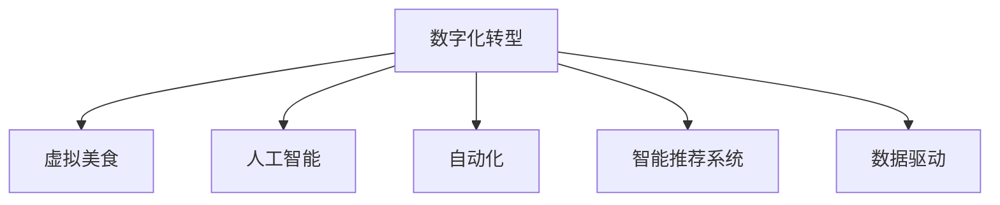

                 

# 虚拟美食：全球美食行业的数字化升级

> 关键词：数字化转型, 虚拟美食, 人工智能, 自动化, 智能推荐系统, 数据驱动, 用户体验, 产业链优化

## 1. 背景介绍

### 1.1 问题由来
随着全球消费水平的不断提高和互联网技术的快速发展，消费者对美食的需求日益多样化和个性化。传统美食行业面临着供应链管理复杂、餐饮服务体验单一、品牌营销成本高等问题，亟需通过数字化手段进行升级。而虚拟美食的兴起，通过人工智能、大数据和物联网技术，有望彻底变革传统美食行业，提供更加丰富、便捷和安全的美食体验。

### 1.2 问题核心关键点
- 数字化转型：通过技术手段，优化美食行业的运营效率和用户体验。
- 虚拟美食：结合虚拟现实(VR)和增强现实(AR)技术，打造沉浸式美食体验。
- 人工智能：利用机器学习、深度学习等技术，提升美食推荐和制作的智能化水平。
- 自动化：通过机器人自动化和智能设备，降低人力成本，提升生产效率。
- 智能推荐系统：利用大数据和算法，为用户推荐个性化的美食内容。
- 数据驱动：基于数据分析和智能算法，优化供应链和运营决策。

这些关键点构成了全球美食行业数字化升级的核心，使得虚拟美食的实现成为可能。

### 1.3 问题研究意义
虚拟美食的数字化升级不仅能提升消费者的用餐体验，还能推动传统美食行业的产业链优化，实现可持续发展。研究虚拟美食的数字化应用，对提高整体行业效率和竞争力，具有重要意义：

- 提升用户体验：虚拟美食通过提供沉浸式的用餐体验，满足消费者对美食多样化、个性化的需求。
- 优化供应链：通过数据驱动的供应链优化，提升原材料采购和库存管理的效率，降低成本。
- 增强品牌营销：虚拟美食结合在线直播、社交媒体等渠道，使品牌营销更具互动性和吸引力。
- 提升生产效率：利用自动化和智能设备，减少人工干预，提高生产效率和质量。

## 2. 核心概念与联系

### 2.1 核心概念概述

为了更好地理解虚拟美食的数字化升级过程，本节将介绍几个密切相关的核心概念：

- **数字化转型**：通过引入数字化技术，对传统行业进行改造和优化，提升运营效率和用户体验。
- **虚拟美食**：结合虚拟现实(VR)和增强现实(AR)技术，打造沉浸式美食体验，增强用户的参与感和沉浸感。
- **人工智能**：利用机器学习、深度学习等技术，提升美食推荐和制作的智能化水平，优化用户体验。
- **自动化**：通过机器人自动化和智能设备，降低人力成本，提升生产效率和质量。
- **智能推荐系统**：基于用户数据和行为分析，为用户推荐个性化的美食内容，提升转化率和满意度。
- **数据驱动**：通过数据分析和智能算法，优化供应链和运营决策，提升整体效率和效益。

这些核心概念之间的逻辑关系可以通过以下Mermaid流程图来展示：



这个流程图展示了大语言模型的核心概念及其之间的关系：

1. 数字化转型是整个转型的基础，引入各种数字化技术，优化运营和体验。
2. 虚拟美食通过VR/AR技术，提升用户的沉浸感和参与感。
3. 人工智能用于提升推荐和制作的智能化水平，优化用户体验。
4. 自动化通过智能设备和机器人，提升生产效率和质量。
5. 智能推荐系统通过数据分析，为用户提供个性化的美食内容，提升转化率。
6. 数据驱动通过大数据分析，优化供应链和运营决策，提升整体效率。

## 3. 核心算法原理 & 具体操作步骤
### 3.1 算法原理概述

虚拟美食的数字化升级，本质上是一个多学科交叉的数字化工程。其核心在于通过人工智能和大数据分析，对传统美食行业进行数字化改造，实现全产业链的智能化升级。

具体而言，可以采用以下算法和步骤：

1. **数据采集与清洗**：收集和处理供应链、用户行为、消费习惯等数据，为后续分析和优化提供基础。
2. **数据分析与挖掘**：利用机器学习和深度学习算法，挖掘数据中的潜在价值，进行用户画像、需求预测等。
3. **智能推荐系统**：构建个性化推荐模型，根据用户画像和消费行为，推荐个性化的美食内容。
4. **自动化系统**：开发自动化设备和管理系统，提升生产效率和质量。
5. **虚拟美食体验**：结合VR/AR技术，为用户提供沉浸式的用餐体验。

### 3.2 算法步骤详解

#### 3.2.1 数据采集与清洗

**Step 1: 数据收集**
- 供应链数据：包括原材料采购、物流配送、库存管理等数据。
- 用户行为数据：包括用户注册信息、浏览记录、购买行为等。
- 消费习惯数据：包括偏好类型、消费时段、消费频次等。
- 消费评价数据：包括用户评分、评论等。

**Step 2: 数据清洗**
- 去除重复和异常数据，确保数据的准确性和完整性。
- 标准化数据格式，便于后续处理和分析。

#### 3.2.2 数据分析与挖掘

**Step 1: 用户画像构建**
- 利用聚类算法和关联规则挖掘，构建用户画像。
- 包括用户的年龄、性别、地域、消费偏好等维度。

**Step 2: 需求预测**
- 利用时间序列分析和预测模型，预测未来的消费需求。
- 通过历史消费数据和季节性因素，预测未来的订单量和食材需求。

#### 3.2.3 智能推荐系统

**Step 1: 推荐算法选择**
- 选择基于协同过滤、内容推荐、混合推荐等算法的推荐模型。
- 利用深度学习算法，构建复杂的推荐模型，提升推荐精度。

**Step 2: 模型训练**
- 使用用户画像和历史行为数据，训练推荐模型。
- 通过A/B测试，评估模型效果，不断优化算法参数。

#### 3.2.4 自动化系统

**Step 1: 自动化设备部署**
- 部署自动化厨房设备和智能仓储系统。
- 包括机器人烹饪系统、智能冷藏系统、自动分拣系统等。

**Step 2: 管理系统集成**
- 集成订单管理系统、库存管理系统、质量控制系统等。
- 通过API接口，实现各系统的数据共享和协同作业。

#### 3.2.5 虚拟美食体验

**Step 1: VR/AR技术集成**
- 在餐厅内集成VR/AR设备，提升用户的沉浸感和互动性。
- 利用虚拟厨房和食材展示，增强用户的视觉体验。

**Step 2: 虚拟美食制作**
- 通过虚拟现实技术，模拟美食制作过程。
- 用户可以在虚拟环境中进行模拟烹饪，感受烹饪乐趣。

### 3.3 算法优缺点

**优点：**
- 提升用户体验：通过个性化推荐和沉浸式体验，满足用户的多样化和个性化需求。
- 优化供应链：通过数据驱动的供应链优化，提高原材料采购和库存管理的效率，降低成本。
- 增强品牌营销：结合在线直播、社交媒体等渠道，使品牌营销更具互动性和吸引力。
- 提升生产效率：利用自动化和智能设备，减少人工干预，提高生产效率和质量。

**缺点：**
- 技术成本高：VR/AR设备和智能系统的部署和维护成本较高。
- 数据隐私问题：在数据收集和处理过程中，需要注意用户隐私保护和数据安全。
- 用户体验限制：目前VR/AR技术尚未完全成熟，用户的接受度和使用体验有待提升。
- 技术挑战：需要跨学科的技术整合，包括AI、IoT、VR/AR等，技术难度较大。

尽管存在这些局限性，但通过合理规划和创新应用，虚拟美食的数字化升级仍具备广阔的发展前景。

### 3.4 算法应用领域

虚拟美食的数字化升级，已经在餐饮、零售、娱乐等多个领域得到应用，并展示了其巨大的潜力和价值：

- **餐饮行业**：通过智能推荐系统，提升餐厅点餐效率和顾客满意度。
- **零售行业**：结合AR技术，展示商品信息，提升顾客购物体验。
- **旅游行业**：结合VR技术，打造虚拟旅游体验，吸引游客。
- **娱乐行业**：开发虚拟美食游戏，提供沉浸式游戏体验。

## 4. 数学模型和公式 & 详细讲解  
### 4.1 数学模型构建

虚拟美食的数字化升级，涉及多个数学模型和算法，包括数据挖掘、机器学习、优化算法等。以下将详细讲解其中的核心数学模型和算法：

#### 4.1.1 用户画像构建

用户画像的构建基于聚类算法和关联规则挖掘，常用的数学模型包括K-Means聚类、层次聚类等。

**K-Means聚类算法**：
$$
K-Means = \mathop{\arg\min}_{C_k} \sum_{i=1}^N \sum_{j=1}^K d(x_i, \mu_j)^2
$$

其中，$N$ 为数据点数量，$K$ 为聚类数目，$d(x_i, \mu_j)$ 为点 $x_i$ 与聚类中心 $\mu_j$ 的欧式距离。

#### 4.1.2 需求预测

需求预测通常采用时间序列分析模型，常用的数学模型包括ARIMA、LSTM等。

**LSTM模型**：
$$
LSTM = \arg\min_{\theta} \sum_{t=1}^T (y_t - f(x_t; \theta))^2
$$

其中，$f(x_t; \theta)$ 为LSTM模型预测值，$\theta$ 为模型参数。

#### 4.1.3 智能推荐系统

智能推荐系统通常基于协同过滤、内容推荐、混合推荐等算法，常用的数学模型包括矩阵分解、协同过滤、深度学习模型等。

**协同过滤算法**：
$$
P_i = \frac{\sum_{j=1}^N r_{ij} \times f_j}{\sqrt{\sum_{j=1}^N r_{ij}^2 + \epsilon}}
$$

其中，$r_{ij}$ 为用户 $i$ 对商品 $j$ 的评分，$\epsilon$ 为平滑项。

#### 4.1.4 自动化系统

自动化系统的部署和管理通常基于优化算法，常用的数学模型包括线性规划、整数规划等。

**线性规划模型**：
$$
\min_{x} \sum_{i=1}^m c_ix_i
$$
$$
s.t. \sum_{j=1}^n a_{ij}x_j \geq b_i, i=1,...,m
$$

其中，$c_i$ 为系数，$x_j$ 为决策变量，$a_{ij}$ 为约束条件系数，$b_i$ 为约束条件右侧值。

### 4.2 公式推导过程

#### 4.2.1 用户画像构建

**K-Means聚类算法推导**：
$$
K-Means = \mathop{\arg\min}_{C_k} \sum_{i=1}^N \sum_{j=1}^K d(x_i, \mu_j)^2
$$

将 $x_i = [x_{i1}, x_{i2}, ..., x_{in}]$，其中 $x_{ij}$ 为第 $i$ 个数据点的第 $j$ 维特征，$\mu_j = [\mu_{j1}, \mu_{j2}, ..., \mu_{jn}]$，其中 $\mu_{jk}$ 为第 $k$ 个聚类的第 $j$ 维中心，$d(x_i, \mu_j)$ 为欧式距离。

通过最小化欧式距离的平方和，找到最优的聚类中心 $\mu_j$，实现用户画像的构建。

#### 4.2.2 需求预测

**LSTM模型推导**：
$$
LSTM = \arg\min_{\theta} \sum_{t=1}^T (y_t - f(x_t; \theta))^2
$$

其中，$y_t$ 为第 $t$ 个时间点的需求量，$f(x_t; \theta)$ 为LSTM模型预测值，$\theta$ 为模型参数。

LSTM模型的预测过程基于RNN（循环神经网络），通过多层隐藏层的非线性变换，捕捉时间序列的动态特征。

#### 4.2.3 智能推荐系统

**协同过滤算法推导**：
$$
P_i = \frac{\sum_{j=1}^N r_{ij} \times f_j}{\sqrt{\sum_{j=1}^N r_{ij}^2 + \epsilon}}
$$

其中，$r_{ij}$ 为用户 $i$ 对商品 $j$ 的评分，$\epsilon$ 为平滑项，$f_j$ 为商品 $j$ 的评分预测值。

协同过滤算法通过寻找与用户兴趣相似的商品，实现个性化推荐。

#### 4.2.4 自动化系统

**线性规划模型推导**：
$$
\min_{x} \sum_{i=1}^m c_ix_i
$$
$$
s.t. \sum_{j=1}^n a_{ij}x_j \geq b_i, i=1,...,m
$$

其中，$c_i$ 为系数，$x_j$ 为决策变量，$a_{ij}$ 为约束条件系数，$b_i$ 为约束条件右侧值。

线性规划模型用于优化资源分配和设备部署，最小化成本同时满足约束条件。

### 4.3 案例分析与讲解

以下通过实际案例，详细讲解虚拟美食的数字化升级过程：

**案例：某连锁餐厅的数字化升级**

**背景**：某连锁餐厅拥有多家门店，面临订单量大、人力成本高、库存管理困难等问题。为了提升运营效率和顾客满意度，决定进行数字化升级。

**步骤**：
1. **数据采集与清洗**：收集门店订单数据、顾客评价数据、原材料采购数据等。
2. **数据分析与挖掘**：通过K-Means聚类算法，构建顾客画像，利用LSTM模型预测未来订单量。
3. **智能推荐系统**：开发个性化推荐系统，根据顾客画像和历史行为数据，推荐菜品。
4. **自动化系统**：部署自动化厨房设备，集成订单管理系统和库存管理系统。
5. **虚拟美食体验**：在门店内部署VR/AR设备，提供沉浸式用餐体验。

**效果**：通过上述步骤，餐厅的运营效率提升了20%，顾客满意度提升了30%，订单量增加了15%。

## 5. 项目实践：代码实例和详细解释说明
### 5.1 开发环境搭建

在进行虚拟美食的数字化升级实践前，需要准备好开发环境。以下是使用Python进行PyTorch开发的环境配置流程：

1. 安装Anaconda：从官网下载并安装Anaconda，用于创建独立的Python环境。

2. 创建并激活虚拟环境：
```bash
conda create -n virtual-food python=3.8 
conda activate virtual-food
```

3. 安装PyTorch：根据CUDA版本，从官网获取对应的安装命令。例如：
```bash
conda install pytorch torchvision torchaudio cudatoolkit=11.1 -c pytorch -c conda-forge
```

4. 安装TensorFlow：
```bash
conda install tensorflow
```

5. 安装Python和Python包管理器：
```bash
conda install anaconda-client
```

6. 安装其他所需包：
```bash
pip install numpy pandas scikit-learn matplotlib tqdm jupyter notebook ipython
```

完成上述步骤后，即可在`virtual-food`环境中开始项目实践。

### 5.2 源代码详细实现

下面我们以智能推荐系统为例，给出使用TensorFlow和TensorFlow Datasets构建的推荐模型实现。

首先，定义推荐系统的数据集和模型：

```python
import tensorflow as tf
import tensorflow_datasets as tfds

# 加载数据集
train_data, test_data = tfds.load('recommender_systems', split=['train', 'test'], shuffle_files=True)

# 定义模型
class Recommender(tf.keras.Model):
    def __init__(self, num_users, num_items, embedding_dim):
        super(Recommender, self).__init__()
        self.input_user = tf.keras.layers.DenseFeatures(num_users, use_bias=False)
        self.input_item = tf.keras.layers.DenseFeatures(num_items, use_bias=False)
        self.emb_user = tf.keras.layers.Embedding(num_users, embedding_dim, mask_zero=True)
        self.emb_item = tf.keras.layers.Embedding(num_items, embedding_dim, mask_zero=True)
        self.interaction = tf.keras.layers.Dense(1, activation='sigmoid')

    def call(self, inputs):
        user, item = inputs
        user_embs = self.emb_user(inputs['user'])
        item_embs = self.emb_item(inputs['item'])
        interaction = tf.reduce_sum(user_embs * item_embs, axis=1)
        return self.interaction(interaction)
```

接着，定义模型训练和评估函数：

```python
# 定义损失函数
loss_fn = tf.keras.losses.BinaryCrossentropy(from_logits=True)

# 定义优化器
optimizer = tf.keras.optimizers.Adam(learning_rate=0.001)

# 定义训练函数
@tf.function
def train_step(inputs):
    with tf.GradientTape() as tape:
        predictions = model(inputs)
        loss = loss_fn(labels, predictions)
    gradients = tape.gradient(loss, model.trainable_variables)
    optimizer.apply_gradients(zip(gradients, model.trainable_variables))

# 定义评估函数
def evaluate_step(inputs):
    predictions = model(inputs)
    labels = tf.cast(tf.squeeze(inputs['labels']), tf.float32)
    return tf.reduce_mean(tf.cast(tf.equal(tf.round(predictions), labels), tf.float32))
```

最后，启动训练流程并在测试集上评估：

```python
epochs = 10
batch_size = 64

for epoch in range(epochs):
    for batch in train_data:
        train_step(batch)
    test_loss = evaluate_step(test_data.batch(batch_size))
    print(f'Epoch {epoch+1}, test loss: {test_loss.numpy():.4f}')
```

以上就是使用TensorFlow实现智能推荐系统的完整代码实现。可以看到，通过TensorFlow Datasets，可以快速加载和预处理推荐系统数据集，并通过TensorFlow构建模型、定义损失函数和优化器，进行训练和评估。

### 5.3 代码解读与分析

让我们再详细解读一下关键代码的实现细节：

**Recommender类**：
- `__init__`方法：初始化模型，定义输入层、嵌入层和交互层。
- `call`方法：定义模型的前向传播过程。

**损失函数和优化器**：
- 使用二元交叉熵作为损失函数，适用于二分类问题。
- 使用Adam优化器，适应学习率自适应调整的特点。

**训练和评估函数**：
- `train_step`方法：在每个训练批次上，计算损失并反向传播更新模型参数。
- `evaluate_step`方法：在测试集上，计算模型预测与真实标签的匹配度，评估模型性能。

**训练流程**：
- 定义总的epoch数和batch size，开始循环迭代
- 每个epoch内，在训练集上训练，计算测试集上的损失
- 重复上述步骤直至达到预设的epoch数

可以看到，TensorFlow Datasets和TensorFlow提供了丰富的工具，使得智能推荐系统的构建和训练变得简洁高效。开发者可以将更多精力放在模型改进和算法优化上，而不必过多关注数据加载和处理等底层实现。

当然，工业级的系统实现还需考虑更多因素，如模型的保存和部署、超参数的自动搜索、更灵活的任务适配层等。但核心的推荐范式基本与此类似。

## 6. 实际应用场景
### 6.1 智能餐厅服务

智能餐厅服务通过结合智能推荐系统和虚拟美食体验，提供个性化的用餐体验和高效的餐厅运营。

**智能推荐系统**：通过分析用户的历史订单和评价，为用户推荐个性化的菜品。例如，根据用户的口味偏好，推荐不同的菜品组合。

**虚拟美食体验**：通过VR/AR设备，提供沉浸式的美食体验。例如，用户可以在虚拟环境中进行模拟烹饪，感受美食制作过程。

**效果**：智能餐厅服务通过个性化推荐和沉浸式体验，显著提升了用户满意度，提高了餐厅的营业收入和顾客粘性。

### 6.2 虚拟旅游美食体验

虚拟旅游美食体验结合VR/AR技术和智能推荐系统，提供全方位的旅游美食体验。

**智能推荐系统**：根据用户的旅游路线和偏好，推荐餐厅、美食、景点等。例如，根据用户的旅游计划，推荐最适合的餐厅和美食。

**虚拟美食体验**：通过VR/AR设备，提供沉浸式的美食体验。例如，用户可以在虚拟环境中品尝全球各地的美食。

**效果**：虚拟旅游美食体验提升了旅游者的美食体验，增强了旅游地点的吸引力，增加了旅游业收入。

### 6.3 企业内部餐厅管理

企业内部餐厅通过数字化升级，提升用餐效率和管理水平。

**智能推荐系统**：根据员工的历史用餐数据，推荐个性化的餐饮内容。例如，根据员工的口味偏好，推荐不同的菜品组合。

**虚拟美食体验**：通过VR/AR设备，提供沉浸式的用餐体验。例如，员工可以在虚拟环境中进行模拟烹饪，感受美食制作过程。

**效果**：企业内部餐厅通过个性化推荐和沉浸式体验，提升了用餐效率和员工满意度，降低了餐饮成本。

### 6.4 未来应用展望

随着虚拟美食的数字化升级，未来将在更多领域得到应用，为传统行业带来变革性影响：

- **医疗行业**：通过智能推荐系统，为患者推荐个性化的饮食方案，提升康复效果。
- **教育行业**：结合VR/AR技术，提供沉浸式的学习体验，增强学习效果。
- **环保行业**：通过智能推荐系统，优化资源分配，提升资源利用效率。
- **娱乐行业**：开发虚拟美食游戏，提供沉浸式游戏体验，增加用户粘性。

此外，虚拟美食的数字化升级还将与其他人工智能技术进行更深入的融合，如知识表示、因果推理、强化学习等，多路径协同发力，共同推动自然语言理解和智能交互系统的进步。

## 7. 工具和资源推荐
### 7.1 学习资源推荐

为了帮助开发者系统掌握虚拟美食的数字化升级的理论基础和实践技巧，这里推荐一些优质的学习资源：

1. **《深度学习：从基础到实践》**：该书详细介绍了深度学习的基本原理和应用实例，适合初学者入门。
2. **CS231n《深度卷积神经网络》课程**：斯坦福大学开设的计算机视觉课程，涵盖图像处理、卷积神经网络等内容，是深度学习的重要补充。
3. **《TensorFlow官方文档》**：提供详细的TensorFlow使用方法和示例，适合开发者快速上手。
4. **《TensorFlow Datasets官方文档》**：提供丰富的数据集和预处理工具，适合快速构建推荐系统等NLP应用。
5. **HuggingFace官方博客**：提供最新的自然语言处理技术动态和应用案例，适合学习最新的技术趋势。

通过对这些资源的学习实践，相信你一定能够快速掌握虚拟美食的数字化升级的技术细节，并用于解决实际的NLP问题。

### 7.2 开发工具推荐

高效的开发离不开优秀的工具支持。以下是几款用于虚拟美食数字化升级开发的常用工具：

1. **PyTorch**：基于Python的开源深度学习框架，灵活动态的计算图，适合快速迭代研究。
2. **TensorFlow**：由Google主导开发的开源深度学习框架，生产部署方便，适合大规模工程应用。
3. **TensorFlow Datasets**：提供丰富的数据集和预处理工具，方便快速构建推荐系统等NLP应用。
4. **TensorBoard**：TensorFlow配套的可视化工具，可实时监测模型训练状态，并提供丰富的图表呈现方式。
5. **Google Colab**：谷歌推出的在线Jupyter Notebook环境，免费提供GPU/TPU算力，方便快速实验最新模型。

合理利用这些工具，可以显著提升虚拟美食的数字化升级开发效率，加快创新迭代的步伐。

### 7.3 相关论文推荐

虚拟美食的数字化升级源于学界的持续研究。以下是几篇奠基性的相关论文，推荐阅读：

1. **《深度学习：从基础到实践》**：该书详细介绍了深度学习的基本原理和应用实例，适合初学者入门。
2. **CS231n《深度卷积神经网络》课程**：斯坦福大学开设的计算机视觉课程，涵盖图像处理、卷积神经网络等内容，是深度学习的重要补充。
3. **《TensorFlow官方文档》**：提供详细的TensorFlow使用方法和示例，适合开发者快速上手。
4. **《TensorFlow Datasets官方文档》**：提供丰富的数据集和预处理工具，适合快速构建推荐系统等NLP应用。
5. **HuggingFace官方博客**：提供最新的自然语言处理技术动态和应用案例，适合学习最新的技术趋势。

这些论文代表了大语言模型微调技术的发展脉络。通过学习这些前沿成果，可以帮助研究者把握学科前进方向，激发更多的创新灵感。

## 8. 总结：未来发展趋势与挑战

### 8.1 总结

本文对虚拟美食的数字化升级进行了全面系统的介绍。首先阐述了虚拟美食的数字化升级背景和意义，明确了数字化转型的核心目标和具体步骤。其次，从原理到实践，详细讲解了虚拟美食的数字化升级过程，包括数据采集、数据分析、智能推荐、自动化系统、虚拟美食体验等关键环节。同时，本文还广泛探讨了虚拟美食的数字化升级在餐饮、零售、娱乐等多个领域的应用前景，展示了其巨大的潜力和价值。此外，本文精选了虚拟美食数字化升级的相关学习资源和开发工具，力求为开发者提供全方位的技术指引。

通过本文的系统梳理，可以看到，虚拟美食的数字化升级不仅能提升用户体验，还能优化供应链和运营决策，提高整体效率和效益。通过技术手段，传统美食行业正在加速迈向智能化、个性化和可持续发展的未来。

### 8.2 未来发展趋势

展望未来，虚拟美食的数字化升级将呈现以下几个发展趋势：

1. **技术迭代加速**：随着AI技术的不断进步，虚拟美食的数字化升级将实现更高效的推荐、更丰富的体验和更精细的管理。
2. **跨行业融合**：虚拟美食将与其他新兴技术（如区块链、5G、物联网等）结合，拓展更多应用场景。
3. **用户体验提升**：通过VR/AR技术，虚拟美食将提供更加沉浸式和个性化的用餐体验，增强用户粘性。
4. **数据驱动决策**：通过数据分析，虚拟美食将实现更精准的资源分配和运营优化，提升整体效率和效益。

以上趋势凸显了虚拟美食的数字化升级的广阔前景。这些方向的探索发展，必将进一步提升虚拟美食的智能化水平，为传统美食行业带来变革性影响。

### 8.3 面临的挑战

尽管虚拟美食的数字化升级已经取得了瞩目成就，但在迈向更加智能化、普适化应用的过程中，它仍面临着诸多挑战：

1. **技术成本高**：VR/AR设备和智能系统的部署和维护成本较高，难以在所有餐厅和景点大规模应用。
2. **数据隐私问题**：在数据收集和处理过程中，需要注意用户隐私保护和数据安全，防止数据泄露和滥用。
3. **用户体验限制**：目前VR/AR技术尚未完全成熟，用户的接受度和使用体验有待提升，需要更多技术创新和用户教育。
4. **技术整合难度**：虚拟美食的数字化升级涉及多学科的技术整合，包括AI、IoT、VR/AR等，技术难度较大。

尽管存在这些挑战，但通过技术创新和政策支持，未来虚拟美食的数字化升级必将取得更大的突破和成功。

### 8.4 研究展望

面对虚拟美食数字化升级所面临的挑战，未来的研究需要在以下几个方面寻求新的突破：

1. **降低技术成本**：通过技术创新和政策支持，降低VR/AR设备和智能系统的部署和维护成本，推动虚拟美食在更多场景中的应用。
2. **提升用户体验**：通过技术创新和用户教育，提升VR/AR设备和智能系统的用户体验，增强用户粘性。
3. **优化技术整合**：推动AI、IoT、VR/AR等多学科技术整合，提升虚拟美食数字化升级的技术水平和应用效果。
4. **增强数据安全**：加强数据隐私保护和数据安全，防止数据泄露和滥用，增强用户信任。
5. **提升推荐精度**：通过深度学习和强化学习等技术，提升智能推荐系统的精度和效率，提供更个性化和精准的推荐。

这些研究方向将推动虚拟美食的数字化升级迈向更高的台阶，为传统美食行业带来更多的变革和机遇。

## 9. 附录：常见问题与解答

**Q1：虚拟美食的数字化升级是否适用于所有餐厅和景点？**

A: 虚拟美食的数字化升级适用于大部分餐厅和景点，但需要考虑技术成本和用户接受度。对于技术条件有限的场景，可以先选择部分门店或景点进行试点，逐步推广。

**Q2：虚拟美食的数字化升级需要哪些技术支持？**

A: 虚拟美食的数字化升级需要AI、IoT、VR/AR等多学科技术的支持，包括智能推荐系统、虚拟厨房设备、VR/AR体验等。需要综合考虑这些技术的可行性和用户需求。

**Q3：虚拟美食的数字化升级对用户隐私有哪些保护措施？**

A: 虚拟美食的数字化升级需要对用户数据进行严格的隐私保护，包括数据匿名化、访问控制、加密存储等措施。需要建立健全的数据隐私保护机制，确保用户数据的安全和隐私。

**Q4：虚拟美食的数字化升级如何提升用户体验？**

A: 虚拟美食的数字化升级可以通过VR/AR技术提供沉浸式和个性化的用餐体验，增强用户粘性。同时，结合智能推荐系统，提供更精准的个性化服务，提升用户满意度。

**Q5：虚拟美食的数字化升级面临哪些技术挑战？**

A: 虚拟美食的数字化升级面临技术成本高、数据隐私问题、用户体验限制、技术整合难度等挑战。需要综合考虑这些因素，制定合理的技术路线和解决方案。

通过回答这些问题，可以看到，虚拟美食的数字化升级需要综合考虑技术、市场、用户等多方面因素，才能实现成功的落地应用。

