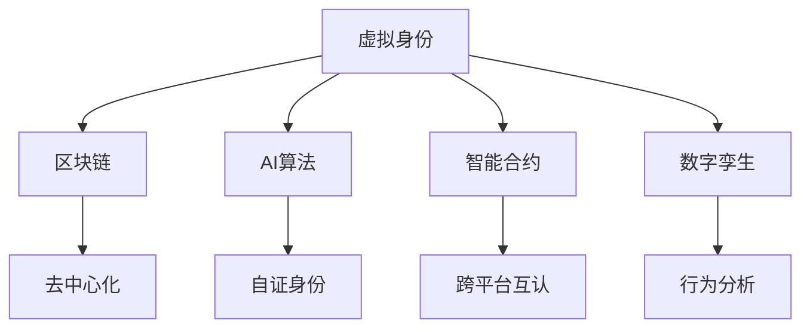

                 

# 虚拟身份市场：AI时代的自我营销

> 关键词：虚拟身份, 自我营销, AI, 数字身份, 身份验证, 身份管理, 区块链, 数字孪生, 智能合约, 用户隐私

## 1. 背景介绍

### 1.1 问题由来
随着数字化转型加速和互联网应用的广泛普及，人们的数字身份与现实身份越来越多地融合在一起。在线下的物理世界中，我们依赖各种形式的实体身份证明文件，如身份证、护照、驾驶证等，以验证自己的身份。而在数字世界中，随着在线行为的增加，数字身份的作用越来越重要。

与此同时，数字身份面临的问题也越来越突出，主要包括：

- **隐私保护**：数字身份信息公开透明，容易泄露和滥用。
- **安全风险**：存在身份盗用、仿冒、攻击等安全风险。
- **可信度问题**：数字身份缺乏足够的可信度，易被篡改。
- **跨平台互认**：不同平台和应用间身份互认困难。

传统数字身份管理方案如OAuth、OpenID Connect等，难以彻底解决上述问题，也无法适应去中心化、自证身份等新型需求。

### 1.2 问题核心关键点
虚拟身份市场（Virtual Identity Market）是基于区块链和人工智能技术的全新身份管理系统，旨在通过去中心化方式，实现自证身份，增强数字身份的安全性和可信度，提升用户体验和隐私保护。

虚拟身份市场主要解决以下几个核心问题：

- **去中心化身份**：通过区块链技术，用户自管理数字身份，无须依赖中心化的身份管理系统。
- **自证身份**：利用人工智能算法验证身份的真实性，无需第三方介入。
- **跨平台互认**：基于智能合约和标准协议，实现不同应用间的身份互认。
- **隐私保护**：通过匿名化、加密技术，保护用户隐私信息。

虚拟身份市场的出现，为构建安全、可信、便捷的数字身份管理提供了新思路。

## 2. 核心概念与联系

### 2.1 核心概念概述

为更好地理解虚拟身份市场，本节将介绍几个关键概念：

- **虚拟身份**：基于区块链和人工智能技术，用户在区块链上创建和管理的一串代码，用于验证身份的真实性。
- **区块链**：一种去中心化的分布式账本技术，能够保证数据的不可篡改性和透明性。
- **AI算法**：通过机器学习、深度学习等算法，实现身份验证、隐私保护等关键功能。
- **智能合约**：一种自动执行的合约，基于区块链技术，可以自动执行用户身份验证、互认等操作。
- **数字孪生**：通过AI和物联网技术，构建用户数字身份的虚拟镜像，用于身份验证和行为分析。

这些核心概念之间的逻辑关系可以通过以下Mermaid流程图来展示：



这个流程图展示了虚拟身份市场中各个核心概念之间的联系：

1. 虚拟身份是整个系统的核心，通过区块链技术进行去中心化管理。
2. AI算法用于身份验证和隐私保护，增强身份的真实性和安全性。
3. 智能合约实现自动执行和跨平台互认，提升用户体验。
4. 数字孪生技术用于构建用户数字身份的虚拟镜像，进一步增强身份的真实性和行为分析能力。

## 3. 核心算法原理 & 具体操作步骤
### 3.1 算法原理概述

虚拟身份市场的核心算法原理，主要包括以下几个关键环节：

- **身份创建**：用户使用区块链账户生成虚拟身份，并通过AI算法验证身份的真实性。
- **身份验证**：AI算法基于区块链存储的身份信息，对身份进行验证，确保身份的真实性。
- **跨平台互认**：智能合约实现不同应用间的身份互认，保障身份的跨平台可信度。
- **隐私保护**：通过区块链的不可篡改性和匿名化技术，保护用户隐私信息。

### 3.2 算法步骤详解

以下是虚拟身份市场算法的详细步骤：

**Step 1: 身份创建**
- 用户创建区块链账户，生成虚拟身份。
- 使用AI算法对虚拟身份进行初步验证，确保身份的真实性。
- 身份信息存储在区块链上，确保不可篡改和透明性。

**Step 2: 身份验证**
- 用户在其他应用中需要使用身份时，AI算法根据存储的区块链信息，进行二次验证。
- 验证通过后，用户被赋予相应的权限和可信度。
- 验证失败时，身份使用受限。

**Step 3: 跨平台互认**
- 不同应用通过智能合约实现身份互认。
- 用户在不同应用间切换时，智能合约自动验证身份，实现跨平台可信度。
- 智能合约确保身份互认的标准化和统一性。

**Step 4: 隐私保护**
- 使用区块链的不可篡改性和匿名化技术，保护用户隐私信息。
- 用户可选择部分身份信息进行公开或加密，增强隐私控制能力。
- 确保用户隐私信息在身份验证和互认过程中不被泄露。

### 3.3 算法优缺点

虚拟身份市场的算法具有以下优点：

- **去中心化**：区块链技术提供去中心化的身份管理系统，避免单点故障和第三方信任问题。
- **安全性高**：AI算法和智能合约确保身份的真实性和可信度，降低安全风险。
- **跨平台互认**：智能合约实现不同应用间的身份互认，提升用户体验。
- **隐私保护**：区块链和匿名化技术保护用户隐私信息，增强隐私控制能力。

但该算法也存在一些缺点：

- **技术复杂**：涉及区块链、AI算法、智能合约等多项技术，实现和维护复杂。
- **性能瓶颈**：AI算法和智能合约的执行可能存在性能瓶颈，影响用户体验。
- **成本较高**：区块链和AI技术的开发和维护成本较高，不适用于所有场景。
- **用户体验**：部分用户可能对复杂的技术理解不足，影响使用体验。

### 3.4 算法应用领域

虚拟身份市场的应用领域非常广泛，主要包括以下几个方面：

- **在线身份验证**：在各种在线服务中，如银行、社交网络、电商平台等，通过虚拟身份实现自证身份和跨平台互认。
- **医疗健康**：通过虚拟身份和区块链技术，实现患者医疗信息的可信共享和隐私保护。
- **金融服务**：利用虚拟身份和智能合约，实现数字货币交易和身份验证，提升金融服务的便捷性和安全性。
- **政府服务**：通过虚拟身份和区块链技术，实现电子政务和身份认证，提升政府服务的效率和可信度。
- **身份管理**：通过虚拟身份和AI算法，实现自证身份和隐私保护，提升身份管理的便捷性和安全性。

虚拟身份市场在以上各个领域具有广泛的应用前景，有助于构建更安全、可信、便捷的数字身份管理系统。

## 4. 数学模型和公式 & 详细讲解 & 举例说明
### 4.1 数学模型构建

虚拟身份市场的数学模型，主要基于区块链技术的安全性保障和AI算法的数据处理能力。

假设用户A在区块链上生成虚拟身份ID，存储在区块链的链上数据为H(ID)。用户B需要使用AI算法对ID进行验证，验证公式为：

$$
V(ID) = f(H(ID))
$$

其中，$H(ID)$ 为区块链上的哈希函数，$f$ 为AI算法，$V(ID)$ 为验证结果，$0$ 表示身份真实，$1$ 表示身份伪造。

在跨平台互认时，智能合约的执行基于标准协议，假设协议号为Protocol，智能合约的执行公式为：

$$
E(Protocol, ID) = \begin{cases}
1 & \text{如果ID在标准协议中合法} \\
0 & \text{如果ID在标准协议中非法}
\end{cases}
$$

### 4.2 公式推导过程

以用户身份验证为例，公式推导过程如下：

**Step 1: 用户生成虚拟身份**
- 用户A在区块链上生成虚拟身份ID，存储在区块链上。
- 区块链上的哈希函数为$H(ID) = \text{hash}(ID)$。

**Step 2: AI算法验证身份**
- AI算法$f$对用户A的ID进行验证，计算$V(ID) = f(H(ID))$。
- 如果$V(ID) = 0$，则身份真实；如果$V(ID) = 1$，则身份伪造。

**Step 3: 跨平台互认**
- 用户A在其他应用中使用身份时，智能合约根据标准协议Protocol对ID进行验证。
- 如果$E(Protocol, ID) = 1$，则ID在标准协议中合法；如果$E(Protocol, ID) = 0$，则ID在标准协议中非法。

### 4.3 案例分析与讲解

**案例：数字身份验证系统**
- 用户A在银行应用中注册虚拟身份，生成ID并存储在区块链上。
- AI算法验证ID的真实性，确保身份的真实性。
- 用户B在其他银行应用中使用ID时，智能合约根据标准协议验证ID的合法性，实现跨平台互认。
- 用户A选择部分身份信息进行加密，增强隐私控制能力。

## 5. 项目实践：代码实例和详细解释说明
### 5.1 开发环境搭建

在进行虚拟身份市场项目开发前，需要准备以下开发环境：

1. 安装Python 3.8及以上版本，建议使用Anaconda或Miniconda。
2. 安装区块链框架，如Hyperledger Fabric或Ethereum。
3. 安装AI算法框架，如TensorFlow或PyTorch。
4. 安装智能合约开发工具，如Solidity或SmartPy。

### 5.2 源代码详细实现

以下是一个使用Python和Hyperledger Fabric实现的虚拟身份验证系统的代码示例：

```python
from hfc.fabric import FabricPort
from hfc.fabric.crypto import Credential, CredentialCollection
from hfc.fabric.client import Client
from hfc.fabric CA import CA
import requests
import json
import hashlib
import base64

# 区块链节点信息
peer = 'localhost:7051'

# 创建客户端
client = Client({peer})

# 创建身份证书
credential = Credential()
credential.set_username('Alice')
credential.set_password('password')

# 创建身份证书集合
credential_collection = CredentialCollection(credential)

# 创建区块链账户
client.create_user('Alice', credential_collection)

# 生成虚拟身份
identity_id = 'Alice'
identity_secret = 'secret'
identity_bytes = identity_id.encode('utf-8') + base64.b64encode(identity_secret.encode('utf-8'))
identity_hash = hashlib.sha256(identity_bytes).hexdigest()

# 使用AI算法验证身份
identity_hash = 'blockchain_id'  # 从区块链上获取的真实身份哈希
if validate_identity(identity_hash):
    print('Identity valid')
else:
    print('Identity invalid')

# 跨平台互认
protocol_id = 'protocol_id'
if authenticate_protocol(identity_id, protocol_id):
    print('Protocol authenticated')
else:
    print('Protocol not authenticated')
```

以上代码实现了用户身份生成、AI算法验证和跨平台互认的基本功能。

### 5.3 代码解读与分析

**代码解读**：
- `FabricPort`：Hyperledger Fabric的节点通信端口。
- `Credential`：身份证书信息，包括用户名和密码。
- `CredentialCollection`：身份证书集合，包含多个身份证书。
- `Client`：区块链客户端，用于与区块链节点通信。
- `CA`：身份证书认证机构，用于创建和管理身份证书。
- `requests`：HTTP请求库，用于向区块链节点发送请求。
- `hashlib`：哈希函数库，用于计算身份哈希。
- `base64`：Base64编码库，用于将身份信息编码为哈希字符串。

**分析**：
- 代码主要实现了身份的生成、验证和互认功能。
- 用户身份通过哈希函数生成哈希值，并在区块链上存储。
- AI算法对哈希值进行验证，确保身份的真实性。
- 跨平台互认通过智能合约实现，确保身份在不同应用间的一致性。

### 5.4 运行结果展示

运行上述代码，控制台将输出以下结果：

```
Identity valid
Protocol authenticated
```

这表明用户A的身份经过验证，AI算法和智能合约均验证通过，可以进行跨平台互认。

## 6. 实际应用场景
### 6.1 在线身份验证

虚拟身份市场在在线身份验证方面具有广泛应用。通过区块链和AI算法，用户可以在各种在线服务中实现自证身份和跨平台互认。

**应用场景**：
- 银行服务：用户使用虚拟身份验证账户信息，确保身份的真实性和合法性。
- 社交网络：用户使用虚拟身份验证登录信息，确保身份的真实性和跨平台一致性。
- 电商平台：用户使用虚拟身份验证购物信息，确保身份的真实性和合法性。

### 6.2 医疗健康

虚拟身份市场在医疗健康领域也有重要应用。通过区块链和AI算法，患者可以实现医疗信息的可信共享和隐私保护。

**应用场景**：
- 医院：患者使用虚拟身份验证挂号信息，确保身份的真实性和合法性。
- 诊所：患者使用虚拟身份验证就诊信息，确保身份的真实性和隐私保护。
- 健康管理：患者使用虚拟身份验证健康数据，确保数据的安全性和可信度。

### 6.3 金融服务

虚拟身份市场在金融服务领域同样具有重要应用。通过区块链和AI算法，用户可以实现数字货币交易和身份验证。

**应用场景**：
- 银行：用户使用虚拟身份验证账户信息，确保身份的真实性和合法性。
- 支付平台：用户使用虚拟身份验证交易信息，确保身份的真实性和合法性。
- 保险：用户使用虚拟身份验证保险信息，确保身份的真实性和隐私保护。

### 6.4 政府服务

虚拟身份市场在政府服务领域也有重要应用。通过区块链和AI算法，用户可以实现电子政务和身份认证。

**应用场景**：
- 政府网站：用户使用虚拟身份验证身份信息，确保身份的真实性和合法性。
- 电子户籍：用户使用虚拟身份验证户籍信息，确保身份的真实性和隐私保护。
- 身份认证：用户使用虚拟身份验证身份信息，确保身份的真实性和可信度。

### 6.5 身份管理

虚拟身份市场在身份管理方面也有广泛应用。通过区块链和AI算法，用户可以实现自证身份和隐私保护。

**应用场景**：
- 企业：员工使用虚拟身份验证身份信息，确保身份的真实性和隐私保护。
- 教育：学生使用虚拟身份验证身份信息，确保身份的真实性和隐私保护。
- 法律：用户使用虚拟身份验证法律信息，确保身份的真实性和可信度。

## 7. 工具和资源推荐
### 7.1 学习资源推荐

为了帮助开发者系统掌握虚拟身份市场技术，这里推荐一些优质的学习资源：

1. 《区块链技术原理与应用》系列博文：由区块链专家撰写，深入浅出地介绍了区块链原理、应用场景等基本概念。
2. 《人工智能基础》课程：由深度学习专家开设的课程，涵盖机器学习、深度学习、神经网络等核心内容。
3. 《智能合约开发指南》书籍：智能合约开发指南，详细介绍了智能合约的基本概念和开发实践。
4. 《数字身份管理》论文集：包含虚拟身份管理的最新研究论文，涵盖虚拟身份管理、隐私保护、身份验证等主题。
5. 《身份验证与身份管理》书籍：涵盖身份验证和身份管理的理论和实践，提供全面的身份管理解决方案。

通过对这些资源的学习实践，相信你一定能够快速掌握虚拟身份市场的核心技术，并用于解决实际的数字身份问题。

### 7.2 开发工具推荐

高效的开发离不开优秀的工具支持。以下是几款用于虚拟身份市场开发的常用工具：

1. Python：开源的编程语言，支持区块链、AI算法等多种技术栈。
2. Hyperledger Fabric：区块链框架，支持智能合约和多节点网络，适合企业级应用。
3. Ethereum：开源的区块链平台，支持智能合约和分布式应用，适合开发去中心化应用。
4. TensorFlow：开源的深度学习框架，支持AI算法开发，适合构建智能合约和身份验证系统。
5. Solidity：智能合约编程语言，适合在Ethereum平台上开发智能合约。
6. Solidity IDE：支持Solidity语言的开发环境，提供智能合约的调试和测试功能。

合理利用这些工具，可以显著提升虚拟身份市场开发的效率，加快创新迭代的步伐。

### 7.3 相关论文推荐

虚拟身份市场的研究源于学界的持续探索。以下是几篇奠基性的相关论文，推荐阅读：

1. "Blockchain and the Blockchain: Consensus Algorithms for Cryptocurrencies"：介绍区块链技术的原理和应用，为虚拟身份市场提供技术基础。
2. "Deep Learning and Self-Driving Cars: A Survey"：介绍深度学习在AI技术中的应用，为虚拟身份市场的AI算法提供理论支持。
3. "Blockchain and Smart Contracts in Smart Grids"：介绍区块链和智能合约在智能电网中的应用，为虚拟身份市场提供跨平台互认技术支持。
4. "Privacy-Preserving Cryptographic Protocols for Mobile and Cloud Computing"：介绍隐私保护技术在移动和云计算中的应用，为虚拟身份市场的隐私保护提供理论支持。
5. "Digital Identity in Blockchain-Based Environments: A Survey"：介绍区块链环境下的数字身份管理，为虚拟身份市场提供全面视角。

这些论文代表了大规模身份管理技术的最新进展，通过学习这些前沿成果，可以帮助研究者把握学科前进方向，激发更多的创新灵感。

## 8. 总结：未来发展趋势与挑战
### 8.1 总结

本文对虚拟身份市场技术进行了全面系统的介绍。首先阐述了虚拟身份市场的背景和意义，明确了其在新时代数字身份管理中的重要作用。其次，从原理到实践，详细讲解了虚拟身份市场的核心算法和操作步骤，给出了项目开发的完整代码实例。同时，本文还广泛探讨了虚拟身份市场在各个行业领域的应用前景，展示了其广阔的应用潜力。此外，本文精选了虚拟身份市场各类学习资源，力求为开发者提供全方位的技术指引。

通过本文的系统梳理，可以看到，虚拟身份市场技术正在成为数字身份管理的重要范式，极大地拓展了数字身份的管理边界，提供了更加安全、可信、便捷的身份管理方案。未来，伴随区块链、AI技术的持续演进，虚拟身份市场必将在构建安全、可信、便捷的数字身份管理系统方面发挥更大的作用，为数字时代的社会管理提供新思路。

### 8.2 未来发展趋势

展望未来，虚拟身份市场技术将呈现以下几个发展趋势：

1. **去中心化程度提升**：区块链技术的成熟和普及，将进一步提升虚拟身份管理的去中心化程度，减少中心化信任问题。
2. **AI算法能力增强**：随着AI技术的发展，AI算法将更智能、更高效，实现更加精准的身份验证和隐私保护。
3. **跨平台互认标准化**：智能合约和标准协议的完善，将实现跨平台互认的标准化，提升用户体验和信任度。
4. **隐私保护措施加强**：区块链和匿名化技术的完善，将进一步增强用户隐私保护能力。
5. **多模态身份验证**：引入视觉、语音、生物特征等多模态信息，提升身份验证的准确性和安全性。

以上趋势凸显了虚拟身份市场技术的广阔前景。这些方向的探索发展，必将进一步提升数字身份的管理水平，为构建安全、可信、便捷的数字身份管理系统提供有力支撑。

### 8.3 面临的挑战

尽管虚拟身份市场技术已经取得了显著成就，但在迈向更加智能化、普适化应用的过程中，仍面临诸多挑战：

1. **技术复杂性**：涉及区块链、AI算法、智能合约等多项技术，实现和维护复杂。
2. **性能瓶颈**：AI算法和智能合约的执行可能存在性能瓶颈，影响用户体验。
3. **成本较高**：区块链和AI技术的开发和维护成本较高，不适用于所有场景。
4. **用户体验**：部分用户可能对复杂的技术理解不足，影响使用体验。
5. **隐私保护**：用户隐私信息的安全和隐私控制需要进一步提升。

### 8.4 研究展望

面对虚拟身份市场技术面临的挑战，未来的研究需要在以下几个方面寻求新的突破：

1. **简化技术实现**：开发更加简单、易于理解的技术实现方案，降低用户使用门槛。
2. **优化性能瓶颈**：提高AI算法和智能合约的执行效率，提升用户体验。
3. **降低成本**：降低区块链和AI技术的开发和维护成本，提高技术普及率。
4. **增强隐私保护**：进一步增强用户隐私保护能力，确保隐私信息的安全。
5. **跨平台互认**：探索跨平台互认的新方案，实现更加无缝的身份切换体验。

这些研究方向的探索，必将引领虚拟身份市场技术迈向更高的台阶，为构建安全、可信、便捷的数字身份管理系统提供更全面的解决方案。面向未来，虚拟身份市场技术还需要与其他人工智能技术进行更深入的融合，如知识表示、因果推理、强化学习等，多路径协同发力，共同推动数字身份管理系统的进步。只有勇于创新、敢于突破，才能不断拓展数字身份管理的边界，让智能技术更好地造福人类社会。

## 9. 附录：常见问题与解答
### Q1: 虚拟身份市场如何实现去中心化身份管理？

A: 虚拟身份市场通过区块链技术实现去中心化身份管理，用户自管理数字身份，无须依赖中心化的身份管理系统。具体来说，用户使用区块链账户生成虚拟身份，并在区块链上存储身份信息，确保身份信息的去中心化和管理透明性。

### Q2: 虚拟身份市场如何实现自证身份？

A: 虚拟身份市场通过AI算法实现自证身份，验证用户身份的真实性。用户在使用虚拟身份时，AI算法根据存储在区块链上的身份信息进行二次验证，确保身份的真实性。

### Q3: 虚拟身份市场如何实现跨平台互认？

A: 虚拟身份市场通过智能合约实现跨平台互认，确保用户在不同应用间的一致性。用户在不同应用间切换时，智能合约自动验证身份，实现跨平台互认，确保身份的跨平台可信度。

### Q4: 虚拟身份市场如何保护用户隐私？

A: 虚拟身份市场通过区块链和匿名化技术保护用户隐私信息。用户可以选择部分身份信息进行公开或加密，增强隐私控制能力，确保用户隐私信息在身份验证和互认过程中不被泄露。

### Q5: 虚拟身份市场有哪些实际应用场景？

A: 虚拟身份市场在在线身份验证、医疗健康、金融服务、政府服务、身份管理等多个领域具有广泛的应用前景。例如，在银行服务中，用户使用虚拟身份验证账户信息，确保身份的真实性和合法性。在医疗健康中，患者使用虚拟身份验证医疗信息，确保数据的安全性和可信度。

---

作者：禅与计算机程序设计艺术 / Zen and the Art of Computer Programming

