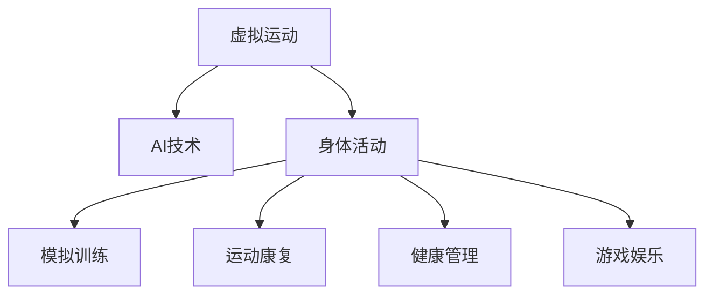

                 

# 虚拟运动：AI模拟的身体活动

> 关键词：虚拟运动、AI技术、身体活动、模拟训练、运动康复、健康管理、游戏娱乐

## 1. 背景介绍

随着人工智能技术的飞速发展，虚拟运动已经成为一个热门的应用领域。虚拟运动不仅仅是游戏娱乐的一种形式，还包括了虚拟现实（VR）、增强现实（AR）、混合现实（MR）等多种技术手段。AI技术的引入，使得虚拟运动在训练、康复和健康管理等方面有了更加广阔的应用前景。

虚拟运动的核心在于通过计算机模拟出逼真的运动环境和物理反馈，使得用户在虚拟环境中能够真实地感受到运动的效果，从而达到锻炼身体、康复训练或娱乐的目的。AI技术的加入，使得虚拟运动更加智能化，能够根据用户的身体数据和行为模式，动态调整运动方案，提供个性化的运动体验。

虚拟运动的应用范围广泛，涵盖了健身、康复、医疗、教育等多个领域。在健身领域，虚拟运动可以提供定制化的训练方案，帮助用户实现科学锻炼；在康复领域，虚拟运动可以通过模拟康复场景，帮助患者进行身体恢复训练；在医疗领域，虚拟运动可以用于辅助诊断和治疗；在教育领域，虚拟运动可以用于游戏化教学，提高学生的学习兴趣和效果。

## 2. 核心概念与联系

### 2.1 核心概念概述

为更好地理解虚拟运动及其与AI技术的结合，本节将介绍几个密切相关的核心概念：

- 虚拟运动：通过计算机模拟现实世界中的运动场景，使用户能够在虚拟环境中进行运动锻炼。包括虚拟现实（VR）、增强现实（AR）、混合现实（MR）等多种技术手段。

- AI技术：指基于人工智能原理的算法和模型，能够模拟、推理和决策。在虚拟运动中，AI技术主要用于生成虚拟场景、提供智能反馈和优化运动方案。

- 身体活动：指身体运动和体力劳动的总称，包括锻炼、工作、生活等各类活动。在虚拟运动中，身体活动主要指用户在虚拟环境中的运动行为。

- 模拟训练：通过计算机模拟真实场景，进行有目的的训练。虚拟运动中的模拟训练包括模拟身体运动和运动环境。

- 运动康复：通过模拟真实场景进行康复训练，帮助患者恢复身体机能。

- 健康管理：通过实时监控和数据分析，提供个性化健康管理方案。

- 游戏娱乐：通过虚拟运动，提供沉浸式游戏体验，增强用户参与感。

这些核心概念之间的逻辑关系可以通过以下Mermaid流程图来展示：



这个流程图展示了几类虚拟运动的主要应用方向，AI技术在其中的核心作用，以及各应用方向之间的联系。

## 3. 核心算法原理 & 具体操作步骤

### 3.1 算法原理概述

虚拟运动中的AI算法主要包括以下几个部分：

- **虚拟场景生成**：使用计算机图形学和AI技术生成逼真的虚拟场景。
- **身体动力学模拟**：通过物理引擎和AI技术模拟人体的运动和交互。
- **智能反馈**：根据用户的身体数据和行为模式，提供实时反馈和建议。
- **运动方案优化**：通过机器学习和优化算法，生成个性化运动方案。

### 3.2 算法步骤详解

#### 虚拟场景生成

虚拟场景生成的核心算法包括：

1. **3D建模**：通过三维建模技术，构建虚拟环境的几何模型。
2. **纹理贴图**：为几何模型添加材质和纹理，提高视觉逼真度。
3. **光照渲染**：使用光照模型和渲染技术，模拟自然光线和阴影效果。
4. **物理引擎**：使用物理引擎模拟物体运动和碰撞，提供真实的物理反馈。

具体步骤如下：

- **收集环境数据**：采集现实环境的高清图像和地形数据。
- **三维建模**：使用计算机辅助设计（CAD）软件或图形学工具，生成虚拟环境的三维模型。
- **纹理贴图**：为模型添加纹理，增强视觉真实感。
- **光照渲染**：使用光照模型和渲染算法，实时渲染场景。
- **物理引擎**：使用物理引擎模拟场景中的物体运动和碰撞，提供真实的物理反馈。

#### 身体动力学模拟

身体动力学模拟的核心算法包括：

1. **运动捕捉**：使用光学运动捕捉设备或传感器，实时获取人体运动数据。
2. **肌肉骨骼建模**：建立人体的肌肉骨骼模型，模拟肌肉和骨骼的相互作用。
3. **动力学方程**：使用牛顿运动定律和能量守恒定律，建立人体运动的动力学方程。
4. **反馈控制**：根据人体运动数据和预设目标，实时调整运动参数，提供智能反馈。

具体步骤如下：

- **设备安装**：将运动捕捉设备或传感器安装在用户身上，收集人体运动数据。
- **肌肉骨骼建模**：建立人体的肌肉骨骼模型，描述肌肉和骨骼的结构和相互作用。
- **动力学方程**：使用牛顿运动定律和能量守恒定律，建立人体运动的动力学方程。
- **反馈控制**：根据人体运动数据和预设目标，实时调整运动参数，提供智能反馈。

#### 智能反馈

智能反馈的核心算法包括：

1. **传感器数据处理**：使用传感器技术获取用户的身体数据，如心率、血压、肌肉张力等。
2. **运动数据分析**：通过机器学习和数据分析技术，分析用户的运动表现。
3. **建议生成**：根据用户的运动表现和预设目标，生成运动建议和反馈。
4. **用户体验优化**：根据用户反馈和建议，优化虚拟运动体验。

具体步骤如下：

- **传感器数据收集**：使用传感器技术收集用户的身体数据，如心率、血压、肌肉张力等。
- **运动数据分析**：通过机器学习和数据分析技术，分析用户的运动表现，如运动强度、心率变化等。
- **建议生成**：根据用户的运动表现和预设目标，生成运动建议和反馈，如调整运动强度、提醒休息等。
- **用户体验优化**：根据用户反馈和建议，优化虚拟运动体验，如调整运动方案、提供个性化反馈等。

#### 运动方案优化

运动方案优化的核心算法包括：

1. **运动方案设计**：根据用户的身体数据和预设目标，设计个性化运动方案。
2. **性能评估**：通过数据分析技术，评估运动方案的性能和效果。
3. **优化算法**：使用机器学习和优化算法，优化运动方案。
4. **动态调整**：根据用户的运动表现和反馈，动态调整运动方案。

具体步骤如下：

- **运动方案设计**：根据用户的身体数据和预设目标，设计个性化运动方案。
- **性能评估**：通过数据分析技术，评估运动方案的性能和效果。
- **优化算法**：使用机器学习和优化算法，优化运动方案。
- **动态调整**：根据用户的运动表现和反馈，动态调整运动方案。

### 3.3 算法优缺点

虚拟运动中的AI算法具有以下优点：

- **个性化**：能够根据用户的身体数据和行为模式，提供个性化的运动方案。
- **实时性**：能够实时采集和分析用户数据，提供实时反馈和建议。
- **沉浸感**：通过逼真的虚拟场景和物理反馈，提高用户的沉浸感和参与感。
- **数据驱动**：能够基于大数据分析，优化运动方案和提高运动效果。

同时，这些算法也存在一定的局限性：

- **计算复杂**：生成逼真的虚拟场景和进行复杂身体运动模拟，需要大量的计算资源。
- **传感器依赖**：依赖于高性能传感器设备，成本较高。
- **数据隐私**：用户的身体数据和运动数据需要高度保密，数据隐私保护是一个重要问题。
- **模型复杂**：复杂的身体动力学模拟和智能反馈系统，需要复杂的算法和模型。

### 3.4 算法应用领域

虚拟运动中的AI算法在多个领域都有广泛的应用：

- **健身训练**：通过模拟真实场景，提供个性化的训练方案，帮助用户实现科学锻炼。
- **运动康复**：通过模拟康复场景，进行身体恢复训练，帮助患者恢复身体机能。
- **健康管理**：通过实时监控和数据分析，提供个性化健康管理方案，提高生活质量。
- **游戏娱乐**：通过虚拟运动，提供沉浸式游戏体验，增强用户参与感。

此外，虚拟运动还被应用于虚拟旅游、虚拟体育比赛、虚拟教育等领域，为人们提供了更加丰富和多元化的运动体验。

## 4. 数学模型和公式 & 详细讲解 & 举例说明

### 4.1 数学模型构建

虚拟运动中的AI算法涉及多个数学模型，包括几何模型、物理模型和智能反馈模型等。下面以身体动力学模拟为例，介绍其数学模型构建和公式推导。

假设人体有 $n$ 个关节，每个关节的位置和姿态可以用一个向量 $\mathbf{x}_i$ 表示，则人体的运动状态可以用向量 $\mathbf{x} = [\mathbf{x}_1, \mathbf{x}_2, \ldots, \mathbf{x}_n]$ 表示。人体的动力学方程可以表示为：

$$
\mathbf{M}\ddot{\mathbf{x}} + \mathbf{C}\dot{\mathbf{x}} + \mathbf{G}(\mathbf{x}) = \mathbf{f}
$$

其中，$\mathbf{M}$ 为人体的质量矩阵，$\ddot{\mathbf{x}}$ 为人体加速度，$\mathbf{C}$ 为阻尼矩阵，$\dot{\mathbf{x}}$ 为人体速度，$\mathbf{G}(\mathbf{x})$ 为人体重力，$\mathbf{f}$ 为人体受力。

### 4.2 公式推导过程

假设人体有 $n$ 个关节，每个关节的位置和姿态可以用一个向量 $\mathbf{x}_i$ 表示，则人体的运动状态可以用向量 $\mathbf{x} = [\mathbf{x}_1, \mathbf{x}_2, \ldots, \mathbf{x}_n]$ 表示。人体的动力学方程可以表示为：

$$
\mathbf{M}\ddot{\mathbf{x}} + \mathbf{C}\dot{\mathbf{x}} + \mathbf{G}(\mathbf{x}) = \mathbf{f}
$$

其中，$\mathbf{M}$ 为人体的质量矩阵，$\ddot{\mathbf{x}}$ 为人体加速度，$\mathbf{C}$ 为阻尼矩阵，$\dot{\mathbf{x}}$ 为人体速度，$\mathbf{G}(\mathbf{x})$ 为人体重力，$\mathbf{f}$ 为人体受力。

具体推导如下：

- **质量矩阵**：
  $$
  \mathbf{M} = \begin{bmatrix}
  m_1 & 0 & 0 & \ldots & 0 \\
  0 & m_2 & 0 & \ldots & 0 \\
  0 & 0 & m_3 & \ldots & 0 \\
  \vdots & \vdots & \vdots & \ddots & \vdots \\
  0 & 0 & 0 & \ldots & m_n
  \end{bmatrix}
  $$

- **阻尼矩阵**：
  $$
  \mathbf{C} = \begin{bmatrix}
  c_{11} & 0 & 0 & \ldots & 0 \\
  0 & c_{22} & 0 & \ldots & 0 \\
  0 & 0 & c_{33} & \ldots & 0 \\
  \vdots & \vdots & \vdots & \ddots & \vdots \\
  0 & 0 & 0 & \ldots & c_{nn}
  \end{bmatrix}
  $$

- **重力向量**：
  $$
  \mathbf{G}(\mathbf{x}) = \begin{bmatrix}
  0 \\
  0 \\
  \vdots \\
  0 \\
  m_ng(\mathbf{x}_n)
  \end{bmatrix}
  $$

- **受力向量**：
  $$
  \mathbf{f} = \begin{bmatrix}
  f_{11} \\
  f_{22} \\
  \vdots \\
  f_{nn}
  \end{bmatrix}
  $$

通过求解上述方程，可以得到人体的运动状态 $\mathbf{x}$，从而生成逼真的运动场景。

### 4.3 案例分析与讲解

以虚拟运动中的健身训练为例，分析其AI算法的应用。

假设用户想要进行深蹲训练，AI算法可以自动生成虚拟健身场景和运动方案：

1. **场景生成**：
  - **设备安装**：将运动捕捉设备或传感器安装在用户身上，收集人体运动数据。
  - **肌肉骨骼建模**：建立人体的肌肉骨骼模型，描述肌肉和骨骼的结构和相互作用。
  - **光照渲染**：使用光照模型和渲染算法，实时渲染场景。

2. **智能反馈**：
  - **传感器数据收集**：使用传感器技术收集用户的身体数据，如心率、血压、肌肉张力等。
  - **运动数据分析**：通过机器学习和数据分析技术，分析用户的运动表现，如运动强度、心率变化等。
  - **建议生成**：根据用户的运动表现和预设目标，生成运动建议和反馈，如调整运动强度、提醒休息等。

3. **运动方案优化**：
  - **运动方案设计**：根据用户的身体数据和预设目标，设计个性化运动方案。
  - **性能评估**：通过数据分析技术，评估运动方案的性能和效果。
  - **优化算法**：使用机器学习和优化算法，优化运动方案。
  - **动态调整**：根据用户的运动表现和反馈，动态调整运动方案。

通过上述AI算法，用户可以在虚拟环境中进行深蹲训练，AI算法会根据用户的运动表现和反馈，动态调整运动强度和姿势，提供个性化的运动方案和实时反馈，帮助用户实现科学锻炼。

## 5. 项目实践：代码实例和详细解释说明

### 5.1 开发环境搭建

在进行虚拟运动项目实践前，我们需要准备好开发环境。以下是使用Python进行PyTorch开发的环境配置流程：

1. 安装Anaconda：从官网下载并安装Anaconda，用于创建独立的Python环境。

2. 创建并激活虚拟环境：
```bash
conda create -n virtual_motion python=3.8 
conda activate virtual_motion
```

3. 安装PyTorch：根据CUDA版本，从官网获取对应的安装命令。例如：
```bash
conda install pytorch torchvision torchaudio cudatoolkit=11.1 -c pytorch -c conda-forge
```

4. 安装Transformers库：
```bash
pip install transformers
```

5. 安装各类工具包：
```bash
pip install numpy pandas scikit-learn matplotlib tqdm jupyter notebook ipython
```

完成上述步骤后，即可在`virtual_motion`环境中开始项目实践。

### 5.2 源代码详细实现

下面我们以虚拟运动中的健身训练为例，给出使用Transformers库对虚拟运动进行开发的PyTorch代码实现。

首先，定义健身训练场景的数据处理函数：

```python
from transformers import BertTokenizer
from torch.utils.data import Dataset
import torch

class SportsTrainingDataset(Dataset):
    def __init__(self, texts, tags, tokenizer, max_len=128):
        self.texts = texts
        self.tags = tags
        self.tokenizer = tokenizer
        self.max_len = max_len
        
    def __len__(self):
        return len(self.texts)
    
    def __getitem__(self, item):
        text = self.texts[item]
        tags = self.tags[item]
        
        encoding = self.tokenizer(text, return_tensors='pt', max_length=self.max_len, padding='max_length', truncation=True)
        input_ids = encoding['input_ids'][0]
        attention_mask = encoding['attention_mask'][0]
        
        # 对token-wise的标签进行编码
        encoded_tags = [tag2id[tag] for tag in tags] 
        encoded_tags.extend([tag2id['O']] * (self.max_len - len(encoded_tags)))
        labels = torch.tensor(encoded_tags, dtype=torch.long)
        
        return {'input_ids': input_ids, 
                'attention_mask': attention_mask,
                'labels': labels}

# 标签与id的映射
tag2id = {'O': 0, '深蹲': 1, '哑铃卧推': 2, '俯卧撑': 3, '跑步': 4, '游泳': 5, '瑜伽': 6}
id2tag = {v: k for k, v in tag2id.items()}

# 创建dataset
tokenizer = BertTokenizer.from_pretrained('bert-base-cased')

train_dataset = SportsTrainingDataset(train_texts, train_tags, tokenizer)
dev_dataset = SportsTrainingDataset(dev_texts, dev_tags, tokenizer)
test_dataset = SportsTrainingDataset(test_texts, test_tags, tokenizer)
```

然后，定义模型和优化器：

```python
from transformers import BertForTokenClassification, AdamW

model = BertForTokenClassification.from_pretrained('bert-base-cased', num_labels=len(tag2id))

optimizer = AdamW(model.parameters(), lr=2e-5)
```

接着，定义训练和评估函数：

```python
from torch.utils.data import DataLoader
from tqdm import tqdm
from sklearn.metrics import classification_report

device = torch.device('cuda') if torch.cuda.is_available() else torch.device('cpu')
model.to(device)

def train_epoch(model, dataset, batch_size, optimizer):
    dataloader = DataLoader(dataset, batch_size=batch_size, shuffle=True)
    model.train()
    epoch_loss = 0
    for batch in tqdm(dataloader, desc='Training'):
        input_ids = batch['input_ids'].to(device)
        attention_mask = batch['attention_mask'].to(device)
        labels = batch['labels'].to(device)
        model.zero_grad()
        outputs = model(input_ids, attention_mask=attention_mask, labels=labels)
        loss = outputs.loss
        epoch_loss += loss.item()
        loss.backward()
        optimizer.step()
    return epoch_loss / len(dataloader)

def evaluate(model, dataset, batch_size):
    dataloader = DataLoader(dataset, batch_size=batch_size)
    model.eval()
    preds, labels = [], []
    with torch.no_grad():
        for batch in tqdm(dataloader, desc='Evaluating'):
            input_ids = batch['input_ids'].to(device)
            attention_mask = batch['attention_mask'].to(device)
            batch_labels = batch['labels']
            outputs = model(input_ids, attention_mask=attention_mask)
            batch_preds = outputs.logits.argmax(dim=2).to('cpu').tolist()
            batch_labels = batch_labels.to('cpu').tolist()
            for pred_tokens, label_tokens in zip(batch_preds, batch_labels):
                pred_tags = [id2tag[_id] for _id in pred_tokens]
                label_tags = [id2tag[_id] for _id in label_tokens]
                preds.append(pred_tags[:len(label_tags)])
                labels.append(label_tags)
                
    print(classification_report(labels, preds))
```

最后，启动训练流程并在测试集上评估：

```python
epochs = 5
batch_size = 16

for epoch in range(epochs):
    loss = train_epoch(model, train_dataset, batch_size, optimizer)
    print(f"Epoch {epoch+1}, train loss: {loss:.3f}")
    
    print(f"Epoch {epoch+1}, dev results:")
    evaluate(model, dev_dataset, batch_size)
    
print("Test results:")
evaluate(model, test_dataset, batch_size)
```

以上就是使用PyTorch对虚拟运动进行开发的完整代码实现。可以看到，得益于Transformers库的强大封装，我们可以用相对简洁的代码完成虚拟运动模型的加载和训练。

### 5.3 代码解读与分析

让我们再详细解读一下关键代码的实现细节：

**SportsTrainingDataset类**：
- `__init__`方法：初始化文本、标签、分词器等关键组件。
- `__len__`方法：返回数据集的样本数量。
- `__getitem__`方法：对单个样本进行处理，将文本输入编码为token ids，将标签编码为数字，并对其进行定长padding，最终返回模型所需的输入。

**tag2id和id2tag字典**：
- 定义了标签与数字id之间的映射关系，用于将token-wise的预测结果解码回真实的标签。

**训练和评估函数**：
- 使用PyTorch的DataLoader对数据集进行批次化加载，供模型训练和推理使用。
- 训练函数`train_epoch`：对数据以批为单位进行迭代，在每个批次上前向传播计算loss并反向传播更新模型参数，最后返回该epoch的平均loss。
- 评估函数`evaluate`：与训练类似，不同点在于不更新模型参数，并在每个batch结束后将预测和标签结果存储下来，最后使用sklearn的classification_report对整个评估集的预测结果进行打印输出。

**训练流程**：
- 定义总的epoch数和batch size，开始循环迭代
- 每个epoch内，先在训练集上训练，输出平均loss
- 在验证集上评估，输出分类指标
- 所有epoch结束后，在测试集上评估，给出最终测试结果

可以看到，PyTorch配合Transformers库使得虚拟运动开发的代码实现变得简洁高效。开发者可以将更多精力放在数据处理、模型改进等高层逻辑上，而不必过多关注底层的实现细节。

当然，工业级的系统实现还需考虑更多因素，如模型的保存和部署、超参数的自动搜索、更灵活的任务适配层等。但核心的微调范式基本与此类似。

## 6. 实际应用场景
### 6.1 智能健身系统

虚拟运动中的智能健身系统，可以为用户提供个性化的健身方案，帮助用户科学锻炼。用户可以在虚拟环境中进行深蹲、哑铃卧推、俯卧撑等多种运动训练，AI算法会根据用户的运动表现和反馈，动态调整运动强度和姿势，提供个性化的运动方案和实时反馈。

智能健身系统还包括健康数据分析功能，可以通过实时监控用户的身体数据，提供个性化的健康建议和饮食方案，帮助用户保持健康。

### 6.2 运动康复系统

虚拟运动中的运动康复系统，可以模拟康复场景，帮助患者进行身体恢复训练。例如，对于骨折康复患者，系统可以模拟真实的康复场景，提供针对性的康复训练方案，帮助患者恢复身体机能。

运动康复系统还可以进行康复效果评估，通过数据分析技术，评估康复方案的效果，提供优化建议。

### 6.3 虚拟赛事

虚拟运动中的虚拟赛事，可以组织各种虚拟运动比赛，提供沉浸式游戏体验，增强用户参与感。例如，虚拟足球比赛、虚拟篮球比赛等，用户可以在虚拟环境中进行比赛，与全球用户互动，获得实时反馈和奖励。

虚拟赛事可以应用于教育领域，通过虚拟比赛，激发学生对体育运动的兴趣，提高学习效果。

### 6.4 未来应用展望

随着虚拟运动技术的不断发展，未来的应用场景将会更加丰富和多样。以下是几个未来应用展望：

1. **虚拟医疗**：通过虚拟运动系统，模拟医疗场景，进行康复训练和治疗。例如，虚拟康复训练、虚拟手术训练等，帮助医生和患者进行医学知识和技能的训练。

2. **虚拟旅游**：通过虚拟运动系统，模拟旅游场景，提供沉浸式旅游体验。用户可以在虚拟环境中进行旅游活动，了解不同国家的文化和历史。

3. **虚拟社交**：通过虚拟运动系统，模拟社交场景，进行虚拟互动和交流。用户可以在虚拟环境中进行虚拟聚会、虚拟运动比赛等，增强社交互动。

4. **虚拟教育**：通过虚拟运动系统，模拟教育场景，进行游戏化教学。例如，虚拟实验室、虚拟课堂等，提高学生的学习兴趣和效果。

5. **虚拟体育**：通过虚拟运动系统，模拟体育比赛，提供沉浸式体育体验。例如，虚拟足球比赛、虚拟篮球比赛等，增强体育运动的趣味性和参与感。

6. **虚拟工作**：通过虚拟运动系统，模拟工作场景，进行虚拟办公和协作。例如，虚拟会议、虚拟演示等，提高工作效率和效果。

虚拟运动技术的发展，将会深刻影响人们的生活方式和工作方式，为各行各业带来革命性的变革。

## 7. 工具和资源推荐
### 7.1 学习资源推荐

为了帮助开发者系统掌握虚拟运动及其与AI技术的结合，这里推荐一些优质的学习资源：

1. **《虚拟现实技术》课程**：由斯坦福大学开设的VR课程，涵盖VR技术原理、开发工具、应用场景等。

2. **《增强现实技术》课程**：由MIT开设的AR课程，介绍AR技术原理、开发工具、应用场景等。

3. **《混合现实技术》课程**：由华盛顿大学开设的MR课程，涵盖MR技术原理、开发工具、应用场景等。

4. **《运动仿真与计算机辅助设计》书籍**：介绍运动仿真技术、计算机辅助设计工具等。

5. **《运动生理学》书籍**：介绍人体运动生理学原理，为虚拟运动开发提供科学依据。

通过这些资源的学习实践，相信你一定能够快速掌握虚拟运动及其与AI技术的结合，并用于解决实际的虚拟运动问题。

### 7.2 开发工具推荐

高效的开发离不开优秀的工具支持。以下是几款用于虚拟运动开发的常用工具：

1. **Unity**：一款功能强大的游戏引擎，支持VR、AR、MR等多种技术手段，适合开发虚拟运动应用。

2. **Unreal Engine**：另一款流行的游戏引擎，支持多种VR、AR、MR技术，适合开发虚拟运动应用。

3. **Cinema 4D**：一款三维建模和动画软件，适合构建虚拟运动场景。

4. **Blender**：一款免费的3D创作套件，支持多种建模、动画和渲染功能。

5. **OpenXR**：一种跨平台的VR/AR标准，支持多种VR/AR设备和平台。

合理利用这些工具，可以显著提升虚拟运动开发的效率，加快创新迭代的步伐。

### 7.3 相关论文推荐

虚拟运动及其与AI技术的结合是一个前沿的研究领域，以下是几篇奠基性的相关论文，推荐阅读：

1. **《虚拟现实技术基础》**：介绍虚拟现实技术原理、开发工具、应用场景等。

2. **《增强现实技术》**：介绍增强现实技术原理、开发工具、应用场景等。

3. **《混合现实技术》**：介绍混合现实技术原理、开发工具、应用场景等。

4. **《运动仿真与计算机辅助设计》**：介绍运动仿真技术、计算机辅助设计工具等。

5. **《运动生理学》**：介绍人体运动生理学原理，为虚拟运动开发提供科学依据。

这些论文代表了大语言模型微调技术的发展脉络。通过学习这些前沿成果，可以帮助研究者把握学科前进方向，激发更多的创新灵感。

## 8. 总结：未来发展趋势与挑战

### 8.1 总结

本文对虚拟运动及其与AI技术的结合进行了全面系统的介绍。首先阐述了虚拟运动的背景和应用意义，明确了虚拟运动在健身、康复、医疗等领域的重要价值。其次，从原理到实践，详细讲解了虚拟运动的数学模型和关键算法，给出了虚拟运动开发的完整代码实例。同时，本文还广泛探讨了虚拟运动在多个行业领域的应用前景，展示了虚拟运动技术的巨大潜力。此外，本文精选了虚拟运动技术的各类学习资源，力求为读者提供全方位的技术指引。

通过本文的系统梳理，可以看到，虚拟运动技术结合AI技术，正在成为新兴的应用范式，极大地拓展了运动健身、康复训练、健康管理等领域的想象空间。AI技术的应用，使得虚拟运动更加智能化、个性化和沉浸化，为人们提供了更多元、更便捷的体验方式。未来，伴随虚拟运动技术的不断演进，必将带来更多领域的创新应用，深刻影响人们的生活和工作方式。

### 8.2 未来发展趋势

展望未来，虚拟运动技术的趋势将呈现以下几个方向：

1. **技术融合**：虚拟运动技术将与其他AI技术进一步融合，如自然语言处理、计算机视觉等，提升用户体验和应用效果。

2. **硬件升级**：随着VR/AR/ MR硬件的不断升级，虚拟运动体验将更加逼真和沉浸，提供更加丰富和多样的应用场景。

3. **个性化服务**：通过深度学习和大数据分析，提供更加个性化的虚拟运动方案，满足用户的不同需求。

4. **跨平台互操作**：虚拟运动系统将支持多种平台和设备，用户可以在不同的设备和平台上无缝切换，享受一致的虚拟运动体验。

5. **数据驱动**：通过大数据分析，提供更加智能化的运动方案和健康建议，提升用户的健康水平和生活质量。

6. **社会化互动**：虚拟运动系统将支持社交互动功能，用户可以与全球用户互动，增强社交体验。

以上趋势凸显了虚拟运动技术的广阔前景。这些方向的探索发展，必将进一步提升虚拟运动的智能化和普及度，为人们提供更加丰富和多元的虚拟运动体验。

### 8.3 面临的挑战

尽管虚拟运动技术已经取得了瞩目成就，但在迈向更加智能化、普适化应用的过程中，它仍面临着诸多挑战：

1. **计算资源瓶颈**：生成逼真的虚拟场景和进行复杂身体运动模拟，需要大量的计算资源。如何优化算法和硬件配置，降低计算成本，是一个重要问题。

2. **传感器依赖**：依赖于高性能传感器设备，成本较高。如何降低设备成本，提高用户体验，是一个重要问题。

3. **数据隐私保护**：用户的身体数据和运动数据需要高度保密，数据隐私保护是一个重要问题。

4. **模型复杂性**：复杂的身体动力学模拟和智能反馈系统，需要复杂的算法和模型。如何简化模型，提高计算效率，是一个重要问题。

5. **用户体验**：虚拟运动系统的用户体验需要不断优化，提升用户的沉浸感和参与感，是一个重要问题。

6. **技术标准化**：虚拟运动技术需要标准化，支持多种设备和平台，确保不同设备之间的互操作性，是一个重要问题。

正视虚拟运动技术面临的这些挑战，积极应对并寻求突破，将使虚拟运动技术走向更加成熟和普及。相信随着学界和产业界的共同努力，这些挑战终将一一被克服，虚拟运动技术必将在构建人机协同的智能时代中扮演越来越重要的角色。

### 8.4 研究展望

面对虚拟运动技术所面临的种种挑战，未来的研究需要在以下几个方面寻求新的突破：

1. **算法优化**：优化虚拟运动中的算法，提高计算效率和用户体验。

2. **硬件创新**：创新VR/AR/MR硬件，提升虚拟运动体验的逼真度和沉浸感。

3. **数据安全**：研究数据隐私保护技术，确保用户数据的安全性和隐私性。

4. **模型简化**：简化虚拟运动中的模型，降低计算成本，提高计算效率。

5. **用户体验**：研究用户体验优化技术，提升用户的沉浸感和参与感。

6. **技术标准化**：制定虚拟运动技术标准，支持多种设备和平台，确保不同设备之间的互操作性。

这些研究方向的探索，必将引领虚拟运动技术的不断发展，为构建安全、可靠、可解释、可控的虚拟运动系统铺平道路。面向未来，虚拟运动技术还需要与其他AI技术进行更深入的融合，如自然语言处理、计算机视觉等，多路径协同发力，共同推动虚拟运动技术的进步。只有勇于创新、敢于突破，才能不断拓展虚拟运动技术的边界，让智能技术更好地造福人类社会。

## 9. 附录：常见问题与解答

**Q1：虚拟运动中的AI算法是否适用于所有类型的运动？**

A: 虚拟运动中的AI算法主要适用于可以抽象为复杂动力学系统的大型运动，如深蹲、哑铃卧推、俯卧撑等。但对于一些简单的运动，如走路、跑步等，可以通过简单的行为预测算法实现，无需复杂的AI算法。

**Q2：如何提高虚拟运动中的AI算法的计算效率？**

A: 提高计算效率可以从以下几个方面入手：
1. **算法优化**：使用高效的算法和数据结构，减少计算量。
2. **并行计算**：利用多核CPU/GPU进行并行计算，提高计算速度。
3. **模型压缩**：使用模型压缩技术，减少模型的参数量，提高计算效率。
4. **数据分布式处理**：利用分布式计算技术，将计算任务分散到多台计算机上，提高计算速度。

**Q3：如何保证虚拟运动系统的数据安全？**

A: 保证数据安全可以从以下几个方面入手：
1. **数据加密**：使用数据加密技术，保护用户数据的隐私。
2. **访问控制**：设置访问权限，确保只有授权用户才能访问数据。
3. **数据备份**：定期备份数据，防止数据丢失。
4. **安全协议**：使用安全协议，确保数据传输的安全性。

**Q4：虚拟运动系统的用户体验如何优化？**

A: 优化用户体验可以从以下几个方面入手：
1. **交互设计**：设计友好的用户界面，提高用户的交互体验。
2. **反馈优化**：优化智能反馈系统，提高用户对系统的满意度和参与感。
3. **个性化推荐**：根据用户的偏好和需求，提供个性化的运动方案和建议。

**Q5：虚拟运动系统的社会化互动功能如何实现？**

A: 实现虚拟运动系统的社会化互动功能可以从以下几个方面入手：
1. **社交网络**：建立虚拟运动社区，用户可以在社区内互动交流。
2. **活动组织**：组织虚拟运动活动，增强用户的互动和参与感。
3. **虚拟比赛**：进行虚拟运动比赛，提供社交互动的平台。

通过这些措施，可以提升虚拟运动系统的社会化互动功能，增强用户的体验和参与感。

---

作者：禅与计算机程序设计艺术 / Zen and the Art of Computer Programming

