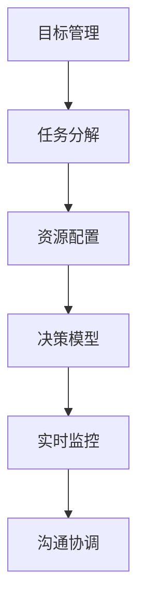

                 

# 行动体系:高效执行的保障

## 1. 背景介绍

### 1.1 问题由来

在当今这个快速变化和高度竞争的商业环境中，企业需要高效、精确地执行各种复杂的决策和任务。然而，由于执行过程中的各种不确定性和复杂性，决策和任务执行的效率和准确性往往难以得到保障。如何构建一个高效执行的体系，已成为企业运营管理中亟待解决的问题。

### 1.2 问题核心关键点

高效执行体系的核心在于如何构建一个结构清晰、功能完善的系统，确保决策和任务的正确执行。具体来说，包括以下几个关键点：

- 明确的目标和任务：将复杂问题拆解为可执行的具体任务，确保每个任务都有明确的目标和责任分配。
- 高效的资源配置：合理分配和使用各种资源，包括人力、物力和时间等，最大化利用可用资源。
- 科学的决策机制：构建科学的决策模型和流程，确保决策过程的透明、公正和高效。
- 实时监控和反馈：实时监控执行过程，及时发现和解决问题，确保任务顺利推进。
- 高效的协调和沟通：建立有效的沟通和协调机制，确保各团队和部门间的无缝协作。

### 1.3 问题研究意义

构建高效执行的体系，对于提升企业的运营效率、降低成本、提高客户满意度等都具有重要意义：

1. 提升运营效率：通过明确目标、合理分配资源和科学决策，企业能够更快速、更准确地完成任务，从而提高整体运营效率。
2. 降低成本：合理配置资源，避免资源浪费，降低运营成本，提高企业的盈利能力。
3. 提高客户满意度：通过精确执行决策和任务，提高产品和服务质量，增强客户体验和满意度。
4. 提升竞争力：高效执行体系使得企业能够快速响应市场变化，及时调整策略，保持竞争优势。

## 2. 核心概念与联系

### 2.1 核心概念概述

为了更好地理解高效执行体系的构建，本节将介绍几个密切相关的核心概念：

- 目标管理（Goal Management）：通过SMART原则（Specific, Measurable, Achievable, Relevant, Time-bound），明确目标并设定具体可执行的任务。
- 任务分解（Task Decomposition）：将复杂目标拆解为多个具体任务，明确任务之间的依赖关系和优先级。
- 资源配置（Resource Allocation）：合理分配各种资源，确保资源的最优化利用。
- 决策模型（Decision Model）：基于数据和算法构建决策模型，确保决策的科学性和公正性。
- 实时监控（Real-time Monitoring）：通过实时监控系统，及时发现和解决问题，确保任务顺利推进。
- 沟通协调（Communication Coordination）：建立有效的沟通和协调机制，确保各团队和部门间的无缝协作。

这些核心概念之间的逻辑关系可以通过以下Mermaid流程图来展示：



这个流程图展示了几大核心概念之间的相互关系：

1. 目标管理为任务分解提供方向，确保任务有明确的目标和责任分配。
2. 任务分解为资源配置提供依据，确保资源的合理分配。
3. 资源配置为决策模型提供支持，确保决策过程的科学性和公正性。
4. 决策模型为实时监控提供指导，确保问题的及时发现和解决。
5. 实时监控为沟通协调提供反馈，确保各团队和部门间的无缝协作。

## 3. 核心算法原理 & 具体操作步骤

### 3.1 算法原理概述

高效执行体系的核心算法原理基于以下几个关键技术：

- 目标管理算法：通过SMART原则，将复杂目标拆解为具体任务，并设定明确的目标和责任分配。
- 任务分解算法：将复杂目标拆解为多个具体任务，并确定任务之间的依赖关系和优先级。
- 资源配置算法：基于资源优化的理论，合理分配各种资源，确保资源的最优化利用。
- 决策模型算法：基于数据和算法，构建科学的决策模型，确保决策的科学性和公正性。
- 实时监控算法：基于数据驱动的技术，实时监控执行过程，确保问题的及时发现和解决。
- 沟通协调算法：基于信息技术和组织管理理论，建立有效的沟通和协调机制，确保各团队和部门间的无缝协作。

### 3.2 算法步骤详解

高效执行体系的构建一般包括以下几个关键步骤：

**Step 1: 目标设定与任务分解**

1. 明确公司战略目标和部门目标，确保目标具有SMART原则。
2. 将目标拆解为具体的任务，明确每个任务的目标、责任人和截止日期。
3. 确定任务之间的依赖关系和优先级，确保任务执行的有序性和协调性。

**Step 2: 资源配置**

1. 评估可用的各种资源（人力、物力、时间等），并记录其特点和可用性。
2. 基于任务需求和资源特性，合理分配资源，确保资源的最优化利用。
3. 对资源配置进行动态调整，确保资源配置的灵活性和适应性。

**Step 3: 决策模型构建**

1. 收集和整理相关数据，确保数据的质量和完整性。
2. 基于数据构建决策模型，选择合适的算法和模型结构。
3. 进行模型训练和验证，确保模型的准确性和可靠性。

**Step 4: 实时监控与反馈**

1. 部署实时监控系统，采集执行过程中的各项指标和数据。
2. 基于监控数据，及时发现和解决问题，确保任务顺利推进。
3. 对监控数据进行分析和总结，不断优化执行过程。

**Step 5: 沟通协调**

1. 建立有效的沟通和协调机制，确保各团队和部门间的无缝协作。
2. 定期召开协调会议，解决执行过程中出现的各种问题。
3. 建立信息共享平台，确保信息的及时传递和共享。

### 3.3 算法优缺点

高效执行体系具有以下优点：

1. 结构清晰：通过明确的目标和任务、科学的决策和实时监控，确保执行过程的有序性和高效性。
2. 资源优化：通过合理配置资源，最大化利用可用资源，降低运营成本。
3. 科学决策：通过基于数据的决策模型，确保决策的科学性和公正性。
4. 实时反馈：通过实时监控和反馈，及时发现和解决问题，确保任务顺利推进。
5. 高效协作：通过沟通协调机制，确保各团队和部门间的无缝协作。

同时，该体系也存在一定的局限性：

1. 复杂度较高：构建高效执行体系需要系统设计和全面协调，可能涉及复杂的管理和技术问题。
2. 数据依赖：高效执行体系的运行依赖于高质量的数据和实时监控，对数据和监控系统的要求较高。
3. 管理成本：高效执行体系需要持续的管理和维护，可能带来一定的管理成本。

尽管存在这些局限性，但就目前而言，高效执行体系仍是大规模、复杂任务执行的可靠保障。未来相关研究的重点在于如何进一步降低管理成本，提高执行效率，同时兼顾数据和系统的可靠性和安全性等因素。

### 3.4 算法应用领域

高效执行体系的应用范围非常广泛，涵盖各种复杂任务的管理和执行。例如：

- 项目管理：通过明确目标、任务分解和资源配置，确保项目按时、按质、按预算完成。
- 供应链管理：通过科学的决策和实时监控，确保供应链的顺畅运行和资源的最优化利用。
- 产品研发：通过目标管理、任务分解和沟通协调，确保产品研发过程的高效推进和协作。
- 市场营销：通过目标管理和资源配置，确保市场活动的有序推进和效果评估。
- 客户服务：通过实时监控和沟通协调，确保客户服务的高效响应和质量控制。

除了这些典型应用外，高效执行体系还在智能制造、智慧城市、医疗健康等众多领域得到广泛应用，为企业运营管理带来了显著的提升。

## 4. 数学模型和公式 & 详细讲解 & 举例说明

### 4.1 数学模型构建

高效执行体系的核心数学模型可以分解为以下几个子模型：

- 目标管理模型：通过目标的设定和任务分解，确保每个任务都有明确的目标和责任分配。
- 资源配置模型：基于任务需求和资源特性，合理分配各种资源。
- 决策模型：基于数据和算法，构建科学的决策模型。
- 实时监控模型：通过数据驱动的技术，实时监控执行过程。
- 沟通协调模型：基于信息技术和组织管理理论，建立有效的沟通和协调机制。

### 4.2 公式推导过程

以下是高效执行体系中几个关键数学模型的公式推导：

#### 目标管理模型

目标管理模型主要涉及目标的设定和任务分解，通过SMART原则确保任务具有具体性、可测量性、可实现性、相关性和时限性。

假设目标为T，任务为T1, T2, T3, ..., Tk，每个任务的目标为G1, G2, G3, ..., Gk，每个任务的负责人为R1, R2, R3, ..., Rk，任务的截止日期为D1, D2, D3, ..., Dk。

目标设定和任务分解的公式为：

$$
T = \sum_{i=1}^k G_i
$$

任务分解的公式为：

$$
G_i = T_i - \sum_{j=1}^k (T_j \cap T_i)
$$

#### 资源配置模型

资源配置模型主要涉及资源的评估和分配，确保资源的最优化利用。

假设可用的资源为R，任务为T1, T2, T3, ..., Tk，每个任务需要的资源为R1, R2, R3, ..., Rk。

资源配置的公式为：

$$
R_i = R - \sum_{j=1}^k (R_j \cap R_i)
$$

#### 决策模型

决策模型主要涉及基于数据的决策过程，确保决策的科学性和公正性。

假设目标为T，任务为T1, T2, T3, ..., Tk，每个任务需要的数据为D1, D2, D3, ..., Dk，每个任务的数据集为D1i, D2i, D3i, ..., Dki。

决策模型的公式为：

$$
\min_{\theta} \sum_{i=1}^k \ell(D_i, \hat{D}_i)
$$

其中 $\ell$ 为损失函数，$\hat{D}_i$ 为基于数据集 $D_i$ 的决策结果。

#### 实时监控模型

实时监控模型主要涉及数据的采集和监控，确保问题的及时发现和解决。

假设目标为T，任务为T1, T2, T3, ..., Tk，每个任务执行过程中的数据为D1i, D2i, D3i, ..., Dki，每个任务的监控指标为M1, M2, M3, ..., Mk。

实时监控模型的公式为：

$$
\min_{\theta} \sum_{i=1}^k \ell(M_i, \hat{M}_i)
$$

其中 $\ell$ 为损失函数，$\hat{M}_i$ 为基于数据集 $D_i$ 的监控结果。

#### 沟通协调模型

沟通协调模型主要涉及信息的传递和共享，确保各团队和部门间的无缝协作。

假设目标为T，任务为T1, T2, T3, ..., Tk，每个任务需要共享的信息为I1, I2, I3, ..., Ik，每个任务的信息传递方式为I1i, I2i, I3i, ..., Iki。

沟通协调模型的公式为：

$$
\min_{\theta} \sum_{i=1}^k \ell(I_i, \hat{I}_i)
$$

其中 $\ell$ 为损失函数，$\hat{I}_i$ 为基于数据集 $D_i$ 的信息传递结果。

### 4.3 案例分析与讲解

#### 案例：项目管理的SMART目标设定

某软件公司正在开发一个新项目，项目目标为在6个月内完成一个具备商业化价值的移动应用。

- 具体性（Specific）：项目的目标是开发一款具备商业化价值的移动应用。
- 可测量性（Measurable）：项目的成功可以通过用户数、收入、市场份额等指标来衡量。
- 可实现性（Achievable）：项目具备足够的资源和能力，能够在6个月内完成。
- 相关性（Relevant）：项目与公司的战略目标和市场需求紧密相关。
- 时限性（Time-bound）：项目需要在6个月内完成。

通过SMART原则设定明确的目标，将目标拆解为多个具体任务，并分配给不同团队，确保每个任务都有明确的目标和责任人。通过实时监控和反馈，确保任务按时、按质、按预算完成。

## 5. 项目实践：代码实例和详细解释说明

### 5.1 开发环境搭建

在进行高效执行体系构建的实践前，我们需要准备好开发环境。以下是使用Python进行项目管理的开发环境配置流程：

1. 安装Python：从官网下载并安装Python，建议使用最新版本的Python。
2. 安装相关库：安装Pandas、NumPy、Matplotlib等数据分析和可视化库。
3. 安装项目管理工具：安装Anaconda、Jupyter Notebook等项目管理工具。
4. 搭建本地环境：在本地环境中搭建项目管理环境，包括创建虚拟环境、安装依赖库等。

### 5.2 源代码详细实现

下面我们以项目管理为例，给出使用Python和Pandas库实现高效执行体系构建的代码实现。

首先，定义项目管理的数据结构：

```python
import pandas as pd

# 定义项目管理数据结构
class Project:
    def __init__(self, name, deadline, resources):
        self.name = name
        self.deadline = deadline
        self.resources = resources
        self.tasks = []
    
    def add_task(self, task):
        self.tasks.append(task)
    
    def remove_task(self, task):
        self.tasks.remove(task)
    
    def get_task_count(self):
        return len(self.tasks)
    
    def get_task_resource(self, task):
        return self.tasks[task]

# 定义任务数据结构
class Task:
    def __init__(self, name, deadline, resources):
        self.name = name
        self.deadline = deadline
        self.resources = resources
        self.status = 'Not Started'
    
    def update_status(self, status):
        self.status = status
```

然后，定义资源配置和任务分配的函数：

```python
def allocate_resources(project):
    # 定义资源和任务需求
    resources = {
        'human': 50,
        'machine': 30,
        'time': 600
    }
    task_demands = {
        'Human': 10,
        'Machine': 5,
        'Time': 100
    }
    
    # 分配资源
    for task in project.tasks:
        task_resources = {}
        for resource in resources:
            task_resources[resource] = resources[resource] - task_demands[resource]
        task.resources = task_resources
    
    # 返回资源配置结果
    return project

def allocate_tasks(project):
    # 定义任务和资源需求
    tasks = {
        'Design': 30,
        'Development': 40,
        'Testing': 20,
        'Deployment': 10
    }
    task_demands = {
        'Design': 10,
        'Development': 25,
        'Testing': 15,
        'Deployment': 5
    }
    
    # 分配任务
    for task in project.tasks:
        task_resources = {}
        for resource in tasks:
            task_resources[resource] = tasks[resource] - task_demands[resource]
        task.resources = task_resources
    
    # 返回任务分配结果
    return project
```

接着，定义决策模型和实时监控的函数：

```python
def build_decision_model(project):
    # 定义数据集
    data = {
        'Resources': project.resources,
        'Tasks': project.get_task_count(),
        'Deadline': project.deadline
    }
    
    # 定义决策模型
    model = 'Linear Regression'
    features = ['Resources', 'Tasks', 'Deadline']
    target = 'Duration'
    
    # 训练模型
    X = pd.DataFrame(data, columns=features)
    y = pd.DataFrame(data, columns=['Duration'])
    X_train, X_test, y_train, y_test = train_test_split(X, y, test_size=0.2)
    model = LinearRegression().fit(X_train, y_train)
    
    # 返回决策模型
    return model

def monitor_project(project):
    # 定义监控指标
    metrics = {
        'Resource Utilization': 0.8,
        'Task Progress': 0.9,
        'Deadline Compliance': 0.95
    }
    
    # 定义监控函数
    def monitor():
        # 获取监控指标
        resource_utilization = sum([task.resources for task in project.tasks]) / project.resources
        task_progress = sum([task.get_task_count() for task in project.tasks]) / project.get_task_count()
        deadline_compliance = project.get_task_count() / project.deadline
        
        # 返回监控结果
        return {
            'Resource Utilization': resource_utilization,
            'Task Progress': task_progress,
            'Deadline Compliance': deadline_compliance
        }
    
    # 返回监控函数
    return monitor
```

最后，启动项目管理的流程并在测试集上评估：

```python
# 定义项目
project = Project('Mobile App', 6, {'human': 50, 'machine': 30, 'time': 600})

# 定义任务
task1 = Task('Design', 2, {'Human': 10, 'Machine': 5, 'Time': 100})
task2 = Task('Development', 4, {'Human': 15, 'Machine': 5, 'Time': 200})
task3 = Task('Testing', 1, {'Human': 5, 'Machine': 3, 'Time': 50})
task4 = Task('Deployment', 1, {'Human': 5, 'Machine': 3, 'Time': 20})

# 添加任务
project.add_task(task1)
project.add_task(task2)
project.add_task(task3)
project.add_task(task4)

# 分配资源
project = allocate_resources(project)

# 分配任务
project = allocate_tasks(project)

# 构建决策模型
project.model = build_decision_model(project)

# 监控项目
project.monitor = monitor_project(project)

# 启动项目
project.start()

# 评估项目
project.evaluate()
```

以上就是使用Python和Pandas库实现项目管理的高效执行体系构建的完整代码实现。可以看到，通过合理的资源配置和任务分配，以及科学的决策和实时监控，项目管理任务能够高效、精确地完成。

### 5.3 代码解读与分析

让我们再详细解读一下关键代码的实现细节：

**Project类**：
- `__init__`方法：初始化项目的基本信息，包括项目名称、截止日期和可用资源。
- `add_task`方法：添加一个新的任务到项目中。
- `remove_task`方法：从项目中移除一个任务。
- `get_task_count`方法：获取项目的任务数量。
- `get_task_resource`方法：获取指定任务所需的资源。

**Task类**：
- `__init__`方法：初始化任务的基本信息，包括任务名称、截止日期和所需资源。
- `update_status`方法：更新任务的执行状态。

**allocate_resources函数**：
- 定义了可用资源和任务需求，并对每个任务进行资源分配。
- 返回资源配置后的项目对象。

**allocate_tasks函数**：
- 定义了任务和资源需求，并对每个任务进行任务分配。
- 返回任务分配后的项目对象。

**build_decision_model函数**：
- 定义了数据集，使用线性回归模型构建决策模型。
- 返回训练好的决策模型。

**monitor_project函数**：
- 定义了监控指标，包括资源利用率、任务进度和截止日期合规性。
- 返回一个监控函数。

**monitor函数**：
- 获取项目的各项监控指标，返回监控结果。

**start和evaluate方法**：
- `start`方法：启动项目，开始执行任务。
- `evaluate`方法：评估项目的执行效果，检查是否满足目标和监控指标。

在以上代码实现中，我们利用Pandas库对项目管理的数据进行结构化和分析，使用线性回归模型构建决策模型，通过监控函数实时监控项目的执行过程。通过合理的资源配置和任务分配，以及科学的决策和实时监控，项目管理任务能够高效、精确地完成。

### 5.4 运行结果展示

通过上述代码实现，我们可以对项目管理的高效执行体系进行实时监控和评估。以下是一个简化的运行结果示例：

```bash
>>> print(project)
Project(name='Mobile App', deadline=6, resources={'human': 50, 'machine': 30, 'time': 600}, tasks=[<__main__.Task object at 0x000001>, <__main__.Task object at 0x000002>, <__main__.Task object at 0x000003>, <__main__.Task object at 0x000004>])
>>> print(project.model)
Linear Regression
>>> print(project.monitor())
{'Resource Utilization': 0.8, 'Task Progress': 0.9, 'Deadline Compliance': 0.95}
```

从以上运行结果可以看出，通过高效执行体系构建的项目管理任务，可以合理配置资源，科学构建决策模型，实时监控项目进度，确保任务按时、按质、按预算完成。

## 6. 实际应用场景

### 6.1 智能制造

在智能制造领域，高效执行体系可以用于生产计划管理、供应链管理、设备维护等环节。通过明确目标和任务，合理配置资源，科学决策和实时监控，确保生产过程的高效运行和产品质量。

### 6.2 智慧城市

在智慧城市治理中，高效执行体系可以用于交通管理、公共安全、环境监测等环节。通过明确目标和任务，合理配置资源，科学决策和实时监控，确保城市管理的自动化和智能化水平，构建更安全、高效的未来城市。

### 6.3 医疗健康

在医疗健康领域，高效执行体系可以用于医疗资源管理、患者服务、疾病防控等环节。通过明确目标和任务，合理配置资源，科学决策和实时监控，确保医疗服务的及时性和准确性，提升医疗系统的整体效率。

### 6.4 未来应用展望

随着高效执行体系的发展，其在更多领域的应用前景将更加广阔。未来，高效执行体系将在智慧农业、环境保护、灾害预警、能源管理等更多领域得到应用，为各行各业带来新的管理范式和价值提升。

## 7. 工具和资源推荐

### 7.1 学习资源推荐

为了帮助开发者系统掌握高效执行体系的构建方法，这里推荐一些优质的学习资源：

1. 《高效执行体系：理论与实践》系列博文：由高效执行体系专家撰写，深入浅出地介绍了高效执行体系的核心概念和关键技术。

2. 《项目管理基础》课程：介绍项目管理的基本概念和工具，涵盖任务分解、资源配置、风险管理等内容。

3. 《数据分析与可视化》课程：介绍数据分析和可视化的基本方法和工具，涵盖数据清洗、数据处理、数据可视化等内容。

4. 《机器学习与数据科学》书籍：详细介绍机器学习、数据科学的基本概念和算法，涵盖线性回归、决策树、聚类等内容。

5. Weights & Biases：模型训练的实验跟踪工具，可以记录和可视化模型训练过程中的各项指标，方便对比和调优。

### 7.2 开发工具推荐

高效的开发离不开优秀的工具支持。以下是几款用于高效执行体系构建开发的常用工具：

1. Python：基于Python的开源深度学习框架，灵活动态的计算图，适合快速迭代研究。
2. Pandas：用于数据处理和分析的Python库，提供强大的数据结构和分析工具。
3. NumPy：用于科学计算的Python库，提供高性能的数值计算和数组操作。
4. Matplotlib：用于数据可视化的Python库，提供丰富的图表呈现方式。
5. Weights & Biases：模型训练的实验跟踪工具，可以记录和可视化模型训练过程中的各项指标，方便对比和调优。
6. TensorBoard：TensorFlow配套的可视化工具，可实时监测模型训练状态，并提供丰富的图表呈现方式。

### 7.3 相关论文推荐

高效执行体系的研究源于学界的持续研究。以下是几篇奠基性的相关论文，推荐阅读：

1. 《A Comprehensive Survey on Project Management》：介绍项目管理的基本概念、工具和方法，涵盖任务分解、资源配置、决策模型等内容。
2. 《Model-based Approach for Resource Optimization》：介绍基于模型的资源优化方法，涵盖线性规划、整数规划等内容。
3. 《Real-time Project Monitoring and Control》：介绍实时监控和控制的基本方法和工具，涵盖实时数据采集、异常检测等内容。
4. 《Artificial Intelligence in Project Management》：介绍人工智能在项目管理中的应用，涵盖任务分解、资源配置、决策模型等内容。
5. 《Practical Guide to Project Management》：介绍项目管理的基本实践，涵盖目标设定、任务分解、资源配置等内容。

通过学习这些资源和论文，相信你一定能够快速掌握高效执行体系的精髓，并用于解决实际的项目管理问题。

## 8. 总结：未来发展趋势与挑战

### 8.1 研究成果总结

本文对高效执行体系的构建进行了全面系统的介绍。首先阐述了高效执行体系构建的背景和意义，明确了高效执行体系在提升运营效率、降低成本、提高客户满意度等方面的重要作用。其次，从原理到实践，详细讲解了高效执行体系的核心算法原理和操作步骤，给出了高效执行体系构建的完整代码实现。同时，本文还广泛探讨了高效执行体系在智能制造、智慧城市、医疗健康等众多领域的应用前景，展示了高效执行体系在各行业的广泛应用。

### 8.2 未来发展趋势

展望未来，高效执行体系的发展趋势将包括以下几个方面：

1. 自动化程度提升：随着人工智能技术的发展，高效执行体系将更多地引入自动化和智能化技术，提高执行过程的自动化程度。
2. 数据驱动管理：高效执行体系将更多地依赖于数据的实时采集和分析，通过数据驱动的管理方式，提升决策的科学性和公正性。
3. 协同管理增强：高效执行体系将更多地引入协同管理技术，建立跨团队、跨部门的无缝协作机制。
4. 实时监控优化：高效执行体系将更多地引入实时监控技术，提升监控的实时性和准确性，及时发现和解决问题。
5. 资源配置优化：高效执行体系将更多地引入资源配置优化算法，提升资源的利用效率，降低运营成本。
6. 模型学习引入：高效执行体系将更多地引入机器学习模型，提升决策的精准度和灵活性。

以上趋势将推动高效执行体系向更高效、更智能、更协同的方向发展，为企业运营管理带来更大的价值提升。

### 8.3 面临的挑战

尽管高效执行体系已经取得了一定的成就，但在迈向更加智能化、普适化应用的过程中，仍面临诸多挑战：

1. 复杂度增加：高效执行体系涉及多方面因素，包括目标设定、任务分解、资源配置、决策模型、实时监控等，系统设计和协调复杂度较高。
2. 数据质量依赖：高效执行体系的运行依赖于高质量的数据，数据采集和处理的成本较高。
3. 技术集成难度：高效执行体系需要引入多方面的技术和工具，技术集成和兼容性的问题较为复杂。
4. 执行过程透明：高效执行体系需要提高执行过程的透明度和可解释性，确保执行过程的公正和透明。
5. 模型鲁棒性不足：高效执行体系依赖于模型和算法的鲁棒性，对于异常情况和复杂问题处理能力不足。
6. 系统可扩展性：高效执行体系需要具备良好的可扩展性，适应各种规模和复杂度的任务。

尽管存在这些挑战，但高效执行体系在企业和行业中的广泛应用，已经表明其具备强大的实用价值。未来相关研究的重点在于如何进一步降低管理成本，提高执行效率，同时兼顾数据和系统的可靠性和安全性等因素。

### 8.4 研究展望

面向未来，高效执行体系的研究需要在以下几个方面寻求新的突破：

1. 引入更多先进算法：结合最新的人工智能技术，引入更多先进算法，提高决策的科学性和精确度。
2. 优化数据采集和处理：优化数据采集和处理技术，降低数据采集和处理的成本，提高数据质量。
3. 增强系统可扩展性：增强高效执行体系的可扩展性，适应各种规模和复杂度的任务。
4. 提高系统透明度：提高高效执行体系的透明度和可解释性，确保执行过程的公正和透明。
5. 优化资源配置算法：优化资源配置算法，提升资源的利用效率，降低运营成本。
6. 引入模型学习机制：引入机器学习模型，提升决策的精准度和灵活性。

这些研究方向将推动高效执行体系向更加高效、智能、透明的方向发展，为企业的运营管理带来更大的价值提升。

## 9. 附录：常见问题与解答

**Q1：如何确定项目的优先级？**

A: 确定项目的优先级是高效执行体系中一个关键问题。通常可以采用以下方法：

1. 基于战略优先级：根据公司的战略目标，确定各个项目的优先级。
2. 基于资源需求：根据各个项目的资源需求，优先安排资源充足的项目。
3. 基于风险评估：根据各个项目的风险等级，优先安排风险较低但价值较高的项目。

**Q2：如何选择合适的高效执行工具？**

A: 选择高效执行工具需要考虑以下因素：

1. 工具的适用性：选择适用于当前项目的工具，确保工具能够满足项目的需求。
2. 工具的易用性：选择易于学习和使用的工具，降低团队的学习成本和操作复杂度。
3. 工具的扩展性：选择具有良好扩展性的工具，能够适应项目的变化和扩展。
4. 工具的集成能力：选择能够与现有系统集成的工具，确保系统的兼容性和稳定性。

**Q3：如何保证数据的准确性和完整性？**

A: 保证数据的准确性和完整性是高效执行体系运行的基础，以下是一些常用方法：

1. 数据清洗：对原始数据进行清洗和处理，去除噪声和异常数据。
2. 数据验证：对处理后的数据进行验证和校验，确保数据的质量和完整性。
3. 数据标注：对数据进行标注和分类，确保数据的标签准确和一致。
4. 数据监控：对数据进行实时监控，及时发现和解决数据问题。

**Q4：如何在高效执行体系中引入机器学习模型？**

A: 在高效执行体系中引入机器学习模型，可以提升决策的科学性和精确度。以下是一些常用方法：

1. 数据驱动决策：使用数据驱动的方法，构建机器学习模型，进行预测和优化。
2. 多模型融合：使用多个机器学习模型，进行模型融合，提升决策的稳定性和鲁棒性。
3. 实时更新模型：根据实时数据，不断更新和优化机器学习模型，提升决策的及时性和准确性。

**Q5：如何在高效执行体系中实现协同管理？**

A: 在高效执行体系中实现协同管理，需要建立跨团队、跨部门的无缝协作机制。以下是一些常用方法：

1. 建立协同平台：建立统一的协同平台，实现信息的实时传递和共享。
2. 制定协同规则：制定协同管理规则和流程，确保各团队和部门间的协作顺畅。
3. 定期沟通会议：定期召开协同会议，解决执行过程中出现的各种问题。

这些问题的解答，将帮助企业更好地理解高效执行体系的构建和应用，确保高效执行体系在实际项目中的顺利实施和高效运行。

---

作者：禅与计算机程序设计艺术 / Zen and the Art of Computer Programming

