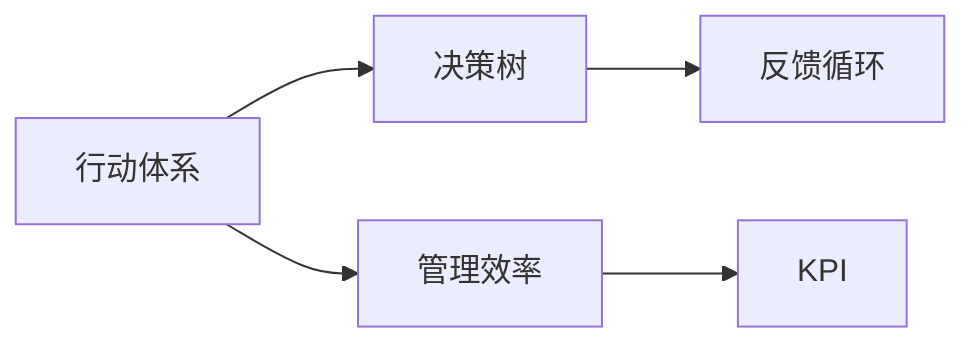
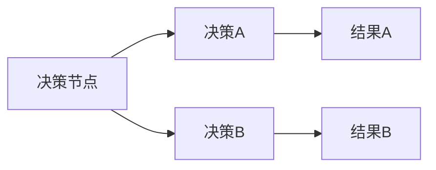

                 

# 行动体系与管理效率的关系

## 1. 背景介绍

在现代社会中，行动体系与管理效率之间的关系是一个极其重要的话题。行动体系指的是在组织或个人层面上，所有行动和决策的规则和流程。而管理效率则是指在执行这些行动和决策时，如何最小化时间、资源和精力的消耗。本文将深入探讨这两者之间的联系，以及如何构建一个高效、灵活、可持续的行动体系，以提升管理效率。

### 1.1 问题由来
在快速变化的市场环境中，企业或组织需要在短时间内做出明智的决策。然而，决策过程往往涉及多方面的信息收集、分析、评估和执行，这不仅需要大量的资源和精力，还容易在过程中产生误解或错误。因此，如何构建一个高效、灵活、可持续的行动体系，以提高管理效率，成为了现代组织管理中的关键问题。

### 1.2 问题核心关键点
为了提升管理效率，必须确保行动体系的设计和执行符合以下几点核心关键点：

1. **决策透明化**：确保所有决策过程公开透明，减少信息不对称。
2. **流程标准化**：建立一套标准的行动流程，避免重复和遗漏。
3. **数据驱动**：基于数据进行决策，避免主观判断的偏差。
4. **反馈机制**：建立有效的反馈机制，及时纠正错误和改进流程。
5. **持续优化**：行动体系需要不断优化，以适应环境的变化。

### 1.3 问题研究意义
构建高效的行动体系不仅有助于提升企业的决策速度和质量，还能减少资源浪费，增强团队的协作能力。这对于在全球化竞争中保持竞争优势、提高市场响应速度、提升客户满意度等方面具有重要意义。

## 2. 核心概念与联系

### 2.1 核心概念概述

为了更好地理解行动体系与管理效率的关系，首先需要定义一些核心概念：

1. **行动体系**：指在组织中，所有决策和行动的规则和流程，包括决策过程、流程管理、数据收集和分析、反馈机制等。
2. **管理效率**：指在执行决策和行动时，最小化时间、资源和精力的消耗，以实现最佳效果。
3. **决策树**：一种表示决策过程的图形化工具，通过分支结构展示所有可能的决策路径和结果。
4. **反馈循环**：在行动体系中，对决策和行动的结果进行评估和反馈，以持续改进和优化。
5. **KPI（关键绩效指标）**：用于衡量行动体系的效果，通常包括时间、成本、质量和客户满意度等。

这些概念之间的关系可以通过以下Mermaid流程图来展示：



这个流程图展示了行动体系、决策树、管理效率和反馈循环之间的关系：

1. 行动体系提供决策树，帮助组织进行有效决策。
2. 管理效率是行动体系的目标，通过优化流程和资源配置来实现。
3. 反馈循环是行动体系的重要组成部分，通过持续改进来提升管理效率。
4. KPI用于衡量行动体系的效果，指导行动体系的持续优化。

## 3. 核心算法原理 & 具体操作步骤

### 3.1 算法原理概述

构建高效行动体系的核心算法原理主要基于数据驱动和持续优化的思想。数据驱动的决策过程可以减少主观判断的偏差，而持续优化则确保行动体系能够适应环境变化。

具体来说，行动体系的设计和执行需要遵循以下步骤：

1. **数据收集和分析**：收集与决策相关的数据，并通过分析找到有价值的信息。
2. **决策制定**：基于数据和信息，制定合理的决策方案。
3. **行动执行**：将决策方案转化为具体行动，并按流程执行。
4. **结果评估和反馈**：评估行动的结果，并根据反馈调整决策和流程。
5. **持续优化**：根据评估和反馈结果，持续改进行动体系，以提升效率和效果。

### 3.2 算法步骤详解

构建高效行动体系的具体操作步骤如下：

**Step 1: 建立数据收集和分析框架**

1. **确定数据来源**：确定决策所需的所有数据来源，包括内部系统和外部数据源。
2. **数据收集工具**：选择合适的数据收集工具，如API接口、数据库查询、爬虫等。
3. **数据分析方法**：选择合适的数据分析方法，如统计分析、机器学习等。

**Step 2: 制定决策框架**

1. **明确决策目标**：确定决策的具体目标和关键指标。
2. **制定决策树**：设计决策树，展示所有可能的决策路径和结果。
3. **确定决策标准**：制定决策标准，以指导决策过程。

**Step 3: 行动执行和反馈**

1. **任务分配和执行**：将决策转化为具体的行动任务，并分配给相关人员执行。
2. **监控执行进度**：监控任务的执行进度，确保按时完成。
3. **收集执行反馈**：在执行过程中，收集执行反馈和实时数据。

**Step 4: 结果评估和优化**

1. **评估执行结果**：根据KPI评估行动的结果，判断是否达到预期目标。
2. **分析问题和原因**：分析执行过程中遇到的问题和原因，寻找改进点。
3. **持续优化决策树**：根据评估结果和反馈，持续优化决策树和决策标准。

### 3.3 算法优缺点

构建高效行动体系的算法具有以下优点：

1. **决策科学化**：数据驱动的决策过程减少了主观判断的偏差，提高了决策的准确性。
2. **流程标准化**：制定标准的决策流程，减少了重复和遗漏，提高了执行效率。
3. **持续改进**：通过反馈循环和持续优化，确保行动体系能够适应环境变化，保持高效。

同时，该算法也存在一定的局限性：

1. **数据质量依赖**：决策质量依赖于数据的质量和完整性，如果数据不充分或存在偏差，决策效果可能不佳。
2. **复杂度高**：决策树的构建和优化可能需要较长的计算时间和人力资源。
3. **灵活性不足**：标准的流程可能无法灵活应对突发情况，需要根据具体情况进行调整。
4. **信息过载**：大量的数据和反馈信息可能造成信息过载，需要合理管理和筛选。

尽管存在这些局限性，但整体而言，构建数据驱动、持续优化的行动体系仍然是提升管理效率的有效方法。未来相关研究的重点在于如何进一步降低数据收集和分析的难度，提高决策树的灵活性和易用性，同时兼顾资源配置和信息管理。

### 3.4 算法应用领域

高效行动体系的应用领域非常广泛，涵盖了企业管理的各个方面：

1. **项目管理**：通过数据驱动和持续优化，提升项目的进度、质量和成本控制。
2. **人力资源**：优化人才选拔、培训和绩效评估，提高人力资源管理效率。
3. **市场营销**：基于客户数据和市场反馈，优化营销策略和活动，提升市场响应速度。
4. **供应链管理**：通过优化库存和物流决策，提升供应链的效率和灵活性。
5. **研发创新**：利用数据和反馈，指导研发项目的优先级和方向，加速创新成果的转化。

此外，高效行动体系也在非企业组织中的应用越来越广泛，如政府决策、公共服务、教育培训等领域。

## 4. 数学模型和公式 & 详细讲解 & 举例说明

### 4.1 数学模型构建

行动体系的构建可以通过数学模型来描述和分析。本文将使用决策树和反馈循环的数学模型来详细讲解。

### 4.2 公式推导过程

**决策树的数学模型**：

假设一个简单的决策树，其结构如图1所示：



图1：决策树结构

其中，决策节点表示当前的决策点，决策A和决策B表示两种可能的决策方案，结果A和结果B表示决策后的结果。假设决策A和决策B的概率分别为P(A)和P(B)，结果A和结果B的概率分别为P(D)和P(E)。

根据贝叶斯定理，可以得到决策树的数学模型为：

$$
P(D|A) = \frac{P(D)P(A)}{P(A)P(D|A) + P(B)P(D|B)}
$$

$$
P(E|B) = \frac{P(E)P(B)}{P(A)P(E|A) + P(B)P(E|B)}
$$

**反馈循环的数学模型**：

假设一个简单的反馈循环，其结构如图2所示：


图2：反馈循环结构

其中，行动节点表示当前的行动方案，结果表示行动后的实际效果，反馈表示对结果的评估和改进建议，调整表示根据反馈调整行动方案。假设行动方案A的实际效果为R(A)，反馈建议为F(A)，调整后的行动方案为A'。

根据反馈循环的逻辑，可以得到反馈循环的数学模型为：

$$
A' = A + \alpha F(A)
$$

其中，$\alpha$表示反馈对调整的影响系数，通常为正数。

### 4.3 案例分析与讲解

**案例分析**：一家公司希望优化其供应链管理，提升物流效率和库存管理。

**问题描述**：公司当前的供应链管理流程复杂，数据分散在多个系统中，导致信息孤岛和决策偏差。同时，物流和库存决策不够科学，导致成本高、效率低。

**解决方案**：

1. **数据收集和分析**：
   - 确定供应链管理的数据来源，包括ERP系统、仓储系统、物流系统等。
   - 选择合适的数据收集工具，如API接口、数据库查询等。
   - 使用数据挖掘和统计分析方法，找出供应链管理中的关键因素。

2. **制定决策框架**：
   - 明确供应链管理的决策目标，如降低成本、提高效率等。
   - 制定决策树，展示所有可能的决策路径和结果。
   - 确定决策标准，如成本、效率、灵活性等。

3. **行动执行和反馈**：
   - 将决策转化为具体的行动任务，如物流调度和库存管理等。
   - 监控任务的执行进度，确保按时完成。
   - 收集执行反馈和实时数据，如物流延迟、库存水平等。

4. **结果评估和优化**：
   - 根据关键绩效指标（KPI）评估行动的结果，如成本、效率等。
   - 分析执行过程中遇到的问题和原因，寻找改进点。
   - 持续优化决策树和决策标准，提升供应链管理效率。

通过以上步骤，公司成功地优化了供应链管理流程，提升了物流效率和库存管理水平，降低了成本。

## 5. 项目实践：代码实例和详细解释说明

### 5.1 开发环境搭建

在进行项目实践前，需要准备好开发环境。以下是使用Python进行项目开发的环境配置流程：

1. 安装Anaconda：从官网下载并安装Anaconda，用于创建独立的Python环境。
2. 创建并激活虚拟环境：
   ```bash
   conda create -n pyproj python=3.8 
   conda activate pyproj
   ```
3. 安装必要的Python库：
   ```bash
   pip install pandas numpy scikit-learn matplotlib jupyter notebook
   ```
4. 安装合适的决策树和数据分析库：
   ```bash
   pip install scikit-learn
   ```

完成上述步骤后，即可在`pyproj`环境中开始项目开发。

### 5.2 源代码详细实现

这里我们以供应链管理项目为例，给出使用Python和Scikit-learn库构建行动体系和反馈循环的代码实现。

```python
import pandas as pd
from sklearn.ensemble import DecisionTreeRegressor
from sklearn.metrics import mean_squared_error

# 加载供应链管理数据
data = pd.read_csv('supply_chain_data.csv')

# 选择特征和目标变量
features = ['运输成本', '库存成本', '订单数量', '供应商响应时间']
target = '物流效率'

# 数据预处理
X = data[features]
y = data[target]

# 构建决策树模型
model = DecisionTreeRegressor()

# 训练模型
model.fit(X, y)

# 预测物流效率
y_pred = model.predict(X)

# 评估预测效果
mse = mean_squared_error(y, y_pred)

# 输出评估结果
print(f'平均均方误差为：{mse:.2f}')
```

以上代码实现了供应链管理的决策树模型构建和评估。具体来说，我们首先加载供应链管理数据，选择特征和目标变量，然后构建决策树模型，训练模型并进行预测，最后评估预测效果。

### 5.3 代码解读与分析

让我们再详细解读一下关键代码的实现细节：

**数据加载和预处理**：
- `pd.read_csv('supply_chain_data.csv')`：使用pandas库加载供应链管理数据。
- `X = data[features]`：选择特征变量。
- `y = data[target]`：选择目标变量。

**模型构建和训练**：
- `from sklearn.ensemble import DecisionTreeRegressor`：导入决策树回归模型。
- `model = DecisionTreeRegressor()`：创建决策树模型实例。
- `model.fit(X, y)`：使用训练数据训练决策树模型。

**预测和评估**：
- `y_pred = model.predict(X)`：使用模型进行预测。
- `mse = mean_squared_error(y, y_pred)`：计算预测值的均方误差。
- `print(f'平均均方误差为：{mse:.2f}')`：输出评估结果。

可以看到，通过以上代码，我们成功构建了一个供应链管理的决策树模型，并对其进行了预测和评估。在实际应用中，需要根据具体情况调整模型参数和特征选择，以达到最佳效果。

## 6. 实际应用场景

### 6.1 企业项目管理

在企业项目管理中，行动体系的应用可以显著提升项目的进度、质量和成本控制。具体来说，行动体系可以帮助项目管理团队：

1. **明确目标和计划**：通过制定决策树，明确项目目标和关键里程碑，确保所有成员了解项目方向。
2. **分配任务和资源**：使用数据和分析结果，合理分配任务和资源，避免资源浪费。
3. **监控进度和绩效**：通过反馈循环和持续优化，及时发现和解决项目中的问题，确保项目按时完成。
4. **评估和改进**：根据关键绩效指标（KPI）评估项目效果，进行持续改进，提升项目管理水平。

### 6.2 人力资源管理

在人力资源管理中，行动体系可以帮助企业：

1. **人才选拔和培训**：通过数据驱动的决策过程，科学选拔和培训人才，提升团队能力。
2. **绩效评估和激励**：制定标准化的评估指标和激励机制，确保评估结果公正和透明。
3. **员工发展和留任**：通过持续反馈和优化，帮助员工提升技能，增强团队凝聚力。
4. **招聘和薪资调整**：基于市场数据和员工绩效，合理调整招聘策略和薪资结构，吸引和保留优秀人才。

### 6.3 市场营销

在市场营销中，行动体系可以帮助企业：

1. **客户分析和细分**：通过数据挖掘和分析，识别不同客户群体的特征和需求，制定针对性的营销策略。
2. **广告投放和优化**：根据数据反馈，优化广告投放策略和预算分配，提高广告效果。
3. **市场趋势预测**：利用历史数据和市场趋势，预测未来市场需求，制定长远规划。
4. **品牌建设和传播**：通过数据驱动的决策，制定品牌传播策略，提升品牌影响力。

### 6.4 供应链管理

在供应链管理中，行动体系可以帮助企业：

1. **库存管理和调拨**：通过数据驱动的决策，优化库存水平和调拨策略，降低库存成本。
2. **物流和运输优化**：使用决策树模型，优化物流和运输路线，提高物流效率。
3. **供应商选择和管理**：基于供应商数据和反馈，优化供应商选择和管理，提升供应链稳定性。
4. **需求预测和响应**：利用历史数据和市场趋势，预测需求变化，提高供应链响应速度。

### 6.5 未来应用展望

随着行动体系研究的深入，其在更多领域的应用前景将更加广阔。未来，行动体系有望在以下领域得到更广泛的应用：

1. **智慧城市管理**：利用数据和反馈，优化城市交通、能源、环境等管理，提升城市运行效率。
2. **智能制造**：通过数据驱动的决策，优化生产流程和设备维护，提升制造效率和产品质量。
3. **医疗健康**：利用数据和反馈，优化诊疗方案和资源配置，提高医疗服务质量。
4. **教育培训**：通过数据驱动的决策，优化教学内容和评估方式，提升教育效果。
5. **公共安全**：利用数据和反馈，优化安全管理和应急响应，保障公共安全。

## 7. 工具和资源推荐

### 7.1 学习资源推荐

为了帮助开发者掌握行动体系的设计和实现，这里推荐一些优质的学习资源：

1. **《数据科学基础》课程**：由Coursera提供的入门级数据科学课程，涵盖了数据收集、分析和决策等多个方面。
2. **《决策树算法》书籍**：详细介绍了决策树算法的原理、实现和应用，是学习决策树的重要参考资料。
3. **《数据驱动决策》系列文章**：一系列关于数据驱动决策的博客文章，介绍了数据驱动决策的思想和实践方法。
4. **Kaggle竞赛平台**：全球最大的数据科学竞赛平台，提供大量真实业务数据和案例，供开发者实践和研究。

通过这些资源的学习实践，相信你一定能够掌握数据驱动决策的核心思想，并将其应用于实际项目中。

### 7.2 开发工具推荐

高效的开发离不开优秀的工具支持。以下是几款用于行动体系开发的常用工具：

1. **Jupyter Notebook**：基于Web的交互式开发环境，支持数据处理、模型构建和可视化等操作。
2. **Scikit-learn**：Python数据科学库，提供多种机器学习算法和工具，适合快速原型开发和模型构建。
3. **Matplotlib**：Python可视化库，支持绘制各种图表和图形，方便数据展示和分析。
4. **Pandas**：Python数据分析库，支持数据清洗、处理和分析，是数据科学工作的基础。
5. **TensorBoard**：TensorFlow配套的可视化工具，可以实时监测模型训练状态，提供丰富的图表呈现方式。

合理利用这些工具，可以显著提升行动体系开发和分析的效率，加快创新迭代的步伐。

### 7.3 相关论文推荐

行动体系的研究源于学界的持续探索。以下是几篇奠基性的相关论文，推荐阅读：

1. **《数据驱动的决策树建模》**：介绍决策树的建模方法和应用，详细讲解了决策树的数学模型和算法实现。
2. **《反馈机制在行动体系中的应用》**：探讨反馈机制在行动体系中的作用，提出持续改进的方法。
3. **《行动体系的设计和优化》**：讨论行动体系的设计原则和优化策略，提出了一套标准的行动体系构建流程。
4. **《数据驱动的管理决策》**：详细分析数据驱动决策的优势和挑战，提出解决数据孤岛和信息不对称的方法。

这些论文代表了大规模数据驱动决策的研究脉络。通过学习这些前沿成果，可以帮助研究者把握学科前进方向，激发更多的创新灵感。

## 8. 总结：未来发展趋势与挑战

### 8.1 研究成果总结

本文对行动体系与管理效率的关系进行了全面系统的介绍。首先阐述了行动体系在现代企业管理中的重要性，明确了数据驱动和持续优化的思想是提升管理效率的关键。其次，从原理到实践，详细讲解了行动体系的构建和应用，给出了一个完整的代码实例。同时，本文还探讨了行动体系在多个实际应用场景中的应用前景，展示了数据驱动决策的巨大潜力。最后，本文精选了相关的学习资源和工具，力求为读者提供全方位的技术指引。

通过本文的系统梳理，可以看到，行动体系在提升管理效率方面具有重要意义。数据驱动的决策过程，通过优化流程和资源配置，实现了科学决策和持续改进，有效减少了时间和资源消耗。未来，行动体系的研究将进一步深入，探索更多高效、灵活、可持续的行动体系构建方法，推动企业和社会的高效运行。

### 8.2 未来发展趋势

展望未来，行动体系的研究和应用将呈现以下几个发展趋势：

1. **自动化和智能化**：行动体系将逐渐向自动化和智能化方向发展，利用AI和机器学习技术，实现更高效、更精确的决策支持。
2. **跨领域融合**：行动体系将在更多领域得到应用，如智慧城市、智能制造、医疗健康等，实现跨领域的数据整合和决策优化。
3. **实时性和灵活性**：行动体系将更加注重实时性和灵活性，能够快速响应环境变化，适应突发情况。
4. **透明性和可解释性**：行动体系的决策过程将更加透明和可解释，便于管理和优化。
5. **多模态融合**：行动体系将更多地融合多模态数据，如文本、图像、语音等，提升决策的全面性和准确性。

### 8.3 面临的挑战

尽管行动体系研究已经取得了一定的成果，但在实际应用中仍面临诸多挑战：

1. **数据质量和隐私**：数据质量和隐私问题仍然是行动体系构建的重要障碍。数据的完整性和准确性直接影响决策效果，同时数据隐私和安全也需要得到充分保障。
2. **计算资源限制**：大规模数据和复杂模型的计算需求，对计算资源提出了更高的要求，需要在资源配置和成本控制之间找到平衡。
3. **技术复杂度**：数据驱动决策的技术实现复杂度高，需要具备较强的技术背景和能力。
4. **模型解释性不足**：数据驱动决策模型的解释性不足，难以理解和调试，需要进一步改进。
5. **业务场景复杂性**：不同业务场景的数据和决策逻辑差异大，需要针对性地设计和优化行动体系。

尽管存在这些挑战，但行动体系研究仍有很大的发展空间。通过不断优化数据收集和分析方法，提升模型的可解释性和灵活性，行动体系将在更多领域得到应用，提升企业和社会的管理效率。

### 8.4 研究展望

面对行动体系研究面临的挑战，未来的研究方向包括以下几个方面：

1. **数据质量提升**：探索更高效、更准确的数据收集和处理方法，提高数据质量，保障决策效果。
2. **模型解释性增强**：改进数据驱动决策模型的解释性，使其更易于理解和调试。
3. **跨领域融合**：实现跨领域的数据整合和决策优化，提升决策的全面性和准确性。
4. **自动化和智能化**：利用AI和机器学习技术，实现更高效、更精确的决策支持。
5. **实时性和灵活性**：增强行动体系的实时性和灵活性，能够快速响应环境变化，适应突发情况。
6. **业务场景优化**：针对不同业务场景，设计和优化行动体系，提升决策效果和执行效率。

这些研究方向将引领行动体系研究进入新的发展阶段，为提升企业和社会管理效率提供有力支持。

## 9. 附录：常见问题与解答

**Q1：什么是行动体系？**

A: 行动体系指的是在组织或个人层面上，所有决策和行动的规则和流程，包括决策过程、流程管理、数据收集和分析、反馈机制等。

**Q2：如何构建高效行动体系？**

A: 构建高效行动体系需要遵循数据驱动和持续优化的思想。具体步骤包括：
1. 数据收集和分析
2. 制定决策框架
3. 行动执行和反馈
4. 结果评估和优化

**Q3：数据驱动决策的优势和挑战是什么？**

A: 数据驱动决策的优势在于：
1. 减少主观判断的偏差，提高决策的准确性。
2. 提供客观的数据支持，增强决策的科学性。
3. 通过持续优化，提升决策的灵活性和适应性。

数据驱动决策的挑战包括：
1. 数据质量和隐私问题。
2. 计算资源限制。
3. 技术复杂度。
4. 模型解释性不足。
5. 业务场景复杂性。

尽管存在这些挑战，但数据驱动决策仍然是提升管理效率的有效方法，需要不断优化和改进。

**Q4：行动体系在实际应用中需要注意哪些问题？**

A: 行动体系在实际应用中需要注意以下问题：
1. 数据收集和分析的准确性和完整性。
2. 决策框架的合理性和可操作性。
3. 行动执行和反馈的及时性和有效性。
4. 结果评估和优化的客观性和公正性。
5. 持续改进的灵活性和适应性。

合理处理这些问题，可以确保行动体系的高效和稳定运行，提升管理效率和决策效果。

通过本文的系统梳理，可以看到，构建高效行动体系是提升管理效率的关键。数据驱动决策通过优化流程和资源配置，实现了科学决策和持续改进，有效减少了时间和资源消耗。未来，行动体系的研究和应用将不断深入，推动企业和社会的高效运行。

