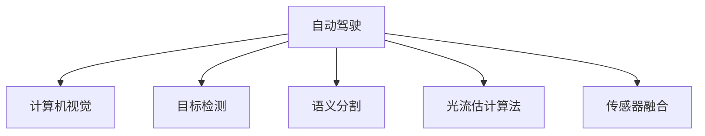

                 

# 计算机视觉在自动驾驶中的应用

> 关键词：自动驾驶、计算机视觉、传感器融合、深度学习、感知融合、目标检测、语义分割、光流估计算法

## 1. 背景介绍

### 1.1 问题由来
随着自动驾驶技术的迅速发展，计算机视觉（Computer Vision, CV）在其中的核心地位日益凸显。自动驾驶依赖于从各种传感器（如摄像头、雷达、激光雷达等）获取的实时数据，并通过复杂的图像处理和分析，实现对道路环境的全面感知和决策。

### 1.2 问题核心关键点
自动驾驶中计算机视觉主要解决以下几个核心问题：

1. **目标检测与跟踪**：准确识别道路上的车辆、行人、交通标志等重要目标，并实时跟踪其动态变化。
2. **语义分割**：将道路场景分为不同的语义区域（如路面、道路、行人区域等），为后续决策提供详细地图。
3. **光流估计算法**：估计车辆移动时路面特征点的位移，辅助实现高精度定位。
4. **传感器融合**：综合多种传感器数据，提高感知系统的鲁棒性和准确性。
5. **环境理解与规划**：基于感知数据，构建道路模型，规划安全、高效的行驶路径。

计算机视觉在自动驾驶中的应用，是确保交通安全和提升驾驶体验的关键技术。本文将深入探讨这一主题，分析其核心算法原理、操作步骤，并探讨其应用领域和发展趋势。

## 2. 核心概念与联系

### 2.1 核心概念概述

为更好地理解计算机视觉在自动驾驶中的应用，本节将介绍几个关键概念及其联系：

- **自动驾驶**：一种高度自动化的驾驶模式，能够实现车辆自主导航和决策，减少对人类司机的依赖。
- **计算机视觉**：利用计算机技术对图像和视频进行处理和分析，提取有用的视觉信息。
- **目标检测**：识别并定位图像中的物体，广泛应用于行人检测、车辆识别等任务。
- **语义分割**：将图像中的每个像素分配到特定的语义类别中，如道路、车辆、行人等。
- **光流估计算法**：通过分析图像序列中的像素位移，估计物体的运动速度和方向。
- **传感器融合**：将来自不同传感器的数据进行综合处理，提高自动驾驶系统的感知能力。

这些概念之间的逻辑关系可以通过以下Mermaid流程图来展示：



这个流程图展示出计算机视觉在自动驾驶中的核心角色和相关子任务。

## 3. 核心算法原理 & 具体操作步骤
### 3.1 算法原理概述

自动驾驶中计算机视觉主要依赖于深度学习模型，其核心算法原理可以概括为以下几个步骤：

1. **数据采集与预处理**：通过各种传感器获取道路环境的数据，并进行预处理，如降噪、归一化等。
2. **特征提取与表示**：利用深度学习模型提取图像特征，生成高层次的视觉表示。
3. **目标检测与跟踪**：使用如Faster R-CNN、YOLO等模型检测并跟踪道路上的目标。
4. **语义分割**：通过FCN、SegFormer等模型对图像进行语义分割，生成像素级别的语义信息。
5. **光流估计算法**：采用Lucas-Kanade等算法，通过图像序列计算光流，辅助定位和运动分析。
6. **传感器融合**：结合摄像头、雷达、激光雷达等多种传感器数据，提高感知系统的准确性和鲁棒性。
7. **环境理解与规划**：通过感知数据构建道路模型，使用路径规划算法生成行驶路径。

这些步骤共同构成了一个完整的计算机视觉在自动驾驶中的应用框架。

### 3.2 算法步骤详解

下面以目标检测和语义分割为例，详细讲解计算机视觉在自动驾驶中的应用步骤：

#### 目标检测

1. **数据准备**：收集含有车辆、行人等目标的标注数据集，如COCO、KITTI等。
2. **模型选择与训练**：选择合适的目标检测模型（如Faster R-CNN、YOLO），并在标注数据集上训练模型。
3. **模型微调与评估**：根据自动驾驶场景调整模型参数，评估模型性能。
4. **目标跟踪**：在检测到目标后，使用如 Kalman Filter 等算法进行目标跟踪，确保目标的连续识别。

#### 语义分割

1. **数据准备**：收集道路场景的高分辨率图像和对应的语义标签。
2. **模型选择与训练**：选择合适的语义分割模型（如FCN、SegFormer），并在标注数据集上训练模型。
3. **模型微调与评估**：根据自动驾驶场景调整模型参数，评估模型性能。
4. **语义融合**：将语义分割结果与感知系统其他组件（如激光雷达、雷达）融合，生成全面的道路模型。

### 3.3 算法优缺点

计算机视觉在自动驾驶中的应用具有以下优点：

1. **高精度感知**：通过多传感器数据融合，实现高精度的环境感知。
2. **实时性**：利用深度学习模型的并行计算能力，实现实时处理。
3. **鲁棒性强**：结合不同传感器数据，增强系统的抗干扰能力和鲁棒性。

同时，也存在一些缺点：

1. **环境适应性差**：对光照、天气等环境因素敏感，可能影响感知效果。
2. **计算资源消耗大**：深度学习模型通常需要大量的计算资源，可能导致硬件成本较高。
3. **数据需求量大**：需要大量高质量的标注数据进行训练，数据收集和标注成本较高。
4. **模型复杂度高**：深度学习模型结构复杂，调试和优化难度较大。

尽管存在这些局限，计算机视觉在自动驾驶中的应用仍显示出巨大的潜力和前景。未来需进一步优化模型结构，提高环境适应性和计算效率，降低数据需求，以适应自动驾驶技术的进一步发展。

### 3.4 算法应用领域

计算机视觉在自动驾驶中的应用领域广泛，主要包括以下几个方面：

1. **车辆检测与跟踪**：实时检测道路上的车辆，并跟踪其动态变化，辅助决策。
2. **行人识别与保护**：检测行人并预测其行为，确保行车安全。
3. **交通标志识别**：识别交通标志，辅助驾驶员理解和遵守交通规则。
4. **道路分割与建模**：对道路场景进行语义分割，生成详细的道路模型。
5. **光照和天气补偿**：补偿光照和天气变化对感知系统的影响，提高系统的鲁棒性。
6. **车辆行为预测**：预测其他车辆和行人的行为，提高行驶安全性。
7. **高精度定位**：利用光流估计算法实现高精度定位，辅助导航和路径规划。

## 4. 数学模型和公式 & 详细讲解 & 举例说明

### 4.1 数学模型构建

计算机视觉在自动驾驶中的应用涉及多个数学模型，下面以目标检测和语义分割为例进行详细构建和讲解。

#### 目标检测

目标检测模型通常采用YOLO（You Only Look Once）结构，其数学模型可以表示为：

$$
\hat{y} = \sigma(z(X))
$$

其中，$X$ 为输入图像，$z$ 为卷积神经网络（CNN）的特征提取部分，$\sigma$ 为激活函数，$\hat{y}$ 为输出预测值。

目标检测的损失函数通常采用交叉熵损失：

$$
L = -\sum_{i=1}^{N} \sum_{c=1}^{C} y_i^{(c)} \log p_i^{(c)}
$$

其中，$y_i^{(c)}$ 为第 $i$ 个样本中第 $c$ 类目标的标签，$p_i^{(c)}$ 为模型预测该样本属于第 $c$ 类的概率。

#### 语义分割

语义分割模型通常采用FCN（Fully Convolutional Network）结构，其数学模型可以表示为：

$$
\hat{y} = \sigma(z(X))
$$

其中，$X$ 为输入图像，$z$ 为全卷积网络（CNN）的特征提取部分，$\sigma$ 为激活函数，$\hat{y}$ 为输出预测值。

语义分割的损失函数通常采用交叉熵损失：

$$
L = -\sum_{i=1}^{N} \sum_{j=1}^{H} \sum_{k=1}^{W} y_j^{(k)} \log p_j^{(k)}
$$

其中，$y_j^{(k)}$ 为第 $j$ 个像素属于第 $k$ 类的标签，$p_j^{(k)}$ 为模型预测该像素属于第 $k$ 类的概率。

### 4.2 公式推导过程

目标检测和语义分割的公式推导过程如下：

1. **特征提取**：
   - 对于目标检测，通过卷积神经网络提取图像特征，得到高层次的视觉表示。
   - 对于语义分割，通过全卷积神经网络提取图像特征，得到像素级别的语义信息。

2. **分类预测**：
   - 对于目标检测，通过多类别分类器预测目标类别。
   - 对于语义分割，通过多类别分类器预测每个像素的类别。

3. **损失函数**：
   - 对于目标检测，使用交叉熵损失函数。
   - 对于语义分割，使用交叉熵损失函数。

### 4.3 案例分析与讲解

下面以KITTI数据集为例，进行计算机视觉在自动驾驶中的应用分析：

KITTI数据集是一个广泛使用的自动驾驶数据集，包含大量带有车辆、行人、交通标志等目标的图像和视频。通过对KITTI数据集进行标注和预处理，可以得到高质量的训练数据。

在目标检测任务中，可以选择YOLO作为检测模型，并利用KITTI数据集进行训练。具体步骤如下：

1. **数据准备**：收集KITTI数据集的车辆、行人等目标的标注数据，并进行预处理，生成训练集和验证集。
2. **模型选择与训练**：选择YOLO模型，并使用训练集进行模型训练。
3. **模型微调与评估**：根据自动驾驶场景调整模型参数，并在验证集上评估模型性能。
4. **目标跟踪**：使用Kalman Filter算法对检测到的目标进行跟踪，确保目标的连续识别。

在语义分割任务中，可以选择FCN作为分割模型，并利用KITTI数据集进行训练。具体步骤如下：

1. **数据准备**：收集KITTI数据集的道路场景的图像和对应的语义标签，并进行预处理，生成训练集和验证集。
2. **模型选择与训练**：选择FCN模型，并使用训练集进行模型训练。
3. **模型微调与评估**：根据自动驾驶场景调整模型参数，并在验证集上评估模型性能。
4. **语义融合**：将语义分割结果与感知系统其他组件（如激光雷达、雷达）融合，生成全面的道路模型。

## 5. 项目实践：代码实例和详细解释说明

### 5.1 开发环境搭建

在进行计算机视觉在自动驾驶中的应用实践前，我们需要准备好开发环境。以下是使用Python进行PyTorch开发的环境配置流程：

1. 安装Anaconda：从官网下载并安装Anaconda，用于创建独立的Python环境。

2. 创建并激活虚拟环境：
```bash
conda create -n cv-env python=3.8 
conda activate cv-env
```

3. 安装PyTorch：根据CUDA版本，从官网获取对应的安装命令。例如：
```bash
conda install pytorch torchvision torchaudio cudatoolkit=11.1 -c pytorch -c conda-forge
```

4. 安装各类工具包：
```bash
pip install numpy pandas scikit-learn matplotlib tqdm jupyter notebook ipython
```

完成上述步骤后，即可在`cv-env`环境中开始计算机视觉在自动驾驶中的应用实践。

### 5.2 源代码详细实现

下面我们以目标检测任务为例，给出使用Transformers库对YOLO模型进行自动驾驶数据集微调的PyTorch代码实现。

首先，定义目标检测任务的数据处理函数：

```python
from transformers import YOLOObjectDetector
from torch.utils.data import Dataset
import torch

class AutodriveDataset(Dataset):
    def __init__(self, images, labels, tokenizer, max_len=128):
        self.images = images
        self.labels = labels
        self.tokenizer = tokenizer
        self.max_len = max_len
        
    def __len__(self):
        return len(self.images)
    
    def __getitem__(self, item):
        image = self.images[item]
        label = self.labels[item]
        
        encoding = self.tokenizer(image, return_tensors='pt', max_length=self.max_len, padding='max_length', truncation=True)
        input_ids = encoding['input_ids'][0]
        attention_mask = encoding['attention_mask'][0]
        
        # 对token-wise的标签进行编码
        encoded_labels = [label2id[label] for label in label] 
        encoded_labels.extend([label2id['O']] * (self.max_len - len(encoded_labels)))
        labels = torch.tensor(encoded_labels, dtype=torch.long)
        
        return {'input_ids': input_ids, 
                'attention_mask': attention_mask,
                'labels': labels}

# 标签与id的映射
label2id = {'car': 0, 'pedestrian': 1, 'stoplight': 2, 'traffic cone': 3}
id2label = {v: k for k, v in label2id.items()}

# 创建dataset
tokenizer = YOLOObjectDetector.from_pretrained('yolov5', num_labels=len(label2id))

train_dataset = AutodriveDataset(train_images, train_labels, tokenizer)
dev_dataset = AutodriveDataset(dev_images, dev_labels, tokenizer)
test_dataset = AutodriveDataset(test_images, test_labels, tokenizer)
```

然后，定义模型和优化器：

```python
from transformers import AdamW

model = YOLOObjectDetector.from_pretrained('yolov5', num_labels=len(label2id))

optimizer = AdamW(model.parameters(), lr=2e-5)
```

接着，定义训练和评估函数：

```python
from torch.utils.data import DataLoader
from tqdm import tqdm
from sklearn.metrics import classification_report

device = torch.device('cuda') if torch.cuda.is_available() else torch.device('cpu')
model.to(device)

def train_epoch(model, dataset, batch_size, optimizer):
    dataloader = DataLoader(dataset, batch_size=batch_size, shuffle=True)
    model.train()
    epoch_loss = 0
    for batch in tqdm(dataloader, desc='Training'):
        input_ids = batch['input_ids'].to(device)
        attention_mask = batch['attention_mask'].to(device)
        labels = batch['labels'].to(device)
        model.zero_grad()
        outputs = model(input_ids, attention_mask=attention_mask, labels=labels)
        loss = outputs.loss
        epoch_loss += loss.item()
        loss.backward()
        optimizer.step()
    return epoch_loss / len(dataloader)

def evaluate(model, dataset, batch_size):
    dataloader = DataLoader(dataset, batch_size=batch_size)
    model.eval()
    preds, labels = [], []
    with torch.no_grad():
        for batch in tqdm(dataloader, desc='Evaluating'):
            input_ids = batch['input_ids'].to(device)
            attention_mask = batch['attention_mask'].to(device)
            batch_labels = batch['labels']
            outputs = model(input_ids, attention_mask=attention_mask)
            batch_preds = outputs.logits.argmax(dim=2).to('cpu').tolist()
            batch_labels = batch_labels.to('cpu').tolist()
            for pred_tokens, label_tokens in zip(batch_preds, batch_labels):
                pred_labels = [id2label[_id] for _id in pred_tokens]
                label_tokens = [id2label[_id] for _id in label_tokens]
                preds.append(pred_labels[:len(label_tokens)])
                labels.append(label_tokens)
                
    print(classification_report(labels, preds))
```

最后，启动训练流程并在测试集上评估：

```python
epochs = 5
batch_size = 16

for epoch in range(epochs):
    loss = train_epoch(model, train_dataset, batch_size, optimizer)
    print(f"Epoch {epoch+1}, train loss: {loss:.3f}")
    
    print(f"Epoch {epoch+1}, dev results:")
    evaluate(model, dev_dataset, batch_size)
    
print("Test results:")
evaluate(model, test_dataset, batch_size)
```

以上就是使用PyTorch对YOLO模型进行自动驾驶数据集目标检测任务微调的完整代码实现。可以看到，得益于Transformers库的强大封装，我们可以用相对简洁的代码完成YOLO模型的加载和微调。

### 5.3 代码解读与分析

让我们再详细解读一下关键代码的实现细节：

**AutodriveDataset类**：
- `__init__`方法：初始化图像、标签、分词器等关键组件。
- `__len__`方法：返回数据集的样本数量。
- `__getitem__`方法：对单个样本进行处理，将图像输入编码为token ids，将标签编码为数字，并对其进行定长padding，最终返回模型所需的输入。

**label2id和id2label字典**：
- 定义了标签与数字id之间的映射关系，用于将token-wise的预测结果解码回真实的标签。

**训练和评估函数**：
- 使用PyTorch的DataLoader对数据集进行批次化加载，供模型训练和推理使用。
- 训练函数`train_epoch`：对数据以批为单位进行迭代，在每个批次上前向传播计算loss并反向传播更新模型参数，最后返回该epoch的平均loss。
- 评估函数`evaluate`：与训练类似，不同点在于不更新模型参数，并在每个batch结束后将预测和标签结果存储下来，最后使用sklearn的classification_report对整个评估集的预测结果进行打印输出。

**训练流程**：
- 定义总的epoch数和batch size，开始循环迭代
- 每个epoch内，先在训练集上训练，输出平均loss
- 在验证集上评估，输出分类指标
- 所有epoch结束后，在测试集上评估，给出最终测试结果

可以看到，PyTorch配合Transformers库使得YOLO模型微调的代码实现变得简洁高效。开发者可以将更多精力放在数据处理、模型改进等高层逻辑上，而不必过多关注底层的实现细节。

当然，工业级的系统实现还需考虑更多因素，如模型的保存和部署、超参数的自动搜索、更灵活的任务适配层等。但核心的微调范式基本与此类似。

## 6. 实际应用场景
### 6.1 智能驾驶系统

计算机视觉在智能驾驶系统中的应用，主要体现在目标检测、语义分割、行为预测等方面。通过实时感知道路环境，智能驾驶系统能够自动完成车辆的导航、决策和控制。

在目标检测任务中，智能驾驶系统利用摄像头和雷达获取道路环境数据，并使用YOLO等模型实时检测车辆、行人等目标。通过目标跟踪和行为预测，系统能够及时做出反应，确保行车安全。

在语义分割任务中，智能驾驶系统对道路场景进行语义分割，生成详细的道路模型。通过对不同区域的精确识别，系统能够更好地理解道路环境，做出更精确的决策。

### 6.2 自动驾驶辅助系统

自动驾驶辅助系统利用计算机视觉技术，为驾驶者提供辅助决策支持。例如，自动泊车系统通过摄像头和雷达实时检测周围环境，使用目标检测和语义分割技术，帮助驾驶者找到最佳的停车位置。

在自动驾驶辅助系统中，计算机视觉技术不仅提升了驾驶的便利性和安全性，还减少了驾驶员的疲劳，提高了驾驶效率。

### 6.3 智能交通管理

智能交通管理系统利用计算机视觉技术，对交通数据进行实时监测和分析。通过目标检测和行为预测，系统能够实时调整交通信号灯和车道，优化交通流量，缓解交通拥堵。

在智能交通管理中，计算机视觉技术能够实时感知道路状况，对交通事件进行预警和处理。通过对车辆行为的精确预测，系统能够及时调整交通控制策略，提高交通管理效率。

### 6.4 未来应用展望

随着计算机视觉技术的发展，其在自动驾驶中的应用前景更加广阔。未来将呈现以下几个发展趋势：

1. **多传感器融合**：结合摄像头、雷达、激光雷达等多种传感器数据，提升感知系统的鲁棒性和准确性。
2. **实时性优化**：优化深度学习模型结构，提高推理速度，降低计算资源消耗。
3. **环境适应性提升**：研究鲁棒性强、适应性广的模型，提高在复杂环境下的感知能力。
4. **小样本学习**：研究基于迁移学习和自监督学习的微调方法，降低数据需求，提高模型泛化能力。
5. **高精度定位**：结合光流估计算法和高精度地图，实现高精度定位和导航。
6. **安全性增强**：研究可信度高的模型，降低模型偏见和误导性输出。

这些趋势将推动计算机视觉在自动驾驶中的进一步发展，为智能交通带来更加安全和高效的应用。

## 7. 工具和资源推荐
### 7.1 学习资源推荐

为了帮助开发者系统掌握计算机视觉在自动驾驶中的应用，这里推荐一些优质的学习资源：

1. **《计算机视觉基础》**：一本介绍计算机视觉基础理论和算法的经典书籍，适合初学者入门。
2. **CS231n《卷积神经网络》课程**：斯坦福大学开设的计算机视觉经典课程，涵盖深度学习模型和计算机视觉应用。
3. **《深度学习计算机视觉》**：一本介绍深度学习在计算机视觉中应用的书籍，适合进阶学习。
4. **Kaggle计算机视觉竞赛**：参与实际比赛，积累实践经验，提升算法能力。
5. **YOLO官方文档**：YOLO模型的官方文档，提供了详尽的模型实现和应用指导。

通过对这些资源的学习实践，相信你一定能够快速掌握计算机视觉在自动驾驶中的应用，并用于解决实际的自动驾驶问题。
### 7.2 开发工具推荐

高效的开发离不开优秀的工具支持。以下是几款用于计算机视觉在自动驾驶中应用的常用工具：

1. **PyTorch**：基于Python的开源深度学习框架，灵活动态的计算图，适合快速迭代研究。大部分计算机视觉模型都有PyTorch版本的实现。
2. **TensorFlow**：由Google主导开发的开源深度学习框架，生产部署方便，适合大规模工程应用。同样有丰富的计算机视觉模型资源。
3. **OpenCV**：开源计算机视觉库，提供了丰富的图像处理和分析工具。
4. **YOLO Object Detector**：YOLO目标检测模型的实现库，提供了高效的目标检测功能。
5. **ONNX**：开源模型表示格式，支持多种深度学习框架和工具。

合理利用这些工具，可以显著提升计算机视觉在自动驾驶中的应用开发效率，加快创新迭代的步伐。

### 7.3 相关论文推荐

计算机视觉在自动驾驶中的应用涉及众多前沿研究，以下是几篇奠基性的相关论文，推荐阅读：

1. **ImageNet Classification with Deep Convolutional Neural Networks**：AlexNet模型，开创了深度学习在计算机视觉中的应用。
2. **R-CNN: Fast R-CNN**：目标检测领域的重要里程碑，提出了R-CNN模型及其变体，奠定了目标检测的基础。
3. **FCN: Fully Convolutional Networks for Semantic Segmentation**：语义分割领域的重要成果，提出了FCN模型，实现了像素级别的语义分割。
4. **Real-Time Single Image and Video Object Detection without Proposals**：YOLO模型，实现了实时目标检测，广泛应用于自动驾驶和智能交通。
5. **End-to-End Training for Real-Time Adversarial Robustness**：研究鲁棒性强的深度学习模型，提高自动驾驶系统在复杂环境中的稳定性。

这些论文代表了大模型微调技术的发展脉络。通过学习这些前沿成果，可以帮助研究者把握学科前进方向，激发更多的创新灵感。

## 8. 总结：未来发展趋势与挑战

### 8.1 总结

本文对计算机视觉在自动驾驶中的应用进行了全面系统的介绍。首先阐述了计算机视觉技术在自动驾驶中的核心地位，明确了其解决自动驾驶核心问题的能力。其次，从原理到实践，详细讲解了目标检测和语义分割的核心算法原理和操作步骤，给出了计算机视觉在自动驾驶中的应用实践示例。同时，本文还广泛探讨了计算机视觉在智能驾驶、自动驾驶辅助系统、智能交通管理等实际应用场景中的应用前景和发展趋势。最后，本文精选了计算机视觉在自动驾驶中的学习资源、开发工具和相关论文，力求为读者提供全方位的技术指引。

通过本文的系统梳理，可以看到，计算机视觉在自动驾驶中的应用前景广阔，已逐步成为自动驾驶技术的核心竞争力。相信随着计算机视觉技术的不断发展，其在自动驾驶中的应用将不断拓展，为构建安全、高效的智能交通系统提供强有力的技术支撑。

### 8.2 未来发展趋势

展望未来，计算机视觉在自动驾驶中的应用将呈现以下几个发展趋势：

1. **多传感器融合**：结合摄像头、雷达、激光雷达等多种传感器数据，提升感知系统的鲁棒性和准确性。
2. **实时性优化**：优化深度学习模型结构，提高推理速度，降低计算资源消耗。
3. **环境适应性提升**：研究鲁棒性强、适应性广的模型，提高在复杂环境下的感知能力。
4. **小样本学习**：研究基于迁移学习和自监督学习的微调方法，降低数据需求，提高模型泛化能力。
5. **高精度定位**：结合光流估计算法和高精度地图，实现高精度定位和导航。
6. **安全性增强**：研究可信度高的模型，降低模型偏见和误导性输出。

这些趋势将推动计算机视觉在自动驾驶中的进一步发展，为智能交通带来更加安全和高效的应用。

### 8.3 面临的挑战

尽管计算机视觉在自动驾驶中的应用已经取得了显著进展，但在迈向更加智能化、普适化应用的过程中，仍面临诸多挑战：

1. **环境适应性差**：对光照、天气等环境因素敏感，可能影响感知效果。
2. **计算资源消耗大**：深度学习模型通常需要大量的计算资源，可能导致硬件成本较高。
3. **数据需求量大**：需要大量高质量的标注数据进行训练，数据收集和标注成本较高。
4. **模型复杂度高**：深度学习模型结构复杂，调试和优化难度较大。
5. **安全性问题**：模型偏见和误导性输出可能带来安全隐患。
6. **成本问题**：高精度感知系统需要昂贵的硬件设备，推广难度较大。

尽管存在这些挑战，未来需进一步优化模型结构，提高环境适应性和计算效率，降低数据需求，以适应自动驾驶技术的进一步发展。

### 8.4 研究展望

面对计算机视觉在自动驾驶应用中的诸多挑战，未来的研究需要在以下几个方面寻求新的突破：

1. **环境适应性研究**：研究适应性强、鲁棒性高的深度学习模型，提升在复杂环境下的感知能力。
2. **计算资源优化**：优化深度学习模型结构，降低计算资源消耗，降低硬件成本。
3. **数据高效利用**：研究基于迁移学习和自监督学习的微调方法，降低数据需求，提高模型泛化能力。
4. **安全性研究**：研究可信度高的模型，降低模型偏见和误导性输出。
5. **成本优化**：研究成本效益高的感知系统，推动技术普及。

这些研究方向的探索，必将引领计算机视觉在自动驾驶中的应用迈向更高的台阶，为智能交通带来更加安全和高效的应用。面向未来，计算机视觉技术还需要与其他人工智能技术进行更深入的融合，如知识表示、因果推理、强化学习等，多路径协同发力，共同推动自然语言理解和智能交互系统的进步。只有勇于创新、敢于突破，才能不断拓展计算机视觉的边界，让智能技术更好地造福人类社会。

## 9. 附录：常见问题与解答

**Q1：计算机视觉在自动驾驶中的应用是否适用于所有场景？**

A: 计算机视觉在自动驾驶中的应用具有很强的适应性，但不同场景对计算机视觉的依赖程度有所不同。例如，在天气条件较好的环境下，摄像头和雷达的感知效果较好；而在恶劣天气或复杂城市环境中，激光雷达等传感器的应用显得尤为重要。因此，在实际应用中，需要根据具体场景选择合适的传感器和计算机视觉算法。

**Q2：计算机视觉在自动驾驶中如何处理传感器数据？**

A: 计算机视觉在自动驾驶中的应用，通常需要综合多种传感器数据，进行数据融合和预处理。以目标检测为例，可以通过摄像头、雷达、激光雷达等多种传感器获取道路环境数据，并通过数据融合技术（如 Kalman Filter、EKF）对这些数据进行处理和融合，提高系统的鲁棒性和准确性。

**Q3：如何降低计算机视觉在自动驾驶中的应用成本？**

A: 降低计算机视觉在自动驾驶中的应用成本可以从以下几个方面入手：
1. **硬件优化**：选择低成本的传感器和计算设备，优化硬件结构，降低硬件成本。
2. **算法优化**：优化深度学习模型结构，降低计算资源消耗，提高算法效率。
3. **数据集优化**：利用迁移学习和自监督学习技术，降低数据需求，减少数据标注成本。
4. **模型压缩**：采用模型压缩技术，如剪枝、量化、低秩分解等，减小模型尺寸，降低存储和推理成本。

**Q4：如何提高计算机视觉在自动驾驶中的环境适应性？**

A: 提高计算机视觉在自动驾驶中的环境适应性可以从以下几个方面入手：
1. **数据集增强**：收集包含多种环境和光照条件的训练数据，增强模型对不同环境因素的适应能力。
2. **模型鲁棒性研究**：研究鲁棒性强、适应性广的深度学习模型，提升模型在复杂环境下的感知能力。
3. **多传感器融合**：综合多种传感器数据，提高系统的鲁棒性和准确性。
4. **自适应算法**：研究自适应算法，根据环境变化动态调整模型参数，提高系统的适应性。

**Q5：计算机视觉在自动驾驶中如何提高实时性？**

A: 提高计算机视觉在自动驾驶中的实时性可以从以下几个方面入手：
1. **模型优化**：优化深度学习模型结构，减少计算量，提高推理速度。
2. **硬件加速**：利用GPU、TPU等高性能计算设备，加速模型推理过程。
3. **算法并行化**：采用并行计算技术，如多线程、分布式计算等，提高计算效率。
4. **数据压缩**：采用数据压缩技术，减小数据存储和传输的延迟。

这些措施可以显著提高计算机视觉在自动驾驶中的实时性，满足高实时性应用的需求。

通过本文的系统梳理，可以看到，计算机视觉在自动驾驶中的应用前景广阔，已逐步成为自动驾驶技术的核心竞争力。相信随着计算机视觉技术的不断发展，其在自动驾驶中的应用将不断拓展，为构建安全、高效的智能交通系统提供强有力的技术支撑。未来，伴随深度学习技术、传感器技术、人工智能技术的持续进步，计算机视觉在自动驾驶中的应用将更加深入和广泛，推动自动驾驶技术的进一步发展。

---

作者：禅与计算机程序设计艺术 / Zen and the Art of Computer Programming

