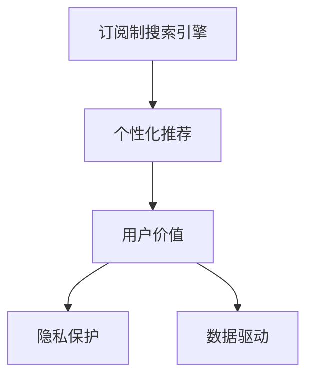

                 

# 订阅制搜索引擎：新商业模式的崛起

> 关键词：订阅制搜索引擎, 新商业模式, 搜索引擎算法, 个性化推荐, 用户价值, 隐私保护, 数据驱动

## 1. 背景介绍

### 1.1 问题由来

随着互联网的飞速发展，搜索引擎已逐步成为人们日常生活中不可或缺的一部分。传统的广告驱动模式因广告泛滥、用户体验下降等问题，受到了广泛的诟病。为了解决这些问题，订阅制搜索引擎应运而生，以用户订阅费为主要收入来源，通过提供更加优质的搜索服务和个性化推荐，提升用户满意度，形成良性循环。

### 1.2 问题核心关键点

订阅制搜索引擎的核心在于其商业模式和用户价值最大化。相较于广告驱动模式，订阅制搜索引擎将注意力集中在如何通过高质量的搜索结果和个性化推荐来留住用户，从而实现长期的盈利。这一模式不仅提升了用户体验，还能更好地保护用户隐私，减少数据滥用风险，是未来搜索引擎发展的重要方向。

## 2. 核心概念与联系

### 2.1 核心概念概述

为更好地理解订阅制搜索引擎的运作机制，本节将介绍几个关键概念：

- **订阅制搜索引擎(Subscription-based Search Engine)**：以用户订阅费为主要收入来源的搜索引擎模式，通过提供高质量的搜索结果和个性化推荐来提升用户满意度和忠诚度。

- **个性化推荐(Personalized Recommendation)**：根据用户历史行为和偏好，动态生成符合用户兴趣的搜索结果和推荐内容，提升用户体验。

- **用户价值(User Value)**：搜索引擎的价值在于能够快速准确地找到用户所需的信息，并为用户提供满意的搜索结果，提升用户的搜索效率和满意度。

- **隐私保护(Privacy Protection)**：保护用户隐私，避免数据滥用和信息泄露，是订阅制搜索引擎成功运营的重要基础。

- **数据驱动(Data-Driven)**：通过大量用户搜索数据和行为数据的分析，不断优化搜索结果和推荐算法，是订阅制搜索引擎能够实现个性化推荐的关键。

这些核心概念之间的关系，可以通过以下Mermaid流程图来展示：



这个流程图展示了下定义概念之间的关系：

1. 订阅制搜索引擎通过个性化推荐提升用户价值。
2. 用户价值通过隐私保护和数据驱动不断优化。
3. 数据驱动和隐私保护是实现个性化推荐的基础。

## 3. 核心算法原理 & 具体操作步骤

### 3.1 算法原理概述

订阅制搜索引擎的核心算法原理，主要包括用户行为分析、个性化推荐算法和隐私保护技术。其基本流程如下：

1. **用户行为分析**：通过分析用户的搜索历史、点击行为、停留时间等数据，挖掘用户的兴趣点和偏好，为后续的个性化推荐提供基础。
2. **个性化推荐算法**：根据用户行为分析的结果，动态调整搜索结果和推荐内容，提升用户的满意度。
3. **隐私保护技术**：在数据收集和使用过程中，通过匿名化、加密等手段保护用户隐私，避免数据滥用。

### 3.2 算法步骤详解

以下将详细介绍订阅制搜索引擎的核心算法步骤：

**Step 1: 用户行为数据收集**
- 收集用户的搜索历史、点击行为、停留时间等数据，作为个性化推荐和用户价值分析的输入。

**Step 2: 用户行为分析**
- 使用统计学和机器学习技术，对用户行为数据进行分析和建模，挖掘用户的兴趣点和偏好。
- 常见的方法包括协同过滤、聚类分析、回归分析等。

**Step 3: 个性化推荐**
- 根据用户行为分析的结果，动态调整搜索结果和推荐内容。
- 常见的推荐算法包括基于内容的推荐、协同过滤推荐、深度学习推荐等。

**Step 4: 隐私保护**
- 在数据收集和处理过程中，采用匿名化、数据脱敏、加密等手段保护用户隐私。
- 同时，建立透明的用户数据使用规则，让用户明晰数据的用途和处理方式。

**Step 5: 推荐结果展示**
- 将推荐结果与搜索结果合并，展示给用户。
- 根据用户反馈不断优化推荐算法，提升推荐效果。

### 3.3 算法优缺点

订阅制搜索引擎的算法具有以下优点：

1. **用户价值高**：通过个性化推荐，提升了用户的搜索效率和满意度，增加了用户的订阅意愿。
2. **隐私保护能力强**：采用匿名化、数据加密等手段，有效保护用户隐私，提升用户信任度。
3. **数据驱动能力强**：通过用户行为数据分析，不断优化推荐算法，提升推荐效果。

同时，也存在一些局限性：

1. **初始用户获取成本高**：订阅制模式对新用户的吸引力较弱，需要通过高质量的服务和推广活动吸引用户。
2. **推荐算法复杂**：个性化推荐算法需要处理大量的用户数据，算法复杂度较高。
3. **数据隐私问题**：尽管隐私保护技术在不断进步，但仍存在数据泄露和滥用的风险。

### 3.4 算法应用领域

订阅制搜索引擎的算法已在多个领域得到广泛应用：

1. **电商领域**：通过个性化推荐，提升用户购买意愿和满意度，增加销售额。
2. **视频平台**：根据用户观看行为，推荐感兴趣的视频内容，提升用户粘性。
3. **新闻媒体**：通过个性化推荐，提供用户感兴趣的新闻资讯，增加用户访问量。
4. **社交媒体**：根据用户行为，推荐相关的朋友、话题、内容，提升用户活跃度。
5. **教育培训**：通过个性化推荐，提供符合用户兴趣的学习资源，提升学习效果。

这些应用场景展示了订阅制搜索引擎的强大生命力和广泛适用性。

## 4. 数学模型和公式 & 详细讲解 & 举例说明

### 4.1 数学模型构建

订阅制搜索引擎的数学模型主要涉及用户行为数据分析、个性化推荐算法和隐私保护技术。以下是主要的数学模型构建：

**用户行为分析模型**
- 协同过滤模型：通过用户-物品评分矩阵，发现用户之间和物品之间的相似性，进行推荐。
- 聚类分析模型：将用户分成若干群组，针对每个群组提供个性化的推荐。

**个性化推荐算法模型**
- 基于内容的推荐模型：根据物品特征与用户兴趣的匹配度进行推荐。
- 协同过滤推荐模型：通过用户行为和物品行为的相似性进行推荐。
- 深度学习推荐模型：使用神经网络模型，对用户和物品进行编码，进行推荐。

**隐私保护模型**
- 数据匿名化模型：将用户数据进行匿名化处理，保护用户隐私。
- 数据加密模型：使用加密技术，保护数据传输和存储过程中的安全性。

### 4.2 公式推导过程

**协同过滤模型**

设 $U$ 为用户集合，$I$ 为物品集合，$R_{ui}$ 为用户 $u$ 对物品 $i$ 的评分。协同过滤模型的目标是通过用户 $u$ 的评分数据，找到物品 $i$ 和用户 $u$ 的相似度 $\hat{s}_{ui}$，从而计算物品 $i$ 的评分预测值 $\hat{r}_{ui}$。

协同过滤模型中常用的方法是基于用户的协同过滤和基于物品的协同过滤。以下是基于用户的协同过滤模型的推导过程：

假设 $u_1$ 和 $u_2$ 是两个用户，$j_1$ 和 $j_2$ 是他们共同喜欢的物品。设 $r_{u_1j_1}$ 和 $r_{u_2j_1}$ 分别为 $u_1$ 和 $u_2$ 对物品 $j_1$ 的评分，则 $u_1$ 和 $u_2$ 的相似度 $\hat{s}_{u_1u_2}$ 可以通过如下公式计算：

$$
\hat{s}_{u_1u_2} = \frac{\sum_{j \in J} (r_{u_1j} - \bar{r}_{u_1}) \cdot (r_{u_2j} - \bar{r}_{u_2})}{\sqrt{\sum_{j \in J} (r_{u_1j} - \bar{r}_{u_1})^2 \cdot \sum_{j \in J} (r_{u_2j} - \bar{r}_{u_2})^2}}
$$

其中 $J$ 为共同喜欢的物品集合，$\bar{r}_{u_1}$ 和 $\bar{r}_{u_2}$ 分别为 $u_1$ 和 $u_2$ 的评分均值。

根据相似度，物品 $i$ 的评分预测值 $\hat{r}_{ui}$ 可以通过如下公式计算：

$$
\hat{r}_{ui} = \bar{r} + s_{ui} \cdot \sum_{j \in J} (r_{uj} - \bar{r}_{u}) \cdot (r_{ij} - \bar{r}_{i})
$$

其中 $\bar{r}$ 为物品评分的均值，$s_{ui}$ 为物品 $i$ 和用户 $u$ 的相似度，$J$ 为用户喜欢的物品集合。

**基于内容的推荐模型**

基于内容的推荐模型主要考虑物品的属性特征与用户兴趣的匹配度。假设 $f_i$ 为物品 $i$ 的属性向量，$x_u$ 为用户的兴趣向量，则物品 $i$ 的评分预测值 $\hat{r}_{ui}$ 可以通过如下公式计算：

$$
\hat{r}_{ui} = \sum_{j=1}^{d} f_{ij} \cdot x_{uj}
$$

其中 $d$ 为属性向量的维度。

### 4.3 案例分析与讲解

以下将以电商平台的个性化推荐为例，详细分析订阅制搜索引擎的算法应用。

假设某电商平台有 $U$ 个用户，$I$ 个商品，每个用户对商品的评分范围在 $[1,5]$ 之间。平台收集了用户的浏览历史、购买历史和评分数据，希望通过协同过滤模型和基于内容的推荐模型，为用户提供个性化的商品推荐。

首先，平台对用户和商品的评分数据进行预处理，去除异常值和缺失值。然后，使用协同过滤模型，计算用户之间的相似度，生成推荐商品列表。接着，使用基于内容的推荐模型，根据商品的特征向量，计算商品与用户的匹配度，生成推荐商品列表。最后，将两个推荐列表合并，去除重复商品，生成最终推荐结果。

推荐结果展示给用户，平台根据用户的反馈不断优化推荐算法，提升推荐效果。

## 5. 项目实践：代码实例和详细解释说明

### 5.1 开发环境搭建

在进行订阅制搜索引擎的项目实践前，我们需要准备好开发环境。以下是使用Python进行开发的环境配置流程：

1. 安装Anaconda：从官网下载并安装Anaconda，用于创建独立的Python环境。

2. 创建并激活虚拟环境：
```bash
conda create -n search-engine-env python=3.8 
conda activate search-engine-env
```

3. 安装必要的依赖：
```bash
pip install pandas numpy scikit-learn transformers scipy
```

4. 安装PyTorch和相关库：
```bash
pip install torch torchvision torchaudio
```

5. 安装Flask和FastAPI：
```bash
pip install flask fastapi
```

完成上述步骤后，即可在`search-engine-env`环境中开始项目实践。

### 5.2 源代码详细实现

以下我们将详细实现一个基于协同过滤模型的个性化推荐系统。

**用户行为数据收集**
```python
import pandas as pd

# 读取用户和商品的评分数据
df = pd.read_csv('ratings.csv')

# 对评分数据进行预处理，去除异常值和缺失值
df = df.dropna()
df = df[(df['rating'] >= 1) & (df['rating'] <= 5)]
```

**用户行为分析**
```python
from sklearn.metrics.pairwise import cosine_similarity

# 计算用户之间的相似度
user_similarity = cosine_similarity(df.drop('item_id', axis=1))
```

**个性化推荐**
```python
def recommend(user_id, top_n=10):
    # 获取用户历史评分
    user_ratings = df[df['user_id'] == user_id]['rating'].tolist()

    # 计算物品相似度
    item_similarity = cosine_similarity(df.drop(['user_id', 'rating'], axis=1))

    # 计算物品评分预测值
    predicted_ratings = np.dot(item_similarity, user_ratings)

    # 获取推荐商品列表
    recommended_items = df.iloc[np.argsort(predicted_ratings.flatten())][::-1][:top_n]

    return recommended_items['item_id'].tolist()
```

**推荐结果展示**
```python
# 获取用户ID
user_id = 123

# 获取推荐商品列表
recommended_items = recommend(user_id)

# 显示推荐商品列表
print('推荐商品列表：', recommended_items)
```

### 5.3 代码解读与分析

让我们再详细解读一下关键代码的实现细节：

**用户行为数据收集**
- 使用Pandas库读取评分数据，并进行预处理，去除异常值和缺失值，确保数据的完整性和一致性。

**用户行为分析**
- 使用Scikit-learn库中的cosine_similarity函数，计算用户之间的相似度。

**个性化推荐**
- 根据用户历史评分，计算物品之间的相似度，并使用协同过滤模型，生成推荐商品列表。

**推荐结果展示**
- 根据推荐算法生成的商品列表，展示给用户。

在实际应用中，还需要进一步优化推荐算法，如引入更多的特征信息，调整相似度计算方式等，以提升推荐效果。

## 6. 实际应用场景

### 6.1 电商领域

订阅制搜索引擎在电商领域的应用，可以大幅提升用户购物体验和满意度。通过个性化的商品推荐，用户能够快速找到感兴趣的商品，减少购物时间和成本，提升购买转化率。电商平台通过分析用户的搜索历史、浏览行为和购买记录，可以为用户提供更精准的推荐，增加用户的复购率和忠诚度。

### 6.2 视频平台

视频平台可以利用订阅制搜索引擎，根据用户观看行为，推荐感兴趣的视频内容。通过个性化推荐，用户能够更快找到感兴趣的影片和频道，提升用户粘性和满意度。平台可以根据用户的观看数据，不断优化推荐算法，提升推荐效果。

### 6.3 新闻媒体

新闻媒体可以利用订阅制搜索引擎，根据用户阅读行为，推荐相关的新闻资讯。通过个性化推荐，用户能够更快找到感兴趣的新闻话题，提升新闻阅读体验和用户粘性。平台可以根据用户的阅读数据，不断优化推荐算法，增加用户访问量和互动率。

### 6.4 社交媒体

社交媒体可以利用订阅制搜索引擎，根据用户互动行为，推荐相关的朋友、话题、内容。通过个性化推荐，用户能够更快找到感兴趣的内容，增加用户活跃度和满意度。平台可以根据用户的互动数据，不断优化推荐算法，提升用户粘性和互动率。

### 6.5 教育培训

教育培训领域可以利用订阅制搜索引擎，根据用户学习行为，推荐相关的学习资源和课程。通过个性化推荐，用户能够更快找到感兴趣的学习资源，提升学习效果和满意度。平台可以根据用户的学习数据，不断优化推荐算法，增加用户的学习效果和课程完成率。

## 7. 工具和资源推荐

### 7.1 学习资源推荐

为了帮助开发者系统掌握订阅制搜索引擎的理论基础和实践技巧，这里推荐一些优质的学习资源：

1. 《推荐系统基础与实践》系列博文：由推荐系统专家撰写，深入浅出地介绍了推荐系统原理、算法和应用。

2. CS229《机器学习》课程：斯坦福大学开设的机器学习明星课程，涵盖推荐系统的内容。

3. 《推荐系统实战》书籍：介绍推荐系统的理论基础和实践应用，详细讲解了个性化推荐算法和用户行为分析。

4. Kaggle推荐系统竞赛：参加推荐系统竞赛，实践推荐算法和数据分析，提升实践能力。

5. 《数据科学与深度学习》课程：介绍数据科学和深度学习的基本概念和实践应用，包括推荐系统。

通过对这些资源的学习实践，相信你一定能够快速掌握订阅制搜索引擎的理论基础和实践技巧，并用于解决实际的推荐问题。

### 7.2 开发工具推荐

高效的开发离不开优秀的工具支持。以下是几款用于订阅制搜索引擎开发的常用工具：

1. Jupyter Notebook：免费的交互式开发环境，支持Python、R等多种语言，方便进行数据探索和算法实验。

2. Apache Spark：用于大规模数据处理和分析的分布式计算框架，支持分布式机器学习任务。

3. Hadoop：用于大规模数据存储和处理的分布式计算平台，支持大数据分析和机器学习。

4. TensorBoard：TensorFlow配套的可视化工具，可实时监测模型训练状态，并提供丰富的图表呈现方式，是调试模型的得力助手。

5. Weights & Biases：模型训练的实验跟踪工具，可以记录和可视化模型训练过程中的各项指标，方便对比和调优。

6. Flask和FastAPI：轻量级的Web框架，支持快速开发和部署Web应用，适合进行在线服务开发。

合理利用这些工具，可以显著提升订阅制搜索引擎的开发效率，加快创新迭代的步伐。

### 7.3 相关论文推荐

订阅制搜索引擎的发展源于学界的持续研究。以下是几篇奠基性的相关论文，推荐阅读：

1. "Collaborative Filtering"：G.S. KDD'98，介绍了协同过滤算法的基本思想和实现方法。

2. "Item-Based Collaborative Filtering Recommendation Algorithms"：ICDM'11，介绍了基于物品的协同过滤算法。

3. "Factorization Machines"：ICDM'07，介绍了矩阵分解算法的基本思想和实现方法。

4. "BPR: Bayesian Personalized Ranking from Historical Interaction"：ICDM'09，介绍了基于BP的协同过滤算法。

5. "Deep Learning in Recommendation Systems"：ICDM'14，介绍了深度学习在推荐系统中的应用。

这些论文代表了大数据推荐系统的研究脉络。通过学习这些前沿成果，可以帮助研究者把握学科前进方向，激发更多的创新灵感。

## 8. 总结：未来发展趋势与挑战

### 8.1 总结

本文对订阅制搜索引擎进行了全面系统的介绍。首先阐述了订阅制搜索引擎的商业模式和用户价值最大化，明确了其对提升用户体验和保护用户隐私的重要意义。其次，从原理到实践，详细讲解了订阅制搜索引擎的核心算法步骤，给出了推荐系统的代码实现和详细解释。同时，本文还广泛探讨了订阅制搜索引擎在多个领域的应用前景，展示了其强大的生命力和广泛适用性。此外，本文精选了推荐系统的各类学习资源，力求为读者提供全方位的技术指引。

通过本文的系统梳理，可以看到，订阅制搜索引擎已成为推荐系统的重要范式，极大地提升了用户搜索效率和满意度，为推荐系统的发展提供了新的方向。未来，伴随推荐算法的不断演进，订阅制搜索引擎必将在更多领域得到应用，为推荐系统带来新的突破。

### 8.2 未来发展趋势

展望未来，订阅制搜索引擎将呈现以下几个发展趋势：

1. **个性化推荐更加精准**：随着推荐算法的不断优化，个性化推荐将更加精准，提升用户满意度和忠诚度。

2. **推荐系统与大数据融合**：推荐系统将与大数据技术深度融合，通过分析海量用户数据，提供更加精准和多样化的推荐内容。

3. **推荐系统与人工智能结合**：推荐系统将与人工智能技术深度结合，引入深度学习、强化学习等方法，提升推荐效果和用户体验。

4. **推荐系统与物联网结合**：推荐系统将与物联网技术深度结合，通过感知用户的行为数据，提供更加个性化和实时的推荐服务。

5. **推荐系统与社交网络结合**：推荐系统将与社交网络深度结合，通过分析用户的社交行为数据，提供更加精准和互动性强的推荐内容。

6. **推荐系统与隐私保护结合**：推荐系统将与隐私保护技术深度结合，通过匿名化、加密等手段保护用户隐私，提升用户信任度。

这些趋势凸显了订阅制搜索引擎的广阔前景。这些方向的探索发展，必将进一步提升推荐系统的性能和应用范围，为人类生活带来深远影响。

### 8.3 面临的挑战

尽管订阅制搜索引擎已经取得了显著的进展，但在迈向更加智能化、普适化应用的过程中，它仍面临诸多挑战：

1. **数据获取成本高**：订阅制搜索引擎需要收集大量的用户数据，数据获取成本较高。如何高效获取高质量的用户数据，是一个重要的挑战。

2. **推荐算法复杂**：推荐算法需要处理大量的用户数据，算法复杂度较高。如何设计高效简洁的算法，是一个重要的研究方向。

3. **隐私保护问题**：在数据收集和处理过程中，如何保护用户隐私，避免数据滥用和信息泄露，是一个重要的课题。

4. **用户粘性不足**：订阅制搜索引擎对新用户的吸引力较弱，需要通过高质量的服务和推广活动吸引用户。

5. **推荐效果波动**：推荐系统对数据的变化敏感，如何设计鲁棒的算法，避免推荐效果波动，是一个重要的研究方向。

6. **算力资源有限**：推荐系统需要处理大量的用户数据和物品数据，对算力资源的要求较高。如何优化算法，减少计算资源消耗，是一个重要的研究方向。

正视推荐系统面临的这些挑战，积极应对并寻求突破，将是大数据推荐系统走向成熟的必由之路。相信随着学界和产业界的共同努力，这些挑战终将一一被克服，推荐系统必将在构建人机协同的智能系统方面发挥更大的作用。

### 8.4 研究展望

面对订阅制搜索引擎所面临的种种挑战，未来的研究需要在以下几个方面寻求新的突破：

1. **探索更多推荐算法**：探索基于深度学习、强化学习等前沿技术的推荐算法，提升推荐效果和用户体验。

2. **引入多模态数据**：引入多模态数据，如文本、图像、语音等，提升推荐系统的智能化水平。

3. **优化推荐算法性能**：优化推荐算法的性能，减少计算资源消耗，提高推荐速度和效果。

4. **提升推荐系统鲁棒性**：提升推荐系统的鲁棒性，避免推荐效果波动，增强系统的稳定性。

5. **加强隐私保护**：加强隐私保护技术的研究，提升用户数据的隐私保护能力，增强用户信任度。

6. **推广用户参与**：推广用户参与，通过用户反馈和行为数据，不断优化推荐算法，提升推荐效果。

这些研究方向的探索，必将引领推荐系统迈向更高的台阶，为构建智能推荐系统提供新的技术路径。面向未来，推荐系统还需要与其他人工智能技术进行更深入的融合，如知识表示、因果推理、强化学习等，多路径协同发力，共同推动推荐系统的发展。只有勇于创新、敢于突破，才能不断拓展推荐系统的边界，让智能推荐技术更好地服务于人类社会。

## 9. 附录：常见问题与解答

**Q1：订阅制搜索引擎是否适用于所有推荐任务？**

A: 订阅制搜索引擎在大多数推荐任务上都能取得不错的效果，特别是对于数据量较小的任务。但对于一些特定领域的任务，如医学、法律等，仅仅依靠通用语料预训练的模型可能难以很好地适应。此时需要在特定领域语料上进一步预训练，再进行微调，才能获得理想效果。

**Q2：订阅制搜索引擎与广告驱动搜索引擎的区别在哪里？**

A: 订阅制搜索引擎的主要收入来源是用户订阅费，通过提供高质量的搜索结果和个性化推荐，提升用户满意度，形成良性循环。而广告驱动搜索引擎的主要收入来源是广告点击量，通过展示广告来盈利。订阅制搜索引擎注重用户价值最大化和隐私保护，而广告驱动搜索引擎则更多关注广告效果和点击率。

**Q3：如何评估订阅制搜索引擎的效果？**

A: 订阅制搜索引擎的效果评估主要从以下几个方面考虑：
1. 用户满意度：通过用户反馈和行为数据，评估用户的满意度和忠诚度。
2. 推荐准确率：通过A/B测试等手段，评估推荐结果的准确率和相关性。
3. 用户留存率：通过用户留存率等指标，评估订阅制搜索引擎对用户粘性的提升效果。
4. 广告收入：通过分析用户订阅数据和广告点击数据，评估广告收入效果。

**Q4：如何优化订阅制搜索引擎的推荐算法？**

A: 订阅制搜索引擎的推荐算法优化主要从以下几个方面考虑：
1. 引入更多特征信息：引入更多的用户行为和物品特征信息，提升推荐效果。
2. 调整相似度计算方式：调整相似度计算方式，如引入稀疏矩阵分解等方法。
3. 优化推荐算法模型：优化推荐算法的模型结构，如引入深度学习模型等。
4. 数据增强和样本扩充：通过数据增强和样本扩充等手段，提升推荐算法的泛化能力。
5. 在线实时优化：通过在线实时优化，不断调整推荐算法，提升推荐效果。

这些优化方法将有助于提高订阅制搜索引擎的推荐效果和用户满意度。

**Q5：如何平衡推荐系统中的隐私保护和推荐效果？**

A: 推荐系统中的隐私保护和推荐效果是一个重要的平衡问题。以下是一些平衡策略：
1. 数据匿名化：在数据收集和处理过程中，对用户数据进行匿名化处理，保护用户隐私。
2. 数据加密：在数据传输和存储过程中，使用加密技术，保护数据安全性。
3. 用户数据控制：允许用户控制自己的数据使用方式，提升用户信任度。
4. 数据最小化：只收集和处理必要的用户数据，避免数据滥用。
5. 透明用户规则：建立透明的用户数据使用规则，让用户明晰数据的用途和处理方式。

这些策略将有助于平衡推荐系统中的隐私保护和推荐效果。

---

作者：禅与计算机程序设计艺术 / Zen and the Art of Computer Programming

