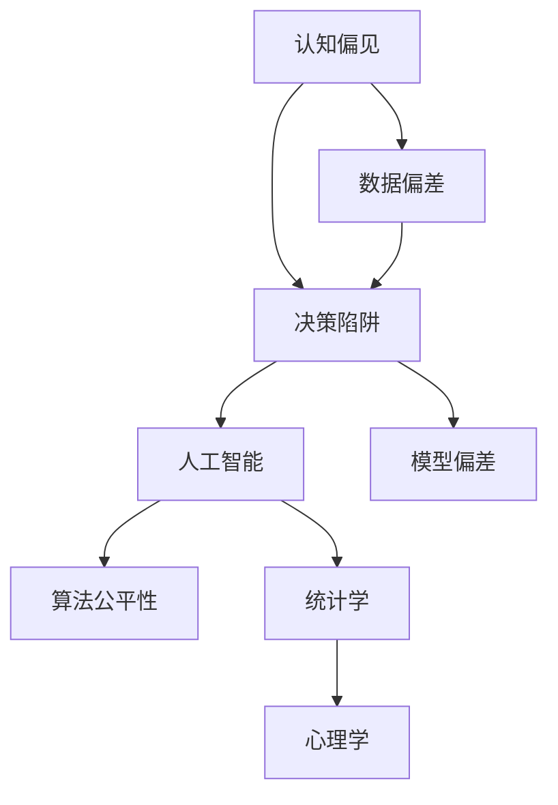

                 

# 认知偏见：如何避免决策陷阱

> 关键词：认知偏见,决策陷阱,人工智能,算法公平性,数据偏差,统计学,心理学,机器学习,偏见消除

## 1. 背景介绍

### 1.1 问题由来
在日常生活中，我们每天都在做各种决策，从选择出行路线，到购买商品，甚至决定职业方向，这些决策看似简单，实则背后隐藏着复杂的认知过程。而在这个过程中，各种认知偏见(Bias)和决策陷阱（Decision Bias）常常影响我们的判断，导致错误的决策结果。

在机器学习和人工智能(AI)领域，认知偏见和决策陷阱的问题也同样突出。AI系统在处理复杂数据和决策任务时，同样容易受到数据偏差、算法缺陷等认知偏见的影响，导致模型的预测结果出现偏差，甚至引发严重的后果。

### 1.2 问题核心关键点
为了更好地理解认知偏见和决策陷阱，本文将首先介绍几个核心概念：

- **认知偏见**：指人们在信息处理、决策过程中由于心理因素、社会文化影响等导致的认知偏差。常见的认知偏见包括确认偏误(Confirmation Bias)、归因偏误(Attribution Bias)、可获得性启发法(Availability Heuristic)等。
- **决策陷阱**：指在决策过程中，由于逻辑错误、心理偏差等因素导致的决策错误。常见的决策陷阱包括假行动者效应(Framing Effect)、沉没成本效应(Sunk Cost Effect)、锚定效应(Anchoring Effect)等。
- **人工智能**：通过算法和大数据技术，使机器具备类似人类的智能，实现自动化决策、预测和控制。AI系统在决策过程中同样容易受到偏见和陷阱的影响，导致错误输出。
- **算法公平性**：AI模型在处理不同人群数据时应保持一致性，避免对特定群体产生不公平的影响。

这些概念之间的逻辑关系可以通过以下Mermaid流程图来展示：



这个流程图展示了几者之间的联系：

1. 认知偏见和决策陷阱对AI系统的影响，会导致模型偏差。
2. 数据偏差是偏见和陷阱产生的根本原因。
3. AI系统的处理过程涉及统计学和心理学，是理解和消除偏见的理论基础。

这些核心概念共同构成了我们理解认知偏见和决策陷阱的基础，有助于在实际应用中更好地避免这些问题。

## 2. 核心概念与联系

### 2.1 核心概念概述

为更好地理解认知偏见和决策陷阱，本节将介绍几个关键概念：

- **确认偏误(Confirmation Bias)**：倾向于关注与自己观点相符的信息，忽略或低估与之相反的信息。在AI决策中，确认偏误可能导致模型过度拟合训练数据，对异常数据缺乏敏感性。
- **归因偏误(Attribution Bias)**：人们在归因时，更倾向于将成功归因于自身，将失败归因于外部因素。在AI模型中，归因偏误可能导致模型在训练和测试数据中表现不一致，影响模型的泛化能力。
- **可获得性启发法(Availability Heuristic)**：人们倾向于依赖易于回忆的信息做出判断，而忽视信息的质量和代表性。在AI模型中，可获得性启发法可能导致模型过度关注高频出现的现象，忽略低频但重要的数据。
- **假行动者效应(Framing Effect)**：同一决策在不同表述下，可能产生截然不同的结果。在AI系统中，框架效应可能导致模型在不同情境下输出不一致，影响模型预测的稳定性。
- **沉没成本效应(Sunk Cost Effect)**：人们在决策中可能过度考虑前期投入的成本，影响后续决策。在AI模型中，沉没成本效应可能导致模型过度依赖已有结果，缺乏及时调整的能力。
- **锚定效应(Anchoring Effect)**：人们在做出判断时，可能过分依赖初始信息，导致后续决策出现偏差。在AI模型中，锚定效应可能导致模型过于依赖初始训练数据，无法适应新的数据分布。

这些核心概念之间存在着密切的联系，影响着AI模型的决策过程。以下将具体分析这些概念的原理和应用。

### 2.2 核心概念原理和架构

认知偏见和决策陷阱的产生机制涉及心理学、统计学等多个学科的知识。以下将从心理学和统计学的角度，对它们进行简要介绍：

**心理学视角**：

认知偏见的产生与人们的心理机制密切相关。人类大脑在处理信息时，往往受到情感、记忆、习惯等因素的影响，导致对信息的处理出现偏差。例如：

- **确认偏误**：基于人类的记忆偏差，倾向于记住符合自己观点的信息，而忽视或遗忘与之相反的信息。
- **归因偏误**：人们在进行归因时，倾向于将成功归因于自身，而将失败归因于外部因素。
- **可获得性启发法**：基于人类记忆的可访问性，倾向于依赖易于回忆的信息进行判断。
- **假行动者效应**：基于人类的心理框架，同一决策在不同情境下可能产生不同的结果。
- **沉没成本效应**：基于人类的行为模式，人们在决策时可能会过于考虑前期投入的成本，影响后续决策。
- **锚定效应**：基于人类对初始信息的依赖，可能在后续决策中过分依赖初始信息。

**统计学视角**：

认知偏见和决策陷阱的产生也与数据分布、统计方法等因素密切相关。例如：

- **数据偏差**：在数据收集、标注过程中可能存在偏差，导致数据分布不平衡。
- **模型偏差**：由于数据偏差，模型在训练和测试过程中可能产生不一致的输出。
- **算法偏差**：在算法设计、参数选择等方面可能存在偏差，导致模型输出存在系统性误差。

这些认知偏见和决策陷阱的原理，通过心理学和统计学的视角可以更加清晰地理解。以下将从算法的角度，具体分析如何避免和纠正这些偏差。

### 2.3 核心算法原理 & 具体操作步骤

#### 3.1 算法原理概述

为了解决认知偏见和决策陷阱，需要在AI系统中引入算法技术，对数据和模型进行校正和优化。具体来说，可以采用以下几种方法：

- **数据预处理**：对数据进行清洗、去噪、标准化等预处理操作，减少数据偏差的影响。
- **算法设计**：设计更加公平、稳健的算法模型，避免特定算法偏见。
- **监督学习**：通过监督学习技术，对模型进行微调，提高模型对异常数据的敏感性。
- **对抗训练**：引入对抗样本，提升模型对噪声数据的鲁棒性。
- **模型集成**：通过集成多个模型，减少单一模型偏见的影响。

#### 3.2 算法步骤详解

以对抗训练为例，具体步骤详解如下：

**Step 1: 收集对抗样本**

收集与训练数据分布相似的对抗样本，这些样本可能包含噪声、异常值等。例如，在图像分类任务中，可以生成一些轻微扰动的图像，如旋转、扭曲、添加噪声等。

**Step 2: 模型训练**

将对抗样本与训练数据一起输入模型进行训练，优化模型参数。例如，在图像分类任务中，可以定义交叉熵损失函数，优化模型对对抗样本的分类效果。

**Step 3: 评估与测试**

在训练完成后，对模型进行评估和测试，检查模型是否对对抗样本表现出鲁棒性。例如，在图像分类任务中，可以在测试集中加入对抗样本，检查模型分类错误的频率是否降低。

**Step 4: 微调模型**

根据评估结果，对模型进行微调，进一步提升其对对抗样本的鲁棒性。例如，在图像分类任务中，可以调整模型的学习率、优化器等参数，优化模型对对抗样本的分类效果。

通过对抗训练，可以有效提升AI模型的鲁棒性，减少数据偏差和算法偏见的影响。以下将具体介绍一些具体的算法步骤。

#### 3.3 算法优缺点

基于对抗训练的算法具有以下优点：

- **提高模型鲁棒性**：通过对抗样本的训练，模型能够更好地适应复杂的现实环境，减少噪声和异常数据的影响。
- **减少算法偏见**：对抗训练可以减少模型对特定数据分布的依赖，避免算法偏见。
- **提升模型泛化能力**：对抗训练能够提高模型对新数据的适应能力，减少过拟合。

同时，该算法也存在一些局限性：

- **对抗样本生成困难**：对抗样本的生成需要一定的技术手段，可能涉及复杂的计算和数据处理。
- **对抗样本易被检测**：对抗样本可能会被检测器识别，导致模型鲁棒性下降。
- **计算资源消耗高**：对抗训练需要大量的计算资源，可能存在计算效率问题。

尽管存在这些局限性，但对抗训练在减少认知偏见和决策陷阱方面的效果显著，仍然是当前AI系统增强鲁棒性的一个重要方法。

#### 3.4 算法应用领域

对抗训练在多个AI应用领域都有广泛应用，例如：

- **图像分类**：在图像分类任务中，对抗训练可以有效提升模型对噪声图像的鲁棒性，减少误分类率。
- **语音识别**：在语音识别任务中，对抗训练可以有效提升模型对噪声信号的鲁棒性，减少语音识别错误。
- **自然语言处理**：在自然语言处理任务中，对抗训练可以有效提升模型对噪声文本的鲁棒性，减少误分类和误识别。
- **推荐系统**：在推荐系统任务中，对抗训练可以有效提升模型对噪声数据的鲁棒性，减少推荐错误。

以上仅是几个常见的应用领域，对抗训练在实际应用中具有广泛的适用性。通过对抗训练，可以有效提升AI系统的鲁棒性和准确性，减少认知偏见和决策陷阱的影响。

## 4. 数学模型和公式 & 详细讲解

### 4.1 数学模型构建

以下以图像分类任务为例，构建对抗训练的数学模型：

设图像分类模型为 $f_\theta(x)$，其中 $x$ 为输入图像，$\theta$ 为模型参数。假设对抗样本为 $x_k = x + \delta_k$，其中 $\delta_k$ 为对抗噪声。

对抗训练的目标是最小化损失函数 $L_\text{adv}$，使模型对对抗样本的分类误差最小：

$$
L_\text{adv} = \mathbb{E}_{x_k} [L_\text{ce}(f_\theta(x_k), y_k)] + \lambda \mathbb{E}_{x_k} [\|\nabla_\theta f_\theta(x_k)\|]
$$

其中 $L_\text{ce}$ 为交叉熵损失函数，$y_k$ 为对抗样本的真实标签，$\lambda$ 为正则化系数。

### 4.2 公式推导过程

以图像分类任务为例，对抗训练的损失函数推导如下：

设模型对图像 $x$ 的分类概率为 $p(y|x) = f_\theta(x)$。对于对抗样本 $x_k = x + \delta_k$，模型的分类概率为 $p(y|x_k) = f_\theta(x_k)$。

对抗训练的损失函数可以分为两部分：
1. 对抗样本分类损失 $L_\text{adv}^\text{cls}$：
$$
L_\text{adv}^\text{cls} = \mathbb{E}_{x_k} [\ell(p(y|x_k), y_k)]
$$
其中 $\ell$ 为具体的损失函数，如交叉熵损失。
2. 对抗样本梯度范数损失 $L_\text{adv}^\text{norm}$：
$$
L_\text{adv}^\text{norm} = \lambda \mathbb{E}_{x_k} [\|\nabla_\theta f_\theta(x_k)\|]
$$
其中 $\lambda$ 为正则化系数，控制梯度范数对损失函数的贡献。

通过最小化对抗训练的损失函数 $L_\text{adv}$，可以提升模型对对抗样本的鲁棒性，减少认知偏见和决策陷阱的影响。

### 4.3 案例分析与讲解

以图像分类任务为例，对抗训练的案例分析如下：

**Step 1: 数据准备**

收集训练数据 $D = \{(x_i, y_i)\}_{i=1}^N$，其中 $x_i$ 为输入图像，$y_i$ 为真实标签。

**Step 2: 对抗样本生成**

生成对抗样本 $x_k = x_i + \delta_k$，其中 $\delta_k$ 为对抗噪声。可以采用FGSM、PGD等方法生成对抗样本，具体步骤如下：

1. 随机初始化对抗噪声 $\delta_k$。
2. 将对抗样本 $x_k$ 输入模型 $f_\theta$，计算损失梯度 $\nabla_\theta f_\theta(x_k)$。
3. 更新对抗噪声 $\delta_k$：$\delta_k = \delta_k - \alpha \nabla_\theta f_\theta(x_k)$，其中 $\alpha$ 为步长。
4. 重复步骤2和3，直到对抗样本满足特定条件（如对抗噪声大小、迭代次数等）。

**Step 3: 模型训练**

将对抗样本与训练数据一起输入模型进行训练，优化模型参数 $\theta$。可以采用梯度下降等优化算法，最小化对抗训练损失函数 $L_\text{adv}$。

**Step 4: 评估与测试**

在训练完成后，对模型进行评估和测试，检查模型是否对对抗样本表现出鲁棒性。例如，在测试集中加入对抗样本，检查模型分类错误的频率是否降低。

通过对抗训练，可以有效提升模型对对抗样本的鲁棒性，减少认知偏见和决策陷阱的影响。以下将具体介绍一些具体的算法实现。

## 5. 项目实践：代码实例和详细解释说明

### 5.1 开发环境搭建

在进行对抗训练实践前，我们需要准备好开发环境。以下是使用Python进行TensorFlow开发的环境配置流程：

1. 安装Anaconda：从官网下载并安装Anaconda，用于创建独立的Python环境。

2. 创建并激活虚拟环境：
```bash
conda create -n tf-env python=3.8 
conda activate tf-env
```

3. 安装TensorFlow：根据CUDA版本，从官网获取对应的安装命令。例如：
```bash
conda install tensorflow -c pytorch -c conda-forge
```

4. 安装NumPy、Matplotlib等工具包：
```bash
pip install numpy matplotlib
```

完成上述步骤后，即可在`tf-env`环境中开始对抗训练实践。

### 5.2 源代码详细实现

这里我们以图像分类任务为例，给出使用TensorFlow对图像分类模型进行对抗训练的代码实现。

首先，定义数据处理函数：

```python
import tensorflow as tf
import numpy as np
import matplotlib.pyplot as plt

def load_dataset():
    # 加载图像数据集
    mnist = tf.keras.datasets.mnist
    (x_train, y_train), (x_test, y_test) = mnist.load_data()
    x_train, x_test = x_train / 255.0, x_test / 255.0

    # 将标签转换为one-hot编码
    y_train = tf.keras.utils.to_categorical(y_train, 10)
    y_test = tf.keras.utils.to_categorical(y_test, 10)
    
    return x_train, y_train, x_test, y_test
```

然后，定义对抗样本生成函数：

```python
def generate_adv样本(x, y, model):
    # 随机初始化对抗噪声
    delta = np.random.normal(0, 0.1, size=x.shape)
    
    # 计算对抗样本梯度
    grads = tf.gradients(model(tf.constant(x + delta, dtype=tf.float32)), delta)
    
    # 更新对抗噪声
    for i in range(50):
        delta -= alpha * grads[i]
        # 截断梯度，避免梯度爆炸
        delta = np.clip(delta, -1, 1)
    
    # 返回对抗样本
    x_adv = x + delta
    return x_adv
```

接着，定义对抗训练函数：

```python
def train_adv样本(x_train, y_train, x_test, y_test, model, epochs=10, batch_size=128, alpha=0.01, lamda=0.1):
    # 定义损失函数
    def loss(y_true, y_pred):
        return tf.keras.losses.categorical_crossentropy(y_true, y_pred)
    
    # 定义优化器
    optimizer = tf.keras.optimizers.Adam(learning_rate=0.001)
    
    # 定义梯度范数正则项
    def gradient_norm(x):
        return tf.sqrt(tf.reduce_sum(tf.square(tf.gradients(model(x), x)[0])))
    
    # 训练循环
    for epoch in range(epochs):
        for batch in range(0, x_train.shape[0], batch_size):
            # 加载批次数据
            x_batch = x_train[batch:batch+batch_size]
            y_batch = y_train[batch:batch+batch_size]
            
            # 生成对抗样本
            x_adv_batch = generate_adv样本(x_batch, y_batch, model)
            
            # 计算损失
            y_pred = model(x_batch)
            y_pred_adv = model(x_adv_batch)
            loss_batch = loss(y_batch, y_pred) + lamda * gradient_norm(x_batch)
            
            # 反向传播
            optimizer.minimize(loss_batch, variables=model.trainable_variables)
            
            # 评估测试集损失
            y_pred_test = model(x_test)
            loss_test = loss(y_test, y_pred_test)
            
            # 打印日志
            print(f"Epoch {epoch+1}, loss: {loss_test.numpy():.4f}")
```

最后，启动对抗训练流程：

```python
# 加载数据
x_train, y_train, x_test, y_test = load_dataset()
model = tf.keras.Sequential([
    tf.keras.layers.Flatten(input_shape=(28, 28)),
    tf.keras.layers.Dense(128, activation='relu'),
    tf.keras.layers.Dense(10, activation='softmax')
])
train_adv_samples(x_train, y_train, x_test, y_test, model, epochs=10, batch_size=128, alpha=0.01, lamda=0.1)
```

以上就是使用TensorFlow对图像分类模型进行对抗训练的完整代码实现。可以看到，通过简单的几行代码，就可以实现对抗训练的过程，提升模型的鲁棒性。

### 5.3 代码解读与分析

让我们再详细解读一下关键代码的实现细节：

**load_dataset函数**：
- 从MNIST数据集中加载训练集和测试集，并将图像数据标准化为0-1之间的值。
- 将标签转换为one-hot编码，方便模型处理。

**generate_adv样本函数**：
- 生成对抗样本：在原始图像上添加对抗噪声，通过梯度下降方法逐步优化对抗噪声，使得对抗样本能够误导模型分类。
- 梯度计算：使用TensorFlow的`tf.gradients`函数计算模型对对抗样本的梯度，避免梯度爆炸问题。
- 截断梯度：对抗噪声的更新需要避免梯度爆炸，使用`np.clip`函数对梯度进行截断处理。

**train_adv样本函数**：
- 定义损失函数：使用交叉熵损失函数计算模型对训练样本的分类误差。
- 定义优化器：使用Adam优化器进行参数更新。
- 定义梯度范数正则项：使用`gradient_norm`函数计算梯度范数，并进行正则化处理。
- 训练循环：使用for循环对每个批次数据进行训练，计算梯度范数正则项，反向传播更新模型参数。
- 评估测试集损失：在训练完成后，计算模型在测试集上的损失，评估模型性能。

通过这些代码实现，可以直观地理解对抗训练的基本流程和关键步骤，并灵活应用于实际任务中。

当然，工业级的系统实现还需考虑更多因素，如模型的保存和部署、超参数的自动搜索、更灵活的任务适配层等。但核心的对抗训练范式基本与此类似。

## 6. 实际应用场景
### 6.1 智慧医疗

对抗训练在智慧医疗领域具有广泛的应用前景。医疗影像诊断是AI系统的一个重要任务，但医疗影像数据中往往存在噪声、遮挡等问题，导致模型难以准确识别病变。对抗训练可以有效提升模型的鲁棒性，减少误诊率。

例如，在肺部CT影像中，对抗训练可以生成一些轻微的噪声或扰动，使得模型能够更好地适应复杂的影像数据，减少误诊和漏诊现象。

### 6.2 金融风控

金融领域的数据中存在大量异常值和噪声，对抗训练可以有效提升模型的鲁棒性，减少误判和风险损失。例如，在欺诈检测任务中，对抗训练可以生成一些虚假交易记录，使得模型能够更好地适应异常交易行为，减少误判。

### 6.3 工业制造

工业制造领域的数据中存在大量异常和噪声，对抗训练可以有效提升模型的鲁棒性，减少误判和生产事故。例如，在设备监控任务中，对抗训练可以生成一些异常数据，使得模型能够更好地适应异常工况，减少误判和事故。

### 6.4 未来应用展望

随着对抗训练技术的发展，其在更多领域的应用将变得更加广泛。以下展望未来的几个方向：

1. **多模态对抗训练**：对抗训练可以扩展到多个模态数据（如图像、语音、文本等），提升多模态系统的鲁棒性和准确性。例如，在视频监控任务中，对抗训练可以生成一些视频帧，使得模型能够更好地适应复杂的视频数据。
2. **对抗样本生成技术**：对抗样本生成技术将进一步发展，能够生成更加复杂和难以识别的对抗样本，提升模型的鲁棒性。例如，在自然语言处理任务中，对抗样本生成技术可以生成一些语言模型难以处理的多义词和歧义词。
3. **分布式对抗训练**：分布式对抗训练可以在多个计算节点上进行，提升模型的训练速度和鲁棒性。例如，在云计算平台中，分布式对抗训练可以提高模型训练效率，减少训练时间。
4. **对抗训练与自监督学习结合**：对抗训练可以与自监督学习相结合，提升模型的自适应能力。例如，在图像生成任务中，对抗训练可以生成一些对抗样本，使得模型能够更好地适应新的数据分布。

以上方向展示了对抗训练技术的广阔应用前景，未来在更多领域的应用将推动AI系统的不断进步。

## 7. 工具和资源推荐
### 7.1 学习资源推荐

为了帮助开发者系统掌握对抗训练的理论基础和实践技巧，这里推荐一些优质的学习资源：

1. **《深度学习中的对抗样本》**：该书详细介绍了对抗样本的生成方法、攻击方法、防御方法等内容，是对抗训练领域的重要参考文献。
2. **CS231n《深度神经网络与视觉识别》课程**：斯坦福大学开设的深度学习课程，涵盖了对抗样本生成、对抗训练等前沿话题，是入门对抗训练的极佳选择。
3. **《对抗样本生成与防御》**：该书详细介绍了对抗样本生成和防御方法，涵盖了图像、语音、文本等多种模态数据的对抗训练技术。
4. **论文《Adversarial Training Methods for Semi-Supervised Text Classification》**：该论文提出了基于对抗样本的半监督文本分类方法，具有较高的理论和实践参考价值。
5. **网站https://arxiv.org**：arXiv网站是学术研究的文献库，可以找到大量的对抗训练相关论文和资源。

通过对这些资源的学习实践，相信你一定能够快速掌握对抗训练的精髓，并用于解决实际的AI问题。

### 7.2 开发工具推荐

高效的开发离不开优秀的工具支持。以下是几款用于对抗训练开发的常用工具：

1. **TensorFlow**：由Google主导开发的开源深度学习框架，生产部署方便，适合大规模工程应用。具有强大的自动微分和分布式计算能力，是实现对抗训练的重要工具。
2. **PyTorch**：由Facebook主导开发的开源深度学习框架，灵活高效，适合快速迭代研究。具有丰富的深度学习模型和算法支持。
3. **AutoKeras**：一种自动化机器学习工具，可以自动选择和优化模型结构，减少对抗训练中的参数调参难度。
4. **FastAI**：一种高级深度学习库，具有丰富的预训练模型和实用工具，可以快速实现对抗训练。
5. **PyTorch Lightning**：一种轻量级的深度学习框架，具有快速的模型训练和调优能力，支持分布式训练和模型集成。

合理利用这些工具，可以显著提升对抗训练的开发效率，加快创新迭代的步伐。

### 7.3 相关论文推荐

对抗训练在多个AI应用领域都有广泛研究，以下是几篇重要的相关论文，推荐阅读：

1. **论文《Adversarial Training Methods for Semi-Supervised Text Classification》**：该论文提出了基于对抗样本的半监督文本分类方法，取得了优异的性能。
2. **论文《Towards Deep Learning Models Resistant to Adversarial Attacks》**：该论文详细介绍了各种对抗样本生成方法和对抗训练技术，具有较高的参考价值。
3. **论文《Adversarial Examples for Text Classification》**：该论文详细介绍了基于对抗样本的文本分类方法，取得了优异的性能。
4. **论文《Fast Adversarial Example Generation》**：该论文提出了高效的对抗样本生成算法，提高了对抗训练的效率和效果。
5. **论文《Adversarial Robustness: Characterization and Quantification》**：该论文详细介绍了对抗训练的数学理论和技术方法，具有较高的学术参考价值。

这些论文代表了大语言模型微调技术的发展脉络。通过学习这些前沿成果，可以帮助研究者把握学科前进方向，激发更多的创新灵感。

## 8. 总结：未来发展趋势与挑战

### 8.1 总结

本文对认知偏见和决策陷阱的认知及其避免方法进行了全面系统的介绍。首先阐述了认知偏见和决策陷阱在人工智能系统中的表现形式和影响机制，明确了对抗训练在减少偏见和陷阱中的重要价值。其次，从算法原理和操作步骤的角度，详细讲解了对抗训练的数学模型和关键步骤，给出了具体的代码实现。同时，本文还广泛探讨了对抗训练在多个行业领域的应用前景，展示了其在提升AI系统鲁棒性方面的巨大潜力。此外，本文精选了对抗训练技术的各类学习资源，力求为读者提供全方位的技术指引。

通过本文的系统梳理，可以看到，对抗训练在减少认知偏见和决策陷阱方面的效果显著，是提升AI系统鲁棒性的重要方法。未来随着对抗训练技术的不断进步，AI系统将在更广泛的应用场景中发挥作用，显著提升决策的准确性和鲁棒性。

### 8.2 未来发展趋势

展望未来，对抗训练技术将呈现以下几个发展趋势：

1. **多模态对抗训练**：对抗训练将扩展到多个模态数据，提升多模态系统的鲁棒性和准确性。
2. **高效的对抗样本生成技术**：对抗样本生成技术将进一步发展，生成更加复杂和难以识别的对抗样本。
3. **分布式对抗训练**：分布式对抗训练可以在多个计算节点上进行，提升模型的训练速度和鲁棒性。
4. **对抗训练与自监督学习结合**：对抗训练可以与自监督学习相结合，提升模型的自适应能力。

以上趋势凸显了对抗训练技术的广阔前景。这些方向的探索发展，必将进一步提升AI系统的鲁棒性和准确性，推动其在更多领域的落地应用。

### 8.3 面临的挑战

尽管对抗训练技术已经取得了瞩目成就，但在迈向更加智能化、普适化应用的过程中，它仍面临着诸多挑战：

1. **对抗样本生成难度**：生成对抗样本需要一定的技术手段，可能涉及复杂的计算和数据处理。
2. **对抗样本易被检测**：对抗样本可能会被检测器识别，导致模型鲁棒性下降。
3. **计算资源消耗高**：对抗训练需要大量的计算资源，可能存在计算效率问题。
4. **对抗样本安全性**：对抗样本的使用可能带来安全风险，如攻击者可能会利用对抗样本欺骗AI系统。

尽管存在这些挑战，但对抗训练在减少认知偏见和决策陷阱方面的效果显著，仍是当前AI系统增强鲁棒性的一个重要方法。

### 8.4 研究展望

面对对抗训练面临的挑战，未来的研究需要在以下几个方面寻求新的突破：

1. **高效的对抗样本生成技术**：开发更加高效、鲁棒的对抗样本生成算法，提高对抗训练的效率和效果。
2. **多模态对抗训练技术**：研究多模态数据对抗训练方法，提升多模态系统的鲁棒性和准确性。
3. **分布式对抗训练技术**：研究分布式对抗训练算法，提升模型训练速度和鲁棒性。
4. **对抗训练的安全性研究**：研究对抗训练的安全性问题，保障对抗样本的安全使用。

这些研究方向将推动对抗训练技术的不断进步，为构建安全、可靠、鲁棒的AI系统铺平道路。

## 9. 附录：常见问题与解答

**Q1: 对抗训练是否适用于所有AI任务？**

A: 对抗训练在大多数AI任务中都有广泛应用，特别是对于数据分布复杂、存在噪声和异常的任务。但对于一些特定领域的任务，如医疗、金融等，仅仅依靠对抗训练可能无法取得理想效果。此时需要在特定领域数据上进一步优化模型，避免对抗训练带来的负面影响。

**Q2: 对抗训练过程中如何选择对抗样本？**

A: 对抗样本的选择应考虑多个因素，如对抗样本的生成难度、对抗样本的鲁棒性、对抗样本的安全性等。常见的对抗样本生成方法包括FGSM、PGD等，可以根据任务特点选择合适的生成方法。

**Q3: 对抗训练过程中如何避免过拟合？**

A: 对抗训练容易导致模型过拟合训练数据，因此在对抗训练过程中需要采取一些措施：
1. 数据增强：通过旋转、平移、缩放等操作，扩充训练集数据量。
2. 正则化：使用L2正则、Dropout等方法，减少模型过拟合风险。
3. 对抗训练与微调结合：在对抗训练的基础上，结合微调技术，进一步提升模型泛化能力。

**Q4: 对抗训练过程中如何优化对抗噪声参数？**

A: 对抗噪声的优化可以通过梯度下降等方法进行。常见的对抗噪声参数包括梯度步长、迭代次数等，需要根据具体任务进行调参。通常建议从较小的参数开始，逐步增加，直至达到最优效果。

**Q5: 对抗训练中对抗样本的安全性如何保障？**

A: 对抗样本的安全性主要体现在对抗样本是否容易被检测和破解。可以通过以下措施保障对抗样本的安全性：
1. 对抗样本检测：使用对抗样本检测器，检查对抗样本是否被检测到。
2. 对抗样本破解：使用对抗样本破解算法，检查对抗样本是否容易被破解。
3. 对抗样本掩码：使用对抗样本掩码，防止对抗样本被恶意使用。

通过这些措施，可以保障对抗样本的安全性，减少对抗训练带来的风险。

**Q6: 对抗训练与微调结合的流程是什么？**

A: 对抗训练与微调结合的流程如下：
1. 数据预处理：对数据进行清洗、去噪、标准化等预处理操作，减少数据偏差的影响。
2. 对抗样本生成：生成对抗样本，优化对抗噪声。
3. 模型训练：将对抗样本与训练数据一起输入模型进行训练，优化模型参数。
4. 微调模型：在对抗训练的基础上，进行模型微调，提升模型泛化能力。
5. 评估与测试：在训练完成后，对模型进行评估和测试，检查模型是否对对抗样本表现出鲁棒性。

通过对抗训练与微调的结合，可以有效提升模型的鲁棒性和泛化能力，减少认知偏见和决策陷阱的影响。

---

作者：禅与计算机程序设计艺术 / Zen and the Art of Computer Programming

