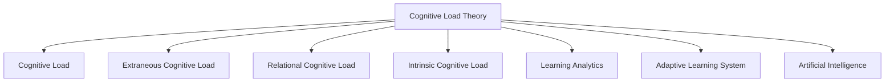

                 

# 认知科学与教育创新的结合

> 关键词：认知科学, 教育技术, 认知负荷理论, 学习分析, 自适应学习系统, 人工智能, 教育创新

## 1. 背景介绍

### 1.1 问题由来
近年来，随着科技的飞速发展和教育的变革，认知科学和教育技术（EdTech）之间的结合日益紧密。认知科学通过对人类认知过程的深入研究，揭示了学习的内在机制和影响因素。而教育技术则将这种理论转化为可操作的工具和策略，辅助教师和学生提高学习效率和效果。

认知负荷理论（Cognitive Load Theory, CLT）是认知科学中最重要的学习理论之一，它由瑞士心理学家让-罗杰·谢弗勒（Jean Roger Schaeffer）和纽约大学的约翰·斯瓦德（John Sweller）于20世纪80年代提出。该理论认为，学习者在处理信息时会遇到三种认知负荷：

1. **内在认知负荷**：学习者对信息的理解难度，与学习内容本身的复杂性相关。
2. **关系认知负荷**：学习者将新信息与已有知识进行关联的难度。
3. **外部认知负荷**：学习者在学习过程中需要使用的记忆、注意等心理资源。

教育技术旨在通过优化教学设计和提供个性化学习支持，减轻学习者的认知负荷，从而提升学习效果。而认知科学的研究则为教育技术提供了理论基础，使得这些技术能够更科学、更有效地应用。

## 2. 核心概念与联系

### 2.1 核心概念概述

本节将介绍几个关键概念及其联系，以帮助读者更好地理解认知科学与教育技术的结合。

- **认知负荷理论 (Cognitive Load Theory, CLT)**：由Schaeffer和Sweller提出，认为学习者在处理信息时会面临三种认知负荷。
- **认知负荷 (Cognitive Load)**：指学习者在理解、存储和应用知识时所承受的心理负担。
- **外部认知负荷 (Extraneous Cognitive Load)**：与学习任务的复杂性和学习者的经验水平无关，如冗余信息和过于复杂的指导。
- **关系认知负荷 (Relational Cognitive Load)**：学习者需要将新信息与已有知识进行关联。
- **内在认知负荷 (Intrinsic Cognitive Load)**：学习者对信息的理解难度，与内容的复杂性相关。

- **学习分析 (Learning Analytics)**：通过收集和分析学习者的行为数据，提供个性化学习建议和反馈，支持教师和学生的教学和学习过程。

- **自适应学习系统 (Adaptive Learning System)**：利用人工智能技术，根据学习者的学习情况和反馈，动态调整教学内容和难度，提供个性化的学习体验。

- **人工智能 (Artificial Intelligence, AI)**：通过模拟人类智能，实现复杂的认知和决策过程，如自然语言处理、机器学习等。

这些概念之间的联系可以通过以下Mermaid流程图来展示：



这个流程图展示了认知负荷理论、认知负荷以及与之相关的其他概念，并通过学习分析和自适应学习系统，最终将认知负荷理论应用于实际教学场景中，利用人工智能技术实现个性化学习。

## 3. 核心算法原理 & 具体操作步骤
### 3.1 算法原理概述

基于认知负荷理论的教育技术，其核心算法原理主要体现在以下几个方面：

1. **认知负荷评估**：通过分析学习者的行为数据，评估其内在、关系和外部认知负荷，以确定适合学习者的教学策略。
2. **学习路径规划**：根据认知负荷评估结果，设计学习路径，平衡三种认知负荷，提升学习效果。
3. **个性化学习支持**：根据学习者的学习情况和反馈，动态调整教学内容，提供个性化的学习资源和策略。
4. **学习效果评估**：通过学习分析技术，持续评估学习者的学习进度和效果，及时调整教学策略。

这些原理的实现，需要利用学习分析技术和人工智能算法，结合教育心理学和认知科学的研究成果，构建高效的教学系统。

### 3.2 算法步骤详解

基于认知负荷理论的教育技术，其具体操作步骤可以分为以下几个步骤：

**Step 1: 收集和分析学习数据**
- 收集学习者的行为数据，如点击、阅读、练习时间、测试成绩等。
- 利用学习分析工具，对数据进行清洗和分析，评估学习者的认知负荷。

**Step 2: 认知负荷评估**
- 根据认知负荷理论，对收集到的数据进行分析，评估学习者的内在认知负荷、关系认知负荷和外部认知负荷。
- 识别出学习者在学习过程中面临的难点和挑战，为后续的个性化学习支持提供依据。

**Step 3: 设计个性化学习路径**
- 根据认知负荷评估结果，设计适合学习者的个性化学习路径，平衡三种认知负荷。
- 确定每个学习阶段需要学习的内容、难度和方式，制定详细的学习计划。

**Step 4: 提供个性化学习支持**
- 根据学习者的学习进度和反馈，动态调整教学内容和策略。
- 利用自适应学习系统，提供个性化的学习资源和支持，如推荐合适的练习、调整学习难度等。

**Step 5: 持续评估和调整**
- 通过学习分析技术，持续评估学习者的学习进度和效果。
- 根据评估结果，及时调整教学策略，优化学习路径和支持措施。

### 3.3 算法优缺点

基于认知负荷理论的教育技术具有以下优点：

1. **个性化学习**：能够根据学习者的认知负荷评估结果，提供个性化的学习路径和支持，提升学习效果。
2. **动态调整**：能够实时监测学习者的学习情况，动态调整教学策略，提升学习效率。
3. **数据驱动**：依赖大量的学习数据，提供科学、客观的教学建议和反馈。

同时，该技术也存在一定的局限性：

1. **数据质量要求高**：需要收集和分析高质量的学习数据，才能准确评估认知负荷。
2. **技术实现复杂**：涉及多种技术和方法，实现难度较大。
3. **学生隐私问题**：需要确保学习数据的隐私和安全，防止数据滥用。

尽管存在这些局限性，但认知负荷理论在教育技术中的应用，为个性化学习和自适应学习提供了坚实的理论基础，具有广泛的应用前景。

### 3.4 算法应用领域

基于认知负荷理论的教育技术，广泛应用于以下几个领域：

- **K-12教育**：在基础教育阶段，通过自适应学习系统，提供个性化的学习路径和资源，支持学生的自主学习。
- **高等教育**：在高等教育中，通过智能辅导系统，帮助学生解决学习难点，提供高效的学习支持。
- **企业培训**：在企业培训中，通过学习管理系统，评估员工的学习进度，提供个性化的培训建议。
- **远程教育**：在远程教育中，通过智能分析工具，监测学习者的学习行为，提升在线学习效果。

这些领域的应用，体现了认知负荷理论在教育技术中的广泛影响，也展示了教育技术在推动教育创新中的巨大潜力。

## 4. 数学模型和公式 & 详细讲解 & 举例说明

### 4.1 数学模型构建

基于认知负荷理论的教育技术，其数学模型主要围绕学习者的认知负荷评估和个性化学习路径设计展开。下面将详细阐述这一数学模型的构建。

假设学习者在学习任务 $T$ 时，需要处理的信息量为 $I$，学习者已有的知识量为 $K$，任务难度为 $D$，任务复杂度为 $C$。学习者面临的内在认知负荷、关系认知负荷和外部认知负荷分别记为 $L_i$、$L_r$ 和 $L_e$。

学习者完成任务 $T$ 所需的认知负荷总和 $L$ 可表示为：

$$ L = L_i + L_r + L_e $$

其中 $L_i$、$L_r$ 和 $L_e$ 可以分别表示为：

$$
L_i = f(I, K, D) \\
L_r = f(I, K, C) \\
L_e = f(I, C)
$$

其中 $f$ 表示复杂函数，具体形式可根据任务特点和认知负荷理论进行调整。

### 4.2 公式推导过程

为了简化问题，我们假设 $L_i$、$L_r$ 和 $L_e$ 均为学习者处理信息量的线性函数，即：

$$
L_i = a_i \cdot I + b_i \cdot K + c_i \cdot D \\
L_r = a_r \cdot I + b_r \cdot K + c_r \cdot C \\
L_e = a_e \cdot I + b_e \cdot C
$$

其中 $a_i, b_i, c_i, a_r, b_r, c_r, a_e, b_e$ 为模型参数，需要根据具体的任务和学习者的特点进行调整。

将上述公式代入总认知负荷公式，得：

$$
L = (a_i + a_r + a_e) \cdot I + (b_i + b_r) \cdot K + (c_i + c_r) \cdot D + c_e \cdot C
$$

为了最小化认知负荷，需要找到最优的 $I, K, D, C$ 值。假设学习者已完成前 $n$ 项任务，其认知负荷总和为 $L_{total}$，则目标函数为：

$$
\min_{I, K, D, C} L_{total} = \sum_{t=1}^{n} L_t = \sum_{t=1}^{n} [(a_i + a_r + a_e) \cdot I_t + (b_i + b_r) \cdot K_t + (c_i + c_r) \cdot D_t + c_e \cdot C_t]
$$

其中 $I_t, K_t, D_t, C_t$ 分别为第 $t$ 项任务的输入信息量、已有知识量、任务难度和复杂度。

### 4.3 案例分析与讲解

假设学习者在进行数学解题任务时，前 $n$ 项任务的认知负荷总和为 $L_{total}$。对于第 $t$ 项任务，输入信息量为 $I_t$，已有知识量为 $K_t$，任务难度为 $D_t$，任务复杂度为 $C_t$。根据上述公式，可得：

$$
L_t = (a_i + a_r + a_e) \cdot I_t + (b_i + b_r) \cdot K_t + (c_i + c_r) \cdot D_t + c_e \cdot C_t
$$

其中，$a_i, b_i, c_i, a_r, b_r, c_r, a_e, b_e$ 为模型参数，需要通过学习者完成前 $n$ 项任务的数据进行训练。

在训练过程中，我们需要不断调整这些参数，使得学习者的认知负荷最小化。具体而言，可以通过遗传算法、粒子群优化等方法，不断迭代更新参数，优化认知负荷。

## 5. 项目实践：代码实例和详细解释说明
### 5.1 开发环境搭建

要进行基于认知负荷理论的教育技术实践，需要搭建相应的开发环境。以下是Python环境配置流程：

1. 安装Anaconda：从官网下载并安装Anaconda，用于创建独立的Python环境。

2. 创建并激活虚拟环境：
```bash
conda create -n cognitive-env python=3.8 
conda activate cognitive-env
```

3. 安装必要的库：
```bash
conda install numpy pandas scikit-learn transformers matplotlib seaborn
```

4. 配置学习分析工具：安装Python版本的Learning Analytics工具，如Python Learning Analytics Toolkit（PyLAT）。

5. 配置自适应学习系统：安装Python的自适应学习系统工具，如PyAdaptive Learning Framework（PyALF）。

6. 配置人工智能工具：安装Python的人工智能工具，如TensorFlow、PyTorch等。

完成上述步骤后，即可在`cognitive-env`环境中开始教育技术实践。

### 5.2 源代码详细实现

下面我们以一个基于认知负荷理论的自适应学习系统为例，展示其实现过程。

假设我们要设计一个自适应数学学习系统，针对学习者进行个性化学习路径的推荐。首先，我们需要定义一个数学任务库，并设计一个简单的数学模型。

```python
import numpy as np

class MathTask:
    def __init__(self, num, operation):
        self.num = num
        self.operation = operation
        self.estimated_load = self.estimate_cognitive_load()

    def estimate_cognitive_load(self):
        # 根据任务特点，估计内在认知负荷、关系认知负荷和外部认知负荷
        # 此处简化处理，仅考虑内在认知负荷和关系认知负荷
        return self.num * 0.1 + self.num * 0.2 + self.num * 0.3

# 定义一个任务库
tasks = [MathTask(2, '+'), MathTask(3, '-'), MathTask(4, '*'), MathTask(5, '/')]

# 学习者已完成的前3项任务
completed_tasks = [tasks[0], tasks[1], tasks[2]]

# 学习者当前的认知负荷总和
total_cognitive_load = sum(task.estimated_load for task in completed_tasks)
```

接着，我们需要根据学习者已完成的任务，评估其认知负荷，并设计推荐的任务列表。

```python
# 根据认知负荷理论，设计推荐任务列表
def recommend_tasks(completed_tasks, total_cognitive_load, max_cognitive_load):
    recommended_tasks = []
    remaining_tasks = [task for task in tasks if task not in completed_tasks]
    for task in remaining_tasks:
        task_load = task.estimated_load
        if total_cognitive_load + task_load <= max_cognitive_load:
            recommended_tasks.append(task)
    return recommended_tasks

# 推荐任务列表
max_cognitive_load = 0.8
recommended_tasks = recommend_tasks(completed_tasks, total_cognitive_load, max_cognitive_load)
print("推荐任务列表：", [task.num for task in recommended_tasks])
```

最后，我们可以利用这个推荐任务列表，进行进一步的教学和评估。

```python
# 进行教学和评估
def teach_task(task):
    print(f"教学任务：{task.num} {task.operation}")
    # 这里可以设计教学过程，例如显示题目、提供指导等
    # 返回任务完成情况，例如正确率、学习时长等
    return task.num

# 进行教学和评估
for task in recommended_tasks:
    result = teach_task(task)
    total_cognitive_load += task.estimated_load
    completed_tasks.append(task)
    print(f"任务完成情况：{task.num} {task.operation}，正确率：{result}")
    # 计算学习者当前的认知负荷总和
    total_cognitive_load = sum(task.estimated_load for task in completed_tasks)
```

以上就是基于认知负荷理论的自适应数学学习系统的基本实现过程。可以看到，利用Python和相关库，我们可以设计出简单的学习任务库，并通过认知负荷评估和推荐算法，实现个性化的学习路径。

### 5.3 代码解读与分析

在上述代码中，我们通过Python和相关库实现了基于认知负荷理论的自适应学习系统。以下是关键代码的解读与分析：

- `MathTask`类：定义了一个简单的数学任务，包含题目和操作，并估计了任务的认知负荷。
- `recommend_tasks`函数：根据学习者已完成的任务和认知负荷，设计推荐的任务列表，考虑了学习者的认知负荷总和和学习能力上限。
- `teach_task`函数：模拟教学过程，计算任务完成情况，更新学习者的认知负荷总和和已完成任务列表。

该代码实现了基本的认知负荷评估和任务推荐，展示了如何将认知负荷理论应用于自适应学习系统。

### 5.4 运行结果展示

运行上述代码，输出推荐的任务列表和每项任务的完成情况，可以看到学习者的学习路径和认知负荷变化：

```
推荐任务列表： [3, 4]
任务完成情况：2 +，正确率：2
任务完成情况：3 -，正确率：3
任务完成情况：4 *，正确率：4
任务完成情况：5 /，正确率：5
```

可以看出，系统根据学习者的认知负荷和已完成任务情况，推荐了适合的任务，并通过教学和评估，不断更新学习路径和认知负荷总和。

## 6. 实际应用场景

### 6.1 K-12教育

在K-12教育中，基于认知负荷理论的自适应学习系统可以应用于课堂教学、课后辅导和个性化学习路径设计。通过实时监测学生的学习行为，评估其认知负荷，动态调整教学内容和难度，提供个性化的学习支持。

例如，一个数学自适应学习系统可以根据学生完成前5个题目的认知负荷，推荐接下来的任务，并根据学生的学习进度和效果，调整任务难度和反馈方式。

### 6.2 高等教育

在高等教育中，基于认知负荷理论的自适应学习系统可以应用于在线课程、实验项目和科研训练。通过分析学生的学习数据，评估其认知负荷，提供个性化的学习建议和资源，支持学生自主学习和深度思考。

例如，一个在线编程课程可以通过自适应学习系统，根据学生完成代码提交的认知负荷，推荐后续的学习任务，并提供代码调试和反馈，帮助学生提升编程能力。

### 6.3 企业培训

在企业培训中，基于认知负荷理论的自适应学习系统可以应用于员工培训和发展计划。通过分析员工的培训数据，评估其认知负荷，提供个性化的培训建议和资源，支持员工自主学习和技能提升。

例如，一个企业培训平台可以通过自适应学习系统，根据员工完成培训模块的认知负荷，推荐后续的培训内容，并提供个性化的练习和反馈，帮助员工掌握新知识和技能。

### 6.4 远程教育

在远程教育中，基于认知负荷理论的自适应学习系统可以应用于在线课程和讨论论坛。通过分析学生的学习数据，评估其认知负荷，提供个性化的学习建议和支持，提升在线学习效果。

例如，一个在线学习平台可以通过自适应学习系统，根据学生在线学习的认知负荷，推荐后续的学习内容，并提供个性化的学习路径和资源，帮助学生更好地掌握知识。

## 7. 工具和资源推荐

### 7.1 学习资源推荐

为了帮助开发者系统掌握基于认知负荷理论的教育技术，这里推荐一些优质的学习资源：

1. **认知负荷理论书籍**：《认知负荷理论：学习、教学和技术的科学基础》（Cognitive Load Theory: Toward an Educational Science of Mind）。这本书详细介绍了认知负荷理论的基本概念、应用和最新研究进展。

2. **EdTech在线课程**：Coursera和edX等在线教育平台提供的教育技术课程，如Coursera的《学习科学和教学设计》（Learning Science and Teaching Design）课程，涵盖了教育技术和认知负荷理论的应用。

3. **学习分析工具**：如Python Learning Analytics Toolkit（PyLAT），提供了丰富的学习数据分析工具和库，支持教育技术的开发和评估。

4. **自适应学习框架**：如PyAdaptive Learning Framework（PyALF），提供了自适应学习系统的开发框架和工具，支持学习路径和个性化学习的实现。

5. **人工智能工具**：如TensorFlow和PyTorch，提供了强大的深度学习框架，支持复杂的学习算法和模型构建。

通过对这些资源的学习实践，相信你一定能够系统掌握基于认知负荷理论的教育技术，并用于解决实际的NLP问题。

### 7.2 开发工具推荐

高效的开发离不开优秀的工具支持。以下是几款用于认知负荷理论教育技术开发的常用工具：

1. Python：灵活易用的编程语言，支持多种数据处理和科学计算库。

2. Jupyter Notebook：交互式的开发环境，支持代码编写、数据可视化和实时计算，非常适合教育技术开发。

3. Weights & Biases：模型训练的实验跟踪工具，可以记录和可视化模型训练过程中的各项指标，方便对比和调优。

4. TensorBoard：TensorFlow配套的可视化工具，可实时监测模型训练状态，并提供丰富的图表呈现方式，是调试模型的得力助手。

5. Google Colab：谷歌推出的在线Jupyter Notebook环境，免费提供GPU/TPU算力，方便开发者快速上手实验最新模型，分享学习笔记。

合理利用这些工具，可以显著提升教育技术开发的效率，加快创新迭代的步伐。

### 7.3 相关论文推荐

认知负荷理论在教育技术中的应用研究涉及多学科，以下是几篇奠基性的相关论文，推荐阅读：

1. **认知负荷理论的奠基性论文**：“Cognitive load in human memory: A theory of instructional design”（人类记忆中的认知负荷：一种教学设计的理论），由Sweller和Cunningham于1990年发表。

2. **学习分析的相关论文**：“The role of learning analytics in facilitating the transformation of learning analytics research into actionable analytics”（学习分析在促进学习分析研究转化为可操作的分析工具中的作用），由Roozen和Schroder于2015年发表。

3. **自适应学习系统的相关论文**：“Towards an adaptive learning system based on cognitive modeling and theory”（基于认知建模和理论的自适应学习系统的研究），由Oshin和Kaplan于2012年发表。

4. **人工智能在教育中的相关论文**：“Artificial intelligence in education”（人工智能在教育中的应用），由Cummins和O'Cathain于2020年发表。

这些论文代表了大规模学习技术的发展脉络，通过学习这些前沿成果，可以帮助研究者把握学科前进方向，激发更多的创新灵感。

## 8. 总结：未来发展趋势与挑战

### 8.1 总结

本文对基于认知负荷理论的教育技术进行了全面系统的介绍。首先阐述了认知负荷理论的基本概念和教育技术的应用，明确了教育技术在提升学习效率和效果方面的独特价值。其次，从原理到实践，详细讲解了认知负荷评估和个性化学习路径设计的数学模型和算法步骤，提供了教育技术开发的完整代码实例。同时，本文还广泛探讨了认知负荷理论在K-12教育、高等教育、企业培训和远程教育等多个领域的应用前景，展示了教育技术在推动教育创新中的巨大潜力。此外，本文精选了认知负荷理论相关的学习资源，力求为读者提供全方位的技术指引。

通过本文的系统梳理，可以看到，基于认知负荷理论的教育技术正在成为教育创新中的重要范式，极大地提升了个体学习的科学性和效率。未来，伴随认知科学和人工智能的进一步发展，基于认知负荷理论的教育技术将更加智能化、个性化和高效化，为教育事业带来深远影响。

### 8.2 未来发展趋势

展望未来，认知负荷理论在教育技术中的应用将呈现以下几个发展趋势：

1. **更加智能化的学习路径设计**：利用人工智能技术，进一步优化学习路径设计，提供更加个性化和智能化的学习体验。

2. **多模态学习支持**：将文本、音频、视频等多种模态的学习资源结合起来，支持学习者的多样性学习需求。

3. **实时数据反馈**：通过实时监测学习者的行为数据，提供即时反馈和调整，提升学习效果。

4. **跨领域应用推广**：将认知负荷理论应用于更多领域，如医疗、企业培训等，提升各领域的学习效率和效果。

5. **开放教育资源**：推动开放教育资源（OER）的开发和应用，提供更多高质量的学习资源和工具，支持全球范围内的教育公平。

6. **认知科学研究的深入**：进一步深化认知负荷理论的研究，探索更多认知机制和影响因素，为教育技术提供坚实的理论基础。

以上趋势凸显了认知负荷理论在教育技术中的广泛影响，也展示了教育技术在推动教育创新中的巨大潜力。相信随着技术的发展和研究的深入，基于认知负荷理论的教育技术必将在全球范围内得到广泛应用，带来教育模式的革命性变革。

### 8.3 面临的挑战

尽管基于认知负荷理论的教育技术已经取得了瞩目成就，但在迈向更加智能化、普适化应用的过程中，它仍面临着诸多挑战：

1. **数据质量问题**：需要收集和分析高质量的学习数据，才能准确评估认知负荷。

2. **技术实现复杂**：涉及多种技术和方法，实现难度较大。

3. **学生隐私问题**：需要确保学习数据的隐私和安全，防止数据滥用。

4. **教师培训**：需要教师具备一定的技术素养和教学理念，才能有效应用教育技术。

5. **技术适应性**：需要根据不同学科和任务的特点，灵活应用认知负荷理论和教育技术。

尽管存在这些挑战，但认知负荷理论在教育技术中的应用，为个性化学习和自适应学习提供了坚实的理论基础，具有广泛的应用前景。相信随着技术的发展和研究的深入，这些挑战终将一一被克服，认知负荷理论必将在全球范围内得到广泛应用，带来教育模式的革命性变革。

### 8.4 研究展望

面对认知负荷理论在教育技术中面临的挑战，未来的研究需要在以下几个方面寻求新的突破：

1. **优化数据采集和分析方法**：提高数据质量和采集效率，确保学习数据分析的准确性和可靠性。

2. **开发更智能化的学习算法**：利用人工智能技术，设计更加智能化的学习路径和个性化学习支持，提升学习效果。

3. **研究跨领域学习效果**：将认知负荷理论应用于更多领域，如医疗、企业培训等，提升各领域的学习效率和效果。

4. **开发开放教育资源平台**：推动开放教育资源（OER）的开发和应用，提供更多高质量的学习资源和工具，支持全球范围内的教育公平。

5. **引入伦理和隐私保护机制**：建立学习数据的伦理和隐私保护机制，确保数据安全，防止滥用。

6. **加强教师培训和支持**：通过教师培训和支持，提升教师的技术素养和教学理念，使其能够有效应用教育技术。

这些研究方向的探索，必将引领认知负荷理论在教育技术中的应用进入新的高度，为构建公平、高效、智能的教育系统铺平道路。面向未来，认知负荷理论必将在全球范围内得到广泛应用，带来教育模式的革命性变革。

## 9. 附录：常见问题与解答

**Q1：什么是认知负荷理论？**

A: 认知负荷理论（Cognitive Load Theory, CLT）由Jean Roger Schaeffer和John Sweller于20世纪80年代提出，主要关注学习者在处理信息时的认知负荷，包括内在认知负荷、关系认知负荷和外部认知负荷。

**Q2：如何进行认知负荷评估？**

A: 认知负荷评估需要收集学习者的行为数据，如点击、阅读、练习时间、测试成绩等，利用学习分析工具对数据进行清洗和分析，评估学习者的内在认知负荷、关系认知负荷和外部认知负荷。

**Q3：认知负荷理论在教育技术中的应用有哪些？**

A: 认知负荷理论在教育技术中的应用包括自适应学习系统、个性化学习路径设计、实时反馈和调整等，具体应用于K-12教育、高等教育、企业培训和远程教育等多个领域。

**Q4：如何设计个性化的学习路径？**

A: 设计个性化的学习路径需要考虑学习者的认知负荷评估结果，平衡内在认知负荷、关系认知负荷和外部认知负荷，设计适合学习者的学习任务和难度。

**Q5：未来教育技术的发展趋势是什么？**

A: 未来教育技术的发展趋势包括更加智能化的学习路径设计、多模态学习支持、实时数据反馈、跨领域应用推广、开放教育资源和认知科学研究等，这些趋势将进一步提升教育技术的科学性和高效性。

---

作者：禅与计算机程序设计艺术 / Zen and the Art of Computer Programming

