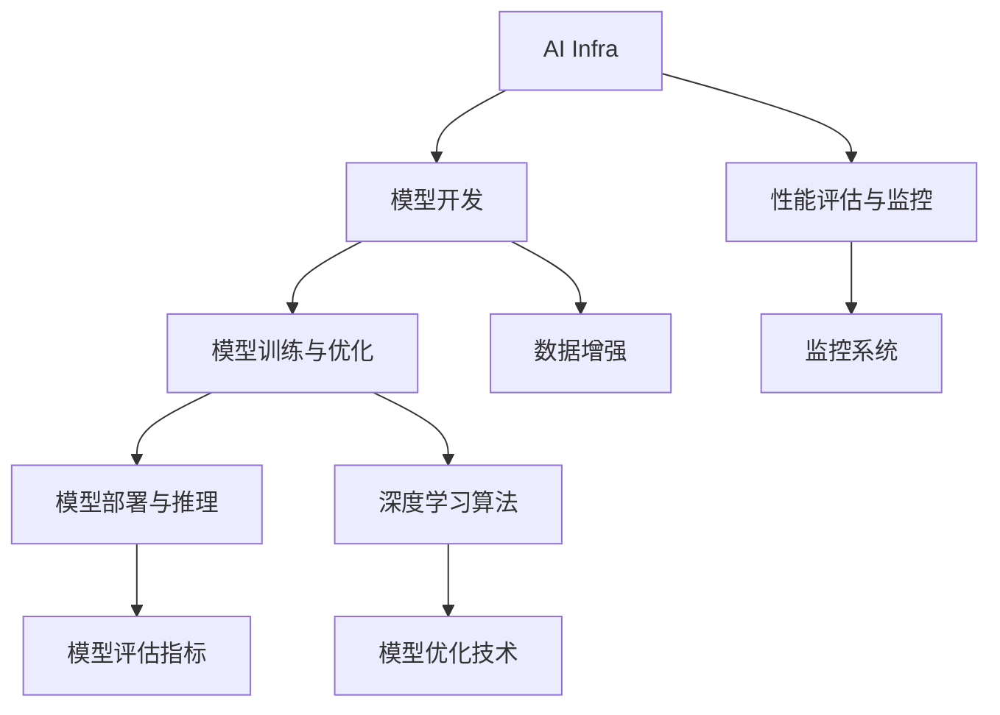

                 

# 讲好AI infra故事：贾扬清的策略，通过产品展示实力与品牌建设

## 1. 背景介绍

在AI与技术飞速发展的今天，如何构建一个具有竞争力的AI基础设施（AI Infra），成为了众多AI公司的重要课题。贾扬清博士作为DeepLearning领域的领军人物，他领导的微软亚洲研究院AI基础设施组近年来在AI Infra建设方面，从深度学习算法、模型优化、模型训练、以及性能评估等多方面进行深入研究，并通过一系列高质量产品实现了AI模型的快速迭代与高效部署，成功展示了微软在AI Infra方面的实力与品牌建设成果。

本文将从背景、核心概念、算法原理、操作步骤、实际应用、工具资源推荐、未来趋势与挑战等方面，全面介绍微软AI基础设施组在AI Infra领域的技术积累与实践经验，希望能给更多AI开发者带来有价值的参考与启示。

## 2. 核心概念与联系

### 2.1 核心概念概述

- **AI基础设施（AI Infra）**：AI基础设施是一个综合性的技术框架，涵盖模型开发、训练、优化、部署、评估等各个环节。AI Infra不仅提供了模型训练与部署的底层技术支持，还包括模型评估、性能监控、模型生命周期管理等重要功能，是实现AI模型落地应用的基础。

- **深度学习模型优化**：在深度学习模型训练过程中，如何利用算法优化、硬件加速、数据增强等手段提升模型性能，是AI Infra建设的重要组成部分。

- **模型训练与推理**：通过高性能计算框架与硬件加速技术，实现模型的快速迭代训练与高效推理部署。

- **性能评估与监控**：构建全面的模型性能评估指标体系与监控系统，及时发现与解决模型在生产环境中的性能问题。

### 2.2 核心概念原理和架构的 Mermaid 流程图



## 3. 核心算法原理 & 具体操作步骤

### 3.1 算法原理概述

AI基础设施组在AI Infra建设中，综合运用了深度学习算法、模型优化技术、分布式计算等关键技术。基于这些技术，构建了包括模型训练、推理、评估、监控等在内的全栈AI Infra体系，实现了AI模型的快速迭代与高效部署。

- **深度学习算法**：AI Infra组自研了包括模型蒸馏、知识蒸馏、注意力机制等深度学习算法，提升模型性能与泛化能力。
- **模型优化技术**：包括剪枝、量化、稀疏化等技术，提升模型推理速度与存储效率。
- **分布式计算**：通过构建分布式训练框架与模型调度系统，实现大规模模型的快速训练与推理。

### 3.2 算法步骤详解

AI Infra组的AI Infra建设包括以下关键步骤：

**Step 1: 确定AI Infra需求**

在AI Infra建设前，首先需要明确项目需求，包括模型种类、数据规模、硬件配置、模型性能指标等。根据需求，选择适合的硬件平台与优化技术。

**Step 2: 构建AI Infra架构**

根据需求，选择与优化深度学习算法与模型优化技术，构建AI Infra核心架构。其中主要包括：

- **模型训练与推理框架**：如TensorFlow、PyTorch等，提供模型开发与部署支持。
- **分布式计算框架**：如Horovod、Spark等，支持大规模模型的分布式训练。
- **模型优化技术**：如剪枝、量化、稀疏化等，提升模型推理速度与存储效率。

**Step 3: 实施AI Infra建设**

根据需求与架构，实施AI Infra建设，包括模型训练、优化、部署、评估等各个环节。其中关键步骤如下：

- **模型训练**：选择合适的硬件平台与优化技术，使用分布式计算框架进行模型训练。
- **模型优化**：基于模型蒸馏、剪枝、量化等技术对模型进行优化，提升模型性能与推理速度。
- **模型部署与推理**：使用优化后的模型进行推理部署，构建高性能推理环境。
- **模型评估与监控**：构建模型评估指标与监控系统，实时监控模型性能与稳定性。

### 3.3 算法优缺点

AI Infra组的AI Infra建设有以下优点：

- **快速迭代**：基于深度学习算法与模型优化技术，可以快速训练与部署高性能模型。
- **高效部署**：使用分布式计算与优化技术，实现大规模模型的快速迭代与高效推理部署。
- **全面评估**：构建全面的模型性能评估与监控体系，及时发现与解决模型性能问题。

同时，AI Infra建设也存在以下缺点：

- **技术复杂**：构建AI Infra需要综合运用多种深度学习算法与优化技术，技术难度较大。
- **资源消耗**：构建大规模分布式AI Infra需要大量的硬件资源与计算能力，成本较高。

### 3.4 算法应用领域

AI Infra组通过AI Infra建设，成功应用于多种NLP、CV、推荐系统等领域的AI模型开发与部署。例如：

- **NLP领域**：构建大规模的BERT、GPT等模型，并应用于问答、文本生成、情感分析等任务。
- **CV领域**：开发高效的目标检测与图像分割算法，应用于人脸识别、图像检索等场景。
- **推荐系统**：使用深度学习算法与优化技术，提升推荐模型的性能与效率。

## 4. 数学模型和公式 & 详细讲解 & 举例说明

### 4.1 数学模型构建

AI Infra组在构建AI Infra过程中，针对不同的模型与任务，构建了不同的数学模型。以BERT模型为例，其构建的数学模型如下：

- **输入层**：将输入文本通过Word Embedding转化为向量形式。
- **Transformer层**：通过多层的自注意力机制，提取文本的语义特征。
- **全连接层**：通过全连接层进行特征融合与分类，输出预测结果。

### 4.2 公式推导过程

以BERT模型的Transformer层为例，公式推导如下：

$$
\text{Self-Attention}(Q, K, V) = \text{Softmax}(\frac{QK^T}{\sqrt{d_k}})V
$$

其中，$Q, K, V$ 分别表示查询、键、值矩阵，$d_k$ 为向量维度。该公式通过计算查询矩阵 $Q$ 与键矩阵 $K$ 的点积，得到注意力权重，并乘以值矩阵 $V$，得到最终的注意力向量。

### 4.3 案例分析与讲解

以BERT模型为例，通过使用分布式计算框架与优化技术，AI Infra组实现了大规模模型的快速训练与高效推理部署。具体步骤如下：

- **分布式训练**：使用Horovod分布式训练框架，在多台机器上并行训练BERT模型，加快训练速度。
- **剪枝与量化**：通过剪枝与量化技术，优化模型参数与推理速度，提升模型性能。
- **模型部署**：将优化后的模型部署到生产环境，使用TensorFlow或PyTorch推理引擎进行高效推理。

## 5. 项目实践：代码实例和详细解释说明

### 5.1 开发环境搭建

在AI Infra建设中，开发环境搭建至关重要。AI Infra组使用Azure云平台搭建了全栈的AI Infra系统，包括计算、存储、网络、安全等多个方面。具体步骤如下：

1. **计算资源**：使用Azure提供的虚拟机与GPU资源，构建高性能计算环境。
2. **存储资源**：使用Azure Blob Storage与Azure File Storage，存储模型数据与训练日志。
3. **网络配置**：配置VNet与子网，实现网络隔离与安全访问。
4. **安全设置**：使用Azure Active Directory进行身份认证与授权，实现访问控制。

### 5.2 源代码详细实现

以BERT模型的分布式训练为例，以下是使用TensorFlow的代码实现：

```python
import tensorflow as tf
from horovod.tensorflow.keras import Horovod

# 初始化Horovod
hvd.init()
rank = hvd.rank()

# 构建模型
model = tf.keras.Sequential([
    tf.keras.layers.Embedding(input_dim=vocab_size, output_dim=embedding_dim),
    tf.keras.layers.Bidirectional(tf.keras.layers.LSTM(units=hidden_units)),
    tf.keras.layers.Dense(units=num_classes, activation='softmax')
])

# 分布式训练
model.compile(optimizer=tf.keras.optimizers.Adam(), loss='categorical_crossentropy', metrics=['accuracy'])
model.fit(x_train, y_train, epochs=num_epochs, batch_size=batch_size, verbose=1)
```

### 5.3 代码解读与分析

以上代码实现中，关键步骤如下：

- **Horovod初始化**：使用Horovod进行分布式训练，实现多台机器并行训练。
- **模型构建**：使用TensorFlow的Sequential模型，构建BERT模型的不同层次。
- **模型编译**：设置优化器与损失函数，编译模型进行分布式训练。
- **模型训练**：使用fit函数进行分布式训练，并在每个epoch输出训练日志。

## 6. 实际应用场景

### 6.1 智能客服系统

AI Infra组通过构建高性能AI Infra，成功应用于智能客服系统的开发。具体实现步骤如下：

1. **需求分析**：分析客服系统的需求，包括用户对话、问题解答、情感分析等。
2. **模型选择**：选择适合的知识图谱与推荐系统模型，进行知识抽取与对话生成。
3. **模型训练**：使用分布式计算框架进行模型训练，优化模型性能与推理速度。
4. **模型部署**：将优化后的模型部署到生产环境，使用推理引擎进行高效推理。

### 6.2 金融舆情监测

AI Infra组通过构建高性能AI Infra，成功应用于金融舆情监测系统。具体实现步骤如下：

1. **需求分析**：分析舆情监测系统的需求，包括实时数据采集、情感分析、风险预警等。
2. **模型选择**：选择适合的情感分析与风险预警模型，进行情感识别与舆情预警。
3. **模型训练**：使用分布式计算框架进行模型训练，优化模型性能与推理速度。
4. **模型部署**：将优化后的模型部署到生产环境，使用推理引擎进行高效推理。

### 6.3 个性化推荐系统

AI Infra组通过构建高性能AI Infra，成功应用于个性化推荐系统。具体实现步骤如下：

1. **需求分析**：分析推荐系统的需求，包括用户行为数据、推荐模型、推荐策略等。
2. **模型选择**：选择适合的协同过滤与深度学习模型，进行推荐算法优化与推荐策略设计。
3. **模型训练**：使用分布式计算框架进行模型训练，优化模型性能与推理速度。
4. **模型部署**：将优化后的模型部署到生产环境，使用推理引擎进行高效推理。

## 7. 工具和资源推荐

### 7.1 学习资源推荐

为了帮助开发者系统掌握AI Infra的理论基础与实践技巧，AI Infra组推荐以下学习资源：

1. **《深度学习基础》课程**：斯坦福大学开设的深度学习入门课程，涵盖深度学习的基本概念与算法。
2. **《TensorFlow实战》书籍**：TensorFlow官方提供的实战指南，详细介绍TensorFlow的开发与优化技术。
3. **《分布式计算》课程**：Coursera提供的分布式计算课程，涵盖分布式计算的基本原理与实践技巧。
4. **《模型优化与部署》书籍**：介绍深度学习模型的优化与部署技术，涵盖剪枝、量化、稀疏化等优化方法。
5. **GitHub项目**：AI Infra组在GitHub上发布的多个开源项目，提供丰富的代码实现与优化经验。

### 7.2 开发工具推荐

在AI Infra开发过程中，使用以下工具可以提高开发效率与模型性能：

1. **TensorFlow**：高性能深度学习框架，提供丰富的API与优化技术。
2. **PyTorch**：灵活的深度学习框架，支持分布式计算与模型优化。
3. **Horovod**：分布式训练框架，支持多种深度学习框架与优化技术。
4. **AWS SageMaker**：AWS提供的云AI平台，提供全栈AI Infra支持。
5. **Azure ML**：Azure提供的云AI平台，支持模型训练与部署。

### 7.3 相关论文推荐

AI Infra组在AI Infra建设过程中，结合多种前沿技术进行深度研究。以下是几篇代表性的相关论文：

1. **《分布式深度学习》论文**：介绍分布式深度学习的基本原理与技术，涵盖数据并行与模型并行。
2. **《模型蒸馏与剪枝》论文**：介绍深度学习模型的蒸馏与剪枝技术，提升模型性能与推理速度。
3. **《知识图谱与推荐系统》论文**：介绍知识图谱与推荐系统的主要算法与技术，提供多种推荐模型的实现。
4. **《金融舆情监测》论文**：介绍金融舆情监测系统的主要算法与技术，涵盖情感分析与风险预警。
5. **《个性化推荐系统》论文**：介绍个性化推荐系统的主要算法与技术，涵盖协同过滤与深度学习算法。

## 8. 总结：未来发展趋势与挑战

### 8.1 总结

AI Infra组通过构建高性能AI Infra，展示了其在AI模型训练与部署方面的强大实力与品牌建设成果。通过深入研究深度学习算法、模型优化技术、分布式计算等关键技术，构建了包括模型训练、推理、评估、监控等在内的全栈AI Infra体系，成功应用于多个AI领域。

AI Infra组在AI Infra建设过程中，注重产品展示与品牌建设，通过高质量的AI产品，展示了其在深度学习领域的领先地位与技术实力。同时，通过一系列高质量的论文与开源项目，为全球开发者提供了有价值的参考与借鉴。

### 8.2 未来发展趋势

未来，AI Infra组将继续在深度学习、模型优化、分布式计算等关键技术上深入研究，推动AI Infra的持续优化与升级。以下是未来可能的趋势：

1. **模型优化与量化**：进一步优化深度学习模型的量化与剪枝技术，提升模型推理速度与存储效率。
2. **分布式计算与边缘计算**：结合边缘计算技术，构建更高效、更灵活的AI Infra系统。
3. **跨平台与跨语言支持**：构建跨平台与跨语言的AI Infra系统，提升AI技术的普及与落地。
4. **AI伦理与安全**：构建AI伦理与安全监控体系，确保AI技术的安全与可信。

### 8.3 面临的挑战

尽管AI Infra组在AI Infra建设方面取得了显著成果，但在未来发展过程中，仍面临以下挑战：

1. **技术复杂性**：AI Infra的构建需要综合运用多种深度学习算法与优化技术，技术难度较大。
2. **资源消耗**：构建大规模分布式AI Infra需要大量的硬件资源与计算能力，成本较高。
3. **模型泛化能力**：如何在大规模数据集上训练高性能模型，并保证其泛化能力，仍是重要的研究课题。
4. **模型鲁棒性**：如何在对抗样本攻击下保证模型的鲁棒性，仍需进一步优化。

### 8.4 研究展望

未来，AI Infra组将从以下几个方面进行深入研究：

1. **分布式训练与优化**：研究分布式训练与优化技术，提升大规模模型的训练速度与优化效果。
2. **模型蒸馏与知识图谱**：研究模型蒸馏与知识图谱技术，提升模型的泛化能力与推理效率。
3. **边缘计算与联邦学习**：研究边缘计算与联邦学习技术，构建高效、灵活的AI Infra系统。
4. **AI伦理与安全**：研究AI伦理与安全技术，确保AI技术的可信与合规。

## 9. 附录：常见问题与解答

**Q1: 什么是AI基础设施（AI Infra）？**

A: AI基础设施（AI Infra）是一个综合性的技术框架，涵盖模型开发、训练、优化、部署、评估等各个环节。AI Infra不仅提供了模型训练与部署的底层技术支持，还包括模型评估、性能监控、模型生命周期管理等重要功能，是实现AI模型落地应用的基础。

**Q2: 如何构建高性能的AI Infra？**

A: 构建高性能的AI Infra需要综合运用多种深度学习算法与优化技术。具体步骤如下：

1. **需求分析**：明确项目需求，包括模型种类、数据规模、硬件配置、模型性能指标等。
2. **构建AI Infra架构**：选择与优化深度学习算法与模型优化技术，构建AI Infra核心架构。
3. **实施AI Infra建设**：根据需求与架构，实施AI Infra建设，包括模型训练、优化、部署、评估等各个环节。

**Q3: 使用分布式计算框架进行模型训练的好处有哪些？**

A: 使用分布式计算框架进行模型训练有以下好处：

1. **加速训练速度**：通过多台机器并行训练，可以显著加速模型训练速度。
2. **提高模型性能**：通过分布式计算，可以充分利用硬件资源，提升模型的训练效果与性能。
3. **优化资源利用率**：通过分布式计算，可以有效利用GPU资源，避免资源浪费。

**Q4: 分布式计算框架Horovod的作用是什么？**

A: 分布式计算框架Horovod的作用是在多台机器上进行并行训练，提高模型训练速度与性能。Horovod支持多种深度学习框架与优化技术，可以与其他分布式计算框架无缝集成。

**Q5: 如何构建高效的推理环境？**

A: 构建高效的推理环境需要综合运用多种优化技术，包括模型量化、剪枝、稀疏化等。具体步骤如下：

1. **模型量化**：将浮点模型转为定点模型，压缩存储空间，提高计算效率。
2. **剪枝与稀疏化**：去除不必要的层与参数，减小模型尺寸，加快推理速度。
3. **推理引擎**：选择合适的推理引擎，进行高效推理部署。

通过上述方法，可以构建高效、灵活的推理环境，满足AI模型的部署需求。

---

作者：禅与计算机程序设计艺术 / Zen and the Art of Computer Programming

