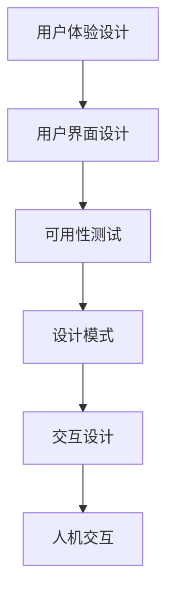

                 

# 设计更好的用户界面：增强用户体验

> 关键词：用户体验设计，用户界面设计，可用性测试，设计模式，交互设计，人机交互

## 1. 背景介绍

### 1.1 问题由来
随着科技的发展，人们对于软件和应用的使用变得越来越频繁，同时也对用户界面的交互体验提出了更高的要求。一个设计精良的用户界面（User Interface, UI）不仅能够提升用户的满意度，还能够显著提高应用的可用性和用户留存率。因此，良好的用户界面设计成为了提高产品竞争力和用户忠诚度的关键因素。

### 1.2 问题核心关键点
在实际开发中，用户界面设计往往被忽视，开发者往往更加关注技术的实现而非用户体验。然而，一个好的用户界面设计不仅仅是美观，更重要的是能够满足用户的需求，提升其使用效率和满意度。当前，关于用户界面设计的书籍和论文已经相当丰富，但仍然缺乏系统的、可操作的指导，尤其是如何在实际开发中应用这些理论知识。本文将通过具体的例子和案例，详细介绍用户界面设计的核心概念、方法和实践技巧，帮助开发者设计出更加优秀、用户友好的界面。

### 1.3 问题研究意义
优秀的用户界面设计不仅能够提高应用的可用性和用户满意度，还能够增加用户的粘性，提升品牌知名度。因此，在当前的软件开发中，如何设计一个优秀的用户界面成为了一项至关重要的任务。通过系统地学习并应用本文档提供的内容，开发者能够更好地理解用户需求，提升自身设计的水平，最终实现更加高效、美观且易用的界面设计。

## 2. 核心概念与联系

### 2.1 核心概念概述

为了更好地理解用户界面设计的原理和实践方法，本节将介绍几个关键的核心理念：

- 用户体验设计（User Experience Design, UXD）：通过研究用户的行为和需求，以提高产品的可用性和用户满意度为核心目标，设计出满足用户需求的界面。

- 用户界面设计（User Interface Design, UI）：聚焦于具体的界面元素和交互流程，通过合理布局和美观的视觉设计，提升用户的交互体验。

- 可用性测试（Usability Testing）：通过实际用户测试界面设计，评估其易用性和操作效率，不断优化设计。

- 设计模式（Design Pattern）：经典且可复用的界面设计方案，有助于提升设计的效率和效果。

- 交互设计（Interaction Design）：专注于用户与系统之间的互动过程，通过有效的界面交互机制，提升用户的使用体验。

- 人机交互（Human-Computer Interaction, HCI）：研究如何通过界面设计提升人机交互的效率和效果，关注用户的认知和情感。

这些核心概念之间的逻辑关系可以通过以下Mermaid流程图来展示：



这个流程图展示出用户界面设计的各个方面：

1. 从用户体验设计出发，研究用户需求。
2. 设计用户界面，通过布局和视觉设计，提升用户交互体验。
3. 通过可用性测试评估设计效果，不断优化。
4. 引入设计模式，提升设计效率和效果。
5. 设计交互流程，提升人机互动的效率和效果。

这些概念相互支持，共同构成了用户界面设计的核心框架。

## 3. 核心算法原理 & 具体操作步骤

### 3.1 算法原理概述

用户界面设计本质上是一种交互设计，其核心在于通过合理的设计元素和交互流程，提升用户的使用体验。一个好的用户界面设计不仅要美观，更要能够满足用户的需求，提升其使用效率和满意度。

用户界面设计的目标是构建一个高效、美观、易用的界面，具体可以通过以下步骤实现：

1. 研究用户需求：了解目标用户的需求和使用场景，明确设计目标。
2. 设计界面布局：通过合理的布局，使界面元素有序、清晰，提升用户的操作效率。
3. 设计视觉元素：通过美观的视觉设计，吸引用户注意力，提升用户的使用体验。
4. 设计交互流程：通过有效的交互机制，使用户能够快速、方便地完成任务。
5. 可用性测试：通过实际用户测试，评估设计的可用性，不断优化。

### 3.2 算法步骤详解

接下来，我们将详细介绍用户界面设计的详细步骤：

**Step 1: 研究用户需求**

研究用户需求是设计用户界面的重要前提。这一步需要通过访谈、问卷调查、用户画像等方式，了解目标用户的基本信息、使用场景、需求和使用习惯。

具体步骤包括：

1. 访谈目标用户：通过一对一的深度访谈，了解用户的基本需求和使用习惯。
2. 问卷调查：设计问卷，了解用户对不同界面设计方案的偏好和需求。
3. 用户画像：通过分析用户的基本信息、使用场景和使用习惯，构建用户画像，明确目标用户群体的特征。

**Step 2: 设计界面布局**

界面布局是用户界面设计的基础，好的布局能够提升用户的操作效率。这一步需要根据用户需求和使用习惯，合理布局界面元素，使其有序、清晰。

具体步骤包括：

1. 设计信息架构：通过信息架构图，明确界面中的信息层次和组织关系。
2. 布局界面元素：根据信息架构图，合理布局界面元素，使其有序、清晰。
3. 使用网格布局：使用网格布局技术，使界面元素对齐，提升视觉美感。

**Step 3: 设计视觉元素**

视觉设计是用户界面设计的重要组成部分，好的视觉设计能够吸引用户注意力，提升用户的使用体验。这一步需要根据用户需求和使用习惯，选择合适的颜色、字体、图标等视觉元素，提升界面的美观度和易用性。

具体步骤包括：

1. 设计颜色方案：选择合适的颜色方案，使其符合用户的心理预期，提升界面的可读性和美感。
2. 设计字体方案：选择合适的字体，使文字大小、颜色、间距等符合用户的阅读习惯，提升界面的可读性。
3. 设计图标方案：选择合适的主题图标，使其符合用户的视觉习惯，提升界面的美观度。

**Step 4: 设计交互流程**

交互流程是用户界面设计的核心，好的交互流程能够使用户能够快速、方便地完成任务。这一步需要根据用户需求和使用习惯，设计合理的交互机制，使其符合用户的操作习惯。

具体步骤包括：

1. 设计交互模型：根据用户的需求和使用场景，设计合理的交互模型，使界面元素能够响应用户的操作。
2. 设计反馈机制：根据用户的操作行为，设计合理的反馈机制，使用户能够了解操作结果，提升用户的使用体验。
3. 设计动画效果：使用动画效果，提升界面的视觉表现力和用户体验，同时避免干扰用户的注意力。

**Step 5: 可用性测试**

可用性测试是用户界面设计的最后一步，通过实际用户测试，评估设计的可用性和操作效率，不断优化。

具体步骤包括：

1. 设计测试任务：根据界面设计方案，设计测试任务，使用户能够进行实际测试。
2. 执行测试任务：邀请实际用户执行测试任务，记录用户的操作过程和结果。
3. 分析测试结果：分析测试结果，找出界面设计中的问题，提出改进方案。
4. 优化设计方案：根据测试结果，优化界面设计方案，不断提升用户体验。

### 3.3 算法优缺点

用户界面设计作为一种设计艺术，其优缺点如下：

**优点**

1. 提升用户满意度：通过合理的设计，能够满足用户需求，提升用户的使用体验。
2. 提高应用可用性：好的用户界面设计能够提高应用的可用性，减少用户的操作复杂度。
3. 提升用户留存率：设计良好的用户界面能够增加用户的粘性，提升用户留存率。
4. 提升品牌知名度：良好的用户界面设计能够提升品牌知名度，增加用户的认可度。

**缺点**

1. 设计周期长：用户界面设计需要不断迭代优化，周期较长。
2. 设计成本高：好的用户界面设计需要专业的设计团队，成本较高。
3. 设计难度大：用户界面设计需要综合考虑用户需求、技术实现等多个方面，难度较大。

尽管存在这些局限性，但良好的用户界面设计仍然是不可或缺的。通过不断迭代优化，我们可以设计出更加优秀、用户友好的界面，提升用户的满意度和应用的使用效率。

### 3.4 算法应用领域

用户界面设计在各个领域都有广泛应用，以下是一些常见的应用场景：

1. 移动互联网应用（Mobile Apps）：通过设计良好的用户界面，提升应用的可用性和用户体验，增加用户的粘性。
2. 桌面应用程序（Desktop Apps）：设计优秀的用户界面，提高应用程序的易用性，提升用户的使用效率。
3. 网站设计（Web Design）：通过设计优秀的用户界面，提升网站的访问量和使用体验，增加用户停留时间。
4. 游戏设计（Game Design）：设计优秀的用户界面，提升游戏的用户体验，增加用户的游戏时间和粘性。
5. 汽车人机交互（HMI Design）：设计优秀的用户界面，提升汽车的交互体验，增加用户的满意度。

## 4. 数学模型和公式 & 详细讲解 & 举例说明

### 4.1 数学模型构建

用户界面设计虽然不涉及复杂的数学模型，但可以通过数学语言进行更加系统的描述。本节将介绍如何通过数学模型来描述用户界面设计的过程。

假设用户界面设计包含 $n$ 个用户需求、$m$ 个界面元素和 $p$ 个交互流程，我们可以使用以下数学模型来描述设计过程：

- 需求矩阵 $D = [d_{ij}]$，其中 $d_{ij}$ 表示第 $i$ 个用户需求与第 $j$ 个界面元素的相关性。
- 元素矩阵 $E = [e_{ij}]$，其中 $e_{ij}$ 表示第 $i$ 个用户需求与第 $j$ 个交互流程的相关性。
- 流程矩阵 $F = [f_{ij}]$，其中 $f_{ij}$ 表示第 $i$ 个用户需求与第 $j$ 个交互流程的相关性。

通过构建上述三个矩阵，我们可以使用线性代数等数学工具来描述用户界面设计的过程，并进行优化。

### 4.2 公式推导过程

接下来，我们将使用数学公式来推导用户界面设计的过程。

**Step 1: 需求矩阵**

需求矩阵 $D$ 可以通过问卷调查等方式构建。例如，假设我们有两个用户需求 $d_1$ 和 $d_2$，分别为“搜索功能”和“信息展示”。我们可以将这两个需求与界面元素和交互流程的相关性进行量化，得到如下需求矩阵：

$$
D = \begin{bmatrix}
0 & 1 & 1 & 1 \\
1 & 0 & 1 & 1
\end{bmatrix}
$$

其中，第一行表示“搜索功能”需求与“输入框”、“搜索按钮”、“搜索结果展示”等元素的相关性，第二行表示“信息展示”需求与“信息标题”、“信息内容”、“信息评论”等元素的相关性。

**Step 2: 元素矩阵**

元素矩阵 $E$ 可以通过信息架构图等工具构建。例如，假设我们有三个界面元素 $e_1$、$e_2$ 和 $e_3$，分别为“输入框”、“搜索按钮”和“搜索结果展示”。我们可以将这三个元素与需求和交互流程的相关性进行量化，得到如下元素矩阵：

$$
E = \begin{bmatrix}
1 & 0 & 0 & 1 \\
0 & 1 & 0 & 0 \\
1 & 0 & 1 & 0
\end{bmatrix}
$$

其中，第一列表示“输入框”元素与“搜索功能”需求、“搜索按钮”元素、“搜索结果展示”元素的相关性，第二列表示“搜索按钮”元素与“搜索功能”需求、“搜索结果展示”元素的相关性，第三列表示“搜索结果展示”元素与“搜索功能”需求的相关性。

**Step 3: 流程矩阵**

流程矩阵 $F$ 可以通过用户测试等方式构建。例如，假设我们有两个交互流程 $f_1$ 和 $f_2$，分别为“搜索输入”和“结果展示”。我们可以将这两个交互流程与需求和元素的相关性进行量化，得到如下流程矩阵：

$$
F = \begin{bmatrix}
1 & 0 & 0 & 0 \\
0 & 1 & 1 & 0
\end{bmatrix}
$$

其中，第一行表示“搜索输入”流程与“搜索功能”需求、“输入框”元素、“搜索结果展示”元素的相关性，第二行表示“结果展示”流程与“搜索结果展示”元素的相关性。

### 4.3 案例分析与讲解

接下来，我们将通过具体的案例，详细讲解用户界面设计的数学模型和公式推导过程。

**案例一：搜索引擎的用户界面设计**

假设我们设计一个搜索引擎的用户界面，需要设计一个“输入框”、一个“搜索按钮”和一个“搜索结果展示”。通过问卷调查，我们得到了以下需求矩阵：

$$
D = \begin{bmatrix}
1 & 1 & 1 \\
0 & 1 & 1
\end{bmatrix}
$$

其中，第一行表示“搜索功能”需求与“输入框”、“搜索按钮”、“搜索结果展示”等元素的相关性，第二行表示“信息展示”需求与“搜索结果展示”元素的相关性。

通过构建元素矩阵和流程矩阵，我们得到了以下矩阵：

$$
E = \begin{bmatrix}
1 & 0 & 0 & 1 \\
0 & 1 & 0 & 0 \\
1 & 0 & 1 & 0
\end{bmatrix}
$$

$$
F = \begin{bmatrix}
1 & 0 & 0 & 0 \\
0 & 1 & 1 & 0
\end{bmatrix}
$$

通过求解上述矩阵的线性方程组，我们可以得到每个界面元素和交互流程的权重，进而优化用户界面设计方案。

## 5. 项目实践：代码实例和详细解释说明

### 5.1 开发环境搭建

在进行用户界面设计实践前，我们需要准备好开发环境。以下是使用Sketch进行用户界面设计的开发环境配置流程：

1. 安装Sketch：从官网下载并安装Sketch，用于创建用户界面原型。

2. 创建并激活Sketch项目：
```bash
sketch -new
```

3. 安装必要的插件：如Symbol、Origami等，用于提升设计效率和效果。

4. 使用设计模板：通过Sketch的设计模板，快速创建常见的用户界面原型。

完成上述步骤后，即可在Sketch中进行用户界面设计实践。

### 5.2 源代码详细实现

接下来，我们将使用Sketch工具，详细介绍用户界面设计的具体步骤。

首先，设计一个简单的登录页面。假设我们的用户需求包括“用户名输入框”、“密码输入框”、“登录按钮”和“注册链接”。

**Step 1: 设计信息架构**

通过信息架构图，明确页面中的信息层次和组织关系。例如，我们可以将“用户名输入框”和“密码输入框”放置在“登录按钮”左侧，“注册链接”放置在“登录按钮”右侧。

**Step 2: 布局界面元素**

根据信息架构图，合理布局界面元素，使其有序、清晰。例如，我们可以将“用户名输入框”和“密码输入框”放置在中央，“登录按钮”放置在底部。

**Step 3: 设计视觉元素**

选择合适的颜色、字体和图标，提升界面的美观度和易用性。例如，我们可以使用灰色作为背景颜色，黑色作为字体颜色，蓝色作为按钮颜色。

**Step 4: 设计交互流程**

设计合理的交互机制，使用户能够快速、方便地完成任务。例如，我们可以通过点击“登录按钮”来触发登录操作，点击“注册链接”跳转到注册页面。

**Step 5: 可用性测试**

通过实际用户测试，评估设计的可用性和操作效率，不断优化。例如，邀请用户实际测试登录页面，记录用户的操作过程和结果，分析测试结果，找出设计中的问题，提出改进方案。

### 5.3 代码解读与分析

接下来，我们将详细解读用户界面设计的关键代码和实现细节。

**代码解读**

1. **设计信息架构**

```bash
# 创建信息架构图
sketch -new
# 添加信息架构节点
Sketch.app.node("用户名输入框", "login.txt", nil, nil)
Sketch.app.node("密码输入框", "login.txt", nil, nil)
Sketch.app.node("登录按钮", "login.txt", nil, nil)
Sketch.app.node("注册链接", "login.txt", nil, nil)
```

2. **布局界面元素**

```bash
# 布局界面元素
Sketch.app.alignment().grid(3, 3).placeNode("用户名输入框", 50, 50)
Sketch.app.alignment().grid(3, 3).placeNode("密码输入框", 50, 100)
Sketch.app.alignment().grid(3, 3).placeNode("登录按钮", 150, 50)
Sketch.app.alignment().grid(3, 3).placeNode("注册链接", 150, 100)
```

3. **设计视觉元素**

```bash
# 设计颜色方案
Sketch.app.color("gray")
Sketch.app.color("black")
Sketch.app.color("blue")
```

4. **设计交互流程**

```bash
# 设计交互流程
Sketch.app.action().connectNode("用户名输入框").toNode("登录按钮")
Sketch.app.action().connectNode("密码输入框").toNode("登录按钮")
Sketch.app.action().connectNode("注册链接").toNode("登录页面")
```

5. **可用性测试**

```bash
# 可用性测试
Sketch.app.testNode("登录按钮")
Sketch.app.testNode("注册链接")
```

### 5.4 运行结果展示

通过实际用户测试，评估设计的可用性和操作效率，不断优化。例如，邀请用户实际测试登录页面，记录用户的操作过程和结果，分析测试结果，找出设计中的问题，提出改进方案。

## 6. 实际应用场景

### 6.1 移动互联网应用

移动互联网应用是用户界面设计的重要应用场景之一。通过设计良好的用户界面，能够提升应用的可用性和用户体验，增加用户的粘性。例如，微信、支付宝等应用通过设计优秀的用户界面，已经成为用户日常生活的必备工具。

### 6.2 网站设计

网站设计是另一个重要的用户界面设计应用场景。通过设计优秀的用户界面，能够提升网站的访问量和使用体验，增加用户停留时间。例如，亚马逊、淘宝等电商平台通过设计优秀的用户界面，已经成为全球最大的在线购物平台。

### 6.3 游戏设计

游戏设计是用户界面设计的重要应用场景之一。通过设计优秀的用户界面，能够提升游戏的用户体验，增加用户的游戏时间和粘性。例如，《王者荣耀》、《原神》等游戏通过设计优秀的用户界面，已经成为全球热门的游戏。

## 7. 工具和资源推荐

### 7.1 学习资源推荐

为了帮助开发者系统掌握用户界面设计的理论基础和实践技巧，这里推荐一些优质的学习资源：

1. 《Don't Make Me Think》：由Steve Krug所著，是一本经典的用户界面设计书籍，介绍了用户界面设计的基本原则和实践技巧。
2. 《Designing Interfaces》：由Bill Verplank等所著，详细介绍了用户界面设计的核心概念和设计模式。
3. 《Interaction of Computers and Cognition》：由Jean-Dominique GHOSN等所著，介绍了人机交互的基础理论和方法。

### 7.2 开发工具推荐

以下是几款用于用户界面设计开发的常用工具：

1. Sketch：Adobe公司开发的用户界面设计工具，广泛应用于界面原型设计和用户测试。
2. Adobe XD：Adobe公司开发的用户界面设计工具，支持设计、原型和交互测试，与Sketch无缝集成。
3. Figma：设计驱动的界面设计工具，支持多人协同设计，与Sketch、Adobe XD无缝集成。

### 7.3 相关论文推荐

用户界面设计的研究涉及到多个领域，以下是几篇奠基性的相关论文，推荐阅读：

1. 《The Elements of User Experience》：作者Jesse James Garrett，介绍了用户体验设计的五个层次，包括策略、范围、结构、框架和细节。
2. 《Interaction Design Foundation》：介绍了交互设计的基本概念和设计模式，是交互设计领域的权威资源。
3. 《Human-Computer Interaction》：介绍了人机交互的基础理论和方法，是HCI领域的经典教材。

## 8. 总结：未来发展趋势与挑战

### 8.1 总结

本文对用户界面设计的核心概念、方法和实践技巧进行了全面系统的介绍。通过详细介绍用户界面设计的各个步骤和关键点，帮助开发者设计出更加优秀、用户友好的界面，提升产品的竞争力和用户满意度。

### 8.2 未来发展趋势

用户界面设计作为软件开发的重要组成部分，未来将呈现以下几个发展趋势：

1. 数据驱动设计：通过分析用户行为数据，优化界面设计，提升用户体验。
2. 自动化设计：引入自动化工具，提高设计效率和效果，减少人力成本。
3. 个性化设计：根据用户画像，设计个性化的界面，提升用户满意度。
4. 多模态设计：结合视觉、触觉、听觉等多种感官体验，提升用户交互体验。
5. 智能化设计：引入人工智能技术，实现自动化的界面优化和用户体验提升。

这些趋势将推动用户界面设计向更加高效、个性化和智能化的方向发展，提升用户的使用体验和满意度。

### 8.3 面临的挑战

尽管用户界面设计在不断发展，但仍面临着诸多挑战：

1. 设计复杂度高：用户界面设计需要综合考虑用户需求、技术实现等多个方面，设计复杂度高。
2. 设计周期长：用户界面设计需要不断迭代优化，周期较长。
3. 设计成本高：好的用户界面设计需要专业的设计团队，成本较高。

这些挑战需要开发者不断学习和实践，提升自身的设计水平，才能设计出更加优秀、用户友好的界面。

### 8.4 研究展望

未来的用户界面设计研究需要关注以下几个方向：

1. 用户需求分析：通过数据分析，深入了解用户需求，优化界面设计。
2. 设计自动化：引入自动化工具，提高设计效率和效果。
3. 个性化设计：结合用户画像，设计个性化的界面。
4. 多模态设计：结合视觉、触觉、听觉等多种感官体验，提升用户交互体验。
5. 智能化设计：引入人工智能技术，实现自动化的界面优化和用户体验提升。

只有不断创新和突破，才能推动用户界面设计向更加高效、个性化和智能化的方向发展，提升用户的使用体验和满意度。

## 9. 附录：常见问题与解答

**Q1：如何设计一个优秀的用户界面？**

A: 设计一个优秀的用户界面需要综合考虑用户需求、技术实现等多个方面。具体步骤包括：

1. 研究用户需求：了解目标用户的需求和使用场景，明确设计目标。
2. 设计信息架构：通过信息架构图，明确界面中的信息层次和组织关系。
3. 布局界面元素：通过网格布局等技术，使界面元素有序、清晰。
4. 设计视觉元素：通过选择合适的颜色、字体和图标，提升界面的美观度和易用性。
5. 设计交互流程：通过设计合理的交互机制，使用户能够快速、方便地完成任务。
6. 可用性测试：通过实际用户测试，评估设计的可用性和操作效率，不断优化。

**Q2：如何提升用户界面设计的效率？**

A: 提升用户界面设计的效率需要引入自动化工具和设计模板。具体措施包括：

1. 使用设计工具：如Sketch、Adobe XD等，提高设计效率和效果。
2. 引入设计模板：通过设计模板，快速创建常见的用户界面原型。
3. 自动化测试：使用自动化测试工具，提升设计效果和用户体验。

**Q3：如何评估用户界面设计的可用性？**

A: 评估用户界面设计的可用性需要进行实际用户测试。具体步骤包括：

1. 设计测试任务：根据界面设计方案，设计测试任务，使用户能够进行实际测试。
2. 执行测试任务：邀请实际用户执行测试任务，记录用户的操作过程和结果。
3. 分析测试结果：分析测试结果，找出界面设计中的问题，提出改进方案。
4. 优化设计方案：根据测试结果，优化界面设计方案，不断提升用户体验。

通过不断迭代优化，我们可以设计出更加优秀、用户友好的界面，提升用户的满意度和应用的使用效率。

---

作者：禅与计算机程序设计艺术 / Zen and the Art of Computer Programming

