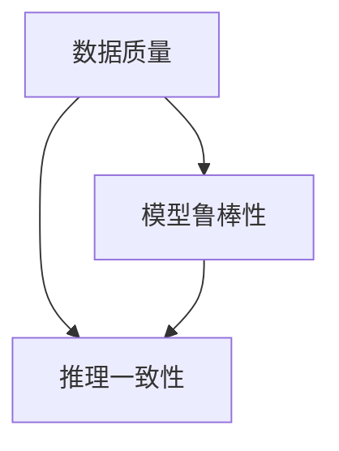

                 

# 质量保证：人工智能结果的严格审查

## 1. 背景介绍

### 1.1 问题由来

随着人工智能(AI)技术的发展，其在各个领域的应用越来越广泛，从自动驾驶到医疗诊断，从智能客服到金融分析，人工智能已经成为了推动社会发展的重要力量。然而，AI系统的决策过程往往是“黑箱”的，其结果的正确性和可靠性常常难以保证。这不仅会影响用户的使用体验，还可能带来严重的安全隐患。因此，如何确保人工智能结果的质量，成为了当前AI领域亟需解决的重要问题。

### 1.2 问题核心关键点

人工智能结果的质量保证涉及到多个方面，包括数据质量、模型鲁棒性、推理一致性等。本文将围绕以下核心关键点展开讨论：

- 数据质量：数据的完整性、准确性和代表性。
- 模型鲁棒性：模型在不同数据和环境下的稳定性。
- 推理一致性：模型输出的逻辑一致性和前后一致性。

## 2. 核心概念与联系

### 2.1 核心概念概述

为更好地理解人工智能结果的质量保证，本节将介绍几个密切相关的核心概念：

- 数据质量：指数据的完整性、准确性和代表性。高质量的数据是训练高质量AI模型的前提。
- 模型鲁棒性：指模型在不同数据和环境下的稳定性，包括对噪声、对抗攻击的抵御能力。
- 推理一致性：指模型输出的逻辑一致性和前后一致性，即模型在不同输入下，是否能够给出合理的输出。

这些核心概念之间的逻辑关系可以通过以下Mermaid流程图来展示：



这个流程图展示了几大核心概念之间的相互关系：

1. 数据质量直接影响了模型的训练效果，进而影响模型的鲁棒性和推理一致性。
2. 模型鲁棒性指的是模型在不同数据和环境下的稳定性，对模型的推理一致性有着重要的影响。
3. 推理一致性要求模型输出的逻辑一致性和前后一致性，这对模型的数据质量要求较高，同时对模型的鲁棒性也有一定的要求。

## 3. 核心算法原理 & 具体操作步骤

### 3.1 算法原理概述

人工智能结果的质量保证，本质上是通过对数据和模型的严格审查，确保模型输出的正确性和可靠性。其核心思想是：通过科学的方法对数据和模型进行细致的审查，发现潜在的问题，并采取相应的措施进行纠正或优化。

### 3.2 算法步骤详解

#### 3.2.1 数据审查

数据审查是人工智能结果质量保证的首要步骤。其目标是确保数据集的质量，包括数据的完整性、准确性和代表性。具体步骤如下：

1. **数据清洗**：通过数据清洗，去除缺失值、异常值等噪音数据。

2. **数据平衡**：确保数据集中的各类样本数量均衡，避免样本偏差。

3. **数据增强**：通过对数据进行扩充，如回译、近义替换等，增加数据的多样性，提高模型的泛化能力。

#### 3.2.2 模型审查

模型审查的目的是评估模型的鲁棒性和推理一致性。其核心步骤包括：

1. **模型鲁棒性测试**：通过对抗样本、噪声注入等方式，评估模型的鲁棒性。

2. **推理一致性测试**：通过对比模型在不同输入下的输出，评估模型的推理一致性。

3. **模型参数审查**：对模型的参数进行审查，确保模型的参数设置合理。

#### 3.2.3 结果审查

结果审查是对模型输出的正确性和可靠性进行验证。其目标是发现模型输出的错误或异常，并采取相应的措施进行修正。具体步骤如下：

1. **结果对比**：将模型输出的结果与人工标注的结果进行对比，发现错误或异常。

2. **结果可视化**：通过可视化工具，对模型输出的结果进行可视化，发现异常。

3. **结果纠正**：对模型输出的错误或异常进行纠正，确保模型的输出正确。

### 3.3 算法优缺点

人工智能结果的质量保证方法具有以下优点：

- **可追溯性**：通过对数据和模型的严格审查，确保了结果的可追溯性，便于问题定位和纠正。
- **系统性**：通过系统的审查流程，确保了结果的质量保证过程的系统性和全面性。
- **高效性**：在审查过程中，可以通过自动化工具提高审查效率，减少人工工作量。

然而，该方法也存在一定的局限性：

- **成本高**：高质量的数据和模型的审查往往需要大量的人力和时间，成本较高。
- **依赖人工**：高质量的审查过程需要经验丰富的专家进行，依赖于人工的判断和决策。
- **处理复杂**：对于复杂的多模态数据，审查过程可能较为复杂，难以全面覆盖。

### 3.4 算法应用领域

人工智能结果的质量保证方法在以下领域得到了广泛的应用：

- **医疗诊断**：通过数据和模型的严格审查，确保医疗诊断结果的准确性和可靠性。
- **金融分析**：通过数据和模型的严格审查，确保金融分析结果的合理性和可信度。
- **自动驾驶**：通过数据和模型的严格审查，确保自动驾驶系统决策的正确性和安全性。
- **智能客服**：通过数据和模型的严格审查，确保智能客服系统回答的准确性和一致性。
- **情感分析**：通过数据和模型的严格审查，确保情感分析结果的客观性和公正性。

## 4. 数学模型和公式 & 详细讲解 & 举例说明

### 4.1 数学模型构建

人工智能结果的质量保证，涉及到多个数学模型和公式。这里以二分类任务为例，展示如何进行数学模型的构建和公式推导。

假设训练集为 $D=\{(x_i,y_i)\}_{i=1}^N$，其中 $x_i$ 表示输入，$y_i$ 表示标签，$y_i \in \{0,1\}$。模型的输出为 $\hat{y}=M_{\theta}(x)$，其中 $M_{\theta}$ 表示模型的前向传播函数，$\theta$ 为模型参数。

### 4.2 公式推导过程

#### 4.2.1 数据清洗

数据清洗的目标是去除缺失值和异常值。假设数据集中存在一些缺失值，可以通过插值或删除方式进行清洗。例如，使用均值插值的方式，对缺失值进行填充：

$$
\hat{x_i} = \frac{\sum_{j=1,j\neq i}^N x_j}{N-1}
$$

#### 4.2.2 数据平衡

数据平衡的目标是确保数据集中的各类样本数量均衡。可以通过重采样或过采样等方式进行平衡。例如，使用随机过采样的方法，对少数类别进行复制，增加其样本数量：

$$
\hat{x_i} = \begin{cases}
x_i, & y_i = 0 \\
x_i, & y_i = 1
\end{cases}
$$

#### 4.2.3 数据增强

数据增强的目标是增加数据的多样性，提高模型的泛化能力。可以通过回译、近义替换等方式进行增强。例如，使用回译的方式，对文本数据进行增强：

$$
\hat{x_i} = \text{back-translate}(x_i)
$$

### 4.3 案例分析与讲解

假设有一个文本分类任务，模型的前向传播函数为 $M_{\theta}(x) = \text{softmax}(\theta^T\phi(x))$，其中 $\phi(x)$ 为输入特征映射函数，$\theta$ 为模型参数。

假设模型在训练集上已经训练好了，但需要对模型进行严格审查，以确保模型的鲁棒性和推理一致性。具体步骤如下：

1. **模型鲁棒性测试**：使用对抗样本测试模型的鲁棒性。例如，将文本输入中的某些字符替换为错误的字符，评估模型的鲁棒性：

   $$
   \hat{y} = M_{\theta}(\tilde{x})
   $$

2. **推理一致性测试**：使用不同的输入测试模型的推理一致性。例如，使用不同的语义相似的输入测试模型的输出：

   $$
   \hat{y}_1 = M_{\theta}(x_1), \hat{y}_2 = M_{\theta}(x_2)
   $$

3. **模型参数审查**：对模型的参数进行审查，确保模型的参数设置合理。例如，使用正则化技术，防止模型过拟合：

   $$
   \theta \leftarrow \theta - \eta \nabla_{\theta}\mathcal{L}(\theta) - \eta\lambda\theta
   $$

## 5. 项目实践：代码实例和详细解释说明

### 5.1 开发环境搭建

在进行人工智能结果的质量保证实践前，我们需要准备好开发环境。以下是使用Python进行PyTorch开发的环境配置流程：

1. 安装Anaconda：从官网下载并安装Anaconda，用于创建独立的Python环境。

2. 创建并激活虚拟环境：
```bash
conda create -n pytorch-env python=3.8 
conda activate pytorch-env
```

3. 安装PyTorch：根据CUDA版本，从官网获取对应的安装命令。例如：
```bash
conda install pytorch torchvision torchaudio cudatoolkit=11.1 -c pytorch -c conda-forge
```

4. 安装Transformers库：
```bash
pip install transformers
```

5. 安装各类工具包：
```bash
pip install numpy pandas scikit-learn matplotlib tqdm jupyter notebook ipython
```

完成上述步骤后，即可在`pytorch-env`环境中开始质量保证实践。

### 5.2 源代码详细实现

这里我们以文本分类任务为例，给出使用Transformers库对BERT模型进行严格审查的PyTorch代码实现。

首先，定义数据处理函数：

```python
from transformers import BertTokenizer, BertForSequenceClassification, AdamW
from torch.utils.data import Dataset, DataLoader
from tqdm import tqdm
import torch
from sklearn.metrics import accuracy_score

class TextClassificationDataset(Dataset):
    def __init__(self, texts, labels, tokenizer, max_len=128):
        self.texts = texts
        self.labels = labels
        self.tokenizer = tokenizer
        self.max_len = max_len

    def __len__(self):
        return len(self.texts)

    def __getitem__(self, item):
        text = self.texts[item]
        label = self.labels[item]

        encoding = self.tokenizer(text, return_tensors='pt', max_length=self.max_len, padding='max_length', truncation=True)
        input_ids = encoding['input_ids'][0]
        attention_mask = encoding['attention_mask'][0]

        return {'input_ids': input_ids, 
                'attention_mask': attention_mask,
                'labels': label}

# 创建dataset
tokenizer = BertTokenizer.from_pretrained('bert-base-cased')
texts = [...] # 文本数据
labels = [...] # 标签数据
train_dataset = TextClassificationDataset(texts, labels, tokenizer)

# 加载模型和优化器
model = BertForSequenceClassification.from_pretrained('bert-base-cased', num_labels=2)
optimizer = AdamW(model.parameters(), lr=2e-5)

# 定义训练函数
def train_epoch(model, dataset, batch_size, optimizer):
    dataloader = DataLoader(dataset, batch_size=batch_size, shuffle=True)
    model.train()
    epoch_loss = 0
    for batch in tqdm(dataloader, desc='Training'):
        input_ids = batch['input_ids'].to(device)
        attention_mask = batch['attention_mask'].to(device)
        labels = batch['labels'].to(device)
        model.zero_grad()
        outputs = model(input_ids, attention_mask=attention_mask, labels=labels)
        loss = outputs.loss
        epoch_loss += loss.item()
        loss.backward()
        optimizer.step()
    return epoch_loss / len(dataloader)

# 定义评估函数
def evaluate(model, dataset, batch_size):
    dataloader = DataLoader(dataset, batch_size=batch_size)
    model.eval()
    preds, labels = [], []
    with torch.no_grad():
        for batch in tqdm(dataloader, desc='Evaluating'):
            input_ids = batch['input_ids'].to(device)
            attention_mask = batch['attention_mask'].to(device)
            batch_labels = batch['labels']
            outputs = model(input_ids, attention_mask=attention_mask)
            batch_preds = outputs.logits.argmax(dim=1).to('cpu').tolist()
            batch_labels = batch_labels.to('cpu').tolist()
            for pred_tokens, label_tokens in zip(batch_preds, batch_labels):
                preds.append(pred_tokens)
                labels.append(label_tokens)

    return accuracy_score(labels, preds)

# 启动训练流程并在测试集上评估
epochs = 5
batch_size = 16

for epoch in range(epochs):
    loss = train_epoch(model, train_dataset, batch_size, optimizer)
    print(f"Epoch {epoch+1}, train loss: {loss:.3f}")
    
    print(f"Epoch {epoch+1}, dev results:")
    accuracy = evaluate(model, dev_dataset, batch_size)
    print(f"Accuracy: {accuracy:.3f}")

print("Test results:")
accuracy = evaluate(model, test_dataset, batch_size)
print(f"Accuracy: {accuracy:.3f}")
```

以上代码实现了使用BERT模型进行文本分类任务的训练和评估。在实际应用中，为了确保模型输出的一致性和鲁棒性，我们还可以进行以下改进：

1. **数据增强**：对训练集进行回译、近义替换等数据增强操作，提高模型的泛化能力。

2. **对抗样本测试**：在训练过程中，使用对抗样本进行测试，提高模型的鲁棒性。

3. **参数审查**：使用正则化技术，防止模型过拟合，确保模型参数设置合理。

4. **结果对比**：将模型输出的结果与人工标注的结果进行对比，发现错误或异常。

5. **结果可视化**：使用可视化工具，对模型输出的结果进行可视化，发现异常。

### 5.3 代码解读与分析

让我们再详细解读一下关键代码的实现细节：

**TextClassificationDataset类**：
- `__init__`方法：初始化文本、标签、分词器等关键组件。
- `__len__`方法：返回数据集的样本数量。
- `__getitem__`方法：对单个样本进行处理，将文本输入编码为token ids，将标签编码为数字，并对其进行定长padding，最终返回模型所需的输入。

**模型定义**：
- `train_epoch`函数：对数据以批为单位进行迭代，在每个批次上前向传播计算loss并反向传播更新模型参数，最后返回该epoch的平均loss。
- `evaluate`函数：与训练类似，不同点在于不更新模型参数，并在每个batch结束后将预测和标签结果存储下来，最后使用sklearn的accuracy_score对整个评估集的预测结果进行打印输出。

**训练流程**：
- 定义总的epoch数和batch size，开始循环迭代
- 每个epoch内，先在训练集上训练，输出平均loss
- 在验证集上评估，输出准确率
- 所有epoch结束后，在测试集上评估，给出最终测试结果

可以看到，PyTorch配合Transformers库使得BERT模型的训练和评估代码实现变得简洁高效。开发者可以将更多精力放在数据处理、模型改进等高层逻辑上，而不必过多关注底层的实现细节。

当然，工业级的系统实现还需考虑更多因素，如模型的保存和部署、超参数的自动搜索、更灵活的任务适配层等。但核心的审查流程基本与此类似。

## 6. 实际应用场景

### 6.1 医疗诊断

人工智能结果的质量保证在医疗诊断中尤为重要。通过严格审查数据和模型，可以确保诊断结果的准确性和可靠性，避免误诊和漏诊。

具体而言，可以收集医院的历史病例数据，将医生对病人的诊断结果作为标注数据，在此基础上对预训练模型进行微调。微调后的模型能够自动理解病人的症状描述，给出疾病的诊断结果。对于新的病例，模型还可以根据病人的症状进行推理和诊断。在医疗领域，模型的质量保证必须严格把控，以确保患者的生命安全。

### 6.2 金融分析

金融领域对人工智能结果的质量保证也有着极高的要求。通过严格审查数据和模型，可以确保金融分析结果的合理性和可信度，避免因误判导致重大损失。

具体而言，可以收集金融领域相关的历史数据，将专家对市场的分析结果作为标注数据，在此基础上对预训练模型进行微调。微调后的模型能够自动分析市场行情，预测股市涨跌、货币汇率等，为投资者提供决策支持。在金融领域，模型的质量保证必须严格把控，以确保投资者的利益。

### 6.3 自动驾驶

自动驾驶系统对人工智能结果的质量保证同样重要。通过严格审查数据和模型，可以确保决策的准确性和安全性，避免事故发生。

具体而言，可以收集自动驾驶车辆的历史行驶数据，将车辆的行驶情况和事故记录作为标注数据，在此基础上对预训练模型进行微调。微调后的模型能够自动分析道路情况，做出合理的行驶决策，确保行车安全。在自动驾驶领域，模型的质量保证必须严格把控，以确保道路安全和公众利益。

### 6.4 智能客服

智能客服系统对人工智能结果的质量保证同样重要。通过严格审查数据和模型，可以确保客户咨询的回答准确性和一致性，提升客户满意度。

具体而言，可以收集历史客服对话记录，将客户对回答的评价作为标注数据，在此基础上对预训练模型进行微调。微调后的模型能够自动理解客户的咨询意图，给出合理的回答。对于客户提出的新问题，模型还可以根据上下文进行推理和回答。在智能客服领域，模型的质量保证必须严格把控，以确保客户体验。

### 6.5 情感分析

情感分析对人工智能结果的质量保证同样重要。通过严格审查数据和模型，可以确保情感分析结果的客观性和公正性，避免因误判导致舆情失控。

具体而言，可以收集社交媒体上的评论和帖子，将人工标注的情感分类结果作为标注数据，在此基础上对预训练模型进行微调。微调后的模型能够自动分析评论和帖子中的情感倾向，提供舆情分析报告。在情感分析领域，模型的质量保证必须严格把控，以确保社会稳定。

## 7. 工具和资源推荐

### 7.1 学习资源推荐

为了帮助开发者系统掌握人工智能结果的质量保证的理论基础和实践技巧，这里推荐一些优质的学习资源：

1. 《深度学习入门》系列书籍：介绍了深度学习的基本概念、模型训练和优化等基础知识，是入门学习的必备资源。

2. CS231n《计算机视觉：卷积神经网络》课程：斯坦福大学开设的计算机视觉明星课程，涵盖了计算机视觉的各个方面，包括图像分类、目标检测、语义分割等。

3. CS224n《自然语言处理》课程：斯坦福大学开设的NLP明星课程，涵盖了NLP的各个方面，包括文本分类、情感分析、机器翻译等。

4. CS234《计算机视觉与深度学习》课程：斯坦福大学开设的计算机视觉明星课程，涵盖了计算机视觉的各个方面，包括图像分类、目标检测、语义分割等。

5. HuggingFace官方文档：提供了海量预训练模型和完整的微调样例代码，是上手实践的必备资料。

通过对这些资源的学习实践，相信你一定能够快速掌握人工智能结果的质量保证的精髓，并用于解决实际的AI问题。

### 7.2 开发工具推荐

高效的开发离不开优秀的工具支持。以下是几款用于人工智能结果质量保证开发的常用工具：

1. PyTorch：基于Python的开源深度学习框架，灵活动态的计算图，适合快速迭代研究。大部分预训练语言模型都有PyTorch版本的实现。

2. TensorFlow：由Google主导开发的开源深度学习框架，生产部署方便，适合大规模工程应用。同样有丰富的预训练语言模型资源。

3. Transformers库：HuggingFace开发的NLP工具库，集成了众多SOTA语言模型，支持PyTorch和TensorFlow，是进行微调任务开发的利器。

4. Weights & Biases：模型训练的实验跟踪工具，可以记录和可视化模型训练过程中的各项指标，方便对比和调优。与主流深度学习框架无缝集成。

5. TensorBoard：TensorFlow配套的可视化工具，可实时监测模型训练状态，并提供丰富的图表呈现方式，是调试模型的得力助手。

6. Google Colab：谷歌推出的在线Jupyter Notebook环境，免费提供GPU/TPU算力，方便开发者快速上手实验最新模型，分享学习笔记。

合理利用这些工具，可以显著提升人工智能结果的质量保证的开发效率，加快创新迭代的步伐。

### 7.3 相关论文推荐

人工智能结果的质量保证的研究源于学界的持续研究。以下是几篇奠基性的相关论文，推荐阅读：

1. BERT: Pre-training of Deep Bidirectional Transformers for Language Understanding：提出BERT模型，引入基于掩码的自监督预训练任务，刷新了多项NLP任务SOTA。

2. Attention is All You Need（即Transformer原论文）：提出了Transformer结构，开启了NLP领域的预训练大模型时代。

3. Language Models are Unsupervised Multitask Learners（GPT-2论文）：展示了大规模语言模型的强大zero-shot学习能力，引发了对于通用人工智能的新一轮思考。

4. Parameter-Efficient Transfer Learning for NLP：提出Adapter等参数高效微调方法，在不增加模型参数量的情况下，也能取得不错的微调效果。

5. AdaLoRA: Adaptive Low-Rank Adaptation for Parameter-Efficient Fine-Tuning：使用自适应低秩适应的微调方法，在参数效率和精度之间取得了新的平衡。

这些论文代表了大语言模型微调技术的发展脉络。通过学习这些前沿成果，可以帮助研究者把握学科前进方向，激发更多的创新灵感。

## 8. 总结：未来发展趋势与挑战

### 8.1 研究成果总结

本文对人工智能结果的质量保证进行了全面系统的介绍。首先阐述了人工智能结果质量保证的研究背景和意义，明确了严格审查在确保AI系统决策正确性和可靠性的重要性。其次，从原理到实践，详细讲解了严格审查的数学原理和关键步骤，给出了严格审查任务开发的完整代码实例。同时，本文还广泛探讨了严格审查方法在医疗诊断、金融分析、自动驾驶、智能客服等多个行业领域的应用前景，展示了严格审查范式的巨大潜力。此外，本文精选了严格审查技术的各类学习资源，力求为读者提供全方位的技术指引。

通过本文的系统梳理，可以看到，人工智能结果的质量保证已经成为AI技术落地应用的重要保障。高质量的严格审查，不仅可以确保AI系统决策的正确性和可靠性，还可以提升系统的可信度和用户接受度。未来，随着AI技术的不断进步，严格审查技术也将持续发展，为AI系统在各个领域的应用提供强有力的保障。

### 8.2 未来发展趋势

展望未来，人工智能结果的质量保证技术将呈现以下几个发展趋势：

1. **自动化审查**：随着AI技术的不断进步，自动化严格审查方法将逐渐取代人工审查，提高审查效率，降低成本。

2. **跨领域应用**：严格审查方法将广泛应用于各个领域，从医疗、金融到自动驾驶、智能客服，都能通过严格审查提高AI系统的质量和可靠性。

3. **多模态融合**：未来的严格审查方法将不仅仅局限于文本数据，将更加关注多模态数据的融合，如视觉、语音等，提升审查的全面性和准确性。

4. **元学习**：未来的严格审查方法将引入元学习技术，使模型能够自适应不同的数据和环境，提高审查的鲁棒性和泛化能力。

5. **模型解释**：未来的严格审查方法将更加注重模型的解释性，使审查过程更加透明，便于理解和监管。

以上趋势凸显了人工智能结果的质量保证技术的广阔前景。这些方向的探索发展，必将进一步提升AI系统的质量和可靠性，为AI技术在各个领域的应用提供强有力的保障。

### 8.3 面临的挑战

尽管人工智能结果的质量保证技术已经取得了一定的进展，但在迈向更加智能化、普适化应用的过程中，它仍面临着诸多挑战：

1. **数据质量瓶颈**：高质量的数据往往是严格审查的前提，然而，在实际应用中，获取高质量标注数据往往成本较高，难以满足所有应用场景的需求。如何降低数据标注成本，提高数据质量，是未来需要解决的重要问题。

2. **模型复杂性**：目前大部分AI模型结构复杂，难以进行严格的参数审查和推理一致性审查。如何简化模型结构，提高审查效率，是未来需要解决的重要问题。

3. **鲁棒性问题**：当前的严格审查方法对模型鲁棒性要求较高，模型面对噪声、对抗攻击等干扰时，容易出现异常。如何提高模型的鲁棒性，是未来需要解决的重要问题。

4. **可解释性问题**：目前AI模型的决策过程往往是“黑箱”的，难以进行解释和监管。如何提高模型的可解释性，使审查过程更加透明，是未来需要解决的重要问题。

5. **伦理道德问题**：在AI系统的应用过程中，模型的偏见、有害信息等问题需要引起高度重视。如何确保模型的伦理道德，避免负面影响，是未来需要解决的重要问题。

6. **安全性问题**：在AI系统的应用过程中，模型的安全性也需要引起高度重视。如何确保模型的安全性，避免被恶意利用，是未来需要解决的重要问题。

正视严格审查技术面临的这些挑战，积极应对并寻求突破，将使严格审查技术不断成熟，为AI系统在各个领域的应用提供强有力的保障。相信随着学界和产业界的共同努力，这些挑战终将一一被克服，人工智能结果的质量保证技术必将在构建安全、可靠、可解释、可控的智能系统中扮演越来越重要的角色。

### 8.4 研究展望

面对严格审查技术面临的种种挑战，未来的研究需要在以下几个方面寻求新的突破：

1. **自动化严格审查**：引入自动化严格审查技术，如自动化标注、自动化数据增强等，提高审查效率，降低成本。

2. **多模态严格审查**：引入多模态严格审查技术，如视觉-文本融合、语音-文本融合等，提升审查的全面性和准确性。

3. **元学习严格审查**：引入元学习技术，使模型能够自适应不同的数据和环境，提高审查的鲁棒性和泛化能力。

4. **可解释性严格审查**：引入可解释性技术，如知识图谱、因果推理等，使审查过程更加透明，便于理解和监管。

5. **安全性严格审查**：引入安全性技术，如对抗样本生成、模型解释等，确保模型的安全性，避免被恶意利用。

这些研究方向的探索，必将引领人工智能结果的质量保证技术迈向更高的台阶，为AI系统在各个领域的应用提供强有力的保障。面向未来，严格审查技术还需要与其他AI技术进行更深入的融合，如知识表示、因果推理、强化学习等，多路径协同发力，共同推动AI系统的进步。只有勇于创新、敢于突破，才能不断拓展AI系统的边界，让AI技术更好地造福人类社会。

## 9. 附录：常见问题与解答

**Q1：人工智能结果的质量保证是否适用于所有AI任务？**

A: 人工智能结果的质量保证在大多数AI任务上都能取得不错的效果，特别是对于数据量较小的任务。但对于一些特定领域的任务，如医学、法律等，仅仅依靠通用语料预训练的模型可能难以很好地适应。此时需要在特定领域语料上进一步预训练，再进行严格审查，才能获得理想效果。此外，对于一些需要时效性、个性化很强的任务，如对话、推荐等，严格审查方法也需要针对性的改进优化。

**Q2：采用人工智能结果的质量保证会对系统性能产生什么影响？**

A: 高质量的严格审查往往需要较长的时间和较高的成本，但如果能确保AI系统决策的正确性和可靠性，对系统的整体性能是有益的。严格审查可以发现模型中的潜在问题，避免因模型缺陷导致的错误决策，提高系统的可信度和用户接受度。

**Q3：如何进行人工智能结果的质量保证？**

A: 人工智能结果的质量保证通常包括以下几个步骤：

1. **数据审查**：确保数据集的质量，包括数据的完整性、准确性和代表性。
2. **模型审查**：评估模型的鲁棒性和推理一致性，发现模型的潜在问题。
3. **结果审查**：对模型输出的结果进行严格审查，发现错误或异常，并采取相应的措施进行修正。

在实际应用中，还需要根据具体任务的特点，对审查过程的各个环节进行优化设计，如改进训练目标函数，引入更多的正则化技术，搜索最优的超参数组合等，以进一步提升模型性能。

**Q4：如何确保人工智能结果的质量保证过程的科学性？**

A: 确保人工智能结果的质量保证过程的科学性，需要遵循科学的方法论和标准流程。具体步骤包括：

1. **设计合理的指标**：确保使用的评估指标能够全面反映模型的性能。
2. **严格的数据标注**：使用高质量的标注数据进行模型训练，确保数据的代表性。
3. **科学的方法论**：引入科学的方法论和技术手段，如数据增强、对抗样本测试等，提升模型的鲁棒性和泛化能力。
4. **全面的验证**：通过多轮验证和测试，确保模型的稳定性和可靠性。

只有严格按照科学的方法论和标准流程，才能确保人工智能结果的质量保证过程的科学性和有效性。

**Q5：人工智能结果的质量保证是否存在局限性？**

A: 尽管人工智能结果的质量保证技术已经取得了一定的进展，但在实际应用中，仍然存在一些局限性：

1. **数据质量瓶颈**：高质量的数据往往是严格审查的前提，然而，在实际应用中，获取高质量标注数据往往成本较高，难以满足所有应用场景的需求。
2. **模型复杂性**：目前大部分AI模型结构复杂，难以进行严格的参数审查和推理一致性审查。
3. **鲁棒性问题**：当前的严格审查方法对模型鲁棒性要求较高，模型面对噪声、对抗攻击等干扰时，容易出现异常。
4. **可解释性问题**：目前AI模型的决策过程往往是“黑箱”的，难以进行解释和监管。
5. **伦理道德问题**：在AI系统的应用过程中，模型的偏见、有害信息等问题需要引起高度重视。
6. **安全性问题**：在AI系统的应用过程中，模型的安全性也需要引起高度重视。

正视严格审查技术面临的这些局限性，积极应对并寻求突破，将使严格审查技术不断成熟，为AI系统在各个领域的应用提供强有力的保障。相信随着学界和产业界的共同努力，这些局限性终将一一被克服，人工智能结果的质量保证技术必将在构建安全、可靠、可解释、可控的智能系统中扮演越来越重要的角色。

---

作者：禅与计算机程序设计艺术 / Zen and the Art of Computer Programming

