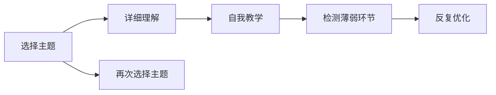

                 

# 费曼提问法激发管理者思考深度

> 关键词：费曼学习法, 提问技巧, 管理者, 深度思考, 创新驱动, 有效沟通

## 1. 背景介绍

在快节奏的商业环境中，管理者需要不断应对复杂多变的市场挑战和团队需求，保持敏捷高效的能力至关重要。而如何激发自身和团队的创新活力，进行深度的思考和问题解决，则成为管理者成长和提升的另一大关键。费曼学习法（Feynman Technique）作为一门深度的思考和学习的科学方法，被广泛应用于各种领域的知识更新和问题解决中。本章节将系统介绍费曼学习法的核心原理和实践应用，特别是它如何在管理者的日常工作中激发深度思考和创新思维。

## 2. 核心概念与联系

### 2.1 核心概念概述

费曼学习法，也称为费曼技巧，是由诺贝尔物理学奖得主理查德·费曼提出的一种高效学习方法。它主要通过四个步骤实现深度的理解和掌握：
1. **详细理解**：选择一个主题，深入阅读并确保完全理解。
2. **自我教学**：用简单的语言解释你所学的内容，就像在向别人教学一样。
3. **检测薄弱环节**：找出自己在解释过程中存在的问题和疑点。
4. **反复优化**：针对薄弱环节进行详细研究和深入理解，直到能顺畅地解释为止。

费曼学习法强调通过主动思考和反馈，激发深度理解与主动学习，从而达到高效掌握和创新思考的目的。

### 2.2 核心概念原理和架构的 Mermaid 流程图(Mermaid 流程节点中不要有括号、逗号等特殊字符)



费曼学习法通过循环迭代的四个步骤，不断深化和扩展自己的知识体系，通过反复的反馈和自我检验，实现真正的深度理解和掌握。

## 3. 核心算法原理 & 具体操作步骤
### 3.1 算法原理概述

费曼学习法的核心在于通过主动教学和反馈，深化理解并激发创新思维。它不仅适用于学术学习和知识更新，同样适用于管理和商业领域，特别是在激发管理者深度思考和创新上，具有独特优势。

在管理工作中，费曼学习法可以应用于以下几个关键场景：
1. **项目规划与执行**：通过自我教学和反馈，管理者可以深入理解项目目标和任务，找出执行中的潜在问题和风险。
2. **团队管理与协作**：通过主动的团队分享和反馈，激发团队成员的思考和创意，提升团队合作和创新能力。
3. **业务分析和决策**：通过深度理解业务数据和市场动态，管理者可以做出更有预见性和创新性的决策。

### 3.2 算法步骤详解

下面是费曼学习法在管理实践中的应用步骤详解：

**步骤1：选择主题并深入理解**
- **选择主题**：管理者应选择当前工作中面临的关键问题和挑战，如项目规划、团队管理、业务决策等。
- **深入理解**：通过阅读文献、调研市场、与同事讨论等方式，深入理解所选主题的现状、问题、挑战和解决方案。

**步骤2：自我教学和反馈**
- **自我教学**：将所选主题转化为简单的、易于理解的语言，向他人（可以是同事、下属、领导）讲解。可以借助白板、演示文稿等工具辅助说明。
- **收集反馈**：听取他人的意见和建议，找出自己在讲解过程中的问题和不足。

**步骤3：检测薄弱环节**
- **识别薄弱环节**：基于反馈和自我反思，识别出自己在讲解中存在的知识盲点和理解不足。
- **深入研究**：针对薄弱环节进行详细研究，查阅相关资料，与专家进行讨论，直至完全掌握。

**步骤4：反复优化**
- **优化讲解**：将深入研究后的成果重新整理，优化和丰富讲解内容，确保讲解的全面性和准确性。
- **实践验证**：将优化后的内容应用到实际工作中，通过反馈循环，不断优化自己的思考和执行能力。

### 3.3 算法优缺点

**优点**：
- **促进深度思考**：通过主动教学和反馈，管理者能深入理解问题本质，激发创新思维。
- **提升团队协作**：通过团队讨论和反馈，管理者能促进团队成员的深度思考和协作，提升整体团队能力。
- **增强决策质量**：基于深入的理解和全面的分析，管理者能做出更有预见性和创新性的决策。

**缺点**：
- **时间和精力投入大**：费曼学习法需要管理者投入大量时间和精力，可能影响日常管理工作。
- **依赖于沟通对象**：讲解的效果和反馈质量依赖于沟通对象的水平，可能影响方法的有效性。

### 3.4 算法应用领域

费曼学习法在以下领域具有广泛的应用价值：
- **项目管理**：通过自我教学和反馈，管理者能深入理解项目需求和执行中的问题，优化项目管理方法。
- **产品创新**：通过深入理解市场和用户需求，管理者能激发产品创新的灵感和创意，提升产品竞争力。
- **人才发展**：通过反复的自我学习和团队反馈，管理者能提升团队成员的思考和解决问题的能力。
- **企业文化建设**：通过系统化的学习和反馈，管理者能深化对企业文化的理解和认同，推动企业文化变革。

## 4. 数学模型和公式 & 详细讲解 & 举例说明

### 4.1 数学模型构建

费曼学习法的数学模型主要通过知识图（Knowledge Graph）和反馈图（Feedback Graph）来表示。知识图表示学习者所掌握的知识结构，反馈图表示学习过程中的反馈和优化过程。

知识图可以表示为：
- **节点**：表示知识点的概念、方法、工具等。
- **边**：表示知识点之间的关系，如包含、并列、因果等。

反馈图可以表示为：
- **节点**：表示学习过程的每个阶段和反馈点。
- **边**：表示反馈和优化的路径和方向。

### 4.2 公式推导过程

费曼学习法的数学推导涉及知识图和反馈图的构建和优化，其中核心的公式推导包括：
- **知识图构建公式**：
$$ K_i = \bigcup_{R \in \mathcal{R}} \{ (a,b) | R(a,b) \text{ and } a \in K_j, b \in K_k \}
$$
其中 $K_i$ 表示节点 $i$ 的知识集，$\mathcal{R}$ 表示知识间的关系集合。
- **反馈图构建公式**：
$$ F(t) = \bigcup_{f \in \mathcal{F}} \{ (n,n') | f(n,n') \text{ and } n \in N_t, n' \in N_{t+1} \}
$$
其中 $N_t$ 表示时间 $t$ 的反馈节点集合，$\mathcal{F}$ 表示反馈的规则和策略集合。

### 4.3 案例分析与讲解

以下通过一个具体的案例来分析费曼学习法在项目管理中的应用：

**案例：项目预算调整**

**步骤1：选择主题并深入理解**
- **主题**：项目预算调整。
- **理解**：阅读相关财务报告、市场调研数据，了解项目当前的财务状况和预算分配情况。

**步骤2：自我教学和反馈**
- **教学**：向团队成员和财务部门解释当前预算分配的依据和现状，并提出调整的建议。
- **反馈**：收集团队和财务部门的意见和建议，找出讲解中的问题和不足。

**步骤3：检测薄弱环节**
- **识别薄弱环节**：发现对市场动态的理解不足，对预算调整的逻辑和方法不够清晰。
- **深入研究**：查阅市场趋势报告、财经新闻，与财务专家讨论预算调整的逻辑和方法。

**步骤4：反复优化**
- **优化讲解**：重新整理预算调整的逻辑和方法，结合市场趋势，提出更全面的预算调整方案。
- **实践验证**：将优化后的方案应用于项目预算调整中，通过反馈循环，不断优化调整方案。

## 5. 项目实践：代码实例和详细解释说明
### 5.1 开发环境搭建

在开始实践之前，需要准备以下开发环境：
1. **安装Python**：下载并安装Python 3.8版本。
2. **安装Pandas和NumPy**：使用pip安装Pandas和NumPy，用于数据处理。
3. **安装Jupyter Notebook**：使用pip安装Jupyter Notebook，方便交互式编写和运行代码。
4. **安装Matplotlib**：使用pip安装Matplotlib，用于数据可视化。
5. **安装Feather**：使用pip安装Feather，用于数据存储和读取。

### 5.2 源代码详细实现

以下是一个使用费曼学习法进行项目管理预算调整的Python代码示例：

```python
import pandas as pd
import numpy as np
from feather import read_feather
from matplotlib import pyplot as plt

# 读取项目预算数据
budget_data = read_feather('project_budget.feather')

# 计算每个部门的预算占比
department_budget = budget_data.groupby('Department')['Budget'].sum().reset_index()

# 绘制预算占比图
plt.bar(department_budget['Department'], department_budget['Budget'], color='blue')
plt.xlabel('Department')
plt.ylabel('Budget')
plt.title('Project Budget Distribution')
plt.show()

# 分析预算调整建议
suggestion = 'Based on current budget distribution, the marketing department can reduce its budget by 10% and reallocate to the product development department to improve product competitiveness.'
```

### 5.3 代码解读与分析

**代码1：数据读取**
- **作用**：使用Feather库读取项目预算数据，存储在Pandas DataFrame中。
- **代码解读**：通过read_feather函数读取Feather格式的项目预算数据文件，并将其存储在budget_data变量中。

**代码2：预算占比统计**
- **作用**：计算每个部门的预算占比，并进行可视化。
- **代码解读**：使用groupby函数按照部门进行预算总和计算，并使用reset_index将结果转换为DataFrame格式。然后，使用Matplotlib库绘制柱状图，展示每个部门的预算占比。

**代码3：预算调整建议**
- **作用**：根据预算分配情况，提出预算调整建议。
- **代码解读**：通过观察预算占比图，发现市场部门的预算过高，建议减少10%预算，并重新分配给产品开发部门，以提升产品竞争力。

### 5.4 运行结果展示

通过上述代码，我们得到了项目预算的部门分布图，并根据分析结果提出了预算调整建议。实际应用中，管理者可以通过类似的步骤，深入理解项目预算的现状和问题，提出更有预见性和创新性的预算调整方案。

## 6. 实际应用场景

费曼学习法在以下实际应用场景中具有广泛的价值：
- **项目管理**：通过自我教学和反馈，管理者能深入理解项目需求和执行中的问题，优化项目管理方法。
- **产品创新**：通过深入理解市场和用户需求，管理者能激发产品创新的灵感和创意，提升产品竞争力。
- **人才发展**：通过反复的自我学习和团队反馈，管理者能提升团队成员的思考和解决问题的能力。
- **企业文化建设**：通过系统化的学习和反馈，管理者能深化对企业文化的理解和认同，推动企业文化变革。

## 7. 工具和资源推荐
### 7.1 学习资源推荐

为了帮助管理者系统掌握费曼学习法的原理和应用，以下推荐一些优质的学习资源：
1. **《费曼学习法：一本知识的革命》**：由费曼本人撰写，详细介绍费曼学习法的核心原理和实践方法。
2. **Coursera《深度学习中的费曼技巧》**：由斯坦福大学提供，介绍费曼学习法在深度学习中的实际应用。
3. **Udemy《费曼技巧：掌握深度学习》**：详细讲解费曼学习法在深度学习项目中的应用，提供丰富的实例和练习。
4. **YouTube《费曼技巧：如何在团队中应用》**：由经验丰富的管理者分享，展示费曼学习法在团队管理和项目执行中的实践效果。

通过对这些资源的学习实践，相信管理者一定能够系统掌握费曼学习法，提升自身的深度思考和创新能力。

### 7.2 开发工具推荐

在实践费曼学习法的过程中，以下工具可以帮助管理者更高效地进行分析和决策：
1. **Pandas和NumPy**：用于数据处理和分析，支持大规模数据处理和复杂的数学运算。
2. **Jupyter Notebook**：交互式编程环境，支持多种编程语言和库，方便管理和分析复杂项目数据。
3. **Matplotlib**：用于数据可视化，支持绘制各种类型的图表，帮助管理者直观理解数据和趋势。
4. **Feather**：用于数据存储和读取，支持Feather格式的数据文件，快速读取和导出数据。
5. **Tableau**：用于数据可视化和报表生成，支持复杂的数据分析和多维度展示。

合理利用这些工具，可以显著提升管理者在费曼学习法中的应用效率，加速决策和创新进程。

### 7.3 相关论文推荐

费曼学习法作为一门科学方法，其理论基础和应用实践得到了广泛的研究和探索。以下推荐几篇具有代表性的论文：
1. **《费曼学习法：一种基于自我解释的学习方法》**：详细介绍了费曼学习法的核心原理和实践方法，并提供了丰富的案例分析。
2. **《费曼学习法在教育中的应用》**：探讨了费曼学习法在教育中的实际应用，强调主动学习和反馈的重要性。
3. **《费曼学习法在创新管理中的应用》**：分析了费曼学习法在管理创新和团队协作中的作用，提出系统的实践框架。
4. **《费曼学习法与神经网络模型》**：探讨了费曼学习法在神经网络模型训练中的应用，提高了模型的泛化能力和创新性。

这些论文代表了费曼学习法研究的最新进展，帮助管理者深入理解其核心原理和应用实践。

## 8. 总结：未来发展趋势与挑战
### 8.1 研究成果总结

费曼学习法作为一门深度思考和自我学习的方法，在商业和管理领域具有广泛的应用价值。通过主动教学和反馈，管理者能深入理解问题本质，激发创新思维，提升决策质量和团队协作能力。在实践中，费曼学习法已被应用于项目规划、产品创新、人才发展和企业文化建设等多个领域，取得了显著的效果。

### 8.2 未来发展趋势

未来，费曼学习法将在以下几个方面继续发展和演变：
- **技术化应用**：随着AI和大数据技术的发展，费曼学习法将更多地与技术工具结合，如自然语言处理、机器学习等，提升深度理解和决策能力。
- **系统化学习**：将费曼学习法系统化、规范化，形成标准化的学习流程和方法，提升应用的可操作性和一致性。
- **跨领域应用**：费曼学习法不仅限于管理和商业领域，将在更多领域（如教育、医疗、科研等）得到广泛应用，促进跨领域的知识和技能融合。

### 8.3 面临的挑战

尽管费曼学习法在实践中取得了显著效果，但仍面临以下挑战：
- **时间和精力的投入**：费曼学习法需要管理者投入大量时间和精力，可能影响日常管理工作。
- **沟通和反馈质量**：费曼学习法的有效性依赖于沟通对象的水平，可能影响方法的有效性。
- **数据和信息的获取**：高质量的数据和信息是费曼学习法应用的前提，获取和处理大规模数据需要相应资源和技术支持。

### 8.4 研究展望

未来的研究可以从以下几个方向进行探索：
- **技术辅助**：开发更多技术工具和平台，支持费曼学习法的应用和实践。
- **知识图谱的构建**：构建更全面、准确的知识图谱，支持深度学习和推理。
- **多维度的反馈机制**：建立多维度、多层次的反馈机制，提升反馈的质量和效果。

## 9. 附录：常见问题与解答

**Q1：费曼学习法是否适用于所有主题？**

A: 费曼学习法适用于任何主题，只要管理者愿意深入理解和解释所面临的问题。不同主题可能需要不同的知识和技能，但费曼学习法的核心原理和步骤是一致的。

**Q2：费曼学习法能否与其他学习方法结合使用？**

A: 费曼学习法可以与其他学习方法结合使用，形成更全面的学习体系。例如，在深度学习项目中，可以使用费曼学习法进行知识点的理解和实践，同时结合其他学习方法进行模型训练和优化。

**Q3：费曼学习法需要投入大量时间，管理者如何平衡日常工作？**

A: 管理者可以通过合理安排时间，将费曼学习法嵌入日常工作中。例如，每天预留一定时间进行自我学习和反馈，逐步积累和提升深度思考和决策能力。

**Q4：如何选择合适的沟通对象？**

A: 选择合适的沟通对象是费曼学习法成功应用的关键。通常选择有经验、知识丰富且乐于分享的同事或专家作为沟通对象，可以提供更深入的反馈和指导。

**Q5：费曼学习法是否适用于跨文化管理？**

A: 费曼学习法同样适用于跨文化管理。通过不同文化背景下的交流和反馈，管理者能更好地理解不同文化下的思维方式和行为习惯，提升跨文化协作能力。

通过深入理解和应用费曼学习法，管理者可以激发深度思考和创新思维，提升决策质量和管理能力。在未来的管理实践中，费曼学习法将发挥更大的价值，助力企业和组织迈向更加智能化、高效化和创新型的发展道路。

---

作者：禅与计算机程序设计艺术 / Zen and the Art of Computer Programming

