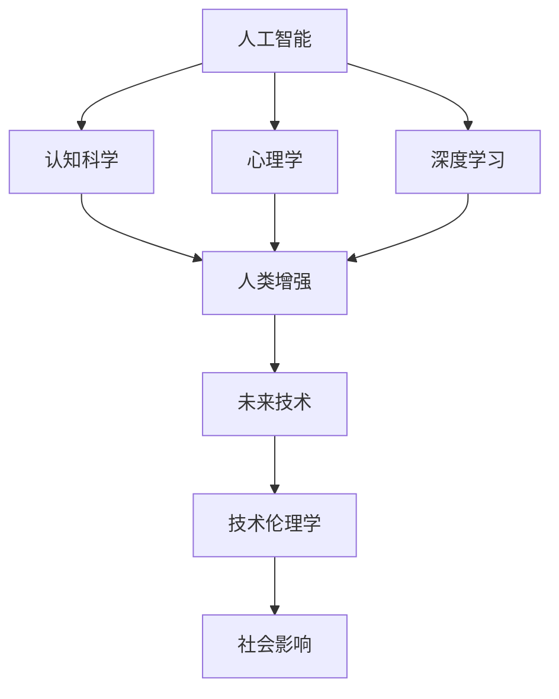

                 

# 赋能人类：释放个体潜能，创造无限可能

> 关键词：人工智能，机器学习，深度学习，认知科学，心理学，未来技术，技术伦理学，社会影响

## 1. 背景介绍

### 1.1 问题由来
随着科技的迅猛发展，人工智能（AI）已经渗透到我们生活的方方面面，从智能家居到自动驾驶，从金融投资到医疗诊断，AI正以惊人的速度改变着我们的生活方式。然而，在享受AI带来的便利的同时，我们也面临着一系列新的挑战和问题。如何更好地利用AI技术，不仅提升生产效率，更能赋能个体潜能，创造无限可能，成为了当前AI研究的重要课题。

### 1.2 问题核心关键点
本文聚焦于人工智能如何赋能人类，通过深入理解AI的基本原理和应用场景，探讨AI如何在认知科学、心理学、教育、健康等领域释放个体潜能，创造无限可能。我们希望通过系统化的分析，能够为AI技术的开发和应用提供理论基础和实践指导，最终实现AI与人类的协同进化。

## 2. 核心概念与联系

### 2.1 核心概念概述

为更好地理解人工智能如何赋能人类，本节将介绍几个关键概念及其相互联系：

- 人工智能（AI）：通过机器学习、深度学习等技术，使机器能够模拟人类智能行为，如感知、理解、学习、推理等。
- 认知科学（Cognitive Science）：研究人类思维过程、知识获取、记忆存储、决策制定等认知活动的科学。
- 心理学（Psychology）：研究人类行为和心理过程的科学，揭示人类心理活动的内在机制。
- 深度学习（Deep Learning）：一种基于神经网络的学习方式，通过多层次的特征提取和抽象，实现对复杂数据的建模和预测。
- 人类增强（Human Augmentation）：通过AI技术增强人类感知、记忆、思考能力，提升个体潜力和创造力。
- 未来技术（Future Technologies）：包括量子计算、脑机接口、生物计算等前沿科技，预示着未来的技术发展方向。
- 技术伦理学（Technology Ethics）：研究AI技术对社会、伦理、道德的影响，探讨如何构建负责任、公平、透明的技术生态。
- 社会影响（Social Impact）：探讨AI技术对就业、教育、健康、伦理等社会层面的广泛影响。

这些核心概念之间的逻辑关系可以通过以下Mermaid流程图来展示：



这个流程图展示了人工智能的基本原理及其在各个领域的应用，通过认知科学、心理学等学科的支撑，结合深度学习技术，最终实现对人类潜能的赋能，并引发对未来技术、伦理和社会影响的深远思考。

## 3. 核心算法原理 & 具体操作步骤
### 3.1 算法原理概述

人工智能赋能人类的核心在于通过机器学习技术，理解和模拟人类认知过程，从而提升个体的智能水平。具体而言，可以分为以下几个关键步骤：

1. **数据采集与预处理**：收集大量的人类行为和认知数据，并进行清洗和标注，为机器学习提供高质量的训练样本。
2. **模型构建与训练**：利用深度学习算法，构建能够模拟人类认知和行为的神经网络模型，通过大量数据进行训练和优化。
3. **知识抽取与融合**：从训练数据中提取人类知识和经验，并融合到模型中，使其能够进行复杂的推理和决策。
4. **反馈与改进**：通过用户反馈和实际应用中的表现，不断优化模型，提升其性能和适应性。

### 3.2 算法步骤详解

以下是人工智能赋能人类的一个具体实例，以认知增强为例，详细阐述其算法步骤：

1. **数据采集与预处理**：
   - 收集人类认知任务（如数学解题、语言理解、视觉识别等）的大量数据。
   - 对数据进行清洗和标注，确保数据质量和一致性。
   - 使用数据增强技术（如数据扩充、噪声注入等）增加数据多样性。

2. **模型构建与训练**：
   - 设计符合认知任务需求的神经网络架构（如卷积神经网络CNN、循环神经网络RNN等）。
   - 使用深度学习框架（如TensorFlow、PyTorch等）搭建模型，并定义损失函数和优化器。
   - 在收集到的数据上训练模型，使用反向传播算法更新网络参数。

3. **知识抽取与融合**：
   - 使用知识图谱和符号推理技术，从训练数据中抽取人类知识和规则。
   - 将抽取的知识融入到神经网络模型中，提升模型的推理能力和泛化能力。
   - 结合生成对抗网络（GAN）等技术，生成新的训练数据，进一步提高模型的表现。

4. **反馈与改进**：
   - 通过用户反馈和实际应用中的表现，评估模型的效果。
   - 根据反馈结果，调整模型的参数和架构，提升其性能。
   - 在不断迭代和优化中，逐渐构建出能够理解和模拟人类认知的智能系统。

### 3.3 算法优缺点

人工智能赋能人类具有以下优点：
1. 提升认知能力：通过机器学习，人工智能能够模拟和提升人类认知能力，如推理、记忆、学习等。
2. 增强决策质量：结合认知科学和心理学知识，人工智能能够提供更科学、合理的决策支持。
3. 促进创新与创造：人工智能能够识别和生成新知识，促进科学发现和艺术创作。
4. 提高生产效率：通过自动化和智能化的手段，人工智能能够提高各行各业的生产效率和质量。

然而，AI赋能人类也存在一些局限性：
1. 依赖数据质量：AI模型的表现高度依赖于训练数据的质量和多样性，数据偏差可能导致模型偏见。
2. 伦理与安全问题：AI决策可能涉及隐私、伦理和安全性问题，需要严格监管和规范。
3. 技术门槛高：开发和维护高性能AI系统需要高水平的技术和资源投入。
4. 个体适应性：不同的人对AI技术的适应性和接受度不同，需要个性化的设计和引导。
5. 社会影响复杂：AI技术对社会的影响广泛而复杂，需要深入研究和多方协作。

### 3.4 算法应用领域

人工智能赋能人类的技术广泛应用于多个领域，具体如下：

- **教育**：利用AI技术，如智能辅导、个性化学习、情感分析等，提升教育质量和个性化学习体验。
- **医疗**：通过智能诊断、药物研发、健康管理等，提升医疗服务的质量和效率。
- **金融**：利用AI进行风险评估、交易预测、客户服务等方面，优化金融业务流程。
- **心理健康**：使用AI进行情绪识别、行为分析、心理健康评估等，提供心理支持和干预。
- **工业制造**：通过AI进行质量检测、故障诊断、自动化生产等，提升制造业的生产效率和质量。
- **交通管理**：利用AI进行交通流量预测、智能调度、事故预防等，提升交通系统的安全性和效率。

## 4. 数学模型和公式 & 详细讲解  
### 4.1 数学模型构建

本节将使用数学语言对人工智能赋能人类的过程进行更加严格的刻画。

设认知任务为 $T$，对应的训练数据集为 $D=\{(x_i, y_i)\}_{i=1}^N$，其中 $x_i$ 为输入，$y_i$ 为输出。使用神经网络模型 $M_{\theta}$ 进行训练，其中 $\theta$ 为模型参数。

定义模型在训练样本 $(x_i, y_i)$ 上的损失函数为 $\ell(M_{\theta}(x_i), y_i)$，则在数据集 $D$ 上的经验风险为：

$$
\mathcal{L}(\theta) = \frac{1}{N} \sum_{i=1}^N \ell(M_{\theta}(x_i), y_i)
$$

微调的优化目标是最小化经验风险，即找到最优参数：

$$
\theta^* = \mathop{\arg\min}_{\theta} \mathcal{L}(\theta)
$$

在实践中，我们通常使用基于梯度的优化算法（如SGD、Adam等）来近似求解上述最优化问题。设 $\eta$ 为学习率，则参数的更新公式为：

$$
\theta \leftarrow \theta - \eta \nabla_{\theta}\mathcal{L}(\theta)
$$

其中 $\nabla_{\theta}\mathcal{L}(\theta)$ 为损失函数对参数 $\theta$ 的梯度，可通过反向传播算法高效计算。

### 4.2 公式推导过程

以下我们以图像识别任务为例，推导卷积神经网络（CNN）模型的损失函数及其梯度的计算公式。

设模型 $M_{\theta}$ 在输入 $x$ 上的输出为 $\hat{y}=M_{\theta}(x)$，表示样本属于类别 $y$ 的概率。真实标签 $y \in \{1,2,\dots,K\}$。则交叉熵损失函数定义为：

$$
\ell(M_{\theta}(x),y) = -\sum_{k=1}^K y_k \log \hat{y}_k
$$

将其代入经验风险公式，得：

$$
\mathcal{L}(\theta) = -\frac{1}{N}\sum_{i=1}^N \sum_{k=1}^K y_{ki} \log \hat{y}_{ki}
$$

根据链式法则，损失函数对参数 $\theta_k$ 的梯度为：

$$
\frac{\partial \mathcal{L}(\theta)}{\partial \theta_k} = -\frac{1}{N}\sum_{i=1}^N \sum_{k=1}^K \frac{\partial \hat{y}_{ki}}{\partial \theta_k} \frac{\partial \ell(M_{\theta}(x_i), y_i)}{\partial \hat{y}_{ki}}
$$

其中 $\frac{\partial \hat{y}_{ki}}{\partial \theta_k}$ 可进一步递归展开，利用反向传播算法完成计算。

在得到损失函数的梯度后，即可带入参数更新公式，完成模型的迭代优化。重复上述过程直至收敛，最终得到适应认知任务的最优模型参数 $\theta^*$。

## 5. 项目实践：代码实例和详细解释说明
### 5.1 开发环境搭建

在进行人工智能赋能人类实践前，我们需要准备好开发环境。以下是使用Python进行TensorFlow开发的环境配置流程：

1. 安装Anaconda：从官网下载并安装Anaconda，用于创建独立的Python环境。

2. 创建并激活虚拟环境：
```bash
conda create -n tf-env python=3.8 
conda activate tf-env
```

3. 安装TensorFlow：根据CUDA版本，从官网获取对应的安装命令。例如：
```bash
conda install tensorflow -c tf -c conda-forge
```

4. 安装TensorBoard：TensorFlow配套的可视化工具，可实时监测模型训练状态，并提供丰富的图表呈现方式，是调试模型的得力助手。

```bash
pip install tensorboard
```

5. 安装各类工具包：
```bash
pip install numpy pandas scikit-learn matplotlib tqdm jupyter notebook ipython
```

完成上述步骤后，即可在`tf-env`环境中开始人工智能赋能人类的实践。

### 5.2 源代码详细实现

下面我们以图像识别任务为例，给出使用TensorFlow实现卷积神经网络的代码实现。

首先，定义图像识别任务的数据处理函数：

```python
import tensorflow as tf
from tensorflow.keras.preprocessing.image import ImageDataGenerator

def preprocess_data(input_dir, batch_size):
    train_datagen = ImageDataGenerator(rescale=1./255,
                                       shear_range=0.2,
                                       zoom_range=0.2,
                                       horizontal_flip=True)
    train_generator = train_datagen.flow_from_directory(
        input_dir,
        target_size=(224, 224),
        batch_size=batch_size,
        class_mode='categorical')
    return train_generator

# 加载数据集
train_generator = preprocess_data('train_data', batch_size=32)
```

然后，定义卷积神经网络模型：

```python
from tensorflow.keras.models import Sequential
from tensorflow.keras.layers import Conv2D, MaxPooling2D, Flatten, Dense

model = Sequential()
model.add(Conv2D(32, (3, 3), activation='relu', input_shape=(224, 224, 3)))
model.add(MaxPooling2D((2, 2)))
model.add(Conv2D(64, (3, 3), activation='relu'))
model.add(MaxPooling2D((2, 2)))
model.add(Conv2D(128, (3, 3), activation='relu'))
model.add(MaxPooling2D((2, 2)))
model.add(Flatten())
model.add(Dense(128, activation='relu'))
model.add(Dense(10, activation='softmax'))

# 编译模型
model.compile(optimizer='adam',
              loss='categorical_crossentropy',
              metrics=['accuracy'])
```

接着，定义训练和评估函数：

```python
from tensorflow.keras.callbacks import EarlyStopping

def train_epoch(model, train_generator, validation_generator, batch_size, epochs, patience=5):
    early_stopping = EarlyStopping(monitor='val_loss', patience=patience, restore_best_weights=True)
    model.fit(train_generator,
              validation_data=validation_generator,
              batch_size=batch_size,
              epochs=epochs,
              callbacks=[early_stopping])

def evaluate(model, test_generator):
    test_loss, test_acc = model.evaluate(test_generator)
    print(f'Test loss: {test_loss:.4f}')
    print(f'Test accuracy: {test_acc:.4f}')
```

最后，启动训练流程并在测试集上评估：

```python
train_generator = preprocess_data('train_data', batch_size=32)
validation_generator = preprocess_data('validation_data', batch_size=32)
test_generator = preprocess_data('test_data', batch_size=32)

epochs = 10
batch_size = 32

train_epoch(model, train_generator, validation_generator, batch_size, epochs)
evaluate(model, test_generator)
```

以上就是使用TensorFlow实现卷积神经网络进行图像识别的完整代码实现。可以看到，得益于TensorFlow的强大封装，我们可以用相对简洁的代码完成模型的搭建、训练和评估。

### 5.3 代码解读与分析

让我们再详细解读一下关键代码的实现细节：

**preprocess_data函数**：
- 使用`ImageDataGenerator`进行图像预处理，包括缩放、剪切、翻转等，增加数据多样性。
- 使用`flow_from_directory`方法，从指定目录中加载图像数据，并自动生成训练集和验证集。

**卷积神经网络模型**：
- 使用`Sequential`模型，按照顺序添加卷积层、池化层、全连接层等，构成完整的神经网络。
- 卷积层和池化层的参数设置，如滤波器大小、步长、激活函数等，根据具体任务进行调整。
- 使用`softmax`激活函数，将输出转化为类别概率分布，适合多分类任务。

**训练和评估函数**：
- 使用`EarlyStopping`回调函数，防止过拟合，当验证集损失不再下降时停止训练。
- 使用`fit`方法进行模型训练，指定训练数据、验证数据、批次大小和训练轮数。
- 使用`evaluate`方法评估模型在测试集上的表现，输出损失和准确率。

**训练流程**：
- 定义训练集和验证集，使用`preprocess_data`函数进行预处理。
- 启动训练流程，调用`train_epoch`函数进行训练，并保存模型权重。
- 在测试集上评估模型，调用`evaluate`函数进行测试。

可以看出，TensorFlow提供了强大的工具支持，使得深度学习模型的开发和训练变得简单易行。

当然，工业级的系统实现还需考虑更多因素，如模型的保存和部署、超参数的自动搜索、更灵活的任务适配层等。但核心的训练范式基本与此类似。

## 6. 实际应用场景
### 6.1 智能辅导系统

人工智能赋能人类技术在智能辅导系统中的应用，可以大幅提升教育质量和学习效率。传统教育往往依赖于教师的经验和知识，难以覆盖广泛的知识点和个性化需求。而智能辅导系统通过深度学习技术，可以自主分析学生的问题，并提供个性化、实时的辅导建议。

在技术实现上，可以收集学生的历史学习数据、作业提交记录和在线测试成绩，作为监督信号，训练模型对不同问题进行分类和推荐。微调后的模型能够理解学生的学习状态，并给出针对性的辅导建议，如难题解析、知识点复习等，提升学生的学习效果。同时，智能辅导系统还可以根据学生反馈，不断优化模型，实现更精准的个性化辅导。

### 6.2 健康管理平台

在健康管理领域，人工智能赋能人类技术可以用于疾病预测、个性化健康管理等方面。通过收集患者的医疗记录、生活习惯和生理数据，训练模型对疾病风险进行评估和预测。微调后的模型能够识别出潜在疾病风险，并给出相应的健康建议和干预措施，帮助患者及时调整生活习惯，预防疾病发生。

具体而言，可以收集大量的患者数据，包括病历、检查报告、生活习惯等，进行标注和清洗。在此基础上对预训练模型进行微调，使其能够对不同患者的健康状态进行预测和诊断。微调后的模型可以集成到健康管理平台中，为患者提供个性化的健康管理建议，如饮食建议、运动计划、心理疏导等，提升整体健康水平。

### 6.3 智能推荐系统

在电子商务、在线视频、社交网络等领域，人工智能赋能人类技术可以用于个性化推荐，提升用户体验和满意度。通过分析用户的历史行为数据，训练模型对不同用户的需求进行分类和推荐。微调后的模型能够理解用户的兴趣偏好，并生成个性化的推荐内容，如商品推荐、视频推荐、文章推荐等，提升用户的粘性和满意度。

在技术实现上，可以收集用户的历史点击、浏览、购买等行为数据，作为监督信号，训练模型对不同用户进行分类和推荐。微调后的模型可以集成到推荐系统中，实时生成个性化的推荐内容，提升用户体验和平台粘性。

### 6.4 未来应用展望

随着人工智能技术的不断发展，其在赋能人类方面的应用前景将更加广阔。未来，我们可以期待以下几方面的突破和应用：

1. **认知增强**：结合认知科学和心理学知识，开发更加智能的认知增强工具，提升人类的认知能力和决策质量。
2. **情感计算**：通过深度学习技术，开发能够理解和生成人类情感的智能系统，应用于社交机器人、情感辅导等方面。
3. **智能界面**：开发能够自动适应用户需求和场景的界面设计工具，提升用户交互体验。
4. **生命科学**：利用人工智能技术，开发新的生物计算方法，应用于疾病预测、药物研发、基因编辑等领域，提升生命科学研究的精度和效率。
5. **未来技术**：探索脑机接口、量子计算等前沿技术，拓展人类认知能力和智能水平，实现人与机器的深度融合。

## 7. 工具和资源推荐
### 7.1 学习资源推荐

为了帮助开发者系统掌握人工智能赋能人类的理论基础和实践技巧，这里推荐一些优质的学习资源：

1. 《深度学习》系列书籍：由深度学习领域的权威专家撰写，全面介绍了深度学习的基本原理和应用。
2. 《认知科学》课程：麻省理工学院开设的认知科学课程，介绍了认知科学的基本理论和前沿研究。
3. 《心理学导论》教材：心理学领域的经典教材，系统介绍了心理学基本理论和研究方法。
4. Coursera《人工智能伦理》课程：由斯坦福大学教授讲授，探讨了AI技术在伦理、道德和社会方面的挑战和解决方案。
5. DeepMind博客：DeepMind的官方博客，定期发布前沿AI技术和研究论文，涵盖认知科学、心理学、伦理学等多个领域。

通过对这些资源的学习实践，相信你一定能够快速掌握人工智能赋能人类的精髓，并用于解决实际的AI问题。
###  7.2 开发工具推荐

高效的开发离不开优秀的工具支持。以下是几款用于人工智能赋能人类开发的常用工具：

1. TensorFlow：由Google主导开发的深度学习框架，生产部署方便，适合大规模工程应用。
2. PyTorch：基于Python的开源深度学习框架，灵活动态的计算图，适合快速迭代研究。
3. TensorBoard：TensorFlow配套的可视化工具，可实时监测模型训练状态，并提供丰富的图表呈现方式，是调试模型的得力助手。
4. Jupyter Notebook：交互式编程环境，支持多种语言，方便开发者进行实验和记录。
5. Scikit-learn：用于机器学习的数据处理和模型评估，提供多种常见算法和数据预处理工具。
6. Scikit-image：用于图像处理和计算机视觉，提供多种图像处理算法和工具。

合理利用这些工具，可以显著提升人工智能赋能人类的开发效率，加快创新迭代的步伐。

### 7.3 相关论文推荐

人工智能赋能人类技术的研究源于学界的持续研究。以下是几篇奠基性的相关论文，推荐阅读：

1. DeepMind的AlphaGo：展示了AI在复杂策略游戏中的突破性表现，推动了认知增强技术的发展。
2. OpenAI的GPT系列模型：通过大规模预训练和微调，展示了AI在自然语言处理任务上的强大能力。
3. Facebook的Wav2Vec：展示了AI在语音识别和理解方面的突破，推动了情感计算技术的发展。
4. 斯坦福大学的AlphaStar：展示了AI在复杂策略游戏中的突破性表现，推动了认知增强技术的发展。
5. IBM的Watson Health：展示了AI在医疗诊断和健康管理方面的应用，推动了智能健康技术的发展。

这些论文代表了大语言模型微调技术的发展脉络。通过学习这些前沿成果，可以帮助研究者把握学科前进方向，激发更多的创新灵感。

## 8. 总结：未来发展趋势与挑战
### 8.1 总结

本文对人工智能如何赋能人类进行了全面系统的介绍。首先阐述了AI的基本原理和应用场景，明确了认知科学、心理学等学科在AI赋能人类中的关键作用。其次，从原理到实践，详细讲解了认知增强、情感计算等AI技术的具体实现方法，给出了实际应用场景的代码实例。最后，探讨了AI技术在教育、医疗、推荐系统等领域的广泛应用前景，并提出了未来技术的发展方向。

通过本文的系统梳理，可以看到，人工智能赋能人类技术正在成为AI研究的重要课题，具有广阔的应用前景。未来，伴随AI技术的不断演进，其在认知增强、情感计算、智能界面等方面的应用将更加深入，为人类的生产生活带来深刻变革。

### 8.2 未来发展趋势

展望未来，人工智能赋能人类技术将呈现以下几个发展趋势：

1. **多模态融合**：结合图像、语音、文本等多种模态数据，构建更加全面、准确的智能系统。
2. **人机协同**：开发能够与人类进行高效协同的智能系统，提升任务完成效率和质量。
3. **认知增强**：结合认知科学和心理学知识，开发更加智能的认知增强工具，提升人类的认知能力和决策质量。
4. **情感计算**：通过深度学习技术，开发能够理解和生成人类情感的智能系统，应用于社交机器人、情感辅导等方面。
5. **智能界面**：开发能够自动适应用户需求和场景的界面设计工具，提升用户交互体验。
6. **生命科学**：利用人工智能技术，开发新的生物计算方法，应用于疾病预测、药物研发、基因编辑等领域，提升生命科学研究的精度和效率。
7. **未来技术**：探索脑机接口、量子计算等前沿技术，拓展人类认知能力和智能水平，实现人与机器的深度融合。

以上趋势凸显了人工智能赋能人类技术的广阔前景。这些方向的探索发展，必将进一步提升人工智能系统的性能和应用范围，为人类认知智能的进化带来深远影响。

### 8.3 面临的挑战

尽管人工智能赋能人类技术已经取得了瞩目成就，但在迈向更加智能化、普适化应用的过程中，它仍面临着诸多挑战：

1. **数据隐私和安全**：AI系统涉及大量个人数据，数据隐私和安全问题需要严格监管和保护。
2. **伦理和道德**：AI决策可能涉及伦理和道德问题，需要构建负责任、公平、透明的技术生态。
3. **技术门槛高**：开发和维护高性能AI系统需要高水平的技术和资源投入。
4. **社会影响复杂**：AI技术对社会的影响广泛而复杂，需要深入研究和多方协作。
5. **个体适应性**：不同的人对AI技术的适应性和接受度不同，需要个性化的设计和引导。
6. **资源瓶颈**：大规模数据和计算资源的投入，限制了AI技术的普及和应用。

正视这些挑战，积极应对并寻求突破，将是大语言模型微调技术走向成熟的必由之路。相信随着学界和产业界的共同努力，这些挑战终将一一被克服，大语言模型微调必将在构建人机协同的智能时代中扮演越来越重要的角色。

### 8.4 研究展望

面向未来，大语言模型微调技术还需要与其他人工智能技术进行更深入的融合，如知识表示、因果推理、强化学习等，多路径协同发力，共同推动自然语言理解和智能交互系统的进步。只有勇于创新、敢于突破，才能不断拓展语言模型的边界，让智能技术更好地造福人类社会。

通过全面理解和掌握人工智能赋能人类的基本原理和应用场景，我们相信，未来的人工智能技术将更加智能、普适和可控，真正成为人类认知能力的增强器，为人类的生产生活带来更多便利和创新。

## 9. 附录：常见问题与解答

**Q1：人工智能如何赋能人类？**

A: 人工智能赋能人类主要通过机器学习和深度学习技术，理解和模拟人类的认知过程，提升人类的认知能力、决策质量和创新潜力。具体而言，AI系统可以通过学习人类的语言、行为、情感等多种数据，实现智能辅导、健康管理、个性化推荐等功能，为人类提供更加智能、高效的服务。

**Q2：人工智能赋能人类有哪些应用场景？**

A: 人工智能赋能人类技术广泛应用于教育、医疗、金融、娱乐等多个领域。在教育领域，AI可以提供个性化辅导、情感分析等功能；在医疗领域，AI可以用于疾病预测、健康管理等；在金融领域，AI可以用于风险评估、交易预测等；在娱乐领域，AI可以用于智能推荐、情感计算等。

**Q3：人工智能赋能人类面临哪些挑战？**

A: 人工智能赋能人类面临诸多挑战，包括数据隐私和安全、伦理和道德问题、技术门槛高、社会影响复杂、资源瓶颈等。未来需要从数据隐私保护、伦理道德规范、技术普及等方面进行多方协作，共同推动人工智能技术的健康发展。

**Q4：如何提高人工智能赋能人类的效果？**

A: 提高人工智能赋能人类效果需要从数据质量、模型优化、技术创新等多方面进行努力。具体而言，需要收集高质量的数据，选择适合的任务适配层，采用高效的算法和硬件资源，进行持续的优化和改进。

**Q5：人工智能赋能人类未来发展方向是什么？**

A: 人工智能赋能人类技术的未来发展方向包括多模态融合、人机协同、认知增强、情感计算、智能界面、生命科学、未来技术等。未来需要结合认知科学、心理学、伦理学等多学科知识，不断推动AI技术的创新和应用。

通过回答这些问题，我们希望读者能够更全面、深入地理解人工智能赋能人类的基本原理和应用场景，为其研究和应用提供理论支持和实践指导。

