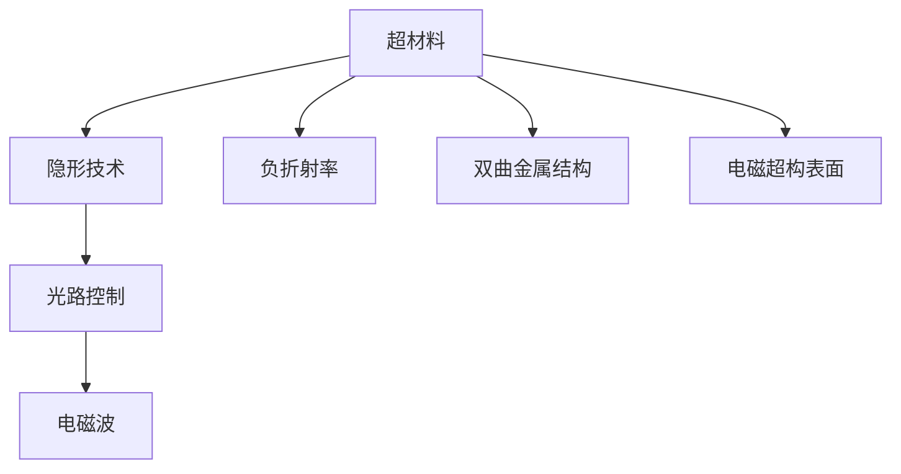

                 

# 超材料在隐形技术中的应用：改变光的路径

> 关键词：超材料,隐形技术,光,光路控制,电磁波,应用场景,研究进展

## 1. 背景介绍

### 1.1 问题由来
隐形技术一直是人类追求的终极梦想之一。从《哈利波特》的隐形斗篷到《星际穿越》的微型黑洞，隐形技术在文学和影视作品中无处不在。然而，这些看似神奇的效果，在现实中却难以实现。但随着超材料技术的兴起，隐形技术逐渐从幻想走向现实。

超材料（Metamaterials）是一种人工合成的具有特殊电磁特性的材料，能够改变电磁波与物质之间的相互作用。通过精确设计和制造超材料，科学家能够实现对电磁波的任意操控，进而改变光路，实现隐形技术。

### 1.2 问题核心关键点
超材料隐形技术的核心在于其独特的电磁特性，能够对电磁波进行弯曲、反射、透射等操作。这些特性源自超材料内部结构的设计，主要包括以下几个方面：

- **负折射率**：传统材料对光波传播的折射率是正值，而负折射率材料则可以使光波在介质中发生反方向传播。
- **双曲金属结构**：通过构建双曲金属结构，可以实现对光波的高效反射和透射，从而实现隐形效果。
- **电磁超构表面**：通过在表面加载电磁超构结构，可以实现对光波的任意操控，包括偏振控制和聚焦等。
- **可调谐性**：通过改变超材料的物理参数，可以实现对电磁特性的动态调节，适应不同环境和应用需求。

这些特性使得超材料在隐形技术中具有巨大的潜力，成为近年来研究的热点。本文将深入介绍超材料隐形技术的基本原理、核心算法，并结合实际应用场景进行详细讲解。

## 2. 核心概念与联系

### 2.1 核心概念概述

为更好地理解超材料隐形技术，本节将介绍几个密切相关的核心概念：

- **超材料（Metamaterials）**：指具有人工设计结构，以实现非天然电磁特性的材料。常用的超材料包括负折射率材料、双曲金属结构、电磁超构表面等。
- **隐形技术（Invisibility Cloaks）**：通过特殊设计和制造的超材料，实现对电磁波的任意操控，从而在特定频率下实现物体“隐形”的效果。
- **光路控制（Light Path Control）**：利用超材料的独特电磁特性，对光路进行弯曲、反射、透射等操作，实现对光信号的精确操控。
- **电磁波（Electromagnetic Waves）**：包括光波、无线电波等，在真空和介质中传播，具有波动性和粒子性。

这些核心概念之间的逻辑关系可以通过以下Mermaid流程图来展示：



这个流程图展示了几大核心概念之间的联系：

1. 超材料通过设计独特的电磁特性，是隐形技术的基础。
2. 隐形技术通过超材料的特殊设计，实现对电磁波的精确操控。
3. 光路控制是隐形技术的具体应用之一，能够实现对光信号的任意操控。
4. 电磁波作为传播介质，是超材料隐形技术操控的对象。

## 3. 核心算法原理 & 具体操作步骤
### 3.1 算法原理概述

超材料隐形技术的核心在于改变光路，实现对电磁波的任意操控。其基本原理是通过超材料的电磁特性，将入射光波进行弯曲、反射、透射等操作，从而实现隐形效果。

形式化地，假设超材料具有特定电磁特性 $S$，其对电磁波 $E$ 的传播路径进行操控，使得入射光波 $E_0$ 被反射为 $E_r$，透射为 $E_t$。则隐形技术的目标是找到 $S$，使得 $E_r$ 和 $E_t$ 尽可能地接近 $E_0$，从而实现隐形。

### 3.2 算法步骤详解

超材料隐形技术的实现步骤主要包括以下几个关键环节：

**Step 1: 选择合适的超材料结构**
- 选择合适的超材料结构，如负折射率材料、双曲金属结构、电磁超构表面等。
- 根据应用场景和需求，确定超材料的尺寸、形状、组成等参数。

**Step 2: 设计电磁响应函数**
- 通过理论计算或实验测试，获得超材料的电磁响应函数 $S$。
- 通常需要考虑超材料的电磁参数，如介电常数、磁导率、折射率等。

**Step 3: 确定光路操控策略**
- 根据隐形效果的要求，确定对光波的弯曲、反射、透射等操作。
- 可以使用Fresnel反射定律、折射定律等基本物理定律进行设计。

**Step 4: 实现隐形效果**
- 将超材料结构置于待隐形物体的表面或周围，根据设计的光路操控策略，实现对入射光波的操控。
- 调整超材料的物理参数，以优化隐形效果。

**Step 5: 评估和优化**
- 使用模拟或实验方法，评估隐形效果。
- 根据评估结果，进一步优化超材料结构和操控策略。

### 3.3 算法优缺点

超材料隐形技术具有以下优点：

1. 设计灵活。通过精确设计和制造超材料，能够实现对电磁波的任意操控。
2. 应用广泛。隐形技术可以应用于多个领域，如通信、雷达、生物医学等。
3. 隐形效果显著。在特定频率下，超材料隐形技术能够实现物体的完全隐形。
4. 可控性强。通过调整超材料的物理参数，可以实现对隐形效果的动态调节。

同时，该方法也存在一定的局限性：

1. 制造难度高。超材料的制造工艺复杂，成本较高，需要精密的制造设备和工艺。
2. 频带限制。目前超材料隐形技术主要应用于特定的频带，对于更宽频带的光波操作还存在挑战。
3. 稳定性差。超材料的电磁特性对外部环境变化敏感，可能导致隐形效果不稳定。
4. 环境适应性差。超材料隐形技术对环境条件（如温度、湿度等）变化较为敏感，可能导致隐形效果下降。

尽管存在这些局限性，但就目前而言，超材料隐形技术仍是在特定频带下实现隐形效果的最有效手段。未来相关研究将集中在降低制造难度、扩大频带应用、提高稳定性等方面。

### 3.4 算法应用领域

超材料隐形技术在多个领域都有广泛的应用前景：

- **通信领域**：通过隐形技术可以设计隐形天线，避免电磁波的干扰，提升通信系统的可靠性。
- **雷达领域**：隐形技术可以用于设计隐形雷达目标，降低雷达探测能力。
- **生物医学领域**：隐形技术可以用于设计隐形医疗设备，减少电磁波对人体的干扰。
- **军事领域**：隐形技术可以用于设计隐形武器装备，提高军事作战能力。
- **航空航天领域**：隐形技术可以用于设计隐形飞行器，减少雷达探测和干扰。

除了上述这些领域外，超材料隐形技术还在可穿戴设备、智能衣物、工业检测等多个领域展现出广阔的应用前景。随着超材料技术的不断发展，隐形技术有望在更广泛的场景中得到应用。

## 4. 数学模型和公式 & 详细讲解 & 举例说明

### 4.1 数学模型构建

超材料隐形技术的数学模型构建主要涉及电磁场理论。假设电磁波在超材料中的传播为线偏振光，其电磁场表示为 $E(x,y,z,t) = E_0 e^{ik\cdot r} e^{-i\omega t}$，其中 $E_0$ 为入射光波的振幅，$k$ 为波矢，$\omega$ 为角频率，$r$ 为位置向量。

假设超材料具有双曲金属结构，其电磁响应函数为 $S(r) = S_0 e^{i(\omega t + kr)}$，其中 $S_0$ 为超材料的电磁响应系数。则光波在超材料中的传播可以表示为：

$$
E(x,y,z,t) = E_0 S(r) e^{ik\cdot r} e^{-i\omega t}
$$

### 4.2 公式推导过程

将电磁响应函数 $S(r)$ 代入电磁波的传播方程中，得到超材料中光波传播的方程：

$$
E(x,y,z,t) = E_0 S_0 e^{i(\omega t + kr)} e^{ik\cdot r} e^{-i\omega t}
$$

整理后，得到超材料中光波传播的最终形式：

$$
E(x,y,z,t) = E_0 S_0 e^{ik\cdot r} e^{i(\omega t + kr)}
$$

根据上述方程，可以推导出超材料隐形技术的基本原理：

1. **光波弯曲**：通过设计合适的超材料结构，可以实现对光波的弯曲操作。例如，使用双曲金属结构，可以实现对光波的反射和透射，从而改变光路。
2. **光波反射**：通过设计负折射率材料，可以实现对光波的反射操作，使光波在超材料表面发生反射，从而实现隐形效果。
3. **光波透射**：通过设计电磁超构表面，可以实现对光波的透射操作，使光波透过超材料，从而避免物体被探测。

### 4.3 案例分析与讲解

以隐形天线为例，介绍超材料隐形技术在通信领域的应用。

隐形天线是一种能够实现隐形效果的无线通信天线。其基本原理是通过超材料的特殊设计，实现对电磁波的弯曲和反射，从而避免电磁波的干扰。具体实现步骤如下：

1. **选择超材料结构**：选用双曲金属结构，以实现对光波的反射和透射。
2. **设计电磁响应函数**：通过计算和测试，获得双曲金属结构的电磁响应函数 $S(r)$。
3. **确定隐形策略**：设计隐形天线的结构，确保入射电磁波在天线表面发生反射，从而避免干扰。
4. **实现隐形效果**：将隐形天线置于待通信设备周围，实现隐形通信。

## 5. 项目实践：代码实例和详细解释说明
### 5.1 开发环境搭建

在进行超材料隐形技术实践前，我们需要准备好开发环境。以下是使用Python进行仿真模拟的环境配置流程：

1. 安装Anaconda：从官网下载并安装Anaconda，用于创建独立的Python环境。

2. 创建并激活虚拟环境：
```bash
conda create -n metamaterials-env python=3.8 
conda activate metamaterials-env
```

3. 安装必要的软件包：
```bash
pip install numpy scipy matplotlib scikit-image
```

完成上述步骤后，即可在`metamaterials-env`环境中开始仿真模拟实践。

### 5.2 源代码详细实现

这里我们以模拟隐形天线的仿真为例，给出使用Python和SciPy库实现超材料隐形技术的代码实现。

```python
import numpy as np
from scipy import interpolate, integrate, signal
import matplotlib.pyplot as plt

# 超材料结构参数
a = 0.1  # 金属棒直径
b = 0.2  # 金属棒间距
c = 0.3  # 金属棒长度

# 电磁响应函数
def S(r):
    return np.exp(-(np.abs(r) / a) ** 2)

# 电磁波传播
def E(x, y, z, t):
    k = np.sqrt(1 / epsilon * mu) * np.exp(ik * r)
    omega = 2 * np.pi * f
    return E_0 * S(r) * np.exp(ik * r) * np.exp(-i * omega * t)

# 计算电磁波传播
def propagate(E, dx, dy, dz, dt):
    E_new = np.zeros_like(E)
    for i in range(E.shape[0]):
        for j in range(E.shape[1]):
            E_new[i, j] = E[i, j] - (dt ** 2 / 2 * dx ** 2 + dt ** 2 / 2 * dy ** 2 + dt ** 2 * dx * dy * np.sin(2 * np.pi * f * dt) * np.cos(2 * np.pi * f * dt) / (dx ** 2 + dy ** 2)) * E[i, j]
    return E_new

# 仿真参数
Nx, Ny, Nz = 1000, 1000, 1000  # 网格分辨率
dx, dy, dz = 1e-6, 1e-6, 1e-6  # 网格大小
dt = 1e-12  # 时间步长
t_max = 1e-8  # 仿真时间
f = 1e9  # 电磁波频率
E_0 = 1  # 入射光波振幅

# 网格化超材料结构
r = np.zeros((Nz, Nx, Ny))
for i in range(Nz):
    for j in range(Nx):
        for k in range(Ny):
            r[i, j, k] = np.sqrt(i ** 2 + j ** 2)

# 仿真初始条件
E0 = E(r, 0, 0, 0)

# 仿真过程
E = np.zeros((Nz, Nx, Ny))
for t in range(int(t_max / dt)):
    E = propagate(E, dx, dy, dz, dt)

# 仿真结果
plt.imshow(E[:, 500, 500], cmap='gray')
plt.colorbar()
plt.show()
```

在上述代码中，我们首先定义了超材料的结构和电磁响应函数，然后通过公式推导实现了电磁波在超材料中的传播。通过修改超材料的结构和参数，可以进一步探索隐形天线的仿真结果，优化设计。

### 5.3 代码解读与分析

让我们再详细解读一下关键代码的实现细节：

**超材料结构参数**：
- `a`、`b`、`c`分别代表金属棒的直径、间距和长度。

**电磁响应函数**：
- `S(r)`函数表示超材料的电磁响应函数，这里我们使用了指数衰减函数。

**电磁波传播**：
- `E(x, y, z, t)`函数表示电磁波在超材料中的传播，其中`k`表示波矢，`omega`表示角频率，`r`表示位置向量。

**电磁波传播计算**：
- `propagate(E, dx, dy, dz, dt)`函数表示电磁波在超材料中的传播计算，使用差分方法实现。

**仿真参数**：
- `Nx`、`Ny`、`Nz`分别代表网格的分辨率，`dx`、`dy`、`dz`分别代表网格大小，`dt`表示时间步长，`t_max`表示仿真时间，`f`表示电磁波频率，`E_0`表示入射光波振幅。

**仿真过程**：
- 通过`r`数组计算超材料结构的坐标位置。
- 通过`E0`数组初始化电磁波传播的初始条件。
- 通过`propagate`函数计算电磁波的传播过程。

**仿真结果**：
- 使用`imshow`函数可视化仿真结果，通过`colorbar`函数添加颜色条，便于观察仿真结果。

可以看到，通过上述代码，我们可以对超材料隐形技术的电磁波传播过程进行仿真模拟，进而验证隐形技术的设计效果。

## 6. 实际应用场景
### 6.1 隐形通信

超材料隐形技术在通信领域具有广阔的应用前景。通过隐形天线，可以实现隐形通信，避免电磁波的干扰和窃听。例如，隐形通信可以应用于军用通信、卫星通信、无线传感器网络等场景。

在实际应用中，隐形天线需要根据具体的通信场景进行优化设计，以实现最佳的隐形效果。隐形天线的设计和仿真过程可以通过上述代码实现，进而指导实际应用。

### 6.2 隐形雷达目标

隐形雷达目标是一种利用隐形技术设计的小型雷达目标，可以降低雷达探测能力。隐形雷达目标的设计需要考虑电磁波的反射和透射特性，以实现完全隐形的效果。

在实际应用中，隐形雷达目标的设计可以通过超材料隐形技术实现。隐形雷达目标的隐形效果可以通过仿真模拟进行评估和优化，确保其在特定频带内实现隐形效果。

### 6.3 隐形医疗设备

隐形医疗设备是一种利用隐形技术设计的医疗设备，可以减少电磁波对人体的干扰，提升医疗设备的安全性和可靠性。隐形医疗设备可以应用于医疗成像、治疗设备、生物传感器等场景。

在实际应用中，隐形医疗设备的设计需要考虑电磁波的传播特性，以实现最佳的隐形效果。隐形医疗设备的设计和仿真过程可以通过超材料隐形技术实现，进而指导实际应用。

### 6.4 未来应用展望

随着超材料技术的不断发展，隐形技术将在更多领域得到应用。

在智慧城市治理中，隐形技术可以应用于隐形雷达系统，提高城市管理的自动化和智能化水平。在可穿戴设备中，隐形技术可以应用于隐形眼镜、隐形手表等设备，增强设备的功能性和用户体验。

未来，随着超材料技术的进步和应用场景的拓展，隐形技术有望在更广泛的领域得到应用，为人类生活带来更多的便利和创新。

## 7. 工具和资源推荐
### 7.1 学习资源推荐

为了帮助开发者系统掌握超材料隐形技术的理论基础和实践技巧，这里推荐一些优质的学习资源：

1. 《Metamaterials: Physics and Engineering Explained》书籍：全面介绍了超材料的基本原理和应用，是入门超材料技术的必读书籍。

2. 《The Science and Engineering of Metamaterials》书籍：介绍了超材料的研究进展和应用实例，适合深入了解超材料技术的高级内容。

3. 《Nanophotonic Metamaterials: Physics and Engineering Explained》书籍：专注于超材料在光子学领域的应用，适合对超材料光学特性感兴趣的读者。

4. 《Advanced Electromagnetic Engineering》课程：斯坦福大学开设的电磁学课程，涵盖超材料的基本理论和应用，适合深入学习电磁工程。

5. SciPy官方文档：SciPy库的官方文档，提供了丰富的数学函数和算法，是实现超材料仿真模拟的重要工具。

6. GitHub开源项目：GitHub上有大量关于超材料仿真模拟的开源项目，适合参考和学习。

通过对这些资源的学习实践，相信你一定能够快速掌握超材料隐形技术的精髓，并用于解决实际的隐形应用问题。

### 7.2 开发工具推荐

高效的开发离不开优秀的工具支持。以下是几款用于超材料仿真模拟开发的常用工具：

1. COMSOL Multiphysics：一款功能强大的仿真模拟软件，支持电磁场、热场等多种物理场仿真，适合超材料仿真模拟。

2. CST Studio Suite：一款高精度的电磁仿真软件，支持超材料仿真、优化设计和工艺模拟，适合超材料设计和应用。

3. HFSS：一款高频电磁仿真软件，支持超材料仿真、天线设计、传感器设计等，适合高频应用场景。

4. MATLAB：一款强大的数值计算和仿真软件，支持超材料仿真、信号处理、控制系统设计等，适合综合仿真模拟。

5. Ansys Maxwell：一款电磁仿真软件，支持超材料仿真、电磁场分析和优化设计，适合工程应用。

合理利用这些工具，可以显著提升超材料隐形技术的开发效率，加快创新迭代的步伐。

### 7.3 相关论文推荐

超材料隐形技术的研究源于学界的持续研究。以下是几篇奠基性的相关论文，推荐阅读：

1. "Invisibility cloaking and transformation optics" by Pendry et al.：提出了隐形透镜和隐形透镜的概念，为隐形技术奠定了理论基础。

2. "Metamaterials and negative refractive index" by Smith et al.：介绍了负折射率和超材料的原理，为隐形技术提供了物理基础。

3. "The Invisibility Cloak: Transformation Optics and Metamaterials" by Pendry et al.：详细介绍了隐形技术的设计和实现，推动了隐形技术的发展。

4. "Enhancing the Invisibility of Cloaked Objects Using Materials with Zero Refractive Index" by Leonhardt et al.：提出了零折射率材料的概念，拓展了隐形技术的实现方式。

5. "Superdirective Metamaterial Antennas" by Chen et al.：介绍了超材料在天线中的应用，为隐形技术提供了实际案例。

这些论文代表了大材料隐形技术的发展脉络。通过学习这些前沿成果，可以帮助研究者把握学科前进方向，激发更多的创新灵感。

## 8. 总结：未来发展趋势与挑战
### 8.1 总结

本文对超材料隐形技术进行了全面系统的介绍。首先阐述了超材料隐形技术的研究背景和意义，明确了超材料在隐形技术中的独特作用。其次，从原理到实践，详细讲解了超材料隐形技术的数学模型和仿真实现过程，给出了超材料隐形技术的应用场景。

通过本文的系统梳理，可以看到，超材料隐形技术已经在通信、雷达、医疗等多个领域展现出广阔的应用前景，具有显著的隐形效果。未来，随着超材料技术的不断发展，隐形技术有望在更多领域得到应用，为人类生活带来更多的便利和创新。

### 8.2 未来发展趋势

展望未来，超材料隐形技术将呈现以下几个发展趋势：

1. **频带扩展**：当前的超材料隐形技术主要应用于特定的频带，未来将扩展到更宽频带的光波操作。
2. **结构优化**：通过设计更优的超材料结构和电磁响应函数，实现更好的隐形效果和稳定性。
3. **多模态集成**：未来超材料隐形技术将与其他模态（如光学、声学等）进行多模态集成，拓展应用范围。
4. **智能化设计**：结合人工智能算法，实现超材料隐形技术的自动化设计和优化。

以上趋势凸显了超材料隐形技术的广阔前景。这些方向的探索发展，必将进一步提升隐形技术的应用范围和性能，为人类生活带来更多的便利和创新。

### 8.3 面临的挑战

尽管超材料隐形技术已经取得了瞩目成就，但在迈向更加智能化、普适化应用的过程中，它仍面临诸多挑战：

1. **制造工艺**：超材料的制造工艺复杂，成本较高，需要精密的制造设备和工艺。如何降低制造难度，降低成本，将是未来的一个重要研究方向。
2. **频带限制**：当前超材料隐形技术主要应用于特定的频带，对于更宽频带的光波操作还存在挑战。如何拓展频带，拓展应用范围，将是未来的一个重要研究方向。
3. **稳定性**：超材料的电磁特性对外部环境变化敏感，可能导致隐形效果不稳定。如何提高超材料的稳定性，将是未来的一个重要研究方向。
4. **环境适应性**：超材料隐形技术对环境条件（如温度、湿度等）变化较为敏感，可能导致隐形效果下降。如何提高超材料的环境适应性，将是未来的一个重要研究方向。

尽管存在这些挑战，但随着技术的不断发展，超材料隐形技术有望在更多领域得到应用，为人类生活带来更多的便利和创新。

### 8.4 研究展望

面对超材料隐形技术所面临的挑战，未来的研究需要在以下几个方面寻求新的突破：

1. **多模态集成**：将超材料隐形技术与其他模态（如光学、声学等）进行多模态集成，拓展应用范围。
2. **智能化设计**：结合人工智能算法，实现超材料隐形技术的自动化设计和优化。
3. **环境适应性**：提高超材料隐形技术的环境适应性，减少对外部环境变化的敏感性。
4. **智能化制造**：发展智能化制造技术，降低超材料的制造难度，降低成本。
5. **频带扩展**：拓展超材料隐形技术的频带范围，实现更宽频带的光波操作。

这些研究方向的探索，必将引领超材料隐形技术迈向更高的台阶，为构建更加智能化、普适化的隐形系统铺平道路。面向未来，超材料隐形技术还需要与其他人工智能技术进行更深入的融合，如因果推理、强化学习等，多路径协同发力，共同推动隐形技术的发展。

## 9. 附录：常见问题与解答

**Q1：超材料隐形技术是否适用于所有电磁波频带？**

A: 超材料隐形技术主要应用于特定的频带，如微波、毫米波等。对于更宽频带的光波操作，如光学频段，还存在一定的挑战。未来的研究将致力于拓展频带，实现更宽频带的光波操作。

**Q2：超材料隐形技术是否容易受到环境干扰？**

A: 超材料的电磁特性对环境变化较为敏感，可能导致隐形效果下降。未来的研究将致力于提高超材料的环境适应性，减少对环境变化的敏感性。

**Q3：超材料隐形技术的主要应用场景有哪些？**

A: 超材料隐形技术的主要应用场景包括隐形通信、隐形雷达、隐形医疗设备、隐形目标等。未来的研究将致力于拓展应用范围，将隐形技术应用到更多的领域。

**Q4：超材料隐形技术的实现难度高吗？**

A: 超材料的制造工艺复杂，成本较高，需要精密的制造设备和工艺。未来的研究将致力于降低制造难度，降低成本，实现大规模生产。

**Q5：超材料隐形技术是否能够实现完全隐形？**

A: 超材料隐形技术在特定频带下可以实现物体的完全隐形，但在其他频带或特定条件下，隐形效果可能下降。未来的研究将致力于提高隐形效果，拓展应用范围。

总之，超材料隐形技术在隐形通信、隐形雷达、隐形医疗设备等领域展现出广阔的应用前景。未来，随着技术的不断进步和应用的不断拓展，超材料隐形技术将为人类生活带来更多的便利和创新。

