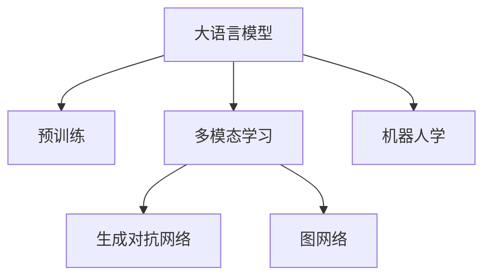

                 

# 超越语言：LLM 在非语言任务上的应用

> 关键词：语言模型, 非语言任务, 多模态学习, 生成对抗网络, 图网络, 机器人学

## 1. 背景介绍

### 1.1 问题由来

随着自然语言处理 (NLP) 技术的发展，大语言模型（LLMs）如GPT-3、BERT、T5等在文本生成、问答、情感分析等任务上取得了巨大成功。然而，这些模型几乎都是基于文本的，难以直接应用于非语言任务，如计算机视觉、机器人学、信号处理等领域。

近年来，随着多模态学习的兴起，大语言模型开始探索与视觉、声音等非语言数据的结合，在非语言任务上取得了初步成果。本文旨在探讨大语言模型在非语言任务上的应用，特别是如何利用多模态学习提升模型的泛化能力和跨领域适应性。

### 1.2 问题核心关键点

在非语言任务上应用大语言模型，需要解决以下几个关键问题：

1. **数据对齐**：文本与非语言数据（如图像、音频等）之间的数据对齐，确保模型能够正确地理解不同模态的信息。

2. **多模态融合**：如何有效地将不同模态的信息融合到语言模型中，提升模型的整体性能。

3. **泛化能力**：非语言任务通常数据量较小，模型需要在有限的标注数据上取得较好的泛化效果。

4. **模型架构**：如何设计合适的模型架构，以适应多模态任务的特殊需求。

5. **应用场景**：在具体应用场景中，如何利用大语言模型提升系统的性能和用户体验。

### 1.3 问题研究意义

探索大语言模型在非语言任务上的应用，对于提升模型的泛化能力和跨领域适应性具有重要意义：

1. **拓宽应用领域**：大语言模型在非语言任务上的成功应用，将极大拓展其应用领域，提升其在工业界的适用性。

2. **提升模型性能**：多模态学习结合大语言模型的优势，能够显著提升模型在特定任务上的性能，促进NLP技术的发展。

3. **促进跨领域研究**：大语言模型在非语言任务上的应用，将促进NLP与其他领域（如计算机视觉、机器人学等）的交叉融合，推动多模态学习的研究。

4. **推动技术创新**：大语言模型在非语言任务上的创新应用，将推动相关领域的技术创新，为人类社会带来更多福祉。

5. **满足实际需求**：随着数字化、智能化趋势的加速，多模态信息的处理需求不断增长，大语言模型在非语言任务上的成功应用将满足日益增长的实际需求。

## 2. 核心概念与联系

### 2.1 核心概念概述

为更好地理解大语言模型在非语言任务上的应用，本节将介绍几个密切相关的核心概念：

- **大语言模型（LLMs）**：以自回归（如GPT）或自编码（如BERT）模型为代表的大规模预训练语言模型。通过在海量无标签文本数据上进行预训练，学习通用的语言表示，具备强大的语言理解和生成能力。

- **多模态学习（Multimodal Learning）**：结合不同模态（如文本、图像、音频等）数据，学习如何在不同数据源之间建立联系和融合，提升模型对复杂信息的处理能力。

- **生成对抗网络（GANs）**：一种生成模型，通过对抗训练的方式，生成逼真的数据，广泛应用于图像生成、文本生成等领域。

- **图网络（Graph Networks）**：一种能够处理非欧几里得空间数据的模型，特别适用于网络结构数据的建模。

- **机器人学（Robotics）**：研究如何设计、控制和分析机器人，实现自主智能化的技术领域。

这些核心概念之间的逻辑关系可以通过以下Mermaid流程图来展示：



这个流程图展示了大语言模型的核心概念及其之间的关系：

1. 大语言模型通过预训练获得基础能力。
2. 多模态学习结合大语言模型，学习处理非语言数据。
3. 生成对抗网络和大语言模型结合，生成高质量的数据。
4. 图网络结合大语言模型，处理非欧几里得空间数据。
5. 机器人学结合大语言模型，实现自主智能控制。

## 3. 核心算法原理 & 具体操作步骤

### 3.1 算法原理概述

基于大语言模型在非语言任务上的应用，本质上是一个多模态学习的过程。其核心思想是：将大语言模型作为"语义理解器"，与图像、声音等非语言数据进行融合，从而处理和理解跨模态信息。

形式化地，假设预训练模型为 $M_{\theta}$，其中 $\theta$ 为预训练得到的模型参数。给定一个非语言数据集 $D=\{(x_i,y_i)\}_{i=1}^N$，其中 $x_i$ 为非语言数据，$y_i$ 为对应的标注标签，$x_i$ 可以是图像、音频等。微调的目标是找到新的模型参数 $\hat{\theta}$，使得：

$$
\hat{\theta}=\mathop{\arg\min}_{\theta} \mathcal{L}(M_{\theta},D)
$$

其中 $\mathcal{L}$ 为针对任务 $T$ 设计的损失函数，用于衡量模型预测输出与真实标签之间的差异。常见的损失函数包括交叉熵损失、均方误差损失等。

### 3.2 算法步骤详解

基于大语言模型在非语言任务上的应用，一般包括以下几个关键步骤：

**Step 1: 准备预训练模型和数据集**
- 选择合适的预训练语言模型 $M_{\theta}$ 作为初始化参数，如 BERT、GPT 等。
- 准备非语言任务 $T$ 的标注数据集 $D$，划分为训练集、验证集和测试集。一般要求标注数据与预训练数据的分布不要差异过大。

**Step 2: 设计多模态融合策略**
- 根据任务类型，设计合适的多模态融合方式，如多模态嵌入、多模态池化等。
- 对于图像和文本融合，常用的方法是将图像转换为文本描述，再输入到语言模型中进行处理。

**Step 3: 设置微调超参数**
- 选择合适的优化算法及其参数，如 AdamW、SGD 等，设置学习率、批大小、迭代轮数等。
- 设置正则化技术及强度，包括权重衰减、Dropout、Early Stopping 等。
- 确定冻结预训练参数的策略，如仅微调顶层，或全部参数都参与微调。

**Step 4: 执行梯度训练**
- 将训练集数据分批次输入模型，前向传播计算损失函数。
- 反向传播计算参数梯度，根据设定的优化算法和学习率更新模型参数。
- 周期性在验证集上评估模型性能，根据性能指标决定是否触发 Early Stopping。
- 重复上述步骤直到满足预设的迭代轮数或 Early Stopping 条件。

**Step 5: 测试和部署**
- 在测试集上评估微调后模型 $M_{\hat{\theta}}$ 的性能，对比微调前后的精度提升。
- 使用微调后的模型对新样本进行推理预测，集成到实际的应用系统中。
- 持续收集新的数据，定期重新微调模型，以适应数据分布的变化。

以上是基于大语言模型在非语言任务上的微调范式的一般流程。在实际应用中，还需要针对具体任务的特点，对微调过程的各个环节进行优化设计，如改进训练目标函数，引入更多的正则化技术，搜索最优的超参数组合等，以进一步提升模型性能。

### 3.3 算法优缺点

基于大语言模型在非语言任务上的应用，具有以下优点：

1. **简单高效**。只需准备少量标注数据，即可对预训练模型进行快速适配，获得较大的性能提升。
2. **通用适用**。适用于各种非语言任务，包括图像分类、目标检测、语音识别等，设计简单的多模态融合层即可实现。
3. **参数高效**。利用参数高效微调技术，在固定大部分预训练参数的情况下，仍可取得不错的提升。
4. **效果显著**。在学术界和工业界的诸多任务上，基于微调的方法已经刷新了最先进的性能指标。

同时，该方法也存在一定的局限性：

1. **数据对齐问题**。不同模态的数据格式、维度差异较大，需要进行复杂的数据对齐操作。
2. **多模态融合困难**。如何有效地将不同模态的信息融合到语言模型中，提升模型的整体性能，仍是一个挑战。
3. **泛化能力有限**。当目标任务与预训练数据的分布差异较大时，微调的性能提升有限。
4. **计算成本高**。多模态数据的处理需要更多的计算资源和时间，模型训练和推理成本较高。
5. **模型复杂度高**。设计多模态融合策略和模型架构相对复杂，增加了模型开发和调试的难度。

尽管存在这些局限性，但就目前而言，基于大语言模型的微调方法仍是非语言任务应用的最主流范式。未来相关研究的重点在于如何进一步降低数据对齐和融合的复杂度，提高模型的泛化能力和计算效率，同时兼顾可解释性和伦理安全性等因素。

### 3.4 算法应用领域

基于大语言模型在非语言任务上的微调方法，在多个领域得到了广泛的应用，例如：

- **计算机视觉**：对图像进行分类、检测、分割等任务。将图像转换为文本描述，再输入到语言模型中进行处理，实现视觉数据的语义理解。
- **机器人学**：使机器人能够理解自然语言指令，执行特定的操作。通过多模态学习，结合语言和视觉信息，提高机器人的感知和决策能力。
- **信号处理**：对音频、视频等信号进行分析和处理。通过多模态融合，结合语言模型对信号进行特征提取和解释，提升信号处理的准确性。
- **医学影像分析**：对医学影像进行分类、诊断等任务。将影像转换为文本描述，再输入到语言模型中进行处理，提升医疗影像的分析精度。
- **生物信息学**：对生物数据进行分析、注释等任务。结合语言模型对生物数据进行文本注释，提升数据的解释性和可用性。
- **自然语言理解**：结合视觉信息，提升对自然语言的理解能力。如通过多模态学习，结合文本和图像，理解自然场景中的语言含义。

除了上述这些经典任务外，大语言模型在非语言任务上的应用还在不断创新，为相关领域带来了新的突破。随着预训练模型和微调方法的不断进步，相信非语言任务将得到更广泛的应用，大语言模型的应用前景也将更加广阔。

## 4. 数学模型和公式 & 详细讲解

### 4.1 数学模型构建

本节将使用数学语言对基于大语言模型在非语言任务上的微调过程进行更加严格的刻画。

记预训练语言模型为 $M_{\theta}$，其中 $\theta$ 为预训练得到的模型参数。假设非语言任务 $T$ 的训练集为 $D=\{(x_i,y_i)\}_{i=1}^N, x_i \in \mathcal{X}, y_i \in \mathcal{Y}$，其中 $\mathcal{X}$ 为非语言数据空间，$\mathcal{Y}$ 为标注标签空间。

定义模型 $M_{\theta}$ 在数据样本 $(x,y)$ 上的损失函数为 $\ell(M_{\theta}(x),y)$，则在数据集 $D$ 上的经验风险为：

$$
\mathcal{L}(\theta) = \frac{1}{N} \sum_{i=1}^N \ell(M_{\theta}(x_i),y_i)
$$

微调的优化目标是最小化经验风险，即找到最优参数：

$$
\theta^* = \mathop{\arg\min}_{\theta} \mathcal{L}(\theta)
$$

在实践中，我们通常使用基于梯度的优化算法（如SGD、Adam等）来近似求解上述最优化问题。设 $\eta$ 为学习率，$\lambda$ 为正则化系数，则参数的更新公式为：

$$
\theta \leftarrow \theta - \eta \nabla_{\theta}\mathcal{L}(\theta) - \eta\lambda\theta
$$

其中 $\nabla_{\theta}\mathcal{L}(\theta)$ 为损失函数对参数 $\theta$ 的梯度，可通过反向传播算法高效计算。

### 4.2 公式推导过程

以下我们以图像分类任务为例，推导交叉熵损失函数及其梯度的计算公式。

假设模型 $M_{\theta}$ 在输入 $x$ 上的输出为 $\hat{y}=M_{\theta}(x) \in [0,1]$，表示样本属于正类的概率。真实标签 $y \in \{0,1\}$。则二分类交叉熵损失函数定义为：

$$
\ell(M_{\theta}(x),y) = -[y\log \hat{y} + (1-y)\log (1-\hat{y})]
$$

将其代入经验风险公式，得：

$$
\mathcal{L}(\theta) = -\frac{1}{N}\sum_{i=1}^N [y_i\log M_{\theta}(x_i)+(1-y_i)\log(1-M_{\theta}(x_i))]
$$

根据链式法则，损失函数对参数 $\theta_k$ 的梯度为：

$$
\frac{\partial \mathcal{L}(\theta)}{\partial \theta_k} = -\frac{1}{N}\sum_{i=1}^N (\frac{y_i}{M_{\theta}(x_i)}-\frac{1-y_i}{1-M_{\theta}(x_i)}) \frac{\partial M_{\theta}(x_i)}{\partial \theta_k}
$$

其中 $\frac{\partial M_{\theta}(x_i)}{\partial \theta_k}$ 可进一步递归展开，利用自动微分技术完成计算。

在得到损失函数的梯度后，即可带入参数更新公式，完成模型的迭代优化。重复上述过程直至收敛，最终得到适应下游任务的最优模型参数 $\theta^*$。

## 5. 项目实践：代码实例和详细解释说明

### 5.1 开发环境搭建

在进行非语言任务微调实践前，我们需要准备好开发环境。以下是使用Python进行PyTorch开发的环境配置流程：

1. 安装Anaconda：从官网下载并安装Anaconda，用于创建独立的Python环境。

2. 创建并激活虚拟环境：
```bash
conda create -n pytorch-env python=3.8 
conda activate pytorch-env
```

3. 安装PyTorch：根据CUDA版本，从官网获取对应的安装命令。例如：
```bash
conda install pytorch torchvision torchaudio cudatoolkit=11.1 -c pytorch -c conda-forge
```

4. 安装Transformers库：
```bash
pip install transformers
```

5. 安装各类工具包：
```bash
pip install numpy pandas scikit-learn matplotlib tqdm jupyter notebook ipython
```

完成上述步骤后，即可在`pytorch-env`环境中开始微调实践。

### 5.2 源代码详细实现

下面我们以图像分类任务为例，给出使用Transformers库对BERT模型进行微调的PyTorch代码实现。

首先，定义图像分类任务的数据处理函数：

```python
from transformers import BertTokenizer
from torch.utils.data import Dataset
import torch

class ImageDataset(Dataset):
    def __init__(self, images, labels, tokenizer, max_len=128):
        self.images = images
        self.labels = labels
        self.tokenizer = tokenizer
        self.max_len = max_len
        
    def __len__(self):
        return len(self.images)
    
    def __getitem__(self, item):
        image = self.images[item]
        label = self.labels[item]
        
        # 将图像转换为文本描述
        image_text = self.tokenizer(image, return_tensors='pt', max_length=self.max_len, padding='max_length', truncation=True)
        input_ids = image_text['input_ids'][0]
        attention_mask = image_text['attention_mask'][0]
        
        # 对标签进行编码
        encoded_labels = [label2id[label] for label in self.labels] 
        encoded_labels.extend([label2id['O']] * (self.max_len - len(encoded_labels)))
        labels = torch.tensor(encoded_labels, dtype=torch.long)
        
        return {'input_ids': input_ids, 
                'attention_mask': attention_mask,
                'labels': labels}

# 标签与id的映射
label2id = {'O': 0, 'Cat': 1, 'Dog': 2, 'Bird': 3}
id2label = {v: k for k, v in label2id.items()}

# 创建dataset
tokenizer = BertTokenizer.from_pretrained('bert-base-cased')

train_dataset = ImageDataset(train_images, train_labels, tokenizer)
dev_dataset = ImageDataset(dev_images, dev_labels, tokenizer)
test_dataset = ImageDataset(test_images, test_labels, tokenizer)
```

然后，定义模型和优化器：

```python
from transformers import BertForTokenClassification, AdamW

model = BertForTokenClassification.from_pretrained('bert-base-cased', num_labels=len(label2id))

optimizer = AdamW(model.parameters(), lr=2e-5)
```

接着，定义训练和评估函数：

```python
from torch.utils.data import DataLoader
from tqdm import tqdm
from sklearn.metrics import classification_report

device = torch.device('cuda') if torch.cuda.is_available() else torch.device('cpu')
model.to(device)

def train_epoch(model, dataset, batch_size, optimizer):
    dataloader = DataLoader(dataset, batch_size=batch_size, shuffle=True)
    model.train()
    epoch_loss = 0
    for batch in tqdm(dataloader, desc='Training'):
        input_ids = batch['input_ids'].to(device)
        attention_mask = batch['attention_mask'].to(device)
        labels = batch['labels'].to(device)
        model.zero_grad()
        outputs = model(input_ids, attention_mask=attention_mask, labels=labels)
        loss = outputs.loss
        epoch_loss += loss.item()
        loss.backward()
        optimizer.step()
    return epoch_loss / len(dataloader)

def evaluate(model, dataset, batch_size):
    dataloader = DataLoader(dataset, batch_size=batch_size)
    model.eval()
    preds, labels = [], []
    with torch.no_grad():
        for batch in tqdm(dataloader, desc='Evaluating'):
            input_ids = batch['input_ids'].to(device)
            attention_mask = batch['attention_mask'].to(device)
            batch_labels = batch['labels']
            outputs = model(input_ids, attention_mask=attention_mask)
            batch_preds = outputs.logits.argmax(dim=2).to('cpu').tolist()
            batch_labels = batch_labels.to('cpu').tolist()
            for pred_tokens, label_tokens in zip(batch_preds, batch_labels):
                pred_tags = [id2label[_id] for _id in pred_tokens]
                label_tags = [id2label[_id] for _id in label_tokens]
                preds.append(pred_tags[:len(label_tags)])
                labels.append(label_tags)
                
    print(classification_report(labels, preds))
```

最后，启动训练流程并在测试集上评估：

```python
epochs = 5
batch_size = 16

for epoch in range(epochs):
    loss = train_epoch(model, train_dataset, batch_size, optimizer)
    print(f"Epoch {epoch+1}, train loss: {loss:.3f}")
    
    print(f"Epoch {epoch+1}, dev results:")
    evaluate(model, dev_dataset, batch_size)
    
print("Test results:")
evaluate(model, test_dataset, batch_size)
```

以上就是使用PyTorch对BERT进行图像分类任务微调的完整代码实现。可以看到，得益于Transformers库的强大封装，我们可以用相对简洁的代码完成BERT模型的加载和微调。

### 5.3 代码解读与分析

让我们再详细解读一下关键代码的实现细节：

**ImageDataset类**：
- `__init__`方法：初始化图像、标签、分词器等关键组件。
- `__len__`方法：返回数据集的样本数量。
- `__getitem__`方法：对单个样本进行处理，将图像转换为文本描述，再输入到语言模型中进行处理。

**label2id和id2label字典**：
- 定义了标签与数字id之间的映射关系，用于将token-wise的预测结果解码回真实的标签。

**训练和评估函数**：
- 使用PyTorch的DataLoader对数据集进行批次化加载，供模型训练和推理使用。
- 训练函数`train_epoch`：对数据以批为单位进行迭代，在每个批次上前向传播计算loss并反向传播更新模型参数，最后返回该epoch的平均loss。
- 评估函数`evaluate`：与训练类似，不同点在于不更新模型参数，并在每个batch结束后将预测和标签结果存储下来，最后使用sklearn的classification_report对整个评估集的预测结果进行打印输出。

**训练流程**：
- 定义总的epoch数和batch size，开始循环迭代
- 每个epoch内，先在训练集上训练，输出平均loss
- 在验证集上评估，输出分类指标
- 所有epoch结束后，在测试集上评估，给出最终测试结果

可以看到，PyTorch配合Transformers库使得BERT微调的代码实现变得简洁高效。开发者可以将更多精力放在数据处理、模型改进等高层逻辑上，而不必过多关注底层的实现细节。

当然，工业级的系统实现还需考虑更多因素，如模型的保存和部署、超参数的自动搜索、更灵活的任务适配层等。但核心的微调范式基本与此类似。

## 6. 实际应用场景

### 6.1 智能图像分类

基于大语言模型在非语言任务上的应用，智能图像分类系统可以广泛应用于多个领域，如医疗影像分析、自动驾驶、安防监控等。

在医疗影像分析中，智能图像分类系统可以自动识别和分类医学影像，如X光片、CT、MRI等。通过多模态学习，结合图像和文本信息，提升医学影像的分类精度。在自动驾驶中，智能图像分类系统可以识别道路标志、交通信号、行人等，提升驾驶的安全性和智能化水平。在安防监控中，智能图像分类系统可以自动识别可疑人物和物品，提升监控系统的效率和安全性。

### 6.2 自然语言理解

大语言模型在自然语言理解任务上的应用，可以拓展到图像、音频等领域。例如，通过多模态学习，将图像转换为文本描述，再输入到语言模型中进行理解。这样，图像中的视觉信息就能被转换成语言信息，提升模型的理解和推理能力。在机器人学中，通过多模态学习，机器人能够理解自然语言指令，执行特定的操作，提升机器人的智能化水平。

### 6.3 声音识别

基于大语言模型在非语言任务上的应用，声音识别系统可以广泛应用于语音助手、智能客服、语音翻译等领域。例如，通过多模态学习，将语音信号转换为文本描述，再输入到语言模型中进行处理。这样，语音信息就能被转换成语言信息，提升声音识别的准确性和自然性。在语音翻译中，通过多模态学习，将语音信号转换为文本描述，再输入到语言模型中进行翻译，提升翻译的质量和速度。

### 6.4 未来应用展望

随着大语言模型和微调方法的不断发展，基于非语言任务的微调技术将呈现以下几个发展趋势：

1. **模型规模持续增大**：随着算力成本的下降和数据规模的扩张，预训练语言模型的参数量还将持续增长。超大规模语言模型蕴含的丰富语言知识，有望支撑更加复杂多变的非语言任务微调。

2. **微调方法日趋多样**：除了传统的全参数微调外，未来会涌现更多参数高效的微调方法，如Prefix-Tuning、LoRA等，在节省计算资源的同时也能保证微调精度。

3. **持续学习成为常态**：随着数据分布的不断变化，微调模型也需要持续学习新知识以保持性能。如何在不遗忘原有知识的同时，高效吸收新样本信息，将成为重要的研究课题。

4. **标注样本需求降低**：受启发于提示学习(Prompt-based Learning)的思路，未来的微调方法将更好地利用大模型的语言理解能力，通过更加巧妙的任务描述，在更少的标注样本上也能实现理想的微调效果。

5. **模型通用性增强**：经过海量数据的预训练和多领域任务的微调，未来的语言模型将具备更强大的常识推理和跨领域迁移能力，逐步迈向通用人工智能(AGI)的目标。

以上趋势凸显了大语言模型在非语言任务上的应用前景。这些方向的探索发展，必将进一步提升模型的泛化能力和跨领域适应性，为非语言任务的解决带来新的突破。

## 7. 工具和资源推荐

### 7.1 学习资源推荐

为了帮助开发者系统掌握大语言模型在非语言任务上的应用理论基础和实践技巧，这里推荐一些优质的学习资源：

1. 《Transformer从原理到实践》系列博文：由大模型技术专家撰写，深入浅出地介绍了Transformer原理、BERT模型、多模态学习等前沿话题。

2. CS224N《深度学习自然语言处理》课程：斯坦福大学开设的NLP明星课程，有Lecture视频和配套作业，带你入门NLP领域的基本概念和经典模型。

3. 《Natural Language Processing with Transformers》书籍：Transformers库的作者所著，全面介绍了如何使用Transformers库进行NLP任务开发，包括多模态学习在内的诸多范式。

4. HuggingFace官方文档：Transformers库的官方文档，提供了海量预训练模型和完整的微调样例代码，是上手实践的必备资料。

5. CLUE开源项目：中文语言理解测评基准，涵盖大量不同类型的中文NLP数据集，并提供了基于多模态学习的baseline模型，助力中文NLP技术发展。

通过对这些资源的学习实践，相信你一定能够快速掌握大语言模型在非语言任务上的微调精髓，并用于解决实际的NLP问题。

### 7.2 开发工具推荐

高效的开发离不开优秀的工具支持。以下是几款用于大语言模型在非语言任务上微调开发的常用工具：

1. PyTorch：基于Python的开源深度学习框架，灵活动态的计算图，适合快速迭代研究。大部分预训练语言模型都有PyTorch版本的实现。

2. TensorFlow：由Google主导开发的开源深度学习框架，生产部署方便，适合大规模工程应用。同样有丰富的预训练语言模型资源。

3. Transformers库：HuggingFace开发的NLP工具库，集成了众多SOTA语言模型，支持PyTorch和TensorFlow，是进行非语言任务微调任务的开发利器。

4. Weights & Biases：模型训练的实验跟踪工具，可以记录和可视化模型训练过程中的各项指标，方便对比和调优。与主流深度学习框架无缝集成。

5. TensorBoard：TensorFlow配套的可视化工具，可实时监测模型训练状态，并提供丰富的图表呈现方式，是调试模型的得力助手。

6. Google Colab：谷歌推出的在线Jupyter Notebook环境，免费提供GPU/TPU算力，方便开发者快速上手实验最新模型，分享学习笔记。

合理利用这些工具，可以显著提升大语言模型在非语言任务上的微调任务的开发效率，加快创新迭代的步伐。

### 7.3 相关论文推荐

大语言模型和微调技术的发展源于学界的持续研究。以下是几篇奠基性的相关论文，推荐阅读：

1. Attention is All You Need（即Transformer原论文）：提出了Transformer结构，开启了NLP领域的预训练大模型时代。

2. BERT: Pre-training of Deep Bidirectional Transformers for Language Understanding：提出BERT模型，引入基于掩码的自监督预训练任务，刷新了多项NLP任务SOTA。

3. Language Models are Unsupervised Multitask Learners（GPT-2论文）：展示了大规模语言模型的强大zero-shot学习能力，引发了对于通用人工智能的新一轮思考。

4. Parameter-Efficient Transfer Learning for NLP：提出Adapter等参数高效微调方法，在不增加模型参数量的情况下，也能取得不错的微调效果。

5. Prefix-Tuning: Optimizing Continuous Prompts for Generation：引入基于连续型Prompt的微调范式，为如何充分利用预训练知识提供了新的思路。

6. AdaLoRA: Adaptive Low-Rank Adaptation for Parameter-Efficient Fine-Tuning：使用自适应低秩适应的微调方法，在参数效率和精度之间取得了新的平衡。

这些论文代表了大语言模型在非语言任务上的微调技术的发展脉络。通过学习这些前沿成果，可以帮助研究者把握学科前进方向，激发更多的创新灵感。

## 8. 总结：未来发展趋势与挑战

### 8.1 总结

本文对基于大语言模型在非语言任务上的应用进行了全面系统的介绍。首先阐述了大语言模型和微调技术的研究背景和意义，明确了多模态学习在拓展预训练模型应用、提升非语言任务性能方面的独特价值。其次，从原理到实践，详细讲解了基于大语言模型在非语言任务上的微调过程，给出了微调任务开发的完整代码实例。同时，本文还广泛探讨了多模态学习在实际应用场景中的应用前景，展示了多模态学习的巨大潜力。

通过本文的系统梳理，可以看到，基于大语言模型的多模态学习技术正在成为NLP领域的重要范式，极大地拓展了预训练语言模型的应用边界，催生了更多的落地场景。受益于多模态学习的强大能力，大语言模型在非语言任务上的应用前景将更加广阔，为传统行业带来变革性影响。

### 8.2 未来发展趋势

展望未来，基于大语言模型的多模态学习技术将呈现以下几个发展趋势：

1. **模型规模持续增大**：随着算力成本的下降和数据规模的扩张，预训练语言模型的参数量还将持续增长。超大规模语言模型蕴含的丰富语言知识，有望支撑更加复杂多变的非语言任务微调。

2. **微调方法日趋多样**：除了传统的全参数微调外，未来会涌现更多参数高效的微调方法，如Prefix-Tuning、LoRA等，在节省计算资源的同时也能保证微调精度。

3. **持续学习成为常态**：随着数据分布的不断变化，微调模型也需要持续学习新知识以保持性能。如何在不遗忘原有知识的同时，高效吸收新样本信息，将成为重要的研究课题。

4. **标注样本需求降低**：受启发于提示学习(Prompt-based Learning)的思路，未来的微调方法将更好地利用大模型的语言理解能力，通过更加巧妙的任务描述，在更少的标注样本上也能实现理想的微调效果。

5. **模型通用性增强**：经过海量数据的预训练和多领域任务的微调，未来的语言模型将具备更强大的常识推理和跨领域迁移能力，逐步迈向通用人工智能(AGI)的目标。

以上趋势凸显了大语言模型在非语言任务上的应用前景。这些方向的探索发展，必将进一步提升模型的泛化能力和跨领域适应性，为非语言任务的解决带来新的突破。

### 8.3 面临的挑战

尽管基于大语言模型的多模态学习技术已经取得了瞩目成就，但在迈向更加智能化、普适化应用的过程中，它仍面临着诸多挑战：

1. **数据对齐问题**：不同模态的数据格式、维度差异较大，需要进行复杂的数据对齐操作。

2. **多模态融合困难**：如何有效地将不同模态的信息融合到语言模型中，提升模型的整体性能，仍是一个挑战。

3. **泛化能力有限**：当目标任务与预训练数据的分布差异较大时，微调的性能提升有限。

4. **计算成本高**：多模态数据的处理需要更多的计算资源和时间，模型训练和推理成本较高。

5. **模型复杂度高**：设计多模态融合策略和模型架构相对复杂，增加了模型开发和调试的难度。

尽管存在这些局限性，但就目前而言，基于大语言模型的多模态学习方法仍是非语言任务应用的最主流范式。未来相关研究的重点在于如何进一步降低数据对齐和融合的复杂度，提高模型的泛化能力和计算效率，同时兼顾可解释性和伦理安全性等因素。

### 8.4 研究展望

面对基于大语言模型的多模态学习所面临的挑战，未来的研究需要在以下几个方面寻求新的突破：

1. **探索无监督和半监督多模态学习方法**：摆脱对大规模标注数据的依赖，利用自监督学习、主动学习等无监督和半监督范式，最大限度利用非结构化数据，实现更加灵活高效的多模态学习。

2. **研究参数高效和多模态高效融合方法**：开发更加参数高效和多模态高效融合方法，在固定大部分预训练参数的同时，只更新极少量的任务相关参数，同时优化多模态融合策略，减少计算资源消耗。

3. **融合因果和对比学习范式**：通过引入因果推断和对比学习思想，增强多模态学习模型建立稳定因果关系的能力，学习更加普适、鲁棒的多模态表征，从而提升模型泛化性和抗干扰能力。

4. **引入更多先验知识**：将符号化的先验知识，如知识图谱、逻辑规则等，与神经网络模型进行巧妙融合，引导多模态学习过程学习更准确、合理的表征。同时加强不同模态数据的整合，实现视觉、声音等多模态信息与文本信息的协同建模。

5. **结合因果分析和博弈论工具**：将因果分析方法引入多模态学习模型，识别出模型决策的关键特征，增强输出解释的因果性和逻辑性。借助博弈论工具刻画人机交互过程，主动探索并规避模型的脆弱点，提高系统稳定性。

6. **纳入伦理道德约束**：在多模态学习模型的训练目标中引入伦理导向的评估指标，过滤和惩罚有害的输出倾向。同时加强人工干预和审核，建立模型行为的监管机制，确保输出符合人类价值观和伦理道德。

这些研究方向的探索，必将引领基于大语言模型的多模态学习技术迈向更高的台阶，为构建安全、可靠、可解释、可控的智能系统铺平道路。面向未来，大语言模型在非语言任务上的应用还需要与其他人工智能技术进行更深入的融合，如知识表示、因果推理、强化学习等，多路径协同发力，共同推动多模态学习技术的进步。只有勇于创新、敢于突破，才能不断拓展语言模型的边界，让智能技术更好地造福人类社会。

## 9. 附录：常见问题与解答

**Q1：大语言模型在非语言任务上应用是否需要大量标注数据？**

A: 大语言模型在非语言任务上应用，通常需要比传统方法更少的标注数据。多模态学习利用不同模态之间的相互验证，可以有效降低标注数据的依赖。例如，在图像分类任务中，利用图像和文本的协同信息，可以显著提升模型的泛化能力。

**Q2：多模态学习中的数据对齐问题如何解决？**

A: 数据对齐是多模态学习的关键问题之一。通常采用以下方法：

1. 预处理：对不同模态的数据进行标准化处理，如归一化、旋转、缩放等，使其具有相似的结构和尺度。

2. 特征提取：将不同模态的数据映射到统一的低维空间中，如使用相同的特征提取器对图像、声音等进行编码，生成统一的特征向量。

3. 融合策略：设计合适的多模态融合策略，如特征加权、特征池化等，将不同模态的信息整合到统一的空间中。

**Q3：多模态融合方法有哪些？**

A: 常用的多模态融合方法包括：

1. 特征加权：对不同模态的特征进行加权，以平衡它们的重要性。

2. 特征池化：将不同模态的特征进行聚合，生成统一的表示。

3. 特征拼接：将不同模态的特征直接拼接，形成多模态的复合表示。

4. 融合网络：使用专门的神经网络结构对不同模态的信息进行融合，如双向LSTM、注意力机制等。

5. 元学习：利用元学习框架，训练一个通用的多模态融合器，适应不同的任务和数据。

**Q4：多模态学习中的标注样本需求是否真的降低？**

A: 多模态学习利用不同模态之间的相互验证，可以显著降低标注数据的依赖。例如，在图像分类任务中，利用图像和文本的协同信息，可以显著提升模型的泛化能力。但需要注意的是，不同模态的数据对齐和融合仍然需要一定的标注样本进行训练和优化。

**Q5：多模态学习中模型的泛化能力如何提升？**

A: 多模态学习中，模型的泛化能力可以通过以下方法提升：

1. 多任务学习：同时训练多个相关任务，提升模型的泛化能力和鲁棒性。

2. 对抗训练：加入对抗样本，提高模型对噪声和干扰的鲁棒性。

3. 数据增强：通过对训练样本进行变换、扩充等，丰富训练集的多样性，提升模型的泛化能力。

4. 模型正则化：使用L2正则、Dropout等技术，防止模型过拟合，提升泛化能力。

5. 跨模态一致性：确保不同模态的信息在融合后的一致性，提升模型的泛化能力。

通过以上方法，可以显著提升多模态学习模型的泛化能力，使其在有限的标注样本下也能取得较好的性能。

---

作者：禅与计算机程序设计艺术 / Zen and the Art of Computer Programming

