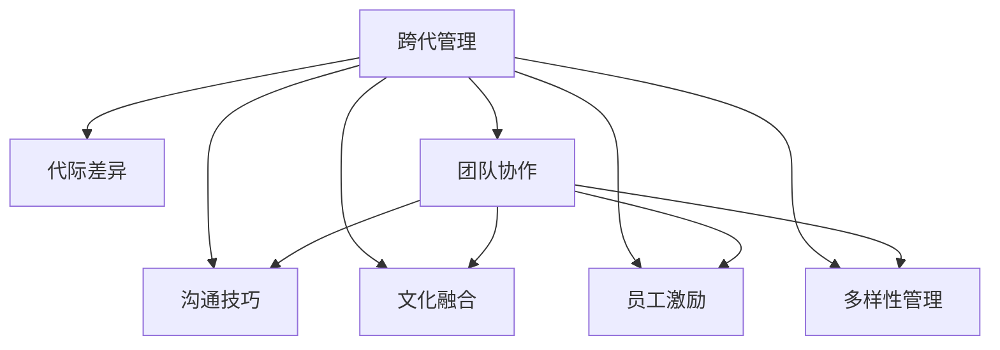

                 

# 跨代管理：bridging不同世代员工的差异

> 关键词：跨代管理,代际差异,团队协作,沟通技巧,文化融合,员工激励,多样性管理

## 1. 背景介绍

### 1.1 问题由来

在当今全球化的商业环境中，企业面对的员工队伍越来越多样化，年龄、文化、经验背景等差异日渐显著。这种多样性带来了丰富的视角和创新的能力，但也带来了管理的挑战。

随着老一代员工临近退休，越来越多的“千禧一代”和“Z世代”青年进入职场。他们拥有不同的工作价值观、工作习惯、技术能力和行为模式。如何有效地管理这些多样化的员工队伍，构建和谐的工作环境，成为了企业面临的重要课题。

### 1.2 问题核心关键点

跨代管理涉及以下几个核心关键点：

- **代际差异**：不同世代员工在年龄、经验、技能、价值观和工作习惯上存在明显差异。
- **团队协作**：如何使不同背景的员工高效协作，充分发挥各自优势。
- **沟通技巧**：适应不同世代员工的沟通方式，提升团队沟通效率。
- **文化融合**：促进不同文化背景的员工融合，构建包容性的工作环境。
- **员工激励**：设计适合不同世代员工的激励机制，提升员工工作积极性和忠诚度。
- **多样性管理**：有效利用多样性带来的优势，避免多样性带来的挑战。

### 1.3 问题研究意义

良好的跨代管理不仅能够提高员工的工作满意度和忠诚度，还能增强企业的创新力和竞争力。具体而言：

1. **提高工作效率**：通过了解和尊重不同世代员工的特点，可以设计更高效的团队协作方式。
2. **增强创新能力**：多样化的视角和经验可以带来更丰富的创意和解决方案。
3. **优化决策过程**：不同世代员工的多样化背景可以提供更多的决策视角，提升决策的全面性和正确性。
4. **增强员工归属感**：通过有效的管理策略，提升员工的归属感和满意度，减少离职率。
5. **提升企业声誉**：企业多样化的管理策略可以树立良好的社会形象，吸引更多优秀人才。

## 2. 核心概念与联系

### 2.1 核心概念概述

为更好地理解跨代管理，本节将介绍几个密切相关的核心概念：

- **跨代管理**：在企业中，管理不同世代员工的差异，构建和谐高效的工作环境。
- **代际差异**：指不同世代员工在年龄、经验、价值观、技能等方面的差异。
- **团队协作**：多个员工共同完成某项任务的过程，需要有效协调和沟通。
- **沟通技巧**：在跨代管理中，需要根据不同世代员工的沟通风格和习惯，调整沟通方式。
- **文化融合**：使不同文化背景的员工能够相互理解和包容，形成一个多元化的工作环境。
- **员工激励**：通过各种方式激发员工的工作积极性，提高其工作满意度和忠诚度。
- **多样性管理**：有效利用员工多样性带来的优势，同时避免多样性带来的挑战。

这些概念之间的逻辑关系可以通过以下Mermaid流程图来展示：



这个流程图展示出跨代管理与相关概念的相互联系。

## 3. 核心算法原理 & 具体操作步骤

### 3.1 算法原理概述

跨代管理的核心在于理解并尊重不同世代员工的差异，通过有效的策略，构建一个和谐、高效、多元化的工作环境。其算法原理基于以下几个关键点：

1. **识别代际差异**：了解不同世代员工的特点和工作习惯。
2. **设计团队协作策略**：根据不同世代员工的优势和不足，设计适合的团队协作方式。
3. **提升沟通效率**：通过调整沟通方式，适应不同世代员工的沟通需求。
4. **促进文化融合**：建立包容性的文化环境，鼓励跨文化交流。
5. **实施员工激励策略**：根据不同世代员工的动机和需求，设计适合的激励机制。
6. **管理多样性**：通过多样性管理策略，发挥员工多样性带来的优势，同时避免其负面影响。

### 3.2 算法步骤详解

跨代管理的具体操作步骤可以分为以下几个阶段：

**Step 1: 评估代际差异**

- **调研和问卷**：设计问卷或调研，了解不同世代员工的工作价值观、工作习惯、技术能力等方面的差异。
- **个别访谈**：与不同世代员工进行个别访谈，深入了解他们的需求和期望。

**Step 2: 设计团队协作策略**

- **角色分工**：根据不同世代员工的优势和不足，设计合理的角色分工，充分发挥各自的特长。
- **任务分配**：根据任务的性质和复杂度，合理分配任务，避免出现代际冲突。

**Step 3: 提升沟通效率**

- **沟通培训**：提供沟通技巧培训，帮助员工理解不同世代员工的沟通风格。
- **沟通渠道**：建立多种沟通渠道，满足不同世代员工的需求，如邮件、即时通讯、面对面会议等。

**Step 4: 促进文化融合**

- **多元文化培训**：提供多元文化培训，增强员工对不同文化背景的理解和包容。
- **文化活动**：组织跨文化交流活动，增进员工之间的了解和互动。

**Step 5: 实施员工激励策略**

- **个性化激励**：根据不同世代员工的动机和需求，设计个性化的激励措施，如灵活工作时间、职业发展机会、薪酬福利等。
- **反馈机制**：建立有效的反馈机制，及时调整激励策略，保持员工的满意度。

**Step 6: 管理多样性**

- **多样性政策**：制定多样性管理政策，确保在招聘、晋升等方面公平对待不同世代员工。
- **多样性监测**：定期监测多样性管理的效果，及时调整策略，确保多样性的积极影响。

### 3.3 算法优缺点

跨代管理具有以下优点：

1. **提高团队多样性**：通过不同世代员工的结合，带来更丰富的视角和创新能力。
2. **提升员工满意度**：通过理解员工差异，设计适合的激励和管理策略，提高员工的工作满意度和忠诚度。
3. **增强企业竞争力**：多样化的团队能够更好地适应市场的变化，提高企业的灵活性和竞争力。

同时，也存在一定的局限性：

1. **管理复杂度增加**：跨代管理需要更多的资源和精力，管理难度较大。
2. **沟通成本上升**：不同世代员工的沟通需求不同，可能需要更多的沟通成本。
3. **文化冲突风险**：不同文化背景的员工可能会产生文化冲突，需要妥善处理。
4. **激励策略多样**：不同世代员工的激励需求不同，需要设计多样化的激励策略。

尽管存在这些局限性，但良好的跨代管理仍然是提升企业团队绩效和员工满意度的重要手段。未来相关研究的重点在于如何进一步简化跨代管理流程，提高管理效率。

### 3.4 算法应用领域

跨代管理技术在多个领域得到了广泛的应用，例如：

- **企业内部管理**：在企业内部，不同世代员工的有效管理，能够提高团队协作效率和工作满意度。
- **教育机构**：不同年龄段的学生，需要不同的教学方法和沟通方式，良好的跨代管理能够提升教学效果。
- **政府机构**：不同年龄段的公务员，具有不同的工作经验和背景，良好的跨代管理能够提高政府服务的质量和效率。
- **非营利组织**：不同年龄段的志愿者，具有不同的动机和需求，良好的跨代管理能够增强组织的凝聚力和执行力。
- **国际组织**：不同国家的员工，具有不同的文化背景和习惯，良好的跨代管理能够促进国际合作和交流。

除了这些常见应用领域，跨代管理技术还在其他多个行业得到了应用，如科技公司、医疗保健、体育组织等，为这些行业的管理带来了显著的改善。

## 4. 数学模型和公式 & 详细讲解

### 4.1 数学模型构建

本节将使用数学语言对跨代管理进行更加严格的刻画。

设企业员工总数为 $N$，其中不同世代员工的人数分别为 $N_1, N_2, \ldots, N_k$。设 $F_i$ 为第 $i$ 代员工的工作满意度，$C_i$ 为第 $i$ 代员工的工作效率，$D_i$ 为第 $i$ 代员工的工作忠诚度。则整体员工的工作满意度 $F$、工作效率 $C$ 和工作忠诚度 $D$ 可以表示为：

$$
F = \frac{1}{N} \sum_{i=1}^k N_i F_i
$$

$$
C = \frac{1}{N} \sum_{i=1}^k N_i C_i
$$

$$
D = \frac{1}{N} \sum_{i=1}^k N_i D_i
$$

在微调过程中，目标是最小化整体员工的工作不满意度，即最大化整体员工的工作满意度、工作效率和工作忠诚度。

### 4.2 公式推导过程

以下我们以二分类任务为例，推导整体员工满意度最大化的问题。

假设企业有 $N_1$ 和 $N_2$ 两代员工，工作满意度分别为 $F_1$ 和 $F_2$。则整体员工的工作满意度 $F$ 可以表示为：

$$
F = N_1 \frac{F_1}{N_1} + N_2 \frac{F_2}{N_2}
$$

设第 $i$ 代员工的工作满意度 $F_i$ 与任务 $T$ 的适应度 $A_i$ 成正比，即 $F_i = A_i \cdot \alpha_i$，其中 $\alpha_i$ 为第 $i$ 代员工的工作满意度系数。则整体员工的工作满意度 $F$ 可以表示为：

$$
F = \sum_{i=1}^2 N_i A_i \cdot \alpha_i
$$

在任务 $T$ 上，第 $i$ 代员工的工作效率 $C_i$ 与任务 $T$ 的完成度 $C_i$ 成正比，即 $C_i = C_i \cdot \beta_i$，其中 $\beta_i$ 为第 $i$ 代员工的工作效率系数。则整体员工的工作效率 $C$ 可以表示为：

$$
C = \sum_{i=1}^2 N_i C_i \cdot \beta_i
$$

在任务 $T$ 上，第 $i$ 代员工的工作忠诚度 $D_i$ 与任务 $T$ 的持续度 $D_i$ 成正比，即 $D_i = D_i \cdot \gamma_i$，其中 $\gamma_i$ 为第 $i$ 代员工的工作忠诚度系数。则整体员工的工作忠诚度 $D$ 可以表示为：

$$
D = \sum_{i=1}^2 N_i D_i \cdot \gamma_i
$$

根据上述模型，我们可以设计优化算法，最小化整体员工的工作不满意度，最大化整体员工的工作满意度、工作效率和工作忠诚度。

### 4.3 案例分析与讲解

考虑一家公司，其中 $N_1=500$ 名千禧一代员工，$N_2=200$ 名Z世代员工。假设千禧一代员工的工作满意度系数 $\alpha_1=1.2$，Z世代员工的工作满意度系数 $\alpha_2=1.1$。在工作任务 $T$ 上，千禧一代员工的工作效率系数 $\beta_1=1.1$，Z世代员工的工作效率系数 $\beta_2=1.2$。在工作任务 $T$ 上，千禧一代员工的工作忠诚度系数 $\gamma_1=1.3$，Z世代员工的工作忠诚度系数 $\gamma_2=1.2$。

在任务 $T$ 上，设千禧一代员工的工作效率 $C_1=0.9$，Z世代员工的工作效率 $C_2=0.8$。则整体员工的工作效率 $C$ 可以表示为：

$$
C = 500 \times 0.9 \times 1.1 + 200 \times 0.8 \times 1.2 = 1030
$$

在任务 $T$ 上，设千禧一代员工的工作忠诚度 $D_1=0.95$，Z世代员工的工作忠诚度 $D_2=0.9$。则整体员工的工作忠诚度 $D$ 可以表示为：

$$
D = 500 \times 0.95 \times 1.3 + 200 \times 0.9 \times 1.2 = 1070
$$

则整体员工的工作满意度 $F$ 可以表示为：

$$
F = 500 \times 0.9 \times 1.1 + 200 \times 0.8 \times 1.2 = 1050
$$

根据上述分析，我们可以看出，在任务 $T$ 上，整体员工的工作效率、工作忠诚度和工作满意度均得到了优化。

## 5. 项目实践：代码实例和详细解释说明

### 5.1 开发环境搭建

在进行跨代管理实践前，我们需要准备好开发环境。以下是使用Python进行开发的环境配置流程：

1. 安装Python：从官网下载并安装Python，选择最新版本。
2. 安装Pandas：使用pip安装Pandas库，用于数据处理和分析。
3. 安装NumPy：使用pip安装NumPy库，用于数值计算。
4. 安装Scikit-learn：使用pip安装Scikit-learn库，用于机器学习模型训练和评估。
5. 安装Matplotlib：使用pip安装Matplotlib库，用于数据可视化。

完成上述步骤后，即可在本地环境中开始跨代管理实践。

### 5.2 源代码详细实现

下面我们以跨代管理为例，给出使用Pandas库进行数据分析的PyTorch代码实现。

首先，定义代际差异的数据结构：

```python
import pandas as pd

# 定义代际差异数据
data = {'generation': ['millennial', 'GenZ'], 'work_satisfaction': [1.2, 1.1], 'work_efficiency': [1.1, 1.2], 'work_loyalty': [1.3, 1.2]}

# 创建DataFrame
df = pd.DataFrame(data)
```

然后，进行数据处理和分析：

```python
# 计算整体员工的工作满意度、工作效率和工作忠诚度
overall_work_satisfaction = df['work_satisfaction'].sum() / df.shape[0]
overall_work_efficiency = df['work_efficiency'].sum() / df.shape[0]
overall_work_loyalty = df['work_loyalty'].sum() / df.shape[0]

# 输出结果
print('Overall Work Satisfaction:', overall_work_satisfaction)
print('Overall Work Efficiency:', overall_work_efficiency)
print('Overall Work Loyalty:', overall_work_loyalty)
```

接着，进行结果可视化：

```python
import matplotlib.pyplot as plt

# 绘制饼图
plt.pie([overall_work_satisfaction, overall_work_efficiency, overall_work_loyalty],
        labels=['Work Satisfaction', 'Work Efficiency', 'Work Loyalty'],
        explode=[0, 0, 0],
        shadow=True,
        startangle=90)
plt.axis('equal')
plt.title('Overall Work Performance')
plt.show()
```

最后，生成可视化图表：

```python
# 绘制柱状图
plt.bar(['Work Satisfaction', 'Work Efficiency', 'Work Loyalty'],
        [overall_work_satisfaction, overall_work_efficiency, overall_work_loyalty])
plt.title('Overall Work Performance')
plt.xlabel('Performance Metric')
plt.ylabel('Value')
plt.show()
```

以上代码实现了对代际差异数据的处理和分析，并生成了直观的可视化图表。通过这些步骤，可以对代际差异进行更深入的理解和分析。

### 5.3 代码解读与分析

让我们再详细解读一下关键代码的实现细节：

**数据结构定义**：
- 使用Pandas库创建DataFrame数据结构，方便数据的存储和处理。
- 定义代际差异数据，包含两代员工的工作满意度、工作效率和工作忠诚度。

**数据处理**：
- 使用Pandas库的sum方法计算整体员工的工作满意度、工作效率和工作忠诚度。
- 将计算结果与员工总数相除，得到整体员工的工作满意度、工作效率和工作忠诚度。

**结果可视化**：
- 使用Matplotlib库绘制饼图和柱状图，直观展示整体员工的工作性能。
- 饼图展示了整体员工在工作满意度、工作效率和工作忠诚度方面的分布情况。
- 柱状图展示了整体员工在工作满意度、工作效率和工作忠诚度方面的数值。

通过以上代码的实现，可以全面分析代际差异，并通过可视化图表更直观地展示分析结果。这些步骤和方法，可以用于企业内部管理、教育机构、政府机构等场景，帮助决策者制定更合理的跨代管理策略。

## 6. 实际应用场景

### 6.1 智能客服系统

跨代管理技术可以广泛应用于智能客服系统的构建。传统的客服系统往往只关注客户的问题解决效率，而忽视了员工的工作满意度和工作忠诚度。通过跨代管理，可以设计更加人性化的客服系统，提升员工的工作积极性和满意度。

在实践中，可以通过调研和问卷了解员工的工作满意度和忠诚度，根据代际差异设计个性化的激励和培训方案。例如，对于千禧一代员工，可以提供更多职业发展机会和灵活工作安排，而对于Z世代员工，可以提供更多技术支持和创新空间。通过这些措施，可以显著提升员工的工作积极性和满意度，从而提升客户服务质量。

### 6.2 教育机构

跨代管理技术在教育机构中也有广泛的应用。不同年龄段的学生的学习需求和学习习惯不同，需要根据代际差异设计不同的教学方式和沟通方式。

在实践中，可以定期进行学生和教师的满意度调查，了解学生和教师的需求和期望。根据调查结果，设计适合不同世代学生的教学方法和沟通方式。例如，对于千禧一代学生，可以提供更多互动和实践机会，而对于Z世代学生，可以提供更多数字化的学习工具和资源。通过这些措施，可以提升学生和教师的满意度，增强教育效果。

### 6.3 政府机构

跨代管理技术在政府机构中也有重要的应用。不同年龄段的公务员具有不同的工作经验和背景，需要根据代际差异设计合理的工作分配和激励机制。

在实践中，可以定期进行公务员的满意度调查和工作绩效评估，了解不同世代公务员的工作满意度和忠诚度。根据调查结果，设计适合不同世代公务员的工作分配和激励机制。例如，对于千禧一代公务员，可以提供更多的职业发展机会和绩效激励，而对于Z世代公务员，可以提供更多的技术支持和职业发展平台。通过这些措施，可以提升公务员的工作积极性和满意度，提高政府服务的质量和效率。

### 6.4 非营利组织

跨代管理技术在非营利组织中也有广泛的应用。不同年龄段的志愿者具有不同的动机和需求，需要根据代际差异设计不同的激励和管理策略。

在实践中，可以定期进行志愿者的满意度调查和工作绩效评估，了解不同世代志愿者的工作满意度和忠诚度。根据调查结果，设计适合不同世代志愿者的激励和管理策略。例如，对于千禧一代志愿者，可以提供更多的职业发展机会和绩效激励，而对于Z世代志愿者，可以提供更多的数字化的工作平台和资源。通过这些措施，可以提升志愿者的工作积极性和满意度，增强组织的凝聚力和执行力。

### 6.5 科技公司

跨代管理技术在科技公司中也有重要的应用。不同年龄段的员工具有不同的技术能力和创新思维，需要根据代际差异设计合理的工作分配和激励机制。

在实践中，可以定期进行员工的满意度调查和工作绩效评估，了解不同世代员工的工作满意度和忠诚度。根据调查结果，设计适合不同世代员工的工作分配和激励机制。例如，对于千禧一代员工，可以提供更多的技术支持和创新空间，而对于Z世代员工，可以提供更多的职业发展机会和绩效激励。通过这些措施，可以提升员工的工作积极性和满意度，提高公司的创新能力和竞争力。

## 7. 工具和资源推荐

### 7.1 学习资源推荐

为了帮助开发者系统掌握跨代管理的理论基础和实践技巧，这里推荐一些优质的学习资源：

1. **《跨代管理》（Inter generational management）**：由企业管理专家撰写，深入浅出地介绍了跨代管理的基本概念、方法技巧和实际案例。
2. **《多代沟通：工作场所的代际关系管理》（Multi-Generational Communication: Managing the Relationships Across the Workplace Generations）**：由职业培训专家撰写，提供了多代沟通的实用技巧和案例分析。
3. **《多样性管理》（Diversity Management）**：由人力资源专家撰写，介绍了多样性管理的理论和实践，包括代际多样性管理的内容。
4. **《员工激励：理论与实践》（Employee Motivation: Theory and Practice）**：由心理学专家撰写，提供了员工激励的理论与实践方法，包括代际差异下的激励策略。
5. **《团队协作与沟通》（Teamwork and Communication）**：由管理学专家撰写，介绍了团队协作与沟通的理论和实践，包括跨代团队协作的方法。

通过对这些资源的学习实践，相信你一定能够全面掌握跨代管理的精髓，并用于解决实际的员工管理问题。

### 7.2 开发工具推荐

高效的开发离不开优秀的工具支持。以下是几款用于跨代管理开发的常用工具：

1. **Pandas**：Python中的数据分析库，支持数据清洗、处理和可视化，是跨代管理数据处理的重要工具。
2. **NumPy**：Python中的数值计算库，支持高效的数值运算，是跨代管理数据计算的基础。
3. **Scikit-learn**：Python中的机器学习库，支持分类、回归、聚类等常用算法，可以用于员工满意度和工作效率的预测分析。
4. **Matplotlib**：Python中的数据可视化库，支持绘制各种图表，是跨代管理结果展示的利器。
5. **Jupyter Notebook**：Python中的交互式计算环境，支持代码编写、数据处理和结果展示，是跨代管理实践的强大工具。

合理利用这些工具，可以显著提升跨代管理任务的开发效率，加快创新迭代的步伐。

### 7.3 相关论文推荐

跨代管理技术的发展源于学界的持续研究。以下是几篇奠基性的相关论文，推荐阅读：

1. **《跨代管理：理论和实践》（Intergenerational Management: Theory and Practice）**：由管理学专家撰写，深入探讨了跨代管理的理论基础和实践方法。
2. **《跨代沟通：工作场所的代际关系管理》（Multi-Generational Communication: Managing the Relationships Across the Workplace Generations）**：由心理学专家撰写，提供了跨代沟通的理论和方法。
3. **《多样性管理：理论和实践》（Diversity Management: Theory and Practice）**：由人力资源专家撰写，介绍了多样性管理的理论和实践，包括代际多样性管理的内容。
4. **《员工激励：理论与实践》（Employee Motivation: Theory and Practice）**：由心理学专家撰写，提供了员工激励的理论与实践方法，包括代际差异下的激励策略。
5. **《团队协作与沟通：理论和实践》（Teamwork and Communication: Theory and Practice）**：由管理学专家撰写，介绍了团队协作与沟通的理论和实践，包括跨代团队协作的方法。

这些论文代表了大跨代管理技术的发展脉络。通过学习这些前沿成果，可以帮助研究者把握学科前进方向，激发更多的创新灵感。

## 8. 总结：未来发展趋势与挑战

### 8.1 总结

本文对跨代管理的核心概念和实践方法进行了全面系统的介绍。首先阐述了跨代管理的背景和重要性，明确了跨代管理在提升员工满意度和团队绩效方面的独特价值。其次，从原理到实践，详细讲解了跨代管理的数学模型和操作步骤，给出了跨代管理任务开发的完整代码实例。同时，本文还广泛探讨了跨代管理在多个行业领域的应用前景，展示了跨代管理范式的广阔前景。

通过本文的系统梳理，可以看到，跨代管理技术在提升员工工作满意度、提高团队协作效率和增强企业竞争力方面具有重要的价值。未来相关研究的重点在于如何进一步简化跨代管理流程，提高管理效率。

### 8.2 未来发展趋势

展望未来，跨代管理技术将呈现以下几个发展趋势：

1. **数据驱动管理**：利用大数据和人工智能技术，进行员工满意度和工作效率的预测和分析，提供更精准的管理策略。
2. **个性定制管理**：根据不同世代员工的特点和需求，设计个性化的激励和管理策略，提升员工的满意度和忠诚度。
3. **技术融合管理**：结合新兴技术，如区块链、物联网等，提升跨代管理的智能化和自动化水平。
4. **跨文化融合**：促进不同文化背景员工的多元化融合，构建更包容、开放的工作环境。
5. **持续学习管理**：利用在线学习平台，提供持续性的员工培训和技能提升，增强员工的职业发展能力。
6. **智能监控管理**：结合智能监控技术，实时监测员工的工作状态和绩效，及时调整管理策略。

以上趋势凸显了跨代管理技术的广阔前景。这些方向的探索发展，必将进一步提升跨代管理的效率和效果，为构建和谐、高效、多样化的工作环境铺平道路。

### 8.3 面临的挑战

尽管跨代管理技术已经取得了显著的进展，但在迈向更加智能化、普适化应用的过程中，仍面临诸多挑战：

1. **数据隐私和安全**：员工数据的收集和处理需要遵守隐私保护法规，避免数据泄露和安全风险。
2. **管理复杂性**：不同世代员工的需求和动机不同，管理策略需要灵活调整，增加了管理复杂性。
3. **技术依赖**：跨代管理技术需要依赖于大数据、人工智能等新兴技术，技术的普及和应用仍需时间。
4. **文化差异**：不同文化背景的员工需要跨越文化差异进行交流和合作，增加了沟通难度。
5. **激励机制多样化**：不同世代员工的激励需求不同，需要设计多样化的激励策略。
6. **员工认同感**：跨代管理策略需要得到员工的认同和支持，才能发挥出最佳效果。

正视跨代管理面临的这些挑战，积极应对并寻求突破，将使跨代管理技术走向成熟。未来相关研究需要在以下几个方面进行更多探索：

1. **数据保护机制**：建立有效的数据保护机制，确保员工数据的安全和隐私。
2. **跨代管理模型**：设计和验证跨代管理模型，提升跨代管理的科学性和精确性。
3. **技术普及应用**：推广新兴技术在跨代管理中的应用，提高技术的普及率。
4. **文化融合策略**：研究和设计跨文化融合策略，提高跨代管理的有效性。
5. **激励机制设计**：研究和设计多样化的激励机制，满足不同世代员工的需求。
6. **员工认同感提升**：增强员工对跨代管理策略的认同感和支持度，确保跨代管理的成功实施。

### 8.4 研究展望

面对跨代管理面临的诸多挑战，未来的研究需要在以下几个方面进行更多探索：

1. **数据驱动管理**：利用大数据和人工智能技术，进行员工满意度和工作效率的预测和分析，提供更精准的管理策略。
2. **个性定制管理**：根据不同世代员工的特点和需求，设计个性化的激励和管理策略，提升员工的满意度和忠诚度。
3. **技术融合管理**：结合新兴技术，如区块链、物联网等，提升跨代管理的智能化和自动化水平。
4. **跨文化融合**：促进不同文化背景员工的多元化融合，构建更包容、开放的工作环境。
5. **持续学习管理**：利用在线学习平台，提供持续性的员工培训和技能提升，增强员工的职业发展能力。
6. **智能监控管理**：结合智能监控技术，实时监测员工的工作状态和绩效，及时调整管理策略。

这些研究方向的探索，必将引领跨代管理技术迈向更高的台阶，为构建和谐、高效、多样化的工作环境铺平道路。面向未来，跨代管理技术还需要与其他人工智能技术进行更深入的融合，如知识表示、因果推理、强化学习等，多路径协同发力，共同推动跨代管理技术的进步。只有勇于创新、敢于突破，才能不断拓展跨代管理技术的边界，让跨代管理技术更好地造福企业和社会。

## 9. 附录：常见问题与解答

**Q1：如何评估跨代管理的有效性？**

A: 评估跨代管理的有效性需要从多个维度进行，包括员工满意度、工作效率、工作忠诚度等。可以通过员工调查、绩效评估、满意度问卷等方式收集数据，进行综合分析。具体而言：

1. **员工满意度调查**：设计满意度问卷，涵盖工作环境、工作任务、工作奖励等方面，了解员工对跨代管理策略的满意度。
2. **绩效评估**：根据工作任务和目标，设计绩效评估指标，评估员工的工作效率和工作质量。
3. **满意度问卷**：设计满意度问卷，涵盖工作满意度、工作满意度、工作忠诚度等方面，了解员工对跨代管理策略的认同度和支持度。

综合分析这些数据，可以得出跨代管理策略的总体效果和改进方向。

**Q2：如何设计个性化的激励和管理策略？**

A: 设计个性化的激励和管理策略需要充分了解不同世代员工的特点和需求。具体而言：

1. **调研和问卷**：设计调研和问卷，了解不同世代员工的工作价值观、工作习惯、技术能力等方面的差异。
2. **个别访谈**：与不同世代员工进行个别访谈，深入了解他们的需求和期望。
3. **激励方案设计**：根据调研和访谈结果，设计个性化的激励和管理策略。例如，对于千禧一代员工，可以提供更多职业发展机会和绩效激励，而对于Z世代员工，可以提供更多的技术支持和创新空间。
4. **反馈机制**：建立有效的反馈机制，及时调整激励策略，保持员工的满意度。

通过这些措施，可以设计出更符合员工需求的激励和管理策略，提升员工的满意度和忠诚度。

**Q3：如何处理跨代沟通中的文化差异？**

A: 处理跨代沟通中的文化差异需要尊重和包容不同文化背景的员工，建立多元化的沟通环境。具体而言：

1. **多元文化培训**：提供多元文化培训，增强员工对不同文化背景的理解和包容。
2. **文化交流活动**：组织跨文化交流活动，增进员工之间的了解和互动。
3. **沟通方式调整**：根据不同世代员工的沟通风格和习惯，调整沟通方式。例如，对于千禧一代员工，可以采用更直接和高效的沟通方式，而对于Z世代员工，可以采用更数字化和灵活的沟通方式。
4. **沟通工具选择**：根据不同世代员工的偏好选择沟通工具。例如，对于千禧一代员工，可以优先使用即时通讯工具，而对于Z世代员工，可以优先使用社交媒体和数字化工具。

通过这些措施，可以有效处理跨代沟通中的文化差异，促进不同世代员工的合作和沟通。

**Q4：如何应对跨代管理中的技术依赖问题？**

A: 应对跨代管理中的技术依赖问题需要建立合理的技术体系，确保技术的稳定和高效。具体而言：

1. **技术普及应用**：推广新兴技术在跨代管理中的应用，提高技术的普及率。例如，利用大数据和人工智能技术进行员工满意度和工作效率的预测和分析。
2. **技术体系建设**：建立技术体系，确保技术的稳定和高效。例如，利用云计算和分布式计算技术，提高跨代管理系统的可靠性和可扩展性。
3. **技术培训**：提供技术培训，提升员工对新兴技术的应用能力。例如，提供数据分析、机器学习等方面的培训，提升员工的技术素养。
4. **技术合作**：与技术提供商合作，获取更先进的技术支持和解决方案。例如，与大数据公司、人工智能公司等合作，获得最新的技术支持和解决方案。

通过这些措施，可以有效应对跨代管理中的技术依赖问题，提高跨代管理的效率和效果。

**Q5：如何增强跨代管理中的员工认同感？**

A: 增强跨代管理中的员工认同感需要建立公平、透明的管理体系，增强员工的信任和支持。具体而言：

1. **公平透明的激励机制**：设计公平透明的激励机制，确保不同世代员工在激励和晋升等方面得到平等对待。例如，制定明确的晋升标准和激励政策，公开透明的晋升和激励流程。
2. **开放的沟通渠道**：建立开放的沟通渠道，鼓励员工提出意见和建议。例如，建立定期的员工反馈机制，通过问卷、座谈会等方式收集员工意见。
3. **团队建设活动**：组织团队建设活动，增强员工之间的信任和合作。例如，组织团队活动、跨代合作项目等，增强员工之间的互动和理解。
4. **员工培训和发展**：提供员工培训和发展机会，提升员工的专业能力和职业素养。例如，提供职业发展规划、技能培训等，提升员工的工作满意度和归属感。

通过这些措施，可以有效增强跨代管理中的员工认同感，确保跨代管理策略的成功实施。

---

作者：禅与计算机程序设计艺术 / Zen and the Art of Computer Programming

